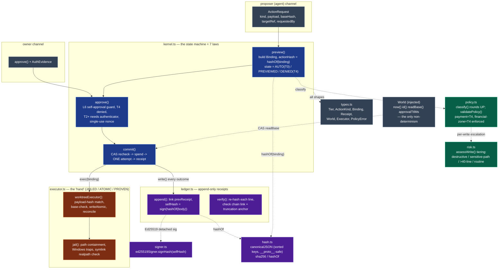

# Zeno — current implementation context

> Evidence snapshot: 15 September 2026 IST. Canonical repository: `D:\Code\Zeno`; branch `phase-0-and-p1-01-kernel`; verified working tree based on commit `c79f5f2f59ba11d04ceb18d84a6ed8e9f06f6642`. The verification includes uncommitted product and test changes, so preserve the complete dirty-path list with any result and do not describe it as commit-bound. An *ordinary edit to an ordinary file inside the sandbox* auto-applies (tier T0) and is still receipted, while destructive writes, sensitive paths (config/keys/`.git`/`CLAUDE.md`), rewrites over the 40-line budget, credentials, and every egress or shell action still stop and wait for one exact human approval — see `packages/kernel/src/risk.ts`. The current code was exercised with `npm run app`; no current signed installer or public deployment has been accepted.
>
> This is the short, AI-readable map, written to be pasted into another AI as project context — so it explains its own jargon inline the first time a term appears. The current source and the retained executable evidence win if an older design note disagrees. A configured URL or a stale packaged binary is not proof that current code is deployed.
>
> Vocabulary used throughout, defined once: **loopback** = a local-only network address (`127.0.0.1`) no other machine can reach. **Daemon** = a long-running background process; here the local server that owns Zeno's state. **SSE (Server-Sent Events)** = a one-way stream where the server pushes messages to the browser over one held-open HTTP connection. **MCP (Model Context Protocol)** = an open standard for exposing tools/data to an AI model over a defined interface. **Agentic loop** = the cycle of an AI model reading context, proposing an action, and acting, repeatedly. **Content-addressed** = identified by a hash of the content itself, so any change changes the identity. **CAS (compare-and-swap)** = only apply a change if the underlying state still matches what it was when the change was prepared. **RAG (retrieval-augmented generation)** = answering by first retrieving source snippets and grounding the answer in them; Zeno does the retrieval-and-cite part with plain keyword search, not vector embeddings.

## Product contract

Zeno is a Windows-first, local-first personal intelligence suite. Command is the home, search, memory, status, and approval surface. Forge is a governed coding-agent workbench. Counsel is a consent-gated meeting notebook with cited post-meeting Q&A. All three share a loopback daemon, a deterministic policy kernel, Vault, capability limits, one-attempt approvals, and a signed receipt ledger. Zeno aims for a familiar Devin/Cursor-style workbench while retaining its own Glass visual language and stricter effect boundary; current evidence does not establish full parity with those products.

## Architecture and end-to-end flow

```text
owner -> Electron shell -> nonce-authenticated loopback daemon
      -> Command / Forge / Counsel renderers
      -> bounded context + policy kernel
      -> provider or deterministic local subsystem
      -> held proposal capsule
      -> exact owner approval + compare-and-swap recheck
      -> one executor attempt -> signed, hash-chained receipt
```

Electron owns the single-instance lock, project/workspace selection, application zoom, context-isolated preload bridge, microphone/Whisper lifecycle, meeting-title discovery, and daemon process. A fresh profile boots into Graphite dark before CSS is parsed; saved System, Glass Dawn, or Graphite choices still win on later launches. The daemon owns canonical state and exposes scoped loopback APIs plus SSE invalidation signals. Models may read bounded context and propose effects; they receive no approval capability.

Command is the orchestrator surface, not just a chat box. The owner talks to Command; Command drives every Forge agent. Describing a task in Command's composer and pressing "Run in Forge now" dispatches a real, governed Forge session (a browser event `zeno:command-run` opens a new session and sends the task exactly as if it had been typed in Forge — a hosted provider still shows its own per-run confirmation; nothing auto-runs an effect). Command Home's right rail then shows the live status of every running agent — agent, model, orchestration phase, percent, with Cancel and Open — read from the daemon's owner-only progress stream. The Standing Field (the "orb") renders each running agent as a live node the owner can click for its phase/percent/elapsed. All three live views of that one stream — Command's Running rail, Forge's own in-session progress line, and the orb's run nodes — subscribe to a SINGLE shared `EventSource` to `/forge/run-progress` (see `run-progress-stream.js`); they previously each opened their own connection, which, with the `/stream` state feed, spent four of a browser's ~6-per-origin HTTP/1.1 sockets and starved a second window's requests. One stream, many subscribers, is both leaner and the fix for that starvation.

Adding capabilities uses a Claude-Code-style "Discover / Add" chooser (a Yours tab for what is installed, a Discover tab of a curated catalog with "+ Add" cards) for Connectors, MCP servers, Skills, and Rules. The MCP catalog includes a Figma template; MCP configuration stores environment-variable NAMES only, never secret values, and adding one writes real config rather than a placeholder. Rules are real: the daemon reads `ZENO.md` and repository rules through `/forge/context`.

Forge runs Claude Code, Codex, or a discovered Ollama model in a disposable worktree. The selected repository does not change while the model runs. Valid file output becomes a held capsule, and approval revalidates its target/base/context hashes. The Editor view now keeps multiple closeable file tabs in two real Monaco groups, with independent cursor/viewport state, focus-aware Explorer/Search, governed save, dirty-close confirmation, resizable split, keyboard group focus, persisted layout, and mobile collapse. Agent view uses the same sessions. Terminal tabs are bounded one-shot processes, not persistent PTYs; Tests runs discovered safe scripts; external VSIX, debugger, and CI hosts are not wired.

Codex is invoked with `codex exec --ephemeral --ignore-user-config --strict-config`, and Zeno disables ambient MCP and web configuration for that run. This is narrower than complete ambient isolation: the installed Codex binary still attempted to discover globally installed Agent Skills, and one malformed global canvas skill was observed in the log. Treat global skill discovery as an open boundary until it is explicitly blocked or allowlisted; do not claim that all ambient user material or skills are disabled.

Ask Zeno sends typed or locally transcribed questions to the bounded assistant route and can delegate a task to Forge. Local system speech synthesis can read the reply. Voice capture uses local `whisper.cpp` when installed. Hold-to-talk records while held; Listen for Zeno transcribes bounded segments then requires the wake phrase at the first token. A spoken add-task command uses authenticated `POST /work` and reports success only after the daemon returns a non-empty item id with the exact title. Zeno does not identify the speaker, so clear nearby speech can become a turn while voice conversation is active. Counsel takes exclusive microphone ownership, requires declared consent, saves transcript text only, extracts cited items deterministically, and enables cited Q&A only after the meeting is ended and saved.

Vault stores readable Markdown memories and uses transparent keyword retrieval with citations. It has no embeddings, vector database, hidden cross-chat profile, or provider key. Owner-authored records may be written directly; agent-authored memory remains a governed effect.

## Code map

| Path | Responsibility |
| --- | --- |
| `packages/kernel/src` | risk classification, preview binding, single-use approvals, CAS execution, and receipt ledger — deliberately KEPT through the size refactor (~2,500 lines); it is the product's whole point, not bloat |
| `packages/desktop` | Electron lifecycle, preload boundary, local Whisper, zoom, meeting titles, and packaging entry point |
| `packages/daemon/src` | loopback API, scoped tokens, SSE, canonical state, and subsystem orchestration. `server.ts` is now a ~420-line router; the request handlers live in ~27 focused modules under `src/routes/` (e.g. `approvals.ts`, `assistant.ts`, `memory.ts`, `state.ts`, `stream.ts`, `static.ts`, and the `forge-*` family) plus shared plumbing in `src/server/` (`context.ts`, `options.ts`) |
| `packages/daemon/public` | Command, Forge, Counsel, Voice, Vault, settings, and Glass UI. `index.html` loads only three scripts (`theme-boot.js`, `ui.js`, `bind.js`); `bind.js` dynamically imports one binder per feature, each split into its own directory once it grew — `bind/forge/`, `bind/lists/`, `bind/counsel/`, `bind/voice/`, `bind/settings/`, the orb under `field/`, plus `bind/orchestrator.js` and the shared `run-progress-stream.js` |
| `packages/forge/src` | provider registry/routing, isolated worktrees, output parsing, permission gate, and held edits |
| `packages/assistant/src` | bounded snapshot, grounding, citations, and inert intent classification |
| `packages/voice/src` | wake matching, command grammar, retention, and capture state |
| `packages/counsel/src` | transcript model, deterministic extraction, citations, and post-meeting Q&A |
| `packages/vault/src` | Markdown memory, keyword recall, context assembly, and governed writes |
| `packages/skills/src; packages/mcp/src` | untrusted skill screening and bounded read/propose tool surface |
| `electron-builder.json; .github/workflows/ci.yml` | Windows portable/NSIS packaging and the Windows Node 22 quality gate |

## Invariants and trust boundaries

- A model cannot approve its own action; Tier 4 payment/biometric effects remain unreachable.
- Approval binds exact payload, capability, target, context hash, and base state; stale state refuses before execution.
- One approval permits one attempt. Only executor return can create a durable receipt.
- File effects stay inside the selected project after path, symlink, and junction checks.
- Project files, Vault records, skills, web/MCP content, transcripts, and model output are untrusted data, never authority.
- Hosted provider and browser egress is explicit per run; local Ollama/Whisper use loopback and do not imply zero hardware cost.
- Counsel requires declared consent, captures microphone input only, and cannot answer live interview/meeting questions.

## User workflows to preserve

- Navigate every Command rail item; inspect meaningful orb nodes, provider/model locality, pending work, receipts, Vault, integrations, devices, and modern settings.
- Ask by text or voice; inspect grounded citations or an explicit ungrounded label; hear an optional system-voice reply; delegate a real task to Forge without bypassing hosted confirmation.
- Switch Forge Agent/Editor, create/select sessions, run two local sessions independently, cancel the exact run, and review answer-only versus edit output.
- Open several Explorer/Search files, split to a second Monaco group, focus groups, edit/save the exact active file through previews, test dirty-close refusal, restore/unsplit, and verify mobile collapse.
- Run bounded Terminal tabs, a discovered test script, skills/rules selection, extension/theme catalog, and run-scoped MCP connector inventory; verify honest unwired labels.
- Use hold-to-talk, first-utterance wake, ordinary-speech non-trigger, capture handoff, and explicit microphone close.
- Start Counsel only after preflight/consent, label speakers manually, end/save, inspect cited decisions/actions, ask a saved-call question, delete with confirmation, and verify discard writes nothing.

## Concepts this project teaches

| Concept | How it appears here |
| --- | --- |
| Capability security | separate scoped tokens and model-facing read/propose tools keep authority out of prompts |
| Content-addressed actions | canonical payload/context/base hashes define what one approval means |
| Optimistic concurrency | compare-and-swap rejects a held change when the base has moved |
| Event sourcing and tamper evidence | post-execution receipts form an Ed25519-signed hash chain |
| Process isolation | Electron, daemon, Whisper, provider runners, and disposable worktrees have explicit lifecycles |
| Local speech pipeline | PCM16/WAV bounds, VAD/pre-roll, local inference, wake grammar, and explicit capture ownership |
| Grounded retrieval | keyword memory and transcript Q&A preserve inspectable citations without embeddings |
| IDE state modeling | tabs, split groups, dirty state, focus, persisted layout, and save target are separate state machines |
| Orchestration / fan-out | Command opens and tracks many Forge agents from one surface; the daemon's `/forge/run-progress` stream is the single source of truth for live status |
| Stream multiplexing | one shared SSE `EventSource` fans out to several UI subscribers instead of one connection each — leaner, and it fixed real HTTP/1.1 per-origin socket exhaustion across windows |

## Trending terms explained (glossary)

Every buzzword and CS term this document (or the codebase) leans on, defined plainly. If you feed this
file to another AI, this is the section that lets it reason about Zeno without guessing.

- **Zeno (the core concept)** — a deterministic **approval kernel**: a small, pure state machine that
  every consequential action an AI agent wants must pass through. It does four things and nothing
  else: (1) *classify* the action into a risk tier, (2) *hold* the risky ones as a "proposal" until a
  human approves the exact action, (3) re-check the world hasn't changed and run the effect **exactly
  once**, (4) write a signed, tamper-evident **receipt**. Its defining property: a model can *propose*
  anything but can *approve* nothing. Everything else in the product (Command, Forge, Counsel) is a UI
  on top of this one gate.
- **Approval kernel / policy kernel** — the component above (`packages/kernel/src`). "Kernel" in the
  OS sense: the trusted core that mediates access to effects, kept small and auditable (~2,500 lines).
- **Held proposal / capsule** — an action the kernel has classified as risky and is holding, not yet
  executed. The UI renders it as a "capsule" showing the summary, action hash, tier, and target.
- **Content-addressed** — identified by a hash of the content itself, so any change to the content
  changes its identity. Zeno hashes the action's `Binding` (payload + base + target + kind + tier +
  provenance); that hash *is* the action's `actionHash`. You approve a hash, so you can't approve one
  thing and have a different thing execute.
- **CAS (compare-and-swap)** — apply a change only if the underlying state still matches what it was
  when the change was prepared. At commit time the kernel re-reads the current base hash; if it
  drifted, it refuses and — importantly — does **not** spend the approval, so the owner can re-preview
  against the new base. This is optimistic-concurrency control borrowed from lock-free programming.
- **Single-use approval** — one approval authorizes one execution attempt, not a standing permission.
  The approval carries a private kernel-issued **nonce** and an expiry; it's spent *before* the
  attempt so a crash can't yield a reuse.
- **Tiers T0–T4** — the five risk levels. **T0** = no external effect / ordinary sandbox write
  (auto-applies). **T1** = local but consequential (scoped patch, `vcs.commit`, `memory.write`).
  **T2** = bytes leave the machine (`net.fetch`, `vcs.push`, `message.send`, `jira.write`); first tier
  that demands an authenticator. **T3** = run-anything / broad blast radius (`shell.exec`,
  `settings.change`, `vcs.mr`, `destructive`). **T4** = payment / anything touching the `financial`
  data zone — *permanently prohibited, no toggle, no approval path*.
- **Fail-closed / round up on ambiguity** — when classification is unsure (an unknown action kind or
  data zone), it escalates to the *most* restrictive outcome (T4), never the least. The opposite —
  fail-open — is the mistake that lets an unclassified new tool auto-execute.
- **Ed25519** — a modern public-key signature scheme (an elliptic curve). The kernel signs each
  receipt's hash with a private key that never leaves the machine; anyone with the *public* key can
  verify the whole ledger but cannot alter it. Chosen partly because its signatures are deterministic,
  so a signed ledger stays byte-identical across a replay.
- **Hash chain / tamper-evident ledger** — an append-only log where each entry stores the hash of the
  previous entry, so editing, deleting, or truncating any entry breaks the links downstream and
  `verify()` reports the first broken index. "Tamper-evident" (you can detect tampering) becomes
  "tamper-**proof**" (you can't forge it undetected) once the Ed25519 signature is added, because a
  forger who recomputes the hashes still can't produce a valid signature.
- **Truncation anchor (writeHead)** — a small separate record of "how many receipts and what the tip
  hash is", because a pure hash chain cannot detect its own *tail* being cut off (the remaining prefix
  is still self-consistent).
- **Capability security / capability token** — authority is carried by unforgeable tokens, not by
  identity or ambient permission. Zeno mints two scoped tokens: an **owner token** (can approve) and a
  **proposer token** (can read + propose, approves nothing). The model only ever holds the latter.
- **Loopback** — the local-only network address `127.0.0.1` that no other machine can reach. The
  daemon binds here and nowhere else, so there is zero inbound network surface.
- **Daemon** — a long-running background process; here the local HTTP server that owns Zeno's
  canonical state and mediates every request.
- **Nonce** — a single-use random value. The daemon prints a per-boot nonce in its URL so a browser
  session must present it; the kernel issues a per-approval nonce that a valid approval must match.
- **SSE (Server-Sent Events)** — a one-way stream where the server pushes messages to the browser over
  one held-open HTTP connection. Zeno uses it to invalidate/refresh UI state and to fan out live run
  progress. `Last-Event-ID` lets a dropped stream resume without silently missing events.
- **MCP (Model Context Protocol)** — an open standard for exposing tools/data to an AI model over a
  defined interface. Zeno ships its own MCP server that can *propose and read, never approve*, and
  runs Forge with `--strict-mcp-config` so no ambient third-party MCP server joins a run.
- **Agentic loop** — the cycle of an AI model reading context, proposing an action, and acting,
  repeatedly. Zeno's point is to interpose the kernel on the "acting" step.
- **Devin-feel pivot** — the deliberate move (commit `3b4d086`) to let *routine* agent edits
  auto-apply (like Devin/Cursor feel fast and unobtrusive) while keeping destructive/egress/config
  actions gated. Named after the coding-agent products it aims to feel like. The trade is documented
  in `risk.ts`: a leaked proposer token can now cause small sandbox edits directly, but all are
  receipted and none can escape the jail.
- **Worktree** — a `git worktree` is a second working directory attached to one repo. Forge runs each
  agent in a **disposable** worktree, so the selected repo never changes while the model runs; only
  approved file output reaches it.
- **Jailed / path jailing** — file effects are confined to the project root after path, symlink, and
  junction checks, so a write can't escape via `..`, a symlink, or a Windows junction.
- **Executor** — the only code the kernel lets touch the real world, and only inside `commit()`, after
  CAS passes, exactly once. Zeno has a file executor and a git executor.
- **World (injected)** — the kernel never calls `Date.now`, `Math.random`, or the network directly;
  all non-determinism arrives through an injected `World` object (clock, id generator, base reader).
  This is dependency injection, and it's what makes runs **replayable**: swap in a recorded world and
  the same inputs produce a byte-identical ledger.
- **Property-based testing** — instead of hand-written examples, tests generate hundreds of randomized
  inputs and assert an invariant holds for all of them. Zeno's seven laws are property-tested over 400
  rounds each plus a 1,200-iteration fuzz.
- **RAG (retrieval-augmented generation)** — answering by first retrieving source snippets and
  grounding the answer in them. Vault does the retrieve-and-cite part with plain keyword search (no
  vector embeddings), so every answer carries a clickable citation the owner can audit.
- **CRDT / LWW-Map** — Conflict-free Replicated Data Type; a Last-Writer-Wins Map is one where
  concurrent edits from two devices merge deterministically without a central server. Zeno's mesh uses
  it for convergent replication between paired devices.
- **X25519 + SAS pairing / AES-GCM envelopes** — the mesh's crypto: X25519 is an elliptic-curve key
  exchange; SAS (Short Authentication String) is the human-comparable code that confirms two devices
  paired without a man-in-the-middle; AES-GCM is authenticated encryption used to seal the messages.
- **Egress** — bytes leaving the machine (a web fetch, a hosted-model call, a push). In Zeno every
  egress path is explicit, per-run, tiered T2+, and off by default.
- **Electron / Monaco / Ollama / whisper.cpp** — Electron is the framework that wraps an HTML UI in a
  native desktop window (same as VS Code); Monaco is VS Code's editor component, used in Forge; Ollama
  is a local LLM runtime Zeno drives over loopback; whisper.cpp is a local speech-to-text engine used
  for voice/Counsel when the owner installs it.
- **VAD (voice activity detection)** — detecting when someone is actually speaking to trim silence;
  note it is *not* speaker identification, so Zeno cannot tell *who* is talking.
- **Nonce-authenticated / owner vs proposer role** — a request's role is decided by which token it
  presents; the `/approvals` route rejects any non-owner role with `403 self-approval-forbidden`
  before doing anything else.

## CI, packaging, deployment, and rollback

`npm run check` executes all 16 workspace gates. `npm run build` compiles the workspace chain and vendors Monaco/Voice/Glass assets. `npm run build:app` runs electron-builder and emits an x64 portable executable and NSIS installer under `dist-app`. `.github/workflows/ci.yml` runs on Windows with Node 22 and rejects unexpected external runtime dependencies; it does not package or publish a release.

The last packaged runtime build (pre-refactor, `db674c0`) emitted `Zeno-0.1.0-x64-portable.exe` (`4F23B7C053E8BE63398A564069901B2FE12107787B279D564393912373B0EBE1`) and `Zeno-Setup-0.1.0-x64.exe` (`3653BDF41934921985DEF7AB49BBFF40A402D7C79EF880FD185989407266A322`). Its packaged `index.html` and `theme-boot.js` byte-match the clean sources at `db674c0bd1112786eae70bbbce2ec39e44365b52`; the build itself preceded the commit and its probe JSON does not embed a Git SHA, so this is a byte-level binding for the dark bootstrap files rather than a reproducible-build claim for every packaged byte. The dark packaged renderer passed 21/21 interaction checks, a new profile booted Graphite dark, and saved System/Light/Dark choices still round-tripped. The retained physical hold-to-talk run came from the immediately preceding F10 package; `db674c0` changed only theme bootstrap and its source test, not voice, provider, kernel, or daemon logic. This proves the named artifacts and journeys, not certificate trust, a clean-profile installer/uninstaller, updater behavior, public distribution, or rollback compatibility. Zeno has no public web deployment. Test install/launch/uninstall on a clean Windows profile and sign a release before public distribution. Roll back with a previously verified executable while preserving a format-compatible copy of workspace data and keys.

## Current measured evidence

### Current working tree (15 September 2026)

These results cover the working tree based on `c79f5f2`. Because it is dirty, retain the path list and evidence files with the result; a later commit must rerun the gates before inheriting the claim.

| Result | How it was produced |
| --- | --- |
| End-to-end renderer suite: **26 flow scripts**, **23 passed, 0 failed, 3 blocked**. The passing set includes Command chat/navigation, governed proposals, stale-proposal cleanup, orb/live updates, Vault memory, Settings persistence, Forge run/editor/terminal/project explorer, plan-first execution, dynamic skills/rules and Lens context, call banner, CTA sweep, stress, and orchestration. The three honest blocks are Counsel physical audio, Voice physical audio, and Work/Devices pairing with a second Zeno client. | `node packages/daemon/e2e/run.mjs` — each flow boots an isolated daemon and drives the real renderer; evidence under `evidence/<sha>/e2e/` |
| `cta-sweep`: every visible control across Command/Forge/Counsel and the Settings/model-picker/`+`-menu overlays either produced a real effect or was honestly disabled — no silent no-op button anywhere. Three genuine gaps this pass caught and fixed: the editor status footer (Problems/Ports/exit) showed with no editor in Agent mode (now hidden), and the sweep's own detector was taught to credit toggle-state and redundant view-switch effects. | flow `19-cta-sweep` |
| `stress`: 12 concurrent proposals, rapid approve/refuse, and a screen-switch race left the kernel and receipt chain consistent (15/15). | flow `20-stress` |
| `orchestrator`: a Command task really opened and started a new Forge session and the live `.orch-runs` status tracked it (9/9). | flow `21-orchestrator` |
| Daemon package gate **200/200**. Forge context/capability fixtures passed 17/17; plan-first and Forge-run fixtures passed 62/62 each; add-capabilities passed 52/52. The capability flow now proves that installed skills begin unselected and enter a run only after deliberate opt-in. | `npm test -w @abheet19/zeno-daemon`; focused scripts under `packages/daemon/scripts` and `evidence/c79f5f2/e2e/` |
| Actual Electron profile: owner bridge and local Whisper installation detected; pending approvals 0; orb animation advanced by 0.454 radians; `qwen3:14b` answered `2 + 3` normally; Command repository overview matched the active Forge branch/head; Forge folder selection, Agent/Editor views, terminal, Vault, and Work loaded without console errors. A second live interaction sweep verified rapid Enter deduplication, 32 real slash commands, Work-filter persistence, Settings → model manager, and hosted-route → **Run locally instead** → `qwen3:8b` reading `package.json` and answering `@abheet19/zeno-workspace`. | `%USERPROFILE%\OneDrive\Documents\ChatGPT\code\verification-work\portfolio-release-20260910\ZENO_ACTUAL_PROFILE_CDP_CHECK_20260915.json`, `ZENO_ACTUAL_PROFILE_COMMAND_MODEL_20260915.json`, `ZENO_ACTUAL_PROFILE_FORGE_20260915.json`, and `ZENO_FINAL_INTERACTION_CHECK_20260915.json` |

The three blocks are environment limits, not passes: the automated paths cannot prove live microphone capture or a real second client. Installed Whisper assets and a working speech bridge prove provisioning only. No formal WCAG certification, physical-device matrix, load capacity, or packaged-release acceptance follows from these results.

### Packaged build (pre-refactor, `db674c0`, 10 September 2026)

These rows describe the last PACKAGED installer. They predate the refactor above, so they bind the older code, not the current tree; a fresh package has not been re-verified since.

| Result | Evidence |
| --- | --- |
| Exact post-dark implementation gate: 16 workspace summaries, 1,456 tests, 1,454 passed, 2 explicit Windows symlink skips, 0 failed | `%USERPROFILE%\OneDrive\Documents\ChatGPT\code\verification-work\zeno-release-db674c0-check.log` (SHA-256 `79BF6C66FBE53A5FAA934D8831878C30BF9E68ED350685D8B8650CE79B405AA4`) |
| Fresh-profile theme bootstrap: Graphite dark before CSS; System, Light, and Dark saved choices each round-tripped; zero page/console errors | `%USERPROFILE%\OneDrive\Documents\ChatGPT\code\verification-work\zeno-packaged-dark-default-report.json` (SHA-256 `F46CA811D68B7D3D558D448D66ECF188520351E03CAD412C8B2F352D045C1F6E`) |
| Dark packaged UI: 21/21 Command, settings, Forge Agent/Editor, Explorer chevrons, multi-file tabs, two-group split, resizers, terminal/test/catalog surfaces, zoom, and mobile checks; zero page/console errors | `%USERPROFILE%\OneDrive\Documents\ChatGPT\code\verification-work\zeno-packaged-dark-full-output\zeno-packaged-ui-acceptance.json` (redacted SHA-256 `ECF99FF6CE7408C55C10A7E9CDEC962F671B95484C0BECA4AC23CF331D339770`) |
| Current Windows package build completed for portable and NSIS targets | portable SHA-256 `4F23B7C053E8BE63398A564069901B2FE12107787B279D564393912373B0EBE1`; installer SHA-256 `3653BDF41934921985DEF7AB49BBFF40A402D7C79EF880FD185989407266A322` |
| Exact user prompt `WRITE A for loop` returned a valid JavaScript loop in Forge chat in 4.376 s; no proposed files, repository/head and pending approvals unchanged, zero page/console errors | `%USERPROFILE%\OneDrive\Documents\ChatGPT\code\verification-work\zeno-packaged-dark-answer-only.json` (SHA-256 `F4CEB07371D4954231CAA33B61572A87724D6B7CA910509F86EB4C15E20F67AA`) |
| Local Forge `qwen3:8b` produced one exact held file in 825 ms; fixture stayed unchanged before approval; approval landed the exact 48 bytes and a verified signed receipt; zero page/console errors | `%USERPROFILE%\OneDrive\Documents\ChatGPT\code\verification-work\zeno-packaged-dark-local-held-edit.json` (SHA-256 `8304BE73E862A2C6FCA25C841405AD7B441A123683401A9732CBAF3CC86C17B1`) and `zeno-packaged-dark-local-held-edit-receipt.json` (SHA-256 `E115895A2C93F849F31402E4B5F23D3EB6AF3BFD943045204D3B77D28D422225`) |
| Pre-dark F10 physical hold-to-talk heard “Zeno, what is waiting?”, routed to pending, returned to Idle, and released the microphone with zero page/console errors; voice code was unchanged by `db674c0` | `%USERPROFILE%\OneDrive\Documents\ChatGPT\code\verification-work\zeno-packaged-hold-to-talk-f10.json` (SHA-256 `FB9883530BBE88466357CFCD8EFE23C9D3E4B042C07D85BD574C1523E4CC0941`) |
| Pre-dark packaged wake accepted the first post-start utterance; ordinary speech without “Zeno” produced no action; wake code was unchanged by `db674c0` | `%USERPROFILE%\OneDrive\Documents\ChatGPT\code\verification-work\zeno-packaged-wake-first-utterance-final.json (B14A6CF0…1380); zeno-packaged-wake-nontrigger-final.json (5475142E…E1AF)` |
| Pre-dark packaged Counsel saved two local lines, produced cited extraction/Q&A, enforced mic exclusion, deleted the test call, and made discard write nothing; Counsel code was unchanged by `db674c0` | `%USERPROFILE%\OneDrive\Documents\ChatGPT\code\verification-work\zeno-packaged-counsel-final.json (SHA-256 60EFDA81…0E45)` |

The source gate is bound to the named Git commit. The packaged probe JSON records the observed endpoint and journey but not a Git SHA or complete tree hash; the dark bootstrap files were separately byte-compared between the package and clean `db674c0` sources. None of this becomes live or deployed evidence merely because a deployment configuration exists.

## Open limits

- There is no speaker biometric, voice enrollment, owner-voice learning, automatic diarization, acoustic wake engine, or guarantee against television/call/noise activation.
- The retained utterances are narrow functional probes, not word-error-rate, false-accept/false-reject, noisy-room, accent, device-fleet, or latency benchmarks; ChatGPT Voice speed/accuracy parity is unproven.
- Counsel microphone capture does not capture system audio; a matching meeting-window title proves only a capturable window exists, not that the owner joined or that remote audio is captured.
- Local Ollama quality and latency vary by model, prompt, and hardware. The two retained `qwen3:8b` probes prove one small answer and one single-file edit only; malformed output still fails closed. A detached Ollama server can outlive Zeno. Cold-start and provider outage coverage remains bounded.
- Forge has no external VSIX/Marketplace host, persistent PTY, external debugger, or external CI runner. Multiple session records exist; broad parallel-provider scale is not established.
- Hosted Codex/Claude behavior, account allowance, and egress require the product's exact per-run confirmation. The current final evidence set does not establish a fresh Claude edit on this package.
- Codex strict/ephemeral configuration and disabled ambient MCP/web do not currently prevent the installed Codex binary from attempting global Agent Skill discovery; one malformed global canvas skill was logged.
- The formal acceptance ledger remains separate. Do not promote rows solely from test counts or polished UI evidence.
- No Sentry/PostHog/remote dashboard is verified; current observability is local logs, timings, state, and receipts.

## Expected interview questions (with answers)

These are the questions this project is most likely to draw, with answers grounded in the real implementation. They are written to be spoken aloud in an interview.

**Q: What is Zeno, in one sentence?** A local-first, Windows-first "personal intelligence suite" — a coding-agent workbench (Forge), a command/approval home (Command), and a consent-gated meeting notebook (Counsel) — that all sit behind one deterministic **approval kernel**, so an AI model can *propose* effects but can never *commit* one without an exact, single-use human approval that is recorded on a tamper-evident receipt ledger.

**Q: What is the core idea / differentiator?** Governance as a first-class runtime, not a policy document. Every side-effecting action an agent wants (write this file, call this cloud model, remember this) becomes a "held proposal" bound to a content hash; the owner approves the *exact* action; the kernel re-checks the world hasn't moved (compare-and-swap) and then permits exactly one execution attempt; the result is written to an Ed25519-signed hash chain. The pitch is "a governed orchestrator over local agents."

**Q: Walk me through the approval kernel.** Every proposed effect is classified into a risk tier (T0 auto-safe reads … up to T4 payment/biometric, which is permanently unreachable — there is no toggle). The proposal is content-addressed: it binds the exact payload, capability, target path, a hash of the context it was built from, and the base state. Approval is *single-use* — one approval authorizes one attempt, not a standing permission. Before the executor runs, a compare-and-swap check confirms the base state still matches; if the world moved (the file changed, another proposal landed), the stale approval is refused rather than applied. Only the executor's return can create a durable receipt, and receipts form an Ed25519-signed hash chain, so any tampering with history is detectable.

**Q: Why can't a model approve its own action?** That is the whole trust boundary. The daemon issues *separate scoped tokens*: the owner's browser gets an owner token (can approve), while a model/agent runs with a proposer token (can read bounded context and propose, can approve nothing). A proposer that tries to approve its own effect gets a 403. Project files, web/MCP content, transcripts, and model output are all treated as untrusted *data*, never as *authority* — which is also the defense against prompt injection: instructions found in a file or web page can never escalate to an approval.

**Q: Tell me about a hard bug you debugged.** The end-to-end voice test kept failing where it opened a second browser window. I proved the product was correct in isolation, then instrumented the app's boot and found seven feature binders hanging on their first `fetch`. Root cause: the UI opened **four long-lived SSE connections per window** — three of them to the *same* `/forge/run-progress` endpoint — and with the `/stream` feed that spends four of a browser's ~6-connections-per-origin HTTP/1.1 budget; a second window's fetches then had no socket and hung forever. The fix was a real product improvement, not a test hack: I consolidated the three duplicate streams into one shared `EventSource` with a subscriber list, dropping each window to two connections. The second window then loaded fully and the test ran green (81 checks) — and the app is leaner and more robust to multiple windows.

**Q: How do you test something this stateful?** A real end-to-end harness, not mocks. Each flow boots an isolated daemon (throwaway workspace, its own port so runs can't collide) and drives the actual shipped renderer in headless Chromium with the real owner token. Assertions check the *daemon's* canonical state and receipts, not just the DOM — "a visible control is not evidence." A flow that genuinely can't run because the machine lacks hardware (a microphone, a second device) throws `Blocked(reason)` and is reported BLOCKED with the exact missing prerequisite — never counted as a pass, never silently skipped. There's a dedicated "no dead CTA" sweep that clicks every control and flags any that look live but do nothing.

**Q: Why keyword retrieval instead of vector embeddings for memory?** Vault stores plain, human-readable Markdown and answers with transparent keyword search plus citations you can click. That is a deliberate trade: no embeddings, no vector DB, no hidden cross-chat profile, no provider key — the owner can read and audit exactly what is stored and exactly why a memory was retrieved. It's RAG's retrieve-and-ground discipline without the opacity and the cloud dependency. For a personal, privacy-first tool, inspectability beat recall quality.

**Q: Why local-first, and what does it cost you?** Everything runs on `127.0.0.1`: the daemon is loopback-only, models run via local Ollama or local `whisper.cpp` unless the owner explicitly authorizes a hosted provider per run. Benefits: privacy, no ambient cloud cost, works offline. Costs: local model quality/latency vary by hardware, cold starts are real (I warm the model before a timed test for exactly this reason), and I must be honest that "local" still isn't zero-hardware-cost. Hosted egress is always explicit and per-run.

**Q: How did you keep a large codebase maintainable?** A hard rule of ≤500 lines per file. `server.ts` went from ~5,700 lines to ~420 by extracting ~27 focused route modules; the big client binders were each split into their own directory. The refactor pattern for shared mutable state was to extract it into a `state.js` module that sub-modules import by reference and mutate in place, keeping the entry file thin. Roughly 16K lines of dead/mock code were deleted. Crucially, I did *not* shrink the approval kernel — that ~2,500 lines is the product's reason to exist; cutting it would be cutting the point.

**Q: How does voice stay safe?** One capture owner at a time. Wake mode ("Listen for Zeno") requires an explicit disclosure the owner must accept before the mic ever opens, and disarming closes the mic immediately (not at next restart). The hard boundary is enforced and stated in words: voice can *ask* and *propose* (e.g. add a task via `POST /work`) but can never approve, send, delete, or pay. Counsel takes exclusive mic ownership, requires declared consent, stores transcript text only, and only enables cited Q&A after a meeting is ended and saved.

**Q: What is the "Devin-feel" pivot, and what does it trade away?** Originally a proposer token could only *queue* an action; every effect, however trivial, needed an owner click. That is safe but it interrupts constantly, and a safety gate that interrupts fifty times a day gets clicked through without reading — the exact failure this product exists to prevent. So `packages/kernel/src/risk.ts` now assesses a write on what it *actually does*: an ordinary edit to an ordinary file inside the sandbox auto-applies at T0 (and is still receipted), while destructive writes, sensitive paths (config, keys, `.git`, `CLAUDE.md`), rewrites past the 40-line budget, credential-bearing content, and every shell/egress action still stop for one exact approval. The trade, stated in the code: a leaked proposer token can now cause small sandbox edits directly — but every one is on the tamper-evident record, and none can touch config, delete, rewrite, run a command, or leave the jail.

**Q: Explain the tier model and why it "rounds up".** Five tiers: T0 auto-safe (reads, ordinary sandbox writes), T1 local-but-consequential (patch, `vcs.commit`, `memory.write`), T2 "bytes leave the machine" (`net.fetch`, `vcs.push`, `message.send`, `jira.write`) which is the first tier to demand an authenticator, T3 broad blast radius (`shell.exec`, `settings.change`, `vcs.mr`, `destructive`), and T4 payment/financial which is permanently unreachable. `classify()` rounds *up* on ambiguity: an unknown action kind or unrecognised data zone becomes T4, not "no rules apply", because an undefined tier would otherwise sail past both the T2 authenticator gate and the T4 denial. `validatePolicy` even refuses to load a policy that drops the payment or financial-zone T4 floor — a policy that reads stricter than it behaves is the dangerous kind.

**Q: What are the current limits / what would you do next?** No speaker biometrics or acoustic wake engine, so clear nearby speech could trigger a turn; the retained voice probes are functional, not accuracy benchmarks. No external VSIX marketplace, persistent PTY, external debugger, or CI runner in Forge. Mobile/device sync is designed but needs a second built client to complete. No public web deployment or remote observability — current observability is local logs, timings, state, and receipts. Codex's ambient global-skill discovery is still an open boundary. Next: re-package and re-verify a fresh installer against the post-refactor source, then the multi-device path.

## Reading order

1. `CONTEXT.md` — keep the current product, trust, and evidence boundary in working memory
2. `README.md` — understand the product promise, examples, limitations, and user entry points
3. `docs/44-STUDY-PACK.md` — trace current packages and concepts
4. `docs/12-architecture-and-adrs.md; docs/13-threat-model-and-policy.md` — learn architectural decisions and threats
5. `packages/kernel/src; packages/daemon/src; packages/desktop` — follow proposal to approval/receipt and desktop lifecycle
6. `packages/forge/src; packages/daemon/public/forge.js` — follow provider execution and IDE state
7. `packages/voice; packages/counsel; packages/vault` — study speech, ethical meetings, and memory
8. `docs/35-HOW-TO-TEST.md; docs/SANITY.md; docs/43-ACCEPTANCE-EVIDENCE.md` — run evidence and understand its limits

Use `docs/SANITY.md` in the repository, or `09_SANITY_CHECK.md` in the Study Pack, before claiming that a new change works.

## Rules for the next coding agent

1. Read the exact acceptance row and current source before changing behavior; target-state design notes are not implementation evidence.
2. Preserve model-cannot-approve, one attempt, CAS-before-effect, receipt-after-return, Tier 4 unreachable, and project-root containment.
3. Never reuse the personal workspace/ledger for tests or print nonce URLs, bearer tokens, signing keys, provider credentials, or private transcripts.
4. Use one capture owner at a time and keep Counsel consent-gated, microphone-only, and post-meeting for Q&A.
5. Exercise a CTA and verify canonical state/receipt; visible controls alone are not evidence.
6. Keep changes small. Never reset unreviewed work. Require the owner’s explicit authorization for new hosted-provider egress, public distribution, or a release that spends money.


## Annotated core code + knowledge graph

> Purpose of this section: let an interview-assist AI explain the *actual* kernel code on Abheet's screen — not the pitch. Everything below is quoted verbatim from `packages/kernel/src/*` on branch `phase-0-and-p1-01-kernel`. Real file, function, and field names only; nothing invented. The kernel has **no UI, no LLM, no network** — it is a pure, deterministic state machine (`classify -> preview -> approve -> commit`) with all non-determinism injected through a `World` interface, which is what makes it replayable and unit-testable.

### Knowledge graph / structure summary



**One line per file that matters (`packages/kernel/src/`):**

| File | Owns |
| --- | --- |
| `types.ts` | Single source of truth for shapes: `Tier`, the `ACTION_KINDS`/`DATA_ZONES` const arrays (types derived from them), `ActionRequest`, `Binding`, `Approval`, `Receipt`, injected `World`/`Executor`, and `PolicyError`. |
| `policy.ts` | Policy-as-data: `DEFAULT_POLICY`, `classify()` (deterministic, rounds **up** on ambiguity), `validatePolicy()` (refuses to load a policy that drops the payment/financial T4 floor), `policyHash()`. |
| `risk.ts` | The "Devin-feel" per-write tiering: `assessWrite()` + `SENSITIVE_PATHS` + `ROUTINE_LINE_BUDGET`. Decides which writes auto-apply vs. escalate. Pure strings-in, kind-out. |
| `kernel.ts` | The state machine and the seven laws: `preview()` (content-addresses the action), `approve()` (owner-only, single-use, L6 guard), `commit()` (CAS → spend → one attempt → receipt), boot-time chain verify. |
| `executor.ts` | The file-write "hand": `jail()`/`jailPath()` (containment + Windows traps + symlink realpath), `worktreeExecutor()` (payload-hash match, base-check, `writeAtomic`, reconcile), `fileHash()`. |
| `ledger.ts` | Append-only hash-chained receipt log: `Ledger.append()`, `verify()` (localizes first break + truncation anchor), `verifySignatures()`, terminal-action memory for "one attempt, ever". |
| `signer.ts` | `ed25519Signer()` / `verifyReceiptSignature()` — detached Ed25519 over each `selfHash`; the step from tamper-**evident** to tamper-**proof**. |
| `hash.ts` | `canonicalJSON()` (recursively sorted keys, `Object.create(null)` to defeat a `__proto__` splice), `sha256()`, `hashOf()` — the deterministic identity function everything else leans on. |
| `*-node-fs.ts` / `signer-node.ts` | Thin `node:fs` / `node:crypto` adapters kept OUT of the pure files, so the kernel logic itself never touches ambient I/O. |

**Data/control flow in one breath:** an agent's `ActionRequest` enters `preview()`, which asks `policy.classify()` for a tier (and `risk.assessWrite()` for whether a file write is routine), then computes the action's identity as `hashOf(Binding)`. The owner (a *different* channel) calls `approve()`, minting a single-use nonce. `commit()` re-reads the world via `World.readBase()` (compare-and-swap), and only if the base is unchanged does it spend the approval and run the injected `Executor` **exactly once**; the `executor.ts` hand writes atomically inside a jail and proves the result. Every outcome — success, refusal, denial, unknown — is written to `ledger.ts`, which links it into an Ed25519-signed hash chain via `signer.ts` and `hash.ts`.

---

### Excerpt 1 — the tiering: `risk.assessWrite()` (`risk.ts`, the "Devin-feel" core)

The escalation ladder that decides which writes auto-apply and which stop for a human. Rules are ordered **most-severe first**; the first match wins, so escalation only ever goes up.

```ts
export function assessWrite(relPath: string, before: string | null, after: string): WriteRisk {
  const existed = before !== null;

  // 1. Destroying work already there -> the loudest tier (T3 'destructive').
  if (existed && before.trim().length > 0 && after.trim().length === 0) {
    return { kind: 'destructive', reasons: [`"${relPath}" would be emptied ...`], routine: false };
  }
  if (existed && before.length > 200 && after.length < before.length / 4) {
    return { kind: 'destructive', reasons: [`"${relPath}" would lose most of its content ...`], routine: false };
  }

  // 2. Files where one character changes what every future run does -> T1, never routine.
  if (isSensitivePath(relPath)) {
    return { kind: 'patch.task', reasons: [`"${relPath}" is configuration, credentials or build setup ...`], routine: false };
  }

  // 3. A rewrite wearing an edit's clothes: past the 40-line budget -> T1.
  const delta = changedLines(before ?? '', after);
  if (delta > ROUTINE_LINE_BUDGET) {
    return { kind: 'patch.task', reasons: [`${delta} lines change — past the ${ROUTINE_LINE_BUDGET}-line budget ...`], routine: false };
  }

  // 4. Everything else: an ordinary edit inside the sandbox. It happens, and it is
  //    receipted like everything else — "routine" means unattended, not unrecorded.
  return { kind: 'local.write', reasons: [ /* "... routine" */ ], routine: true };
}
```

Line-by-line intent:
- `existed = before !== null` — a `null` base means the file does not exist yet (a create), which can never be a "destroy".
- **Rule 1 (empty-out / shrink-to-a-quarter)** returns `kind: 'destructive'`, which the policy rates **T3** — the highest *approvable* tier — because deleting existing work is the one case worth the loudest interrupt.
- **Rule 2** `isSensitivePath()` tests `relPath` against `SENSITIVE_PATHS` (regexes for `package.json`, lockfiles, `.env`, `.git/`, `.github/`, `Dockerfile`, `tsconfig`/`vite.config`, `*.key`/`*.pem`, `id_rsa`, `CLAUDE.md`/`AGENTS.md`, dotfiles). Any hit is `patch.task` = **T1**, so it stops even for a one-character change: "one character in any of these can execute code, leak a secret, or change what every future build does."
- **Rule 3** `changedLines()` computes added+removed lines by trimming the common prefix and suffix (the cheapest honest diff size). Over `ROUTINE_LINE_BUDGET` (40) it is treated as a rewrite, not an edit.
- **Rule 4** is the only path that returns `routine: true` — an ordinary source edit inside the jail. It auto-applies at **T0** but is still written to the receipt ledger. The comment is the whole thesis: *routine means unattended, not unrecorded.*

**Interviewer might ask — "Why not just require approval on every write? Isn't that safer?"** No — that is the failure mode the product exists to prevent. The file header says it directly: "An approval that is always asked for is an approval nobody reads." If you interrupt on trivial edits, the owner learns to click Approve reflexively, and then the *dangerous* approval also gets clicked through. So the design trades a real reduction in blast-radius safety (a leaked proposer token can now cause small sandbox edits directly) for a large gain in *approval attention* — and it bounds that trade explicitly: routine writes can never touch config, delete content, exceed 40 lines, or leave the jail, and every one is on the tamper-evident record. Complexity is O(n) in file length (two `split('\n')` + a prefix/suffix scan); the rule set is deliberately tiny so "you can hold all of them in your head", which matters for code that decides when to interrupt a human.

---

### Excerpt 2 — the approval kernel: L6 self-approval guard + CAS / one-attempt / receipt (`kernel.ts`)

The two rules the whole trust boundary rests on. First, **L6 — proposing is not approving** — enforced in the type system inside `approve()`:

```ts
// L6, in the type system rather than by convention: whoever proposed an
// action can never be the one who approves it.
if (opts.approver !== undefined && opts.approver === rec.req.requestedBy) {
  throw new PolicyError(
    'self-approval-forbidden',
    `"${opts.approver}" proposed this action and so cannot also approve it.`,
    'An approval must come from the owner channel, never from the agent that asked for it.',
  );
}
```

`rec.req.requestedBy` was captured at `preview()` from the agent; `opts.approver` is who is granting now. If they are the same principal, it throws before any nonce is minted. (The daemon *also* makes this a process boundary via separate proposer/owner tokens — this is the same rule enforced a second time, in the core.)

Then the heart of `commit()` — compare-and-swap, spend-before-attempt, exactly one attempt, receipt-derived-from-return:

```ts
// Compare-and-swap: re-read the CURRENT base. If it drifted, refuse — and do
// NOT spend the approval, so the owner can re-preview against the new base. (L3)
const observed = this.world.readBase(rec.binding.targetRef);
if (observed !== rec.binding.baseHash) {
  if (rec.state === 'APPROVED') rec.state = 'PREVIEWED';
  return this.write(rec, 'refused', `Base drifted (...); nothing applied.`, observed, { effect: 'none' });
}

// Spend BEFORE the attempt, so a crash cannot yield a reuse. (L4)
rec.state = 'SPENT';

// Exactly one attempt. No retry loop — an unprovable result is OUTCOME_UNKNOWN. (L2)
let proof: EffectProof;
try {
  proof = await exec(rec.binding);
} catch (err) {
  const reason = err instanceof Error ? `executor error: ${err.message}` : 'executor failed';
  return this.write(rec, 'outcome-unknown', reason, observed, { effect: 'none' });
}
// Deliberately OUTSIDE that catch. A failure to RECORD a real effect must
// surface as a thrown error; recording it as "nothing happened" would be the
// exact opposite of the truth.
return this.write(rec, 'verified', null, observed, proof);
```

Line-by-line intent:
- `this.world.readBase(...)` — the world is re-read *now*, at commit, not trusted from preview time. `world` is injected, so this is deterministic in tests.
- **If `observed !== baseHash`** the underlying file/ticket moved since approval → outcome `refused`, and crucially the approval is **left unspent** (state goes back to `PREVIEWED`). `refused` is the *only* non-terminal outcome, so the owner can re-preview against the new base. This is optimistic concurrency (CAS), not a lock.
- **`rec.state = 'SPENT'` happens BEFORE `exec()`** — the ordering is the point. If the process crashes mid-attempt, the action is already marked spent (and the ledger records terminal actions durably), so recovery can never grant it a second attempt (law L4/L2, "one attempt, ever").
- **The single `await exec(rec.binding)`** is the only place an external effect can occur. There is no retry loop: a thrown executor error becomes `outcome-unknown` — the honest state when you cannot prove what happened — never a silent retry.
- **The final `return this.write(..., 'verified', ..., proof)` is deliberately OUTSIDE the catch.** If recording the receipt itself fails after a real effect landed, that must throw loudly — logging "nothing happened" over a real effect would be the worst possible lie in an audit system (law L5: success derives only from the receipt).

**Interviewer might ask — "Why compare-and-swap instead of locking the file while it's approved?"** A lock would have to be held across a human decision that might take minutes or be abandoned, blocking everything else and risking stale locks on crash. CAS is lock-free and optimistic: it lets many proposals coexist and only refuses at the last instant if the world actually moved, at which point re-previewing is cheap and correct. The trade is a wasted proposal on genuine contention — acceptable, because a stale *write* is the thing you must never allow. **"Why spend the approval before running, not after?"** Because the dangerous failure is *reuse*, not *waste*: spending-after leaves a window where a crash-and-restart could replay the approval; spending-before means the worst case is a spent approval with an unknown outcome (recorded as `outcome-unknown`), which is safe and auditable.

---

### Excerpt 3 — the tamper-evident chain + Ed25519 signing (`ledger.ts`, `signer.ts`)

Every receipt links to the previous one by hash; a signer stamps each link. `append()`:

```ts
append(r: NewReceipt): Receipt {
  const prevReceipt = this.entries.at(-1)?.selfHash ?? null;   // link to current tip (null at genesis)
  const body = { ...r, prevReceipt };
  const selfHash = this.sign(hashOf(body));                    // hash covers the WHOLE receipt incl. prevReceipt
  const signature = this.receiptSigner ? this.receiptSigner.signHash(selfHash) : undefined;
  const receipt: Receipt = signature === undefined ? { ...body, selfHash } : { ...body, selfHash, signature };

  // DURABLE FIRST, then in memory. If the store throws, nothing enters the
  // in-memory chain, so it can never run ahead of the file and fork it.
  this.store?.append(JSON.stringify(receipt));
  this.entries.push(receipt);
  this.remember(receipt);   // record terminal actions so "one attempt" survives a restart
  this.anchor();            // persist {count, tip} so tail-truncation is detectable
  return receipt;
}
```

And the check that makes it *evident*, inside `verify()`:

```ts
if (e.selfHash !== this.sign(hashOf(bodyOf(e)))) {
  return { ok: false, firstBreakAt: i, reason: 'that record no longer matches its own hash' };
}
if ((e.prevReceipt ?? null) !== prev) {
  return { ok: false, firstBreakAt: i, reason: 'that record does not link to the one before it' };
}
prev = e.selfHash;
```

The signer that upgrades evident → proof (`signer.ts`):

```ts
signHash(selfHashHex: string): string {
  // Ed25519 takes `null` for the digest algorithm — it hashes internally.
  return cryptoSign(null, Buffer.from(selfHashHex, 'utf8'), key).toString('hex');
}
```

Line-by-line intent:
- `prevReceipt = this.entries.at(-1)?.selfHash ?? null` — each receipt names the hash of the one before it; the first ("genesis") receipt has `null`. That is what makes it a *chain*: change any earlier receipt and every later `prevReceipt` stops matching.
- `selfHash = this.sign(hashOf(body))` — `hashOf` canonicalizes (sorted keys) then SHA-256s the *entire* body including `prevReceipt`. `bodyOf()` in `verify()` re-derives the covered bytes by *excluding* `selfHash` and `signature`, so append and verify can never drift, and a pre-v2 receipt with fewer fields still verifies (the hash covers exactly the keys that line carries).
- **Durable-first ordering** (`store.append` before `entries.push`) guarantees the in-memory chain can never be ahead of the file — if the disk write throws, the caller sees the failure instead of holding a receipt that exists nowhere.
- `anchor()` writes a tiny `{count, tip}` head record. A hash chain *cannot see its own tail being cut off* — lop off the last N lines and the remaining prefix is still self-consistent — so this external anchor is what lets `verify()` catch truncation.
- The Ed25519 `signHash` produces a *detached* signature over `selfHash`. `verify()` proves internal consistency; `verifySignatures(pubKey)` proves **authenticity** — because anyone who can rewrite the file can also recompute the SHA-256 hashes, but only the holder of the private key can produce a valid signature. Ed25519 is deterministic, so a signed ledger stays byte-identical across a replay — the property the whole kernel depends on.

**Interviewer might ask — "Tamper-evident vs tamper-proof — what's the real difference here, and why both?"** The hash chain is tamper-*evident*: it detects and localizes any edit, deletion, or reorder, and `verify()` reports the first break in plain words. But it is not tamper-*proof* on its own, because an attacker with write access can rewrite a receipt *and* recompute every downstream hash to produce a fresh internally-consistent chain. The Ed25519 detached signature closes exactly that hole: forging requires the private key, and any verifier needs only the public key. **"Why hash the canonical JSON rather than the raw string?"** Determinism — `canonicalJSON` in `hash.ts` sorts object keys recursively so two equal objects always hash identically regardless of key order, and it builds the sorted object with `Object.create(null)` specifically so a spliced `__proto__` key can't vanish into `Object.prototype` and escape the hash (a subtle way a hand-edited receipt could otherwise still verify). Complexity: `verify()` is a single O(n) pass over the receipts, one SHA-256 per line; `verifySignatures()` adds one Ed25519 verify per line.
