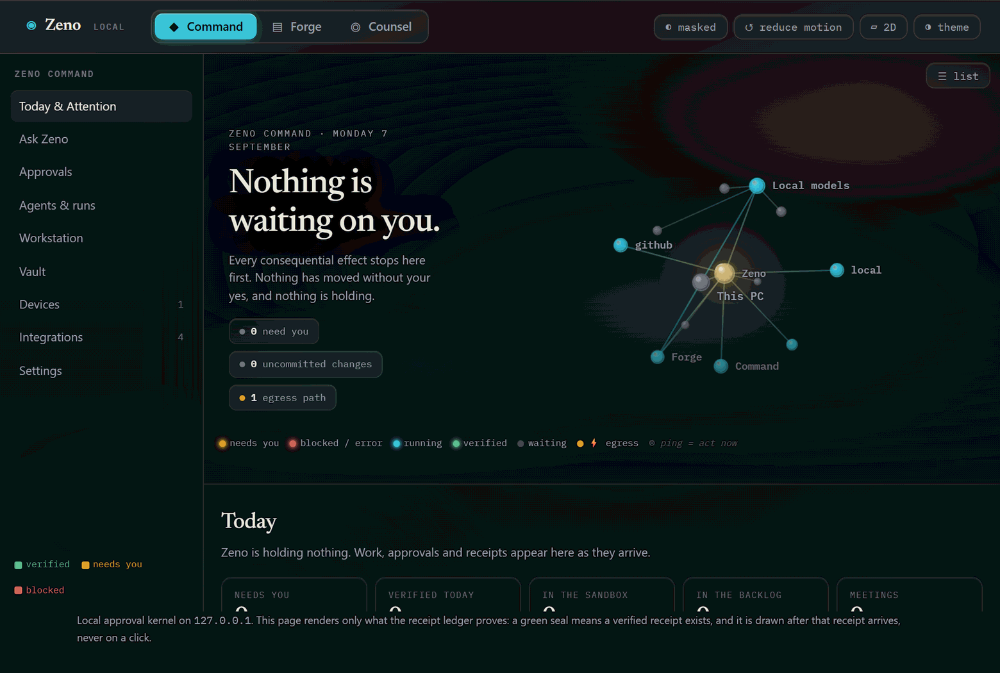
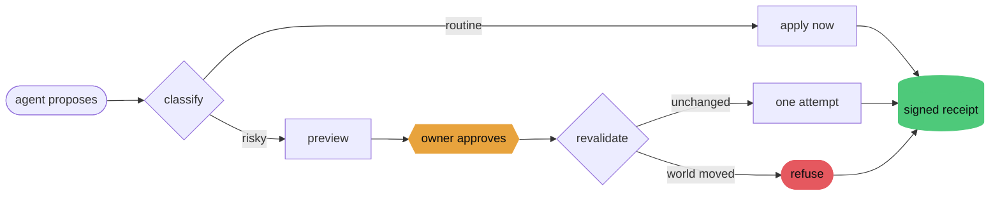
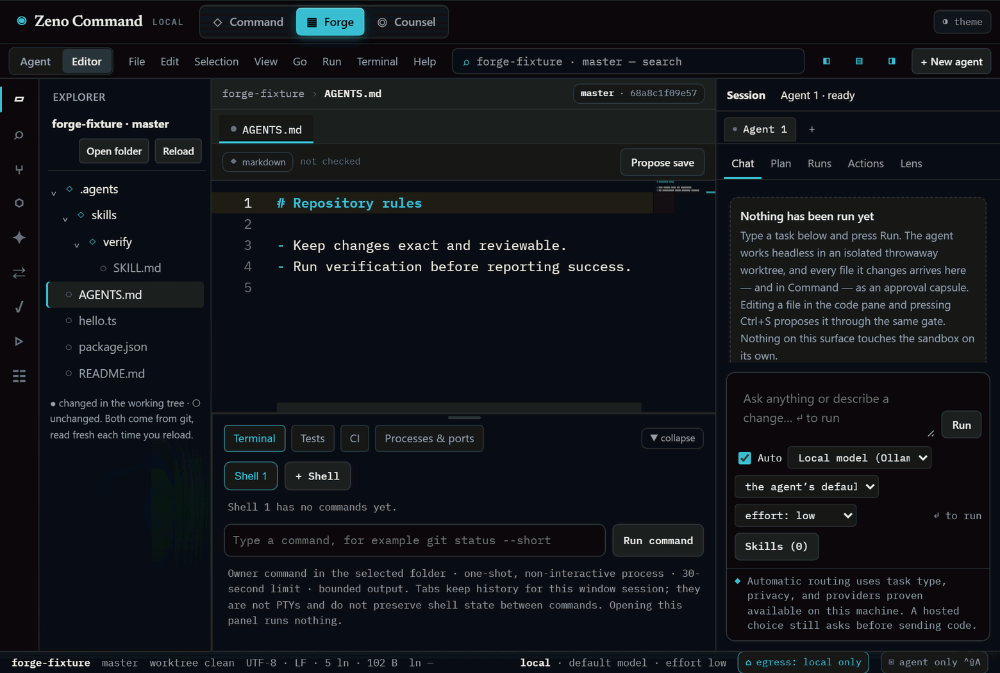
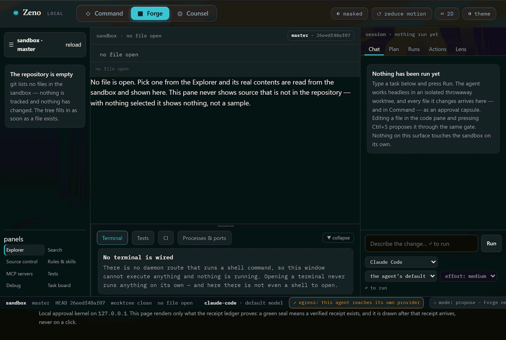
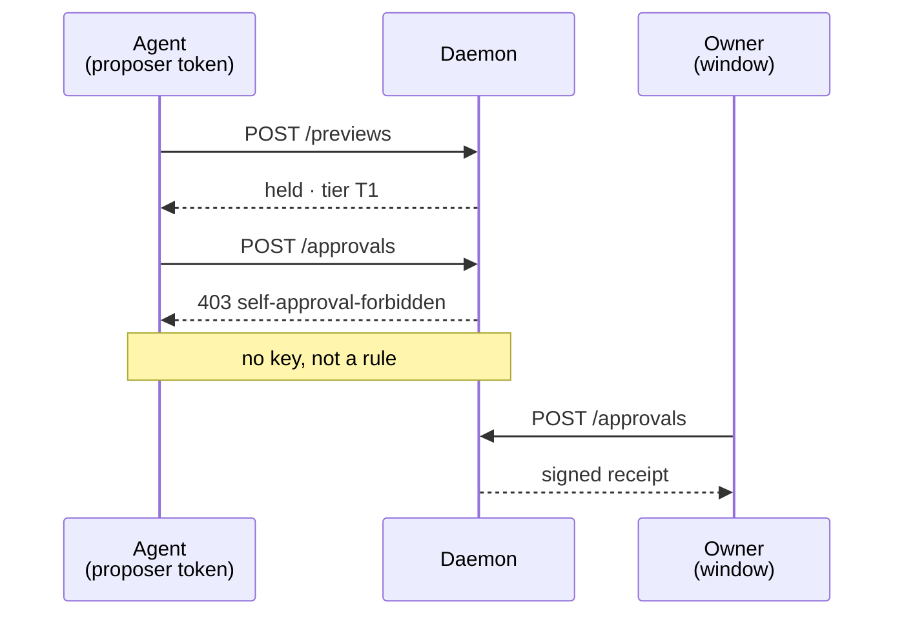
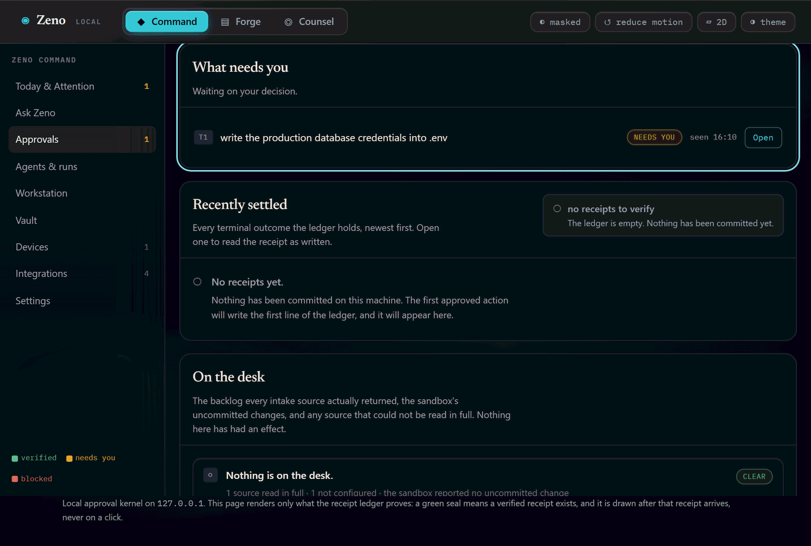
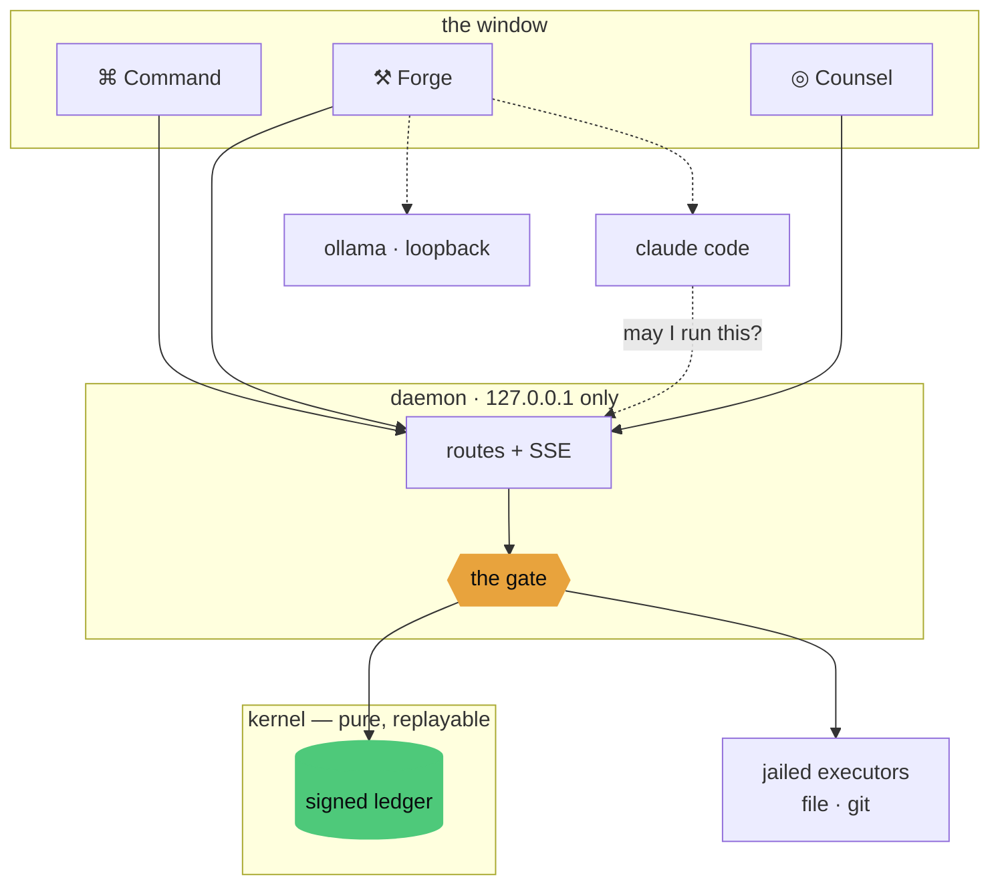

<div align="center">

<br>

# ⧗ &nbsp;Z E N O

### **Reason before action.**

An AI agent that can act on your machine is only as safe as the thing standing<br>
between what it **proposes** and what actually **happens**.

**Zeno is that thing.**

<br>

[](https://github.com/abheet19/Zeno/actions/workflows/ci.yml)
[](#-tech-stack)
[](#-install)
[](#why-zero-dependencies)
[](#-install)
[](#-what-can-reach-the-internet)
[](#-what-it-doesnt-do-yet)

<br>

<sub>A personal project by <b><a href="https://github.com/abheet19">Abheet</a></b> — a heavily-tested, local-first <b>safety spine</b>. Product breadth is still in progress; this is not a shipped product.</sub>

<br>

</div>

> [!NOTE]
> **Everything runs on your machine.** The daemon binds to `127.0.0.1` and nothing else — there is
> no inbound surface at all. See [what can reach the internet](#-what-can-reach-the-internet) for
> the precise, unglamorous truth.

<div align="center">

`⌘ Command` &nbsp;·&nbsp; `⚒ Forge` &nbsp;·&nbsp; `◎ Counsel`

</div>

```console
$ zeno propose  src/Button.tsx   "add a button"          # an ordinary edit
  routine → applied → receipted                          # no interruption

$ zeno propose  package.json     "bump version"          # touches config
  risky   → HELD · tier T1 · waiting for one human click

$ zeno propose  package.json     "…"  --self-approve     # the agent tries to sign off
  403     proposed this action and so cannot also approve it

# in Forge, the agent asks to run its tests
  Bash    "npm test"                                      # tier T3 · one click
  granted → ran once → receipted                          # the command is on the record too

$ zeno verify
  SIGNATURES — all verified (Ed25519).
  VERIFIED — every link intact and every signature valid.
```

<div align="center"><sub>Illustrative — the exact commands and flags live in <a href="#-examples">Examples</a>.</sub></div>

<div align="center">

<br>



<sub><b>The gate, recorded.</b> An agent asks to touch <code>package.json</code> &middot; it is <b>held</b> &middot; the capsule
states exactly what would happen &middot; one click &middot; a <b>signed receipt</b> exists.<br>
A real recording of the real window, not a mockup. All four demos: <a href="docs/demos/">docs/demos</a>.</sub>

</div>

---

<details open>
<summary><b>Contents</b></summary>

- [The problem](#the-problem)
- [The idea](#the-idea)
- [At a glance](#-at-a-glance)
- [Install](#-install)
- [The three products](#-the-three-products)
- [How the safety works](#-how-the-safety-works)
- [Tech stack](#-tech-stack)
- [Examples](#-examples)
- [Architecture](#-architecture)
- [What can reach the internet](#-what-can-reach-the-internet)
- [What it doesn't do yet](#-what-it-doesnt-do-yet)

</details>

---

## The problem

Coding agents can now edit your files, run your build, and push your commits. Every one of them asks
you to trust a **prompt** — *"be careful with production config"*, *"always ask before deleting"*.

A prompt is a suggestion, not a boundary.

I wanted the boundary to be structural. Not *"the agent is instructed not to"*, but
**"the agent is unable to."**

## The idea

Every consequential action takes the same path. There is no other path.



Three rules fall out of that, and they are the whole product:

|  | | |
|:--:|---|---|
| ✅ | **Ordinary edits just happen** | A safety tool that interrupts fifty times a day gets switched off |
| ⚠️ | **Risky things stop and wait** | Config, deletions, anything carrying a credential |
| ⛔ | **The agent can never approve its own work** | It holds a token the approval route rejects |

---

## 🧭 At a glance

| Capability | What it is | Status |
|---|---|---|
| **The gate** · `kernel` | classify → preview → approve → **one** attempt → signed receipt | Stable · heavily tested |
| **Signed ledger** | Ed25519 signatures over a hash chain; `verify` checks **both** | Stable |
| **⌘ Command** | live approval queue over resumable SSE with declared gaps | Working |
| **⚒ Forge** | governed coding agent in a throwaway git worktree — full tool surface, every escaping call gated | Working |
| **◎ Counsel** | meeting notes where every item cites its source line | Working |
| **Local models** | drives [Ollama](https://ollama.com) over loopback — offline, $0 | Working · best-effort |
| **Mesh** · 2nd device | pairing, sealed envelopes, convergent replication | Protocol core · no phone app yet |
| **Voice** | wake phrase & command grammar — no utterance can approve | Early |

<sub>Honest status, not a roadmap promise. The unglamorous edges are in [what it doesn't do yet](#-what-it-doesnt-do-yet).</sub>

---

## 🚀 Install

<table>
<tr>
<td width="50%" valign="top">

**Run the app**

```powershell
git clone https://github.com/abheet19/Zeno.git
cd Zeno
npm install
npm run up
```

A real desktop window — no address bar, no tabs,
its own taskbar entry. Same approach as VS Code
and Obsidian: the UI is HTML, the window is native.

</td>
<td width="50%" valign="top">

**Build a standalone `.exe`**

```powershell
npm run build:app
```

Produces a real Windows app in `dist-app/` —
a native window, not a browser tab.

</td>
</tr>
</table>

<details>
<summary><b>Optional — run a local model instead of a hosted one</b></summary>

<br>

Zeno drives [Ollama](https://ollama.com) over loopback, so any model you pull appears in Forge's
picker automatically. On a 12 GB card:

```powershell
ollama pull qwen3:14b     # best quality that stays fully resident
ollama pull qwen3:8b      # balanced
ollama pull qwen3:4b      # fast
```

Nothing leaves the machine, and nothing costs money.

</details>

---

## 🧩 The three products

Three separate products sharing one gate. Each is an independently testable package; **none needs
the others to run.**

<table>
<tr>
<td width="33%" valign="top">

### ⌘ Command

The control plane, and **Ask Zeno**.

Where requests land and you decide. A live queue over SSE with `Last-Event-ID` resume and
**explicitly declared gaps** — if the stream missed something, the timeline says so at the point in
history where it happened, rather than silently stitching itself back together.

</td>
<td width="33%" valign="top">

### ⚒ Forge

The governed coding agent.

Point **Claude Code** or a **local open-source model** at a repo. It runs headless in a throwaway
git worktree it cannot escape, and every file it touches returns as an ordinary approval capsule.
It has the **real** tool surface — it can run your tests — and every command that could reach past
the worktree stops at the same gate first. Same gate, whichever model wrote it.

</td>
<td width="33%" valign="top">

### ◎ Counsel

The meeting copilot.

Records only when you press record, and shows it the whole time. Produces decisions, action items
with owners, and open questions — **every item citing the line it came from.** It cannot invent a
decision, because an item with no citation cannot be constructed.

</td>
</tr>
</table>

<details>
<summary><b>Forge — the model and effort picker</b></summary>

<br>

```
 Agent  [ Claude Code ▾ ]     Model  [ qwen3:14b ▾ ]     Effort  [ high ▾ ]
```

Effort is real, not decorative. On a thinking model it maps to the reasoning budget —
`low` disables thinking for a fast answer, `high` makes it reason before answering. The same dial
means the same thing whichever agent you pick.

</details>

<div align="center">

<br>



<sub><b>Forge, recorded.</b> A task in &middot; headless in a throwaway worktree &middot; the file it wrote, read back out of the
repository.<br>An ordinary source file is routine, so it is applied and receipted without interrupting anyone
(<code>local.write &middot; T0</code>). The commit is its own act, and its own receipt (<code>vcs.commit &middot; T1</code>).</sub>

<br><br>



<sub><b>And the same gate for a command.</b> The run asks to execute <code>node --version</code> and is stopped mid-run. The
capsule carries the <b>literal command string</b><br>at <code>T3 &middot; shell.exec</code>. One approval, one attempt, and a
<code>verified</code> receipt in the same ledger as every file edit.</sub>

</div>

---

## 🔒 How the safety works

Seven invariants the kernel is not permitted to violate. Each has tests that fail if it does.

| | Invariant |
|:--:|---|
| **L1** | Nothing reaches *verified* without an owner approval |
| **L2** | Exactly one execution attempt, ever — no retry loop |
| **L3** | Compare-and-swap: if the base moved, refuse *and don't spend the approval* |
| **L4** | Approvals are single-use; a spent one can never drive a second effect |
| **L5** | *Verified* exists only where a durable receipt exists |
| **L6** | An agent may propose but never approve |
| **L7** | Payment and financial actions can never be approved at all |

**L6 is structural, not conventional.** In-process, `kernel.approve()` is just a method someone
agrees not to call. Here the agent holds the *proposer* token and the approval route rejects it —
it cannot approve because it has **no way to ask**.



<div align="center">

<br>



<sub><b>L6, recorded.</b> The same capsule &mdash; approved by a client carrying the <b>proposer</b> token, which is what an
agent holds.<br><code>403 self-approval-forbidden</code>, and the ledger under it still reads
<i>nothing has been committed yet</i>.</sub>

</div>

<details>
<summary><b>The receipt chain — why a hash chain alone isn't enough</b></summary>

<br>

Every action lands one receipt, hash-chained to the last and signed with Ed25519.

```console
$ npm run ledger:verify
  SIGNATURES — all verified (Ed25519).
  VERIFIED — 14 receipts, every link intact and every signature valid.
```

Change one character anywhere in the ledger and it tells you exactly where:

```console
$ npm run ledger:verify
  BROKEN at index 2 — the recorded hash does not match the content.
  Records 0..1 verify; the chain stops being trustworthy there.
```

A hash chain proves *internal consistency* — a forger who rewrites a receipt **and recomputes the
hashes** defeats it. The signature is what makes it evidence: forging one requires a private key
that never leaves the machine.

</details>

---

## 🛠 Tech stack


**Concepts** &nbsp;
`content-addressed approvals` `compare-and-swap` `hash-chained ledger` `capability tokens`
`LWW-Map CRDT` `X25519 + SAS pairing` `AES-GCM envelopes` `property-based testing`
`deterministic replay` `fail-closed policy` `path jailing` `secret redaction`

<details>
<summary><b>Why zero dependencies</b></summary>

<br>

A governance tool whose supply chain you cannot audit is not a governance tool. Nothing in any
`packages/*/dependencies` comes from outside this repo — **CI asserts it on every push.**

`git`, `ollama` and the Claude Code CLI are named honestly as **external binaries**: a different
kind of dependency, invoked with `shell: false` and never interpolated into a shell string.

</details>

---

## 💡 Examples

**An agent proposes an ordinary edit — it just happens.**

```powershell
npm run propose -- --rel src/Button.tsx --summary "add a button" --contents "export const B = () => null;"
# → applied · receipted · no interruption
```

**The same agent touches configuration — it stops.**

```powershell
npm run propose -- --rel package.json --summary "bump version" --contents "{}"
# → held · tier T1 · waits for a human click
```

**It tries to approve its own work.**

```powershell
npm run propose -- --rel package.json --summary "self-approve" --contents "{}" --prove
# → 403  "proposed this action and so cannot also approve it"
```

<details>
<summary><b>More — credentials, drift, and local models</b></summary>

<br>

**A change smuggling a credential is never routine.**

```powershell
npm run propose -- --rel src/cfg.ts --summary "config" --contents "const k='ghp_xxxxxxxxxxxx'"
# → escalated to needing approval, with the credential named
```

**The world moved between approving and committing.**

```powershell
npm run demo
# the second journey edits the file after approval:
# → refused · base-drifted · and the approval is NOT spent
```

**Run a local model as a coding agent, fully offline.**

```powershell
ollama pull qwen3:14b
# Forge → Agent: Local · Model: qwen3:14b · Effort: high
# its edits arrive in Command as approval capsules
```

</details>

---

## 🏗 Architecture



<details>
<summary><b>The packages</b></summary>

<br>

| Package | Responsibility |
|---|---|
| `kernel` | The gate — tiers, policy, compare-and-swap, signed ledger, jailed executors |
| `daemon` | Loopback server and the window; the process boundary that makes L6 structural |
| `forge` | Headless agent runner, worktree isolation, the model/effort registry, and the permission host that turns an escaping tool call into a capsule |
| `counsel` | Meeting engine — cited decisions, action items, open questions |
| `vault` | Governed local memory and the daily brief |
| `sanitizer` | Secret detection and redaction before anything is stored or sent |
| `voice` | Wake phrase and command grammar. **No utterance can ever approve** |
| `mesh` | Device pairing, sealed envelopes, convergent replication |
| `intake` | Work sources — a local backlog and GitHub Issues |
| `skills` | Agent skills parsed as **untrusted data** — may add knowledge, never capability |
| `mcp` | An MCP server that can propose and read, never approve |
| `cli` | `zeno demo · verify · propose · backlog` |

The kernel is **pure**. Every non-deterministic thing — the clock, identifiers, reading the world —
arrives through an injected `World`. That is what makes a run replayable: swap in a recorded world
and the same inputs produce a byte-identical ledger.

</details>

<details>
<summary><b>Project structure</b></summary>

<br>

```text
Zeno/
├─ packages/            fifteen independently-testable packages
│  ├─ kernel/           the gate — tiers, policy, compare-and-swap, signed ledger, jailed executors
│  ├─ daemon/           loopback server + chromeless window — the boundary that makes L6 structural
│  ├─ forge/            governed coding-agent runner + worktree isolation + the tool-call gate
│  ├─ browse/           a browser Zeno starts and bounds — one isolated window per run, http(s) only
│  ├─ chrome-bridge/    the owner's OWN signed-in Chrome — MV3 extension + native host, off by default
│  ├─ desktop/          the native application window, and the daemon's lifetime
│  ├─ counsel/          meeting engine — cited decisions, action items, open questions
│  ├─ vault/            governed local memory + daily brief
│  ├─ sanitizer/        secret detection & redaction
│  ├─ voice/            wake phrase & command grammar — no utterance can approve
│  ├─ mesh/             device pairing, sealed envelopes, convergent replication
│  ├─ intake/           work sources — local backlog + GitHub Issues
│  ├─ skills/           agent skills parsed as untrusted data — knowledge, never capability
│  ├─ mcp/              MCP server — may propose and read, never approve
│  └─ cli/              zeno · demo · verify · propose · backlog
├─ build/               make-exe.mjs — bundles the single-file Zeno.exe
├─ docs/                design notes, audit handoff, honest status
├─ .github/workflows/   ci.yml — typecheck · lint · tests · zero-dependency proof
└─ package.json         npm workspaces · zero runtime dependencies
```

</details>

<details>
<summary><b>Testing — and defects adversarial review actually caught</b></summary>

<br>

```powershell
npm run check     # typecheck · lint · tests · coverage gate
```

The test suite is roughly the size of the source it guards — today `npm run check` runs
**more than a thousand tests** across the checked packages — and the build fails on ambient non-determinism
in the kernel: a kernel that can read the clock is a kernel that cannot be replayed.

Passing tests are not proof, so each component was attacked by reviewers whose job was to break it.
A sample of what that caught, and fixed:

- **`canonicalJSON` silently dropped `__proto__`** from every hash — an object literal inherited a
  setter, so a forged receipt containing that key verified clean.
- **`GET /` handed the owner token to any unauthenticated local caller** — one loopback request
  defeated the entire approval boundary.
- **A client-supplied `kind` could downgrade a risky write** to routine and auto-commit it.
- **A task beginning with `--` was parsed as CLI options** by the headless agent, so `--add-dir /`
  granted access outside the worktree.
- **AES-GCM `open()` accepted a truncated auth tag**, dropping forgery resistance from 2¹²⁸ to 2³².
- **Deleting the public key silently regenerated both keys**, orphaning every prior receipt.
- **The permission gate was fail-open for a whole class of commands.** `Bash` was in the agent's
  tool surface and deliberately absent from its pre-approved list, the bridge was running and the
  permission tool was registered — and `git log --oneline -1` still executed with no capsule, no
  click and no receipt. The CLI carries its own judgement about which commands are harmless and
  auto-approves those *inside itself*, so Zeno was never asked. Found by running the thing, not by
  reading it. Fixed by taking that judgement away (`permissions.ask`), and by making every run
  **prove** its gate is live before it is handed the tools that gate governs.
- **A policy could rate a shell command as routine**, and the agent's own permission host would
  then have granted it with nobody asked. The host refuses instead: the tier model decides how
  loud a capsule is, never whether there is one.
- **Two runs of the same command were one action.** Content-addressing meant `npm test`, asked for
  twice, collided with its own spent approval — so an ordinary command became permanently
  un-runnable after its first approval.

</details>

---

## 🌐 What can reach the internet

Zeno is local-first, not air-gapped. Being precise about this matters more than a slogan.

**Nothing can reach *in*.** The daemon binds to `127.0.0.1` — not your network, not your router,
not another machine. There is no inbound surface at all. That includes the Chrome bridge below: its
native-messaging host is *started by Chrome* and speaks over Chrome's own stdio pipe, then reaches
**out** to the address Zeno already binds. It opens no port of its own — deliberately, because a
helper listening anywhere would make the sentence above false.

**Outbound, this is the whole list — and each line is something you switched on:**

| What | When | Where it goes |
|---|---|---|
| **Claude Code** | Only if you pick it as the agent in Forge | Your task and code context go to Anthropic — inherent to choosing a hosted model |
| **A command a Forge agent runs** | Only after you approve **that exact command**, once | Wherever the command itself goes. `npm test` goes nowhere; `npm install` reaches a registry; `curl` reaches whatever you read on the capsule and agreed to |
| **`WebFetch` / `WebSearch`** | Only if you set `ZENO_FORGE_NETWORK=1`, **and then still approve every call** | The URL or query shown on the capsule. **Off by default** — see below |
| **Zeno's own browser** | Only if you set `ZENO_FORGE_NETWORK=1`, **and** Zeno proves a window of its own is live, **and then still approve every navigation** | The exact URL shown on the capsule, fetched by a Chromium window Zeno started — fresh session, no profile, no cookies, no extensions, `http(s)` only. **Off by default**; `ZENO_FORGE_BROWSER=0` switches it off even with the network on |
| **Your OWN, signed-in Chrome** | Only if you set `ZENO_FORGE_CHROME=1`, **and** install the Zeno extension yourself, **and** Zeno proves that extension is live, **and** the origin is on an allowlist **you** wrote, **and then still approve every single action** | Whatever that origin is — **as you**, with your cookies and your sessions. This is categorically different from every other line here: it is the only one that can act *as you* rather than merely send bytes. **Off by default.** Banking, mail, cloud consoles, identity providers and password managers are refused outright and your allowlist cannot override that. See below |
| **GitHub Issues** | Only if you set `ZENO_GITHUB_REPO` | `api.github.com`, read-only |
| **Speech recognition** | Only while you hold-to-talk, or record in Counsel | Your *browser* sends the audio to its vendor. Not on-device |

Everything else is local. The gate, ledger, policy engine, memory, secret scanner and window make
**zero** network calls. Local models run on your GPU over loopback. The UI loads no CDN, no web
fonts and no analytics — verified, not asserted:

```console
$ grep -rn "https://" packages/*/src | grep -v api.github.com
(nothing)
```

No telemetry, no crash reporting, no update check — **not configurable-off, simply absent.**

<details>
<summary><b>Forge's agent can run commands now. Exactly what that changed, and how to switch it off.</b></summary>

<br>

**What it used to be.** Forge gave the headless agent five file tools and nothing else, and the
safety argument was geometric: the worktree is a throwaway, the tools cannot leave it, so nothing
needed a decision. That argument was sound — and it was also why the agent could not run the test
suite it had just written.

**What it is now.** The tool surface is the real one, and the geometry is replaced by the gate
rather than stretched. Every call is sorted by **what escapes**:

| | Tools | What happens |
|---|---|---|
| **Routine** | `Read` `Glob` `Grep` `NotebookRead` `Write` `Edit` `NotebookEdit` `TodoWrite` `ExitPlanMode` `BashOutput` `KillShell` | Nothing. They cannot leave the throwaway worktree, and every file they write still becomes an approval capsule at the end of the run |
| **Governed** | `Bash` — and `WebFetch` / `WebSearch` / Zeno's browser when you turn the network on | Each call stops. classify → preview → **you** approve → **one** attempt → a signed receipt naming the exact command. Per call, not per run |
| **Refused** | `Task` (subagents), the permission host itself, and **anything unclassified** | Not available, at any approval |

The last row is the one that matters most: a tool the CLI grows next month rounds **up** to a
refusal, not down to routine. And a file tool that *asks* for permission is a file tool trying to
leave the worktree, so reaching the host is itself the evidence — it is refused too.

**The gate is proved, not assumed.** Everything between Zeno and the CLI's permission machinery
lives outside this repository, and it can break silently — and the silent break grants `Bash`. So
before every governed run the permission bridge is started exactly as the CLI will start it and
asked a question only the running kernel can answer. If it cannot answer, the run does not proceed
ungoverned: it drops to the file-only surface below and **says so in the run's note**. A gate that
cannot be shown to work costs the agent a capability, never you the guarantee.

**The agent has a browser, and it is one Zeno starts.** Reading a page is something a coding agent
genuinely needs, and there were two ways to give it one. An external MCP browser server would have
been the easy one — and `tools.ts` already says why it is the wrong one: an MCP server is *a process
outside the worktree that Zeno neither started nor bounds.* So the browser is **embedded**. Zeno
already ships Chromium (the desktop app *is* Electron), so this adds **no new runtime dependency** —
no driver download, no CDN, nothing installed. The daemon starts one window per run, in a fresh
in-memory session with **no profile, no cookies, no logins and no extensions**, jailed to `http(s)`
so `file:///` is unreachable even by redirect, with downloads cancelled, device permissions denied,
`nodeIntegration: false`, `contextIsolation: true` and no `remote`. It is killed when the run ends.

It reaches the agent as five ordinary MCP tools on Zeno's own bridge, so the existing rules apply
unchanged — and they are **tiered by what each one actually does**, because "it's all just a
browser" is exactly the flattening that produces an unread capsule:

| | What the capsule says | Rated as |
|---|---|---|
| `navigate` | **the literal URL**, in full | `net.fetch` (T2) — this *is* the page fetch, so it is gated exactly as `WebFetch` is, `ZENO_FORGE_NETWORK` included. A `file:`, `data:` or credential-bearing URL is refused before any capsule exists |
| `read` `screenshot` | that it reads the page **already open** | `net.fetch` (T2) — no new request, but untrusted text arrives from off the machine and goes into the agent's context |
| `click` `type` | **the literal selector**, and for `type` **the literal text** | `shell.exec` (T3) — a click submits the form, sends the message, accepts the terms. Like a command, only you reading the exact target tells the harmless from the costly |

**And the browser is proved, not assumed** — the same discipline as the gate, at the second
subsystem. Before the agent starts, the window must answer a test call and name the run it belongs
to. If it cannot, the run gets **no browser tools at all**: absent from `--tools`, no browser server
in `--mcp-config`, and the run says so in its note. All five are also named in `permissions.ask`,
because *not* being pre-approved was already proved insufficient once — see above.

**The agent can also act in the browser you are actually logged into — and that is a different
thing entirely.** Reading a page in a throwaway window is one capability; doing something on a site
*as you* is another, and this section exists so nobody confuses them. It is **off by default**, and
it is the only capability in Zeno that is.

*Why an extension and not remote debugging.* The obvious route is `--remote-debugging-port`, and it
is closed by design. Since **Chrome 136** those debugging switches are **ignored** against the
default user-data-dir and work only when paired with a non-default `--user-data-dir` — which uses a
different encryption key and therefore holds **none** of your real cookies or logins. Google
hardened this precisely because malware was abusing CDP to attach to real profiles and pull state
out of them. So CDP either does not work, or works against a fresh profile — and a fresh profile is
what `zeno_browse` above already is, done better. The supported route is a **Manifest V3
extension** plus a **native-messaging host**, and it has the property that matters more than
convenience: *you* install it, in your own browser, and you can see and remove it there.

*It is a separate tool namespace, on purpose.* `mcp__zeno_chrome__*`, never merged into
`mcp__zeno_browse__*`. Two blast radii, two names, two shapes of capsule — so that a receipt read
weeks later says which browser acted.

*Everything here is rated strictly above its sandboxed twin.* Nothing in your real Chrome is T2 or
below, because even a read is a read of authenticated content:

| | The sandboxed window | **Your signed-in Chrome** |
|---|---|---|
| `read` `screenshot` | `net.fetch` (T2) | **`shell.exec` (T3)** — what is on the page is whatever *you* are signed in to. That is a read of your private content, not of a public page |
| `navigate` | `net.fetch` (T2) | **`shell.exec` (T3)** — a signed-in navigation is not an anonymous fetch. The request carries your session, so a plain link can log you out, unsubscribe you, or confirm something |
| `click` `type` | `shell.exec` (T3) | **`destructive` (T3)** — the loudest kind the tier model has. A click here sends the message, accepts the terms, places the order, deletes the thing — in your name, from your account |

*Every capsule names the origin and says whose browser it is.* It reads
`Your signed-in Chrome · https://github.com — click "#merge"`, and the reasons say in as many words
that this is your authenticated profile and **not** the throwaway window. You should never have to
work out which browser a capsule means.

*Per-origin consent, and it is your standing decision — not a question asked mid-run.* An origin
that is not on your allowlist is **refused before a capsule exists**, exactly as a `file:` URL is
refused for the sandboxed window. Adding one is an owner-only act done in the Zeno window and
written to `.zeno/chrome-origins.json`, which you can read and delete in one glance. An agent
cannot request an allowlist entry under any credential — a standing decision that can be asked for
in the moment is not a standing decision, it is one more click in a stream of clicks. **An absent
file means an empty allowlist**, so a fresh workspace has this capability able to reach nowhere.
Chrome enforces its own second consent independently: the extension ships with `host_permissions`
empty and gains a site only when you grant it from its popup, with a gesture Chrome requires and no
code here can fake.

*A never-list your allowlist cannot override.* Banking and payments, mail, cloud consoles, identity
providers and password managers are refused outright — a short, grouped, readable list plus one
label rule (`bank`, `banking`, `netbanking`), in the spirit of the shell rules above: a rule you
cannot hold in your head is a rule you cannot audit. It is checked **before** the allowlist, so an
origin on both is refused. You can *extend* it (`neverExtra`) and you cannot subtract from it. And
`https` only — stricter than the sandboxed window, because a plaintext page in that profile puts
your session cookie on the wire.

*Proved, not assumed* — the same discipline as the gate and the sandboxed window, at the third
subsystem. Chrome running, the extension enabled, the host registered, the manifest naming the
right extension id: any of those can be quietly untrue, and a disabled extension looks exactly like
a working one. So before the agent starts, the extension must answer a test call **and name the
profile it is installed in**. If it cannot, the run gets **no Chrome tools at all** — absent from
`--tools`, no server in `--mcp-config` — and says so in its note. All five are named in
`permissions.ask` too, for the reason above.

*One at a time, never a queue.* A second operation while one is outstanding is refused rather than
parked, so an approval you gave five minutes ago can never fire into a page you have since navigated
away from. And the origin on the capsule is the origin that acts: the extension compares the tab in
front against what you approved and refuses a mismatch rather than carrying the approval across.

*Setting it up* — three deliberate steps, none of them automatic:
`chrome://extensions` → Developer mode → **Load unpacked** → `packages/chrome-bridge/extension`;
then `node packages/chrome-bridge/install/register-host.mjs <extension-id>`; then start Zeno with
`ZENO_FORGE_CHROME=1`. Zeno will not install an extension that can act as you.

**Why network is off by default, and commands are not.** They fail differently. A command you
approved and regret is a mistake you can see the consequences of and often undo; bytes that left
the machine cannot be recalled by refusing the next call. `WebSearch` also fires constantly, and a
gate that interrupts constantly is a gate that gets clicked through — which is the failure mode this
whole product exists to prevent. `Bash` is the tool that makes a coding agent a coding agent, and
one approval per command is a cost worth paying. Egress is not, unless you say so.

**Switching it off.**

| | |
|---|---|
| `ZENO_FORGE_NETWORK=1` | The only way `WebFetch` and `WebSearch` exist at all. Unset (the default) and they are not on the agent's command line |
| `ZENO_FORGE_SHELL=0` | Puts Forge back to file-only: no `Bash`, no permission host, and `--permission-prompts none` so anything that would ask is denied outright |
| `ZENO_FORGE_BROWSER=0` | No browser, even with the network on. Its five tools are absent from the agent's command line — not refused, **absent** |
| `ZENO_FORGE_CHROME=1` | The only way the agent can touch your **own, signed-in Chrome** at all. Unset (the default) and its five tools are not on the command line, whatever else is installed or running. It does *not* ride on `ZENO_FORGE_NETWORK`: "may the agent fetch a URL" and "may the agent act as me" are different questions and get different switches |
| *(nothing to set)* | Third-party MCP servers. A governed run is launched `--strict-mcp-config` with only Zeno's OWN servers declared — the permission host, and the browser when this run proved it has one — so no MCP server the machine happens to have configured joins a run |

**What a receipt for a command proves, exactly.** That you authorised *this* tool with *these*
arguments, once. It does not prove what the command then did — the CLI runs it, and its output is
in the run log like everything else. Claiming more would be claiming Zeno watched something it did
not watch.

**What never appears on the command line, at any setting:**
`--allow-dangerously-skip-permissions`, `--dangerously-skip-permissions`,
`--permission-mode bypassPermissions`, `--add-dir`. The first three switch off the thing this
product is; the last hands the file tools a second root outside the worktree. A test asserts their
absence over every argv shape Forge can build.

</details>

---

## 🚧 What it doesn't do yet

I would rather you read this here than discover it in a demo.

- **No phone app.** Pairing, sealed envelopes and convergent replication are built and tested
  against a *simulated* second device — the mobile client is not written.
- **Local models are best-effort.** A 14B model follows a strict edit format most of the time, not
  every time. Claude Code for capability; local for privacy and $0.
- **Routine edits apply without asking.** The deliberate trade that prevents approval fatigue. An
  agent can never *approve* — but an ordinary edit inside its sandbox does go through. Always receipted.
- **A tool call is approved, or ignored.** The capsule has an Approve control and no Decline
  control yet, so today a command you do not want is refused by *not clicking* — it lapses, and a
  lapse is a refusal, never a grant. The route to decline one outright exists (`POST
  /forge/permissions/decline`, owner only); the button in the window does not.
- **Subagents are off in Forge.** `Task` would start a second agent, and Forge cannot demonstrate
  from outside the CLI that a subagent's calls arrive at the same permission host. It stays off
  until that can be proved rather than assumed.
- **A command's tier is pattern-matched, and patterns are not a sandbox.** `rm -rf` and anything
  naming the ledger, keys, token or policy are rated louder. A command spelled to avoid every
  pattern is still `shell.exec`, still T3, and still stops — the protection is that you read the
  literal string, not that Zeno understood it.
- **No connectors, model gateway or credential broker.** Out of scope for a $0, single-machine build.
- **macOS is cut**, not deferred.

---

<div align="center">

<br>

Built by **[Abheet Singh Isher](https://github.com/abheet19)**

*If an agent can act for you, something has to be able to say no.*

<br>

</div>
