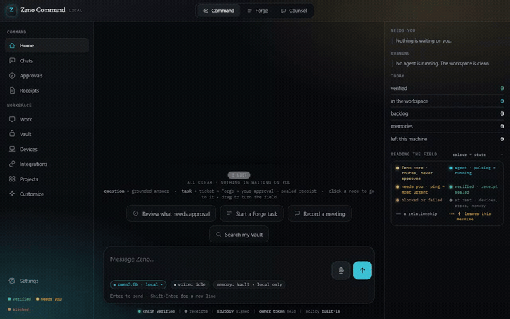
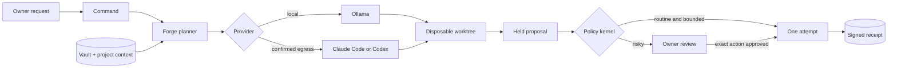

<div align="center">


# Zeno

### A local-first workspace for AI agents, with a deterministic boundary around every effect.

Command turns a request into work. Forge runs the coding agent in an isolated Git worktree.
Counsel turns a consented meeting into cited notes. Vault carries useful context between them.

[](https://github.com/abheet19/Zeno/actions/workflows/ci.yml)
[](#stack)
[](#run-it)
[](#run-it)
[](#stack)
[](#current-boundaries)

</div>

<p align="center">
  
</p>

<p align="center"><b><a href="docs/media/zeno-reel.mp4">Watch the crisp 60 fps reel</a></b> · <a href="docs/demos/README.md">Recording provenance</a></p>

The reel is captured from the real app against a disposable Git repository. It sends a real
proposal through the daemon, approves the exact held action, waits for its signed receipt, runs a
real command in Forge, and opens Counsel's consent screen. No product state is painted into the
video and no portfolio repository is modified.

> [!IMPORTANT]
> Zeno is a personal project under active development. Its safety core is heavily tested, but this
> repository does not claim a signed production release, formal security certification, WCAG
> certification, phone client, or broad device/provider compatibility. The exact evidence boundary
> lives in [docs/43-ACCEPTANCE-EVIDENCE.md](docs/43-ACCEPTANCE-EVIDENCE.md).

## Why it exists

A model can write convincing text about what it intends to do. That is not an authorization
boundary. Zeno keeps generation and authority separate:

1. an agent reads bounded context and proposes an action;
2. deterministic policy classifies the action;
3. risky actions stop as content-addressed proposals;
4. the owner approves the exact current action;
5. compare-and-swap checks that the target has not changed;
6. one execution attempt is permitted;
7. the outcome is written to an Ed25519-signed, hash-chained receipt ledger.

The model receives a proposer capability. The approval route rejects that capability. “A model can
propose but never approve” is enforced by the process boundary and again by the kernel.



## The suite

| Surface | What it does | What to show in a demo |
|---|---|---|
| **Command** | Answers questions about the local Zeno state, accepts work, routes actionable requests to Forge, tracks running agents, and exposes approvals and receipts. | Give it a bounded repository task. Watch the request become a Forge run, then open the resulting approval instead of trusting a chat answer. |
| **Forge** | Runs Claude Code, Codex, or a discovered Ollama model in a disposable worktree with plan-first context, skills, rules, MCP tools, files, diffs, tests, terminal output and live progress. | Open the selected repo, inspect the plan and exact changed files, run verification, then approve the held diff. |
| **Counsel** | Records the microphone only after explicit consent, saves transcript text, extracts cited decisions/actions, and answers against saved lines. | Show the consent screen, record a short synthetic note, end the meeting, then open one cited item. |
| **Vault** | Stores readable Markdown memories, performs transparent keyword recall, and supplies task-relevant cited context to Command and Forge. | Save a harmless preference with `Remember: ...`, open Vault, expand it, and ask a later task to use it. |
| **Voice** | Adds hold-to-talk and wake-phrase routing without granting approval authority. | Use it only when local Whisper is installed; otherwise show the truthful unavailable state. |

Command is the orchestrator. It does not pretend that generated code has been applied. An
actionable request is dispatched to Forge; Forge owns planning, provider selection, tool calls,
isolated execution, approval interruption, stale-state checks and receipts.

## A short end-to-end demo

Use a disposable Git repository. In Command, paste a concrete task such as:

```text
Build a dependency-free Python shipment-delay classifier in this repository.
Create app.py, test_app.py and README.md. Use on_time for 0..23 hours,
monitor for 24..47, escalate for 48+, and reject negative values.
Run python -m unittest -v and python app.py 50. Stop before applying the diff.
```

Then show the system, not just the generated code:

1. **Command routes the instruction to Forge.** The request is work, so it does not receive a
   generic chat answer.
2. **Forge names the selected repository and provider.** Open Lens to show the exact project,
   `ZENO.md`, selected skills and cited Vault context supplied to the run.
3. **Plan first keeps reading separate from acting.** Review the plan before the provider may edit.
4. **The agent works in a disposable worktree.** The selected repository stays unchanged while the
   model works.
5. **Tests are evidence.** Open Runs or Terminal and show the real `unittest` output and CLI output.
6. **The diff stops at the gate.** Open Actions and inspect the complete files and action hash.
7. **Approve the exact current proposal.** A stale base refuses; a current approval permits one
   attempt.
8. **Open Receipts.** Show the verified outcome, signature and previous-receipt link.
9. **Open Vault.** Show the task-relevant memory as readable Markdown and expand its full content.
10. **Open Counsel.** End on the explicit consent boundary: microphone only, no silent recording.

## Safety model

The kernel is a deterministic state machine. An LLM does not participate in classification,
approval validation, stale-state checks, execution-count enforcement, or receipt verification.

| Invariant | Meaning |
|---|---|
| **L1** | No held action reaches `verified` without owner approval. |
| **L2** | An approval permits one execution attempt, never a retry loop. |
| **L3** | If the base changed after preview, execution refuses. |
| **L4** | Approval is single-use and is spent before the attempt. |
| **L5** | Success exists only with a durable effect proof and receipt. |
| **L6** | The proposer cannot approve its own action. |
| **L7** | Tier 4 financial/payment effects have no approval path. |

Ordinary, bounded edits inside the selected jail may auto-apply to reduce approval fatigue, and are
still receipted. Forge model output follows the stricter owner-review path. Config, credentials,
deletions, broad rewrites, shell actions and egress stop and wait.

## Run it

Requirements: Windows, Node.js 22+, npm and Git.

```powershell
git clone https://github.com/abheet19/Zeno.git
cd Zeno
npm install
npm run app
```

For the loopback browser surface instead of Electron:

```powershell
npm run up
# Open the exact nonce-bearing URL printed by the daemon.
```

Build the Windows portable app and installer:

```powershell
npm run build:app
```

The current installer is unsigned unless an Authenticode certificate is supplied to the release
workflow, so Windows SmartScreen may warn on first launch.

### Optional local model

Forge discovers models from a running [Ollama](https://ollama.com) instance over loopback.

```powershell
ollama pull qwen3:8b
```

`qwen3:8b` is the practical local default on the development machine. Model quality and latency
depend on hardware and task size. Hosted providers require their own installed, authenticated CLI
and an explicit egress confirmation.

### Optional local speech

The installer does not bundle `whisper.cpp` or a speech model. Configure them in Zeno Settings. If
they are absent, the desktop reports local voice as unavailable instead of claiming transcription.

## Verify it

```powershell
npm run check       # typecheck, lint rules and tests for every workspace
npm run build       # compile every package and vendor Monaco
npm run ledger:verify
```

CI runs the complete `npm run check` gate on Windows with Node 22 and separately fails if any core
package introduces a third-party runtime npm dependency.

Regenerate the product reel:

```powershell
npm run build
node tools/capture-reel60.mjs
```

This writes `docs/media/zeno-reel.mp4` and `docs/media/zeno-demo.gif`. The older focused recordings
for self-approval and shell gating remain in [docs/demos](docs/demos/README.md).

## Architecture

```text
Electron window
  └─ nonce-authenticated daemon on 127.0.0.1
      ├─ Command / Work / Vault / settings / SSE progress
      ├─ Forge provider adapters and disposable Git worktrees
      ├─ Counsel transcript and cited extraction pipeline
      ├─ run-scoped MCP read/propose tools
      └─ deterministic kernel
          ├─ policy and risk classification
          ├─ content-addressed approval binding
          ├─ compare-and-swap executor
          └─ Ed25519-signed receipt ledger
```

| Path | Responsibility |
|---|---|
| `packages/kernel` | Policy, approvals, stale-state protection, one-attempt execution and receipts. |
| `packages/daemon` | Loopback API, scoped tokens, SSE, state and the desktop web UI. |
| `packages/desktop` | Electron lifecycle, preload boundary, local speech bridge and packaging. |
| `packages/forge` | Provider routing, worktrees, output parsing, gated tools and held edits. |
| `packages/assistant` | Bounded local snapshot, grounding, citations and task intent. |
| `packages/vault` | Plain-Markdown memory, recall and governed writes. |
| `packages/counsel` | Consent, transcripts, cited extraction and post-meeting Q&A. |
| `packages/mcp` / `packages/skills` | Bounded model tools and untrusted skill screening. |

## Stack

TypeScript in strict mode · Node.js 22 ESM · Electron · vanilla JavaScript and CSS · Monaco ·
`node:test` · Ed25519 and SHA-256 via `node:crypto` · SSE · Git worktrees · MCP stdio · Ollama.

Core packages have **zero third-party runtime npm dependencies**. Electron, Monaco and Playwright are
development/build dependencies. Git, Ollama, hosted agent CLIs, Whisper and ffmpeg are external
binaries when their optional paths are used.

## Network boundary

- The daemon listens on `127.0.0.1`, not a LAN interface.
- Ollama and configured local Whisper stay local.
- Hosted Claude Code or Codex runs may send bounded repository context to their provider only after
  the owner chooses that path.
- Browser and signed-in Chrome tools are separate, explicitly enabled capabilities with different
  risk treatment.
- Zeno has no remote analytics, session replay or crash-upload pipeline.

## Current boundaries

- Windows-first; macOS support is out of scope.
- No phone application. The pairing/replication protocol core is not a shipped mobile client.
- Local-model edits are best-effort and malformed output is rejected.
- The terminal runs bounded one-shot commands; it is not a persistent PTY.
- Forge has no VSIX/Marketplace extension host and no full debugger or CI host.
- Counsel captures the local microphone, not remote/system audio, and does not diarize speakers
  automatically.
- Voice does not identify the owner and cannot approve.
- The bundled isolated browser and optional signed-in Chrome bridge have intentionally different
  trust boundaries.
- The formal 196-row acceptance ledger is still evidence-driven; passing package tests do not turn
  untested rows into accepted rows.

For a guided implementation tour, read [the current study pack](docs/44-STUDY-PACK.md). For exact
manual flows, use [the hands-on test guide](docs/35-HOW-TO-TEST.md). For evidence limits, use
[the acceptance evidence boundary](docs/43-ACCEPTANCE-EVIDENCE.md).

---

<div align="center">

Built by **[Abheet Singh Isher](https://github.com/abheet19)**

*Reason before action.*

</div>
