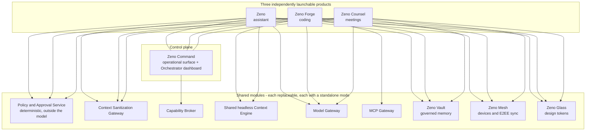
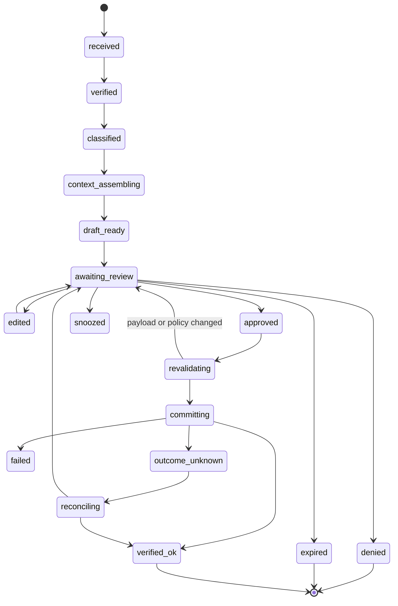
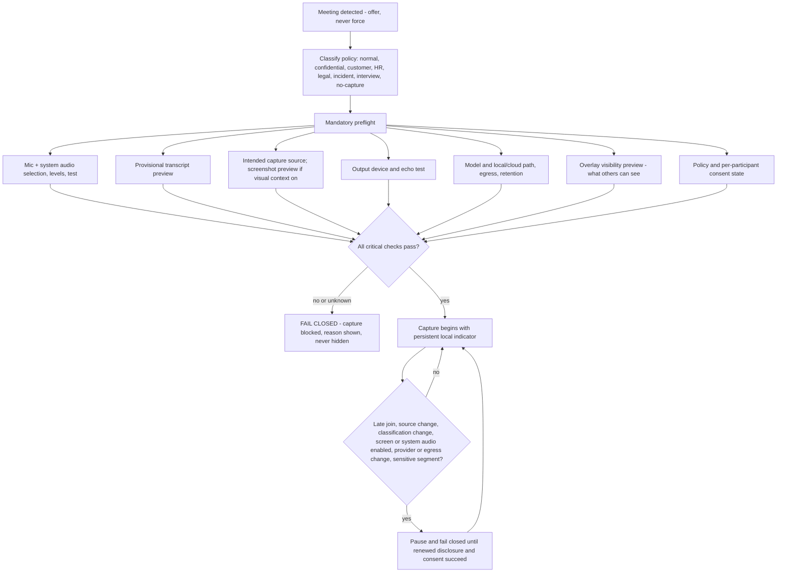
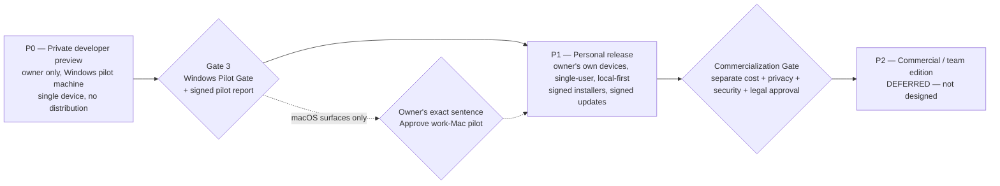

# 10 — Product Requirements: the Zeno suite and its products

**Phase 0B deliverable · Gate 1 design artifact · version 1.0 · 2026-08-24**
Requirement source: master prompt §1, §1.1, §5, §6, §7 (with §8, §9, §10.1, §13, §14 as constraint sources).
Brand authority: `08-BRAND-DECISION.md` (owner selection, 2026-08-24 — **ZENO**).

> **This document designs. It does not build, install, register, spend, or authorize anything.** No repository, package, domain, handle, bundle ID or trademark filing follows from approving it. Gate 1 approval permits architecture work; Gate 2 permits design work; Gate 3 plus the owner's exact sentence *"Approve work-Mac pilot"* is the only path to any runtime on this machine.

---

## 0. How to read this document

### 0.1 Evidence labels

Every load-bearing claim carries one of:

| Label | Meaning |
|---|---|
| **[V]** | Verified against a primary artifact by a named research lane, with a recorded access date. Traceable to `03-corrections-log.md` or `research/L*`. |
| **[I]** | Inferred — a reasoned consequence of verified facts, not itself fetched. |
| **[U]** | Unknown — genuinely undetermined. Never filled in with a plausible guess. |

Unlabelled statements are **design decisions taken in this document**. They are proposals for Gate 1, not findings.

### 0.2 What this document is not allowed to do

It may not silently re-resolve any row in `02-conflict-and-disposition-register.md` (10 rows). Where a PRD touches one, it cites the row number and repeats the recorded disposition. Where writing the PRD surfaced a **new** conflict, it is listed in §11 and marked **owner decision required** — not resolved here.

### 0.3 The three canonical axes — never conflated

Master prompt §5.2.1 requires three separate axes. This document uses only the first; the other two belong to runtime artifacts that do not yet exist.

| Axis | Values | Where it lives |
|---|---|---|
| **Release support** (used in every capability table below) | `shipped` · `partial` · `takeover` · `roadmap` · `unsupported` · `prohibited` | This PRD, per release |
| **Runtime health** | `not_configured` `discovering` `healthy` `degraded` `stale` `rate_limited` `reauth_required` `permission_denied` `schema_changed` `offline` `unsupported` `revoked` `failed` `recovering` | Capability Broker, at runtime (§10.1) |
| **Conformance** | `not_tested` · `passing` · `failing` · `stale` · `incompatible` | Surface Test Matrix, per host |

**"Degraded" is never used to mean "unfinished."** An unfinished feature is `roadmap`. A working feature running without a dependency is `degraded`.

**Every capability table below states the *target* release support for the named release.** The *actual* status of every single row today is `roadmap`, because nothing is built. That is stated once here rather than repeated 300 times.

---

# PART A — SUITE PRD

## 1. Problem statement and the user it serves

### 1.1 The user

One person: the owner, a software engineer doing QuillBot browser-extension work, who also has a personal life the same tooling must not contaminate. Exact title, level, team and broader stack are **[U]** and remain so until the owner confirms them or an authorized current source proves them (master prompt §4). The Personal Context Profile is seeded only from what the owner explicitly stated.

There is no second user. There is no team. There is no customer. Designing for a hypothetical future tenant is how local-first products become cloud products by accident; §12 keeps that door shut behind its own gate.

### 1.2 The problem

The owner's working day is fragmented across systems that do not talk to each other and cannot be trusted to talk to each other safely:

1. **Context is reconstructed by hand, every time.** A Jira ticket, the relevant PM conversation, the repository conventions, the checked-in rules, the prior decisions and the actual current code all live in different places. Assembling them is manual, slow, and lossy — and the loss is invisible, so a task starts from a half-context and nobody notices until review.
2. **Existing agents are either powerful and ungoverned, or governed and useless.** A coding agent with shell access and no policy layer is a liability in an employer repository; one with no repository understanding is a toy.
3. **Meetings evaporate.** Decisions made in a PM call reach code only if the owner remembers to carry them, and carrying them is exactly the step that gets skipped under load.
4. **Nothing is provably safe.** Every "AI assistant" in this space asks for ambient credentials, ambient capture, ambient memory. The owner needs to be able to answer *"what did it see, what did it send, and who approved it"* — with receipts, not vibes.

### 1.3 What the suite is

**Zeno** is a private, single-user, local-first personal intelligence suite: three independently usable products connected by shared protocols, sitting on a deterministic policy layer that lives **outside** the language model.

| Product | Name | One-line role |
|---|---|---|
| Assistant | **Zeno** | The cross-device personal and work assistant; the one voice identity |
| Coding | **Zeno Forge** | Open-model coding workspace and agent runtime |
| Meetings | **Zeno Counsel** | Consent-first meeting copilot |
| Control plane | **Zeno Command** | Shared operational command centre |
| *(shared)* Memory | **Zeno Vault** | Governed memory, knowledge, import/export |
| *(shared)* Devices | **Zeno Mesh** | Paired-device, phone, remote and sync layer |
| *(shared)* Design | **Zeno Glass** | Internal cross-platform design system |

Wake phrase **"Zeno, attend"** · CLI and protocol `zeno` / `zeno://` · bundle root `com.abheet19.zeno` · packages **always** scoped `@abheet19/zeno-*`.

> **Brand constraints carried from the gate, applied as product requirements, not suggestions.** Ship the *compound* wordmark ("Zeno Forge", "Zeno Command"); avoid bare "Zeno" as the public mark — four live or pending US Class 42 ZENOs exist, including PRONTO.AI's plain word mark in AI/ML SaaS and a Class 9 recital covering unqualified "downloadable computer software development tools" **[V, C-034]**. Never claim the bare `zeno` name on any registry; `crates.io/zeno` alone has ~10.4M downloads **[V]**. "Zeno Link" was renamed **Zeno Mesh** because Eclipse **zenoh** is a homophone pub/sub *linking* protocol in the same Rust/robotics ecosystem — the old name would have collided inside its own category **[V]**. The Class 042 exposure goes to a lawyer **before** any filing, domain purchase, public launch or app-store submission. See §12.4 — that legal step is a **paid** gate against a **$0** budget.

### 1.4 What the suite is NOT — stated at the top, not buried

This section is normative. Anything contradicting it is a defect.

1. **Not a demo.** A cinematic wake ceremony that is not driven by real inspectable state is a lie about the system, and is prohibited (VIDEO-AC-05, BRAIN-AC-01). Every pulse, node and status resolves to a timestamped event with a source, owner and receipt, or it does not render.
2. **Not a monolith.** Three products, three crash domains, three independently revocable permission sets. If one process owning everything would be simpler, that simplicity is not available here (SUITE-AC-02).
3. **"As capable as Claude Code" is an evaluation target, not a claim.** It may not appear in any UI string, README, changelog, PRD, or spoken response until a measured comparison on a private representative task suite exists. Until then the honest statement is: *unproven*.
4. **Not a silent sender.** No outward effect — message, comment, ticket, push, MR, CI run, deploy, purchase, share, setting change — happens because an event arrived, a model recommended it, a pattern was learned, or several agents agreed. Master prompt §5.4.1 governs every one of them.
5. **Not omniscient, and forbidden from implying it.** "Second Brain" is an interaction metaphor. It is not a fourth product, not a second root process, not a new database, not a claim of complete knowledge, and not a public tagline before clearance.
6. **Not a biometric collector.** Voice identity personalizes; it never authorizes. Bystanders are never enrolled. Register row #2 stands.
7. **Not undetectable.** Register row #1 stands, and now stands for a technical reason as well as an ethical one: the leading open-source clone's own README admits screen-share invisibility is *"best-effort, not guaranteed"* on modern macOS, and a phone camera always defeats it **[V, L5 §7.1]**. Provable presence is the product; concealment is a product-integrity failure.
8. **Not free of unknowns.** The pilot hardware is unknown (B-002). Several performance properties are therefore unfalsifiable today, and this document says so everywhere rather than inventing numbers.

### 1.5 Suite scope and explicit non-goals

**In scope (suite level).** Cross-product task/session identity; one policy and approval service; one Sanitization Gateway; one Capability Broker; one Context Engine; one model gateway; one MCP gateway; one Vault; one Mesh; one Glass token system; one audit ledger; one Review Companion queue.

**Explicit non-goals — permanent.**

| Non-goal | Why |
|---|---|
| Multi-tenant / hosted / team edition in v1 | §12 defers it behind its own gate. Local data does not move to a cloud control plane pre-emptively. |
| Any concealment, bypass or evasion capability | Register #1; §8 T4 |
| Autonomous financial commit | Register #3; §5.7 prepare/commit only |
| Silent biometric enrollment | Register #2 |
| Exposing hidden chain-of-thought | Register #5 — Observable Execution Stream shows plan, rationale summary, actions, evidence; never private reasoning tokens |
| Key/quota/account cycling to evade limits | PROVIDER-ETHICS-AC-01 — permanently rejected |
| Rebuilding the home/IoT ecosystem | Integrate Home Assistant instead (§5.6) |
| A second competing code-intelligence implementation | One shared headless Context Engine (§13 item 3); the Work Context Assembler is a read-only workflow over it, not a fourth product |
| Training on raw histories | §6.4 — never, regardless of availability |

**Explicit non-goals — for this release, revisitable with evidence.**

| Deferred | Earliest |
|---|---|
| macOS runtime of any kind | Gate 3 + *"Approve work-Mac pilot"* |
| Visible participant-bot meeting capture | After the local system-audio Counsel path is proven (§7.4) |
| PEFT / LoRA fine-tuning | Only after adaptation-ladder levels 0–3 are measured (§6.4) |
| Real-time 3D as a substrate | Never as substrate; opt-in bounded enhancement only — WebGPU Baseline is **limited** with **no Firefox** **[V]** |
| A temporal context graph (Graphiti or equivalent) | Only after Graphify and the repository knowledge base are audited and a measured gap remains — and then only under §1.9 licensing discipline |
| Public phone number / SIP trunk | Costed decision; $0 budget in force |

### 1.6 Suite topology and the independence contract

#### 1.6.1 The independence contract — normative (SUITE-AC-02, XDEVICE-PRODUCT-AC-01)

This is the single most load-bearing suite requirement, and the easiest one to lose during implementation. It is written here as testable clauses.

**IC-1 — Independent launch.** Each of Zeno, Zeno Forge and Zeno Counsel launches from its own entry point and reaches its primary journey with the other two **not installed**, not running, paused, updating, or revoked. Counsel specifically must complete a full meeting workflow **with Command stopped** (COUNSEL-AC-01).

**IC-2 — Independent usefulness.** "Launches" is not enough. Each product must *save, export and recover* independently. A product that starts but cannot persist its own work is not independent.

**IC-3 — No shared crash domain.** Stopping, crashing, uninstalling, updating, pausing or revoking one product must not terminate, corrupt, duplicate or silently disable another.

**IC-4 — No ambient credentials.** Linked products share **least-scoped, cited handoff packets** — never ambient credentials, never unrestricted raw memory, never a shared token store.

**IC-5 — Every shared service has a standalone/degraded mode.** This is the clause that makes IC-1 achievable, and it has a specific architectural consequence:

> **The Policy and Approval Service, the Sanitization Gateway and the Capability Broker must each be an embeddable library plus a local service — never a remote singleton and never a process owned by one product.** If Counsel needed a running Command to enforce policy, COUNSEL-AC-01 would be unsatisfiable. Gate 1 must adopt this or explicitly overturn it with an ADR. *(This is a new architectural constraint surfaced by writing the PRD — see §11, item N-4.)*

**IC-6 — Reconnection is lossless and non-duplicating.** When products are re-linked, they resume the same authorized task lineage through versioned APIs, events, artifacts, identity, policy, approvals and handoff packets — using causal parents, aggregate versions, idempotency keys, writer leases and fencing tokens (MEMORY-AC-03). Never last-write-wins across state classes.

**IC-7 — Contract tests are mandatory, not optional.** Contract, compatibility, migration and independent-start tests ship with every slice. A slice without an independent-start test is not done.

**IC-8 — Command is not a dependency of the products; the products are not dependencies of Command.** Command embeds and resumes Forge and Counsel sessions; with either absent, Command shows that surface as `unsupported — not installed` and remains fully usable for everything else.

#### 1.6.2 Independence test matrix (Gate 1 exit criterion)

| # | Scenario | Expected |
|---|---|---|
| I-01 | Forge only, Command and Counsel never installed | Full coding journey, own chat, own approvals, own Vault view |
| I-02 | Counsel only, Command process killed mid-meeting | Meeting completes; consent ledger intact; artifacts saved locally |
| I-03 | Assistant only, Forge uninstalled | Briefings, drafts, device control, dictation all work; Forge deep links show `not installed` |
| I-04 | Command running, Forge crashes mid-build | Command survives; task shown as `failed`, checkpoint intact, no duplicate execution on relaunch |
| I-05 | Mesh disabled entirely | All three products fully usable single-device; sync surfaces show `not_configured` |
| I-06 | Vault storage volume unmounted | Products degrade to session-local memory with a visible banner; nothing is silently invented |
| I-07 | Policy service library-only (no Command) | Every tier still enforced; T2/T3 still require a bound review UI hosted by the product itself |
| I-08 | One product updated to a newer schema than the others | Version negotiation succeeds or refuses cleanly; no partial-write corruption |

---

## 2. Shared suite mechanics

These are defined once and referenced by every product PRD. Repeating them per product would guarantee drift.

### 2.1 Data zones

Six zones (master prompt §9). Nothing crosses a zone through a "helpful" fallback. Every connector, model, memory, index, graph edge, log, trace, crash report, backup and analytics event carries its zone and ACL.

| Zone | Contents | Egress rule |
|---|---|---|
| **Z1 personal local** | Personal notes, briefings, personal projects, personal calendar | Local; sync-eligible only with explicit per-record eligibility |
| **Z2 company local/authorized** | QuillBot repositories, Jira, work context — only what the Workspace Context Scope Record covers | **Never** leaves the device to any external provider. Never enters consumer sync, community plugins, or an externally hosted Artifact |
| **Z3 cloud-sync eligible** | Records explicitly marked eligible, E2EE, device-group scoped | Opaque relay only; relay cannot decrypt or execute |
| **Z4 external-provider eligible** | Material approved for a named external model/provider under a named purpose | Destination-bound sanitized view, rebuilt and rescanned immediately before egress (SAN-AC-08) |
| **Z5 financial/credential prohibited** | Secrets, tokens, keys, card data, recovery codes | Credential broker only. Never in a prompt, plan, log, receipt, notification, export or model context. T4 to reveal |
| **Z6 ephemeral meeting** | Live meeting buffers under an active consent record | Deleted at session end in Assist-only mode; otherwise retained only per the consent ledger's recorded terms |

**Zone rules that are easy to get wrong and must be tested:**

- **Sanitization never creates authorization** (SAN-AC-04). Redaction cannot broaden an ACL, permit a new provider or recipient, cross Z1↔Z2, satisfy missing consent, change retention or lower an action tier.
- **"Local" is not exempt.** Local prompts, indexes, browser caches, dev servers, logs and crash files persist and leak. Z2 material in a local crash dump is still a breach.
- **Over-redaction is also a defect.** Inside the approved Z2 local zone, preserve the minimum complete symbols, types, line mapping and surrounding logic Forge actually needs. The requirement is to strip *sensitive* context, not *useful* context (§9.1).
- **Unknown/unclassified takes the most restrictive applicable policy** — it never defaults to allow.

### 2.2 Approval tiers

| Tier | Behaviour | Who may originate |
|---|---|---|
| **T0 observe** | Read/search/summarize already-onboarded sources; draft text; open/focus an approved signed handler for a conformance-tested safe app/document/normalized-HTTPS class; verified non-destructive navigation. Logged with provenance. | All products |
| **T1 reversible local** | Local note, worktree/branch, format, test, reversible edits inside scoped roots. Receipt + undo/checkpoint required. | Forge primarily; Assistant for local notes; Counsel for local notes |
| **T2 external write** | Fresh preview + explicit per-action approval: Slack/email/comment post, branch push, MR/PR create, CI trigger/rerun, ticket/calendar/cloud-data change, ordinary sanitized destination-bound share/export. | All products, through the one Review Companion queue |
| **T3 critical/financial** | Exact immutable preview **plus a fresh platform-authenticator confirmation** for merge, production deploy, purchase, booking, payment, subscription, secrets/permissions, repository settings, bulk/raw/sensitive/cross-zone export, remote desktop, remote wipe. | Assistant (commerce), Forge (merge/deploy), Command (device wipe) |
| **T4 deny** | Reveal/export secrets; disable audit or kill switch; bypass OS/consent/organizational controls; delete repositories or accounts; force-push by default; self-approve; one agent approving another's high-risk action. | Nobody, ever |

**Cross-cutting rules, identical in every product:**

- One canonical approval-binding schema and set of invalidation conditions (§5.4.1). Section 8 changes the *tier*, never the *payload contract* (APPROVAL-BINDING-AC-01).
- Approval **cannot** be inferred from a wake phrase, voice identity, notification open, silence, gaze, "looks good" outside the bound flow, a previous approval, repeated behaviour, urgency, model confidence, standing autonomy, an agent vote, or a notification action.
- Any change to target, account, recipients, thread, context, payload, attachments, visibility, schedule, provider schema, side effects, policy or executor **invalidates** the approval and returns to `awaiting review`.
- Durable transactional outbox; **at most one commit attempt per approval**; provider idempotency where available; otherwise reconcile authoritative state before any new attempt (OUTBOX-AC-01).
- Unprovable effect → **Outcome unknown**, automatic retry frozen, options are *inspect source / reconcile / take over / prepare a new action*.
- Provider-accurate receipt language. A Slack `ok: true` proves API acceptance only — never "delivered", "read", or "acknowledged".

#### 2.2.1 ⚠ Unresolved: T3's biometric factor on the Windows pilot

Master prompt §8 requires *"fresh Touch ID/device biometric"* for every T3 action. Master prompt §1.2 forbids assuming **Windows Hello** exists on the pilot machine. B-002 leaves the pilot's authenticator hardware **[U]**.

Consequence: **on the pilot machine, T3 may have no available second factor at all.** This document does **not** resolve it. The two candidate dispositions are recorded in §11 (N-1) for owner decision. The default in force until then is the **strict** one: *if no platform authenticator is present, T3 actions are **blocked**, not downgraded to T2.* A missing security factor must reduce capability, never reduce the requirement.

### 2.3 Degraded and offline behaviour — suite-wide contract

Every product inherits the Capability Broker and the standard fallback ladder (§10.1). Product-specific rows appear in each PRD.

**Standard ladder, receipt at every step:**
`bounded safe retry/backoff → alternate documented official path, same provider/account/scope → authoritative local platform or repository data → previously approved local snapshot labelled stale with as-of time → user-supplied official export/attachment/permalink → explicit task-scoped defer/waiver/block`

**Result vocabulary — no synonyms permitted:** `complete-current` · `complete-with-approved-fallback` · `partial` · `blocked` · `unknown`.

**Prohibited transformations (CAP-AC-02):** never silently convert `unavailable`, `processing`, `not authorized`, `stale` or `not searched` into `no result` or `not applicable`.

**Offline profile.** A strict **Offline Voice** profile blocks all network egress at the process/policy layer, and its acceptance test must prove wake, clap, VAD, STT, basic intent, dictation, stop and TTS still work with the network disabled and that **no DNS or socket attempt occurs** (VOICE-AC-11). Offline generally: local wake/voice, Vault snapshot, repository exploration, editing and local tests continue; external reads become stale or unknown; **T2/T3 writes stop and are never queued for delayed execution.** After reconnect: gap detection, reconciliation, fresh state read, rebuilt preview, **fresh approval**.

**Plan Repair.** Automatic replanning may pick only an equal-or-lower-risk authorized path in the same identity, scope and zone. It never invents a capability, broadens OAuth, changes provider or account, crosses a privacy zone, starts a paid or cloud service, automates a private UI, or weakens an approval (CAP-AC-03).

### 2.4 Model and MCP posture — the two facts that shape every product

**MCP `2026-07-28` is a breaking rewrite, not a version bump [V, C-026].** `initialize` and `notifications/initialized` removed; protocol-level sessions and the `Mcp-Session-Id` header removed; `ping`, `logging/setLevel`, `notifications/roots/list_changed` removed; the HTTP GET endpoint removed; `resources/subscribe`/`unsubscribe` replaced; `server/discover` now **mandatory**; MRTR replaces server-initiated requests; Sampling deprecated.

Design consequences, binding on Forge, Command and Counsel:

- **Transports: stdio and Streamable HTTP only.** HTTP+SSE is rejected at design time — it carries the nearest removal horizon of anything on the deprecation list **[V]**.
- **Sampling is rejected at design time, not at port time.** Any design that assumed "borrow the host's model" is dead. Forge integrates model providers through its own gateway (§6.5).
- **Tasks is spec-ready and ecosystem-unready** — zero listed client support **[V]**. Build behind a flag with a synchronous fallback; never in the critical path.
- **Per-SDK extension support is [U] for all ten SDKs.** No SDK may be adopted on the assumption that it implements an extension.
- Budget a **port**, not a bump, for any pre-`2026-07-28` MCP work encountered.

**NeoSapien is an undocumented vendor-hosted endpoint [V, C-011 / B-004].** No official MCP exists publicly — zero results in the official MCP registry, zero in the claude.ai connector registry, nothing on any neosapien.ai property, no GitHub org — yet a live account-bound connector with read tools is present in the owner's session.

Design consequences, binding on Assistant, Counsel and Forge:

- It may be used **read-only** through the typed NeoSapien Context Adapter, under the central MCP gateway, with a task-scoped read grant.
- It **may never be cited as a "verified official documented" interface.** Every UI surface, receipt and report that names it must carry the qualifier.
- It **may never be a silent dependency.** Every Intake publishes it in the Source Requirement Matrix as `required / optional / not applicable / waived` with an owner-visible reason (WORK-AC-04).
- A Forge handoff may not depend on it without a recorded per-task waiver.
- Its officialness is **[U]** and stays [U] until the vendor publishes documentation or the owner supplies in-account connection instructions.
- An unofficial bridge reading NeoSapien's private backend, browser session, Firestore or undocumented endpoints remains **prohibited** (T4) even if it claims parity.
- Additional live risk **[V, L5 §3.9]**: the vendor's site runs PostHog with session recording and autocapture enabled, and its marketing *"Speaker Recognition — knows who said what"* **directly contradicts** its own privacy policy §4 (*"other participants' voices are not identified or stored"*). Before any read, a written data-flow is required: what leaves the device, to which host, retained how long.

### 2.5 Licensing discipline — the four-column rule

**Every `adopt` or `compose` verdict in this suite is invalid without a four-column record: code / weights / datasets / required-runtime — each with a fetched primary URL and access date.** This is a Gate 1 exit criterion, and it exists because the research corpus's single biggest hole was that every lane checked the licence of the thing it recommended and no lane checked the licence of what that thing *requires* **[V, L5 §2.1]**.

Standing consequences already established:

| Component | Code | Weights | Datasets | Required runtime | Verdict |
|---|---|---|---|---|---|
| **Graphiti** | Apache-2.0 **[V]** | n/a | n/a | **Neo4j = GPLv3** **[V]** *or* **FalkorDB = SSPL v1** **[V]** | `compose` **only as** *self-host-only, never distribute, never offer as a service*. Not a plain `compose`. |
| **Graphify (`graphifyy`)** | Apache-2.0 **[V]** | n/a | n/a | Python ≥3.10 | **Adapter for the report; replace for the store.** Committed graph is ~48% vendored third-party noise and undirected **[V]**. Do not extend: 217 releases in 4.6 months, still pre-1.0 **[V]** |
| **openWakeWord** | Apache-2.0 **[V]** | **CC BY-NC-SA 4.0** **[V]** | unknown provenance (their own stated reason for NC) | — | Framework `adopt` **only with self-trained models**; pretrained models `learn-only`. NC **and** ShareAlike. |
| **Piper (`OHF-Voice/piper1-gpl`)** | **GPL-3.0** **[V]** | per-voice **[U]** | **[U]** | — | `learn-only` for a distributed proprietary app |
| **Apple SF Pro / SF Mono / New York / SF Symbols** | Apple Font licence **[V]** | — | — | — | **Reject — including for mock-ups.** Licence forbids mock-ups for non-Apple OSes and forbids embedding, and requires registered-Apple-Developer status |
| **Argmax SpeakerKit** | MIT **[V]** | pyannote-derived, no Argmax weights repo on HF **[V]** | VoxCeleb terms **[U]** | — | **Gate on a weights audit before any `adopt`** |
| **NeMo Sortformer** | — | **v2 = CC-BY-4.0 → v2.1 = `license:other`** **[V]** | **[U]** | GPU **[U]** — see B-002 | Pin weights **by revision**; re-read the licence on **every** bump |

**Weights drift between point releases.** That is the general lesson, not a footnote about one model. Pin by revision, mirror where the licence permits, and build the in-product **NOTICE/attribution surface** that CC-BY-4.0 affirmatively requires — L3 flagged the gate, nobody specified where the attribution renders. It renders in Zeno Command → About → Third-Party Notices, and in the generated `THIRD_PARTY_NOTICES` file (SUITE-AC-09).

**Dataset column, honestly:** ASVspoof 5's licence is **[U]** (Zenodo 403); VoxCeleb terms are **[U]** and bind the moment anyone fine-tunes on it themselves. No anti-spoofing evaluation claim may be *planned* on ASVspoof 5 until its record is read.

### 2.6 Suite success measures

Measures are defined now; **thresholds are deferred**, because every latency, GPU, thermal and real-time number is unfalsifiable until B-002 is answered (§11, B-002).

| Measure | Definition | Threshold |
|---|---|---|
| **Independence** | I-01…I-08 (§1.6.2) all pass | 8/8 — **not** hardware-dependent, can be set now |
| **Silent-effect count** | Outward effects committed without a bound approval | **Exactly 0.** Non-negotiable, hardware-independent |
| **Approval binding integrity** | Approvals surviving a payload/target/policy change | **0** — any change must invalidate |
| **Canary escape rate** | Registered-secret canaries escaping the Sanitization release suite | **0** (SAN-AC-10) |
| **Citation precision** | Fraction of factual assertions with a resolvable, in-scope, correctly-aged citation | Target set at Gate 1; measured per product |
| **Stale-context error rate** | Answers grounded in superseded repository/source state | Measured; target after first baseline |
| **Interaction latency (p50/p95/p99)** | Acknowledgement, wake, ASR partial, barge/stop, first useful answer, route open, handoff, cancel | **BLOCKED on B-002.** Budgets defined structurally; numbers set after the pilot machine is specified (REALTIME-SLO-AC-01) |
| **Thermal / battery / long-session stability** | Sustained-load behaviour | **BLOCKED on B-002** |
| **Recovery** | Crash, sleep/wake, permission loss, partition, disk-full → resumable with no duplicate external effect | 100% of the chaos journeys in §10.1 |

---

# PART B — PRODUCT PRDs

## 3. PRD — **Zeno** (personal assistant)

### 3.1 Problem and user

The owner needs one addressable presence that knows what is happening across authorized systems, can act on the *device* with real precision, and prepares — never sends — everything consequential. Today the alternative is a stack of shortcuts, a browser full of tabs, and a memory.

### 3.2 Scope

Voice and presence; the speech-mode state machine; system-wide dictation; exact application/window/browser/terminal targeting on the pilot host; the events pipeline and message-versus-task classification; briefings; the Review Companion queue; cross-device and phone entry points; the prepare-only commerce and travel path; personal utilities (timers, conversions, weather with source age, media control).

### 3.3 Non-goals

- Does **not** code. A coding request is handed to Forge through a sealed Context Pack, or refused.
- Does **not** run meeting capture. That is Counsel's consent surface, not the assistant's.
- Does **not** authenticate anything. A clap, a wake phrase, a voice match and a spoken "yes" are **presence**, never authorization (VOICE-AC-05).
- Does **not** replace, simulate or bypass the OS login window, disk encryption, password, biometric or organizational authentication. The wake ceremony starts only *after* the OS reports a legitimate unlock.
- Does **not** commit a financial transaction autonomously (register #3).
- Does **not** type or read password, payment, recovery-code or other secure fields — in dictation or anywhere else.

### 3.4 Primary journeys

**J-A1 — Morning briefing.** Wake or unlock → the assistant presents a cited, privacy-aware briefing: assigned Jira work, meetings, approved Slack/email/GitHub/GitLab/CI items, drafts, approvals, commitments, agent progress. **Every item shows its source and its age.** Missing sources appear as a per-source coverage banner; a briefing with a required source missing is `partial`, never `complete`.

**J-A2 — Exact-target device command.** *"Zeno, open Chrome using my QuillBot Work profile, focus the existing Jira tab, and show WEBEXT-1234."* Resolves `device → signed application/bundle/channel → window/Space → browser profile stable ID + user label → tab/URL → provider account → element/action`, shows target chips, prefers the existing exact window/tab, executes T0, verifies from a **fresh observation** (MAC-TARGET-AC-01). Ambiguity — duplicate profile labels, same-name apps, multiple logged-in accounts, stale tabs, "this browser"/"that one" — stops and asks. Profiles and accounts are **never** resolved by reading cookies, password stores or undocumented browser databases.

**J-A3 — Inbound message → draft, never send.** An authenticated Slack/email/comment arrives → classified into exactly one advisory class with evidence, confidence and *why* → local draft prepared → Review Companion notification → the owner opens the Approval Capsule showing the **complete exact payload** (not a summary), resolved recipients including CC/BCC and distribution-list expansion, attachments and hashes, side effects, sanitization chips → Edit / Regenerate / Explain / Open source / Approve / Deny / Snooze / Dismiss / Do-not-draft-similar → one commit attempt → provider receipt (COMM-CLASSIFY-AC-01, COMM-DRAFT-AC-01).

**J-A4 — Dictation.** System-wide dictation into any normal text field with formatting and rewriting commands, preserving document version, focus, insertion point, selection and IME state. Secure fields excluded. If clipboard paste is the fallback, the previous clipboard is restored (ASSIST-AC-02, MAC-CONTENT-AC-01).

**J-A5 — Prepare-only commerce.** Research → compare → fill cart or prepare a reservation → immutable preview with exact merchant, account, traveler, items, substitutions, dates, fare class, baggage, amount, currency, tax, fees, refund terms, delivery address and data disclosed → hash → short-lived single-use approval bound to that exact action → revalidate inventory/price/identity/terms → **fresh platform-authenticator confirmation** → one attempt → redacted receipt. Any material field change invalidates and re-previews. Never unattended, never voice-only (ASSIST-AC-07).

**J-A6 — Call the assistant.** Consented WebRTC/SIP: spoken briefing and T0 requests only. Caller ID, wake phrase, call possession and voice match are **presence signals**. Every T2/T3 approval moves to a paired signed app UI; T3 additionally requires the fresh device factor. Spoken confirmation over a call is never sufficient (ASSIST-AC-06). *A public phone number and SIP trunk cost money — costed decision required, $0 budget in force.*

### 3.5 Capability tiers — Zeno assistant

Target release support at **Personal Release 1.0** unless a row says otherwise. Where a row depends on the pilot host, it is marked; §5.2.1 forbids inferring one host's capabilities from another, and the Windows catalogue cannot be truthfully populated until B-002 is answered.

| Capability | Target tier | Notes |
|---|---|---|
| Wake phrase, push-to-talk, hotkey, configurable double clap | `shipped` | Wake-only mode creates **no** transcript, embedding, memory, analytic event or training example |
| RAM-only wake/VAD ring buffer, ≤2 s default, erased on no-trigger | `shipped` | Any longer buffer needs an ADR, exact disclosure and approval (VOICE-AC-06) |
| Streaming ASR, barge-in, stop/Escape/mute, privacy kill switch | `shipped` | Stop/cancel outranks ordinary speech |
| Speech-mode state machine (asleep/privacy, wake-only, direct conversation, dictation, human conversation, meeting, phone call, enrollment, consented ambient recall) | `shipped` | Mode + microphone source persistently visible on every active device |
| Owner voice enrollment and adaptation, Indian-English + company vocabulary | `partial` | Off by default; versioned; rollbackable; held-out false-match testing (VOICE-AC-02, VOICE-AC-10) |
| Local-only voice profile (enrollment, diarization, verification, adaptation, export, delete with no network) | `shipped` | **⚠ [U]:** on an Intel Mac this does not run at all — ONNX Runtime dropped macOS x86_64 in 1.24 **[V]**. Whether the eventual Mac is Apple Silicon is **[U]** and must be added to U-01 |
| System-wide dictation | `shipped` | Secure fields excluded, always |
| Exact app/window/tab/profile targeting | `partial` | Truthful per-host catalogue; unknown surfaces are `takeover`, never coordinate-guessed |
| Screenshot/VLM coordinate action | `takeover` | Last-resort fallback only, contained, never the default path |
| Terminal / PTY supervision | `partial` | Full contract in §5.2.2; Forge owns the heavy usage |
| Events pipeline (Slack, email, GitHub/GitLab, Jira, Figma, calendar, CI) | `partial` | Signature-verified, deduplicated, at-least-once assumed; **a webhook alone never authorizes an external write** |
| Message-vs-task classification | `shipped` | Advisory only — never authorization, assignment truth, acceptance criteria, or permission to expose context |
| Briefings with source + age + coverage | `shipped` | Partial coverage is banner-labelled |
| Review Companion / Approval Capsule | `shipped` | Notification actions are **only** Review / Snooze / Dismiss — never blind Send or Approve |
| Prepare-only commerce and travel | `roadmap` | Late phase; prepare/commit protocol mandatory |
| Phone / WebRTC / SIP | `roadmap` | SIP number is a **paid** decision — blocked on budget approval |
| Home Assistant integration | `roadmap` | Integrate, don't rebuild; Wyoming (MIT **[V]**) evaluated as a local satellite protocol |
| Gesture control | `roadmap` | Armed/clutch state, local landmark processing, auto-disarm over credentials/payments/approvals; **never** authentication |
| Activity context timeline | `roadmap`, off by default | Interaction + window-title + accessibility metadata **before** OCR or screenshots; per-app allow/deny lists; visible capture state; raw continuous screenshots or audio need a separate setting and retention approval |
| Cloning any voice other than the owner's | `prohibited` | And structurally unable to read the meeting-capture store (§4.7) |
| Silent cloud fallback for any voice path | `prohibited` | Every path labelled local / optional cloud / necessarily external |
| Bypassing login, TCC, keychain, disk encryption, MDM/EDR, DRM, CAPTCHA, another app's secure surface | `prohibited` | T4 |
| Continuous voice/screen/activity capture on the work Mac | `prohibited` | Until Gate 3 + the exact sentence |

### 3.6 Independence contract — Zeno assistant

- Launches and is fully useful with **Forge and Counsel absent**: briefings, classification, drafts, device control, dictation, voice, personal utilities, Vault personal views.
- With **Command absent**: the assistant retains its own HUD/menu-bar surface, its own Approval Capsule, and its own local queue. Command is the *full* review workspace, not the *only* one.
- With **Mesh absent**: single-device operation, full function; every cross-device affordance shows `not_configured`.
- With **Vault absent or unmounted**: session-local memory only, with a visible banner; no invented recall.
- Forge deep links with Forge uninstalled render as `unsupported — Zeno Forge not installed`, with an install path, never a silent failure or a fabricated answer.

### 3.7 Degraded and offline — Zeno assistant

| Dependency | Ladder |
|---|---|
| **Jira** | verified webhook → least-scoped official polling → official export/attachment/permalink with issue version + time → local draft marked `Jira unverified`. **No assignment claim and no external create/update when Jira cannot be verified.** |
| **Slack** | Events/API → approved bounded polling → official export/permalink. Local cited summary and draft continue; current-channel claims and posting disabled. |
| **Email / calendar** | provider API → audited native adapter where supported → EML/ICS export. Search/summary/draft only; send, invite and event mutation disabled without current verified provider state. |
| **NeoSapien** | *(see §2.4 — never labelled "verified official")* undocumented account-bound endpoint, read-only → official export/share/file drop → explicit per-task waiver or block. Other consented notes may be **separately cited supplemental evidence** but must never masquerade as a NeoSapien result. |
| **Cloud model** | compatible authorized local model/harness → smaller local/deterministic/retrieval/manual path → queue/defer. Switching *to* cloud requires explicit provider, egress and cost authorization. |
| **Internet** | Local wake/voice, Vault snapshot, drafts and local utilities continue. External reads become stale/unknown; **T2/T3 stop entirely**. |
| **Microphone / audio device** | Hot-swap handled; on loss, mode drops to text with a visible reason. Never silently switch to another input. |

**Grace behaviour.** Quiet hours suppress interruption but retain the queue. All devices render the same draft version; a single executor lease plus outbox reconciliation prevents duplicate commit attempts.

### 3.8 Data zones — Zeno assistant

Touches Z1, Z2 (read-only, within the scope record), Z3 (eligible records only), Z4 (only through a destination-bound rebuilt view), Z6 (never — meeting audio belongs to Counsel). **Never touches Z5** except through the credential broker, which the assistant addresses by reference and never by value.

Locked screen, external/untrusted display, screen share, private mode and meeting privacy profile all default to generic **"Approval needed"** with no sender, ticket, repository, branch, file, excerpt or payload — and never spoken aloud (SAN-AC-06, REVIEW-COMPANION-AC-02).

### 3.9 Success measures — Zeno assistant

| Measure | Threshold |
|---|---|
| Silent outward effects | **0** |
| False wake rate across TV/media/crosstalk/clap-like noise | Measured per condition; **no single average may hide a weak condition** |
| Wrong-target execution rate (opened the wrong window/profile/account) | **0** for executed actions; ambiguity must stop and ask |
| Dictation into a secure field | **0**, enforced structurally |
| Briefing citation precision + source-age correctness | Target at Gate 1 |
| Acknowledgement, wake, ASR-partial, stop/barge latencies | **BLOCKED on B-002** |

### 3.10 Open questions — Zeno assistant

| # | Question | Status |
|---|---|---|
| QA-1 | Windows pilot specs — edition/build, CPU/GPU/RAM/storage, displays, audio devices, Terminal/PowerShell/WSL2/Docker/Hyper-V, admin status, security software, **platform authenticator presence**, employer-data status | **BLOCKED — B-002** |
| QA-2 | Is the eventual Mac Apple Silicon or Intel? On Intel, local speaker ID does not run at all **[V]** | **[U]** — add to U-01 |
| QA-3 | Is Wispr Flow in scope at all — dictation source, meeting source, or out of scope? Affects duplicate-capture avoidance | **[U] — U-08, owner decision** |
| QA-4 | Does the owner want a phone/SIP entry point enough to fund it? | Costed decision, $0 in force |
| QA-5 | Employer policy on running any assistant against QuillBot systems | **[U] — U-09.** Flagged, never assumed away |

---

## 4. PRD — **Zeno Forge** (coding)

### 4.1 Problem and user

The owner needs a coding agent that (a) actually understands the exact repository, its conventions and its checked-in rules before it plans anything, (b) can be trusted inside an employer checkout, and (c) is provider-neutral and local-first so cost and egress are controlled. Existing options fail at (a) or (b), usually (b).

### 4.2 Scope

The complete coding workspace: terminal/TUI, desktop, IDE integration, web surface inside Command, and headless/SDK — all over **one versioned agent protocol**. Ask/Explore/Plan/Build/Review/Debug/QA modes. The shared headless Context Engine. The MCP host/client (and a narrow, policy-limited MCP server). Multi-repository workspaces. Worktrees and containers. Browser and extension QA. The full software-engineering mission matrix (§6.1.1). Governed continual improvement.

### 4.3 Non-goals

- Does **not** own a second repository index, skill precedence, or code-exploration truth. One shared Context Engine (§13 item 3).
- Does **not** reconstruct a missing Jira or NeoSapien intake silently, start from a truncated prompt, bypass upstream approval, or publish/merge/deploy without the tier.
- Does **not** "keep clicking pipelines until green" (register #4). Evidence-driven diagnosis; bounded, budgeted, idempotent retries.
- Does **not** iterate random edits until tests pass. Debug mode is evidence-first by construction.
- Does **not** edit tests to hide a product failure.
- Does **not** get an ambient shell. Structured argv execution bypasses the user shell where possible; a genuinely-required shell starts from a pinned sanitized environment profile.

### 4.4 Primary journeys

**J-F1 — Direct read-only exploration.** Open Forge on a repository, ask a question. **Ask and Explore are read-only.** Answers cite file, symbol, commit and date, and state explicit unknowns. No write capability is created by this path (FORGE-HANDOFF-AC-02).

**J-F2 — Governed QuillBot task (the canonical path).** Sealed Context Pack arrives from the Work Context Assembler → Forge **verifies and rehydrates the receipt**, never a divergent copy → Explore → **LLD Artifact** → **UI Design Artifact where UI is affected** → **Plan Mode** → owner approvals → Build in an isolated worktree → Review/QA → review packet. Push, MR, CI rerun, deploy and merge each wait at their own tier (FORGE-AC-04, FORGE-AC-05, LLD-GATE-AC-01).

**J-F3 — Generic Manual Coding Intake.** For a non-QuillBot repository or a personal project: owner-approved goal, repository/worktree/branch/HEAD, applicable rules and skills, code Context Readiness, constraints, acceptance tests. Jira, NeoSapien, Graphify and `assistant-prompt.md` may be marked `not applicable` **individually, with a recorded reason**, only when they are not configured as authoritative for that workflow. **Forge cannot reconstruct, skip or self-waive any source marked required.**

**J-F4 — Evidence-first debug.** Symptom → reproducible case → explicit hypotheses → discriminating checks → temporary instrumentation → logs/traces → root-cause evidence → minimal fix → regression test → **instrumentation removed**.

**J-F5 — Browser/extension QA.** Isolated clean profile, DOM-first Playwright, accessibility second, visual agent last. For the browser extension: install/load-unpacked/update/uninstall in a disposable profile, MV3 service-worker suspension and restart, content-script isolation, CSP and host permissions, extension storage and schema migration, popup/options/side panel/toolbar/inline card, multi-tab/window/profile, offline, performance, accessibility. **Never attached to the owner's everyday authenticated profile by default** (SWE-QA-AC-01).

**J-F6 — Multi-repository change.** One cited cross-repository plan; **per-repository** diffs, commits, checks and MR approvals; compatibility contracts, change ordering, rollback and partial-failure recovery. Repositories are never flattened into one index or memory, and one repository's rules never silently govern another.

### 4.5 Capability tiers — Zeno Forge

| Capability | Target tier | Notes |
|---|---|---|
| Ask / Explore modes | `shipped` | Read-only by construction |
| Plan mode (editable, cited) | `shipped` | Plan version is part of every approval hash |
| Build mode | `shipped` | The **only** ordinary mode that may receive scoped write capability |
| Review / Debug / QA modes | `shipped` | May propose or test; cannot silently widen authority |
| Terminal/TUI + desktop clients | `shipped` | One versioned agent protocol |
| IDE integration | `partial` | Per-IDE adapter, truthfully catalogued; never claim parity across editors |
| Web surface inside Command | `partial` | **A web client must never imply that browser-sandbox code controls a host OS** |
| Headless/SDK | `partial` | Typed server API for assistant, Slack agent, meeting agent, mobile client, automation workers |
| Exact search (ripgrep) → symbol/reference/type graph (LSP/SCIP/tree-sitter/git) → knowledge adapter → graph-ranked repo map → vector retrieval **last** | `shipped` | Semantic retrieval is a **complement**, never the primary truth (§6.2) |
| Graphify adapter (read-only, report-scope) | `partial` | Apache-2.0 `graphifyy` **[V]**; committed graph ~48% vendored noise and undirected **[V]**. Its cache is never authority; disagreements with exact search/LSP/git/tests are surfaced, never silently resolved in the graph's favour |
| Graphify *as the store* | `unsupported` | Replace-for-store verdict already taken. Do **not** extend: 217 releases / 4.6 months, still pre-1.0 **[V]** |
| Additional temporal context graph (Graphiti or equivalent) | `roadmap`, conditional | Only after the existing knowledge base is audited and a **measured** gap remains, **and** only under §2.5 — Neo4j is GPLv3, FalkorDB is SSPL v1 **[V]**. Verdict must be written as *self-host-only, never distribute, never offer as a service*. Kuzu is archived **[V]** — rejected |
| Multi-repository workspaces | `partial` | Separate ACL, zone, rules, skills, remote, branch, index, Graphify scope, test commands, commits and approvals per repository |
| Worktrees / containers / snapshot / rollback | `shipped` | Non-root, read-only base where possible, default-deny egress, resource and time limits |
| MCP host/client | `shipped` | **stdio + Streamable HTTP only.** `server/discover` mandatory. No Sampling, no Roots, no Logging, no DCR, no HTTP+SSE **[V]** |
| MCP server (narrow, policy-limited) | `partial` | Exposes selected sessions, resources, prompts, tools, artifacts or skills — **never** general machine access |
| MCP Tasks / Skills-over-MCP / MCP Apps | `roadmap`, flagged off | Version-gated extensions. Tasks has **zero** listed client support **[V]**; synchronous fallback required |
| MCP Inspector + per-tool allow/ask/deny | `shipped` | Hash-pinned, human-approved tool manifest per server; re-approval on hash change; deny-by-default egress; no host filesystem mount outside an explicit allowlist |
| LSP-backed symbol editing (Serena-class) | `partial`, gated | **Precondition, not a mitigation:** runs only inside a dedicated git worktree, never the primary checkout, with the owner's standing "never commit or push" rule enforced **mechanically** — a hook or a credential-less worktree, not a prompt instruction **[V, L5 §3.2]** |
| IDE completion / next-edit path | `roadmap` | Separate latency-critical path; clipboard and unrelated-file context **off by default**; local-only mode offered; evaluated independently from the agent |
| Review Workbench | `partial` | Stable finding IDs, severity, confidence, rule/model/version, evidence, suggested patch. Publishing a comment is **T2** |
| Truthful layered checkpoints | `shipped` | Distinguish conversation/plan, file/worktree, environment/database, and **already-executed external effects**. Never label compensation as guaranteed rollback |
| Reproducibility Receipt per run | `shipped` | Secret-free: only non-resolvable, task-expiring descriptors — never values, keychain paths, account identifiers or replayable IDs (REPRO-AC-01) |
| Live Preview Inspector | `roadmap` | Element selection, DOM/CSS/a11y tree, responsive modes, visual diff, console/network/storage traces, replayable QA proof bundle |
| Arena comparisons / stacked-MR cockpit / secure remote handoff | `roadmap` | Explicitly after the core path is proven — not a reason to delay the MVP |
| Local dev-server hosting | `partial` | Unprivileged, sanitized env, loopback-only on a random high port, unsafe debug/reloader disabled, Host/Origin validated, default-deny CORS, `no-store`. **No keychain, SSH agent, cloud metadata, cookie store, raw quarantine, broad filesystem root or privileged broker access** (SAN-AC-12, DEV-SERVER-AC-01) |
| Force-push, history rewrite, repository deletion | `prohibited` by default | Any future exception needs its own ADR, applies only to a disposable personal branch, with exact preview and a recoverable remote backup |
| "Bypass permissions" | `partial`, hard-bounded | Disposable, clearly labelled sandbox profile that **auto-expires** and runs as a separate OS user or in a VM with **no access to the credential store** **[V, L5 §3.7]**. Never applies to messaging, publishing, payment, booking, production, credentials, data export, destructive actions, OS privacy controls or organizational controls |
| Running untrusted repository hooks / setup scripts / package lifecycle scripts automatically | `prohibited` | Fingerprint and diff-review every hook change; hooks from an untrusted repository are disabled and never run merely because the repository was opened |
| Exploiting a system outside an explicitly authorized test scope | `prohibited` | T4 |

### 4.6 Independence contract — Zeno Forge

- Launches directly as a **complete coding product** from its desktop app, CLI/TUI, IDE, web or approved headless client **without requiring the assistant UI** (master prompt §1).
- With **Command absent**: own chat, own plan, own diffs, own terminal, own approvals, own Vault project view. Command adds the cross-product graph, not the capability.
- With **Counsel absent**: meeting-derived evidence is simply `not applicable` in the Source Requirement Matrix, with a recorded reason.
- With **Vault absent**: project-local memory only; no durable lesson promotion; visible banner.
- With **Mesh absent**: no remote executor, no handoff; every such affordance shows `not_configured`. Local coding is unaffected.
- **Forge never becomes the policy authority.** It embeds the policy library and enforces every tier locally (IC-5).

### 4.7 Degraded and offline — Zeno Forge

| Dependency | Ladder |
|---|---|
| **GitHub/GitLab** | official webhook/API/MCP → **local git for repository/commit/branch facts only** → official MR/issue/CI export or attachment. Local coding and tests continue; remote status, push, comment, MR, rerun, merge and deploy are **disabled** |
| **CI** | provider API → the repository's documented reproducible local equivalent at the same HEAD, labelled **`local preflight`** — never `CI passed`. Rerun/post/deploy wait for reconnect and **fresh** approval |
| **MCP server** | reviewed healthy server → reviewed built-in adapter or official API/export → block/defer. **Any** tool, schema, endpoint, scope or transport change disables it pending review |
| **Model provider** | authorized local model/harness → smaller local/deterministic/retrieval/manual path → queue/defer. A capability mismatch **blocks that step**; a model failing a required capability enters a visible reduced-capability mode or is rejected for that task |
| **Index / graph / vector store** | local SQLite/FTS + exact search + LSP + git remains the minimum path. Missing optional acceleration never blocks core local operation or causes cloud upload |
| **Environment unreproducible** | Forge **refuses or visibly degrades**. It does not proceed on an unhealthy environment and call the result valid |

**Offline:** exploration, editing, local tests, local preflight and checkpointing all continue. Push, MR, comment, CI, deploy and merge stop and are **not queued**.

### 4.8 Data zones — Zeno Forge

Primarily **Z2** (company local/authorized) and **Z1** (personal projects), strictly separated — a QuillBot adapter, dataset, embedding index or evaluation set is confidential company data: encrypted, zoned, never uploaded to an unapproved trainer or provider, never merged into distributable base weights, never published.

Z4 egress is per-call, destination-bound, rebuilt and rescanned immediately before the provider call, with the approval bound to the **final sanitized payload hash** (SAN-AC-08). **Z5 never enters a prompt, command plan, UI trace, receipt or model-visible tool result**; the destination adapter rehydrates a secret just-in-time only when policy already authorizes the effect.

**Prompt-cache keying** is part of the zone boundary: key by user, model, harness, policy version, data zone, repository/revision/worktree, instruction and skill hashes, and context-manifest hash. Never reuse across branches, tenants, providers, accounts or sensitivity zones. Purge on permission, source, skill, policy, model or revision change.

### 4.9 Approval tiers — Zeno Forge

T0 exploration; T1 local edits in scoped worktrees with receipts and checkpoints; T2 for push, MR/PR creation, review-comment publication, CI trigger/rerun; T3 for merge, production deploy, secrets or repository-settings change, and cross-zone or bulk export; T4 for force-push by default, history rewrite, repository deletion, self-approval, and one agent approving another's high-risk action.

**Before every T2 branch push:** re-resolve and display repository owner, remote URL, authenticated account, source branch, destination, commits and diff; run secrets, credentials, PII/DLP, large-file, generated-artifact and cross-zone checks; **bind approval to that preflight result**. A changed diff or remote invalidates it (GIT-SAFETY-AC-01).

### 4.10 Success measures — Zeno Forge

| Measure | Threshold |
|---|---|
| Symbol/reference retrieval recall | Target at Gate 1; measured against a private repository fixture |
| Answer citation precision | Target at Gate 1 |
| Stale-context error rate | Measured; must trend down across releases |
| Context token cost per task | Measured; budgeted |
| Minimal-diff adherence | Reviewed per slice |
| Unauthorized external effect | **0** |
| Test-editing-to-pass incidents | **0**, detected by review |
| Independent-start (I-01) | Pass |
| Build/test/latency figures | **BLOCKED on B-002** |

### 4.11 Open questions — Zeno Forge

| # | Question | Status |
|---|---|---|
| QF-1 | Cedar **or** OPA for the policy engine — pick exactly one at Gate 1, never both | Undecided; must not drift **[V, L5 §6.9]** |
| QF-2 | Native Swift vs Tauri+Swift vs Electron for desktop clients | ADR at Gate 1 |
| QF-3 | Does a measured gap remain after the Graphify audit that justifies any graph at all? | Open — and the answer gates the GPLv3/SSPL exposure entirely |
| QF-4 | Historical Graphify data egress: which vendor received repository content during the removed "deep mode" window? | **[U] — U-02 / BLOCKED-5.** An employer-data question that predates and outranks this project |
| QF-5 | Upstream `graphifyy` security posture beyond licence — CI runs it unpinned-by-hash with push credentials to `master` **[V]** | Open; mitigation is hash-pin or vendor the wheel **and remove push capability from the job** |
| QF-6 | GitLab MR/pipeline history | **[U] — U-07.** Needs OAuth authorization via `/mcp` in an interactive session |
| QF-7 | Which SDK implements which MCP `2026-07-28` extension | **[U] for all 10 SDKs** |

---

## 5. PRD — **Zeno Counsel** (meetings)

### 5.1 Problem and user

The owner sits in PM and team calls where decisions are made that must reach code, and where questions are asked that deserve a cited answer within seconds. The category leaders solve this by recording everything and, in the worst cases, by marketing concealment. Counsel solves it by being **provably present** and **consent-first**, and by being useful anyway.

### 5.2 Scope

Meeting detection and policy classification; consent preflight and the per-participant consent ledger; separated microphone and authorized system-audio channels; live speaker-labelled transcript; other-speaker question detection and cited answer suggestions; the human-note-first scratchpad; explicitly selected visual context; post-meeting decisions/actions/unknowns artifact; a reviewed meeting-context **proposal** to Intake; policy-scoped read-only Counsel MCP methods.

### 5.3 Non-goals — the strongest section in this document

| Non-goal | Status |
|---|---|
| Any mode named or marketed **undetectable, stealth, invisible, screen-share safe, interview hack, or proctoring safe** | **Prohibited.** Register row #1 |
| Manipulating meeting-capture APIs, process identity, taskbar presence, recording indicators or monitoring tools to conceal use | **Prohibited** |
| Covert recording, proctoring or exam evasion, deceptive interview assistance, impersonation, fabricated firsthand knowledge | **Prohibited** |
| Auto-speaking or auto-sending an answer | **Prohibited** |
| Silent biometric enrollment of participants | **Prohibited.** Register row #2 |
| Inferring protected traits, relationships, emotion, health, ethnicity, age, gender, truthfulness, trustworthiness, competence or employee performance from voice, face, talk time or generated scores | **Prohibited** |
| Persistent profiles for bystanders; child enrollment | **Prohibited** (child enrollment disabled by default; any exception needs verified guardian consent **and** jurisdiction review) |
| Treating a calendar invitation, silence, auto-join, a generic employment term or a generated speaker name as consent | **Prohibited** |
| Mutating the source transcript | **Prohibited.** Append-only and tamper-evident; corrections, diarization changes, translation, cleanup, redaction and summaries are **versioned overlays**. No LLM, agent, summary tool or MCP client receives a mutation path |
| Sealing a Context Pack, patching TASK, or handing off to Forge | **Prohibited.** Counsel produces only a provenance-preserving *proposal*; the Work Context Assembler alone produces the reviewable TASK candidate |

**"Visible only to me"** means a private overlay where the OS and the meeting platform reliably support it. It does **not** mean covert. Self-capture exclusion may be used only where officially supported **and verified by a real preflight**, and the UI must warn that the overlay may still be visible to people, administrators, recordings, screenshots, cameras or unsupported sharing modes. When privacy cannot be verified, Counsel **fails closed**.

### 5.4 Primary journeys

**J-C1 — Preflight and consent.** As diagrammed. A failed or unknown critical check **blocks capture** and is never hidden (COUNSEL-AC-04). The consent ledger records, per participant: identity confidence, disclosure method, disclosed/consented/objected/withdrawn/late-join timestamps, applicable source, purpose, retention, the effect of a pause or deletion, and policy evidence.

**J-C2 — Assist only, retain nothing.** Volatile buffers sufficient for live captions and suggestions; **nothing** persists after the session — no audio, source transcript, screenshot, private question, embedding, summary, index entry, training example, analytics event, backup or future memory. The minimal security-audit residue, if any, is disclosed **before** starting (COUNSEL-AC-05).

**J-C3 — Live assist.** Channel provenance first, diarization second, separately-consented voice matching only as a weak signal. Detect **other-speaker** questions, objections, requests, decisions and handoff cues → stream a clearly-labelled provisional suggestion → stabilize as the utterance completes → cancel or replace stale suggestions → finalize after endpoint detection, **without visual flicker**. Present a glanceable *say this* sentence, three to five key points, optional deeper explanation, confidence, citations with source age, and copy/pin/dismiss/follow-up. The owner's own speech updates context and marks what was already said; it **never** triggers a redundant answer suggestion unless the owner explicitly asks (COUNSEL-AC-02, COUNSEL-AC-06).

**J-C4 — Human-note-first scratchpad.** Typed notes, pasted images, bookmarks, corrections and user ordering are preserved **exactly**. AI may propose an adjacent enhancement or a diff; it may never overwrite or silently rewrite the human record (COUNSEL-AC-08).

**J-C5 — After the meeting.** Editable structured summary; decisions and actions as a **lifecycle** (`proposed / confirmed / disputed / superseded / accepted by owner / in progress / blocked / complete / cancelled`) with source timestamp, owner acceptance, due date, status evidence and supersession links. No silent assignment; no tentative statement converted into a commitment. Approval-queued drafts for Slack, email, Jira, GitHub/GitLab, calendar and Vault. Every important item links to a transcript timestamp.

**J-C6 — Meeting-context proposal to Intake.** A reviewed proposal containing the ticket candidate, cited decisions, open questions, applicable NeoSapien evidence *(labelled as coming from an undocumented endpoint)*, repository pointers, acceptance criteria, constraints, risks and unknowns. **That is the boundary.** The Assembler correlates it with verified task authority and alone produces the TASK candidate (COUNSEL-AC-01).

### 5.5 Capability tiers — Zeno Counsel

| Capability | Target tier | Notes |
|---|---|---|
| Meeting detection + policy classification | `shipped` | Offer, never force |
| Mandatory preflight, fail-closed | `shipped` | Unknown critical check = blocked |
| Per-participant consent ledger | `shipped` | Renewal on late join, source/classification/egress change, sensitive segment |
| Separated mic + authorized system-audio channels | `partial` | System-audio capture must **never be assumed** on the pilot host (§1.2) |
| Live transcript, timestamps, confidence, correction, bookmark, pause | `shipped` | Source transcript append-only + tamper-evident |
| Meeting-local diarization (Speaker 1/2, ephemeral) | `shipped` | Default. Reset at the configured boundary. Renaming a label for one meeting's notes never silently creates a cross-meeting biometric identity |
| Persistent named-speaker profile | `partial`, heavily gated | Requires a **Speaker Profile Consent Record**, a speaker-controlled enrollment ceremony the speaker can understand, OS-authenticated profile creation, expiry, withdrawal, and a cascading deletion SLA with a receipt (VOICE-AC-03, VOICE-AC-07, VOICE-AC-12) |
| Open-set recognition — the ability to answer **"unknown"** | `shipped` | Never force a voice to the nearest known person |
| Two-pass ASR (fast provisional + accurate finalization) | `roadmap` | Both versions, timing, model version, confidence and diff lineage preserved; earlier source records never rewritten invisibly |
| Other-speaker question detection + cited suggestions | `shipped` | The product's core value |
| Selected visual context (a chosen window, slide, or manual screenshot) | `partial` | Preview and redact **exactly** what will be sent; identify app/window/provider; timestamp; retain OCR/image lineage; cite it; allow immediate deletion |
| Continuous harvesting of all displays, notifications, password fields, unrelated windows, private chat | `prohibited` | |
| Personal Overlay (movable, resizable, keyboard-accessible, compact + expanded) | `shipped` | Original Zeno Glass composition — **not** the trade dress of any existing product |
| Self-capture exclusion | `partial`, verified-only | Only where officially supported **and** verified by preflight; UI warns it is not a guarantee |
| Answer Cards (approved wording, triggers, citations, owner, ACL, effective/expiry, version, review state) | `roadmap` | Counsel may retrieve one but must surface conflicts and freshness; an unreviewed live answer **never** becomes policy or training data |
| Recurring-series timeline | `roadmap` | Never fabricate continuity for an uncaptured interval |
| Read-only Counsel MCP methods (list/search/get authorized meeting, transcript, summary, decision, action) | `partial` | ACLs, pagination, redaction, purpose, retention, audit receipts. **Never** exposes ambient capture, unrestricted semantic search, transcript mutation, consent changes, speaking, posting or approval |
| Visible participant-bot capture mode | `roadmap`, deferred | §7.4 — only after the local path is proven; never stealth; never auto-joins |
| Mobile/in-person capture, imported recordings, playback and clips, self-coaching | `roadmap` | Post-MVP |
| Voice cloning of any meeting participant | `prohibited` | And structurally unable to read the meeting store — see below |

#### 5.5.1 The composition risk nobody flagged: identify + clone

A suite that can **identify** a voice and **clone** a voice, while simultaneously recording other people, is a deepfake-capable stack by composition **[V, L5 §3.6]**. No lane flagged this because each capability was assessed alone.

**Control, enforced by data-path separation and not by policy text:**
- Cloning is **owner-voice only**, gated on a live enrollment the owner performs deliberately.
- The TTS/voice-cloning subsystem is **structurally unable to read from the meeting-capture store.** Different process, different key, no code path. This is an architecture requirement for Gate 1, not a setting.
- Speaker embeddings **never leave the device**, carry their **own retention clock independent of transcripts**, and are **deletable independently** of the meeting record.

#### 5.5.2 Biometric legal posture — currently undesigned

Speaker embeddings are **Art. 9 GDPR special-category data** and personal data under India's DPDP Act; the owner and the NeoSapien vendor are both India-domiciled **[V/I, C-032]**. **No lawful-basis, retention or residency design exists yet.** That is stated as a gap, not papered over. Gate 1 must produce one, or persistent named-speaker recognition stays `roadmap` indefinitely.

### 5.6 Independence contract — Zeno Counsel

- Completes a **full meeting workflow with Command stopped** (COUNSEL-AC-01): preflight, consent ledger, capture, transcript, suggestions, notes, post-meeting artifact, local export.
- With **Forge absent**: the meeting-context proposal is written to Vault and remains available; no Forge handoff is attempted or implied.
- With **Vault absent**: session-local artifacts with an explicit "not durably stored" banner; export still works.
- With **Mesh absent**: single-device, full function.
- With **NeoSapien unreachable**: Counsel is fully usable. NeoSapien is *never* a capture dependency — it is at most a source of prior evidence, and its absence is `unavailable`, never `no result`.

### 5.7 Degraded and offline — Zeno Counsel

| Dependency | Behaviour |
|---|---|
| Cloud STT unavailable | Fall back to the local model **with a visible provider change**; never a silent cloud↔local switch in either direction |
| Local model too slow for real time | Enter a visible reduced-capability mode: transcript continues, live suggestions degrade or pause. **Never** silently drop to cloud |
| Audio device hot-swap / loss | Handled; capture pauses with a visible reason rather than continuing on an unknown source |
| Calendar unavailable | Manual meeting start with manual policy classification; **the preflight is still mandatory** |
| Network fully offline | Local capture, local transcript, local notes and local artifacts continue where models are local; all sharing and all drafts-to-send are blocked |
| Consent renewal cannot be obtained | **Pause and fail closed.** This has no fallback ladder — it is the one place where "degrade gracefully" would be the wrong answer |

### 5.8 Data zones — Zeno Counsel

Primarily **Z6 ephemeral meeting**; artifacts promote to Z1 or Z2 only under the consent ledger's recorded terms. Voice embeddings live in their own store with their own key and their own retention clock. Raw audio is **deleted after transcription by default** **[V, L5 §3.4]**. Encryption at rest, per-source ACLs, crash-safe segment journal, partial-transcript recovery. Secrets and sensitive PII redacted **before** indexing or any egress. Secrets, credentials, payment data and private messages are **never read aloud**.

### 5.9 Approval tiers — Zeno Counsel

T0 for observation under a valid consent record; T1 for local notes and artifacts; **T2 for every share or send** — with an exact preview of recipients, account/workspace, external domains, included time range and sources, redactions, permission level, expiry/download policy and revocation path (COUNSEL-AC-10); T3 for bulk or cross-zone transcript export; T4 for anything that would conceal presence, mutate the source transcript, or alter a consent record retroactively.

### 5.10 Success measures — Zeno Counsel

| Measure | Threshold |
|---|---|
| Capture without a valid consent record | **0** |
| Capture proceeding past a failed or unknown critical preflight check | **0** |
| Human notes altered by AI | **0** |
| Source-transcript mutations | **0** |
| Word error rate by accent and noise profile | Reported **per condition** — no single average |
| Diarization DER/JER, speaker-count and overlap error | Reported per condition (VOICE-AC-09) |
| Open-set unknown-rejection precision/recall, EER, FAR/FRR, calibration | Reported; disparities disclosed, not hidden behind an average |
| Question-detection rate; wrong-speaker/false-trigger rate; suggestion churn; interruption recovery | Measured across accents, crosstalk, weak audio, long questions, code and product terminology |
| End-of-utterance → first useful answer, and → final cited answer (p50/p95) | **BLOCKED on B-002** |
| Overlay behaviour across Zoom, Meet, Teams, Webex, Slack Huddles | Platform matrix, fail-closed where unverified |

### 5.11 Open questions — Zeno Counsel

| # | Question | Status |
|---|---|---|
| QC-1 | **NeoSapien canonical-source mode vs. dual capture.** §4.2 step 2 makes NeoSapien the canonical meeting source to avoid duplicate retained capture — but NeoSapien is an undocumented endpoint that cannot be certified. Dual capture avoids that dependency at the cost of a second consent and biometric surface | **New conflict — owner decision required (§11, N-2)** |
| QC-2 | Lawful basis, retention period and data residency for speaker embeddings | **Undesigned.** Blocks persistent named-speaker recognition |
| QC-3 | Which meeting platforms will actually be used, and what is each one's verified self-capture-exclusion status? | **[U]** — determines the fail-closed matrix |
| QC-4 | Is Wispr Flow a meeting source, a dictation source, or out of scope? | **[U] — U-08** |
| QC-5 | ASVspoof 5 dataset licence (Zenodo 403) | **[U]** — no anti-spoofing evaluation may be planned on it until read |

---

## 6. PRD — **Zeno Command** (control plane)

### 6.1 Problem and user

Governance that cannot be *seen* is not governance. The owner needs one place that answers, truthfully and immediately: what is running, what is it allowed to do, what did it use, what is waiting for me, what leaves this device, and what is broken.

### 6.2 Scope

The operational command centre and the Orchestrator's dashboard: persistent multimodal chat; universal launcher; Today and Attention Center; the unified Review Companion / Approval Center; the Workstation Control Center; device fleet and Voice/Presence Lab; integration health and OAuth explorer; the Capability/Permission Explorer and simulator; models and providers; the context inspector; the Context Migration Center; the Sanitization and Data-Egress Inspector; the skill registry; the Workflow Debugger and Recovery Center; the eval dashboards; the Project/Session/Artifact Library; Theme Studio and all customization; the governed scheduler.

**Vocabulary discipline — one underlying versioned action object, not competing systems:** *Orchestrator* is the runtime authority; *Second Brain* is an optional user-facing metaphor; *Strategic Cortex* is the optional state visualization; *avatar* is a presentation layer with no authority; *Review Companion* is the canonical cross-device queue; *Approval Capsule* is its compact authenticated surface; *Approval Center* is its full workspace inside Command. *Conductor* is a research-reference term and is not a suite component.

### 6.3 Non-goals

- Command is **not a fourth brain**. It does not fork product state or reimplement product business logic; it mounts the same reusable modules and sessions the standalone products use.
- Command is **not the authority**. The deterministic policy gateway is. A dashboard control is never a permission bypass.
- Command is **not a landing page**. Decorative surfaces that imply activity or knowledge they cannot resolve to an event are defects (BRAIN-AC-01).
- Command **never** lets a generative model invent or deploy arbitrary runtime UI. Customization operates through audited tokens, components and schemas.
- Command **never** exposes raw secrets, and never implies a job is local when it is not.

### 6.4 Primary journeys

**J-M1 — "What is happening?"** Today and Attention Center threads and deduplicates calendar, Jira, Slack/email/GitHub/GitLab/Figma/CI, meeting commitments, drafts, approvals, alerts, focus blocks and agent blockers — each with **why now / what changed / source age / confidence / consequence of ignoring** (COMMAND-AC-05).

**J-M2 — "Can it do X?"** The Capability, OAuth and Permission Explorer resolves `action/entity → app/product → agent → device → connector/account → MCP tool → data zone → policy/approval tier`, shows the exact allow/ask/deny reason and its provenance, supports parameter constraints and scope diffs, and runs a **side-effect-free** simulation (COMMAND-AC-08).

**J-M3 — "What left this device?"** The Sanitization and Data-Egress Inspector shows registered sinks, raw-quarantine status *without exposing raw content*, purpose-bound view manifests, included/omitted/transformed classes, placeholders, local token-vault status, provider/region/recipient/retention, detector and policy versions, source-to-derivative lineage, deletion/rebuild state, leakage and utility evaluations, expiring false-positive overrides, support-bundle preview, and the exact reason a context path is allowed or blocked.

**J-M4 — "Something is stuck."** The Workflow Debugger and Recovery Center: hierarchical runs, Observable Execution Stream, sanitized per-step I/O, workers, queue and event timeline, stuck/failure detection, checkpoint coverage, **retry-from-safe-step**, pause/cancel, run comparison, undo/compensation status, exportable diagnostic history (COMMAND-AC-09).

**J-M5 — "Approve this."** One canonical Approval Center holding every draft and outward action from all three products, deep-linked identically from menu bar, HUD, notification and phone — **the same canonical draft version everywhere**, and opening never approves (REVIEW-COMPANION-AC-01).

**J-M6 — Configuration.** Every supported customization is reachable here and is persisted through a versioned, portable, documented schema — **`config/zeno.yaml`** plus policy files — with preview, diff, validation, migration, reset and rollback. Secrets stay in the credential broker and are **referenced, never serialized** (COMMAND-AC-07).

### 6.5 Capability tiers — Zeno Command

| Capability | Target tier | Notes |
|---|---|---|
| Persistent multimodal main-agent chat | `shipped` | Voice/text, files, screenshots, selected-window context, project/session selector, model and effort, context and egress chips, plan and action stream |
| Universal launcher / command palette | `shipped` | Global hotkey, fuzzy search, aliases, arguments, recents, contextual actions, deep links — and it **visibly separates read/navigation from consequential actions** |
| Today and Attention Center | `shipped` | Calendar/time-block changes remain approval-governed |
| Review Companion / Approval Center | `shipped` | The canonical queue |
| Observable Execution Stream | `shipped` | Plan, rationale summary, actions, evidence, uncertainty, cost, blocker. **Never** private chain-of-thought (register #5) |
| Ask-about-this-run observer lane (cannot mutate) separate from Steer-this-run controls | `shipped` | |
| Global one-action pause/kill from every primary interface | `shipped` | Revokes outstanding leases (SUITE-AC-06) |
| Workstation Control Center | `partial` | Repositories/worktrees/HEADs, IDE buffers, terminal panes, processes, ports, dev servers, watchers, logs, toolchains, containers, CI/release state, cloud context — with truthful `unsupported`/`degraded` states and **no** raw secrets |
| Device Fleet + Voice/Presence Lab | `partial` | Trust, scopes, versions, resource and thermal state, capture/privacy state, pairing, rotate, revoke, wipe; enrollment versions, held-out results, unknown-speaker threshold, consented profiles, candidate review, replay/deepfake tests, consent-withdrawal controls |
| Capability/OAuth/Permission Explorer + simulator | `shipped` | Side-effect-free |
| Sanitization and Data-Egress Inspector | `shipped` | Foundational, not a settings page |
| Context inspector | `shipped` | Prompt pack, sources, token budget, omissions, memory scopes, conflicts, freshness, per-item edit/pin/exclude/delete |
| Context Migration Center | `partial` | See §7.2 — the honest source matrix |
| MCP registry + Inspector | `shipped` | Per-tool allow/ask/deny, hash-pinned manifests, immediate disable and credential revoke |
| Skill registry + visual workflow builder | `partial` | Skills are **untrusted supply-chain artifacts** until reviewed, pinned and allowed |
| Project/Session/Artifact Library | `partial` | Including a **truly temporary session** that reads no memory and contributes none (SUITE-AC-11) |
| Embedded/resumable Forge workspace | `partial` | Without losing session state when switching to the dedicated Forge app |
| Embedded/resumable Counsel workspace | `partial` | Same |
| Eval dashboards | `roadmap` | Coding, retrieval, voice, meetings, GUI automation, policy, safety, performance, cost, battery, regressions |
| Fine-tuning lab | `roadmap` | Proposal → rights review → dataset card → local job → frozen-baseline comparison → leakage/regression inspection → approval → promote or roll back (FINE-TUNE-AC-01) |
| Governed scheduler (`notify only` / `auto-research` / `auto-edit in sandbox` / `approval-gated external execution`) | `partial` | Standing consent covers **only** precisely scoped T0/T1. Every external effect still gets a fresh T2/T3 approval |
| Theme Studio + Zeno Glass surfaces | `partial` | Dark default plus System, Light, High Contrast, Reduced Motion, Reduced Transparency and 2D equivalents (COMMAND-AC-10) |
| Strategic Cortex / avatar | `roadmap`, optional, disableable | Driven **only** by real inspectable state. Never appears in Counsel's live overlay, approvals, payments, errors or secure fields |
| Free-canvas node/graph editor as the **primary** agent surface | `prohibited` | Notoriously bad for keyboard and screen-reader users **[V, L4]**. A graph may exist only as a *view* over a first-class linear list with the same operations, or it fails WCAG 2.1.1 outright |
| Glow as a focus indicator | `prohibited` | WCAG 2.4.13 Note 1 explicitly excludes shadow and glow effects outside the component's content, background or border **[V]**. Focus must be a real border or outline |
| 3D / WebGPU as a substrate | `prohibited` | WebGPU Baseline is **limited** with **no Firefox** **[V]**. 3D is an opt-in, pausable enhancement on a bounded surface |
| Relying on `prefers-reduced-transparency` as the mechanism | `prohibited` | Baseline **limited**, Chrome/Edge only **[V]**. An **in-app "solid surfaces" toggle is the mechanism**; the media query is a bonus |
| Disabling audit or the kill switch from the UI | `prohibited` | T4 |

### 6.6 Independence contract — Zeno Command

- Command plus the assistant must launch and remain useful with **Forge and Counsel not installed** (master prompt §1). Their panels render as `unsupported — not installed`.
- Command is **not required** by any product (IC-8, COUNSEL-AC-01).
- Command **mounts** the products' modules; it does not fork their state. A bug fixed in Forge is fixed in Command's embedded Forge, by construction.
- Command's own crash must not take down a running Forge build or a live Counsel meeting.

### 6.7 Degraded and offline — Zeno Command

Every panel renders its dependency's **health state** rather than an empty box or a fabricated value. Offline: local task graph, checkpoints, Vault snapshot, local diagnostics, configuration editing and the queue all remain usable; connector panels show `offline` with a last-success timestamp; **T2/T3 approvals cannot be granted for later execution.**

**Multi-failure chaos journeys are mandatory** (§10.1): Jira + NeoSapien unavailable; Git provider + CI unavailable; Vault/device partition. Each must preserve checkpoints, exactly-one execution, source coverage and deterministic recovery.

### 6.8 Data zones and approval tiers — Zeno Command

Command **displays** every zone and **stores** almost nothing of its own beyond configuration, the task/session graph, the event ledger and the audit ledger. The immutable security/audit ledger is kept **separate** from optional product telemetry.

Command originates T3 for device wipe, cross-zone export and remote-desktop authorization. Destructive or high-risk settings require reauthentication. **Command never originates T4 — nothing does.**

### 6.9 Success measures — Zeno Command

| Measure | Threshold |
|---|---|
| Surfaces that cannot resolve every displayed state to a timestamped event, source, owner and receipt | **0** |
| Approvals granted by opening a notification or a deep link | **0** |
| Panels rendering a fabricated value in place of a health state | **0** |
| Time to answer "what left this device, to whom, when, under what approval" | Single view, no export required |
| Keyboard and screen-reader parity for every graphical surface | 100% — list/timeline parity for every graph or canvas |
| Frame pacing, idle CPU, GPU and thermal behaviour | **BLOCKED on B-002** |

### 6.10 Open questions — Zeno Command

| # | Question | Status |
|---|---|---|
| QM-1 | **Where do the capability catalogues belong** — §14 places them in Phase 0A, §16.2's packet excludes them | **Deferred with partial delivery** (register #9 / X-01). Schemas and method pre-gate; **population blocked on B-002** because §5.2.1 forbids inferring one host's capabilities from another. **Owner confirmation requested** |
| QM-2 | Claude Artifacts sharing model — support docs say Team/Enterprise-only and not publicly shareable; the code docs say Pro/Max/Team/Enterprise with public links **[V, unresolved discrepancy]** | Check the actual account before promising any sharing model. **No Gate-2 artifact may declare an MCP connector that touches employer data** |
| QM-3 | Obsidian vault — does one exist on another device? | **[U] — U-04.** See §7.3 |
| QM-4 | Are local Codex memories actually enabled? Directory exists; docs say off by default; contents deliberately unread | **[U] — U-05** |
| QM-5 | Claude Code transcript history before 2026-07-01 | **[U] — U-06.** Deleted by local retention sweep; recoverable only via an owner-initiated official export |

---

## 7. Shared modules

These are **modules with documented replaceable interfaces and standalone behaviour**, not products. None of them ships its own top-level entry point.

### 7.1 Zeno Vault — governed memory

**Purpose.** The single governed store for durable derived memory, knowledge, reports and the import/export path. **Vault owns reviewed durable derived memory** — and nothing else owns it.

**State Authority Matrix (§5.5.1) — never last-write-wins across these classes:**

| Class | Authority |
|---|---|
| Authorization, approval, audit | The deterministic policy service |
| Task/run truth | The Orchestrator event log and checkpoints |
| Current facts about an external system | That external system |
| Repository truth | Current source + checked-in rules |
| Reviewed durable derived memory | **Vault** |
| Human-readable projection | Markdown vault root — rebuildable, never authoritative |
| Product chats/sessions | Product-local evidence |

**Memory lifecycle:** `quarantined/observed → proposed → reviewed/accepted → active → superseded/expired/revoked → tombstoned`. Assistant, Forge, Counsel, the design agent and imported histories may **propose**; only Vault policy **commits**. Rejected outputs, raw transcripts, failed guesses and hidden reasoning never become active memory. Temporary/private modes use and contribute nothing. Deletion and revocation fan out to indexes, graphs, the Markdown projection, caches and paired devices; an offline replica is quarantined on reconnect until tombstones replay (MEMORY-AC-02, SAN-AC-09).

**Storage.** Local-first and deliberately boring: SQLite/SQLCipher, FTS, encrypted files, a provenance/event ledger; an optional local pgvector/Postgres service only if scale requires it. **A graph database is added only when evaluation shows value** — and then only under §2.5's four-column rule, with the GPLv3/SSPL exposure written into the verdict.

#### 7.1.1 ⚠ Obsidian: the assumption that does not hold

**Obsidian is not installed on the owner machine [V, X-03].** No `.obsidian` directory anywhere under `~` at depth 5–6, no `Obsidian.app`, no application-support directory. The master prompt assumes a vault throughout, and **ASSIST-AC-08 as written requires reports to land "in the authorized Obsidian Vault."**

**Design decision taken here, requiring owner ratification (§11, N-3):**

- Zeno Vault's human-readable projection is a **plain-Markdown root that Zeno owns**, with stable IDs, YAML frontmatter, citations, backlinks, ticket/repository/commit links, sensitivity and retention. It is **Obsidian-compatible** — because a vault is just Markdown — but it **does not require Obsidian to exist**.
- If the owner confirms a vault exists elsewhere (U-04), Obsidian becomes a **projection target and an optional editing client**, detected by a local watcher, with direct edits re-entering Vault as **cited proposed changes** — never as policy, active memory, a skill, an approval or training data.
- **Obsidian metadata is not an authorization boundary.** Personal and company content go to separate encrypted roots. Company material never enters consumer sync, iCloud, Git plugins, community plugins or backups without explicit authorization. Community plugins are never installed or executed automatically.
- **Obsidian Sync is $4/mo annual or $5 monthly (Standard); $8/$10 (Plus) [V, C-012].** It is a **paid** option against a **$0** budget, and it is moot until U-04 resolves. A local-first E2EE alternative is always provided for eligible records. Obsidian Sync and Zeno Mesh must never act as competing writers over the same root without an ADR, one ownership rule and conflict tests.

*(Note: a Markdown vault needs no export path at all — the migration concern is sync ownership, not extraction **[V, C-012]**.)*

#### 7.1.2 Context Migration Center — the honest source matrix

Every source shows `not found / found / needs authorization / previewed / quarantined / imported / stale / unsupported / skipped / failed`, plus direction, exact path or official export method, item counts and date ranges, sensitivity, duplicate/conflict estimates, token and storage impact, exclusions and a dry-run diff.

| Source | Direction actually supported | Evidence |
|---|---|---|
| Claude Code sessions/memory | Local read (documented paths) | — |
| Official Claude export | Import, owner-initiated | Account-dependent |
| **ChatGPT / Codex** | **Import *into* OpenAI only. OpenAI documents ZERO export-to-another-agent flow, in any direction** | **[V, C-009]** |
| Codex CLI `/import` | 50 chats / last 30 days — **Codex-CLI-only**; the desktop app documents last-30-days with **no numeric cap** plus an optional **standing one-way sync** | **[V, C-007]** |
| **Standing one-way sync into ChatGPT desktop** | **Rejected — do not enable** | A continuous, one-way, un-revocable-by-export mirror of the owner's entire agent configuration into a third party **[V, L5 §7.10]** |
| **Cursor** | **No official export of chats, rules or config exists.** Embeddings and filename metadata are *not deleted with the plaintext*, are not user-exportable, and retention is unstated | **[V, C-010, refined by L5 §1.B.G — "permanently" was over-labelled]** |
| NeoSapien | Official export/share/file drop; the live connector is read-only and undocumented | **[V, C-011]** |
| Repositories, AGENTS.md/CLAUDE.md, MCP/skill declarations | Local read, dry-run diff | — |
| Obsidian | **[U]** — vault existence unconfirmed | **[V, X-03]** |

**Rules:** never import credentials; never silently activate a connector; imported servers and tools start **disabled**; re-authorization is required for every external account; sync is **off by default**; never scrape an undocumented private store; never overwrite the source; **never infer that support in one direction means support in the reverse direction.**

#### 7.1.3 Vault standalone behaviour

With every product stopped, the Markdown root is readable by any text editor and the SQLite store is readable by standard tooling. **That is the anti-lock-in guarantee, and it is a requirement, not a nice-to-have.**

### 7.2 Zeno Mesh — devices and E2EE sync

**Purpose.** Paired-device identity, capability negotiation, signed commands, executor leases, E2EE record sync for **eligible** records, and handoff.

**Core requirements:**
- Cryptographic pairing with an explicit capability set. Every command carries a unique ID, issuing and target device, user/task/action identity, capability, nonce/sequence, creation time, lease/expiry, policy version and payload hash; it produces acknowledgement, progress and a **signed receipt**.
- Replay protection, E2EE, **exactly one active executor for a non-idempotent action**, remote revoke, compromised-device recovery, optional remote wipe of assistant data, per-device local policy, clock-skew handling, and an encrypted expiring offline queue.
- **Device groups are owner-created versioned allowlists with stable IDs — never wildcards.** A multi-target request previews every device, acting account, lock/presence/privacy state, local capability, requested action, risk and expected effect; allows deselection; issues **separate idempotency keys**; and returns signed per-device receipts. A newly paired device **never** silently joins an existing executable group, and one target's failure cannot be hidden by a group-level success animation (LINK-AC-04).
- **Never expose a privileged local executor to the public Internet.** Private mesh or mTLS. A hosted relay, if used, **cannot decrypt content or gain privileged execution**.
- Push notification payloads contain **only opaque expiring references** — never sensitive command content.
- Remote control **cannot** forward biometrics, approve OS security prompts, enter secure fields, dismiss native security confirmation or act on a locked target.
- **Eligibility never overrides a data zone, ACL, retention rule, employer policy or owner exclusion.** Z2 never becomes sync-eligible merely because Mesh exists.

**Standalone behaviour.** Mesh disabled → every product is fully usable single-device; all cross-device affordances show `not_configured`. **Mesh is core to the *suite*; it is never a dependency of a *product*.**

**Conflict handling.** Concurrent edit, edit-vs-delete, rename-vs-edit, case/Unicode path collision, frontmatter conflict, attachment replacement and backlink divergence must **preserve both versions** and produce either a deterministic content-aware merge or a **visible conflict-review object** (VAULT-AC-02). Never silent last-write-wins.

**Latency budgets** for route open, state propagation, handoff, remote acknowledgement, streaming updates and stop/cancel over healthy LAN and WAN plus packet-loss/high-latency conditions are **defined structurally and BLOCKED on B-002 for their numbers** (LINK-AC-03). Input, cancel, approval and local takeover **outrank animation**; cross-device motion never delays a control or disguises stale state.

### 7.3 Zeno Glass — design system

**Purpose.** One original cross-platform token, component, material and motion system used by every surface: HUD, wake/unlock, Command, Forge workspace, chat, inline editor, browser/QA view, mobile and web companions, Approval Center, agent views and the Counsel overlay.

**Constraints already established as hard requirements:**

| Constraint | Basis |
|---|---|
| **Windows Mica-class static-sample material is the base**, not Apple/Acrylic live blur | L4 X-3 inversion, endorsed by L5 §6.8: Microsoft publishes a documented five-condition fallback matrix, Apple publishes no equivalent, and the pilot is Windows-first **[V]** |
| Live blur is GPU-intensive and **auto-disabled in Battery Saver** by Microsoft's own docs | **[V]** |
| `backdrop-filter` is Baseline **newly** available (low date 2024-09-16; Firefox 103 / Safari 18) — the glass material has a real floor on older Safari and older Chromium | **[V, L5 §1.A.14]** |
| Dark default, plus System / Light / **High Contrast** / **Reduced Motion** / **Reduced Transparency** / **2D** equivalents — always produced, never retrofitted | COMMAND-AC-10, A-06 |
| **In-app "solid surfaces" toggle is the mechanism**; `prefers-reduced-transparency` is a bonus (Baseline limited, Chrome/Edge only) | **[V]** |
| Focus is a **real border or outline** — glow does not count | WCAG 2.4.13 Note 1 **[V]** |
| WCAG levels used correctly: 2.3.3 and 2.4.13 are **AAA**; 2.4.11, 2.4.7, 2.5.8 are AA; 2.2.2 and 2.3.1 are A | **[V]**, all seven exact |
| **No Apple fonts, including in mock-ups.** Licence forbids mock-ups for non-Apple OSes, forbids embedding, and requires registered-Apple-Developer status | **[V]** — the strongest legal finding in the corpus |
| **Take architectures; generate values.** Adopting Radix's colour *values* (or Vercel AI Elements, or Figma First Draft geometry) makes the product recognisably theirs and defeats the originality brief | **[V, L5 §7.4]** |
| Settled, hidden, idle and static surfaces **stop continuous rendering** | DESIGN-PERF-AC-01 |
| A passive HUD or Counsel overlay **never** steals typing, selection or IME state | DESIGN-MAC-AC-02 |

**Standalone behaviour.** Glass is a package (`@abheet19/zeno-glass`). Its absence is a build error, not a runtime degradation — but no product may depend on a *running* Glass service, because there isn't one.

---

# PART C — PRODUCTIZATION

## 8. The productization boundary

Master prompt §1.1 requires this to be defined during Phase 0. Three editions. The third is deferred behind its own gate and is **not** designed here beyond its entry conditions.

### 8.1 Edition definitions

| | **P0 — Private developer preview** | **P1 — Personal release** | **P2 — Commercial / team** |
|---|---|---|---|
| **Audience** | The owner, one machine | The owner, the owner's own devices | **Deferred** |
| **Distribution** | None. Built and run in place | Signed installers on the owner's devices | Would require app stores or a download channel — each its own approval |
| **Data** | Synthetic and personal fixtures; employer data only under the scope record | Same, plus real personal data | Would introduce customer data — **prohibited without a separate approval** |
| **Entry condition** | Gate 1 + Gate 2 approved | **Gate 3 passed** with a signed pilot report, known gaps and a Windows→macOS capability-delta plan | §8.4 Commercialization Gate |
| **Quality bar** | Works for the owner, with known gaps documented | Recoverable, accessible, signed, updatable, uninstallable, exportable | Would add tenancy, roles, audit export, DPA, abuse prevention |

### 8.2 The seventeen productization dimensions

Each row states its **P0** behaviour, its **P1** requirement, and the honest blocker where one exists.

| # | Dimension | P0 — developer preview | P1 — personal release | Blocker |
|---|---|---|---|---|
| 1 | **Onboarding** | Manual config editing acceptable; no wizard | Guided first-run: identify the machine, run compatibility checks, pick a privacy profile, initialize the Workspace Context Scope Record, choose local model(s), enroll voice **optionally**, pair devices **optionally**. Every step skippable; nothing enabled by default that captures | — |
| 2 | **Hardware/model compatibility checks** | Ad hoc | A **blocking** preflight: CPU/GPU/RAM/storage, accelerator availability, disk headroom, audio devices, **platform authenticator presence**, OS build. Each model download declares its measured local footprint and refuses to install where it cannot run. Truthful `unsupported` beats a slow surprise | **B-002.** No thresholds can be set until the pilot machine is specified |
| 3 | **Permissions education** | Owner already knows | Per-permission explanation *before* the OS prompt: what it enables, what it does **not** enable, what breaks if denied, how to revoke. Denial is a first-class supported state, never a nag loop. **On the work Mac: no permission is ever requested before Gate 3 + the exact sentence** (WORK-MAC-GATE-AC-01) | — |
| 4 | **Sample / demo mode with synthetic data** | **Required from day one** — it is how Gate 2 designs are exercised without touching employer data | A shipped, clearly-labelled **Demo Workspace**: a synthetic repository, synthetic tickets, a synthetic meeting with synthetic consented participants, synthetic Slack threads. **Structurally incapable of external writes** — a separate zone with no connector grants. Every demo surface is watermarked so a screenshot can never be mistaken for real data | — |
| 5 | **Configuration migration** | Hand-edited `config/zeno.yaml` | Versioned schema with **preview, diff, validation, migration, reset and rollback**. Secrets referenced from the credential broker, **never serialized** into config. Export/import of profiles. Forward-compatible reads: an older build refuses cleanly rather than corrupting a newer config | — |
| 6 | **Signed update channels** | Unsigned local builds acceptable | **Signed release artifacts, provenance attestations, anti-downgrade protection, staged rollout, verified rollback.** An update never silently changes a permission, a data zone, an approval default or a retention setting — those require a re-consent screen | **⚠ PAID and unbudgeted.** Code signing and notarization cost money on both platforms; amounts are **[U]** and unverified today. **$0 budget in force** — this must become a costed line item at Gate 1 (§11, N-5) |
| 7 | **Offline behaviour and grace periods** | Best effort | The Offline Voice profile's acceptance test must pass (no DNS, no socket). Everything local continues; external reads are labelled stale with an as-of time; **T2/T3 stop and are not queued.** **No licence check, no phone-home, no expiry, no grace period** — a single-user local-first product has nothing to phone home *about*. If P2 ever introduces entitlements, the offline grace period is designed **then**, under §8.4 | — |
| 8 | **Bring-your-own-key / provider** | Owner supplies keys directly | Provider-neutral by construction. Keys live in the credential broker; the model **never** receives them; provider, account, region, retention and cost are visible per call. Local-only operation is a first-class supported configuration, not a fallback. **Never** cycle keys, accounts, free tiers or endpoints to evade limits (PROVIDER-ETHICS-AC-01) | — |
| 9 | **Support diagnostics with consent** | Read the logs directly | Support bundles are **generated locally, scanned, previewed and approved before sharing** — never auto-uploaded. Allowlisted structured schemas, random non-secret correlation IDs, categorical error codes. Prompts, model and tool bodies, source, diffs, paths, identities, audio, transcripts, screenshots and clipboard excluded by default. Sentry `beforeSend` / PostHog filters are **defense in depth, not the boundary**; session replay and autocapture **off** (SAN-AC-06) | — |
| 10 | **Feature flags** | Compile-time | Runtime flags with owner-visible state, per-flag risk tier, and the rule that **a flag can never enable a capability the policy layer denies.** Flags are not a permission system | — |
| 11 | **Entitlements** | None | **None.** §1.1 says "entitlements only if needed." A single-user local product does not need them. Introducing them is a P2 decision under §8.4 | — |
| 12 | **Account / device revocation** | Unpair by deleting a key | Revoke any paired device from any other trusted device: immediate capability revocation, lease fencing, key rotation, optional **remote wipe of assistant data** (T3, with an exact preview naming the device, destination, data classes, scope, redactions, backup status and irreversibility). A revoked device's offline replica is quarantined on any reconnect | — |
| 13 | **Complete data export and deletion** | Files on disk | **One-action full export** of everything the owner owns: Vault Markdown, SQLite stores, configuration, audit ledger, consent ledger, transcripts, artifacts, receipts — in open formats, at documented paths. **One-action full deletion** that cascades through the Sanitization Lineage DAG to indexes, vectors, graph edges, caches, projections, replicas and paired devices, retaining only a minimal non-content tombstone. Weight-level deletion is **honestly disclosed as not guaranteeable** where any adapter was ever trained | — |
| 14 | **Secure uninstall** | Delete the directory | Uninstall removes binaries, login/background items, scheduled tasks, registered handlers and per-device keys; **explicitly asks whether to keep or destroy data**; and on destroy, runs the §13 deletion cascade and emits a receipt. **Never** leaves an orphan background process, an orphan port, an orphan credential or an orphan capture permission | — |
| 15 | **Accessibility** | Not deferrable even in P0 | Full keyboard operation; screen-reader parity for **every** graphical surface including any graph or canvas (list/timeline parity is mandatory, not optional); High Contrast, Reduced Motion, Reduced Transparency and 2D variants always produced; focus is a real outline; the assistant coexists with platform assistive technology and **never steals focus or assistive commands**; takeover identifies the exact surface and pending step and restores prior focus (MAC-A11Y-AC-01) | — |
| 16 | **Localization readiness** | English only | **Readiness, not localization**: externalized strings, no concatenated sentences, locale-aware dates/numbers/time zones, RTL-capable layout, and a UI that does not break at 1.4× string length. Voice already requires Indian-English adaptation and multilingual/code-switching handling. Shipping additional locales is a later decision; **being unable to** is a defect now | — |
| 17 | **Lost-device recovery** | Rebuild by hand | Recovery from another trusted device: revoke the lost device's keys and leases, rotate device-group keys, replay tombstones, restore Vault from an encrypted versioned backup, re-pair replacements. **Declared RPO/RTO** and **regular restore drills**. Recovery must **never** require re-granting employer-scoped permissions that were never on the lost device | — |

### 8.3 Journey coverage across the boundary

| Journey | P0 | P1 |
|---|---|---|
| J-A1 briefing | Synthetic sources | Real authorized sources |
| J-A2 exact targeting | Windows pilot only, catalogue truthful | Same, plus macOS **only after** Gate 3 + the exact sentence |
| J-A5 commerce | **Not enabled** | Enabled with the prepare/commit protocol; **T3 blocked if no platform authenticator** (§2.2.1) |
| J-F2 governed task | Fixture repository | Employer repository under the scope record |
| J-C1–C6 Counsel | Synthetic consented participants | Real meetings with a real consent ledger |
| Mesh pairing | One device | Owner's device group |

### 8.4 The deferred hosted / multi-user edition — entry conditions only

**Status: explicitly deferred. Not designed. Not scoped. Not costed.**

It has its own gate. Passing Gate 1, Gate 2 or Gate 3 does not open it, and neither does a successful P1. The gate requires, **before any design work begins**:

1. Tenant isolation design, proven by test — not by convention
2. Organization roles and an admin policy surface
3. SSO/SCIM **where justified** — not by default
4. Regional data boundaries and a documented cross-border path
5. Audit export; retention and legal hold
6. DPA and subprocessor documentation
7. Rate and spend controls; abuse prevention
8. **Structural separation between personal and employer workspaces**
9. A separate **cost, privacy, security and legal approval** — four distinct approvals, not one
10. Explicit confirmation that **local data is not being moved to a cloud control plane pre-emptively**

**Standing constraints that survive into any P2:**
- **Stripe may be proposed only for this product's own approved billing and entitlements.** It is never the payment mechanism for the assistant's consumer purchases.
- No public launch, paid plan, app-store submission, trademark filing, analytics SDK or customer-data ingestion without its own approval.
- **The ZENO Class 042 exposure goes to a lawyer before any filing, domain purchase, public launch or app-store submission** — a **paid** step against a **$0** budget (§11, N-6).
- Licences that are survivable for a self-hosted single user become **fatal** here: ELv2 is fine self-hosted and fatal as a hosted service; **SSPL v1's §13 conditions offering the software as a service on releasing the entire service stack**; GPL-3.0 is fatal for a proprietary distributed desktop app **[V]**. Any graph decision taken for P1 must be re-litigated for P2, not inherited.
- Open-core dependencies can move the exact feature you depend on behind a paid tier — **and one already did**: meetily moved speaker identification to a $10/user/month Commercial tier while its repo tagline still advertised diarization **[V]**. Depend only on features already shipping in the permissive tier, pin versions, and record a replacement for each.

---

# PART D — WHAT MUST BE DECIDED

## 9. Requirement-conflict register touchpoints

This PRD touches the following existing register rows and **repeats, never re-resolves, their dispositions**:

| Row | Where this PRD applies it |
|---|---|
| **#1** Counsel "undetectable" — **rejected** | §5.3, §5.5 (`prohibited` rows), §5.4 fail-closed preflight |
| **#2** Train on every voice — **rejected** | §3.5, §5.5, §5.5.1, §7.1 lifecycle |
| **#3** Autonomous payments — **modified** | §3.4 J-A5, §3.5, §8.3 |
| **#4** Forge clicks until green / bypasses permissions — **modified/rejected** | §4.3, §4.5 ("bypass permissions" row), §4.7 CI ladder |
| **#5** "See the agent thinking" — **modified** | §6.5 Observable Execution Stream, §1.4 item 5 |
| **#6** Assume company authorization — **accepted with bounds** | §2.1 Z2, §4.4 J-F3, §3.10 QA-5 |
| **#7** "Zero latency" — **modified** | §2.6, every "BLOCKED on B-002" row |
| **#8** Reel-claimed capabilities — **rejected as claims** | §1.4 item 3, §8.2 row 8 |
| **#9** Where the capability catalogues belong — **deferred with partial delivery** | §6.10 QM-1 — **owner confirmation still requested** |
| **#10** Census fork deduplication — **modified, impossible as written** | Not re-claimed anywhere in this document |

## 10. Blocked and unknown — carried forward

| ID | Item | Effect on this PRD |
|---|---|---|
| **B-002 / U-01** | Windows pilot specifications, **including platform-authenticator presence** | Every latency, GPU, thermal, real-time and frame-pacing threshold is **defined but unset**. Blocks §2.2.1's T3 resolution. Blocks truthful population of every capability catalogue |
| **B-004 / X-04** | NeoSapien officialness | §2.4's posture is the design; the underlying question stays open |
| **U-02** | Historical Graphify data egress — which vendor received repository content during the removed "deep mode" window | An employer-data question that **outranks** everything in this PRD. Escalated, not resolved |
| **U-03** | `graphifyy` security posture beyond licence | §4.11 QF-5 |
| **U-04 / X-03** | Obsidian vault existence | §7.1.1 — design proceeds without one; ratification needed |
| **U-05** | Codex memories enabled? | §7.1.2 |
| **U-06** | Claude Code history before 2026-07-01 | §7.1.2 — recoverable only by official export |
| **U-07** | GitLab MR/pipeline history | §4.11 QF-6 |
| **U-08** | Wispr Flow in scope? | §3.10 QA-3, §5.11 QC-4 |
| **U-09** | Employer policy on running an assistant against QuillBot systems | §3.10 QA-5. Flagged, never assumed away |
| **[U]** | Is the eventual Mac Apple Silicon or Intel? | On Intel, local speaker ID **does not run at all** **[V]**. Add to U-01 |
| **[U]** | Per-SDK MCP `2026-07-28` extension support (all 10 SDKs) | §4.11 QF-7 |
| **[U]** | ASVspoof 5 dataset licence; VoxCeleb distribution terms | §2.5, §5.11 QC-5 |
| **[U]** | Argmax SpeakerKit's actual model-resolution path | §2.5 — gates any `adopt` |

## 11. New conflicts surfaced by writing these PRDs — owner decision required

These are **new**. None is resolved here.

| # | Conflict | Why it matters | Default in force until decided |
|---|---|---|---|
| **N-1** | **T3's second factor may not exist on the pilot.** §8 requires a fresh biometric for every T3; §1.2 forbids assuming Windows Hello; B-002 leaves the authenticator **[U]** | T3 covers merge, production deploy, payment, secrets, permissions, bulk export, remote wipe. Without a factor, either the tier's guarantee is hollow or the pilot cannot perform those actions at all | **Strict:** with no platform authenticator, **T3 is blocked, not downgraded.** A missing security factor reduces capability, never the requirement |
| **N-2** | **Counsel's canonical-source dependency.** §4.2 makes NeoSapien the canonical meeting source to avoid duplicate retained capture — but NeoSapien is an undocumented endpoint that cannot be certified (B-004), and its vendor's own site contradicts itself on whether other participants are identified **[V]** | Either Counsel's default post-meeting path depends on an uncertifiable vendor, or dual capture creates a second consent and biometric surface the register was designed to minimize | **Dual capture off; NeoSapien optional and never required.** Counsel's own artifact is canonical; NeoSapien evidence is cited supplemental material, always labelled as coming from an undocumented endpoint |
| **N-3** | **ASSIST-AC-08 is unsatisfiable as written.** It requires every policy-required report to land "in the authorized Obsidian Vault." Obsidian is not installed **[V]** | An acceptance criterion that cannot pass will either be quietly dropped or quietly faked | **Reinterpret** as: reports land as versioned Markdown in the **authorized Zeno Vault Markdown root**, which is Obsidian-openable. **Owner must ratify this reinterpretation** — it changes an AC |
| **N-4** | **Policy service placement.** COUNSEL-AC-01 requires Counsel to complete a meeting with Command stopped; SUITE-AC-02 requires all three products to be independent — yet §13 describes the policy service as a shared component | A remote-singleton policy service makes IC-1 and COUNSEL-AC-01 unsatisfiable | **Embeddable library + local service**, never a remote singleton, never owned by one product (§1.6.1 IC-5). Needs an ADR at Gate 1 |
| **N-5** | **Signed update channels require money.** §8 mandates code signing, notarization and signed auto-update; §1.1 mandates signed update channels; the budget is **$0** | An unsigned Windows binary triggers SmartScreen; an unsigned/un-notarized Mac binary is worse. Amounts are **[U]** and unverified today | **Blocked as a P1 exit criterion.** P0 runs unsigned local builds. A costed line item must reach Gate 1 with a verified current price and a free/self-hosted alternative |
| **N-6** | **The commercial lane is gated on a paid legal step.** §1.1 invites a commercial/team edition; the brand gate requires the Class 042 exposure to go to a lawyer first; the budget is $0 | The P2 lane cannot even be designed without an unfunded prerequisite | **P2 stays deferred** (§8.4). No filing, no domain, no handle, no bundle-ID reservation, no app-store submission |
| **N-7** | **"Zeno Vault" will be shadowed by HashiCorp Vault in developer search**, "Zeno Forge" by Autodesk APS / SourceForge, "Zeno Glass" by Google Glass | Discoverability and support-search friction, not a legal blocker. Compounding with a distinctive stem is normal defensible practice | **Retained deliberately.** The owner may rename any of the three at any point before Gate 1 without disturbing anything else |

---

## Appendix A — Acceptance-criterion coverage map

Sections of this document that carry a named acceptance criterion. This is a **design-coverage** map: it records where each criterion is *addressed by design*, not where it is *satisfied by evidence*. Every row's evidence status is `not-started`.

| AC | Addressed in |
|---|---|
| SUITE-AC-02 | §1.6.1, §1.6.2, §3.6, §4.6, §5.6, §6.6 |
| SUITE-AC-03 | §1.6, §7 (all three modules) |
| SUITE-AC-04 | §1.6.1 IC-6, §7.2 |
| SUITE-AC-05, SUITE-AC-06 | §6.5 (Observable Execution Stream, kill switch) |
| SUITE-AC-07 | §2.4, §4.5 (MCP rows), §5.5 (Counsel MCP), §6.5 |
| SUITE-AC-09 | §2.5, §8.2 row 6 |
| SUITE-AC-11 | §6.5 (temporary session), §5.4 J-C2 |
| SUITE-AC-12 | §2.3, §3.7, §4.7, §5.7, §6.7 |
| SUITE-AC-13 | §2.1 Z2, §4.4 J-F3 |
| WIN-FIRST-AC-01/02, WORK-MAC-GATE-AC-01 | §8.1, §8.2 row 3, §8.3 |
| MAC-NATIVE-AC-01 | §8.3 (macOS only after Gate 3 + the exact sentence) |
| XDEVICE-PRODUCT-AC-01 | §1.6.1, §1.6.2 |
| LLD-GATE-AC-01 | §4.4 J-F2 |
| CAP-AC-01…04 | §0.3, §2.3, §3.7, §4.7 |
| PROVIDER-ETHICS-AC-01 | §1.5, §8.2 row 8 |
| MEMORY-AC-01…04 | §7.1, §1.6.1 IC-6 |
| SAN-AC-01…13 | §2.1, §3.8, §4.8, §5.8, §6.4 J-M3, §8.2 rows 9 and 13 |
| LINK-AC-01…04 | §7.2 |
| VAULT-AC-01…03 | §7.1, §7.2 (conflict handling) |
| APPROVAL-BINDING-AC-01, OUTBOX-AC-01 | §2.2 |
| REVIEW-COMPANION-AC-01/02 | §3.4 J-A3, §3.8, §6.4 J-M5 |
| COMM-CLASSIFY-AC-01, COMM-DRAFT-AC-01 | §3.4 J-A3, §3.5 |
| ASSIST-AC-01…09 | §3.4, §3.5, §3.9 |
| MAC-TARGET-AC-01/02, MAC-CONTENT-AC-01, MAC-A11Y-AC-01 | §3.4 J-A2/J-A4, §3.5, §8.2 row 15 |
| TERMINAL-AC-01…05, DEV-SERVER-AC-01, REPRO-AC-01, DESTRUCTIVE-AC-01, GIT-SAFETY-AC-01 | §4.3, §4.5, §4.9 |
| WORK-AC-01…05, TASK-CANDIDATE-AC-01…03 | §3.4 J-A3, §4.4 J-F2/J-F3 |
| NEO-MCP-AC-01…04 | §2.4, §3.7, §5.6, §5.11 QC-1 |
| FORGE-AC-01…10, FORGE-HANDOFF-AC-01/02 | §4.4, §4.5, §4.6, §4.9 |
| SWE-QA-AC-01 and the SWE-\* family | §4.4 J-F5, §4.5 |
| FINE-TUNE-AC-01 | §6.5 (fine-tuning lab), §1.5 |
| COUNSEL-AC-01…10 | §5.3, §5.4, §5.5, §5.6, §5.9, §5.10 |
| VOICE-AC-01…12 | §3.5, §5.5, §5.5.1, §5.5.2 |
| COMMAND-AC-01…10, COMMAND-WORKSTATION-AC-01 | §6.4, §6.5 |
| BRAIN-AC-01 | §1.4 item 1, §6.3, §6.5 |
| DESIGN-XPLAT-AC-01, DESIGN-PERF-AC-01, DESIGN-MAC-AC-02 | §7.3 |
| REALTIME-SLO-AC-01 | §2.6 — **BLOCKED on B-002** |
| REPO-BOOTSTRAP-AC-01 | §0 preamble — no repository is created by this document |
| BRAND-AC-01 | §1.3 — brand gate already passed |

## Appendix B — Terms with exactly one meaning

| Term | Meaning | Not |
|---|---|---|
| **Orchestrator** | The runtime authority coordinating model router, memory, task graph, event ledger, approvals, audit and policy client | A second brain; a privileged model process |
| **Second Brain** | An optional user-facing metaphor for the governed memory experience | A product; a database; an authorization boundary; a claim of omniscience |
| **Strategic Cortex** | An optional state/topology visualization | Anything with authority; anything that renders unresolvable state |
| **Avatar** | A presentation layer | Anything with authority |
| **Review Companion** | The canonical cross-device draft/action queue | A fourth product |
| **Approval Capsule** | Its compact authenticated review surface | A place approval can be inferred |
| **Approval Center** | Its full workspace inside Command | A competing approval system |
| **Zeno Mesh** | The paired-device, sync and handoff layer | "Zeno Link" — retired, because Eclipse **zenoh** is a homophone pub/sub linking protocol **[V]** |
| **Degraded** | A working feature running without a dependency | An unfinished feature — that is `roadmap` |
| **Complete** | Every required source was current and accounted for | "The parts that responded" |
| **Graphify** | The third-party Apache-2.0 `graphifyy` package and its committed output **[V]** | Graphiti. **The names are not interchangeable** |
| **"As capable as Claude Code"** | An evaluation target | A claim. Unusable in any UI, doc or response without measured evidence |

---

*End of document. Nothing here is legal clearance, a trademark opinion, a security certification, or an approval. Every licence statement is a reading of a text a named lane fetched on 2026-08-24; licences change, weights and datasets carry terms separate from code, and repository landing pages misreport SPDX IDs. Anything that ships needs counsel review against the actual LICENSE and NOTICE files at a pinned commit.*
