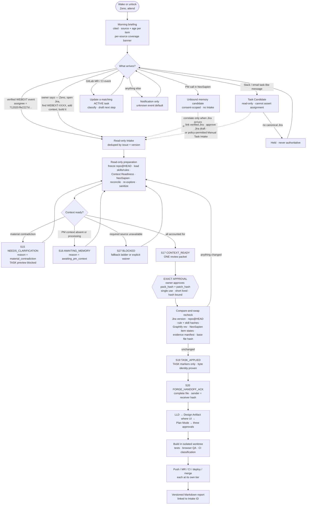
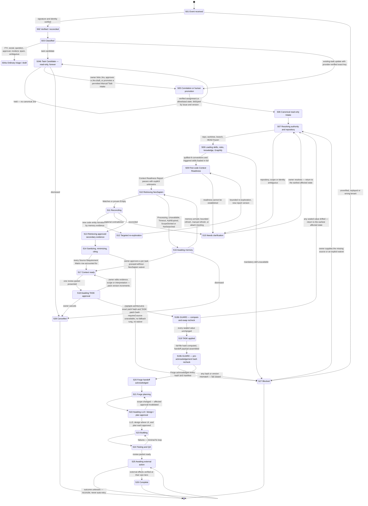
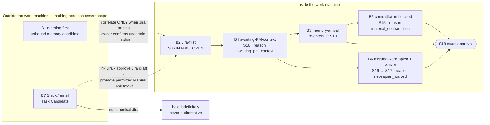
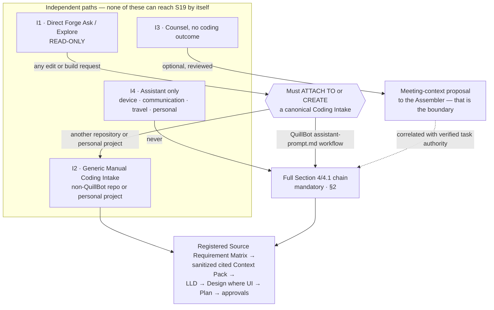

# 11 — Zeno: User Journeys and Information Architecture

**Phase 0B · Gate 1 design artifact · 2026-08-28**
**Sources:** master prompt **MP §4, MP §4.1, MP §4.2, MP §5.4** (incl. 5.4.1 / 5.4.2 / 5.4.3), **MP §5.8, MP §10.1**.
**Depends on and does not restate:** `10-PRD-suite-and-products.md` (product scope, capability tiers, approval tiers T0–T4, data zones Z1–Z6, degradation contract), `12-architecture-and-adrs.md` (components, trust boundaries, Flow A/B/C, ADR queue), `14-context-sanitization-gateway.md` (sink registry, purpose-bound views, lineage DAG).
**Governed by:** `03-corrections-log.md` (C-001…C-041), `research/L5-skeptic-review.md`, `04-assumptions-contradictions-unknowns.md`, `02-conflict-and-disposition-register.md`.

---

## 0. How to read this document

### 0.1 Evidence labels

Every material statement carries one:

- **[V] verified** — a primary artifact was read and is cited by file, section or correction ID.
- **[I] inferred** — a defensible reading of verified inputs; the reasoning is shown.
- **[U] unknown** — genuinely undetermined. **Preferred over a plausible guess.** An `[U]` is never quietly filled in downstream.
- **[D] design decision** — a choice this document makes, with its rationale and the conflict it would create if reversed.

### 0.2 Section-reference convention

**`MP §…` cites the master build prompt. A bare `§…` cites *this* document.** Other artifacts are cited by filename (`10-PRD` §11, `12-architecture` ADR-0010, and so on). The two numbering systems collide in several places — MP §4.1, MP §5.4, MP §9.1 and MP §10.1 all have same-numbered sections here — so the prefix is not decoration.

### 0.3 What this document is and is not

**It is:** the complete QuillBot working day as a testable journey set; the single canonical Section 4/4.1 state machine rendered as a diagram *and* a per-transition table; the Trigger Registry; the Source Requirement Matrix template with a non-collapse proof; and the information architecture of Zeno Command.

**It is not:** a second state machine. MP §4.1 names exactly one canonical state list, and this document renders **that** list. Where the prompt elsewhere uses a different phrase for the same state — "Awaiting PM context" (MP §4.1 Jira-first case) versus "Awaiting memory" (MP §4.1 state model) — this document maps the phrase onto the canonical state as a **typed reason code**, and says so explicitly, rather than inventing a competing state. Inventing states is how a single ordered machine silently becomes two.

**It does not re-resolve** any row of `02-conflict-and-disposition-register.md`, nor any conflict already recorded as owner-pending in `10-PRD` §11 (N-1…N-7) or `12-architecture` §10 (NEW-11…NEW-14). Where this document depends on one, it names the row and states the default in force. New conflicts it surfaces are in §12 and are **not** resolved here.

### 0.4 The authority this document is written against

The Jira authority is real and supplied by the owner **[V, `00-DECISIONS.md` 2026-08-24 evening]**:

| Field | Value |
|---|---|
| Site | `quillbot.atlassian.net` |
| Project | **WEBEXT** |
| Board | 15 |
| Acting account | `abheet.isher@quillbot.com` |
| Jira `accountId` | `712020:ffe2227d-9292-46ff-81db-6ee44ab6b470` |
| Allowlist | **WEBEXT only** — no other project may auto-intake |
| Automatic read-only Intake | **ON** (owner default, A-04) |
| Deduplication | by Jira issue + version (A-04) — exact key field availability is **[U]**, see §4.4 |

**Two facts constrain every journey below and are stated once here:**

1. **No Jira connector is connected** to the owner's session **[V, `00-DECISIONS.md`; `01-workspace-context-scope-record.md`]**. Connecting one is a separate new-service approval. Every Jira-triggered journey in this document is therefore a **Phase-3 design**, not a running behaviour, and every payload-shape claim about Jira events is labelled.
2. **Workspace Context Scope Record v1 explicitly excludes employer Slack, email and meetings content, and all NeoSapien memory content** **[V, `01-workspace-context-scope-record.md`]**. Consequently six of the nine Trigger Registry event classes have **no authorized source** today. Their correct default is the health state `not_configured` — **not** "enabled with recommended defaults". This is developed in §4.5 and raised as conflict **J-2** in §12.

### 0.5 Naming discipline

Zeno (assistant) · Zeno Forge (coding agent) · Zeno Counsel (meeting copilot) · Zeno Command (control plane) · Zeno Vault (memory) · **Zeno Mesh** (paired-device/sync layer) · Zeno Glass (design system). Wake phrase **"Zeno, attend"**. CLI `zeno`, deep-link scheme `zeno://`. Bundle root `com.abheet19.zeno`. Packages always scoped `@abheet19/zeno-*`.

Per `12-architecture` §10 NEW-14: the sync product is **Zeno Mesh**; the frozen acceptance-criterion IDs stay `LINK-AC-*`. Both halves are correct. Neither gets "fixed".

---
# PART A — THE QUILLBOT WORKING DAY

## 1. The day, end to end

### 1.1 Reading rule for the timeline

The clock column below describes **day structure**, not performance. **No duration, latency, deadline or "real-time" claim appears anywhere in this document**: B-002 (Windows pilot specifications) is open, `[U]` covers CPU/GPU/RAM, and `12-architecture` §8 withholds every numeric commitment until it closes **[V, L5 risk #2]**. Anything that looks like a time budget is an *ordering* statement.

The timezone itself is **[U]**. `00-DECISIONS.md` records *"All times local (Asia/Kolkata assumed until confirmed)"* **[V]**. MP §4 step 6 requires the NeoSapien search window to run *"from the start of the previous calendar day through now in my configured timezone"*. An assumed timezone moves that boundary and therefore changes **what counts as a verified no-match** — see conflict **J-3** (§12).

### 1.2 The day at a glance

| # | Moment | What Zeno does automatically | Tier | Canonical state reached | Receipt emitted | Never |
|---|---|---|---|---|---|---|
| 1 | Wake / unlock | Runs real health checks; presents a cited briefing of WEBEXT work, meetings, drafts, approvals, agent progress — **every item with source and age** | T0 | *(no Intake state; briefing is outside the work machine)* | `briefing-receipt` with per-source coverage vector | Turn a briefing into code, a message, a purchase, or any external mutation |
| 2 | PM/product call happens | Nothing, unless the owner opens Counsel. If Counsel runs: preflight → consent → capture per policy. The conversation may exist in NeoSapien under the vendor's own controls | T0/T1 | Unbound **memory candidate** — *outside* the Intake machine | `consent-ledger-entry`, `counsel-session-receipt` | Create code work, an Intake, or a TASK edit from ambient meeting speech |
| 3 | Jira assigns WEBEXT-XXXX to `712020:ffe2227d-…` | Verified event → **read-only Intake** created and deduplicated → ticket resolved and displayed → repository/worktree/branch/HEAD frozen | T0 | `S06 INTAKE_OPEN` → `S07 RESOLVING` | `event-verification-receipt`, `intake-receipt`, `frozen-source-receipt` | Start Forge, edit `ASSISTANT_PROMPT.md`, comment on the ticket, rerun CI, or touch code |
| 4 | Skills and rules load | `/quillbot-lt-conventions` loaded **in full** plus every triggered `SKILL.md` and required references; CLAUDE.md/AGENTS.md/checked-in rules; knowledge base and Graphify adapter output inventoried; hashes, precedence, scope and conflicts recorded | T0 | `S08 LOADING_SKILLS_RULES` | `skills-manifest-receipt` (hash + precedence + conflicts) | Silently pick a winner when a skill conflicts with newer checked-in source |
| 5 | First code Context Readiness | Architecture/ADRs, entry points, symbols, callers/callees, types, ownership, dependency graph, analogous implementations, recent history, tests, fixtures, flags/experiments, telemetry, CI/build commands, MV3 runtime boundaries, design sources, Graphify evidence, known incidents. Material claims verified against current source; **unexamined areas listed** | T0 | `S09 CODE_READINESS_1` | **Context Readiness Report** (cited, with an explicit unknowns list) | Present tokenization or embedding coverage as proof of understanding |
| 6 | NeoSapien retrieval plan and search | Plan derived from Jira + first code pass (keys, component, repo/package, symbols/flags, participants, meeting type, decision topics, window). Search runs read-only through the gateway: **previous calendar day 00:00 → now**, plus older items directly linked by ticket/epic/participants/component/code entity/decision | T0 | `S10 RETRIEVING_NEOSAPIEN` | `mcp-query-receipt` — query plan, timestamps + timezone, pagination cursors, completeness, and a **tagged** result state | Render `unavailable`, `processing`, `not authorized`, `stale` or `not searched` as "no memories" (§5.4) |
| 7 | Reconciliation | Authority order applied: current code and enforced checked-in rules govern implementation truth; current Jira + approved design define requested scope; timestamped speech is evidence, not decision; a human-confirmed decision outranks an AI summary. Contradictions, stale evidence and open questions surfaced | T0 | `S11 RECONCILING` | `reconciliation-receipt` with a typed conflict list | Let a NeoSapien summary or inference override code, policy or an approved human decision |
| 8 | Targeted re-exploration (conditional) | If meeting evidence introduces a new repository, file, symbol, experiment, dependency, boundary, acceptance criterion or constraint → **invalidate the affected Context Readiness result**, re-explore in bounded fashion, update the report | T0 | `S12 RE_EXPLORING` → back to `S09` | `readiness-invalidation-receipt` + a new Context Readiness Report version | Let a meeting detail reach the pack without passing back through code verification |
| 9 | Secondary evidence + sanitization | Only *additionally relevant* approved Slack/Figma/GitLab/email/calendar/meeting artifacts; every selected item and all derived content passes the Sanitization Gateway **for the exact TASK/Forge consumer** | T0 | `S13` → `S14 SANITIZING` | `view-manifest` per purpose-bound view; `sanitization-transform-log` | Over-redact useful implementation context, or under-redact secrets/cross-zone material (MP §9.1) |
| 10 | Review packet | **One** review packet — never a stream of partial prompts. Sealed Task Context Pack + TASK-only candidate diff + destination path + base-file hash + candidate-patch hash + repo/branch/HEAD + model/effort proposal + any missing-source waiver + the Source Requirement Matrix | T0 | `S17 CONTEXT_READY` → `S18 AWAITING_TASK_APPROVAL` | `sealed-pack-receipt`, `candidate-patch-receipt` | Apply the patch, or reveal the patch as applied |
| 11 | **The owner approves the exact pack + patch hash** | Nothing yet — approval is captured, single-use, short-lived, hash-bound | — | `S18b REVALIDATING_CAS` | `approval-token` bound to `(pack_hash, patch_hash, base_file_hash, repo@HEAD, skills_manifest_hash, model, permissions)` | Infer approval from "build it", a notification open, classifier confidence, a prior approval or a learned preference |
| 12 | Compare-and-swap | Re-checks Jira issue version/updated, repo/worktree/branch/HEAD, rule and skill hashes, knowledge/Graphify revision, **every selected NeoSapien item's current edit/deletion/supersession state**, the evidence-selection manifest and the `ASSISTANT_PROMPT.md` base hash. Unchanged → apply the TASK-only patch; prove byte identity outside the stable markers; verify the new file hash; checkpoint | T1 | `S19 TASK_APPLIED` | `cas-receipt` + `patch-applied-receipt` (immutable) | Apply on any drift — any change invalidates **only** the affected receipts and returns to the earliest affected state |
| 13 | Forge handoff | The **complete** hashed `ASSISTANT_PROMPT.md` plus Task Context Pack, Context Readiness Report, repo/branch/HEAD, skills/rules manifest and permissions cross the typed Forge protocol. Immediately before acknowledgement, every sealed hash is rechecked | T1 | `S19b` → `S20 FORGE_HANDOFF_ACK` | `handoff-receipt` with sender/receiver hash equality | Hand off TASK alone, a summary, or a truncated prompt; launch Forge before step 11's approval |
| 14 | Forge planning | Forge **validates and rehydrates the frozen upstream receipt**, then bounded post-handoff Explore on that same HEAD → LLD Artifact → Design Artifact where UI is affected → Plan Mode | T0 | `S21 FORGE_PLANNING` → `S22` | `lld-artifact-version`, `design-artifact-version`, `plan-hash` | Perform a second independent context assembly; write implementation code before all three approvals |
| 15 | Build | Isolated worktree/container, minimal edits, targeted then full relevant tests, browser/extension QA, review packet. CI failures classified as code / configuration / infrastructure / flaky; retries bounded by attempts, elapsed time and cost | T1 | `S23 BUILDING` → `S24 TESTING_QA` | `build-receipt`, `qa-evidence`, `ci-classification` | Click a pipeline indefinitely; bypass permissions except under a **visible** sandbox profile (register #4) |
| 16 | Communicate and ship | Push, MR creation, CI trigger/rerun, deployment, posting and merge each wait at their own tier, through the one Review Companion queue | T2/T3 | `S25 AWAITING_EXTERNAL_ACTION` | `outbox-action-id` + provider receipt with provider-accurate language | Blind-resend; call a Slack `ok:true` "delivered", "read" or "acknowledged" |
| 17 | Close | Final report becomes versioned Markdown linked to Intake ID, ticket, repo, branch/commit, Jira/NeoSapien/Graphify decisions and citations, skills, tests, CI/QA evidence and the Forge session. End-of-day view: completed, blocked, awaiting-response, tomorrow, memory proposals | T1 | `S26 COMPLETE` | `report-artifact-receipt` with lineage | Land it "in the authorized Obsidian Vault" — Obsidian is not installed **[V, X-03]**; see PRD **N-3**, default is the Zeno Vault Markdown root |

### 1.3 The day as a diagram



### 1.4 The one invariant the whole day exists to protect

> **Critical work-handoff invariant (MP §4).** Never paste a Jira description, Slack request, meeting summary or NeoSapien memory directly into Forge and call it a task.

Restated as a reachability property, which is how §2.4 tests it:

**TASK mutation (`S19`) and Forge handoff (`S20`) have in-degree 1, and their single predecessor chain passes through the exact-approval node.** Everything else in this document is either a way of reaching that node honestly, or a way of being refused.

---
## 2. The canonical Section 4 / 4.1 state machine

*Satisfies by design: **WORK-AC-02** (one ordered state machine, ordered transition matrix, input/output hashes, dependency assertions, compare-and-swap, failure injection at every transition), WORK-AC-01, WORK-AC-05, FORGE-HANDOFF-AC-01, NEO-MCP-AC-03, APPROVAL-BINDING-AC-01.*

### 2.1 State inventory

These are MP §4.1's states verbatim, given stable IDs. **Nothing is added.** Two entries — `S18b` and `S19b` — are not new states: they are MP §4 step 13's just-in-time compare-and-swap and step 14's immediately-before-acknowledgement recheck, promoted from prose into **named guarded edges** so that each can carry its own receipt and its own failure injection. They are marked `guard` and can never be resting states.

| ID | Canonical state (MP §4.1 wording) | Kind | May mutate anything outside Zeno? |
|---|---|---|---|
| `S01` | Event received | entry | no |
| `S02` | Verified / reconciled | working | no |
| `S03` | Classified | working | no |
| `S04a` | Ordinary triage / draft | working | no — local draft only |
| `S04b` | Task Candidate | **holding** | **no — read-only object, permanently** |
| `S05` | Exact Jira / existing-Intake correlation, or human promotion | working | no |
| `S06` | Canonical read-only Intake | working | no |
| `S07` | Resolving authority and repository | working | no |
| `S08` | Loading skills / rules / knowledge / Graphify | working | no |
| `S09` | First code Context Readiness | working | no |
| `S10` | Retrieving NeoSapien | working | no — read-only grant, zero writes |
| `S11` | Reconciling | working | no |
| `S12` | Targeted re-exploration | working | no |
| `S13` | Retrieving approved secondary evidence | working | no |
| `S14` | Sanitizing / minimizing / citing | working | no |
| `S15` | **Needs clarification** | holding | no |
| `S16` | **Awaiting memory** | holding | no |
| `S17` | **Context ready** | holding | no |
| `S18` | **Awaiting TASK approval** | holding | no |
| `S18b` | *(MP §4 step 13 compare-and-swap)* | **guard** | no |
| `S19` | **TASK applied** | working | **yes — the first local mutation of the day (T1)** |
| `S19b` | *(MP §4 step 14 pre-acknowledgement recheck)* | **guard** | no |
| `S20` | **Forge handoff acknowledged** | working | no |
| `S21` | Forge planning | working | no |
| `S22` | Awaiting LLD / design / plan approval | holding | no |
| `S23` | Building | working | **yes — local T1 inside an isolated worktree** |
| `S24` | Testing / QA | working | yes — local T1 |
| `S25` | Awaiting external action | holding | **only at T2/T3 with a fresh bound approval each** |
| `S26` | Complete | terminal | no |
| `S27` | Blocked | resumable terminal | no |
| `S28` | Cancelled | terminal | no |

**Reason codes, not extra states.** Two phrases in the prompt name situations, not states. They are carried as typed `reason` fields:

| Prompt phrase | Canonical state | `reason` code |
|---|---|---|
| "Awaiting PM context" (MP §4.1 Jira-first case) | `S16 AWAITING_MEMORY` | `awaiting_pm_context` |
| "A material conflict blocks the TASK preview" (MP §4 step 8) | `S15 NEEDS_CLARIFICATION` | `material_contradiction` |
| "proceed without NeoSapien" waiver (MP §4 step 13) | `S17 CONTEXT_READY` | `neosapien_waived` **plus** a required `waiver_receipt` |
| "missing or malformed TASK markers" (MP §4.1) | `S27 BLOCKED` | `task_markers_invalid` — template preview still permitted |
| "/quillbot-lt-conventions missing" (MP §4.1) | `S27 BLOCKED` | `mandatory_skill_unavailable` |

This mapping is **[D]**, and it is deliberate: MP §4.1 says *"the complete Section 4/4.1 … chain is mandatory"* and MP §5.4.2 says the cross-reference *"does not define a competing shortcut."* Adding a real state for each phrase would create exactly the second machine both sentences forbid.

### 2.2 The state machine



### 2.3 Transition table

Every row is a receipt. `Invalidated by` is the audit column WORK-AC-02 tests with failure injection; when a transition is invalidated the machine **returns to the earliest affected state** and must prove that `ASSISTANT_PROMPT.md`, the worktree and the Forge session remained unchanged.

Actors: **CG** connector gateway · **ORC** orchestrator · **WAR** Zeno Warrant (policy/approval) · **WCA** Work Context Assembler · **CE** Context Engine · **MG** MCP gateway · **SG** sanitization gateway · **OWN** the owner · **FG** Zeno Forge · **OB** outbox.

| # | From → To | Trigger | Precondition | Actor | Side effects | Receipt emitted | Invalidated by |
|---|---|---|---|---|---|---|---|
| T-01 | `[*] → S01` | Signed webhook, least-scoped poll tick, explicit owner command, or a connector delta | Trigger Registry entry exists and is enabled for this source, account and project | CG | Event persisted in the append-only event ledger; **nothing external** | `event-envelope` — tenant, source, actor, event ID, timestamp, sensitivity, access scope, provenance, idempotency key | Never — the envelope is immutable |
| T-02 | `S01 → S02` | Signature/identity check passes | Provider signature valid; actor and tenant inside the allowlist (**WEBEXT only**) | CG | Event marked verified; monotonic per-object reconciliation applied | `event-verification-receipt` | Provider key rotation; a later authoritative read contradicting the payload |
| T-03 | `S01 → S27` | Signature invalid, tenant wrong, replay detected, or clock skew beyond window | — | CG | Event quarantined; **never** enters the work machine | `rejection-receipt` with `reason` | Owner-authorized reconciliation against authoritative provider state |
| T-04 | `S02 → S03` | Classification runs | Verified envelope | ORC | Exactly one advisory class assigned with evidence, confidence and *why* | `classification-receipt` | Owner correction; a source edit or deletion |
| T-05 | `S03 → S04a` | Class ∈ FYI / social / question / approval request / incident / spam / ambiguous | — | ORC | **Local** draft may be prepared; no provider-visible state | `draft-version` | Source edit/deletion; thread event; ACL loss |
| T-06 | `S03 → S04b` | Class = task candidate | Message authenticated | ORC | **Read-only Task Candidate object created** with source, classification, confidence | `task-candidate-receipt` | Multiple ticket/repo/meeting matches; edit; deletion; ACL loss; changed Jira version |
| T-07 | `S03 → S05` | Class = existing-task update **and** an exact Jira key re-read read-only from `quillbot.atlassian.net` matches an open Intake | Key verified against the configured account, not parsed and trusted | ORC | Intake enriched; **no scope change** | `correlation-receipt` with the re-read issue version | Key not found; project outside WEBEXT; issue version changed; ambiguity |
| T-08 | `S04b → S05` | Owner links a verified Jira issue, approves a Jira-create payload that returns a key, or explicitly promotes a **policy-permitted** Manual Task Intake | The Manual Task Intake policy is **enabled** for this workflow — see conflict **J-1**, default is *disabled* | OWN + WAR | Candidate bound to canonical authority; candidate object retained with lineage | `promotion-receipt` naming which of the three paths was used | Jira key revoked; created issue deleted; policy disabled after the fact |
| T-09 | `S04b → S04b` | Snooze, "request clarification as an unsent draft", or no action | No canonical Jira | ORC | Stays held; may enrich a *verified existing* Intake; may prepare unsent drafts | `hold-receipt` with expiry | Expiry; owner dismissal |
| T-10 | `S05 → S06` | Verified assignment to `712020:ffe2227d-9292-46ff-81db-6ee44ab6b470`, or transition into an allowlisted actionable state, or an approved manual promotion | Deduplication key does not match an open Intake; concurrency limit not exceeded; project = WEBEXT | ORC + WAR | **Canonical read-only Intake created.** Owner notified with *review intake / pause / snooze / dismiss* | `intake-receipt` with canonical Intake ID | Duplicate detected → merge instead; assignee changed; issue moved out of WEBEXT |
| T-11 | `S06 → S07` | Intake opened or resumed | — | WCA | Jira site/account/project/key/version/assignee/status/epic/links/attachments/AC/due/priority resolved and **displayed** | `jira-resolution-receipt` (issue version + updated time) | Any Jira field change bumps the version and invalidates downstream receipts |
| T-12 | `S07 → S08` | Repository set resolved unambiguously | Exactly one candidate repository/worktree/branch/HEAD, or the owner picked one | CE | **Repo, worktree, branch and HEAD frozen** | `frozen-source-receipt` with index coverage | HEAD moves; worktree becomes dirty in a relevant path; branch deleted |
| T-13 | `S07 → S15` | Repository, task scope or identity ambiguous | — | WCA | Asks. **Does not guess** (MP §4 step 2) | `clarification-request` with the alternatives shown | Owner answers |
| T-14 | `S08 → S09` | `/quillbot-lt-conventions` and every triggered `SKILL.md` + required references read **in full** | Hashes, precedence, scope and conflicts recorded; conflicts with newer checked-in source **surfaced, not silently chosen** | CE | Skills manifest sealed into the Intake | `skills-manifest-receipt` — per-skill version + hash + precedence + conflict list | Any skill file hash change; a newer checked-in rule superseding a skill |
| T-15 | `S08 → S27` | `/quillbot-lt-conventions` missing, unreadable or unauthorized | — | WAR | **Blocks all QuillBot work** for this Intake (MP §4.1) | `block-receipt` `reason=mandatory_skill_unavailable` | Skill restored and re-hashed |
| T-16 | `S09 → S10` | Context Readiness Report passes | Report cites file/symbol/commit evidence, verifies material claims against current source, and **lists unexamined areas** | CE | Report v1 sealed | **Context Readiness Report** + `readiness-receipt` | Any frozen-source drift; a new code entity from T-20; a rule/skill hash change |
| T-17 | `S09 → S15` | Readiness cannot be established on a required area | e.g. index coverage gap, unreadable submodule, missing fixtures | CE | Names the gap | `clarification-request` `reason=readiness_gap` | Owner supplies access or narrows scope |
| T-18 | `S10 → S11` | Search returns `Matches(...)` or a **proven** `Empty(...)` | `Empty` is constructible **only** with a complete-pagination receipt (§5.4) | MG + WCA | Selected results only are fetched in full; the rest stay as metadata | `mcp-query-receipt` — provider/account, server/version, endpoint identity, scopes, schema hash, query, cursors, rate-limit state, result IDs, deep links, completeness | Any selected item later edited, deleted or superseded; scope revoked; schema hash change |
| T-19 | `S10 → S16` | Result state ∈ `Processing / Unavailable / Timeout / AuthExpired / ScopeDenied / NotSearched` | — | MG | Intake marked awaiting; offers **attach/select meeting · refresh · ask a clarification · proceed provisionally · snooze · dismiss** | `degradation-receipt` carrying the exact tag, never a count | The state resolving; the owner waiving; the owner dismissing |
| T-20 | `S11 → S12` | Memory evidence introduces a new repository, file, symbol, experiment, dependency, architecture boundary, acceptance criterion or constraint | — | WCA | **Invalidates the affected Context Readiness result** | `readiness-invalidation-receipt` naming the introduced entity | — (this transition *is* an invalidation) |
| T-21 | `S12 → S09` | Bounded targeted re-exploration completes | Bounded by named scope and budget | CE | Context Readiness Report version increments | `readiness-receipt` v*n+1* | Same as T-16 |
| T-22 | `S11 → S15` | A material conflict between sources is unresolved | Authority order applied first: code + enforced rules > current Jira + approved design > timestamped speech; human-confirmed decision > AI summary | WCA | **Blocks the TASK preview** (MP §4 step 8) — not merely the approval | `conflict-receipt` with each side's citation, timestamp and authority rank | Owner resolves, or a source updates and the conflict re-evaluates |
| T-23 | `S11 → S13` | Reconciled, no new code entity | Contradictions, stale evidence and open questions all recorded | WCA | — | `reconciliation-receipt` | New evidence arriving (returns via T-20 or T-28) |
| T-24 | `S13 → S14` | Only *additionally relevant* approved secondary artifacts selected | Each source is in the Workspace Context Scope Record | WCA | — | `secondary-selection-manifest` | Scope-record delta; ACL loss |
| T-25 | `S14 → S17` | Every Source Requirement Matrix row is `required-satisfied`, `optional`, `not-applicable-with-reason` or `waived-with-receipt`; conflicts resolved | The repository/HEAD and required checked-in rules/skills rows are satisfied — they are **not waivable** | SG + WCA | Purpose-bound view built **for the exact TASK/Forge consumer**; transformations and omissions recorded | `view-manifest` + `sealed-pack-receipt` (pack hash) | Any source watermark, ACL, policy version or detector version change |
| T-26 | `S14 → S27` | A required row is unavailable, the fallback ladder is exhausted, and no waiver is approved | — | WAR | — | `block-receipt` with the ladder rung reached | The source returning; an owner waiver where waivable |
| T-27 | `S15 → S07/S08/S09/S10/S11/S13` | Owner resolves the clarification | — | OWN | Returns to the **earliest affected** state, not to the top | `resolution-receipt` naming the return target | — |
| T-28 | `S16 → S10` | A matching finalized memory arrives, **or** a bounded rate-limit-aware refresh fires **while explicitly awaiting**, **or** the owner refreshes manually, **or** the owner attaches/selects a meeting | Push notification support is **[U]** — see §3.3 and conflict **J-4**; polling the entire memory history forever is prohibited | MG | New evidence **invalidates** any affected context/TASK approval | `refresh-receipt` with the bounded budget consumed | New evidence superseding it |
| T-29 | `S16 → S17` | Owner approves a **per-task** "proceed without NeoSapien" waiver | The waiver is recorded *in the pack*, is task-scoped, and never generalizes | OWN + WAR | Pack marked `neosapien_waived` and the Source Requirement Matrix row reads `waived` | `waiver-receipt` bound to this Intake and pack version | A new pack version; a new Intake; scope change |
| T-30 | `S16 → S28` | Owner dismisses | — | OWN | — | `cancellation-receipt` | — |
| T-31 | `S17 → S18` | **One** review packet presented | Never a stream of partial prompts (MP §4.1) | ORC | Shows exactly what came from Jira, code/Graphify, NeoSapien and other sources; citations, age, contradictions, missing/waived inputs, the candidate TASK diff, destination path, base-file hash, candidate-patch hash, repo/branch/HEAD, model/effort proposal | `review-packet-version` | Any upstream receipt invalidation |
| T-32 | `S18 → S18b` | **The owner approves the exact pack version and the exact TASK-patch hash inside the bound review surface** | Approval is single-use, short-lived, hash-bound, device-bound and executor-bound | OWN + WAR | **No mutation yet.** A capability token is minted | `approval-token` binding pack hash, patch hash, base-file hash, repo@HEAD, skills-manifest hash, model, permissions, policy version, nonce, expiry | Expiry; wrong device; any bound field mutating; a scope-record delta |
| T-33 | `S18 → S17` | Owner includes/excludes evidence, corrects a meeting interpretation, changes scope, or requests more exploration | — | OWN | Pack version increments; **the prior approval, if any, is void** | `pack-version-bump` | — |
| T-34 | `S18 → S28` | Owner cancels | — | OWN | — | `cancellation-receipt` | — |
| T-35 | `S18b → S19` | Compare-and-swap finds **every** sealed value unchanged | Rechecked: Jira issue version/updated time · repo/worktree/branch/HEAD · applicable rule and skill hashes · knowledge/Graphify revision · **every selected NeoSapien item's current edit/deletion/supersession state** · evidence-selection manifest · `ASSISTANT_PROMPT.md` base hash | WCA + WAR | **TASK-only patch applied.** Byte identity outside the stable markers proven; resulting file hash verified; file checkpointed | `cas-receipt` + immutable `patch-applied-receipt` | — (terminal for this edge; drift is caught *before*, by construction) |
| T-36 | `S18b → S07…S14` | Any sealed value drifted | — | WAR | **Invalidates only the affected receipts and the approval**; returns to the appropriate earlier state | `cas-failure-receipt` naming the drifted value and the return target | — |
| T-37 | `S19 → S19b` | Resulting full-file hash computed; handoff payload assembled | Payload = complete `ASSISTANT_PROMPT.md` + Task Context Pack + Context Readiness Report + repo/branch/HEAD + skills/rules manifest + permissions | WCA | — | `handoff-payload-receipt` | Any file change after hashing |
| T-38 | `S19b → S20` | Forge acknowledges destination path, full-file hash, TASK markers, pack version, repo/worktree/branch/HEAD, skill hashes, model, permissions and omissions — **all equal** | Sender hash = receiver hash | FG | Forge session bound to this Intake ID | `handoff-receipt` with both hashes | — |
| T-39 | `S19b → S27` | Any mismatch, truncation, wrong project chat, or reconnect losing the seal | — | WAR | **Fail closed.** Sealed pack retained; all hashes revalidated before any retry | `handoff-failure-receipt` | Retry after full revalidation |
| T-40 | `S20 → S21` | Forge validates and **rehydrates the frozen upstream receipt** | Never a divergent copy; never a second independent context assembly | FG | Bounded post-handoff **Explore** on the same HEAD only | `rehydration-receipt` | New scope or contradictory evidence → invalidates the upstream receipt and returns to the canonical machine |
| T-41 | `S21 → S22` | LLD Artifact produced; Design Artifact produced where UI is affected; Plan Mode entered | LLD carries problem, current behaviour, scope/non-goals, architecture and code evidence, components/contracts/data flow, file-level change map, alternatives, security/privacy/performance/accessibility impact, migrations, observability, test/QA matrix, rollout/rollback, open questions, requirement mapping | FG | — | `lld-artifact-version`, `design-artifact-version`, `plan-hash` | Scope change |
| T-42 | `S22 → S23` | LLD, design (where UI) and final small-MR plan **each** explicitly approved | Three separate approvals, not one | OWN | Build may begin | three `approval-token`s | Any changed scope invalidates the affected approval (T-43) |
| T-43 | `S22 → S21` | Scope changed | — | WAR | Returns to the appropriate earlier stage | `approval-invalidation-receipt` | — |
| T-44 | `S23 → S24` | Minimal edits complete in an isolated worktree/container | Dedicated worktree with mechanically-enforced no-push (L5 §3.2, promoted to architecture) | FG | Local T1 only | `build-receipt` with the diff stat and checkpoint | — |
| T-45 | `S24 → S23` | Test, QA or CI failure | Failure classified as code / configuration / infrastructure / flaky; retries bounded by attempts, elapsed time **and** cost | FG | — | `ci-classification-receipt` | Retry budget exhausted → `S27` |
| T-46 | `S24 → S25` | Review packet ready | Targeted and full relevant tests, browser/extension QA evidence, CI diagnosis | FG | — | `review-packet` | — |
| T-47 | `S25 → S26` | Every requested external effect committed and **verified** at its own tier | Each of push / MR / CI rerun / deploy / merge / post takes its **own** fresh preview and approval; T3 additionally requires a fresh platform-authenticator confirmation | OB + OWN | At most one commit attempt per approval; provider idempotency key where supported | `outbox-action-id` + provider receipt in provider-accurate language | Approval expiry; payload/recipient/policy change |
| T-48 | `S25 → S25` | A commit's effect cannot be proven | — | OB | **Outcome unknown.** Automatic retry frozen. Offers *inspect source / reconcile / take over / prepare a new action* | `outcome-unknown-receipt` | Reconciliation proving the authoritative state |
| T-49 | `any → S27` | Dependency health change, policy event, safe mode, or budget exhaustion | — | WAR | Fails closed at the nearest safe boundary; checkpoints preserved | `block-receipt` with the health state and affected workflows | Recovery + revalidation |
| T-50 | `any → S28` | Owner cancels, or the global kill switch fires | — | OWN | Outstanding capability tokens revoked; leases released; **no partial external effect left unreconciled** | `cancellation-receipt` | — |

### 2.4 Proof that TASK mutation and the Forge handoff are reachable only through the exact-approval path

This is **WORK-AC-02**'s core assertion. It is proved here as a graph property over §2.3, so that a test can check it mechanically rather than a reviewer checking it by reading.

**In-degree of the two mutating nodes:**

| Node | In-edges (complete) | Guard on the edge |
|---|---|---|
| `S19 TASK_APPLIED` | **exactly one** — `T-35` from `S18b` | CAS: every sealed value unchanged |
| `S20 FORGE_HANDOFF_ACK` | **exactly one** — `T-38` from `S19b` | sender hash = receiver hash, across nine named fields |
| `S18b` (the only predecessor of `S19`) | **exactly one** — `T-32` from `S18` | **owner approval bound to the exact pack hash and TASK-patch hash** |
| `S19b` (the only predecessor of `S20`) | **exactly one** — `T-37` from `S19` | full-file hash computed after the patch |

Therefore the unique path into either mutating node is:

```
S17 CONTEXT_READY → S18 AWAITING_TASK_APPROVAL → [owner approves exact pack + patch hash]
                  → S18b CAS → S19 TASK_APPLIED → S19b RECHECK → S20 FORGE_HANDOFF_ACK
```

and every node on it is preceded by `T-32`, the exact-approval edge. **There is no second path.** Three properties make that structural rather than merely drawn:

1. **Single approval edge.** `T-32` is the only transition in the entire table whose actor set includes `OWN + WAR` and whose effect is minting a capability token for TASK mutation. `T-42`'s three tokens authorize **Build**, not TASK, and `S22` is downstream of `S20` — it cannot re-enter `S19`.
2. **No re-entry from downstream.** No edge leaves `S20…S26` and lands on `S19` or `S20`. `T-43` returns to `S21`; `T-45` returns to `S23`; `T-40`'s "returns to the canonical state machine" on new scope re-enters at `S07…S14` — **upstream of the approval**, which is the point.
3. **Every bypass candidate is an explicitly prohibited edge** (§2.5), each with its own negative test.

**Mechanical check (proposed as a CI gate, `zeno-workmachine-lint`):** parse the transition table as a directed graph; assert `indegree(S19) == 1 ∧ indegree(S20) == 1`; assert every path from any entry node to `S19` contains `T-32`; assert no node in `{S04a, S04b, S15, S16, S21…S28}` has an edge to `S19` or `S20`. A pull request that adds an edge violating any of the three fails the build. This makes WORK-AC-02's "ordered transition matrix" a machine-checked artifact rather than a document.

### 2.5 Prohibited edges — the negative test suite

Each row is an edge that **must not exist**, the plausible reason someone would add it, and the test that proves it is absent. These are the failure injections WORK-AC-02 asks for.

| # | Prohibited edge | Why someone would add it | Test | AC |
|---|---|---|---|---|
| P-01 | `S04b → S19` | "The Slack message clearly describes the task" | Task-Candidate fixture with an unambiguous request, an ownership sentence and a deadline; assert zero TASK bytes changed and zero Forge sessions opened | TASK-CANDIDATE-AC-01, WORK-AC-01 |
| P-02 | `S03 → S06` (Slack/email/meeting directly creating an Intake) | "It has a Jira key in it" | Message containing a **spoofed** `WEBEXT-1234` string; assert the key is re-read read-only from `quillbot.atlassian.net` and, on mismatch or non-existence, no Intake is created | WORK-AC-01, TASK-CANDIDATE-AC-02 |
| P-03 | `S16 → S19` (proceeding when memory is unavailable) | "The search came back empty" | Inject `Unavailable`, `Processing`, `Timeout`, `AuthExpired`, `ScopeDenied` in turn; assert each is rendered with its own tag, none renders as "no memories found", and TASK mutation is blocked absent an explicit waiver receipt | NEO-MCP-AC-03, WORK-AC-04 |
| P-04 | `S15 → S18` (approving over an unresolved contradiction) | "The owner said build it" | Seed a code-vs-meeting contradiction; assert the **TASK preview itself** is withheld, not merely the approve button | WORK-AC-02 |
| P-05 | `S17 → S19` (skipping the approval node) | "Nothing changed since last time" | Replay a prior approval token against a new pack version; assert rejection on `pack_hash` mismatch | APPROVAL-BINDING-AC-01, WORK-AC-05 |
| P-06 | `S18 → S19` (skipping the CAS guard) | "The CAS always passes anyway" | Mutate each sealed value in turn between approval and application — Jira version, HEAD, a skill hash, a Graphify revision, a selected NeoSapien item's deletion state, the base file hash; assert six distinct `cas-failure-receipt`s and six distinct return targets | WORK-AC-02 |
| P-07 | `S19 → S21` (handing off without acknowledgement) | "Forge is obviously running" | Kill the Forge acknowledgement; assert fail-closed, sealed pack retained, and full revalidation before retry | FORGE-HANDOFF-AC-01 |
| P-08 | `S19b → S20` with a **partial** payload | "TASK is the part that matters" | Truncate the file, drop the manifest, drop the readiness report; assert each is refused on hash or completeness | FORGE-HANDOFF-AC-01 |
| P-09 | `S21 → S23` (building before the three approvals) | "The LLD is obviously fine" | Approve LLD only; assert Build refused. Approve LLD + plan with UI affected; assert Build refused pending the Design Artifact | LLD-GATE-AC-01, FORGE-AC-05 |
| P-10 | Any edge whose guard is a **wake phrase, voice identity, notification open, silence, "looks good", prior approval, learned preference, classifier confidence, urgency, standing autonomy or an agent vote** | Convenience | For each of the eleven, assert it authorizes read-only preparation and nothing else | WORK-AC-05, APPROVAL-BINDING-AC-01 |
| P-11 | `S10` writing to NeoSapien | "Marking the memory as used is harmless" | Assert the task-scoped grant contains zero write/delete/participant/capture/scope-broadening capabilities, and that any attempt is refused at the gateway, not at the adapter | NEO-MCP-AC-02 |
| P-12 | A NeoSapien transcript, Jira description or Slack message **selecting a tool, changing policy, or altering an approval tier** | Prompt injection | Injected-instruction corpus across all three sources; assert the content stays structurally isolated data | SAN-AC-04 |
| P-13 | `S25 → S25` auto-retry after `outcome unknown` | "It probably failed" | Kill the provider response after commit; assert retry is frozen and four controls are offered | OUTBOX-AC-01 |
| P-14 | Forge self-waiving a `required` source | "Forge can see the repo anyway" | Present a Matrix with `NeoSapien = required`, unavailable; assert Forge refuses and cannot mark it `not applicable` | FORGE-HANDOFF-AC-02, WORK-AC-04 |

---
## 3. The seven branches

All seven enter or leave the **same** machine in §2. None is a shortcut. The fan-in below shows where each attaches.



### 3.1 B1 — Meeting-first

**Entry.** A PM/product conversation happens **before** any Jira assignment. NeoSapien captures it under the vendor's own consent and account controls. Counsel is optional; if used, it declares its own capture/retention/provider state.

**Where it lives.** Outside the machine, as an **unbound, consent-scoped memory candidate**. It is not `S01`. It has no Intake ID.

| May | May never |
|---|---|
| Be held with its consent scope, participants, time window and provider state | Create code work, an Intake, a TASK edit or a Forge session from ambient speech |
| Be correlated **when Jira later arrives** by time, participants, project/ticket/component and decision terms | Assert an assignment, a scope, an acceptance criterion or a due date |
| Propose a match and **ask the owner to confirm any uncertain one** | Auto-merge on fuzzy similarity — similarity may only *propose*, and must show alternatives |
| Be dropped by the owner without trace beyond a tombstone | Persist beyond its consent scope |

**Correlation receipt** records: the anchors used (time, participants, project/component/decision terms), the alternatives considered, the confidence, and **who confirmed**. A confirmed correlation attaches the candidate to an existing Intake as *evidence*; it never creates one.

**Interaction with Counsel.** Counsel's own path terminates at a **reviewed meeting-context proposal** (COUNSEL-AC-01). That proposal is an input to the Assembler, not to Forge and not to TASK. The default in force is PRD **N-2**: dual capture **off**, NeoSapien optional and never required, Counsel's own artifact canonical, NeoSapien evidence always labelled as coming from an undocumented endpoint.

*ACs: WORK-AC-01, COUNSEL-AC-01, COUNSEL-AC-09, NEO-MCP-AC-04.*

### 3.2 B2 — Jira-first

**Entry.** The primary trigger: a verified Jira webhook (or least-scoped polling fallback) reports assignment to `712020:ffe2227d-9292-46ff-81db-6ee44ab6b470`, or a transition into an allowlisted actionable state, in project **WEBEXT**.

**Path.** `T-01 → T-02 → T-04 → T-10 → S06` and then straight down the spine: `S07 → S08 → S09 → S10`.

**What runs immediately.** Jira resolution and the **first** code-readiness exploration. Then NeoSapien is queried. This ordering is not cosmetic: MP §4 step 5 derives the retrieval plan *from* the Jira and the first code pass, which is what makes the memory search task-specific instead of "a day of conversation pasted into a prompt".

**Three outcomes at `S10`:**

| NeoSapien result | Next | Reason code |
|---|---|---|
| `Matches` or proven `Empty` | `S11 RECONCILING` | — |
| Relevant conversation is still processing, or has not happened | `S16 AWAITING_MEMORY` | `awaiting_pm_context` → **B4** |
| Service unavailable / auth expired / scope denied / timeout / not searched | `S16 AWAITING_MEMORY` | the exact tag → **B4 or B6** |

**Manual convergence.** *"Zeno, open Jira, find WEBEXT-XXXX, add the context to the assistant prompt, and build it"* enters the **same** Intake. Manual and automatic triggers with the same issue and version **merge** — they never create parallel builds. The imperative "and build it" authorizes the **read-only preparation only** (WORK-AC-05); it does not pre-approve `T-32`, `T-42` or anything downstream. This is ASSIST-AC-09's convergence requirement.

*ACs: WORK-AC-01, WORK-AC-02, ASSIST-AC-09, FORGE-AC-01, FORGE-AC-02.*

### 3.3 B3 — Memory-arrival

**Entry.** A newly finalized NeoSapien memory matches an Intake that is **explicitly awaiting context**.

**Effect.** Re-enters at `S10 RETRIEVING_NEOSAPIEN` via `T-28`. New evidence **invalidates the affected context/TASK approval** — including an approval already granted but not yet applied, which `T-36` then catches at the CAS guard.

**The design constraint that is easy to get wrong, and is load-bearing here:**

> MP §4.1 says the memory-arrival trigger applies *"if the verified official NeoSapien MCP supports notifications/subscriptions."*

That sentence rests on two things that are not true or not known:

1. **There is no verified official NeoSapien MCP** **[V, C-011 / C-001]** — zero results in the official MCP registry, zero in the claude.ai connector registry, nothing on any neosapien.ai property, no GitHub org. What exists is a live account-bound **undocumented vendor-hosted** connector (B-004).
2. **MCP `2026-07-28` replaced `resources/subscribe`** **[V, C-026]**, and removed protocol sessions, `Mcp-Session-Id`, `ping`, `logging/setLevel` and `notifications/roots/list_changed`, while making `server/discover` mandatory. Any subscription design written against the pre-`2026-07-28` primitive is designing against a removed API.

**Therefore [D]:** the memory-arrival trigger is specified as **bounded refresh only**, and any push/subscription path is `roadmap`, gated on *both* the replacement primitive's semantics **[U]** *and* whether the undocumented endpoint implements it **[U]**. Concretely:

- Refresh fires **only while an Intake is explicitly in `S16`**, never as a background sweep, and never over the entire memory history.
- The refresh budget is bounded by attempts, elapsed time and rate-limit state, all recorded in `refresh-receipt`.
- Manual refresh is always available and is the **guaranteed** path.
- The absence of a push mechanism is displayed as a capability fact in Zeno Command → Integrations, not hidden.

Raised as conflict **J-4** (§12).

*ACs: NEO-MCP-AC-03, CAP-AC-01, CAP-AC-02, WORK-AC-02.*

### 3.4 B4 — Awaiting PM context

**Entry.** `S16` with `reason = awaiting_pm_context`: Jira arrived, code readiness passed, and the relevant PM conversation is **still processing** or **has not happened**.

**The six offered actions** are exactly MP §4.1's list, and each has a defined effect:

| Action | Effect | Emits |
|---|---|---|
| **Attach / select meeting** | Owner picks a specific memory or meeting; re-enters `S10` with that item pinned | `manual-selection-receipt` |
| **Refresh** | One bounded refresh within budget | `refresh-receipt` |
| **Ask a clarification** | Prepares an **unsent** draft to a person; nothing is posted | `draft-version` (no provider state) |
| **Proceed provisionally** | **Does not** reach `S17`. Marks the pack `provisional`, keeps the NeoSapien row `unavailable`, and still requires the explicit waiver (B6) before TASK mutation | `provisional-marker` |
| **Snooze** | Holds with an expiry; refresh budget paused | `hold-receipt` |
| **Dismiss** | `T-30 → S28` | `cancellation-receipt` |

**The prohibition that defines this branch:** *"Do not represent temporary absence as a final no-match"* (MP §4.1). `awaiting_pm_context` is **not** `Empty`, is never counted as `0 results`, and never satisfies the NeoSapien row of the Source Requirement Matrix. §5.4 proves why this cannot collapse.

**"Proceed provisionally" is deliberately weaker than it sounds [D].** Read literally it could be taken as an alternative to the waiver. It is not: MP §4 step 13 says required-NeoSapien-unavailable blocks **TASK mutation and Forge handoff** until an official export is provided **or** the owner approves a per-task waiver. "Proceed provisionally" therefore continues *preparation* — Jira and code exploration and unrelated work — and stops at the same gate. Reading it any other way would create a second, waiver-free path to `S19`, violating §2.4. Raised as conflict **J-5** (§12).

*ACs: NEO-MCP-AC-03, WORK-AC-04, CAP-AC-02.*

### 3.5 B5 — Contradiction-blocked

**Entry.** `S15` with `reason = material_contradiction`, reached from `S11` by `T-22`.

**The authority ladder that must be applied before anything is called a contradiction** (MP §4 step 8, verbatim in effect):

1. **Current code and enforced checked-in rules** govern implementation truth.
2. **Current Jira plus approved design** define requested scope.
3. **Direct timestamped meeting speech** is evidence — **not** automatically a final decision.
4. A **human-confirmed decision outranks an AI summary**.
5. NeoSapien summaries and inferences **never** override code, policy or an approved human decision.

A disagreement resolved by that ladder is recorded as a **resolution with citations**, not a block. Only what survives the ladder is *material*.

**What "blocked" means here, precisely:** the **TASK preview is withheld** — not just the approve control. If the preview rendered, the owner could read a diff assembled from contradictory evidence and approve it, which is exactly the failure mode `T-22` exists to prevent (negative test P-04).

**The conflict receipt** shows, per side: the claim, the citation (file@commit, Jira field@version, memory ID + transcript span), the timestamp, the authority rank it was assigned, and *why* the ladder did not settle it. The owner's resolution names the winning side and becomes part of the pack.

**Typical shapes on WEBEXT work [I]:** a meeting decision contradicting a checked-in rule in `/quillbot-lt-conventions`; a Jira acceptance criterion contradicting current extension behaviour on a specific site tweak; a stale meeting decision superseded by a later one that the retrieval window did not reach; a Graphify-derived claim contradicting current source — which, given that the committed graph is **~48% vendored third-party noise and undirected** **[V, §03b]**, is expected often enough that Graphify evidence must always carry its node/edge ID and original evidence pointer for the ladder to rank it.

*ACs: WORK-AC-02, NEO-MCP-AC-04, FORGE-AC-04.*

### 3.6 B6 — Missing NeoSapien, with waiver

**Entry.** The NeoSapien row of the Source Requirement Matrix is `required` and its state is one of `Unavailable / Processing / Timeout / AuthExpired / ScopeDenied / NotSearched` after the fallback ladder has been walked.

**The fallback ladder as it actually exists.** MP §10.1 specifies *"verified official MCP → another verified official documented interface → official export/share/file drop → explicit per-task waiver/block."* **The first two rungs do not exist** **[V, C-011]**. `12-architecture` ADR-0010 / §10 **NEW-11** proposes the missing rung and flags it for owner ratification. This document uses that proposal as the **default in force** and does not re-decide it:

| Rung | Exists? | Status |
|---|---|---|
| 1. Verified official MCP | **No** **[V]** | Vacant |
| 2. Another verified official documented interface | **No** **[V]** | Vacant |
| 1b. **`vendor-provisioned-undocumented`** *(proposed, NEW-11)* | **Yes** — live account-bound connector **[V]** | Read-only · task-scoped · gateway-only · **never citable as "verified official documented"** · never a silent dependency · waiver-gated for any Forge handoff. **Owner ratification required** |
| 3. Official export / share / file drop | Available in principle; owner-supplied | Adapter path |
| 4. Explicit per-task waiver, or block | Always available | The terminal rung |

**The waiver contract [D].** A waiver is:

- **per task** — bound to one Intake ID and one pack version; a new pack version voids it;
- **recorded in the pack** and surfaced in the review packet and the final report;
- **never a policy change** — it does not enable "proceed without NeoSapien" for any other Intake;
- **never retroactive** — it cannot legitimize a search that was never run (`NotSearched` must first become a real attempt or be explicitly marked `not searched` with a reason);
- **never granted by Forge** — Forge cannot reconstruct, skip or self-waive a `required` source (negative test P-14).

**What continues without a waiver.** Jira and code exploration, Graphify/knowledge work, drafting, and any unrelated Intake. **What stops:** TASK mutation and the Forge handoff for **that Intake** — and only that Intake.

**The sentence that must survive to the UI:** *"the system never pretends the search returned no memories."* The Matrix row reads `unavailable` or `waived`, never `no result`, and never `not applicable`.

*ACs: NEO-MCP-AC-03, WORK-AC-04, CAP-AC-02, CAP-AC-04, FORGE-HANDOFF-AC-02.*

### 3.7 B7 — The Slack / email Task Candidate path

**Entry.** An authenticated inbound Slack message, email, comment or review is classified as `task candidate` (MP §5.4.2's nine advisory classes).

**The object it creates is read-only and stays read-only.** A Task Candidate is a **separate object**, not a proto-Intake.

| A Task Candidate **may** | A Task Candidate **can never** |
|---|---|
| Carry source, actor, account/workspace, thread, timestamp, evidence, confidence and *why* | **Assert Jira assignment** — no Slack/email/meeting message can |
| **Enrich a verified existing Intake** | Create an automatic Intake |
| Remain held while the owner decides | Create or edit a Jira issue |
| Have an **unsent** clarification draft prepared for it | Define final scope or acceptance criteria |
| Propose a link, showing alternatives, when similarity is fuzzy | Patch TASK, launch or hand off to Forge, edit code |
| Be snoozed, dismissed or muted-similar | Reply to the sender, post, react, or emit a typing indicator |

**Jira-key handling is the sharp edge.** A message containing `WEBEXT-1234` does **not** correlate on the string. The exact key is **re-read read-only against `quillbot.atlassian.net` under the configured account** before any correlation (TASK-CANDIDATE-AC-02). Non-existent, out-of-project (non-WEBEXT), moved or version-changed → no correlation. Fuzzy time/people/project similarity may only **propose** a link and must display alternatives for confirmation.

**The six offered controls** (MP §5.4 / MP §4.1): **link verified Jira · prepare Jira draft · prepare clarification/reply draft (unsent) · explicitly promote under an allowed Manual Task Intake policy · snooze · dismiss.**

**The Manual Task Intake control is the one that must be handled carefully [D].** MP §5.4.2 states that *only* the verified Jira trigger **or** an explicit policy-permitted Manual Task Intake reaches the canonical Intake. Whether that policy is permitted for the QuillBot workflow is **not specified anywhere in the owner's answers**: A-04 records "Jira allowlist WEBEXT only, auto read-only Intake ON" and nothing about a Jira-free promotion path. Because promotion would create a **second entry point to `S06`** — and therefore a Jira-free route toward `S19` — the strictest reading applies and the **default in force is: Manual Task Intake DISABLED for the QuillBot `assistant-prompt.md` workflow.** The control renders, disabled, with the reason *"not permitted by policy — enable in Command → Settings → Work Intake Policy"*. Raised as conflict **J-1** (§12).

**Invalidation.** Multiple ticket/repository/meeting matches, a source edit or deletion, ACL loss, or a changed thread/Jira version **invalidate affected correlations and every downstream draft**.

*ACs: TASK-CANDIDATE-AC-01, TASK-CANDIDATE-AC-02, TASK-CANDIDATE-AC-03, COMM-CLASSIFY-AC-01, COMM-DRAFT-AC-01, WORK-AC-01.*

### 3.8 Branch coverage against the day

| Branch | Enters at | Leaves to | Can reach `S19`? | Only via |
|---|---|---|---|---|
| B1 meeting-first | *(outside)* | `S06` as **evidence**, once Jira exists | No, by itself | The Jira path, then `T-32` |
| B2 Jira-first | `S01` | the spine | Yes | `T-32` |
| B3 memory-arrival | `S16 → S10` | the spine | Yes | `T-32`, and it **invalidates** any approval already granted |
| B4 awaiting-PM-context | `S16` | `S10`, `S17` (waived), or `S28` | Only after B6 | `T-29` then `T-32` |
| B5 contradiction-blocked | `S15` | earliest affected state | Yes, after resolution | `T-27` then `T-32` |
| B6 missing-NeoSapien + waiver | `S16` | `S17` with `neosapien_waived` | Yes | `T-29` then `T-32` |
| B7 Task Candidate | *(outside)* | `S05` only via link / approved Jira draft / permitted manual promotion | **No, by itself** | Never without canonical authority |

---
## 4. The Trigger Registry

*Satisfies by design: **WORK-AC-03** (versioned registry/schema, approved trigger profile, event-to-effect matrix, dedupe/correlation/quiet-hours/backfill tests, prohibited-transition tests across event classes), WORK-AC-01, ASSIST-AC-05, CAP-AC-01.*

> The registry exists so that **"always listening to events" never becomes "every event can start work."** It is a versioned configuration artifact under `config/zeno.yaml` + policy files, edited through Command with preview, diff, validation, migration, reset and rollback. **Adding or broadening a trigger is a reviewed configuration change, never a prompt-level improvisation.**

### 4.1 Registry entry schema

Every entry records all fourteen fields. An entry missing any of them is invalid and the loader refuses it (fail closed, not fail open).

| Field | Type | Notes |
|---|---|---|
| `event_class` | enum | One of the nine in §4.2 |
| `source_identity` | struct | Provider · exact account/tenant/workspace · endpoint identity · signature key ID · transport + protocol version |
| `filters` | list | Project/board/assignee/status/label/channel/repo/branch predicates. For WEBEXT: `project == WEBEXT`, `assignee.accountId == 712020:ffe2227d-9292-46ff-81db-6ee44ab6b470` |
| `dedupe_key` | template | §4.2 column 4. Must be derivable from the **verified** envelope alone |
| `debounce` | duration + policy | Coalescing window and whether coalesced events merge or the last wins |
| `allowed_automatic_steps` | list | Closed list. Anything not listed is prohibited by construction |
| `prohibited_steps` | list | Written **explicitly**, even where implied, because this is the field a reviewer reads |
| `scope` | struct | Account · project · device · data zone |
| `quiet_hours_behavior` | enum | `suppress_interruption_retain_queue` · `defer_processing` · `always_interrupt` (security only) · `notify_only` |
| `expiry` | timestamp | Registry entries expire; a stale entry stops firing rather than drifting |
| `required_approval_tier` | enum | Tier of the **escalation**, not of the automatic effect (which is always T0) |
| `observable_receipt` | schema ref | What lands in the audit ledger |
| `test` | test ref | The named negative test that proves the prohibited effect is impossible |
| `version` | semver + hash | Registry is versioned; every Intake seals the registry version it fired under |

**Two global rules:**

- **Unknown event types default to notification-only.** Not "ignore", not "best-effort classify" — a visible notification with the raw class name and a *configure this trigger* action.
- **`healthy` is not authorization** (MP §10.1). A registry entry firing proves an event arrived and was verified. It never proves the acting identity has authority to do anything with it.

### 4.2 Recommended defaults, per event class

Approval-tier column reads: *the automatic effect is always T0 (observe/prepare); this is the tier of the first consequential thing the event points at.*

| # | Event class | Permitted automatic effect (T0) | Prohibited effect | Dedupe key | Quiet-hours behaviour | Required approval tier for the escalation | Test |
|---|---|---|---|---|---|---|---|
| **1** | **Verified Jira assignment or allowlisted actionable-state transition** | Create/deduplicate a **read-only Intake**; resolve the ticket and display site/account/project/key/version/assignee/status/epic/links/attachments/AC/due/priority; begin approved repository Context Readiness; notify with *review intake / pause / snooze / dismiss* | Start Forge · edit `ASSISTANT_PROMPT.md` · comment on the issue · transition the issue · rerun CI · modify code · post anywhere | `jira:{site}:{project}:{issueKey}:{issue_updated_iso}:{changelog_id}` — see §4.4, exact field availability **[U]** | `suppress_interruption_retain_queue`. Intake **is still created** and preparation still runs (read-only); only the interruption is withheld. Queue surfaces at the next non-quiet moment | **T2** for the TASK patch's downstream effects; the TASK mutation itself is T1 but gated on the §2.4 exact approval; later LLD/design/plan gates still apply | WORK-AC-02 ordered-transition matrix; P-05, P-06; wrong-assignee denial; duplicate-issue merge; quiet-hours retention |
| **2** | **Explicit voice / chat / global-shortcut / Jira-key command** | Create **or resume the same** Intake; perform the named read-only preparation; an explicit Forge repository question may start **read-only Explore** | Resolve an ambiguous target by guessing · treat "and build it" as approval · create a parallel Intake for the same issue+version | `intake:{site}:{issueKey}` — **merges** with class 1 rather than creating a second Intake | `always_interrupt` for the response (the owner initiated it); no proactive escalation | **T0** for preparation. Implementation still follows context → LLD → design → plan → action approvals | ASSIST-AC-09 convergence; P-10 (imperative language authorizes nothing); ambiguous-target clarification |
| **3** | **Finalized NeoSapien memory or approved meeting artifact** | **Enrich or reopen** a matching existing or proposed Intake; invalidate stale context; notify. With no ticket, hold as an **unbound candidate** | Create code work · create an Intake · edit TASK · start Forge · accept a generated summary as a decision · poll the whole memory history | `neo:{account}:{memory_id}:{content_hash}` — `memory_id` stability is **[U]** (undocumented endpoint), so `content_hash` is mandatory, not a fallback | `defer_processing` — enrichment is not urgent; the invalidation it causes **is** recorded immediately so no stale approval survives quiet hours | **T0**; any downstream TASK effect returns to the §2.4 approval | NEO-MCP-AC-03 state distinctness; P-03; P-11 zero-write; B3's bounded-refresh budget |
| **4** | **Slack, email, calendar, Figma or product/design event** | Verify · classify into exactly one advisory class with evidence and confidence · triage · prepare a **local** draft · correlate a **provider-verified exact** Jira key with an existing Intake · create a read-only **Task Candidate** with source and confidence | **Assert assignment or scope** · create an automatic Intake · post/reply/react/RSVP · mark read where visible · emit a typing indicator · accept a meeting-derived decision · mutate Jira or TASK · hand off to Forge · start coding | Slack `slack:{team_id}:{channel_id}:{ts}` (+ `edited_ts`); email `email:{account}:{rfc822_message_id}:{revision}`; calendar `cal:{account}:{uid}:{sequence}`; Figma `figma:{file_key}:{version_id}` | `suppress_interruption_retain_queue`; **priority contacts and sensitive-channel rules are evaluated inside quiet hours** but only change *whether the queue surfaces*, never what is permitted | **T2** for any reply/post; **T2** for a Jira create from an approved draft (JIRA-CREATE-AC-01) | TASK-CANDIDATE-AC-01/02/03; COMM-CLASSIFY-AC-01; P-01, P-02; spoofed-key, multi-key, edited, deleted, replayed and injected fixtures |
| **5** | **GitHub / GitLab MR, review, branch or CI event** | Update the matching **active** task; analyze results; **classify failures** as code / configuration / infrastructure / flaky; prepare a draft or next-step proposal | Rerun · comment · push · amend · merge · deploy · expand scope · create an Intake from a branch name | `{provider}:{project_id}:{object_type}:{iid}:{updated_at}`; CI `{provider}:{pipeline_id}:{job_id}:{status}:{finished_at}` | `defer_processing`; a **failing pipeline on an owner-authored MR** may be configured to `notify_only` rather than suppressed — owner-configurable, default suppressed | **T2** rerun/comment/push/MR; **T3** merge and production deploy | FORGE-AC-08 bounded retries; register #4 (never click a pipeline indefinitely); backfill and out-of-order tests |
| **6** | **Counsel meeting detection or calendar start** | **Offer** meeting mode; run the visible source/consent/privacy **preflight** | Record · persist biometrics · join a call · create an Intake · issue a command · proceed on any failed or unknown critical check | `meeting:{calendar_uid}:{occurrence_start}` (+ `capture_session_id` once a session begins) | `notify_only` — never auto-start capture in quiet hours; the offer is retained | **T1** to start capture under a passing preflight; **T2** to share or send any artifact | COUNSEL-AC-03/04; fail-closed on unverified overlay visibility; detection-alone-cannot-record |
| **7** | **Wake phrase ("Zeno, attend"), double clap, login/unlock, schedule or morning briefing** | Wake the UI; run approved health and **read-only** briefing actions; surface due work | Turn a briefing or a scheduled observation into code, a communication, a purchase or any external mutation | `wake:{device_id}:{utterance_id}` within the debounce window; `briefing:{date}:{profile}`; `sched:{rule_id}:{fire_time}` with a **missed-run/catch-up policy** | `suppress_interruption_retain_queue` for scheduled/briefing; wake phrase and unlock are owner-initiated and always respond | **T0**. Standing consent may cover **only** precisely scoped T0/T1 behaviour; every external effect still takes a fresh T2/T3 approval | ASSIST-AC-01; VOICE-AC-11 offline profile; scheduler DST/missed-run/idempotency/expiry tests |
| **8** | **Device, security, connector, cost or policy alert** | **Pause or fail closed where required**; revoke capabilities through deterministic policy; notify; prepare recovery options | A model silently weakening policy · reconnecting an account · spending money · resuming a consequential action | `alert:{class}:{subject_id}:{policy_version}:{severity}` — **severity is part of the key**, so an escalation is never deduped away by an earlier lower-severity alert | `always_interrupt` for security and safe-mode classes; cost and connector-health classes follow `suppress_interruption_retain_queue` | **T2** to reconnect a connector; **T3** for secrets, permissions, remote wipe; **T4** — never — to disable audit or the kill switch | SAN-AC-11 fail-closed; CAP-AC-01 fourteen health states; kill-switch revocation |
| **9** | **Unknown / unregistered event type** | **Notification only.** Record the envelope; show the raw class name; offer *configure this trigger* | Everything else, including classification into an existing class | `unknown:{source}:{provider_event_id}` | `suppress_interruption_retain_queue` | **T2** to register a new trigger — it is a reviewed configuration change | Unknown-type fixture asserting zero automatic effect and zero classification |

### 4.3 Quiet-hours semantics — stated once, because it is easy to get backwards

**Quiet hours suppress *interruption*, not *work*, and never *permission*.** Three separate things are routinely conflated:

| Concept | What quiet hours do |
|---|---|
| **Interruption** — notification, sound, HUD, avatar callout | **Suppressed.** The queue is retained in full. |
| **Automatic read-only effect** — verify, classify, dedupe, create an Intake, run Context Readiness | **Continues**, unless the entry sets `defer_processing`. It emits no external state and no interruption, so there is nothing to suppress. |
| **Authority** | **Unchanged.** Quiet hours never widen or narrow what an approval tier permits. A T2 approval is still T2 at 03:00. |

Additional rules: locked/shared/untrusted-display masking is **independent** of quiet hours and applies at all times (SAN-AC-06, REVIEW-COMPANION-AC-02); a security or safe-mode alert overrides quiet hours (class 8); and the quiet-hours window is itself timezone-dependent — see **J-3**.

### 4.4 The dedupe key, honestly

A-04 records the owner default as *"dedupe by issue+version"*. Implementing that literally requires a Jira field that behaves like a monotonic version on the **verified webhook envelope**. Three observations, kept separate:

- **[U]** The exact payload shape of Jira webhooks for this site is unread — **no Jira connector is connected** **[V]**, and Phase 0 forbids connecting one.
- **[I]** The commonly available carriers of "version" are `issue.fields.updated` (a timestamp) and the `changelog.id` on a `jira:issue_updated` event. A timestamp alone is a weak version: **two edits inside the same clock granularity collapse into one key**, and the second is silently deduped away.
- **[D]** The recommended key therefore composes both — `…:{issue_updated_iso}:{changelog_id}` — and the registry entry additionally carries an `authoritative_recheck` flag requiring the Assembler to **re-read the issue version at `T-11` and again at the CAS guard `T-35`**, so that a missed webhook cannot become a stale approval. The webhook is a *hint*; the read-only re-read is the authority. This is also §5.4's `stale` state doing its job.

Raised as conflict **J-6** (§12).

Assume events are **at-least-once, duplicated, delayed, missing and out of order** (MP §5.4) — not exactly-once. Gap detection, replay windows, tombstones for deletion, clock-skew handling and a visible degraded state are all mandatory, and **a webhook alone never authorizes an external write**.

### 4.5 The registry instantiated for the owner's actual configuration

| Entry | Source | Status today | Why |
|---|---|---|---|
| `jira.webext.assigned` | `quillbot.atlassian.net` · WEBEXT · board 15 · assignee `712020:ffe2227d-…` | **`not_configured`** | The scope record declares Jira read-only intent and identity, but **no connector is connected**; connecting one is a separate new-service approval **[V]** |
| `jira.webext.actionable_state` | same | **`not_configured`** | Same. Also: **which statuses count as "actionable" is [U]** — the owner has not supplied the WEBEXT workflow's status set |
| `command.manual` | Local voice/chat/hotkey | **`healthy`** in principle — local only | No connector needed |
| `neosapien.memory_finalized` | Undocumented vendor-hosted connector | **`unsupported`** for push; **`not_configured`** for pull | Push primitive **[U]** twice over (§3.3); and scope record v1 permits **schema inspection only, zero data queries** in Phase 0 **[V]** |
| `slack.*`, `email.*`, `calendar.*`, `figma.*` | — | **`not_configured`** | **Employer Slack/email/meetings content is explicitly out of scope** under scope record v1 **[V]** |
| `git.gitlab.*`, `ci.*` | GitLab (the browser-add-on monorepo's provider) | **`not_configured`** | No GitLab authorization; U-07 records MR/pipeline history as blocked pending OAuth in an interactive session **[V]** |
| `counsel.meeting_detected` | Calendar or audio-session detection | **`not_configured`** | Requires a calendar connector (out of scope) or local audio-session detection, which needs the device broker — Phase 1+ |
| `assistant.wake`, `assistant.schedule` | Local | **`not_configured`** | Requires the signed device broker on the Windows pilot; blocked on B-002 |
| `alert.*` | Local policy/health | **`healthy`** | Local, and must work before anything else does |

**This is the finding, not a footnote:** with scope record v1 in force, **six of the nine event classes have no authorized source**. The correct representation is the health state **`not_configured`**, which is distinct from `offline`, from `unsupported`, and above all from "off" — because "off" implies a working capability the owner disabled, and that would be false. Raised as conflict **J-2** (§12). It also means the Trigger Registry ships as a **design and a schema** at Gate 1, with a populated profile blocked behind connector approvals — the same shape as the capability catalogues in register #9.

### 4.6 Registry change control

- The registry is **versioned**; every Intake seals the registry version it fired under, so an audit can reconstruct which rules were in force.
- Adding an entry, broadening a filter, widening a scope, lowering an approval tier or extending an expiry is a **T2 configuration change** with a scope-diff preview.
- The **model can never edit the registry.** Customization operates through audited tokens, components and schemas; a generative model may not invent or deploy runtime rules (MP §5.8).
- Every entry's `test` field must resolve to a runnable named test. An entry whose test is missing fails CI — the same gate shape as `zeno-workmachine-lint` in §2.4.

---
## 5. The Source Requirement Matrix

*Satisfies by design: **WORK-AC-04** (every Intake publishes the matrix and fallback ladder; required unavailable/stale/unauthorized stays distinct from verified empty and needs a fallback or waiver), **CAP-AC-02** (required/optional/substitutable with freshness minima and an approved fallback ladder; truthful `complete / fallback / partial / blocked / unknown`), NEO-MCP-AC-03, FORGE-HANDOFF-AC-02.*

> Published **per Intake**, versioned with the pack, and reprinted in the review packet and the final report. It is the single answer to *"what did this task actually stand on, and what did it not?"*

### 5.1 Template

| Column | Values | Rule |
|---|---|---|
| `source` | One of the eleven rows in §5.2 | Closed set for QuillBot work; Generic Manual Coding Intake uses its own registered set (§10.2) |
| `mark` | `required` · `optional` · `not_applicable` · `waived` | `not_applicable` **requires a recorded reason**; `waived` **requires a waiver receipt** |
| `owner` | Who is accountable for supplying it | The human or the component |
| `availability` | One of the **fourteen** canonical health states: `not_configured / discovering / healthy / degraded / stale / rate_limited / reauth_required / permission_denied / schema_changed / offline / unsupported / revoked / failed / recovering` | `healthy` is **not** authorization |
| `freshness` | `as_of` timestamp + `watermark` + `minimum_required_freshness` | Last-known data always displays age and cannot prove current external state |
| `evidence` | Pointer(s): file@commit · Jira field@version · memory ID + transcript span · Graphify node/edge ID + original evidence pointer + schema version · skill hash | Never the content itself in this table — a pointer, resolvable through the context inspector |
| `fallback_rung` | Which rung of the standard ladder was reached | `retry → alternate official path → local platform/repo data → approved stale snapshot → owner-supplied official export → explicit defer/waiver/block` |
| `result` | `complete-current` · `complete-with-approved-fallback` · `partial` · `blocked` · `unknown` | **No synonyms permitted** |
| `blocking_rule` | What this row blocks when unsatisfied | §5.2 column 5 |
| `receipt` | The receipt ID proving this row's state | Every row is auditable |

### 5.2 The eleven rows, with their blocking rules

| # | Source | Default mark (QuillBot workflow) | Waivable? | What it blocks when unsatisfied | Fallback ladder for this source |
|---|---|---|---|---|---|
| 1 | **Jira authority** (`quillbot.atlassian.net` · WEBEXT · the exact account) | `required` | No — but **substitutable** | No verified authority → no canonical Intake at all | verified webhook → least-scoped official polling → official issue export/attachment/permalink **with issue version and time** → local task draft explicitly labelled `Jira unverified`. **No automatic-assignment claim and no external create/update while Jira cannot be verified** |
| 2 | **Repository / worktree / branch / HEAD** | `required` — **mandatory, never waivable** | **No** | Everything. There is no QuillBot task without frozen source | official git → *(none — this is the authoritative local source)*. A dirty relevant path or a moved HEAD invalidates, it does not degrade |
| 3 | **`/quillbot-lt-conventions`** | `required` — **mandatory, never waivable** | **No** | **All QuillBot work** (MP §4.1, explicit) | read the skill file at its recorded hash → *(none)*. Missing or unreadable → `S27` `mandatory_skill_unavailable` |
| 4 | **Triggered skills + their required references** (`/lld-artifact`, and any skill whose documented trigger applies) | `required` **when its trigger applies**, else `not_applicable` with reason | No, when triggered | The stage that skill governs (e.g. no LLD without `/lld-artifact` when its trigger applies) | read in full at a recorded hash → surface conflicts with newer checked-in source → **never silently choose a winner** |
| 5 | **Checked-in rules** (CLAUDE.md / AGENTS.md / enforced repo rules) | `required` — mandatory | **No** | Implementation truth. These outrank meeting evidence and AI summaries by the §3.5 ladder | read at HEAD → *(none)* |
| 6 | **Knowledge base** | `optional` **unless configured authoritative** | Yes when optional | Nothing when optional — becomes an **explicit evidenced omission**, not a silent gap | local index → last approved snapshot labelled stale → explicit omission |
| 7 | **Graphify** | `optional` **unless configured authoritative** | Yes when optional | Nothing when optional | `graphify-out` adapter read → stale snapshot with as-of → explicit omission. **Every Graphify item carries node/edge ID, original evidence pointer, schema/version, branch/commit/time validity, ACL/zone, freshness and verification state** — required because the committed graph is ~48% vendored third-party noise and undirected **[V]** |
| 8 | **NeoSapien** | `required` for QuillBot TASK mutation (per MP §4 step 13's blocking rule) | **Yes — per-task waiver only** | **TASK mutation and Forge handoff** for that Intake only | §3.6's ladder, including the proposed `vendor-provisioned-undocumented` rung (NEW-11, **owner ratification required**) → official export/share/file drop → explicit per-task waiver or block |
| 9 | **`ASSISTANT_PROMPT.md`** (its stable TASK markers) | `required` — mandatory | **No** | **Mutation and handoff.** Missing or malformed markers block both **while still allowing a template preview** (MP §4.1, explicit) | read at base hash → *(none)*. The real path is `~/Work/ASSISTANT_PROMPT.md` (upper-case, underscored), **not** the prompt's `assistant-prompt.md` **[V, C-004]**; 322 lines, `# TASK` spanning lines 250–290 between stable headings **[V, `00-DECISIONS.md`]** |
| 10 | **Approved secondary sources** (Slack, Figma, GitLab, email, calendar, meeting artifacts) | `optional`, individually | Yes | Nothing individually; each unavailable one is an explicit evidenced omission | provider API → approved bounded polling → official export/permalink/attachment. Figma additionally: owner-supplied `.fig`/PDF/SVG/PNG/tokens with hash — **marked snapshot, never live**; a required design gate then blocks or needs explicit snapshot approval |
| 11 | **Forge target** (the correct project session) | `required` for handoff | No | The handoff only. Preparation and the sealed pack survive an outage | typed protocol → **visible** clipboard/paste fallback with received-hash verification → retain the sealed pack and **revalidate every hash before retry** |

**Three rules that the table encodes and that must not drift:**

- **Mandatory ≠ required.** `required` is a per-Intake mark; **mandatory** means the mark cannot be set to anything else. Rows 2, 3, 5 and 9 are mandatory. A UI that lets the owner downgrade them is a defect.
- **`not_applicable` is a claim that needs evidence.** It means *"this source is not configured as authoritative for this workflow"* — with the reason recorded. It never means *"we could not reach it"*. Confusing the two is the exact collapse §5.4 forbids.
- **Forge can neither reconstruct, skip nor self-waive a `required` row** (FORGE-HANDOFF-AC-02, negative test P-14). Only the owner waives, and only per task.

### 5.3 Worked example — a synthetic WEBEXT Intake

*Illustrative only. `WEBEXT-XXXX` is a placeholder; no claim is made about any real ticket. Values marked ⟨…⟩ are shapes, not data.*

| Source | Mark | Availability | Freshness | Evidence | Rung | Result | Blocks |
|---|---|---|---|---|---|---|---|
| Jira authority | `required` | `not_configured` **[V today]** | — | — | rung 5 — owner-supplied export would be needed | `blocked` | Intake creation. **In Phase 0 this row is why the whole journey is a design, not a run** |
| Repository @ HEAD | `required` (mandatory) | `healthy` | `as_of ⟨commit-time⟩` | `⟨repo⟩@⟨sha⟩`, worktree `⟨path⟩`, branch `⟨name⟩` | 3 — authoritative local | `complete-current` | — |
| `/quillbot-lt-conventions` | `required` (mandatory) | `healthy` | skill hash `⟨sha256⟩` | full read, precedence recorded | 1 | `complete-current` | — |
| Triggered skills | `required` (`/lld-artifact` trigger applies) | `healthy` | hash `⟨sha256⟩` | full read + required references | 1 | `complete-current` | LLD stage |
| Checked-in rules | `required` (mandatory) | `healthy` | at HEAD | `⟨paths⟩` | 1 | `complete-current` | — |
| Knowledge base | `optional` | `not_configured` | — | — | 6 — explicit omission | `partial` | nothing; **recorded as an omission in the pack** |
| Graphify | `optional` | `stale` | `as_of ⟨graph-run-time⟩`, min-freshness unset | `graphify-out/graph.json` node `⟨id⟩` + evidence pointer | 4 — approved stale snapshot | `complete-with-approved-fallback` | nothing; every item carries verification state |
| **NeoSapien** | `required` | `not_configured` (Phase 0: schema inspection only, **zero data queries**) **[V]** | — | — | 6 | **`blocked`** | **TASK mutation + Forge handoff**, until an official export or a per-task waiver |
| `ASSISTANT_PROMPT.md` | `required` (mandatory) | `healthy` | base hash `b986bcc67916821b…` **[V]** | `~/Work/ASSISTANT_PROMPT.md`, TASK markers at 250–290 | 1 | `complete-current` | — *(read-only inspection only in Phase 0; `~/Work` is never modified)* |
| Approved secondary | `optional` | `not_configured` (out of scope, record v1) | — | — | 6 | `partial` | nothing; omission recorded |
| Forge target | `required` for handoff | `not_configured` | — | — | 6 | `blocked` | handoff only |

**Aggregate result for this Intake: `blocked`.** Not `partial`, not `complete-with-approved-fallback` — because at least one `required` row is `blocked`. §5.5 states the aggregation rule that produces this.

### 5.4 Proof: `unavailable`, `processing`, `not authorized`, `stale` and `not searched` can never collapse into `no result`

The prohibition is stated twice in the prompt (MP §4.1 and MP §10.1) and appears as CAP-AC-02 and NEO-MCP-AC-03. Prohibitions stated in prose get violated by a `catch` block. So it is enforced structurally, at four layers, and the argument is given as a construction proof rather than a promise.

#### 5.4.1 The result type is a closed tagged union with no nullable and no default branch

Every source query returns exactly one of these. There is no `null`, no `undefined`, no bare array, and no `Option<T>`:

```
SourceResult =
  | Matches      { items: NonEmptyList<Item>, query_receipt, pagination: PaginationProof }
  | Empty        { query_receipt, pagination: CompletePaginationProof }   // the ONLY "no result"
  | Processing   { query_receipt, provider_state, earliest_recheck }
  | Unavailable  { attempted_at, health_state, last_success_at?, reason }
  | NotAuthorized{ attempted_at, scope_required, scope_held, reauth_path }
  | Stale        { snapshot, as_of, watermark, approved_by, min_freshness_required }
  | NotSearched  { reason: NotSearchedReason, would_require }
  | Unknown      { attempted_at, evidence }                              // last resort, still not Empty

PaginationProof         = { cursors_followed, pages, truncated: true|false, rate_limit_state }
CompletePaginationProof = PaginationProof with truncated == false        // enforced by the constructor
NotSearchedReason       = NotConfigured | OutOfScope | PolicyDenied | BudgetExhausted | OwnerDeclined
```

#### 5.4.2 The five states cannot be *constructed* as `Empty`

This is the load-bearing step. `Empty` is not "the absence of matches" — it is **a positive claim that a complete search found nothing**, and its constructor demands the evidence for that claim:

| State | What `Empty` would require that this state cannot supply |
|---|---|
| **`Unavailable`** | A `query_receipt`. There is none — the query never reached the provider. `Unavailable` carries `attempted_at` and a health state instead; neither can be coerced into a receipt. |
| **`Processing`** | `truncated == false`. The provider has explicitly said the result set is not final. `Processing` carries `earliest_recheck`; `Empty` has no such field to put it in. |
| **`NotAuthorized`** | A completed pagination walk over an authorized scope. The walk was refused. `scope_required` vs `scope_held` is a **diff**, not a page count. |
| **`Stale`** | An `as_of` equal to now. `Stale` structurally carries `as_of` **and** `watermark` **and** `min_freshness_required`; `Empty` has no `as_of` field, so a `Stale` value cannot be widened into `Empty` without discarding the three fields that make it honest — which the type checker refuses. |
| **`NotSearched`** | Any receipt at all. Nothing was attempted. `NotSearchedReason` is a policy or configuration fact, not a result. |

There is **no total function `Unavailable → Empty`**, and no partial one is written. The absence is checked, not trusted: see §5.4.4.

#### 5.4.3 Enforcement at four layers

| Layer | Mechanism | What it catches |
|---|---|---|
| **1. Type** | Closed union; exhaustive match required; the compiler rejects a missing case. **No default/`_` arm is permitted in any renderer or aggregator** — a lint rule forbids wildcard arms over `SourceResult`. | The single commonest cause of collapse: a `default:` that renders "none found" |
| **2. Gateway** | The MCP Gateway and every connector adapter return the **tagged value**, never a list. The Work Context Assembler has no API that yields a bare array. An adapter that throws is caught **at the gateway** and converted to `Unavailable{reason}` — **never to `[]`** | `try { … } catch { return [] }`, the second commonest cause |
| **3. UI** | The renderer is an exhaustive match producing a distinct visual state per tag, with distinct copy. The string *"No memories found"* exists at exactly **one** call site, reachable only from the `Empty` arm, and is asserted so by a source-level test | Copy drift, where two states end up sharing a sentence |
| **4. Test** | (a) A property test asserting `∀ s ∈ SourceResult. render(s) == "no result" ⟹ tag(s) == Empty`. (b) A fault-injection matrix firing all eight tags through gateway → assembler → matrix → pack → review packet → report, asserting the tag survives all six hops. (c) A mutation test that deletes each non-`Empty` arm and asserts the build fails | Regression |

#### 5.4.4 The negative-space check

A test can only assert on what exists. The coercion that must not exist is checked by **absence-of-code assertions**, run in CI:

- No call site converts a caught exception into an empty collection on any `SourceResult` path (AST rule).
- No wildcard match arm over `SourceResult` exists anywhere (lint rule).
- The literal strings for "no result", "none found", "0 memories" and their translations appear only inside the `Empty` arm (string-inventory rule).
- `SourceResult` is never serialized to a shape that loses its tag — the wire format is tagged, and a round-trip test proves `decode(encode(s)) == s` for all eight tags.

### 5.5 Where the collapse actually happens in practice — aggregation, counts and coverage

The five states rarely collapse one at a time. They collapse **in aggregate**, in three places. Each gets an explicit rule:

**(a) Aggregation.** Combining per-source results by concatenation (`all = a.items ++ b.items`) silently discards every non-`Matches` tag. **Rule:** aggregation over a heterogeneous source set returns a `CoverageVector` — one tag per source — plus a derived aggregate governed by this lattice:

```
if any REQUIRED source ∈ {Unavailable, NotAuthorized, NotSearched, Unknown}   → blocked
else if any REQUIRED source ∈ {Processing}                                    → blocked   (temporary absence ≠ absence)
else if any source ∈ {Stale}                                                  → complete-with-approved-fallback
else if any OPTIONAL source ∈ {Unavailable, NotAuthorized, NotSearched}       → partial
else if all sources ∈ {Matches, Empty}                                        → complete-current
```

There is **no rule that produces `complete-current` while any source is untagged**, and the aggregate is never a boolean.

**(b) Counts.** `"3 results"` is a lie when four sources were queried and two failed. **Rule:** a count never renders without its denominator and its coverage — `3 results across 2 of 4 sources · 1 unavailable · 1 still processing`. A bare count is a lint failure in the UI package.

**(c) Percentages and progress.** A completeness percentage computed over responding sources only is the same lie with a nicer shape. **Rule:** coverage denominators are the **configured** source set, not the responding one.

### 5.6 What the owner sees

Because a matrix full of tags is only honest if it is legible, the Command surface renders each row as: **source · mark · one-line state sentence in the state's own words · as-of · what it blocks · the one action that would change it.** Examples, one per tag:

| Tag | Sentence rendered | The one action |
|---|---|---|
| `Matches` | "7 items matched, all pages walked" | Review selection |
| `Empty` | "Searched previous calendar day 00:00 → now (⟨tz⟩), all pages walked, nothing matched" | Widen the window |
| `Processing` | "The provider says this memory is still processing; earliest recheck ⟨t⟩" | Refresh, or wait |
| `Unavailable` | "Could not reach the provider; last success ⟨t⟩" | Retry, or supply an official export |
| `NotAuthorized` | "The grant does not include ⟨scope⟩" | Reauthenticate (owner-driven only — Zeno never swaps accounts or asks for a token) |
| `Stale` | "Showing an approved snapshot from ⟨as-of⟩; this cannot prove current state" | Refresh |
| `NotSearched` | "Not searched — ⟨not configured / out of scope / policy denied / budget exhausted / you declined⟩" | Configure, or approve a scope delta |
| `Unknown` | "The outcome could not be established" | Inspect · reconcile · take over · prepare a new action |

**Note the timezone `⟨tz⟩` appears in the `Empty` sentence.** It has to: `Empty` is a claim about a window, and the window's boundary depends on a timezone that is currently **[U]** (conflict **J-3**). An `Empty` rendered without its timezone is not a verified no-match.

---
# PART B — INFORMATION ARCHITECTURE FOR ZENO COMMAND

## 6. IA principles

*Satisfies by design: **COMMAND-AC-01…10**, SUITE-AC-04, SUITE-AC-05, SUITE-AC-06, REVIEW-COMPANION-AC-01.*

1. **Command is an operational surface, not a landing page.** Every view resolves to real, inspectable state or truthfully reports that it cannot.
2. **One object, many surfaces.** Menu bar / tray glyph, HUD callout, notification, Approval Capsule, Approval Center and the phone all deep-link to **the same canonical versioned object**. Opening never approves. There is exactly one approval queue, one task/session graph, one audit ledger.
3. **Command mounts the products; it does not fork their state.** The embedded Forge and Counsel workspaces are the products' own modules. Command's crash must not take down a running build or a live meeting, and Command must be useful with Forge and Counsel **not installed** — their panels render `unsupported — not installed`.
4. **Permission-aware, not permission-hiding.** A view the owner has no capability for renders with its health state (`not_configured`, `permission_denied`, `unsupported`) and the exact reason. Silently hiding it would make the absence indistinguishable from the feature not existing — the same collapse §5.4 forbids, applied to navigation.
5. **Progressive disclosure, one level at a time.** Depth is capped at three: *section → view → detail*. Anything deeper is a panel inside the detail, not a fourth level.
6. **Read is visibly separated from consequential.** The launcher, the chat and every action list visually and structurally separate navigation/read actions from anything that mutates. Destructive or high-risk settings require reauthentication.
7. **Every list is first-class before any graph exists.** A node/graph rendering may exist only as a *view over* a linear list supporting the same operations — free-canvas node editors as the **primary** agent surface are `prohibited` (keyboard and screen-reader hostile **[V, L4]**; WCAG 2.1.1).
8. **Focus is a real border or outline, never a glow** — WCAG 2.4.13 Note 1 explicitly excludes shadow and glow effects **[V]**.
9. **Truthful degradation over empty boxes.** A panel renders its dependency's health state rather than a blank or a fabricated value.
10. **The audit ledger is separate from telemetry**, and no view can disable audit or the kill switch (T4).

## 7. Navigation tree

```
Zeno Command
│
├─ GLOBAL CHROME (present on every view)
│   ├─ G1  Status Rail — device · microphone · capture · model · network · privacy zone · safe mode
│   ├─ G2  Universal Launcher / Command Palette   [global hotkey]
│   ├─ G3  Main-Agent Chat (persistent, multimodal, streaming)
│   ├─ G4  Global Pause / Kill Switch  (one action, every interface)
│   ├─ G5  Approval Capsule  (tray/HUD — Windows first, macOS after Gate 3)
│   └─ G6  Context & Egress Receipt chips  (on every composer and response)
│
├─ 1 TODAY
│   ├─ T1  Today & Attention Center        — threaded, deduplicated; why now / what changed / source age / confidence / consequence of ignoring
│   ├─ T2  Briefings                       — morning · unlock · on-demand; per-item source + age; per-source coverage banner
│   ├─ T3  Task Candidates                 — read-only objects; link Jira · prepare Jira draft · clarification draft · promote (policy) · snooze · dismiss
│   └─ T4  Commitments & Focus Blocks      — calendar/time-block changes remain approval-governed
│
├─ 2 WORK
│   ├─ W1  Intakes                         — canonical read-only Intakes, by state
│   │      └─ W1.1 Intake Detail           — state-machine trace · Source Requirement Matrix · Context Readiness Report · sealed pack · TASK diff preview · receipts
│   ├─ W2  Tasks & Runs                    — active · queued · blocked · completed · failed, across agents and devices
│   │      └─ W2.1 Run Detail              — Observable Execution Stream · editable plan · dependencies · worktree/branch · budget · evidence · artifacts · checkpoints · cancel · retry
│   ├─ W3  Agents                          — scopes · coordination channel · leases · budgets · escalation rules · performance
│   ├─ W4  Project, Session & Artifact Library — project-only memory/data-zone boundaries · lineage · pinned/unread/running · resume/fork/archive/export/delete · temporary sessions
│   └─ W5  Workstation Control Center      — repos/worktrees/HEADs · IDE buffers · terminals/panes · processes/ports/dev servers/watchers/logs · toolchains · builds/tests · QA profiles · containers/VMs/DBs · git remotes · CI/release · cloud & k8s context · action tier · reproducibility receipts
│
├─ 3 APPROVALS
│   ├─ A1  Approval Center (Review Companion) — the canonical queue for all three products
│   ├─ A2  Outbox & Receipts               — durable action IDs · idempotency · outcome-unknown reconciliation · provider receipts
│   └─ A3  Scheduler & Rule Engine         — notify only · auto-research · auto-edit in sandbox · approval-gated external execution
│
├─ 4 PRODUCTS
│   ├─ P1  Forge workspace   (embedded, resumable) — chat · plan · inline editor/diff · terminal · browser QA · files · source control · MCP/context inspectors
│   ├─ P2  Counsel workspace (embedded, resumable) — upcoming/live/recent · preflight & consent · transcript/notes/suggestions · decisions & actions · search · exports
│   └─ P3  Vault workspace                 — Markdown root · knowledge graph navigation · every generated report and its provenance
│
├─ 5 CONTEXT
│   ├─ C1  Context Inspector               — current prompt pack · sources · token budget · omissions · memory scopes · conflicts · freshness · graph · per-item edit/pin/exclude/delete
│   ├─ C2  Sanitization & Data-Egress Inspector — sinks · raw-quarantine status (never raw content) · view manifests · classes included/omitted/transformed · placeholders · token-vault status · provider/region/recipient/retention · detector & policy versions · lineage · deletion/rebuild · leakage/utility evals · FP overrides · support-bundle preview · exact allow/block reason
│   ├─ C3  Context Migration Center        — Claude Code · Claude export · Codex local memory · ChatGPT export · Cursor · NeoSapien export/share · repositories · skills/MCP declarations · Obsidian — each with supported direction, authorization, preview, quarantine, provenance, sync, rollback, deletion
│   └─ C4  Knowledge & Graph               — Graphify adapter output with node/edge IDs and evidence pointers; verification state per item
│
├─ 6 CAPABILITIES
│   ├─ K1  Integrations & Connector Health — provider · acting account · scopes · token owner/expiry · webhook verification · last sync · data retained · pause · reconnect · revoke
│   ├─ K2  MCP Registry & Inspector        — hash-pinned human-approved tool manifests · per-tool allow/ask/deny · transport · schema hash · immediate disable + credential revoke
│   ├─ K3  Skill Registry & Workflow Builder — triggers · permissions · versions · tests · signatures · cost · enable/disable · rollback
│   ├─ K4  Models & Providers              — local downloads · licence and hardware compatibility · routing rules · effort presets · latency/cost/quality comparison · cloud-egress controls
│   ├─ K5  Capability, OAuth & Permission Explorer — action/entity → app → agent → device → connector/account → MCP tool → data zone → tier; exact allow/ask/deny reason + provenance; side-effect-free simulator
│   ├─ K6  Device Fleet & Voice/Presence Lab — pairing · trust · scopes · versions · resources/thermal · capture & privacy state · handoff/rotate/revoke/wipe · wake & clap sensitivity · mic calibration · vocabulary editor · enrollment/adaptation versions · unknown-speaker threshold · consented profiles · candidate review · replay/deepfake tests · consent withdrawal
│   └─ K7  Trigger Registry                — the MP §4.1 registry (this document's §4): entries, filters, dedupe keys, quiet hours, tiers, receipts, tests, versions, diffs
│
├─ 7 DIAGNOSTICS
│   ├─ D1  Workflow Debugger & Recovery    — hierarchical runs · Observable Execution Stream · sanitized per-step I/O · workers/queue/event timeline · stuck detection · checkpoint coverage · retry-from-safe-step · compare runs · undo/compensation status · exportable history
│   ├─ D2  Eval Dashboards                 — coding · retrieval · voice · meetings · GUI automation · policy · safety · performance · cost · battery · regressions
│   ├─ D3  Audit Search                    — immutable hash-chained ledger, separate from telemetry
│   └─ D4  Incident & Safe Mode            — fail-closed controls, capability revocation, recovery options
│
└─ 8 SETTINGS
    ├─ S1  Configuration (config/zeno.yaml) — versioned portable schema · preview · diff · validation · migration · reset · rollback · import/export/profiles
    ├─ S2  Theme Studio & Zeno Glass        — Dark default + System · Light · High Contrast · Reduced Transparency · Reduced Motion · 2D equivalents; in-app "solid surfaces" toggle is the mechanism
    ├─ S3  Privacy, Retention & Capture Exclusions — data zones · sensitive-app exclusions · meeting policies · export/erase · "do not learn from this"
    ├─ S4  Budgets & Quality Mode           — time/cost/action budgets per agent and per workflow
    ├─ S5  Accessibility                    — keyboard, screen reader, list parity, focus indicators, motion, contrast
    ├─ S6  Work Intake Policy               — WEBEXT allowlist · auto-intake on/off · **Manual Task Intake permitted? (default OFF — conflict J-1)** · concurrency · quiet hours · do-not-auto-intake projects
    ├─ S7  Fine-Tuning Lab                  — proposal → rights review → dataset card → local job → frozen-baseline comparison → leakage/regression inspection → approval → promote/rollback
    └─ S8  About & Third-Party Notices      — the in-product NOTICE/attribution surface CC-BY-4.0 affirmatively requires; four-column licence records
```

**Where the journeys land.** B1 memory candidates → **T1** and **W1.1**. B2 Intakes → **W1**. B3/B4/B6 waiting and waiver states → **W1.1**'s Source Requirement Matrix panel. B5 contradictions → **W1.1**'s conflict panel and **C1**. B7 Task Candidates → **T3**. The exact approval (`T-32`) is taken in **W1.1** or **A1** — the same canonical object either way. The Trigger Registry is edited in **K7** and its policy switch lives in **S6**.

## 8. View inventory and state coverage

### 8.1 The ten states, defined

Ambiguity here is what produces a view that "handles empty" by showing a spinner forever.

| State | Definition | The mistake it exists to prevent |
|---|---|---|
| **empty** | Zero eligible records **and the emptiness is proven** (§5.4's `Empty`) | Showing "nothing here" when the query failed |
| **loading** | First paint before data resolves. Skeleton, cancellable, and **must transition to `degraded` rather than spin indefinitely** (threshold **[U]**, blocked on B-002) | An infinite spinner standing in for an error |
| **streaming** | Ordered, growing content with a live tail; **reconnect-safe**, with an explicit **gap marker** when events were missed | Silently dropping events on reconnect |
| **approval** | The view holds or reflects ≥1 action blocked on a hash-bound approval. **Opening never approves** | A deep link that acts |
| **stale** | Displaying a previously-approved snapshot. Shows `as_of` + watermark. **Cannot authorize or prove current external state** | Treating cached data as current |
| **outcome-unknown** | A commit attempt's effect cannot be proven. Automatic retry **frozen**. Offers *inspect source / reconcile / take over / prepare a new action* | Blind retry, double-send |
| **degraded** | A dependency is in a non-healthy health state; the view still functions with **reduced, labelled coverage** | Presenting partial as complete |
| **offline** | No network. Local data only. **T2/T3 approvals cannot be granted for later execution** | Queuing an external write for "when we're back" |
| **error** | The view or its own query failed, distinct from a dependency health state | Collapsing app errors into "degraded" |
| **safe mode** | Suite is fail-closed after a security or policy event; capabilities revoked; only recovery controls render | A dashboard control becoming a permission bypass |

Legend for the matrices: **●** owed, needs its own design and test · **◐** owed, satisfied by the shared shell pattern · **—** not applicable, with the reason given.

### 8.2 Global chrome

| View | E | L | S | A | St | OU | D | O | Er | SM | Notes / N-A reasons |
|---|---|---|---|---|---|---|---|---|---|---|---|
| G1 Status Rail | — | ◐ | ● | — | ● | — | ● | ● | ● | ● | **E n/a:** the rail always has a state to show, even if every value is `not_configured`. **A n/a:** it reports, never approves. **OU n/a:** it holds no commits |
| G2 Launcher / Palette | ● | ◐ | — | ◐ | ● | — | ● | ● | ● | ● | **S n/a:** results are ranked sets, not streams. Must **visibly separate read/navigation from consequential** and must never cross project or privacy boundaries (COMMAND-AC-06) |
| G3 Main-Agent Chat | ● | ● | ● | ● | ● | ● | ● | ● | ● | ● | All ten. The chat is where every other state can surface |
| G4 Pause / Kill Switch | — | — | — | — | — | — | ◐ | ● | ● | ● | **Must remain operable in every other state** — that is its entire purpose. It cannot itself be empty, loading, streaming, approval-gated, stale or outcome-unknown |
| G5 Approval Capsule | ● | ◐ | — | ● | ● | ● | ● | ● | ● | ● | **S n/a:** a capsule shows one complete payload, never a partial stream. Masks content on locked/shared/untrusted displays independently of every state above |
| G6 Receipt chips | — | ◐ | — | — | ● | — | ● | ● | ● | ◐ | **E n/a:** "no context used" is itself a chip, not an empty state |

### 8.3 Today

| View | E | L | S | A | St | OU | D | O | Er | SM | Notes / N-A reasons |
|---|---|---|---|---|---|---|---|---|---|---|---|
| T1 Today & Attention Center | ● | ● | ● | ● | ● | ● | ● | ● | ● | ● | Must show **per-source coverage**; an item's absence is only "nothing today" when every source returned `Empty` |
| T2 Briefings | ● | ● | ● | ● | ● | — | ● | ● | ● | ● | **OU n/a:** a briefing commits nothing. A briefing with a required source missing is `partial`, never `complete` |
| T3 Task Candidates | ● | ● | — | ● | ● | — | ● | ● | ● | ● | **S n/a:** candidates arrive discretely. **OU n/a:** a candidate never commits. `approval` here is the Jira-draft / promotion path only |
| T4 Commitments & Focus Blocks | ● | ● | — | ● | ● | ● | ● | ● | ● | ● | Calendar/time-block changes are approval-governed, so both `A` and `OU` apply |

### 8.4 Work

| View | E | L | S | A | St | OU | D | O | Er | SM | Notes / N-A reasons |
|---|---|---|---|---|---|---|---|---|---|---|---|
| W1 Intakes | ● | ● | — | ● | ● | — | ● | ● | ● | ● | **S n/a:** a list of Intakes; the streaming lives in W2.1 |
| **W1.1 Intake Detail** | ● | ● | ● | ● | ● | ● | ● | ● | ● | ● | **All ten, and this is the densest view in the product.** It hosts the state-machine trace, the Source Requirement Matrix (all eight tags), the sealed pack, the TASK diff preview and the `T-32` approval |
| W2 Tasks & Runs | ● | ● | ● | ● | ● | ● | ● | ● | ● | ● | Across agents **and devices**; exactly one active executor must be visible |
| W2.1 Run Detail | ● | ● | ● | ● | ● | ● | ● | ● | ● | ● | Observable Execution Stream is the canonical `streaming` surface: reconnect-safe, gap markers, **never hidden chain-of-thought** |
| W3 Agents | ● | ● | ● | ● | ● | — | ● | ● | ● | ● | **OU n/a:** agents do not commit; their actions do, and those surface in A2 |
| W4 Project/Session/Artifact Library | ● | ● | — | ◐ | ● | — | ● | ● | ● | ● | **S n/a:** a library, not a feed. Must support a **truly temporary session** that reads no memory and contributes none |
| W5 Workstation Control Center | ● | ● | ● | ● | ● | ● | ● | ● | ● | ● | Must render truthful `unsupported`/`degraded` per capability and **never expose raw secrets**. `A` because start/stop/interrupt/takeover controls carry tiers |

### 8.5 Approvals

| View | E | L | S | A | St | OU | D | O | Er | SM | Notes / N-A reasons |
|---|---|---|---|---|---|---|---|---|---|---|---|
| A1 Approval Center | ● | ● | — | ● | ● | ● | ● | ● | ● | ● | **S n/a:** each capsule is complete or it is not shown. Offline: the queue renders, **and T2/T3 cannot be granted** |
| A2 Outbox & Receipts | ● | ● | ● | — | ● | ● | ● | ● | ● | ● | **A n/a:** it records approvals, it does not take them. `OU` is this view's defining state |
| A3 Scheduler & Rule Engine | ● | ● | — | ● | ● | ● | ● | ● | ● | ● | Standing consent covers only precisely scoped T0/T1; every external effect still takes a fresh T2/T3 |

### 8.6 Products

| View | E | L | S | A | St | OU | D | O | Er | SM | Notes / N-A reasons |
|---|---|---|---|---|---|---|---|---|---|---|---|
| P1 Forge workspace | ● | ● | ● | ● | ● | ● | ● | ● | ● | ● | Also owes `unsupported — not installed`, which is **not** one of the ten and must be designed separately |
| P2 Counsel workspace | ● | ● | ● | ● | ● | ● | ● | ● | ● | ● | Same. Plus its own fail-closed preflight state, which outranks `degraded` |
| P3 Vault workspace | ● | ● | — | ◐ | ● | — | ● | ● | ● | ● | **S n/a:** documents, not streams. **OU n/a:** local writes are checkpointed, not committed to a provider. Obsidian is **absent** **[V]** — see PRD **N-3** |

### 8.7 Context

| View | E | L | S | A | St | OU | D | O | Er | SM | Notes / N-A reasons |
|---|---|---|---|---|---|---|---|---|---|---|---|
| C1 Context Inspector | ● | ● | ● | ◐ | ● | — | ● | ● | ● | ● | `A` only for per-item pin/exclude/delete that changes a sealed pack — which **invalidates** the approval |
| C2 Sanitization & Egress Inspector | ● | ● | ● | ◐ | ● | — | ● | ● | ● | ● | Must show quarantine **status without exposing raw content**. In safe mode this view stays available — it is a diagnostic, not an action |
| C3 Context Migration Center | ● | ● | ● | ● | ● | ● | ● | ● | ● | ● | Must be honest per source: Cursor has **no official export** and retains embeddings + filename metadata permanently **[V]**; OpenAI documents **zero** export-to-another-agent path **[V]**; Codex memories are **off by default** and local enablement is **[U]**; Claude Code history before 2026-07-01 is **gone locally** **[V, U-06]** |
| C4 Knowledge & Graph | ● | ● | — | — | ● | — | ● | ● | ● | ● | **A/OU n/a:** read-only over adapter output. Every item shows node/edge ID, evidence pointer, schema version and verification state |

### 8.8 Capabilities

| View | E | L | S | A | St | OU | D | O | Er | SM | Notes / N-A reasons |
|---|---|---|---|---|---|---|---|---|---|---|---|
| K1 Integrations & Connector Health | ● | ● | ● | ● | ● | ● | ● | ● | ● | ● | `A` for reconnect/scope-diff (T2); `OU` for a revoke whose provider outcome is unproven |
| K2 MCP Registry & Inspector | ● | ● | ● | ● | ● | — | ● | ● | ● | ● | Tool manifests are **hash-pinned and human-approved**; a schema change moves the server to `schema_changed` and disables it pending review |
| K3 Skill Registry & Workflow Builder | ● | ● | — | ● | ● | — | ● | ● | ● | ● | Skills are **untrusted supply-chain artifacts** until reviewed, pinned and allowed |
| K4 Models & Providers | ● | ● | ● | ● | ● | ● | ● | ● | ● | ● | `OU` for an interrupted local download. Licence and hardware compatibility are first-class columns, not a footnote |
| K5 Capability / OAuth / Permission Explorer | ● | ● | — | — | ● | — | ● | ● | ● | ● | **A/OU n/a by design — the simulator is side-effect-free.** That is the whole point of the view |
| K6 Device Fleet & Voice/Presence Lab | ● | ● | ● | ● | ● | ● | ● | ● | ● | ● | `OU` for a remote wipe whose outcome is unproven. Enrollment, thresholds and consent-withdrawal controls live here |
| K7 Trigger Registry | ● | ● | — | ● | ● | — | ● | ● | ● | ● | Every entry shows its **health state** — and with scope record v1 in force, most read `not_configured` (§4.5) |

### 8.9 Diagnostics

| View | E | L | S | A | St | OU | D | O | Er | SM | Notes / N-A reasons |
|---|---|---|---|---|---|---|---|---|---|---|---|
| D1 Workflow Debugger & Recovery | ● | ● | ● | ● | ● | ● | ● | ● | ● | ● | `A` for retry-from-safe-step, which is a real action with a tier |
| D2 Eval Dashboards | ● | ● | ● | — | ● | — | ● | ● | ● | ● | **A/OU n/a:** reporting only. `roadmap` per PRD §6.5 |
| D3 Audit Search | ● | ● | ● | — | — | — | ● | ● | ● | ● | **St n/a:** the ledger is append-only and hash-chained; it is never stale, only incomplete. **Must remain readable in safe mode** |
| D4 Incident & Safe Mode | — | ◐ | ● | ● | — | — | ◐ | ● | ● | ● | **E/St/OU n/a:** it is the recovery surface. `A` for reauthenticated recovery actions |

### 8.10 Settings

| View | E | L | S | A | St | OU | D | O | Er | SM | Notes / N-A reasons |
|---|---|---|---|---|---|---|---|---|---|---|---|
| S1 Configuration | — | ◐ | — | ● | ● | — | ◐ | ● | ● | ● | **E n/a:** the schema always has defaults. `A` because destructive settings require reauthentication; `St` when the on-disk file diverges from the running config |
| S2 Theme Studio & Glass | — | ◐ | — | — | — | — | ◐ | ◐ | ● | ◐ | Mostly local and always available. `D` when the GPU path is unavailable and surfaces fall back to solid |
| S3 Privacy, Retention & Exclusions | — | ◐ | — | ● | ● | ● | ● | ● | ● | ● | `OU` for an erase whose provider-side outcome is unproven — deletion cascade receipts live here |
| S4 Budgets & Quality Mode | — | ◐ | — | ● | ● | — | ◐ | ● | ● | ● | |
| S5 Accessibility | — | ◐ | — | — | — | — | — | ◐ | ● | ◐ | **Must never itself become unavailable.** Accessibility settings degrade last, not first |
| S6 Work Intake Policy | — | ◐ | — | ● | ● | — | ◐ | ● | ● | ● | Hosts the **Manual Task Intake** switch, default **OFF** (conflict **J-1**), and the WEBEXT allowlist |
| S7 Fine-Tuning Lab | ● | ● | ● | ● | ● | ● | ● | ● | ● | ● | `roadmap`. Must never imply a job is local when it is not |
| S8 About & Third-Party Notices | — | ◐ | — | — | — | — | — | ◐ | ● | ◐ | **Must render offline and in safe mode** — a CC-BY-4.0 attribution obligation that only renders when the network is up is not discharged |

### 8.11 Coverage summary

| | Count |
|---|---|
| Views inventoried | **46** — 6 global chrome + 40 sectioned (including the two detail views `W1.1` and `W2.1`) |
| State cells specified | **460** = 46 views × 10 states |
| **●** owed with its own design and test | 351 |
| **◐** owed via the shared shell pattern | 30 |
| **—** not applicable | **79, each with a stated reason in its own row** — no bare exemptions |
| Views owing **all ten** states | **14** — G3, T1, W1.1, W2, W2.1, W5, P1, P2, C3, K1, K4, K6, D1, S7 |
| Views that must remain operable in **safe mode** | G1, G3, G4, D3, D4, S5, S8 |
| Views that must remain operable **offline** | all 46 — offline is a rendering state, never a disappearance |
| Views owing the eleventh, non-required state `unsupported — not installed` | P1, P2 (conflict **J-7**) |

---

## 9. Cross-cutting IA mechanics

### 9.1 Deep links (`zeno://`)

One canonical object, addressed identically from every surface.

| Link | Resolves to | Rules |
|---|---|---|
| `zeno://intake/{intake_id}` | W1.1 | — |
| `zeno://intake/{intake_id}/matrix` | The Source Requirement Matrix panel | — |
| `zeno://approval/{action_id}?v={version}` | A1 or G5, same object | **Opening never approves.** A version mismatch renders `stale` and requires a fresh preview |
| `zeno://run/{run_id}/step/{step_id}` | W2.1, scrolled to the step | — |
| `zeno://candidate/{candidate_id}` | T3 | — |
| `zeno://capability/{action}?entity={id}` | K5 simulator | Side-effect-free by construction |
| `zeno://audit/{correlation_id}` | D3 | — |

**Three invariants:** a deep link never carries payload content in the URL (SAN-AC-06 — and never personal data in a query string); a link is **not** authorization — the target re-checks capability, device binding and expiry; and APNs/FCM payloads carry only **opaque expiring references**, never content. Deep-link spoofing is a named test (REVIEW-COMPANION-AC-02).

### 9.2 The notification → capsule → center ladder

| Surface | May show | May never show | Controls |
|---|---|---|---|
| Notification (unlocked, owner-private Mac/PC, OS preview setting permitting) | The complete **sanitized** proposed reply plus sender/thread and an abbreviated rationale | Anything on a locked, shared, screen-shared, external or meeting-profile display — those default to generic **"Approval needed"** with no sender, ticket, repository, branch, file, excerpt or payload; and it is **never spoken** | **Review · Snooze · Dismiss** — never blind Send or Approve |
| Approval Capsule (G5) | The **complete exact** payload — resolved recipients including CC/BCC and distribution-list expansion, attachments and hashes, visibility, schedule, side effects, sanitization chips, risk tier, expiry, action hash | Raw secrets, raw quarantine content | Edit · Regenerate · Explain · Open authoritative source · Approve · Deny · Snooze · Dismiss · Do-not-draft-similar |
| Approval Center (A1) | Everything the capsule shows, plus queue-level history, outbox state and provider receipts | Same | Same, plus reconciliation |

The Strategic Cortex / avatar may point at the relevant anchored card with a restrained focus ring and explain in plain language **why** attention is needed. It may **never** approve, hide, reorder deceptively or obstruct controls, and it never appears in Counsel's live overlay, approvals, payments, errors or secure fields.

### 9.3 Accessibility and input parity

Every surface provides identical keyboard, list, VoiceOver/Narrator, Voice Control, Full Keyboard Access, Reduced Motion and 2D behaviour. Two consequences that shape the IA rather than decorate it:

- **The list is the primary structure everywhere**, and any graph is a secondary view over it with the same operations (principle 7).
- **Focus indicators are borders or outlines.** No glow, ever **[V, WCAG 2.4.13 Note 1]**.
- Dismissal restores the prior app, focus and insertion point where the OS permits; editing explicitly activates a surface rather than stealing focus.

---
# PART C — THE INDEPENDENT PATHS

The suite must be usable without the canonical QuillBot machine. MP §4.2 names four such paths. Each is complete on its own, and each has a precisely defined seam back to the machine so that "independent" never becomes "unsupervised".



## 10. The four independent paths

### 10.1 I1 — Direct Forge Ask / Explore (read-only)

**Entry.** The owner opens Zeno Forge on a repository and asks a question. No Intake, no Jira, no ticket.

**What it is.** `Ask` and `Explore` are **read-only** and run over the **shared headless Context Engine** and a frozen repository state — the same engine the Assembler uses. There is no second code-intelligence implementation and no separate repository map, skill precedence or exploration truth (MP §4).

| Guaranteed | Structurally impossible |
|---|---|
| Answers cite **file, symbol, commit and date**, and state explicit unknowns | Any file write, any `git` mutation, any push |
| The exploration is bounded and its unexamined areas are listed | Creating a write capability as a side effect of asking |
| The session is resumable and belongs to the Project/Session Library | Reaching `S19` or `S20` |

**The seam.** *"Any edit/build request from direct Forge chat must attach to or create a canonical Coding Intake, satisfy its registered Source Requirement Matrix, produce a sanitized cited Context Pack, and pass the LLD/design/plan gates."* Two destinations, decided by **which repository**:

- **A QuillBot `ASSISTANT_PROMPT.md` workflow repository** → the complete §2 chain is **mandatory**. No abbreviation, no self-service.
- **Anything else** → the Generic Manual Coding Intake (§10.2).

**The failure mode this seam prevents:** a direct question that drifts into *"just fix it while you're there"*. The drift is caught because Build requires an Intake ID and an approved plan hash, neither of which a chat turn can synthesize (negative test P-14; FORGE-HANDOFF-AC-02).

**Where it lives in the IA:** `P1 Forge workspace` inside Command, or the standalone Forge app; the session appears in `W4` and any escalation creates a row in `W1`.

*ACs: FORGE-HANDOFF-AC-02, FORGE-AC-01, FORGE-AC-07, LLD-GATE-AC-01.*

### 10.2 I2 — Generic Manual Coding Intake

**Entry.** Non-QuillBot work: another repository, a personal project, or a spike.

**Required contents** (MP §4.2, in full):

| Field | Note |
|---|---|
| Owner-approved **goal** | The authority substitute for Jira. Owner-stated, recorded, versioned |
| Repository / worktree / branch / **HEAD** | Frozen, exactly as in `T-12`. **Mandatory, never waivable** |
| Applicable rules and skills | Whatever the repository and configuration actually trigger |
| **Code Context Readiness** | The same report contract as `S09`, with the same explicit-unknowns requirement |
| Constraints | Including data zone — a personal project is Z1, not Z2 |
| **Acceptance tests** | The substitute for Jira acceptance criteria |

**The `not_applicable` rule, precisely.** Jira, NeoSapien, Graphify/knowledge and `ASSISTANT_PROMPT.md` may be marked `not applicable` **individually**, **with a recorded reason**, and **only when they are not configured as authoritative for that workflow**. Three things follow:

1. **It is a per-source mark, not a profile.** "Generic mode" does not switch four rows off at once. Each is marked, each carries a reason, each is printed in the pack.
2. **`not_applicable` ≠ `unavailable`.** Marking NeoSapien `not applicable` for a personal project is honest — it is not configured as authoritative there. Marking it `not applicable` because it timed out is the §5.4 collapse and is refused: an unreachable configured source is `unavailable`, and the ladder applies.
3. **Forge cannot set these marks.** *"Forge cannot reconstruct, skip or self-waive any source marked required"* — and it cannot demote a `required` row to `not applicable` either. The mark is owner or policy, never agent.

**What is identical to the QuillBot path:** code readiness, sanitization, the sealed cited Context Pack, the LLD → Design (where UI) → Plan → approvals sequence, isolated-worktree build, the review packet, and every action tier. **What differs:** the authority source and which rows are applicable. Nothing about the gates changes.

**Zone discipline.** A Generic Intake over a personal repository is **Z1**. It must not pull Z2 (company) context, and the Sanitization Gateway's purpose-bound view key makes that a structural property, not a convention.

*ACs: FORGE-HANDOFF-AC-02, WORK-AC-04, CAP-AC-02, LLD-GATE-AC-01.*

### 10.3 I3 — Counsel with no coding outcome

**Entry.** A meeting. No ticket, no repository, no build.

**The complete path** — and it terminates:

```
detect (offer, never force) → classify meeting policy → MANDATORY PREFLIGHT → consent ledger
   → capture with a persistent local indicator, or Assist-only with nothing retained
   → live suggestions (other-speaker first) + human-note-first scratchpad
   → post-meeting: editable summary; decisions and actions with a LIFECYCLE
   → approval-queued drafts (Slack / email / Jira / Git provider / calendar / Vault)  [each T2]
   → END
```

**Counsel completes this with Zeno Command stopped** (COUNSEL-AC-01, IC-8). Command is a surface, not a dependency.

**The boundary, restated because it is the one that matters:** Counsel's most it can do toward code is submit a **reviewed meeting-context proposal** — ticket candidate, cited decisions, open questions, applicable NeoSapien evidence *(labelled as coming from an undocumented endpoint)*, repository pointers, acceptance criteria, constraints, risks, unknowns. **The Assembler alone correlates that with verified task authority and alone produces the TASK candidate.** Counsel can never seal a pack, patch TASK or hand off to Forge.

**Defaults in force** (not re-decided here): register #1 — no "undetectable" mode; presenter-private overlay with verified self-capture exclusion, visible indicators, consent preflight, fail-closed platform matrix. Register #2 — no silent biometric enrolment; owner-only opt-in adaptation; others stay Unknown/ephemeral. PRD **N-2** — dual capture off, NeoSapien optional and never required.

**A failed or unknown critical preflight check blocks capture and is never hidden.** That is not a degraded state; it is a refusal.

*ACs: COUNSEL-AC-01…10, SUITE-AC-02, SUITE-AC-11.*

### 10.4 I4 — Assistant only

Device control, communications triage and drafting, travel and commerce **preparation**, dictation, personal projects and briefings — with **neither Forge nor Counsel running or installed**.

Every outward effect still passes the universal `prepare → exact preview → bound approval → just-in-time revalidation → at most one commit attempt → verify or reconcile` contract. Commerce is prepare-only and commit is T3 with a fresh platform authenticator — noting PRD **N-1**: if the pilot has no platform authenticator, **T3 is blocked, not downgraded**.

*ACs: ASSIST-AC-01…08, COMM-DRAFT-AC-01, OUTBOX-AC-01, SUITE-AC-02.*

### 10.5 Where the independent paths must **not** converge

| Tempting convergence | Why it is refused |
|---|---|
| Letting a Generic Manual Coding Intake handle a QuillBot repository "because it is faster" | MP §4.2 is explicit: for an in-scope QuillBot `assistant-prompt.md` workflow, the complete chain is **mandatory**. The Generic path's `not_applicable` marks would silently disable Jira, NeoSapien and the TASK contract |
| Letting Counsel's meeting-context proposal become the Task Context Pack | COUNSEL-AC-01. A proposal is evidence; a pack is sealed, sanitized, cited and reconciled against code |
| Letting direct Forge Explore stand in for `S09` Context Readiness | MP §4 forbids a second independent context assembly. Forge **validates and rehydrates** the frozen upstream receipt; it never builds a rival one |
| Letting an assistant draft become a Jira update | Only an approved Jira-create/update payload, at T2, with the exact site/account/project/fields previewed (JIRA-CREATE-AC-01) |

---

# PART D — WHAT IS UNRESOLVED

## 11. Blocked and unknown, as they bear on journeys and IA

Carried forward, not re-litigated. Only the *journey-and-IA consequence* is stated.

| ID | Item | Consequence for this document |
|---|---|---|
| **B-002 / U-01** | Windows pilot specifications, incl. platform-authenticator presence and Apple-Silicon-vs-Intel for the later Mac | **Every timing threshold in Part B is defined but unset** — the `loading → degraded` threshold, streaming cadence, and the "no unexplained waiting" budget. PRD **N-1**'s strict default (no authenticator → **T3 blocked**) governs `S25` in §2.3 |
| **B-004 / X-04** | NeoSapien officialness | §3.6's ladder rung is **proposed, not ratified** (NEW-11). Every UI surface naming NeoSapien carries the "undocumented vendor-hosted" qualifier |
| **X-03 / U-04** | Obsidian not installed | `S26 COMPLETE`'s exit obligation and view **P3** depend on PRD **N-3**'s reinterpretation (Zeno Vault Markdown root, Obsidian-openable). **Owner ratification required** |
| **U-05** | Codex memories enabled? | View **C3** must render this as `unknown`, not as "no memories" — the §5.4 rule applied to the migration surface |
| **U-06** | Claude Code history before 2026-07-01 deleted locally | **C3** shows a truthful coverage gap with an as-of boundary, not an empty list |
| **U-07** | GitLab MR/pipeline history unavailable | Trigger Registry class 5 is `not_configured`; view **K1** shows the reason and the reauthorization path |
| **U-08** | Wispr Flow in scope? | Undecided; if in scope it becomes a capture source in **K6** and a duplicate-capture question for Counsel |
| **U-09** | Employer policy on running an assistant against QuillBot systems | Flagged, never assumed away. It sits **above** every journey in Part A |
| **[U]** | Owner timezone (Asia/Kolkata **assumed**) | Changes the `Empty` claim's window boundary — see **J-3** |
| **[U]** | Jira webhook payload shape for this site | Dedupe key composition in §4.4 is a recommendation, not a verified design |
| **[U]** | Which WEBEXT statuses are "allowlisted actionable states" | Trigger Registry class 1's filter cannot be populated |
| **register #9 / X-01** | Capability catalogue population blocked on B-002 | The Trigger Registry ships as schema + method with a **blocked profile** — the same shape, and it should be reviewed as the same decision |

## 12. New conflicts surfaced by writing this document — owner decision required

**None is resolved here.** Each states the default in force so that work can continue without silently choosing.

| # | Conflict | Why it cannot be resolved here | Default in force |
|---|---|---|---|
| **J-1** | **Is a Manual Task Intake permitted for the QuillBot `assistant-prompt.md` workflow at all?** MP §5.4.2 allows *"the verified Jira trigger **or** an explicit policy-permitted Manual Task Intake"* to reach the canonical Intake. The owner's answers (A-04, scope record v1) specify the WEBEXT allowlist and auto read-only intake but **never** address a Jira-free promotion path. Permitting it creates a **second entry point to `S06`** and therefore a Jira-free route toward TASK mutation | It is a policy the owner holds, and it changes the reachability argument in §2.4 | **Disabled.** The control renders in `T3` and `S6`, greyed, with the reason *"not permitted by policy"*. Strictest reading, per the prompt's own conflict rule |
| **J-2** | **Six of nine Trigger Registry classes have no authorized source under Workspace Context Scope Record v1** — employer Slack, email and meetings content, and all NeoSapien memory content, are **explicitly out of scope** **[V]**; no Jira, GitLab, calendar or Figma connector is connected | Every one of them is a scope-record **delta review**, which is the owner's decision and a separate approval each | Registry ships as **schema + recommended defaults**; every affected entry's health state is **`not_configured`** with the scope-record clause quoted. Nothing is silently enabled, and nothing is described as "off" |
| **J-3** | **The owner's timezone is assumed, and the assumption is load-bearing.** MP §4 step 6 defines the NeoSapien search window as *"the start of the previous calendar day through now in my configured timezone"*; `00-DECISIONS.md` records *"Asia/Kolkata assumed until confirmed"* **[V]**. The timezone therefore decides **what counts as a verified no-match**, and separately decides when quiet hours begin and end | A wrong timezone produces an `Empty` that is honest in form and false in substance — the one failure §5.4's machinery cannot catch | Timezone is rendered **in the `Empty` sentence itself** and in the `mcp-query-receipt`, marked `assumed` until the owner confirms. A confirmed change **re-opens** any Intake whose `Empty` depended on the old boundary |
| **J-4** | **The memory-arrival trigger is designed against a primitive that MCP `2026-07-28` replaced.** MP §4.1 conditions it on *"if the verified official NeoSapien MCP supports notifications/subscriptions"*; `resources/subscribe` was **replaced** in the rewrite **[V, C-026]**, and no verified official NeoSapien MCP exists **[V, C-011]** | Whether the replacement primitive is implemented by an undocumented endpoint is **[U]** and cannot be established without querying it, which Phase 0 forbids | **Bounded refresh only** (§3.3). Push/subscription is `roadmap`, doubly gated. The absence is displayed as a capability fact in `K1`, never hidden |
| **J-5** | **"Proceed provisionally" (MP §4.1) reads, on one interpretation, as an alternative to the NeoSapien waiver.** MP §4 step 13 blocks TASK mutation and handoff until an official export or an explicit per-task waiver; MP §4.1 offers "proceed provisionally" as a peer of "refresh" and "snooze" | Reading it as a waiver substitute would create a waiver-free path to `S19` and break §2.4's reachability property | **"Proceed provisionally" continues preparation and stops at the same gate** (§3.4). It marks the pack `provisional`; it does not satisfy the NeoSapien row |
| **J-6** | **Dedupe "by issue + version" may not be implementable as stated.** A-04's key needs a monotonic version on the verified envelope; the available carriers are a timestamp and a changelog id, and the payload shape is **[U]** because no Jira connector is connected **[V]** | Requires reading a real webhook payload, which needs a connector approval | Composite key `…:{issue_updated_iso}:{changelog_id}` **plus** an authoritative read-only re-read at `T-11` and again at the CAS guard `T-35`. The webhook is a hint; the re-read is the authority |
| **J-7** | **`unsupported — not installed` is an eleventh state that the required ten do not cover.** Views `P1` and `P2` must render it, and it is materially different from `degraded`, `not_configured` and `error` | Adding a state to a required list is the owner's call, and it affects the Gate 2 design deliverable's scope | Designed and tested as an **additional** state on `P1`/`P2` only; the ten remain the required set everywhere. Flagged so nobody folds it into `error` |

## 13. What this document commits to as machine-checked, not merely written

Three CI gates are proposed so that the load-bearing claims here are enforced rather than reviewed:

| Gate | Asserts | Defends |
|---|---|---|
| `zeno-workmachine-lint` | `indegree(S19) == 1 ∧ indegree(S20) == 1`; every path to `S19` contains `T-32`; no edge from `{S04a, S04b, S15, S16, S21…S28}` to `S19` or `S20` | §2.4, WORK-AC-02 |
| `zeno-source-result-lint` | No wildcard match arm over `SourceResult`; no exception-to-empty-collection conversion; "no result" strings only inside the `Empty` arm; tagged round-trip | §5.4, CAP-AC-02, NEO-MCP-AC-03 |
| `zeno-trigger-registry-lint` | Every registry entry has all fourteen fields and a resolvable `test`; no entry lacks a `prohibited_steps` list; unknown types map to notification-only | §4.1, §4.6, WORK-AC-03 |

---

## Appendix A — Acceptance-criterion coverage map

Where each criterion is **addressed by design** in this document. This is a design-coverage map, not evidence of satisfaction; every row's evidence status remains `not-started`.

| AC | Addressed in |
|---|---|
| WORK-AC-01 | §1.2, §2.3 (T-06, T-07, T-10), §2.5 (P-01, P-02), §3.1, §3.7, §4.2 classes 1/3/4 |
| **WORK-AC-02** | **§2 in full** — §2.1 state inventory, §2.2 diagram, §2.3 transition table, §2.4 reachability proof, §2.5 negative suite, §13 gate |
| WORK-AC-03 | §4 in full, §4.5 instantiation, §4.6 change control, §13 gate |
| WORK-AC-04 | §5 in full, §3.6, §10.2 |
| WORK-AC-05 | §1.2 row 11, §2.3 (T-32), §2.5 (P-05, P-10), §3.2 |
| TASK-CANDIDATE-AC-01/02/03 | §3.7, §4.2 class 4, §2.5 (P-01, P-02), §8.3 (T3) |
| NEO-MCP-AC-02/03/04 | §3.3, §3.4, §3.6, §5.4, §5.6, §2.5 (P-03, P-11) |
| FORGE-HANDOFF-AC-01 | §2.3 (T-37, T-38, T-39), §2.5 (P-07, P-08) |
| FORGE-HANDOFF-AC-02 | §10.1, §10.2, §2.5 (P-14), §5.2 |
| CAP-AC-01/02 | §4.1, §5.1, §5.4, §5.5, §8.1 |
| APPROVAL-BINDING-AC-01 | §2.3 (T-32), §2.5 (P-05, P-10), §9.1 |
| OUTBOX-AC-01 | §2.3 (T-47, T-48), §8.5 (A2), §2.5 (P-13) |
| COMM-CLASSIFY-AC-01, COMM-DRAFT-AC-01 | §3.7, §4.2 class 4, §9.2 |
| REVIEW-COMPANION-AC-01/02 | §6 principle 2, §9.1, §9.2, §8.2 (G5) |
| COMMAND-AC-01…10 | §6, §7, §8 (all sub-matrices), §9 |
| SUITE-AC-02 | §10.3, §10.4, §6 principle 3 |
| SUITE-AC-04/05/06 | §8.4 (W2.1), §8.2 (G3, G4), §9.1 |
| SUITE-AC-11 | §7 (W4 temporary session), §8.4 |
| COUNSEL-AC-01/09 | §3.1, §10.3 |
| ASSIST-AC-05/09 | §3.2, §4.2 class 2, §10.4 |
| JIRA-CREATE-AC-01 | §3.7, §4.2 class 4, §10.5 |
| LLD-GATE-AC-01 | §2.3 (T-41, T-42, T-43), §2.5 (P-09), §10.1, §10.2 |
| SAN-AC-04/06 | §2.5 (P-12), §9.1, §9.2 |
| MEMORY-AC-04 | §5.6, §8.7 (C1, C4) |

**Not addressed here, deliberately:** VOICE-AC-*, VIDEO-AC-*, DESIGN-*-AC-*, SWE-*-AC-*, MAC-*-AC-*, WIN-FIRST-AC-*, FINE-TUNE-AC-01, LINK-AC-02/03 — these belong to the design, video-evidence, engineering-practice and platform deliverables.

## Appendix B — Controlled vocabulary

Terms with exactly one meaning in this document. Synonyms are defects.

| Term | Meaning | Never means |
|---|---|---|
| **Intake** | The canonical read-only work object created only from verified Jira authority or a policy-permitted Manual Task Intake | A Task Candidate; a memory candidate; a Forge session |
| **Task Candidate** | A read-only object derived from a message, held until linked or promoted | A proto-Intake; an assignment |
| **Memory candidate** | An unbound consent-scoped meeting artifact, outside the machine | Evidence in a pack (it becomes that only after correlation and sanitization) |
| **Required** | A per-Intake mark on a Source Requirement Matrix row | Mandatory |
| **Mandatory** | The mark cannot be set to anything but `required` (rows 2, 3, 5, 9) | Required |
| **Waived** | An owner-approved, per-task, pack-bound exception with a receipt | Not applicable; skipped; missing |
| **Not applicable** | This source is not configured as authoritative for this workflow, with a recorded reason | Unavailable; unreachable; empty |
| **Empty** | A proven complete search that matched nothing | Unavailable · processing · not authorized · stale · not searched · unknown |
| **Blocked** | A required source or gate is unsatisfied; work stops at a named point and can resume | Failed; cancelled; complete-with-caveats |
| **Approval** | A single-use, short-lived, hash-bound token taken in a bound review surface | A wake phrase · a notification open · "looks good" · a prior approval · confidence · a learned preference |
| **Receipt** | An immutable audit record of one transition, with its inputs and output hashes | A log line; a summary |
| **Verified official documented** | Vendor-published documentation exists | The NeoSapien connector, ever, until the vendor publishes **[V, C-011]** |
| **Complete** | `complete-current`, every configured source accounted for | Partial with the failures hidden |

---

**Nothing was created, installed, connected, registered or spent in producing this document.** No repository, package, domain, handle, bundle ID or connector. `~/Work` was read-only inspected via previously recorded metadata only and was not modified. The work Mac remains a Phase-0 artifact machine until Gate 3 and the owner's exact sentence *"Approve work-Mac pilot"*.

**This document is a design, not a running system.** Its Jira, Slack, email, calendar, Git-provider and NeoSapien journeys describe Phase-3 behaviour against connectors that are **not connected today** — which is itself recorded, in §4.5 and conflict **J-2**, rather than assumed away.
