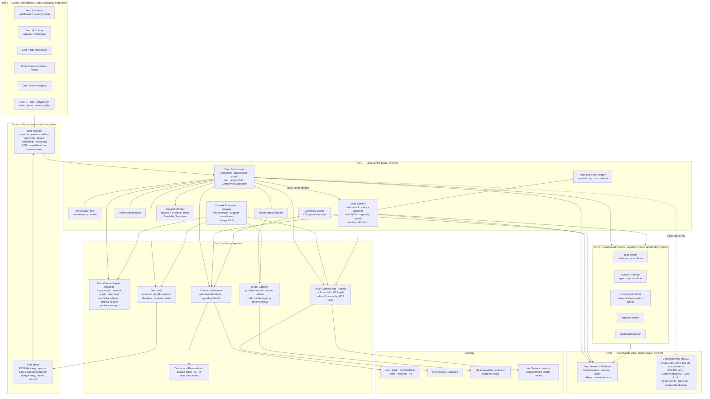
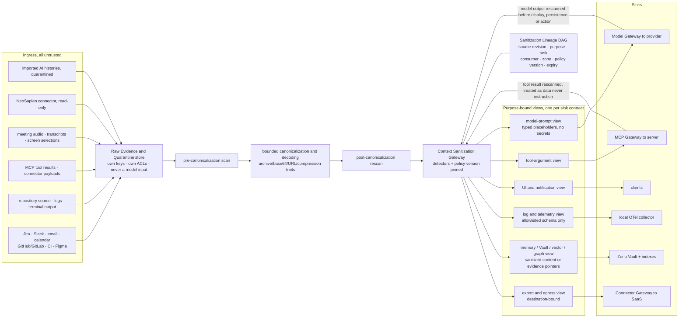
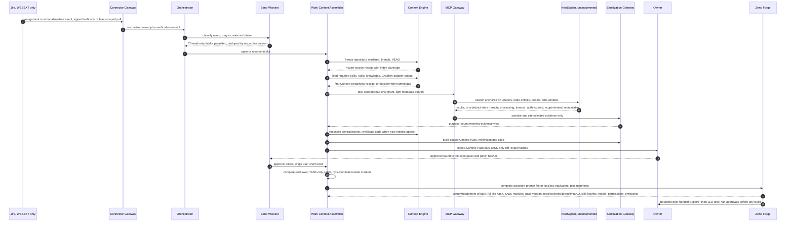
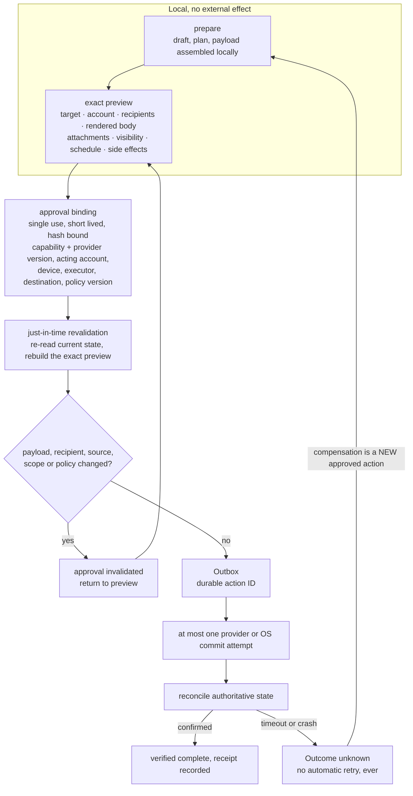
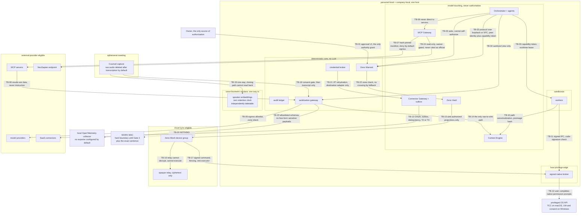
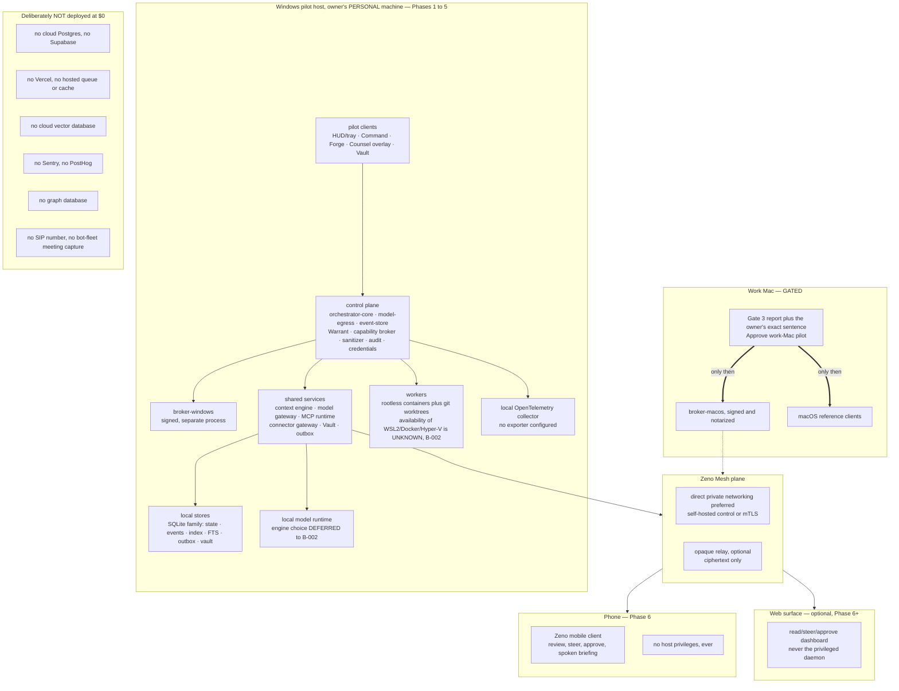

# 12 — Zeno Architecture Proposal and ADR Queue

**Phase 0B · Gate 1 candidate artifact · 2026-08-24**
Family: **ZENO** (`zeno`). Products: **Zeno** (assistant) · **Zeno Forge** (coding) · **Zeno Counsel** (meetings) · **Zeno Command** (control plane) · **Zeno Vault** (memory) · **Zeno Mesh** (paired-device / sync) · **Zeno Glass** (design system).
Wake phrase **"Zeno, attend"** · CLI/protocol `zeno` / `zeno://` · bundle root `com.abheet19.zeno` · packages always scoped `@abheet19/zeno-*`; the bare `zeno` name is never claimed on any registry.

**Sources.** Master prompt §13 (required architecture shape), §5.5/§5.5.1 (Orchestrator, Second Brain, State Authority Matrix), §6.1.2 (MCP), §6.2 (context engine), §6.3–6.5 (memory/graph/model), §8 (security/approval tiers), §9/§9.1 (zones, sanitization), §10/§10.1 (technology rules, degradation), §15.1 (196 acceptance criteria). Research lanes L1–L9, the L5 adversarial counter-review, `03-corrections-log.md` (C-001…C-041), `03b-existing-knowledge-systems-report.md`, `02-conflict-and-disposition-register.md`, `04-assumptions-contradictions-unknowns.md`.

**Evidence labels used throughout.** **[V]** a lane fetched the primary artifact and cited it (date 2026-08-24 unless stated) · **[V-badge]** licence read from a repository landing page only, never from the LICENSE file — L5 warns this is heuristic and misreports dual/multi-directory repos · **[I]** inferred · **[U]** unknown, deliberately not filled in.

**Standing constraints this document is written under.**

| # | Constraint | Consequence for this document |
|---|---|---|
| K-1 | **B-002 open** — the Windows pilot machine's edition/build, CPU/GPU/RAM/storage, displays, audio devices, WSL2/Docker/Hyper-V availability and admin status are **unknown** (U-01). | **No latency, throughput, frame-rate, GPU, thermal or real-time commitment appears anywhere below as settled.** Every such number is a *target conditional on B-002*, listed in §8. L5 risk #2 makes this a Gate-1 blocking condition. |
| K-2 | **Work-Mac boundary.** This Mac is the work Mac (A-02). | No suite binary, permission request, pairing, capture, login item, OAuth connection, Keychain import or privileged action on it before **Gate 3 and the owner's exact sentence "Approve work-Mac pilot"** (WORK-MAC-GATE-AC-01). The macOS broker and macOS clients are designed here and built later. |
| K-3 | **Budget $0** (A-05). | Every paid candidate below is a *proposal with a costed alternative*, never an assumption. Default deployment spends nothing. |
| K-4 | **Transitive licence surface** (C-027, L5 risk #1). | Every ADR naming a dependency carries a four-column record — **code / weights / datasets / required-runtime** — or says explicitly that a column is unverified. Nothing here is legal clearance. |
| K-5 | **MCP `2026-07-28` is a breaking rewrite**, not a bump (C-026). | Designed for stdio + Streamable HTTP only, stateless, `server/discover` mandatory, Sampling/Roots/Logging/DCR/HTTP+SSE rejected at design time. |
| K-6 | **Obsidian is not installed on the owner machine** (X-03). | No component assumes a vault exists. Vault projection is target-agnostic Markdown; the Obsidian binding is ADR-0017, blocked on the owner. |
| K-7 | **No official NeoSapien MCP exists publicly** (C-011, B-004) yet a live account-bound connector is present. | Treated as an undocumented vendor-hosted endpoint: usable read-only under the adapter contract, never citable as "verified official documented", never a silent dependency. |
| K-8 | **Graphify is a third-party Apache-2.0 PyPI package** (`graphifyy`), its committed graph ~48% vendored third-party noise and undirected (03b, C-025). | Verdict already taken and written up properly in ADR-0006: **adapter for the report, replace for the store.** |

**What this document is not.** It is not an LLD, not a design approval, not legal clearance, and it creates nothing. No repository, package name, domain, handle or bundle ID is registered by it (REPO-BOOTSTRAP-AC-01 stays gated on Brand + Gate 1). No dependency is installed.

---

## Contents

1. [Architecture in one page](#1-architecture-in-one-page)
2. [Component architecture](#2-component-architecture) — deliverable (a)
3. [Data-flow architecture](#3-data-flow-architecture) — deliverable (b)
4. [Trust boundaries](#4-trust-boundaries) — deliverable (c)
5. [Deployment topology](#5-deployment-topology) — deliverable (d)
6. [Monorepo package and service boundaries](#6-monorepo-package-and-service-boundaries) — SUITE-AC-03
7. [Cross-cutting architectural invariants](#7-cross-cutting-architectural-invariants)
8. [Numeric commitments deliberately withheld](#8-numeric-commitments-deliberately-withheld)
9. [ADR queue](#9-adr-queue)
10. [Conflicts the owner must resolve](#10-conflicts-the-owner-must-resolve)

---

## 1. Architecture in one page

The master prompt's §13 hypothesis survives this pass **with four amendments**, all evidence-driven:

| §13 item | Verdict | Amendment |
|---|---|---|
| 1. Signed per-host device brokers behind one shared contract | **Confirmed** | The shared contract declares capability *availability per host*; it never implies presence. Windows first; the macOS broker is a separate signed binary that inherits no grant, test result or assumption (MAC-NATIVE-AC-01). |
| 2. Local Orchestrator = the root Zeno Orchestrator of §5.5 | **Confirmed** | Split into three least-privileged OS processes — `orchestrator-core` (no network, no model), `model-egress`, `event-store` — so that "no privileged model process" (§13) is an OS fact, not a code convention. |
| 3. Shared headless Context Engine | **Confirmed** | One implementation, three *access profiles*. Its knowledge sub-adapter is where the Graphify decision lands (ADR-0006), and its graph substrate is **not** a graph database in the MVP (ADR-0005, licence grounds). |
| 4. Deterministic policy and approval service | **Confirmed** | Named **Zeno Warrant** internally. Must be *embeddable* so the same engine links into the native broker and re-enforces there (§8 "enforced again inside adapters"). That requirement is what decides Cedar vs OPA (ADR-0011). |
| 5. Sandboxed workers | **Confirmed, hardened** | L5 §3.2/§3.3 preconditions are promoted from mitigations to architecture: dedicated worktree with mechanically-enforced no-push; browser worker on a zero-employer-session profile with a domain allowlist. |
| 6. Connector gateway | **Confirmed** | Owns the outbox and idempotency, not the products. |
| 7. MCP gateway/runtime as the only model↔MCP path | **Confirmed, re-scoped** | Re-scoped to the `2026-07-28` rewrite: stateless, `server/discover`, MRTR, no sessions. Container isolation is necessary and **insufficient** — the poisoned-tool-description surface needs hash-pinned human-approved manifests (L5 §3.1). |
| 8. Shared protocol/API, "ACP-like" | **Amended** | `zeno-protocol` is *our own* versioned contract, **ACP-compatible at the external client↔agent boundary** rather than ACP-as-internal-bus. ACP is Apache-2.0 and rising but 4.1k★ with unverified authorship (L2 §ACP, ACCESS LIMITATION 9); the internal bus must not inherit an external project's cadence. |
| 9. Core E2EE Link sync/control plane | **Renamed → Zeno Mesh** | Brand gate: "Zeno Link" collided with Eclipse **zenoh**, a homophone pub/sub linking protocol in the same ecosystem. Three separate protocols inside it: command/authority, data replication, notification transport. |
| 10. Clients | **Confirmed** | Windows pilot clients ship first; the macOS reference clients only after Gate 3 + the exact sentence. |

**The two structural amendments that are not in §13 at all**, both forced by L5:

- **A four-column licence record is an architectural artifact, not paperwork.** `zeno-provenance` is a first-class package that CI reads; an `adopt`/`compose` verdict without code / weights / datasets / required-runtime rows fails the build (SUITE-AC-09, L5 risk #1).
- **3D is not the substrate.** WebGPU Baseline is *limited* with no Firefox; Apple says use its glass material "sparingly"; Microsoft's live blur is GPU-intensive and auto-disabled in Battery Saver — all **[V]**. Cinematic 3D is an opt-in, pausable enhancement on a bounded surface; the operational substrate is 2D over an OS-drawn material (ADR-0018, L5 §5.3, VIDEO-AC-08, DESIGN-PERF-AC-01).

---

## 2. Component architecture

*Satisfies groundwork for: SUITE-AC-02, SUITE-AC-03, SUITE-AC-04, SUITE-AC-06, SUITE-AC-07, CAP-AC-01, SAN-AC-01, MEMORY-AC-01, FORGE-AC-10, LINK-AC-01.*

### 2.1 Tier 0 — signed per-host device brokers

Two binaries, one contract, **zero shared authority**.

- **`broker-windows`** is the only component on the pilot host holding UI Automation, global hotkeys, WinRT/Graphics capture, audio device access and credential-store access. It runs as a separate signed process, is reachable only over a named-pipe/loopback IPC with peer identity verification and per-request capability tokens, and re-enforces policy in-process before every privileged call (§8).
- **`broker-macos`** is a *separate* signed native binary and the only component with AXUIElement, ScreenCaptureKit, Core Audio taps, Apple Events/App Intents, Keychain/Secure Enclave, LocalAuthentication, menu-bar and `NSPanel` privileges. **It does not exist as a running artifact until Gate 3 plus "Approve work-Mac pilot."** Windows grants, Windows test results and Windows conformance evidence can never be reused as Mac authority (MAC-NATIVE-AC-01, WORK-MAC-GATE-AC-01).
- `zeno-broker-contract` is a **capability-availability** contract, not a capability-presence contract. Every method returns one of `local`, `remote-delegated`, `review-only`, `takeover-required`, `unavailable` with a reason — the same five states the clients must render truthfully (XDEVICE-PRODUCT-AC-01). §5.2.1 forbids inferring one host's capabilities from another, which is why the **populated** Mac/Windows Capability Catalogues remain blocked on B-002 (register row #9 / X-01) while the *schema* ships now.

**Design note (Counsel overlay).** Presenter-private overlay behaviour — always-on-top, click-through, self-capture exclusion — is the single most platform-specific requirement in the suite and is likely to need a native window even if the shell is web-based (ADR-0002). Register row #1 stands: **no undetectability claim**, verified self-capture exclusion, visible indicators, fail-closed platform matrix (COUNSEL-AC-03). L5 §7.1 strengthens this with a technical reason, not only an ethical one: the open-source clone's own README concedes invisibility is *best-effort, not guaranteed* **[V]**.

### 2.2 Tier 1 — local control plane

- **Zeno Orchestrator** is the same logical component as the root Orchestrator in §5.5 — not a second supervisory brain. It owns the canonical task/session graph, the event ledger, the editable plan, the agent DAG, ContextView assembly and the Observable Execution Stream. It **requests** authorization and never computes it. Internally three OS processes: `orchestrator-core` (no network sockets, no model client linked), `model-egress` (the only process that may open a provider connection), `event-store` (the only process that may write the ledger). This makes §13's "no privileged model process" enforceable by process capability rather than by review.
- **Zeno Warrant** — the deterministic policy and approval service. Owns the T0–T4 tier table (§8), the single canonical approval-binding schema and its invalidation conditions (§5.4.1), short-lived audience-bound capability tokens, writer leases/epochs and fencing tokens, and the one-action global kill switch. It is **embeddable**: the same engine links into `broker-windows` (and later `broker-macos`) so the adapter-side re-enforcement is the *same* policy, not a second implementation. Duplicated permission logic is banned by the layer test in §6.
- **Capability Broker** — one registry row per connector, MCP server, model, device and privileged local adapter, carrying the complete §10.1 tuple and exactly one of the 14 canonical health states. **`healthy` is never authorization** (CAP-AC-01). It seals a *Capability Snapshot* into every plan, context pack and approval; account, scope, schema, endpoint, egress, device, watermark or health change invalidates only the dependent receipts.
- **Context Sanitization Gateway** — the only path from Raw Evidence/Quarantine to any sink. Every consumer is a *registered sink contract*: model prompt, tool argument, UI, notification, log/telemetry, memory/Vault/vector/graph, cache/backup, dev preview, export. There is no direct raw-to-consumer path anywhere in the dependency graph, and that is asserted by an architecture test, not a policy document (SAN-AC-01).
- **Audit and Event Ledger** — append-only, hash-chained, in its own store, **separate from optional product telemetry** (§10.1).
- **Credential Broker** — OS-keystore backed. Models receive typed placeholders; only the authorized destination adapter rehydrates a secret just in time (SAN-AC-03). Tokens never enter prompts, model traces, command plans, UI, logs, exported configs or audit receipts.

### 2.3 Tier 2 — shared services

- **Zeno Context Engine** (headless, shared) is the *sole* versioned implementation of repository index, retrieval, rules/skills resolution, knowledge integration and context packing, consumed by the Work Context Assembler, Forge and direct Ask/Explore. Access profiles differ; hashes, precedence and frozen-source truth cannot fork (§13 item 3). Retrieval order is §6.2's ladder, exact-first: ripgrep → Zoekt at scale → LSP/SCIP/tree-sitter/git symbol graph → knowledge adapter → graph-ranked repo map → **vectors as a complement, never primary truth** → provenance-rich memory → rerank/dedupe/freshness/budget. The index isolates repository, branch, worktree, revision and data zone; no index answers across scopes without an explicit cited cross-scope grant.
- **Model Gateway** — provider-neutral, capability-negotiating, harness-profile-aware. Prefix caches are keyed by user, model, harness, policy version, data zone, repository/revision/worktree and instruction/skill hashes and purged on any of those changing. Provider selection is visible; secret context cannot cross a provider boundary. **Only authorized owned credentials through the broker; no key/account/identity cycling, ever** (PROVIDER-ETHICS-AC-01) — quota exhaustion is a visible degraded state.
- **MCP Gateway and Runtime** — the only path between any model or agent and any MCP server. Owns server lifecycle, transport, `server/discover` negotiation, a schema registry with a **content hash per server**, credential brokering, roots/scopes, per-task and per-agent grants, deterministic policy before *and* after every call, quotas, cancellation, sanitization of returned content as untrusted data, and exact audit receipts. May expose a narrow read-only Forge MCP server; never raw brokers, never ambient machine access.
- **Connector Gateway** — least-scoped OAuth 2.1/OIDC/PKCE where applicable plus signed webhooks; one adapter per provider; owns provider idempotency keys and hands every external commit to the Outbox.
- **Zeno Vault** — governed durable memory. Lifecycle `quarantined/observed → proposed → reviewed/accepted → active → superseded/expired/revoked → tombstoned`; Assistant, Forge, Counsel and Sarah may *propose*, only Vault policy commits. Emits the Markdown projection (ADR-0017).
- **Outbox and Reconciliation** — durable action ID per T2/T3 commit, at most one provider attempt under a given approval, `Outcome unknown` blocks automatic retry, compensation is a new approved action (OUTBOX-AC-01).

### 2.4 Tier 3 — sandboxed workers

Non-root, read-only base where possible, writable scoped worktree only, default-deny egress, PID/CPU/RAM/GPU/disk/time limits, **no host Docker socket, keystore, SSH agent, cloud metadata, browser cookies or ambient credentials** (§8). Paths canonicalized and re-checked at use time; patch preimage hashes verified before apply.

Three worker-specific controls are promoted from L5 mitigations to architecture:

| Worker | Control | Evidence |
|---|---|---|
| code worker (LSP-backed symbol editing, e.g. a Serena-class capability) | Runs only in a dedicated git worktree, never a primary checkout; the owner's standing "never commit or push" rule is enforced **mechanically** — credential-less worktree or a pre-commit/pre-push hook — not by prompt instruction. | L5 §3.2; the owner's own shared-checkout memory records several agent sessions driving `~/Work/browser-add-on` concurrently. |
| browser/QA worker | Dedicated browser profile with **zero employer sessions**, plus a domain allowlist that never includes `quillbot.atlassian.net`, GitLab or any authenticated employer surface. | L5 §3.3. |
| shell/PTY worker | Immutable typed envelope, structured argv by default, sanitized reviewed startup environment; unclassifiable shell/startup behaviour blocks or moves to a disposable approved sandbox; terminal output and control sequences are untrusted input. | Master prompt TERMINAL-AC-02. |

The Forge "bypass permissions" sandbox profile is **not a UI state** — it is a separate OS user or VM with no access to the credential store holding Jira/GitLab tokens, auto-expiring, and it can never apply to messaging, publishing, payment, production, credentials, data export, destructive actions or organizational controls (register row #4, §8, L5 §3.7).

### 2.5 Tier 4 — shared protocol and Zeno Mesh

`zeno-protocol` carries versioned sessions, events, artifacts, approvals, device commands and streaming. **Zeno Mesh** keeps three concerns on three protocols, as §13 item 9 requires:

1. **Command/authority** — signed device commands, capability negotiation, exactly-one-executor leases with fencing tokens, immediate local-takeover priority.
2. **Data replication** — content-addressed E2EE deltas of *sink-authorized* Vault projections only, with per-note causal parents/version vectors, integrity hashes, resumable attachments, key rotation, device revocation and deletion tombstones. Never last-write-wins.
3. **Notification transport** — generic payloads only; locked-screen, wearable and shared-display notifications carry the approved generic view (SAN-AC-06, REVIEW-COMPANION-AC-02).

The relay is opaque: it cannot decrypt content and cannot obtain privileged execution. **Local-only and company-restricted data never become sync-eligible merely because Mesh exists** — eligibility is a property of the record's zone and ACL, computed by Warrant before the record is ever handed to Mesh.

### 2.6 Tier 5 — clients

Windows pilot clients first (Assistant HUD/tray, Command, Forge, Counsel overlay, Vault), then the macOS reference clients post-Gate-3, then Linux/web/iPhone/iPad/Android per the approved release matrix. Narrow surfaces (IDE, browser extension, CLI/TUI, wearable, voice satellite) are allowed to expose less, but their limits are explicit and they deep-link or hand off without losing canonical state. **No sandboxed or mobile client ever implies host privileges it lacks** (XDEVICE-PRODUCT-AC-01, FORGE-AC-10). Command mounts the same reusable modules and sessions as the standalone products and forks no state (SUITE-AC-03).

**Brand-gate consequences that land on clients.** `{{FAMILY}}, attend` resolves to **"Zeno, attend"** (ASSIST-AC-01) and a wake model for that exact phrase has to be produced — see ADR-0012. Two ACs contain now-closed conditional branches: NATURAL-COMMAND-AC-01's *"the literal Athena token remains conditional on Brand Gate selection"* and CEREMONY-AC-01's *"Athena-specific classical cues appear only if ATHENA passes Brand Gate"* — **ZENO was selected, so both Athena branches are closed**; the ceremony studies stay name-neutral. Zeno of Citium is a Stoic, so no mythological imagery is licensed by the name either.

---

## 3. Data-flow architecture

*Satisfies groundwork for: SAN-AC-01, SAN-AC-02, SAN-AC-03, SAN-AC-04, SAN-AC-05, SAN-AC-07, SAN-AC-08, SAN-AC-09, WORK-AC-02, COMM-DRAFT-AC-01, APPROVAL-BINDING-AC-01, OUTBOX-AC-01, MEMORY-AC-01.*

### 3.1 Flow A — ingress to sinks: the sanitization spine

Every arrow into a sink passes the gateway. There is no bypass edge in the dependency graph, and `zeno-arch-test` fails the build if one appears.

Three properties are load-bearing:

- **Raw and sanitized live in different stores with different keys and ACLs.** Every view binds exact source revision, purpose, task, consumer/provider/region, sink, zone/consent, policy and detector version, and expiry. **Sanitization never broadens authorization** (SAN-AC-02).
- **The return path is scanned too.** Model output and tool results are rescanned before display, persistence or action (SAN-AC-05). Untrusted source instructions are structurally isolated data and cannot change policy, sanitizer configuration, provider, tools, approvals, recipients or action tiers (SAN-AC-04) — the MCP spec itself declares tool descriptions and results attacker-controlled, and containers do not bound that surface (L5 §3.1).
- **Revocation traverses the lineage DAG.** A source correction, revocation or deletion removes or invalidates raw items, views, prompts, caches, memories, Vault notes, vectors, graph data, candidates, offline replicas and backups, retaining only a non-content tombstone (SAN-AC-09, MEMORY-AC-04).

**Gateway failure is fail-closed and narrow:** a stale policy/detector state or unclassified high-risk content blocks new model egress, persistence and external action while leaving unrelated no-context local controls working, and the UI names the exact degraded state (SAN-AC-11).

### 3.2 Flow B — the canonical work-intake journey

The MVP journey (A-01): Jira → Intake → Context → TASK → Forge handoff, draft-only through Phase 3. This is WORK-AC-02's single ordered state machine; every arrow is a receipt, and a failed, stale or ambiguous upstream receipt blocks downstream mutation and returns to the earliest affected state.

Four rules this flow encodes that are easy to lose:

1. **Only a verified Jira assignment/actionable-state event auto-creates an Intake.** Meeting speech, Slack, email and NeoSapien memories may *propose or enrich* but cannot assert assignment, scope or acceptance criteria, start code, or mutate TASK (WORK-AC-01, TASK-CANDIDATE-AC-01).
2. **Imperative language authorizes nothing.** "Build it", a notification open, classifier confidence, a standing preference or a prior approval authorize only read-only preparation (WORK-AC-05).
3. **The whole file is handed off, hash-verified — not TASK, not a summary** (FORGE-HANDOFF-AC-01). Sender/receiver hash equality is the test; truncated, stale or wrong-project input fails closed.
4. **NeoSapien unavailability is never rendered as "no memories."** Empty, processing, partial, timeout, auth-expired, scope-denied and revoked are seven distinct states; if required Neo context is unavailable, TASK mutation stops until an official export is supplied or the owner approves a **named per-task waiver** (NEO-MCP-AC-03). Because no official NeoSapien MCP exists (C-011), the degradation ladder needs a rung the master prompt does not have — see ADR-0020 and §10.

### 3.3 Flow C — prepare / preview / approve / commit, and the cross-device command path

The same contract governs a cross-device command: the controller previews the **exact authorized device set**, acting accounts, lock/presence/privacy and capabilities before execution; per-target idempotency; independent per-target reporting; and an ambiguous "all devices" can never produce a hidden wildcard or one misleading success state (LINK-AC-04). Mesh delivers a signed command to exactly one executor holding a valid, unexpired, fenced lease; local takeover always wins (LINK-AC-01). **T2/T3 never queues for later execution while offline** (§10.1); after reconnect, re-read, rebuild the preview, take a fresh approval.

---

## 4. Trust boundaries

*Satisfies groundwork for: SUITE-AC-08, SAN-AC-01, SAN-AC-03, TERMINAL-AC-02, TERMINAL-AC-04, WORK-MAC-GATE-AC-01, MAC-NATIVE-AC-01, LINK-AC-01, VAULT-AC-01, VOICE-AC-01, VOICE-AC-12, CAP-AC-01.*

Zones are the §9 six: **personal-local**, **company-local/authorized**, **cloud-sync-eligible**, **external-provider-eligible**, **financial/credential-prohibited**, **ephemeral-meeting**. No data crosses a zone through a helpful fallback.

### 4.1 Every crossing, explicitly

| ID | Crossing | Direction | Authentication | Authorization | Sanitization | Audit | Fail-closed behaviour | AC |
|---|---|---|---|---|---|---|---|---|
| TB-01 | Owner → approval UI | in | OS session; T3 adds fresh device biometric | This is the **only** place authority is created. Notification open, voice identity, prior approval, standing autonomy and agent consensus cannot approve | n/a | approval event bound to payload hash | no approval → no external effect | APPROVAL-BINDING-AC-01, §8 |
| TB-02 | Client → Orchestrator | both | Authenticated XPC / Unix socket / private loopback with peer identity; code-signature check where the platform supports it | per-request capability token, schema validation, rate/payload/time limits, replay protection | request bodies validated, not trusted | every call | privileged executor never bound to a public interface | §8 |
| TB-03 | Orchestrator → Warrant | out | in-process or local IPC | Orchestrator **asks**; Warrant decides. The model may propose, never authorize | n/a | decision + reason | deny on evaluator error | §8 |
| TB-04 | Orchestrator → Model Gateway | out | local | policy + zone + budget check | destination-bound prompt view; typed placeholders for secrets | prompt manifest hash, not content | block egress on gateway failure | SAN-AC-03, SAN-AC-11 |
| TB-05 | Model Gateway → provider | out | provider credential from broker, owned account only | external-provider-eligible zone only; explicit egress allowlist; visible provider selection | rebuilt from a destination-bound view and rescanned | provider, model, token counts, cost | quota exhausted = visible degraded state, **never** key/account cycling | PROVIDER-ETHICS-AC-01, SAN-AC-08 |
| TB-06 | Agent → MCP Gateway | out | local | per-task **and** per-agent grant; subagents inherit nothing | args validated pre-call | receipt | deny unknown tool | SUITE-AC-07, §6.1.2 |
| TB-07 | MCP Gateway → MCP server | out | stdio child process, or Streamable HTTP with origin/redirect validation, SSRF/DNS-rebinding defence, certificate validation | human-approved tool manifest with a **content hash per server**; re-approval on hash change; deny-by-default egress; no host filesystem mount outside an allowlist | n/a on request | full receipt: server identity, version, checksum, tool, args digest | any tool/schema/scope/transport/destination change disables the server pending review | §8, L5 §3.1 |
| TB-08 | MCP/tool result → context | in | n/a | **result text is data, never instruction**; structural isolation; rescan before display, persistence or action | yes, mandatory | result digest | unclassifiable high-risk content blocks | SAN-AC-04, SAN-AC-05 |
| TB-09 | Orchestrator → worker | out | local IPC | capability token, worktree lease, resource ceilings, default-deny egress | worker inputs are sanitized views | worker start/stop, grants | lease expiry stops the worker | FORGE-AC-09, §8 |
| TB-10 | Worker → filesystem / repository | both | OS user separation | scoped roots only; canonicalize and re-check every path **at use time**; reject symlink/hardlink/mount/case-fold/Unicode/archive/traversal escapes; verify patch preimage hash | filenames and file content are untrusted | receipt per run | abort and rebase on unexpected concurrent change | GIT-SAFETY-AC-01, REPRO-AC-01 |
| TB-11 | Anything → host broker | out | signed IPC; verify the caller's code signature / designated requirement where supported | per-call capability token; **Warrant re-evaluated inside the broker** | arguments typed and validated | privileged-call receipt | unknown caller denied | §8 |
| TB-12 | Broker → privileged OS API | out | OS grant (TCC on macOS, UIA/consent on Windows) | the **user** always completes native password, biometric, TCC and admin prompts; the suite never types them | n/a | before/after state verified | missing grant = `unavailable` with a reason, never a silent workaround | MAC-SYSTEM-AC-01, TERMINAL-AC-04 |
| TB-13 | Connector Gateway → SaaS | out | least-scoped OAuth 2.1/OIDC/PKCE with state and nonce where applicable; signed webhooks inbound | T2 or T3 with a fresh exact preview; scope-expansion denied | payload rebuilt from a destination-bound view, rescanned, approved against the final hash | provider receipt reconciled to the outbox | outcome unknown → no retry | SUITE-AC-08, COMM-DRAFT-AC-01 |
| TB-14 | Raw/Quarantine → any sink | out | n/a | **only** through the gateway; separate stores, keys and ACLs; sanitization never broadens authorization | the whole point | lineage DAG node per view | no view, no read | SAN-AC-01, SAN-AC-02 |
| TB-15 | Vault → Mesh | out | device-group key | zone + ACL + retention + owner-exclusion check computed by Warrant **before** handing the record to Mesh | only sink-authorized projections leave | sync receipt | ineligible record simply has no sync path | VAULT-AC-01, SAN-AC-07 |
| TB-16 | Mesh ↔ relay | both | device keys | relay sees ciphertext and routing metadata only; cannot decrypt, cannot execute | n/a | relay-side metadata only | relay compromise yields no plaintext and no execution | §13 item 9 |
| TB-17 | Device → device command | out | signed command, device identity | exactly-one-executor lease with a fencing token; immediate local-takeover priority; locked/secure-field/biometric operations cannot be remotely bypassed | command payload typed | per-device signed receipt | stale lease or replay rejected | LINK-AC-01, MEMORY-AC-03 |
| TB-18 | Meeting audio → transcript/store | in | n/a | mandatory consent preflight per meeting-policy profile with a **fail-closed** platform matrix; scope change or withdrawal takes effect immediately | raw audio deleted after transcription **by default** | consent ledger | unsupported or unverified platform behaviour → fail closed, no capture | COUNSEL-AC-04, COUNSEL-AC-05 |
| TB-19 | Transcript/enrolment → biometric store | in, **one-way** | OS-authenticated enrolment ceremony | embeddings never leave the device; **own retention clock**, independently deletable; the voice-cloning path is **structurally unable** to read this store | separate store, separate keys | deletion receipts | no consent record → persistent recognition is impossible | VOICE-AC-01, VOICE-AC-03, VOICE-AC-12, L5 §3.5/§3.6 |
| TB-20 | Any component → **work Mac** | **none permitted** | n/a | Hard boundary. No binary, launch, pairing, executor grant, permission request, capture, login item, OAuth connection, Keychain import, repository/Vault ingestion or privileged OS/browser/terminal action before **Gate 3 and the exact sentence "Approve work-Mac pilot"** | n/a | negative inventory / audit receipt is the evidence | the boundary is the default | WORK-MAC-GATE-AC-01, MAC-NATIVE-AC-01 |
| TB-21 | Credential broker → destination adapter | out | adapter identity | JIT rehydration only, for the authorized destination; models get typed placeholders | secrets never in prompts, traces, plans, UI, logs, notifications or exports | secret *descriptor* only, never a replayable ID | canary-credential tests must find zero escapes | SAN-AC-03, REPRO-AC-01 |
| TB-22 | personal zone ↔ company zone | **none by fallback** | n/a | a cross-zone read requires an explicit cited cross-scope grant; no index, cache, embedding, graph edge or memory answers across zones implicitly | zone carried on every record | cross-zone denial logged | deny | §9, SAN-AC-02 |
| TB-23 | Suite → observability egress | out | n/a | OpenTelemetry **local collector only** by default; Sentry/PostHog off; session replay and autocapture off; allowlisted log schemas | no free-form sensitive payloads; inspect-before-share support bundle | telemetry config audit | absent telemetry never blocks core local operation | SAN-AC-06, §10.1 |
| TB-24 | Suite → NeoSapien endpoint | out | account-bound vendor connector | **read-only**, task-scoped grant, search/fetch only; capture/update/delete/share/bulk-export tools unreachable from routine assembly; a named per-task waiver is required when it is a required source | results sanitized and cited; injection-denial tested | full sanitized MCP trace, account and scope receipt | **never citable as a verified official documented interface**; zero writes | NEO-MCP-AC-01, NEO-MCP-AC-02, X-04 |

**Threat model coverage.** The §8 list is carried unchanged and each entry has an owning boundary above: prompt injection and indirect injection (TB-08, TB-14), malicious MCP/skill/plugin/model (TB-07), excessive OAuth scope and token theft (TB-13, TB-21), secret leakage into prompts/logs/telemetry/embeddings/graphs/vaults/screenshots/audio/crash reports (TB-04, TB-21, TB-23), cross-project and personal/work memory contamination (TB-22), browser/profile takeover and session riding (TB-09 browser worker control), supply-chain and model-weight compromise (§6 provenance package, ADR-0004), approval spoofing/replay/stale state/confused deputy/duplicate transaction (TB-01, Flow C), agent collusion and self-approval (TB-03, FORGE-AC-09), remote device compromise and command replay (TB-17), meeting-consent and recording failures (TB-18), memory poisoning and staleness (Vault lifecycle, MEMORY-AC-02), local privilege escalation through Accessibility/Apple Events/shell/filesystem/update (TB-11, TB-12).

---

## 5. Deployment topology

*Satisfies groundwork for: WIN-FIRST-AC-01, WIN-FIRST-AC-02, XDEVICE-PRODUCT-AC-01, FORGE-AC-10, DESIGN-XPLAT-AC-01, SUITE-AC-12, MAC-COVERAGE-AC-01.*

### 5.1 Topology rules

1. **Privileged execution stays local.** No hosted platform ever runs the privileged voice, local-model or accessibility executor. A hosted web surface, if it ships, is UI plus a narrow webhook surface only, and any tunnel to it requires device authentication and policy (§10.1).
2. **One executor at a time, everywhere.** Phone, web, CLI and IDE are controllers; the pilot host is the executor. Handoff requires capability negotiation, a fresh lease and a fencing token; local takeover pre-empts (LINK-AC-01).
3. **A standalone local workflow never requires a cloud login to launch** (§10.1). Device pairing is out-of-band, not account-mediated.
4. **Every client is independently launchable and recoverable.** Stopping Command does not terminate or corrupt Forge or Counsel; reconnecting does not duplicate an action (SUITE-AC-02).
5. **Degradation is a first-class deployment state.** Offline, connector/model/device failure, low disk, thermal pressure, crash and network partition are visible and recoverable, and partial work is never presented as complete (SUITE-AC-12). The §10.1 fallback ladder and per-source degradation matrix are implemented in the Capability Broker, not in each product.
6. **Separate accounts, keys, data, webhook endpoints, devices and policies for dev / test / staging / preview / production**, with synthetic data in preview (§10.1). At Phase 1 this means: a fixture repository, synthetic Jira payloads, and no real connector wired until Phase 3.

### 5.2 What B-002 blocks in this topology

| Unknown (U-01) | Blocks |
|---|---|
| CPU / GPU / RAM | Local model engine choice (ADR-0004); whether real-time diarization is possible at all (ADR-0012); the 3D quality-mode ladder (ADR-0018) |
| Windows edition and **build** | Whether OS-drawn Mica/Acrylic is available — Electron's `backgroundMaterial` is documented as **Windows 11 22H2 and up** **[V]** — hence whether the Glass base tier has an OS material or a solid fallback (ADR-0002, ADR-0018) |
| WSL2 / Docker / Hyper-V / admin status | Whether rootless containers are available for worker isolation, or whether worker isolation degrades to process + worktree only (§2.4) |
| Audio devices, microphone | Wake-word and dictation feasibility and the Voice Lab baseline (ADR-0012) |
| Displays and refresh | Every frame-time and jank budget (VIDEO-AC-10, DESIGN-PERF-AC-01) |
| Storage | Index size ceilings, snapshot/rebuild strategy (ADR-0005) |

A secondary, cheaper unknown L5 raised: **is the owner's Mac Apple Silicon or Intel?** ONNX Runtime stopped shipping macOS x86_64 binaries in 1.24, so on an Intel Mac local speaker identification does not run at all **[V]**. *Weak evidence in hand:* `00-DECISIONS.md` records ffmpeg installed at `/opt/homebrew/bin/ffmpeg`, and `/opt/homebrew` is the Apple-Silicon Homebrew prefix while Intel installs to `/usr/local` — so **Apple Silicon is [I] inferred, not verified**. The owner can close it with one command (`uname -m`). Recording it here so U-01 carries the question rather than an assumption.

---

## 6. Monorepo package and service boundaries

**Primary AC: SUITE-AC-03** — *"Shared protocol, orchestrator, policy, approvals, context/Vault, activity stream, model gateway, MCP, connectors/OAuth, device Link and Glass tokens are versioned reusable packages/services, not copied app logic or ambient database access. Evidence: package/dependency map, no-cycle check, contract tests, mock adapters and independent build/release evidence."*
Also serves: LLD-GATE-AC-01, SUITE-AC-09, SAN-AC-01, FORGE-AC-10.

Repository (**not created by this document**): `abheet19/zeno`, private. Package scope `@abheet19/zeno-*` for TypeScript; Rust crates are path-only and **never published** (the bare `zeno` name is never claimed anywhere — brand condition 2); Swift package `ZenoBrokerMac` builds only post-Gate-3.

### 6.1 Layer map

Strict acyclic layering. **A package may depend only on lower-numbered layers, plus L1 contract packages.** No same-layer implementation-to-implementation edges, no app-to-app edges.

| Layer | Packages | Rule |
|---|---|---|
| **L0 foundation** | `zeno-types` (branded IDs, zones, tiers, the 14 health states) · `zeno-errors` · `zeno-crypto` (content addressing, hash chains, signature verification) · `zeno-schema` (registry + codegen runtime) · `zeno-provenance` (the four-column licence record, read by CI) | No dependency outside the standard library |
| **L1 contracts** — interface only, no implementation | `zeno-protocol` · `zeno-broker-contract` · `zeno-policy-contract` · `zeno-capability-contract` · `zeno-context-contract` · `zeno-model-contract` · `zeno-mcp-contract` · `zeno-connector-contract` · `zeno-vault-contract` · `zeno-mesh-contract` · `zeno-sanitizer-contract` | Each ships **types + JSON Schema + a conformance suite + a mock/fake adapter** under `<pkg>/mock`. Semver plus a stored schema hash |
| **L2 deterministic core** — no LLM, no network by default | `zeno-policy` (Warrant engine) · `zeno-approval` · `zeno-audit` · `zeno-capability-broker` · `zeno-sanitizer` · `zeno-credential-broker` · `zeno-eventstore` | **Only `zeno-policy` may compute an authorization decision.** Only `zeno-eventstore` and `zeno-vault` may open their own stores |
| **L3 shared services** | `zeno-context-engine` (+ `-exact`, `-symbols`, `-repomap`, `-knowledge`, `-vector`, `-packer`) · `zeno-model-gateway` (+ `zeno-harness-profiles`) · `zeno-mcp-runtime` (+ `-registry`, `-inspector-core`) · `zeno-connector-gateway` (+ `-jira`, `-slack`, `-git`, `-figma`, `-calendar`, `-ci`) · `zeno-vault` (+ `-projection-markdown`) · `zeno-outbox` · `zeno-mesh` | Every service is reachable only through its L1 contract. A product core may never import another service's internals |
| **L4 orchestration and workers** | `zeno-orchestrator` · `zeno-agents` (Sarah, Work agent, ephemeral workers) · `zeno-workassembler` · `zeno-worker-code` · `zeno-worker-shell` · `zeno-worker-browser` · `zeno-worker-ingest` | Workers are separately executable binaries, not libraries linked into the orchestrator |
| **L5 product cores** — headless, UI-free | `zeno-assistant-core` · `zeno-forge-core` · `zeno-counsel-core` · `zeno-command-core` | Business logic lives here exactly once. Command reuses these; it does not fork their state |
| **L6 UI and clients** | `zeno-glass` (tokens) · `zeno-glass-react` · `zeno-glass-swiftui` (post-Gate-3) · `zeno-ui-shared` (Approval Capsule, Execution Stream, Vault views, Capability Inspector) · apps `app-command`, `app-forge`, `app-counsel`, `app-assistant-hud`, `app-vault`, `app-web`, `app-mobile`, `cli-zeno` | An app may import only L5 cores, `zeno-ui-shared`, `zeno-glass*` and L1 contracts. **No app may import a worker, a broker or an L2/L3 implementation** |
| **Out-of-tree build, in-tree source** | `broker-windows` · `broker-macos` | Signed and released on their own train; consume `zeno-broker-contract` and the embedded Warrant engine only |

### 6.2 The seven enforced rules

`zeno-arch-test` runs in CI and fails the build on any violation. Each rule has a named test, so this section is falsifiable rather than aspirational.

1. **No cycles.** The package graph is topologically sorted; any edge from layer *N* to layer ≥ *N* (except into an L1 contract) fails. Any `app-* → app-*` edge fails. This is SUITE-AC-03's "no-cycle check".
2. **No cross-app database access.** Only `zeno-eventstore` and `zeno-vault` may import a storage driver; a lint rule bans driver imports everywhere else. This is also the architecture-dependency half of SAN-AC-01.
3. **No duplicated permission logic.** Only `zeno-policy` may contain tier constants or a decision function. A test greps every other package for `T0|T1|T2|T3|T4` tier literals and authorization verbs and fails on a hit. Adapters re-*enforce* by calling the engine.
4. **No raw-to-sink bypass.** Every sink module must declare a registered sink contract; a test asserts no module imports the Raw/Quarantine store except `zeno-sanitizer` (SAN-AC-01).
5. **Versioned contracts, tested both ways.** Every L1 package carries semver + a schema hash. CI runs the **previous two minor versions** of each consumer against the new provider (backward) and the new consumer against the previous provider (forward). A schema hash change without a version bump fails.
6. **Mock adapters are mandatory and load-bearing.** Every L3+ package must build and pass its unit suite against **fakes only**, under a test profile with no network and no filesystem access outside a temp directory. This is what makes independent release trains real rather than nominal, and it is the "mock adapters" evidence SUITE-AC-03 asks for.
7. **Provenance gate.** `zeno-provenance` must hold a four-column record — **code / weights / datasets / required-runtime** — for every shipped dependency, model, dataset, font, icon, sound, shader, 3D asset and MCP server, each with a fetched primary URL. A missing or `unverified` required-runtime column on an `adopt`/`compose` dependency **fails the build** (SUITE-AC-09; L5 risk #1 made this an architectural control rather than a checklist).

### 6.3 Independent release trains

| Train | Contents | Cadence | Can ship alone when… |
|---|---|---|---|
| `core` | L0–L2 | slowest, most conservative | contract compatibility tests pass in both directions |
| `services` | L3 | medium | its L1 contract version range is satisfied |
| `runtime` | L4–L5 | fast | service contracts unchanged, or a feature flag covers the delta |
| `clients` | L6 apps + Glass | fastest | protocol version negotiated at runtime |
| `brokers` | `broker-windows`, `broker-macos` | slowest; signed and notarized separately | broker contract unchanged; **each host validated independently, no inherited pass** |

Cross-cutting: feature flags on every new capability, expand-contract migrations only, rolling protocol compatibility, signed artifacts with provenance and anti-downgrade protection, canary/staged rollout, per-train SBOM. Phase 8 mandates signing, notarization, staged rollout, runbooks and disaster recovery — and the traceability matrix found **Phase 8 has zero acceptance criteria** (§7.1 of `requirements-traceability-matrix.md`). That gap sits on this train and is raised in §10.

---

## 7. Cross-cutting architectural invariants

These are not ADRs; they are properties the architecture must hold regardless of how the ADRs resolve.

**I-1 — The State Authority Matrix is the only conflict-resolution law.** Deterministic policy/approval/audit owns authority; the Orchestrator event log and checkpoints own task/run truth; external systems own their current facts; current source plus checked-in rules own repository truth; Vault owns reviewed durable derived memory; the Markdown projection is rebuildable and never authoritative; product chats stay product-local evidence. **Generic last-write-wins is banned across these classes.** Per-aggregate versions, causal parents, idempotency keys, writer leases/epochs and fencing tokens instead (MEMORY-AC-03). Detailed as ADR-0009.

**I-2 — The agent experience is stateful even though the model is stateless and replaceable.** No model context window, provider history or fine-tuned weight is ever authoritative task state. On every turn and after restart, compaction, model switch or device handoff, a purpose-bound **ContextView** is reconstructed from governed state (MEMORY-AC-01).

**I-3 — `healthy` is not authorization, and a missing service is never a successful empty result.** Every workflow declares each dependency required / optional / substitutable with freshness minima and an approved fallback ladder; every result is truthfully `complete-current`, `complete-with-approved-fallback`, `partial`, `blocked` or `unknown` with per-source age, coverage and omissions (CAP-AC-01, CAP-AC-02).

**I-4 — Plan repair may only move sideways or down.** Automatic repair chooses only an equal-or-lower-risk authorized path in the same identity, scope and data zone. It never silently changes provider or account, broadens OAuth, starts paid or cloud processing, weakens approval, or queues a T2/T3 effect for later (CAP-AC-03).

**I-5 — Model trust, tool trust, data trust and user authorization are four separate things.** A better model never grants broader permissions (§13).

**I-6 — Visible thinking is never hidden reasoning.** The Observable Execution Stream shows goal, phase, editable plan, agent/model, target, redacted tool/action, evidence, budget, checkpoint, blocker and next approval. It never exposes or persists chain-of-thought, private scratchpads, raw prompts or reasoning tokens (SUITE-AC-05, register row #5).

**I-7 — Interruption is a first-class path, not an error path.** Ask, steer, edit the plan, pause, resume, cancel, stop-at-next-safe-boundary and take over are available from every supported surface, and a global kill switch revokes outstanding capabilities (SUITE-AC-06).

**I-8 — Rejected patterns stay rejected, by construction.** Undetectable meeting presence (register #1), silent biometric enrolment (register #2), autonomous payment (register #3), clicking pipelines until green (register #4), hidden chain-of-thought (register #5), key/quota recycling (register #8), unfalsifiable performance claims (register #7), graph-as-primary-surface (L5 §7.3), glow-as-focus-indicator (L5 §7.6 — WCAG 2.4.13 Note 1 excludes shadow and glow **[V]**), MCP Sampling (L5 §7.8), HTTP+SSE (L5 §7.9), and standing one-way sync of the owner's agent configuration into a third-party vendor (L5 §7.10) are each denied by a structural control named above, not by a policy sentence.

---

## 8. Numeric commitments deliberately withheld

L5 risk #2 is explicit: *"Gate 1 must not accept any latency budget or real-time diarization commitment until B-002 is answered."* Every number below is therefore a **target conditional on B-002**, recorded so the owner can see exactly what is owed and to whom.

| AC | What it demands | Status here |
|---|---|---|
| REALTIME-SLO-AC-01 | Interaction Latency Budget with p50/p95/p99 for pointer/key ack, wake/PTT, partial/final ASR, correction, barge/stop, first useful local text/audio, Counsel suggestion, app focus, stream propagation, HUD cold shell, post-unlock, local search | **Blocked on B-002.** The *instrumentation contract* (monotonic end-to-end traces, cold/warm/offline/degraded/low-power slices, error budgets) is designed; the numbers are not set |
| LINK-AC-03 | LAN/WAN p50/p95/p99 for route open, action-stream propagation, streaming update, handoff, remote ack, stop/cancel | **Blocked on B-002** plus network characterization |
| VOICE-AC-08 | FAR ≤ 0.1% / FRR ≤ 5% on a **frozen consented target-hardware set** | **Blocked on B-002.** The hardware set cannot be frozen yet |
| VOICE-AC-09 | DER/JER, speaker-count/overlap error, stabilization latency, CPU/GPU/RAM, battery, thermals | **Blocked on B-002.** Also gated on whether real-time diarization is feasible at all on the pilot machine |
| VIDEO-AC-10, DESIGN-PERF-AC-01 | p95/p99 render-frame time, jank %, long tasks, input latency, power and thermal limits with compositor headroom under 16.67 ms or 8.33 ms | **Blocked on B-002.** The architecture commits only to the *shape*: settled surfaces stop rendering, hidden surfaces suspend, everything works in 2D |
| CAP-AC-04 | Three concurrent-failure chaos journeys | Designed (Jira+NeoSapien, Git provider+CI, Vault/device partition) — runnable once a host exists |

Register row #7 governs the language: **"zero latency" is never claimed**; the commitment is *no unexplained waiting* plus measured budgets.

---

## 9. ADR queue

**Format.** Each ADR carries: the decision, the options, the evidence already gathered with its lane/correction citation, the licence record (four columns, or an explicit `unverified`), the recommendation with confidence, what would change the decision, and a status of `proposed` / `needs-spike` / `blocked-on-B-002` / `blocked-on-owner`.

**Licence-record convention.** Columns are **Code**, **Weights**, **Datasets**, **Required runtime** (the thing the dependency needs in order to run, *and that thing's licence*). `n/a` means the column does not apply (no model weights, for example). `unverified` means nobody in this corpus fetched it — it is never a synonym for "permissive". **[V-badge]** means a landing-page read, which L5 explicitly warns is heuristic; re-read the LICENSE file at pin time. Nothing here is legal clearance (L5 preamble).

**Queue at a glance**

| ADR | Decision | Status | Confidence |
|---|---|---|---|
| ADR-0001 | Build vs fork vs compose | proposed | medium-high |
| ADR-0002 | Desktop shell: native Swift vs Tauri 2 + Swift helper vs Electron | **needs-spike + blocked-on-B-002** | low-medium |
| ADR-0003 | Agent protocol and runtime; ACP/MCP role split; A2A adopt/defer/reject | proposed | medium-high |
| ADR-0004 | Local model and inference gateway | **blocked-on-B-002** (gateway contract: proposed) | medium on contract, none on engine |
| ADR-0005 | Context index and graph | proposed | medium-high |
| ADR-0006 | Graphify: reuse / adapter / extend / migrate / replace | proposed | high |
| ADR-0007 | MCP host / client / server boundary against `2026-07-28` | proposed | high |
| ADR-0008 | Local, event and sync stores | proposed | medium-high |
| ADR-0009 | State Authority Matrix + purpose-bound ContextView, causal sync, executor fencing | proposed | high |
| ADR-0010 | Capability Broker and degradation contract | proposed (one owner decision inside) | high |
| ADR-0011 | Cedar vs OPA | proposed | medium |
| ADR-0012 | Voice stack | **needs-spike + blocked-on-B-002** | low on components, high on the contract |
| ADR-0013 | Browser and GUI control stack | proposed | medium-high |
| ADR-0014 | Observability | proposed | high |
| ADR-0015 | Authentication and sync | proposed | medium-high |
| ADR-0016 | Cloud and vendor choices | proposed | high |
| ADR-0017 | Vault projection target, Obsidian absent | **blocked-on-owner** | n/a |
| ADR-0018 | Rendering substrate and Glass material adapter | proposed + partially blocked-on-B-002 | medium-high |
| ADR-0019 | Meeting capture and voice-biometric data-path separation | proposed | medium-high |
| ADR-0020 | NeoSapien connector treatment | **blocked-on-owner** | n/a |

---

### ADR-0001 — Build vs fork vs compose

**Status:** proposed · **ACs:** SUITE-AC-03, SUITE-AC-09, FORGE-AC-06, FORGE-AC-10

**Decision.** For each of the suite's ten components, choose: build in-house, fork an existing project, or compose an existing project behind our own contract.

**Options and the recommendation, per component**

| Component | Build | Fork | Compose | Recommendation |
|---|---|---|---|---|
| Brokers (Tier 0) | ✅ | — | — | **Build.** Nothing on offer matches "least-privileged, signed, one host, contract-bounded". |
| Control plane — Warrant, capability broker, sanitizer, audit, credentials | ✅ | — | policy *engine* composed | **Build**, composing only the policy engine (ADR-0011). This is the differentiated core and the thing the whole product's honesty rests on. |
| Orchestrator | ✅ | — | — | **Build.** OpenHands is now interesting as a *control plane* over ACP-compatible agents **[V]** and worth watching, but its cadence and its 85k★ scope are not something a single-user privileged daemon should inherit. `spike` for lessons only. |
| Context Engine | ✅ shell | — | ✅ parts | **Build the shell, compose the parts**: ripgrep, Zoekt, tree-sitter, LSP/SCIP, git. Serena is the highest-value single integration for LSP-backed symbol work **[V, MIT]** — compose it *behind* our contract and inside the §2.4 controls, never as the interface. |
| Model gateway | ✅ | — | maybe LiteLLM | **Build** the contract; defer any composed router until its licence/edition is reviewed (ADR-0004). |
| MCP runtime | ✅ | — | ✅ official SDKs | **Build** the gateway; compose the official MCP SDKs. Docker MCP Gateway **[V, MIT]** composes as *one* isolation mechanism, not as the policy layer. |
| Connector gateway | ✅ | — | — | **Build.** Provider adapters are thin and the security properties are ours. |
| Vault | ✅ | — | — | **Build.** Mem0 / Letta / Cognee are all Apache-2.0 **[V]** but each brings its own memory model and an open-core gradient (L5 risk #9); the governed proposal lifecycle in §5.5.1 is not any of theirs. |
| Mesh | ✅ | — | ✅ transport | **Build** the protocols; compose a transport (ADR-0015). |
| Clients + Glass | ✅ | — | ✅ primitives | **Build**; compose only unstyled primitives, and take *architectures, not values* — copying Radix's colour values makes the product recognisably Radix and defeats the originality brief (L5 §7.4). |

**Fork nothing.** Every fork candidate in the corpus carries a disqualifying property: Roo Code archived 2026-05-15, Continue read-only, Kuzu archived 2025-10-10, Agentless ~2 years stale, Crush is `FSL-1.1-MIT` (source-available, not OSI), `isair/jarvis` is a **viral non-commercial** licence whose clause 3 binds derivative works — so even lifting its macOS-26 subprocess-isolation lesson creates a bound derivative (L5 §1.B.D). All **[V]**.

**Licence record for every dependency named above**

| Dependency | Code | Weights | Datasets | Required runtime | Evidence |
|---|---|---|---|---|---|
| Serena | MIT | n/a | n/a | **Language servers, one per language, each with its own licence — `unverified`** | L5 §1.A.5 fetched the LICENSE **[V]** |
| tree-sitter | MIT | n/a | n/a | per-grammar licences — `unverified` | L5 §1.A.5 **[V]** |
| ast-grep | MIT | n/a | n/a | none | L5 §1.A.5 **[V]** |
| Zoekt | Apache-2.0 | n/a | n/a | Go toolchain (BSD-3) — `unverified in corpus` | L5 §1.A.5 **[V]** |
| SCIP | Apache-2.0 | n/a | n/a | per-indexer licences — `unverified` | L5 §1.A.5 **[V]** |
| ripgrep | `unverified in corpus` | n/a | n/a | none | not fetched by any lane |
| git | `unverified in corpus` (GPL-2.0 expected) | n/a | n/a | none | not fetched |
| docker/mcp-gateway | MIT | n/a | n/a | **a container runtime — Docker Desktop's licence is commercial for larger orgs; rootless Podman/containerd is the `$0` path — `unverified`** | L5 §1.A.5 **[V]** |
| ToolHive | Apache-2.0 | n/a | n/a | container runtime — `unverified` | L5 §1.A.5 **[V]** |
| official MCP SDKs | `unverified in corpus` per SDK | n/a | n/a | language runtimes | L2 recorded per-SDK extension support as **[U]** for all 10 |
| Mem0 · Letta · Cognee | Apache-2.0 each | n/a | n/a | **each brings a store and/or an embedding model — `unverified`** | L5 §1.A.5 **[V]** on code only |
| Radix Colors | MIT | n/a | n/a | none | L5 §2.2 **[V]** |
| Crush | **FSL-1.1-MIT** — source-available, not OSI | n/a | n/a | n/a | L5 §1.A.5 **[V]** → learn-only |
| `isair/jarvis` | **viral non-commercial**; derivatives bound to the same terms | n/a | n/a | n/a | L5 §1.B.D **[V]** → read, never copy |
| openclaw | MIT grant + a non-standard notices pointer (adapted Pi/pi-mono, MIT) — which is why GitHub reports NOASSERTION | n/a | n/a | multi-channel connectors — `unverified` | L5 §1.B.C **[V]** |

**What would change this.** (a) If §1.1's productization boundary resolves to "commercial/team release", the compose set must be re-audited for redistribution terms — Crush and any GPL/SSPL runtime become hard blockers. (b) If OpenHands' ACP control plane stabilizes and the suite ever needs to orchestrate third-party agents, the Orchestrator verdict moves from build to compose-at-the-edge.

---

### ADR-0002 — Desktop shell: native Swift vs Tauri 2 + Swift helper vs Electron

**Status:** **needs-spike + blocked-on-B-002** · **ACs:** DESIGN-WINDOWS-AC-01, DESIGN-MAC-AC-01, DESIGN-MAC-AC-02, DESIGN-MATERIAL-AC-01, COUNSEL-AC-03, XDEVICE-PRODUCT-AC-01

**Decision.** What renders the Windows pilot clients, and what renders the macOS reference clients later. §10 explicitly asks for this comparison and tells us to prioritize capability correctness, memory, accessibility, overlay behaviour and audited reuse.

| Option | For | Against |
|---|---|---|
| **Electron** (Chromium + Node) | The **only** OS-material seam verified in this corpus: `backgroundMaterial` accepts `auto/none/mica/acrylic/tabbed` and is documented for **Windows 11 22H2 and up**; `vibrancy` exposes the whole macOS set including `hud`, which maps directly onto Apple's HUD-panel guidance. One codebase, mature accessibility, `prefers-reduced-transparency` usable because Chromium ≥ 119 **[V, L4 G3/G1]** | Memory footprint; `transparent: true` does not work on Windows unless the window is frameless **[V]**; a documented BaseWindow + WebContentsView memory-leak footgun if `webContents` is not explicitly closed **[V]**; licence recorded by L4 as **`unverified`** ("MIT-licensed project, license not re-verified → unknown; verify before relying on it") |
| **Tauri 2 + native helper** | Much smaller footprint; a real native helper is required anyway for the broker; better fit for "no privileged model process" | **Its OS-material seam is `unverified` in this entire corpus** — no lane fetched Tauri's window-effects documentation. WebView2 on Windows and WKWebView on macOS are two different engines, which doubles the rendering-correctness surface for a glass design system. Licence `unverified` |
| **Native Swift + web views** | Reference-quality macOS behaviour: menu bar, `NSPanel`, Spaces/Stage Manager, focus/IME correctness, Touch ID sheets | **Cannot ship the Windows pilot at all**, and Windows is first (§1.2). Also gated behind K-2 — no Mac runtime before Gate 3 |

**Evidence already gathered.** L4 G3 is the decisive row and it is Electron-specific **[V]**. L4's own architectural conclusion is **OS backdrop for the window base, CSS/canvas glass only for in-window transient surfaces** — and native `backgroundMaterial: mica` inherits Windows' entire documented degraded-state matrix (battery saver, transparency off, low-end hardware, inactive window) *for free*, whereas a CSS `backdrop-filter` re-implementation inherits none of it and costs GPU every frame **[V]**. L5 accepts L4's X-3 inversion — Windows Mica-class static-sample material as the base, **not** Apple/Acrylic live blur — as a Gate-1 constraint. `backdrop-filter` is Baseline *newly available* (Safari 18, 2024-09-16) with the backdrop-root trap: a parent with `opacity < 1` becomes a backdrop root, so a glass child inside a fading panel silently stops blurring the real background **[V]**.

**Licence record**

| Dependency | Code | Weights | Datasets | Required runtime | Evidence |
|---|---|---|---|---|---|
| Electron | **`unverified`** — L4 declined to re-verify | n/a | n/a | Chromium (BSD-3 + a large third-party notices set) and Node.js (MIT) — both `unverified in corpus` | L4 G3 |
| Tauri 2 | `unverified` | n/a | n/a | **WebView2 on Windows — a Microsoft redistributable with its own terms, `unverified`**; WKWebView on macOS | not fetched by any lane |
| Swift / SwiftUI / AppKit | Apple platform SDK terms — `unverified` | n/a | n/a | macOS; **Apple's own fonts are separately and severely restricted** | L5 §2.2 **[V]** on the font licence |
| Apple SF Pro / SF Mono / New York / SF Symbols | **REJECT.** Permitted "solely for creating mock-ups … running on Apple's iOS, OS X or tvOS"; explicitly not for mock-ups of non-Apple-OS software; "You may not embed the Apple Font in any software programs"; additionally requires registered-Apple-Developer status | n/a | n/a | n/a | L5 §1.A.15 — *"the single strongest legal finding in the corpus"* **[V]** |

**Recommendation.** **Spike, do not decide.** Run one two-day spike that builds the same three surfaces — a passive click-through HUD, the Counsel overlay with self-capture exclusion, and one Command pane — in Electron and in Tauri 2 on the pilot machine, and measure: OS material availability and fallback, click-through and always-on-top correctness, self-capture exclusion, focus/IME non-theft (DESIGN-MAC-AC-02's Windows analogue), memory, cold start, screen-reader tree quality. **Provisional lean: Electron for the pilot shell** on the strength of the one verified material seam, with Tauri 2 as the preferred end state *if* the spike closes its material and overlay gaps. **Native Swift for the macOS reference clients, post-Gate-3, unconditionally** — DESIGN-MAC-AC-01's surface list (menu bar, `NSPanel`, Spaces, Stage Manager, Touch ID sheets, window restoration) is not a web-shell job. Confidence **low-medium** — this is the least-evidenced decision in the queue and it should not be resolved by preference.

**What would change the decision.** (a) B-002 revealing a Windows build **below 11 22H2** — then no OS material exists on the pilot at all, the base tier is a solid fallback, Electron's main advantage evaporates and footprint decides for Tauri. (b) Fetching Tauri's window-effects documentation and finding a documented Mica/Acrylic seam with a fallback matrix — that would flip the lean immediately. (c) The overlay spike showing that click-through + self-capture exclusion needs a native window regardless, which would reduce the shell to a content renderer and again favour footprint.

---

### ADR-0003 — Agent protocol and runtime; the ACP/MCP role split; A2A

**Status:** proposed · **ACs:** SUITE-AC-04, SUITE-AC-07, FORGE-AC-06, FORGE-AC-09, AGENT-HANDOFF-AC-01

**Decision.** Three separate questions the master prompt deliberately keeps distinct (§5.5 final paragraph): what protocol carries **client ↔ agent**, what carries **agent ↔ tools/context**, and whether anything carries **agent ↔ agent**.

**The split, recommended**

| Seam | Protocol | Rationale |
|---|---|---|
| client ↔ agent | **`zeno-protocol`, ACP-compatible at the external boundary** | ACP adoption showed up *unprompted* three times in L2's survey — OpenHands orchestrates "other ACP-compatible agents", Open Interpreter's Rust rewrite advertises ACP compatibility, Qwen Code brands itself multi-protocol — all **[V]**. It is becoming the de-facto editor↔agent seam at only 4.1k★. But its authorship is **[U]** and a 4.1k★ project should not own our internal bus. So: our own versioned contract, with an ACP adapter at the edge |
| agent ↔ tools/context | **MCP `2026-07-28`**, through the gateway only | ADR-0007 |
| agent ↔ agent | **the internal Agent Coordination Channel** — append-only, typed, inside Command | §5.5: this is explicitly *not* an ordinary Slack conversation and *not* an ambient shared transcript. An optional private Slack mirror stays redacted, least-scoped, threaded by task ID, and needs the normal exact-preview T2 approval before any post |

**A2A: DEFER, and reject any A2A code in the MVP.** The evidence is favourable to the *project* and irrelevant to *this product, now*: `a2aproject/A2A` is 25.5k★, Apache-2.0, and a Linux-Foundation project contributed by Google **[V]** — genuinely well-governed, and distinct from AAIF, which is goose's home (L2 warns against conflating the two **[V]**). But A2A solves agent-to-agent interoperability **across trust boundaries**, and this suite has exactly one trust domain: the owner. L2's verdict was `learn-only`; the task here asks for an explicit call, so: **Defer, with a named re-open trigger and an MVP rejection.** The trigger is the appearance of a second trust domain — a third-party agent the owner does not control, or an employer-side agent. If it is ever adopted, everything goes through the central policy gateway: remote Agent Cards, messages and artifacts are **untrusted claims**, requiring allowlisted identities, mTLS or approved OAuth, data-zone checks, task-scoped capability tokens, quotas, provenance and receipts — and delegation transfers no approval, credential, memory or ambient authority (§5.5).

**Agent runtime.** §10 asks for a measured spike of Cline SDK, OpenCode headless, OpenHands Agent Canvas, Qwen Code and selected `porokka/jarvis-os` concepts behind an ACP-style boundary. Recommendation: **build our own loop inside `zeno-agents`, behind the boundary, and spike the others for lessons only.** Two reasons: harness profiles are per-model versioned components in this architecture (§6.5), and every candidate carries a governance or cadence question — OpenCode's `sst → anomalyco` rename on a 201k★ project has **no rationale anywhere** **[V, reason U]**; `porokka/jarvis-os` assumes an RTX 3090 24GB **[V]**, which is unbudgetable against B-002.

**Licence record**

| Dependency | Code | Weights | Datasets | Required runtime | Evidence |
|---|---|---|---|---|---|
| ACP (`agentclientprotocol/agent-client-protocol`) | Apache-2.0 | n/a | n/a | none | L5 §1.A.5 **[V]** |
| A2A (`a2aproject/A2A`) | Apache-2.0 | n/a | n/a | transport + identity infrastructure — `unverified` | L2 §A2A **[V]** |
| Cline | Apache-2.0 | n/a | n/a | VS Code host + a model provider — `unverified` | L5 §1.A.5 **[V]** |
| goose | Apache-2.0 (**AAIF**, not Linux Foundation directly) | n/a | n/a | a model provider | L5 §1.A.5 **[V]** |
| OpenCode | MIT | n/a | n/a | a model provider | L5 §1.A.5 **[V]**; org rename unexplained **[U]** |
| OpenHands | MIT | n/a | n/a | container runtime + a model provider — `unverified` | L2 **[V]** |
| mini-swe-agent | MIT | n/a | n/a | a model provider | L5 §1.A.5 **[V]** |
| Qwen Code | `unverified` | n/a | n/a | a model provider | L2, licence not fetched |
| `porokka/jarvis-os` | `unverified` | n/a | n/a | **assumes RTX 3090 24GB** | L5 §5.2 **[V]** → learn-only |

**Confidence:** medium-high on the split, high on the A2A defer. **What would change it:** ACP shipping a breaking rewrite of its own (then the adapter absorbs it and the internal bus is untouched — which is the point of the amendment); or the owner wanting third-party agents in the loop, which promotes A2A from defer to spike.

---

### ADR-0004 — Local model and inference gateway

**Status:** **blocked-on-B-002** for the engine; the gateway contract is `proposed` · **ACs:** FINE-TUNE-AC-01, PROVIDER-ETHICS-AC-01, SUITE-AC-09, CAP-AC-02

**Decision.** What runs local inference, and what mediates every model call.

**The part that is not blocked.** `zeno-model-gateway` is built now, provider-neutral, and it owns: capability negotiation per model (tool calling, structured output, streaming, cancellation, context length, vision, embeddings, effort controls, error recovery); **harness profiles as separate versioned components** with visible version/hash; prefix caching keyed by user, model, harness, policy version, data zone, repository/revision/worktree and instruction/skill hashes, purged on any change; routing by sensitivity, capability, context length, latency, cost and hardware; and **owned credentials only, through the broker, with no key/account/identity cycling ever** (PROVIDER-ETHICS-AC-01). A model that fails a required capability enters a **visible reduced-capability mode** or is rejected for that task — "runs on any model" never means pretending unsupported tools exist (§6.5).

**The part that is blocked.** Ollama vs llama.cpp vs MLX vs vLLM is not a decision that can be made honestly against unknown CPU/GPU/RAM. §6.5 is emphatic that exact model IDs, model-card revisions, weight and data licences, commercial and fine-tuning rights, context/tool behaviour, quantizations and Apple-Silicon performance are all **unknown until Phase 0 verifies them** — and Phase 0 cannot verify them without a machine.

| Option | Note |
|---|---|
| Ollama | easiest setup; a model manager as much as a runtime |
| llama.cpp / MLX | MLX is **Apple-Silicon only** — irrelevant to a Windows pilot, relevant post-Gate-3 |
| vLLM | server-class hardware; almost certainly out of scope for a personal machine |
| provider-neutral OpenAI-compatible gateway, LiteLLM | §10 says **only after licence/edition review**; `unverified` here |

**Licence record**

| Dependency | Code | Weights | Datasets | Required runtime | Evidence |
|---|---|---|---|---|---|
| Ollama | `unverified` | **n/a — but every model it pulls carries its own weight licence, and that is the column that bites** | per-model, `unverified` | GPU drivers | not fetched by any lane |
| llama.cpp | `unverified` | n/a | n/a | none | not fetched |
| MLX | `unverified` | n/a | n/a | **Apple Silicon only** | L5 §5.4 **[V]** on the Apple-Silicon-only property of MLX-based tools |
| vLLM | `unverified` | n/a | n/a | server GPU | not fetched |
| LiteLLM | `unverified` — §10 requires a licence/edition review first | n/a | n/a | provider credentials | master prompt §6.5 |
| Candidate open-weight coding models (Qwen, Devstral, DeepSeek, GLM, Kimi) | separate from weights | **`unverified` — must be read per model-card revision** | **`unverified`** | GPU/RAM per quantization | §6.5 requires code / weight / training-data / derivative / output / redistribution / commercial-use terms recorded **separately** |

**The general lesson to apply here, from L5.** Weight licences **drift between point releases**: NeMo Sortformer went **v2 CC-BY-4.0 → v2.1 `license:other`** **[V]**, and pyannote 4.x's default moved **MIT → CC-BY-4.0** **[V]**. So: pin weights **by revision**, mirror them where the licence permits, re-read the licence on every bump, and build the in-product NOTICE/attribution surface that CC-BY-4.0 affirmatively requires. Also reject **MCP Sampling** as an inference path — it is deprecated and its prescribed migration is *"integrate directly with LLM provider APIs"*; any design assuming free inference on the host's subscription is dead (L5 §7.8).

**Recommendation.** Build the gateway and the model-adapter conformance suite now; **defer engine and model selection to a benchmark on the real pilot machine.** Confidence: medium on the gateway shape, **none** on the engine — and saying "none" is the correct answer rather than picking Ollama because it is familiar.

**What would change it.** B-002. That is the whole answer.

---

### ADR-0005 — Context index and graph

**Status:** proposed · **ACs:** FORGE-AC-01, MEMORY-AC-04, SAN-AC-07, SUITE-AC-09

**Decision.** What backs exact search, the symbol graph, the repository map, the knowledge graph and vectors — and whether a graph *database* enters the architecture at all.

**Recommendation.**

1. **Exact-first ladder exactly as §6.2 orders it.** ripgrep → Zoekt at scale → LSP/SCIP/tree-sitter/git symbol graph → knowledge adapter (ADR-0006) → graph-ranked repository map → **vectors as a complement only** → provenance-rich memory → rerank/dedupe/freshness/budget. Every included item shows why, its source/commit/date, and what was omitted.
2. **The graph is a directed property graph inside SQLite, not a graph database.** §9 is explicit: prefer a simple local stack first and *"add a graph database only when evaluation shows value."* Nothing has been evaluated yet, so nothing is added.
3. **No Graphiti, Neo4j or FalkorDB in the MVP** — see the licence record. This is not a maintenance objection; it is a licence objection.
4. **Vectors local and optional.** pgvector or a local store, never a cloud vector database. A missing vector index degrades retrieval quality; it never blocks core local operation and never triggers a cloud upload (§10.1).
5. **Index isolation is a hard property**: repository, branch, worktree, revision and data zone. No index from one branch, worktree, personal workspace or company tenant answers for another without an explicit cited cross-scope grant. Incremental filesystem/git updates, rename/delete handling, ignored/generated/submodule/LFS handling, versioned index schemas, cancellation/resume, snapshots, corruption detection, migration and **deterministic rebuild from authorized source**.

**Licence record — and this is the row that matters**

| Dependency | Code | Weights | Datasets | Required runtime | Evidence |
|---|---|---|---|---|---|
| **Graphiti** | Apache-2.0 | n/a | n/a | **Neo4j = GPLv3, or FalkorDB = SSPL v1** | L5 §2.1 fetched both LICENSE files **[V]**. Neo4j: *"licensed under the GNU GENERAL PUBLIC LICENSE Version 3 … unless … a Commercial Agreement"*. FalkorDB opens *"Server Side Public License, VERSION 1"* — **not OSI-approved**; its §13 conditions offering the software as a service on releasing the entire service stack |
| Neo4j | **GPLv3** (or pay) | n/a | n/a | JVM | L5 §2.1 **[V]** |
| FalkorDB | **SSPL v1** | n/a | n/a | Redis-family runtime — `unverified` | L5 §2.1 **[V]** |
| Kuzu | — | — | — | — | **Archived 2025-10-10** **[V]**; §6.3 forbids deprecated Kuzu integrations. Reject |
| SQLite | `unverified in corpus` (public-domain expected) | n/a | n/a | none | not fetched |
| pgvector | `unverified` | n/a | n/a | PostgreSQL (PostgreSQL licence) — `unverified` | not fetched |
| Zoekt | Apache-2.0 | n/a | n/a | Go toolchain | L5 §1.A.5 **[V]** |
| `zilliztech/claude-context` | MIT | n/a | n/a | **Milvus/Zilliz — `unverified`, and a required external service** | L2 §honourable-mention **[V]** on code; its ~40% token-reduction claim is **[C]** vendor-claimed |
| any embedding model | separate | **`unverified` per model** | **`unverified`** | GPU/CPU | L5 §2.3 — VoxCeleb-derived terms are **[U]** and bind the moment anyone fine-tunes |

**The correct restatement of L2's verdict.** L2 wrote *"compose (on Neo4j or FalkorDB)"* having checked Graphiti's licence and not its backends'. The honest verdict is **"compose, self-host-only, never distribute, never offer as a service"** — and for a suite whose §1.1 contemplates a possible commercial or team release, that is a condition the owner has to accept explicitly before the option is even on the table (see §10, conflict 4).

**Recommendation with confidence.** SQLite-backed directed property graph, no graph DB, vectors local and optional: confidence **medium-high**. "No Graphiti/Neo4j/FalkorDB in the MVP": confidence **high** on licence grounds alone.

**What would change it.** (a) The owner confirming the suite will **never** be distributed or offered as a service, *and* an evaluation showing the SQLite graph genuinely cannot answer temporal-validity queries — then Graphiti-on-Neo4j becomes arguable, self-host-only. (b) A permissively licensed temporal graph appearing. (c) Measured evidence that the repository-map + symbol-graph path leaves a real gap — which §6.3 requires *before* any additional graph is even evaluated.

---

### ADR-0006 — Graphify: reuse / adapter / extend / migrate / replace

**Status:** proposed · **ACs:** FORGE-AC-01, FORGE-AC-04, WORK-AC-04, SUITE-AC-09
§6.2 demands this ADR by name and warns: **"Graphify and Graphiti are not interchangeable."**

**What Graphify actually is** (03b, all local-evidence **[V]**, plus L5's closure of the provenance blocker):

- A **third-party pre-1.0 PyPI package**, `graphifyy`, **Apache-2.0**, upstream `Graphify-Labs/graphify` at **110,065★**, **217 releases since 2026-04-04**, current **0.9.49 uploaded 2026-08-24**. The employer CI pins **0.8.39 from 2026-06-12** and installs from PyPI **with no lockfile and no hash pin**, in a job holding **push credentials to `master`** (C-025, L5 §3.8). This closes 03b's BLOCKED-3 and X-06: the prompt framed Graphify as a possible in-house component with owners, tests and version history to inventory; most of those fields resolve to *upstream, unread*.
- Its committed output in `~/Work/browser-add-on` is `graphify-out/graph.json`: **44,792 nodes, 110,381 edges, `"directed": false`, 57.9 MB of pretty-printed JSON, committed 163 times with no LFS**, in a repository whose `.git` is 582 MB. About **48% of it is vendored third-party bundles and test fixtures**; roughly **13,130 nodes** of genuine product structure remain after filtering. There is no programmatic reader — the only consumer is a prose instruction in three agent-rule files telling an agent to read a 57.9 MB blob.

**Options, each with its actual tradeoff**

| Option | For | Against | Verdict |
|---|---|---|---|
| **Reuse as-is** | zero cost; CI already green; team habit; three agent-rule surfaces already point at it | the only consumer is a prose instruction; the "insight" sections are demonstrably false-positive-generating; the graph is unreadable at 57.9 MB by the very agents told to read it | **Reject** |
| **Adapter** (for the report + a filtered projection) | genuinely earning its keep *today*: the **Import Cycles** and **Corpus Check** sections of `GRAPH_REPORT.md` are real signal. A filter + re-orientation layer — exclude vendored path prefixes, drop `INFERRED` edges, restore direction from `relation` semantics, map `source_file`/`source_location` to stable anchors — yields ~13,130 usable product nodes with **zero** `~/Work` changes and zero token cost (verified `0 input · 0 output`) | file-level only, not symbol-level; still depends on the upstream job running | **ADOPT for the report** |
| **Extend `graphifyy`** | would let us fix directedness upstream | pre-1.0 at ~1.5 releases/day, unvendored, installed unpinned-by-hash in CI with `master` push rights. Extending a dependency you cannot read or pin by hash is a supply-chain and maintenance liability | **Reject** |
| **Migrate the data** | preserves existing IDs | migration implies the records are worth preserving and ~70% are not; **edge orientation is unrecoverable in general** (only inferable from the `relation` type); regeneration from source is cheap, deterministic and AST-only | **Reject as the primary path** |
| **Replace the store** | the Context Engine needs a **directed** graph with garbage collection, a real corpus boundary and a query interface rather than a committed blob; removes a `master`-mutating CI job that has twice destabilised merge trains; removes ~58 MB per commit of git weight | rebuild cost: a directed extractor plus a query surface; must re-establish zero-cost extraction so no spend is introduced; must reimplement cycle detection (cheap, well-understood); **three agent-rule surfaces — `AGENTS.md`, `CLAUDE.md`, `.cursor/rules/graphify.mdc` — must be re-pointed in the same commit** per the repo's own `agent-config-sync.mdc` contract | **REPLACE for the store** |

**Recommendation: adapter for the report, replace for the store.** Confidence **high** — this is the best-evidenced decision in the queue, resting on a local audit plus L5's independent provenance closure. Four properties disqualify `graph.json` as a substrate: **undirected** (destroys the caller/callee and importer/importee orientation that dependency-direction and blast-radius questions need), **no GC on update** (nodes for deleted or excluded files persist indefinitely, so correctness decays silently), **48% noise by construction**, and a **distribution model that ships a blob no consumer opens**.

**Sequencing.** Build the adapter first and let it run *alongside* the existing job. The adapter is non-invasive, needs no `~/Work` changes, and produces the very evidence — coverage delta, cycle parity, false-positive rate — needed to justify retiring `graphify-update` later. **Do not remove the CI job or the agent rules until the replacement demonstrably answers the Phase-1 Discovery questions the rules currently delegate to it.** The adapter contract itself follows §6.2: read-only-first, schema/version-aware, preserving original record/node/edge/evidence IDs, branch/worktree/repository/revision/time validity, ACL/tenant/zone boundaries, ownership, provenance, freshness and conflict status; incremental, idempotent, cancellable, observable, independently rebuildable. **Its cache is never authority**, and a generated edge or summary is never silently elevated above checked-in evidence.

**Licence record**

| Dependency | Code | Weights | Datasets | Required runtime | Evidence |
|---|---|---|---|---|---|
| `graphifyy` (PyPI) | **Apache-2.0** (`license_expression` in PyPI metadata) | n/a | n/a | **Python ≥ 3.10**; the removed "deep mode" implies an LLM provider — **which vendor is U-02/BLOCKED-5, still open** | L5 §1.C.32 **[V]**; **no author or maintainer email in the package metadata** |
| upstream `Graphify-Labs/graphify` | Apache-2.0 at the LICENSE file, default branch `v8` | n/a | n/a | as above | L5 §1.C.32 **[V]** |

**Two things that are the owner's, not ours.** (a) **Hash-pin or vendor the wheel, and remove `push` capability from the CI job** — emit an artifact and let a human land it (L5 §3.8). That is a change inside `~/Work`, which this project never modifies; it is raised as an owner action. (b) **BLOCKED-5 / U-02 is the more serious open question**: a paid/LLM "deep mode" existed and was removed on 2026-06-22, and `cost.json` plus `memory/` in the ignore lists prove it was once enabled. **Which vendor received repository content during that window is undetermined.** It predates this project and outranks everything else in the Graphify file.

**What would change the decision.** (a) `graphifyy` shipping a documented directed output with GC and a query API — then "extend" or "reuse" becomes arguable. (b) The owner supplying the CLI surface (BLOCKED-1/2) and revealing a Python API or MCP server, which would change the adapter's shape but not the store verdict. (c) Evidence that some other team or tool consumes `graph.json` (BLOCKED-10) — that would raise the cost of retiring the job.

---

### ADR-0007 — MCP host / client / server boundary against the `2026-07-28` specification

**Status:** proposed · **ACs:** SUITE-AC-07, NEO-MCP-AC-01, NEO-MCP-AC-02, COUNSEL-AC-10, FORGE-AC-06

**Decision.** What MCP roles the suite implements, where the boundary sits, and how to survive a breaking specification rewrite.

**The specification facts, all [V] via L5 §1.A and §1.B.B.** `2026-07-28` is a **breaking rewrite**, not a bump. The changelog *removes*: the `initialize` / `notifications/initialized` handshake, protocol-level sessions **and the `Mcp-Session-Id` header**, `ping`, `logging/setLevel`, `notifications/roots/list_changed`, the HTTP GET endpoint, `resources/subscribe` / `resources/unsubscribe`, and `tasks/result` / `tasks/list`. It *adds*: `server/discover`, which **servers MUST implement**, and the **Multi Round-Trip Requests (MRTR)** pattern, which *"replaces the previous approach of sending server-initiated requests, such as `roots/list`, `sampling/createMessage`, or `elicitation/create`."* Separately deprecated with an earliest removal of "the first revision on or after 2027-07-28": Roots, Sampling, Logging, DCR. HTTP+SSE has been deprecated since `2025-03-26` with the **nearest** removal horizon of anything on the list. And the deprecation *registry*'s "Removed" section being empty is **literally true and materially misleading** — the removals happened, they just did not travel through the registry. Anyone scoping a port off that table alone will under-scope it.

**Recommendation.**

| Role | Decision |
|---|---|
| **MCP host + client** | Ships in Forge as a first-class provider-neutral subsystem, but **the transport and policy live in `zeno-mcp-runtime`**, not in Forge. Forge is a consumer of the gateway like everything else |
| **MCP server** | One narrow, policy-limited, **read-only** Forge server exposing selected sessions, resources, prompts, artifacts and skills — never general machine access. Counsel's MCP surface is read-only and cannot capture, mutate consent or transcript, speak, post or approve (COUNSEL-AC-10) |
| **Transports** | **stdio + Streamable HTTP only.** HTTP+SSE rejected at design time, not at port time |
| **Statelessness** | Design for a stateless protocol from the start: no `Mcp-Session-Id`, no `initialize` handshake, `server/discover` for capability negotiation. Session identity is *ours*, carried in `zeno-protocol`, never borrowed from MCP |
| **Sampling** | **Reject.** Prescribed migration is direct provider-API integration through our model gateway. Any legacy Sampling adapter stays isolated, disabled by default and scheduled for removal |
| **Roots / Logging / DCR** | Reject for a new implementation |
| **Elicitation** | Keep the *capability*, deliver it through **MRTR**, not as a server-initiated request |
| **Tasks** | **Spec-ready, ecosystem-unready.** The client matrix lists only MCP Apps, OAuth Client Credentials and Enterprise-Managed Authorization — **Tasks is absent, zero listed client support** **[V]**. Build behind a flag with a synchronous fallback |
| **MCP Apps** | Version-gated capability, never an assumption |
| **Per-SDK support** | **[U] for all 10 official SDKs.** Verify per SDK, per version, before pinning |

**Security boundary, restated as architecture.** Every MCP server is an untrusted plugin, disabled until reviewed, with recorded origin, exact version/commit, licence, checksum/signature, transport, exposed tools/schemas, OAuth scopes, data zones, filesystem/network/process reach, update channel and owner. Credentials are brokered, never passed as ambient environment variables. Tool time, output, nesting, egress and accessible roots are bounded. **Returned content is sanitized as untrusted data.** Any change to server, schema, tools, scopes, transport or destination requires renewed review. Subagents inherit **nothing**. A deterministic policy gateway validates arguments and authorization **before and after** every call, and "bypass permissions" cannot bypass MCP policy. **Models never connect directly to MCP servers and never receive raw credentials.** Not every enabled schema is injected into every turn: after deterministic authorization and zone filtering, relevant tools are selected by exact namespace/tag plus a measured router, with a controlled *discover more* path — and a router may reduce exposure but can never hide a mandatory safety control or widen authority.

**The control L5 insists comes first (§3.1):** containers bound *execution*; they do not bound the actual MCP attack surface, which the spec itself declares untrusted — **tool descriptions and tool results are attacker-controlled text entering the model's context, and a container cannot stop a poisoned description.** So: a **human-approved tool manifest with a content hash per server**, re-approval on hash change, deny-by-default network egress per server, and no host filesystem mount outside an explicit allowlist. That is TB-07.

**Licence record**

| Dependency | Code | Weights | Datasets | Required runtime | Evidence |
|---|---|---|---|---|---|
| official MCP SDKs | `unverified` per SDK | n/a | n/a | language runtimes | L2 ACCESS LIMITATION 10 |
| docker/mcp-gateway | MIT | n/a | n/a | **a container runtime — Docker Desktop is commercially licensed for larger orgs; rootless Podman/containerd is the `$0` path — `unverified`** | L5 §1.A.5 **[V]** |
| ToolHive | Apache-2.0 | n/a | n/a | container runtime — `unverified` | L5 §1.A.5 **[V]** |
| NeoSapien connector | **no published code, no published schema, no documentation** | n/a | n/a | vendor-hosted endpoint | C-011, B-004 → ADR-0020 |

**Consequence worth stating.** `resources/subscribe` is gone, so a live Counsel meeting resource cannot push updates to a subscribing client. Counsel's MCP surface must therefore be poll- or MRTR-based. That is a real design consequence of the rewrite, and exactly the kind of thing a "version bump" framing would have hidden.

**Confidence:** high. **What would change it:** the `2027-07-28`-or-later revision actually removing the deprecated primitives (already assumed), or an SDK audit finding that no SDK yet implements `server/discover` — which would make the port a build-it-ourselves job and is worth checking before Phase 2.

---

### ADR-0008 — Local, event and sync stores

**Status:** proposed · **ACs:** MEMORY-AC-03, SUITE-AC-11, SUITE-AC-12, VAULT-AC-01, VAULT-AC-02

**Decision.** What stores state, events, the index, the outbox, the Vault and the sync deltas.

**Recommendation.** §9 says prefer a simple local stack first — SQLite/SQLCipher, FTS, encrypted files, a provenance/event ledger, optional local pgvector if scale requires it. Follow it exactly.

| Store | Choice | Why |
|---|---|---|
| Task/session/plan state | SQLite, per-aggregate version columns | one host, transactional, trivially backed up |
| Event ledger | **separate** SQLite database, append-only, hash-chained | §10.1 requires the immutable security/audit ledger be kept separate from optional product telemetry |
| Repository index + FTS | SQLite + FTS5, one database per repository × branch × worktree × zone | index isolation is a hard property (ADR-0005) |
| Outbox | SQLite table with durable action IDs and provider idempotency keys | at most one commit attempt per approval |
| Vault | SQLite for records and ACLs; content-addressed blobs on disk; Markdown projection written separately | the projection is rebuildable, never authoritative |
| Voice biometric store | **its own** encrypted store, own keys, own retention clock, independently deletable | TB-19; embeddings are Art. 9 GDPR special-category data (L5 §3.5) |
| Vectors | local, optional; pgvector only if scale demands a Postgres | never a cloud vector database |
| Sync deltas | content-addressed E2EE chunks with per-note causal parents/version vectors | never last-write-wins (VAULT-AC-02) |
| Event bus | **none for the MVP** | §10 offers SQLite/Redis Streams for MVP or NATS JetStream when durable fanout and edge coordination justify it. One host does not justify it. **Defer NATS** with a named trigger: more than two executing hosts, or genuine edge fanout |

**Encryption.** Encrypt at rest. **SQLCipher's licence is `unverified` in this corpus** and it has commercial editions, so the recommendation is: OS-level volume encryption **plus** application-level AEAD on sensitive columns as the `$0`, licence-clean default, with SQLCipher as an alternative *after* an edition review. Never store credentials in the Vault, in vectors, in prompts or in logs (§9).

**Licence record**

| Dependency | Code | Weights | Datasets | Required runtime | Evidence |
|---|---|---|---|---|---|
| SQLite / FTS5 | `unverified in corpus` (public domain expected) | n/a | n/a | none | not fetched |
| SQLCipher | **`unverified`; commercial editions exist** | n/a | n/a | none | not fetched |
| pgvector | `unverified` | n/a | n/a | **PostgreSQL** — `unverified` | not fetched |
| NATS server | Apache-2.0; CNCF; Trail of Bits audit Apr 2025 via OSTIF; the 2025 Synadia trademark dispute resolved, stays Apache under CNCF (**[I]** on the resolution) | n/a | n/a | none | L1 §3 **[V-badge]** |
| Redis | `unverified` — **note the licence history; do not assume** | n/a | n/a | none | not fetched |

**Confidence:** medium-high. **What would change it:** a second executing host (promotes NATS from defer to spike); an index that outgrows SQLite FTS5 on the real corpus (promotes Zoekt from "at scale" to always-on, and possibly Postgres); an edition review clearing SQLCipher.

---

### ADR-0009 — State Authority Matrix, purpose-bound ContextView, causal sync, executor fencing

**Status:** proposed · **ACs:** MEMORY-AC-01, MEMORY-AC-02, MEMORY-AC-03, MEMORY-AC-04, SUITE-AC-04, LINK-AC-02
**This ADR names no external dependency**, so the four-column licence record does not apply. Stated explicitly rather than omitted.

**Decision.** Who wins when two components disagree, and what exactly is reconstructed on every turn.

**The State Authority Matrix, as a table with a conflict rule per class**

| Class | Authority | Conflict rule |
|---|---|---|
| Authorization, approval, audit | **Zeno Warrant** | Warrant is never overridden. A disagreement is a bug, and the safe resolution is deny |
| Task and run truth | Orchestrator event log + checkpoints | Rebuild the DAG from events and checkpoints; never ask a model to remember the prior run |
| Current facts in an external system | that system | Local copies carry a watermark and an age, and **can never authorize or prove current external state** |
| Repository truth | current source + checked-in rules | An index, a generated edge or a summary never outranks checked-in evidence |
| Durable derived memory | Zeno Vault | Only Vault policy commits. Everyone else proposes |
| Human-readable projection | rebuildable, **not** authoritative | An external Markdown edit re-enters as a *cited proposed change*; it can never silently become policy, memory, a skill, an approval or training data |
| Product chats and sessions | product-local evidence | Never promoted without going through the memory lifecycle |

**Mechanics.** Per-aggregate versions; causal parents; idempotency keys; writer leases with epochs; fencing tokens on every executor action. **Generic last-write-wins is banned across these classes.** Offline replicas may append proposals and outbox items but can never overwrite durable memory; on reconnect, detect gaps, reconcile, replay tombstones, and acquire **exactly one** executor lease. A stale writer's fenced action is rejected by the executor, not by convention.

**The ContextView.** Purpose-bound, reconstructed on every turn and after every restart, compaction, model switch and device handoff, containing: canonical user/task/session/product IDs; as-of time; active goal and editable plan; open loops and commitments; recent relevant turns and corrections; source references and hashes; decisions and conflicts; selected skills and rules; device/executor; model/harness; permissions and pending approvals; data zone and ACL; freshness, omissions and expiry; and a token budget. **Handoffs pass this view and references — never ambient database access and never unrestricted raw history.**

**Memory lifecycle.** `quarantined/observed → proposed → reviewed/accepted → active → superseded/expired/revoked → tombstoned`. Only explicit statements, accepted corrections, approved outcomes and reviewed repeated evidence may be promoted. **One accidental action, one rejected output, one raw meeting transcript can never become a permanent preference** (MEMORY-AC-02). A correction offers *this turn / this session / this project / always*. Temporary and private sessions read no durable memory and contribute none (SUITE-AC-11).

**Confidence:** high — this is largely §5.5.1 rendered as a testable contract, and the test list is already written into MEMORY-AC-03 (partition, clock skew, out-of-order, stale writer, duplicate event, crash, tombstone replay).

**What would change it.** Only a second concurrent executor becoming a product requirement, which would move fencing from a safety net to a hot path and justify a real consensus mechanism.

---

### ADR-0010 — Capability Broker and the degradation contract

**Status:** proposed, **with one owner decision inside it** · **ACs:** CAP-AC-01, CAP-AC-02, CAP-AC-03, CAP-AC-04, SUITE-AC-12, WORK-AC-04

**Decision.** How the suite represents "what can I actually do right now", and what happens when the answer is "less than before".

**Recommendation.** Implement §10.1 verbatim as a single shared service, not per product. One registry row per connector, MCP server, model, device and privileged adapter, carrying: action; provider/source; exact account/tenant/workspace; read/write mode and object scope; executor/device; protocol/transport/tool/schema version; data zone and egress; auth and scopes; last verification and source watermark; freshness/SLA; health/quota/rate state; dependencies; fallback policy; approval tier. Exactly one of fourteen canonical health states: `not_configured / discovering / healthy / degraded / stale / rate_limited / reauth_required / permission_denied / schema_changed / offline / unsupported / revoked / failed / recovering`. **`healthy` is not authorization.**

The standard fallback ladder, with a receipt at every step: bounded safe retry/backoff → alternate documented official path for the same provider/account/scope → authoritative local platform or repository data → previously approved local snapshot labelled stale/as-of → user-supplied official export/attachment/permalink → explicit task-scoped defer/waiver/block. Results are `complete-current / complete-with-approved-fallback / partial / blocked / unknown`. **Never a silent cloud fallback.** A partial briefing may continue with a per-source coverage banner; a required missing source can never be called complete.

**The owner decision inside this ADR.** §10.1's NeoSapien ladder begins *"verified official MCP → another verified official documented interface → official export/share/file drop → explicit per-task waiver/block."* **The first two rungs do not exist**: zero results in the official MCP registry, zero in the claude.ai connector registry, nothing on any neosapien.ai property, no GitHub org — yet a live account-bound connector with `search_memories`, `get_reminders`, `get_memory_transcript` and `export_memories` is present in this session (C-011, X-04). The ladder needs a rung the prompt does not have. **Proposed rung, requiring the owner's ratification:**

> `vendor-provisioned-undocumented` — usable **read-only**, under a task-scoped grant, through the gateway only; **never citable as "verified official documented"**; never a silent dependency; and any Forge handoff that depends on it requires the recorded per-task waiver.

This is a *modification of a prompt-specified degradation ladder*, so per the conflict register it is flagged for the owner rather than silently resolved. See §10 and ADR-0020.

**Chaos requirement.** CAP-AC-04 needs at least three concurrent-failure journeys. Designed: **Jira + NeoSapien unavailable**, **Git provider + CI unavailable**, **Vault/device partition** — each preserving checkpoints, exactly-one execution, source coverage and deterministic recovery.

**Licence record.** This ADR names no third-party dependency; the per-provider adapters it governs carry their own records in ADR-0016.

**Confidence:** high on the mechanism (it is the prompt's own design, and it is the control that makes every other honesty claim enforceable). The NeoSapien rung is **blocked-on-owner**.

---

### ADR-0011 — Cedar vs OPA

**Status:** proposed · **ACs:** §8 (all tiers), COMMAND-AC-08, SAN-AC-04, FORGE-AC-09
L5 disagreement #9 flags this as *"not a real conflict, but an undecided decision that must not drift."* It is decided here.

**Decision.** One deterministic external policy engine. **Not both** — L1's own instruction and §8's design both require a single source of authorization truth.

| Option | Evidence | For | Against |
|---|---|---|---|
| **Cedar** | Apache-2.0 **[V-badge]**, 1.7k★, AWS-maintained, active, nightly security audits, Rust, verification-oriented, designed for fine-grained application authorization (L1 §3) | **Embeddable as a library.** §8 requires policy be *"enforced again inside privileged adapters"*, and the privileged adapter is a signed native broker. Linking a Rust authorization library into a broker is straightforward; hosting a Rego runtime inside one is not. Typed schema catches policy bugs at authoring time; the verification orientation matches a product whose whole claim is that authorization is deterministic | Smaller ecosystem; fewer worked examples; temporal/freshness predicates need proving out |
| **OPA** | Apache-2.0 **[V-badge]**, 12.2k★, **CNCF graduated**, Cure53 audited, active (L1 §3) | Maturity, breadth, tooling, a large policy corpus, decision logs | Normally deployed as a sidecar or daemon — more operational surface on a single personal host, an extra process to keep alive and a second failure mode for the component that must never fail open. Rego is expressive but harder to prove *complete* over a fixed authorization model |

**Recommendation: Cedar.** Confidence **medium**. The deciding argument is architectural, not popularity: this suite needs the **same** policy engine evaluating in the control plane *and* inside a signed native broker on two different operating systems, and an embeddable typed library does that where a sidecar does not. OPA's maturity advantage is real, and it would win if the engine only ever ran in one place.

**The spike that must run before this is final.** Express in Cedar: the T0–T4 tier table; the six data zones with no-crossing-by-fallback; capability-token audience and expiry; **freshness and watermark predicates** (`source_age < X`, `watermark >= Y`); lease epoch and fencing comparisons; and the approval-invalidation conditions. **If the temporal/freshness predicates cannot be expressed cleanly, OPA wins** — those predicates are not optional garnish, they are how CAP-AC-01's "stale/unverified capability cannot satisfy a current-state precondition" is enforced.

**Licence record**

| Dependency | Code | Weights | Datasets | Required runtime | Evidence |
|---|---|---|---|---|---|
| Cedar (`cedar-policy/cedar`) | Apache-2.0 **[V-badge]** — L5 did **not** fetch this LICENSE file; re-read at pin time | n/a | n/a | Rust toolchain; **no external process** | L1 §3 |
| OPA (`open-policy-agent/opa`) | Apache-2.0 **[V-badge]** — same caveat | n/a | n/a | **Go binary, typically a sidecar or daemon** | L1 §3 |

**What would change it.** The spike failing on temporal predicates; or a decision to expose policy authoring to anyone other than the owner, where Rego's ecosystem and tooling would matter more than embeddability.

---

### ADR-0012 — Voice stack

**Status:** **needs-spike + blocked-on-B-002** for every component; the contract is `proposed` · **ACs:** ASSIST-AC-01, ASSIST-AC-02, VOICE-AC-01…VOICE-AC-12, COUNSEL-AC-02, NATURAL-COMMAND-AC-01

**Decision.** Wake, VAD, STT, TTS, diarization and speaker identification — behind one local-first provider-neutral speech contract.

**What is decided now: the contract, and the exclusions.** `zeno-speech-contract` defines wake, VAD, streaming ASR with partial and final results, correction, barge-in, TTS, diarization and verification as swappable capabilities with runtime negotiation. **Wake-only mode keeps untriggered audio in a disclosed RAM ring buffer of at most two seconds, producing no transcript, embedding, memory, analytics event, file, database write or network attempt** (VOICE-AC-06 — testable across 10,000 non-trigger windows). Voice identity is **never** sufficient authorization, and the system rejects or labels uncertain, replayed, synthetic and unknown voices rather than forcing a match (VOICE-AC-05).

**Component evidence — and every one of these is a licence or maintenance finding, not a preference**

| Candidate | Status after L5 | Consequence |
|---|---|---|
| **openWakeWord** | Code Apache-2.0; **pretrained models CC BY-NC-SA 4.0** — non-commercial **and ShareAlike**, because of *"datasets with unknown or restrictive licensing … in the training data"* **[V]**. L1 reported NC and dropped the **SA** half | **Framework usable only with self-trained models.** Bundled models are learn-only. A model derived from theirs is infected by SA |
| **microWakeWord** | Code Apache-2.0; models in `esphome/micro-wake-word-models` also Apache-2.0 — **but that repo says nothing about training data**, and openWakeWord's NC statement exists *precisely because* of training-data provenance **[V + U]** | Usable, **not** the clean win it looks like. Provenance is asserted, not documented |
| **Piper** | Maintained home is `OHF-Voice/piper1-gpl`; `COPYING` = **GPL-3.0** **[V]**. Per-voice model licences additionally **[U]** | **Learn-only for a proprietary distributed desktop app.** Anyone carrying "Piper = MIT" from the old `rhasspy/piper` would ship GPLv3 in a binary |
| **Kokoro** | Code Apache-2.0; **weights `hexgrad/Kokoro-82M` Apache-2.0, ungated** **[V]** | The cleanest TTS option in the corpus |
| **Qwen3-TTS** | Weights Apache-2.0 **[V]** — but the real IDs are `Qwen/Qwen3-TTS-12Hz-{0.6B,1.7B}-{Base,CustomVoice,VoiceDesign}` plus a tokenizer; **`Qwen/Qwen3-TTS-0.6B` does not exist** | Fix the ID before anyone pins it |
| **faster-whisper** | **No commit since 2025-11-19** **[V]** — dormant, not "slower cadence" | **Downgrade adopt → spike / fork-liability** |
| **whisper.cpp** | Last commit 2026-08-24, most recent release 2026-08-20 **[V]** — genuinely active. **Licence not fetched by any lane → `unverified`** | Safe on maintenance; verify the licence before pinning |
| **Argmax `argmax-oss-swift` / SpeakerKit** | MIT **code** **[V]**; README says *"SpeakerKit for speaker diarization **with Pyannote**"*, and **no `argmaxinc` weights repo exists on HF** **[V]** | **Gate on a pyannote weights audit before adopt.** L1 issued an `adopt` on a model-bearing package without one — L5 calls this the corpus's structural failure in miniature |
| **pyannote** | Code MIT; weights: `community-1` **CC-BY-4.0, gated**, `3.1` MIT gated, `segmentation-3.0` MIT gated **[V]**. Default moved **MIT → CC-BY-4.0** in 4.x | Adopt only with a mirrored weights pipeline **and an in-product NOTICE/attribution surface** — CC-BY-4.0 is an affirmative obligation in the shipped artifact, and the gate breaks unattended installs |
| **NeMo Sortformer** | **v2 CC-BY-4.0 → v2.1 `license:other`** between point releases **[V]** | Pin by revision, re-read on every bump. This is the general lesson, not a footnote |
| **sherpa-onnx reverb bundle** | `Revai/reverb-diarization-v2` = `license:other`, **`gated: auto`** — unreadable without a login, which Phase 0A forbids **[V]** | **Reject until read** |
| **`modelscope/3D-Speaker`** | **Zero GitHub releases ever**; last commit 2025-12-08 **[V]** | **Downgrade adopt → spike** |
| **Silero VAD** | MIT **[V]** | Adopt |
| **Apple Speech APIs** | Platform-only, post-Gate-3 | Not available for the Windows pilot |
| **ONNX Runtime** | **Dropped macOS x86_64 in 1.24** **[V]** | On an Intel Mac, local speaker identification does not run at all. See §5.2 |
| **ASVspoof 5 dataset** | Zenodo **HTTP 403**; ODC-By is **[C]** search-only | **No anti-spoofing evaluation claim may be planned on it** until the record is read |
| **VoxCeleb** | **[U], and nobody asked.** Both recommended speaker-embedding models are VoxCeleb-trained; weights are fine for inference, **but VoxCeleb's own terms bind the moment anyone fine-tunes** | Read before any enrolment-model fine-tuning |

**Recommendation.** Ship the contract and the wake-only privacy guarantee now. **Defer every component choice** to a benchmark on the real pilot machine, with these exclusions already fixed: openWakeWord bundled models out, Piper out for a distributed binary, the reverb bundle out until readable, faster-whisper and 3D-Speaker demoted to spike, Argmax gated on a weights audit. **The wake phrase "Zeno, attend" needs its own model** — with openWakeWord's pretrained models excluded, that means training in-house with its Apache-2.0 pipeline (subject to our own training data) or using microWakeWord and accepting its undocumented data lineage. That is real, budgeted work, not a config line.

**The biometric controls are architecture, not policy** (TB-19): embeddings never leave the device, get their **own** retention clock independent of transcripts, and are independently deletable. Speaker embeddings are **Art. 9 GDPR special-category data** and personal data under India's DPDP Act, and the owner and the NeoSapien vendor are both India-domiciled **[I]** — no lawful-basis, retention or residency design exists yet, and Gate 1 should not pretend otherwise. **A suite that can identify a voice and clone a voice is deepfake-capable by composition** — so cloning is owner-voice only, gated on a deliberate live enrolment, and **structurally unable to read from the meeting-capture store**, enforced by data-path separation rather than policy text (L5 §3.6).

**Confidence:** high on the contract and the exclusions; **low** on components, correctly, until B-002.

---

### ADR-0013 — Browser and GUI control stack

**Status:** proposed · **ACs:** ASSIST-AC-03, MAC-WEB-AC-01, SWE-QA-AC-01, MAC-AUTOMATION-AC-01

**Decision.** How the suite finds, opens, focuses and clicks things — and in what order it degrades.

**Recommendation: the §5.2/§10 ladder, strictly ordered, with the last rung contained.**

1. **Official app/API targets and App Intents/Shortcuts** where they exist.
2. **DOM / Playwright** for web.
3. **Platform accessibility** — UI Automation on Windows, AXUIElement on macOS post-Gate-3.
4. **Governed vision fallback last**, and only after containment.

Before acting: display the target and the risk. After acting: verify fresh state. Stale coordinates, prompt injection, changed UI, CAPTCHA, permission/security dialogs and unverified consequential controls **stop safely**. CAPTCHAs are never solved or bypassed. Password stores, cookies, private history and site-permission grants stay inaccessible (MAC-WEB-AC-01).

**The control that comes before any of it** (L5 §3.3): a browser driver rides whatever session cookies its profile holds. Pointed at a logged-in profile it is *an employer-credential exfiltration path with a friendly name*. So the browser worker runs on a **dedicated profile with zero employer sessions** plus a **domain allowlist** that never contains `quillbot.atlassian.net`, GitLab or any authenticated employer surface. This is not a mitigation to add later; it is the precondition for the capability existing at all.

**Licence record**

| Dependency | Code | Weights | Datasets | Required runtime | Evidence |
|---|---|---|---|---|---|
| browser-use | MIT | n/a | n/a | **Playwright + a browser binary + an LLM provider** — all `unverified` | L5 §1.A.21 **[V]** on code |
| Playwright | `unverified in corpus` | n/a | n/a | **downloads its own browser builds; the terms of those bundled builds are `unverified`** | not fetched |
| UI-TARS-desktop | Apache-2.0 **[V-badge]** | `ByteDance-Seed/UI-TARS-1.5-7B` **Apache-2.0, ungated** **[V]**; 32B/72B gating **[U]** | **`unverified`** | GPU sized for a 7B+ VLM — unbudgetable against B-002 | L1 §3, L5 §1.C.27 |
| OpenAdapt | MIT **[V-badge]** | n/a | n/a | none | L1 §3 → learn-only, weak traction |
| Apple-MCPs | — | — | — | — | **11★ — a bus-factor-1 dependency on the Apple-app integration seam. L5's advice: write the AppleScript/JXA MCP servers in-house instead** |

**Confidence:** medium-high on the ladder (it is the prompt's own and it is right); medium on browser-use as the driver, contingent on the profile isolation being mechanical rather than configured.

**What would change it.** UI-TARS-class vision control becoming affordable on the pilot hardware would move rung 4 from "last resort" to "viable fallback" — still contained. Or a documented Windows UIA gap that forces vision earlier, which would need its own containment ADR.

---

### ADR-0014 — Observability

**Status:** proposed · **ACs:** SAN-AC-06, SUITE-AC-12, SWE-OBS-AC-01, §10.1

**Decision.** What is measured, where it goes, and what is off by default.

**Recommendation.**

- **OpenTelemetry locally, with no exporter configured.** A local collector, local dashboards, local traces. Useful fully-local diagnostics are a product requirement (§10.1), and the absence of telemetry never blocks core local operation or triggers a cloud upload.
- **Sentry and PostHog: off.** If ever enabled, opt-in, privacy-preserving, redacted and sampled, with prompts, source code, diffs, audio, transcripts, screenshots, clipboard, secrets, identifiers and **session replay / autocapture** excluded by default (`beforeSend`-class filtering, PostHog configured to match). L3 observed the NeoSapien vendor's own site running **PostHog with `session_recording` and `autocapture` enabled** **[V]** — a useful example of exactly what not to do.
- **Non-secret correlation IDs propagated** across task, agent, action, approval, device command, connector event, model call, build and release.
- **The immutable security/audit ledger is separate from optional product telemetry** — different store, different retention, different access path.
- **Support bundles are inspect-before-share**, with allowlisted schemas and no free-form sensitive payloads. Locked-screen, wearable and shared-display notifications carry only the approved generic view (SAN-AC-06).

**Licence record**

| Dependency | Code | Weights | Datasets | Required runtime | Evidence |
|---|---|---|---|---|---|
| OpenTelemetry SDK + collector | `unverified in corpus` (Apache-2.0 expected) | n/a | n/a | none | not fetched |
| Sentry | **`unverified` — note Sentry's licence history; do not assume open source** | n/a | n/a | hosted service or self-host | not fetched |
| PostHog | **`unverified`; open-core with paid tiers** | n/a | n/a | hosted service or self-host | not fetched |

**Confidence:** high. **What would change it:** a hosted web surface shipping, which would create a genuine need for error aggregation — and would then need its own consent and redaction design, not a default-on SDK.

---

### ADR-0015 — Authentication and sync

**Status:** proposed · **ACs:** SUITE-AC-08, VAULT-AC-01, LINK-AC-01, LINK-AC-02, §9

**Decision.** How devices trust each other, how the owner authenticates, and what carries the sync traffic.

**Recommendation.**

- **No cloud login to launch.** §10.1 is explicit: a standalone local workflow must not require a cloud login merely to start. Local sessions authenticate against the OS; T3 additionally requires a fresh device biometric inside the action-bound review flow.
- **Device pairing is out-of-band and key-based**, not account-mediated: a short-lived pairing code shown on the executor, a device keypair per device, a device-group key for Vault projections, key rotation, and revocation that prevents a lost or revoked device from decrypting **future** revisions (VAULT-AC-01).
- **Supabase Auth vs Clerk: neither, for the MVP.** §9 says choose one, not both, unless an ADR proves a need. At $0, single-user, local-first, with no hosted surface shipping, the honest answer is that **no third-party identity provider is needed at all**. Revisit only if a hosted web or team surface ships — and that revisit is ADR-0016's trigger, not a silent default.
- **Reachability: self-hosted or direct.** Private device reachability is needed for Mesh. Options: direct private networking with mTLS; **Headscale** as a self-hosted coordination server; **Tailscale**'s hosted coordination. Recommend **mTLS or Headscale as the `$0`, licence-clean default**, with Tailscale SaaS as a proposal requiring a terms and cost check.
- **OAuth for connectors only**, least-scoped, with provider, acting account/workspace, scopes and scope diffs, token owner and expiry, health, reconnect and revoke all visible; PKCE/state/nonce correct where applicable; and **no credential reaching a model or a log** (SUITE-AC-08).

**Licence record**

| Dependency | Code | Weights | Datasets | Required runtime | Evidence |
|---|---|---|---|---|---|
| Tailscale | Client/daemon **BSD-3-Clause** **[V-badge]**; **GUI wrappers and the coordination server are proprietary** | n/a | n/a | **hosted coordination service — terms and current free-tier `unverified`** | L1 §3 |
| Headscale | **BSD-3-Clause** **[V-badge]**; explicitly *"not associated with Tailscale Inc."*, single-tailnet scope | n/a | n/a | self-hosted | L1 §3 |
| LiveKit `agents` / `sip` | Apache-2.0 each **[V-badge]** | n/a | n/a | **a SIP provider for telephony — paid, and §10 requires cost/privacy review plus paid approval before comparing Twilio/Telnyx/SignalWire** | L1 §3 |
| Supabase | `unverified` | n/a | n/a | hosted or self-hosted Postgres | not fetched |
| Clerk | `unverified`, commercial | n/a | n/a | hosted service | not fetched |

**Confidence:** medium-high. **What would change it:** a team or hosted surface entering scope (then an identity provider becomes real, and §9's "one, not both" rule applies); or Headscale's single-tailnet limitation biting once more than a handful of devices exist.

---

### ADR-0016 — Cloud and vendor choices

**Status:** proposed · **ACs:** SUITE-AC-09, PROVIDER-ETHICS-AC-01, CAP-AC-03, §10.1

**Decision.** Which of the §10 baseline's optional vendors enter the architecture, and when.

**Recommendation: none, today.** Budget is $0 (A-05, K-3); every one of these is *optional integration, not mandatory architecture* by §10.1's own words. Each is recorded here with a named trigger and a costed alternative, so that adopting one later is a decision rather than a drift.

| Vendor | Prompt's intended job | Verdict now | Trigger to revisit | `$0` alternative |
|---|---|---|---|---|
| Vercel | web dashboard + narrow webhook surface only | **Defer.** §10.1 warns not to assume it suits long-lived or durable execution and to revalidate its runtime and queue limits. **It can never host the privileged executor** | A hosted web surface actually shipping | local-only dashboard |
| Supabase | optional Postgres/Auth/Realtime/Storage/pgvector for sync-eligible data | **Defer.** Do not automatically send source, chats, audio, Vault roots or secrets to it. RLS mandatory and tested if ever used | Multi-device data needs outgrowing E2EE deltas | local SQLite + Mesh |
| Upstash | approved cloud queue/cache | **Defer** | A cloud component genuinely needing a queue | local queue |
| Pinecone | cloud vectors | **Defer.** Only with an approved scale/privacy requirement | Local vectors demonstrably insufficient | pgvector / local store |
| Sentry, PostHog | error and product analytics | **Off** | see ADR-0014 | local OTel |
| Resend | product transactional email | **Defer** | The suite itself needs to send mail | n/a while single-user |
| Stripe | **Zeno's own** billing only, never a generic wallet | **Defer** | A commercial release — which is itself gated on §1.1 | n/a |
| Cloudflare | approved edge/tunnel needs | **Defer.** Tunnels must not expose privileged endpoints without device authentication and policy | Remote reachability that Mesh cannot serve | Mesh direct/mTLS |
| Obsidian Sync | Vault sync | **Defer — and moot.** **$4/mo annual or $5 monthly (Standard); $8 or $10 (Plus)** **[V]**. Obsidian is **not installed** (X-03), and a vault is already plain Markdown so it needs no export path — the question is sync *ownership*, not extraction | ADR-0017 resolving with an Obsidian vault in play | Mesh E2EE sync of the Markdown projection |
| Vexa | bot-lane meeting capture | **Defer.** **Hosted is $0.30/hr of bot time; self-hosting means running a bot fleet against Meet/Teams/Zoom.** Neither is `$0`-with-no-infra — this is a paid-or-infra decision, **not** an adoption | ADR-0019 choosing the bot lane | local capture with consent preflight |
| meetily Pro | speaker identification | **Reject as a dependency.** Diarization **moved behind a $10/user/month Commercial tier while the repo tagline still advertises it** **[V]** | — | own diarization (ADR-0012) |
| Screenpipe | screen/audio capture | **Reject.** 7-day free-eval cap; paid licence for all commercial use *"regardless of company size, headcount, revenue, or funding"*; §5 bans embedding into a customer product; **§3 caps individual licences at four users per company** **[V]** | — | own capture behind the broker |
| Neo4j Enterprise / Argmax Pro / Granola Business | — | **Defer**; all are paid tiers behind features a lane referenced | — | see ADR-0005, ADR-0012 |
| SIP number (Twilio/Telnyx/SignalWire) | phone endpoint for ASSIST-AC-06 | **Defer.** §10 requires cost/privacy review and paid approval **before** provisioning; ASSIST-AC-06 requires the cost be approved before provisioning | Phase 7 phone work | WebRTC-only calling within the device group |

**The open-core lesson, generalised.** L5 risk #9: every open-core dependency can move the exact feature you depend on behind the paid tier, and **meetily is the proof that this is real rather than theoretical**. The same gradient is present in Serena (commercial JetBrains plugin), Mem0 (managed cloud), Anarlog (`enterprise/`) and Argmax (Pro SDK) **[V]**. Rule: **depend only on features already shipping in the permissive tier, pin the version, and record a named replacement for each.**

**Also rejected outright.** Enabling ChatGPT desktop's **standing one-way sync** from Claude Code/Cursor: OpenAI documents *"automatic updates to keep imported work in sync with the original agent"* and **zero** export in the reverse direction, ever **[V]**. That is a continuous, one-way, un-revocable-by-export mirror of the owner's entire agent configuration into a third party (C-009, L5 §7.10).

**Confidence:** high. Deferring everything at $0 is not timidity; it is what the budget constraint means.

---

### ADR-0017 — Vault projection target, with Obsidian absent

**Status:** **blocked-on-owner** · **ACs:** ASSIST-AC-08, VAULT-AC-01, VAULT-AC-02, VAULT-AC-03, MEMORY-AC-04, §6.3

**Decision.** Where the human-readable durable-report projection lands, given that the assumed target does not exist.

**The finding.** The master prompt assumes an Obsidian vault throughout — Vault projection, "reports land as Markdown in the authorized Obsidian Vault", an Obsidian Sync ADR, Obsidian graph traversal as required evidence. **There is no `.obsidian` directory anywhere under `~` at depth 5–6, `Obsidian.app` is not installed, and there is no application-support directory** (X-03). Either the vault is on another device, or the Obsidian projection is aspirational. U-04 records the vault's location and contents as unknown.

**Options**

| Option | Consequence |
|---|---|
| **A. Target-agnostic Markdown projection now; Obsidian binding later** | The projection is plain Markdown with stable IDs, YAML front matter, citations, backlinks, ticket/repository/commit links, sensitivity and retention — readable by Obsidian, by any editor, and by `zeno-vault-workspace`. **Obsidian-specific acceptance evidence (graph traversal, community-plugin behaviour, external-watcher round-trip) cannot be produced until a vault exists.** Recommended default |
| **B. Owner installs Obsidian and declares a vault root** | Unblocks ASSIST-AC-08's "authorized Obsidian Vault" literally, plus VAULT-AC-02's external-editor watcher tests. Adds a competing-writer problem: §6.3 forbids Obsidian Sync and Zeno Mesh acting as competing writers over the same root without an ADR, one ownership rule and conflict tests. Also raises the Obsidian Sync cost question ($4–$10/mo **[V]**) |
| **C. Drop Obsidian entirely; ship `zeno-vault-workspace` as the only reader** | Cleanest engineering; **contradicts several acceptance criteria as written** and loses the "reveal/open in Obsidian" affordance §6.3 asks for |

**Recommendation.** Build **A** now — a target-agnostic Markdown projection whose Obsidian compatibility is a property, not a dependency — and **ask the owner to choose between B and C before Gate 2**, since VAULT-AC-03's cross-product workspace design depends on the answer. If B: Mesh owns the root and Obsidian Sync is not enabled over it, per §6.3's one-ownership rule; community plugins are never installed or executed automatically; personal and company content materialize into **separate encrypted vault roots**, because Obsidian metadata is not an authorization boundary.

**Licence record.** No third-party dependency in option A. Option B's Obsidian is a proprietary application (`unverified` terms) plus optional paid Sync at the prices above.

---

### ADR-0018 — Rendering substrate and the Glass material adapter

**Status:** proposed; the quality ladder is **blocked-on-B-002** · **ACs:** DESIGN-MATERIAL-AC-01, VIDEO-AC-08, VIDEO-AC-10, VIDEO-AC-15, DESIGN-PERF-AC-01, COMMAND-AC-10

**Decision.** What actually draws Zeno Glass, and what 3D is allowed to be.

**Recommendation — a two-tier material contract, and 3D as an enhancement.**

1. **OS-drawn material for the window base; CSS or canvas glass only for in-window transient surfaces.** L4's decisive argument: a native Windows Mica-class material inherits Windows' **entire documented degraded-state matrix for free** — battery saver, transparency off, low-end hardware, inactive window — whereas a `backdrop-filter` re-implementation inherits none of it and costs GPU on every frame **[V]**.
2. **Windows Mica-class static-sample material is the base, not Apple/Acrylic live blur.** This inverts the brief, and L5 accepts the inversion as a Gate-1 constraint: Microsoft publishes a five-condition fallback matrix, Apple publishes no equivalent, and the pilot is Windows-first. Acrylic-class live blur is reserved for **small, transient, short-lived** surfaces — never base layers, never edge-to-edge with another blurred pane, and **never behind accent-coloured text**, which is the single most concrete legibility warning in the design research **[V]**.
3. **3D is never the substrate.** WebGPU Baseline is **limited with no Firefox** **[V]**; Apple's guidance is to use its glass material *"sparingly"*; Microsoft's own docs say live blur is *"GPU-intensive… automatically disabled when a device enters Battery Saver mode"* **[V]**. Cinematic 3D is confined to brand, wake/unlock, idle, high-level topology and major transitions; code, diffs, terminals, transcripts, approvals, payment and security prompts and errors stay calm, opaque enough, and fully readable with 3D disabled (VIDEO-AC-08). **Every task remains usable through a semantic 2D fallback.**
4. **A "Solid surfaces / reduce transparency" setting is the mechanism; the media query is a bonus.** `prefers-reduced-transparency` is Baseline **limited — Chrome and Edge only** **[V]**, so it cannot be the mechanism. An in-app toggle is.
5. **Focus indicators are real borders or outlines, never glow.** WCAG 2.4.13 Note 1 explicitly excludes *"shadow and glow effects outside the component's content, background, or border"* **[V]** — and glow is precisely the instinctive move for a glass HUD.
6. **Implementation rule: one glass root per cluster.** `backdrop-filter` is limited to its nearest **backdrop root**, and a parent with `filter`, `opacity < 1`, `mask`, `clip-path`, `backdrop-filter`, a non-`none` `mix-blend-mode`, or `will-change` on any of those *becomes* one — so a glass child inside a fading panel silently stops blurring the real background **[V]**. Consequence: entrance animations move or scale, or cross-fade a pre-composited surface; they do not fade a container holding glass children.
7. **Settled surfaces stop rendering.** Tray/menu-bar, hidden, minimized, occluded, idle and static operational surfaces suspend continuous rendering (DESIGN-PERF-AC-01).
8. **A graph is never the primary surface.** Free-canvas node editors are badly broken for keyboard and screen-reader users; any graph is a *view* over a first-class linear list with the same operations, or it fails WCAG 2.1.1 outright (L5 §7.3, VIDEO-AC-05, BRAIN-AC-01).
9. **Take architectures, generate values.** Adopting Radix's colour values verbatim makes the product recognisably Radix and defeats the originality brief; the same trap applies to Vercel AI Elements and Figma First Draft (L5 §7.4).

**Licence record**

| Dependency | Code | Weights | Datasets | Required runtime | Evidence |
|---|---|---|---|---|---|
| Radix Colors | MIT | n/a | n/a | none | L5 §2.2 **[V]** — architecture yes, values no |
| Three.js / React Three Fiber | `unverified` | n/a | n/a | **WebGL, and WebGPU where used — Baseline limited, no Firefox** **[V]** | L4/L5 on the platform status |
| Apple SF fonts and SF Symbols | **REJECT** — see ADR-0002 | n/a | n/a | n/a | L5 §1.A.15 **[V]** |
| Electron `backgroundMaterial` / `vibrancy` | Electron licence `unverified` | n/a | n/a | **Windows 11 22H2+ for `backgroundMaterial`; frameless window required for `transparent` on Windows** **[V]** | L4 G3 |

**Blocked on B-002.** The quality-mode ladder (which tier the pilot machine gets by default), every frame-time and jank budget, and whether OS material exists at all on the pilot build.

---

### ADR-0019 — Meeting capture and voice-biometric data-path separation

**Status:** proposed · **ACs:** COUNSEL-AC-03, COUNSEL-AC-04, COUNSEL-AC-05, COUNSEL-AC-07, VOICE-AC-01, VOICE-AC-03, VOICE-AC-12

**Decision.** How Counsel captures a meeting, and how the biometric path is kept structurally separate from everything else.

**Options**

| Option | For | Against |
|---|---|---|
| **Local capture** (broker-mediated system audio + explicit window/slide selection) | No third party in the room; no bot artifact; works offline; `$0` | **A bot is a visible consent artifact by construction; local capture is not.** So consent has to be carried entirely by the preflight and the visible indicators |
| **Bot-join lane** (a participant bot) | Consent is self-evident to every participant | **Vexa hosted is $0.30/hr of bot time; self-hosting means running a bot fleet against Meet/Teams/Zoom** **[V]** — a paid-or-infra decision, not an adoption. §7.4 explicitly **defers** the visible participant-bot mode and excludes it from MVP |

**Recommendation: local capture for the MVP, with the bot lane deferred exactly as §7.4 already defers it.** Because local capture is not a self-evident consent artifact, three controls are load-bearing rather than nice-to-have:

1. **Mandatory preflight** verifying sources, levels, transcript, overlay visibility, provider/egress/retention, use case, policy and **per-participant consent** before capture; joining, withdrawal or scope change alters behaviour immediately (COUNSEL-AC-04).
2. **Raw audio deleted after transcription by default** (COUNSEL-AC-05: assist-only/retain-nothing leaves no persistent audio, transcript, screenshot, embedding, summary, memory, analytics payload, backup or training example beyond the disclosed minimal audit residue).
3. **A fail-closed platform matrix.** Register row #1's rejection of "undetectable" mode now has a technical justification too: the open-source clone's own README states screen-share invisibility is *"best-effort, not guaranteed — on macOS 15.4+ Apple can let modern capture tools see it anyway, and a phone camera always can"* **[V]**, and Cluely's marketing claim (*"never shows up in shared screens, recordings, or external meeting tools"*) is retracted in its own docs to *"as long as the software respects the Windows and MacOS default"* **[V]**. **Build provable presence; treat "we make it invisible" as a product-integrity failure, not a feature gap.**

**Data-path separation, as architecture (TB-18, TB-19).** Three stores, three key sets, three retention clocks: ephemeral-meeting capture; transcript/derived artifacts; **biometric embeddings**. The embedding store is write-only from the enrolment ceremony and read-only by the verification path; **no code path exists from the biometric store to the TTS/cloning path**, and none from the meeting-capture store to the cloning path. Withdrawal disables matching immediately: local active artifacts deleted within one minute, active paired devices within the published target, offline devices before next matching use, backups through documented expiry or cryptographic erasure (VOICE-AC-12). **No stored voice artifact can ever be selected for cloning or for protected-trait, emotion or employee inference.**

**Licence record**

| Dependency | Code | Weights | Datasets | Required runtime | Evidence |
|---|---|---|---|---|---|
| Vexa | Apache-2.0 | n/a | n/a | **a bot fleet against Meet/Teams/Zoom, or hosted at $0.30/hr** | L5 §1.A.21 **[V]** on code, §5.1 on cost |
| Anarlog (formerly hyprnote) | MIT | n/a | n/a | local models | L5 §1.A.21 **[V]**. Note: the team is publicly *"now building char.com"* while the community app *"remains open-source… and maintained"* **[V]** — `compose` is defensible today, but its maintenance is a stated side-project |
| meetily | MIT (Community) | n/a | n/a | — | **Speaker identification is Pro-only at $10/user/month billed annually, while the repo tagline still advertises diarization** **[V]**. Reject as a dependency |
| Screenpipe | proprietary eval licence | n/a | n/a | — | **Reject** — 7-day cap, paid for all commercial use, embedding ban, four-user cap **[V]** |
| attendee | **ELv2** | n/a | n/a | — | Fine self-hosted, fatal as a hosted service **[V]** |
| `Blueturboguy07/cue`, VoiceInk | **GPL-3.0** each | n/a | n/a | — | Fatal for a proprietary distributed desktop app **[V]** |
| DiariZen, senko, Handy | MIT each | separate — `unverified` per model | `unverified` | — | L5 §1.A.23 **[V]** on code |

**Confidence:** medium-high. **What would change it:** the owner wanting the bot lane despite §7.4's deferral (then the cost decision comes first); or a platform removing the self-capture-exclusion API, which would move an entire platform to `unsupported` in the fail-closed matrix rather than degrade the guarantee.

---

### ADR-0020 — NeoSapien connector treatment

**Status:** **blocked-on-owner** (B-004) · **ACs:** NEO-MCP-AC-01, NEO-MCP-AC-02, NEO-MCP-AC-03, NEO-MCP-AC-04, WORK-AC-04, FORGE-AC-03

**Decision.** What the architecture is allowed to assume about a connector that exists but is not documented anywhere.

**The finding, stated precisely.** **No public official NeoSapien MCP exists**: zero results in the official MCP registry, zero in the claude.ai connector registry, nothing on any neosapien.ai property, no GitHub org. All findable "neo" MCP servers (`NeoAIResearch/neo-mcp`, neo4j, neo-n3, heyneo) are confirmed name collisions. **Yet this session has a live account-bound NeoSapien connector** exposing `search_memories`, `search_memories_metadata`, `get_latest_memories_by_owner_name`, `get_memory_by_id`, `get_memory_transcript`, `list_all_memories`, `list_filtered_memories`, `get_reminders`, `export_memories`, `search_owners` (C-011, C-001). L3 independently found the vendor's own build artifacts — an HTML comment naming MCP and an `mcp-any-ai.webp` asset — which upgrades the reading from "most plausible" to **"vendor-labelled MCP with zero published schema"** (L5 §6 row 3). NEO-MCP-AC-01 requires a "verified official" interface with recorded vendor identity, provenance, package/version/endpoint/transport, tools/schema, scopes, credential destination, region/egress, retention, licence and support status. **Most of those fields have no source to read.**

**Options**

| Option | Consequence |
|---|---|
| **A. Treat as usable read-only under a new ladder rung** (recommended) | Add `vendor-provisioned-undocumented` to the §10.1 NeoSapien ladder: read-only, task-scoped grant, gateway-only, **never citable as "verified official documented"**, never a silent dependency, and any Forge handoff depending on it requires the recorded per-task waiver. Modifies a prompt-specified ladder, so the owner must ratify |
| **B. Treat as unavailable** | Every intake requiring Neo evidence falls straight to "official export or per-task waiver". Fully compliant with NEO-MCP-AC-01 as written; loses a real capability the owner already has |
| **C. Treat as official** | **Not available.** A-08 assumes it is the owner's own account connector, and §4 forbids private-backend bridges — but "account-provisioned but undocumented" is a rung the prompt's preference order simply does not contain |

**Preconditions before any read, whichever option wins.** L5 §3.9: hold the Phase-0 "zero memory queries" rule, and before the first read require a written data flow — what leaves the device, to which host, retained how long. Two further facts belong in that document: the vendor's site runs **PostHog with `session_recording` and `autocapture` enabled** **[V]**, and its marketing (*"Speaker Recognition — knows who said what"*) **directly contradicts its own Privacy Policy §4** (*"other participants' voices are not identified or stored"*) **[V, both texts]**. The owner and the vendor are both India-domiciled, so DPDP applies and the residency question is real.

**Recommendation.** Option **A**, contingent on the owner ratifying the new rung and on the written data flow existing first. Confidence: **n/a** — this is the owner's call, not an engineering one.

**Licence record**

| Dependency | Code | Weights | Datasets | Required runtime | Evidence |
|---|---|---|---|---|---|
| NeoSapien connector | **no published code** | n/a | n/a | **vendor-hosted endpoint; transport, schema, stability, region, retention and licence all `unverified` / [U]** | C-011, B-004, L3, L5 §3.9 |

---

## 10. Conflicts the owner must resolve

These are recorded, not silently resolved, per the conflict register's own rule. The first four are **new** and belong in `02-conflict-and-disposition-register.md` as rows 11–14.

| # | Conflict | Why it cannot be resolved here | Proposed disposition |
|---|---|---|---|
| **NEW-11** | **The NeoSapien degradation ladder has no rung for what actually exists.** §10.1 begins *"verified official MCP → another verified official documented interface"*; neither exists (C-011), yet a live account-bound connector does. | Adding a rung modifies a prompt-specified ladder. The conflict register forbids doing that silently. | Add `vendor-provisioned-undocumented`: read-only, task-scoped, gateway-only, waiver-gated, **never citable as verified official documented**. ADR-0010 / ADR-0020. **Owner ratification required.** |
| **NEW-12** | **The temporal-graph option in §10/§6.3 is licence-incompatible with a distributable or hosted product.** Graphiti is Apache-2.0 but requires **Neo4j (GPLv3)** or **FalkorDB (SSPL v1)** **[V]**. §1.1 contemplates a private developer preview, a personal release **and** a commercial/team release — and §1.1 has **zero acceptance criteria** testing any of it. | Whether the suite will ever be distributed or offered as a service is a product decision only the owner can make, and it decides whether these backends are even candidates. | Owner states the productization intent. If distribution or hosting is ever in scope: both backends are permanently out and ADR-0005's SQLite path is the only path. If never: Graphiti becomes arguable, **self-host-only, never distribute, never offer as a service** — written that way, not as "compose". |
| **NEW-13** | **Obsidian is assumed by several acceptance criteria and is not installed** (X-03, U-04). ASSIST-AC-08 requires reports to land "in the authorized Obsidian Vault"; VAULT-AC-02 requires external-Obsidian-editor watcher tests; MEMORY-AC-04 requires Obsidian graph traversal as evidence. | Whether a vault exists on another device is the owner's fact, not ours. | Owner picks ADR-0017 option **B** (install and declare a root, with Mesh owning it and Obsidian Sync not enabled over it) or **C** (drop Obsidian, amend the affected criteria). Default meanwhile: target-agnostic Markdown. |
| **NEW-14** | **The naming of the sync layer diverges between the brand decision and the acceptance matrix.** The brand gate renamed "Zeno Link" to **Zeno Mesh** because Eclipse **zenoh** is a homophone pub/sub linking protocol in the same ecosystem. LINK-AC-01…04 and the `Link` module label in the traceability matrix keep the old word. | AC IDs are frozen identifiers used across five ledgers; renaming them would break traceability. | **The product is Zeno Mesh; the AC IDs stay `LINK-AC-*`.** Recorded so nobody "fixes" either half. Alternates if the owner prefers a different name: Zeno Relay, Zeno Tether, Zeno Reach. |
| **Carried: X-01 / register #9** | Where the capability catalogues belong. §14 Phase 0 item 3 puts the populated Mac/Windows Capability Catalogues in Phase 0A; §16.2's Phase 0A packet excludes them. | §5.2.1 forbids inferring one host's capabilities from another, and B-002 is open — a populated catalogue today would be fiction. L5 endorses the deferral. | Schemas and method ship pre-gate; **population stays blocked on B-002.** Owner confirms the split. |
| **Carried: register #10** | Census fork deduplication is unsatisfiable as written (GitHub search excludes forks by default). | Technical impossibility, already disclosed as C-014. | Keep it disclosed; do not let any later lane claim it was met. |
| **Coverage gap A** | **Phase 8 has zero acceptance criteria** — release signing/notarization, staged rollout, operator runbooks, disaster recovery, the ecosystem watch and wake-word false-accept/false-reject testing are all unmapped. Several land squarely on §6.3's `brokers` release train. | Raising new AC families is the owner's call. | Raise a `RELEASE-AC-*` family before Gate 1. |
| **Coverage gap B** | **§1.1 productization and commercial-readiness boundary has zero acceptance criteria** — and it is the input to NEW-12, ADR-0001, ADR-0005 and ADR-0006. | Same. | Raise acceptance criteria for §1.1, or state the intent so the ADRs can close. |
| **Coverage gap C** | **Ten `MAC-*` per-surface criteria exist with no `WIN-*` counterparts**, while Windows is the first pilot. WIN-FIRST-AC-01/02 carry the whole load generically. | Same. | Decide whether eight `WIN-*` surface criteria mirror the `MAC-*` set, or whether WIN-FIRST-AC-01/02 are intended to carry it alone. |
| **Decision that must not drift** | **Cedar vs OPA** (L5 disagreement #9). | Decided here as Cedar, confidence medium, contingent on a spike. | Owner ratifies the recommendation or asks for the spike to run first. |
| **Owner-side action, outside this project** | **`graphifyy` runs unpinned-by-hash in employer CI in a job that pushes to `master`**, and **BLOCKED-5 / U-02 — which vendor received repository content during the removed "deep mode" window — is still open.** | This project never modifies `~/Work`. | Hash-pin or vendor the wheel; remove `push` from the job (emit an artifact, let a human land it). Escalate the historical egress question; it outranks everything else in the Graphify file. |

---

## Closing notes

**Gate 1 exit criteria this document proposes.** (1) Every `adopt` / `compose` verdict carries the four-column licence record with a fetched primary URL, enforced by the `zeno-provenance` build gate — L5 risk #1. (2) No latency, real-time-diarization, GPU, thermal or 3D commitment is accepted until B-002 is answered — L5 risk #2. (3) The three preconditions ship **before** the capabilities they protect: hash-pinned human-approved MCP tool manifests with deny-by-default egress; the code worker confined to a dedicated worktree with mechanically-enforced no-push; the browser worker on a zero-employer-session profile with a domain allowlist — L5 risk #3. (4) Weights pinned by revision with an in-product NOTICE surface — L5 risk #4. (5) A written biometric lawful-basis, retention and residency design before any enrolment — L5 risk #7.

**Nothing was created, installed, registered or spent.** No repository, package name, domain, handle, bundle ID or trademark filing. No dependency installed. No file outside this one written. `~/Work` untouched. The work Mac remains a Phase-0 artifact machine only, and will until Gate 3 and the owner's exact sentence.

**This is not legal clearance.** Every licence statement is a reading of a text a lane fetched on 2026-08-24. Licences change, weights and datasets carry terms separate from code, and repository landing pages misreport SPDX identifiers. Anything that ships needs counsel review against the actual LICENSE and NOTICE files at a pinned commit.
