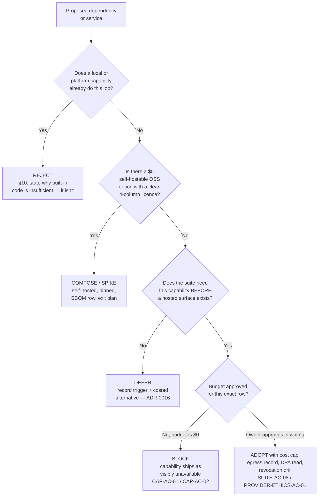
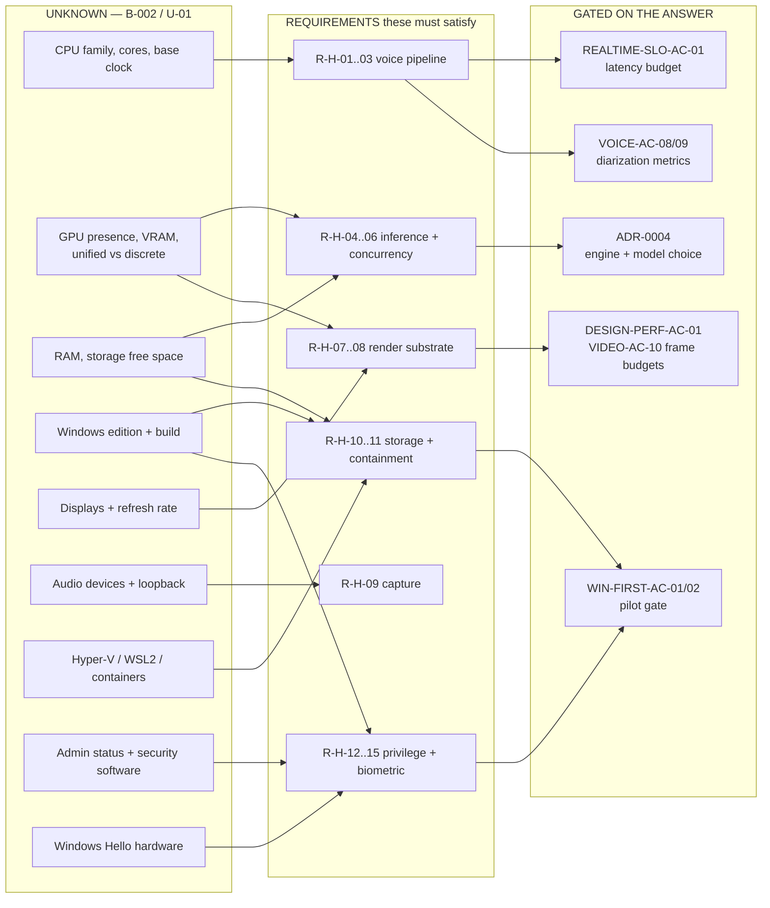

# 15 — Zeno Paid-Service Decision Ledger, Hardware Options and Cost Envelopes

**Phase 0B · Gate 1 artifact · 2026-08-28**
Source requirements: master prompt §10 (technology decision rules), §10.1 (capability and degradation), §1.1 (productization boundary), §1.2 (Windows-first pilot), §5.7 (payments), §6.5 (model and runtime strategy), §9 (data zones).
Depends on: `10-PRD-suite-and-products.md` §2.4/§2.5, `12-architecture-and-adrs.md` ADR-0004/0005/0014/0015/0016/0017/0019/0020, `14-context-sanitization-gateway.md`, `research/L5-skeptic-review.md` §2/§4/§5/§8, `03-corrections-log.md`, `02-conflict-and-disposition-register.md`, `04-assumptions-contradictions-unknowns.md`.

> **This document authorizes no purchase, no signup, no trial, no account and no provisioning.** Every price below is a *costed proposal input*. Nothing in it is an assumption that money will be spent. Budget is **$0** (A-05).

---

## 0. How to read this

### 0.1 Evidence labels

| Label | Meaning |
|---|---|
| **[V]** | Verified against a primary artifact fetched by this worker on **2026-08-28**, or by a named lane on **2026-08-24** with the source cited |
| **[V-lane]** | Verified by an earlier lane (L1/L3/L5/L9) and re-cited here without re-fetch |
| **[C]** | Corroborated by secondary sources only — no primary read |
| **[I]** | Inferred from verified facts; the inference is stated |
| **[U]** | Unknown. Deliberately not filled in |

**Prices are perishable.** Every figure is a list price rendered on the vendor's own public page on the date given. Regional pricing, GST/VAT for an India-domiciled buyer, annual-vs-monthly commitments and promotional rates are **[U]** unless stated. No figure below has been checked against an invoice.

### 0.2 What this document is not allowed to do

- It may not adopt a paid service. Every paid row exits as `defer` or `reject`; moving one to `adopt` is a separate owner decision under §7.
- It may not state a latency, GPU, thermal, frame-rate or real-time commitment as settled. **B-002 is open** (U-01). Hardware appears here only as **requirements the still-unknown specifications must satisfy**.
- It may not re-resolve a row in `02-conflict-and-disposition-register.md`. New conflicts go to §8, not into a silent decision.
- It may not treat a vendor's marketing page as a licence. Code, weights, datasets and required-runtime licences are four separate facts (§0.3).

### 0.3 The four-column licence rule, applied to services

`10-PRD` §2.5 makes this a Gate 1 exit criterion for `adopt`/`compose` verdicts, and L5 risk #1 is the reason it exists. Applied to a **hosted service**, the four columns resolve differently than for a library, and the difference is exactly where people get caught:

| Column | For a library | For a hosted service |
|---|---|---|
| **Code** | The repository's LICENSE | Often the *client SDK*'s LICENSE — which says nothing about the service |
| **Weights** | Model weight licence | Usually n/a; applies when the service hosts models |
| **Datasets** | Training-data terms | Usually n/a; applies to the vendor's own training on your data — a **terms-of-service** question, not a licence |
| **Required runtime** | What it needs to run | **The service itself, under its Terms of Service and DPA** — proprietary in every hosted case below |

Two live examples found while writing this ledger:

- **Upstash's `redis-js` client is MIT [V]**, fetched 2026-08-28. The Upstash *service* is proprietary SaaS. An SBOM that records "Upstash — MIT" is wrong in the way that matters.
- **Next.js is MIT [V]** (`vercel/next.js` `license.md`, fetched 2026-08-28). The **Vercel platform** is proprietary. "We use Vercel, it's open source" is a category error.

**Rule adopted here:** every service row records the *client-side* code licence and the *service* terms as separate facts, and the SBOM (SUITE-AC-09) records the service under its ToS/DPA identity, never under its SDK's SPDX ID.

### 0.4 Row schema

Every row carries the eleven fields §10 demands, plus the four-column licence record and the AC cross-references:

`job` · `why built-in/platform code is insufficient` · `open-source status and exact licence (code / weights / datasets / required-runtime)` · `self-hosted or local option` · `data sent and retained` · `security boundary` · `free tier and paid cost` · `operational burden` · `lock-in and exit plan` · `maintenance signals` · `measured alternative` · `status (adopt / adapt / compose / spike / defer / reject)` · `ACs`

---

## 1. The headline answer

### 1.1 What a $0 private Zeno build actually needs

**Nothing on the paid list. Not one row.**

That is not a rhetorical flourish; it is what the requirements themselves say. §10.1, in the master prompt's own words, calls Resend, Clerk, Pinecone, Upstash, PostHog, Sentry and Stripe *"optional integrations, not mandatory architecture"*. §10.1 also mandates that *"local SQLite/FTS/exact/LSP/git and local diagnostics remain the minimum path when vector DB, Graphify/graph service, Supabase, Upstash, Pinecone, Sentry or PostHog is absent"*, and that *"missing optional acceleration/telemetry never blocks core local operation or causes cloud upload."*

A single-user, local-first, single-tenant product with no hosted surface, no other users, no inbound webhooks from the public internet, no transactional email to send, no billing to collect and no fleet to observe **has no job for any of them**.

### 1.2 The five costs that are real and are *not* vendor fees

Saying "$0" without naming these would be dishonest accounting.

| # | Real cost | Magnitude | Status |
|---|---|---|---|
| **RC-1** | **Electricity** for sustained local inference, ASR and diarization | **[U] — depends entirely on B-002.** A discrete-GPU desktop under sustained load and a fanless laptop differ by an order of magnitude | Blocked on B-002; FINE-TUNE-AC-01 already requires a *"hardware/energy report"* |
| **RC-2** | **Local disk** for model weights, worktrees, the Raw Evidence store, the separate sanitized-view stores (SAN-AC-02), FTS/vector indexes and encrypted versioned backups | **[U] — tens of GB minimum for weights alone; total unknown until model selection, which is itself blocked on B-002** | Requirement R-H-10 below |
| **RC-3** | **Owner time.** The largest cost in this program by a wide margin, and the one the $0 constraint actually converts other costs into | Not costed here — a schedule question, `18-roadmap-and-risk-register.md` owns it | Out of scope for this ledger |
| **RC-4** | **Code-signing identity** for a signed release. See §3.11 — **this is the only unavoidable recurring cash cost the program will eventually face**, and no earlier artifact surfaced it | Apple Developer Program **99 USD/membership year [V]**; Windows OV Authenticode **~$216–$226/yr, reseller-advertised [C]** | `defer` — not needed for a personal pilot; needed for WIN-FIRST-AC-01's *"signed build"* only in its distributed sense. See §3.11 and §8 conflict **NEW-15** |
| **RC-5** | **Backup media** — an external encrypted drive for the "encrypted versioned backups… declared RPO/RTO… regular restore drills" §10.1 requires | One-time, **[U]**; likely already owned | Owner confirms; no purchase proposed |

### 1.3 One correction to a comfortable assumption

**Zeno's runtime may not depend on the owner's Claude Code / Claude subscription.** That subscription is a *build-time* tool for Phase 0–8; it is not a runtime inference source for the product. MCP **Sampling is deprecated** and its prescribed migration is *"integrate directly with LLM provider APIs"* **[V-lane, C-026 / L5 §7.8]** — so any design that quietly assumed "borrow the host's model" is dead, and with it the idea that a subscription makes cloud inference free. Cloud inference in Zeno is metered API spend or it does not exist. This is already binding in `10-PRD` §2.4 and ADR-0004; it is restated here because it is the single most likely source of a false "$0" claim.

---

## 2. Master verdict table

Verdicts are consistent with ADR-0016 and extend it with fetched prices, fetched licences and new rows. Nothing here overturns ADR-0016; §3 refines several of its `unverified` licence cells with primary reads.

| # | Service | Precise job it would do | Needed for a **$0 private build**? | Verdict | Cost if ever adopted (list price, fetched 2026-08-28 unless noted) |
|---|---|---|---|---|---|
| S-01 | **Supabase** | Hosted Postgres + Auth + Realtime + Storage + pgvector for sync-eligible data | **No** | `defer` | Free $0 · Pro **from $25/mo** · Team **from $599/mo** **[V]** |
| S-02 | **Vercel** | Hosting for a web dashboard and a narrow webhook surface | **No** | `defer` | Hobby **$0/mo** · Pro **$20/mo** · Enterprise custom **[V]** |
| S-03 | **Clerk** | Identity for a hosted/multi-user surface | **No** | `reject for the MVP` | Hobby free (50,000 MRU/app) · Pro **$25/mo** · Business **$300/mo** **[V]** |
| S-04 | **Pinecone** | Cloud vector database | **No** | `defer` | Starter free · Builder **$20/mo flat** · Standard **$50/mo min usage** · Enterprise **$500/mo min usage** **[V]** |
| S-05 | **Upstash** | Cloud queue / cache (Redis, QStash) | **No** | `defer` | Free $0 (256 MB, 500K cmd/mo) · Pay-as-you-go **$0.2/100K commands** · Fixed 250MB **$10/mo** **[V]** |
| S-06 | **Resend** | Product transactional email | **No** | `defer` | Free **$0/mo — 3,000 emails/mo** · Pro **$20/mo — 50,000** **[V]** |
| S-07 | **Cloudflare** | Approved edge / tunnel reachability | **No** | `defer` | Usage-based: Workers **$0.30/M requests**, R2 **$0.015/GB-mo**, KV **$0.50/GB-mo**, D1 **$0.75/GB-mo** **[V]**. **Zero Trust / Tunnel pricing: [U] — page not fetchable (§9)** |
| S-08 | **Stripe** | **Zeno's own** billing, never a wallet for the owner's purchases | **No** | `defer` — blocked behind the §1.1 commercial gate | India: **2%** domestic Visa/Mastercard · **3%** international · **3.5%** Amex international · **+2%** on currency conversion · *"no setup fees, monthly fees"* **[V]** |
| S-09 | **Sentry** | Error aggregation | **No** | `off` (ADR-0014) | Developer **$0** (5k errors) · Team **$26/mo** · Business **$80/mo** **[V]** |
| S-10 | **PostHog** | Product analytics | **No** | `off` (ADR-0014) | Free tier: 1M analytics events, 5K session replays, 1M flag requests · **paid rates [U] — not in static HTML [V-negative]** |
| S-11 | **LiveKit** | WebRTC media plane for voice/phone and device transport | **No** — optional, and self-hostable | `compose` self-hosted; **`reject` LiveKit Cloud for now** | Cloud: Build **$0/mo** (1,000 agent-session min, 5,000 WebRTC min, 5 concurrent) · Ship **from $50/mo** · Scale **from $500/mo** **[V]**. Self-hosted **Apache-2.0 [V]** = $0 + your own infra |
| S-12 | **Tailscale** | Private device reachability for Zeno Mesh | **No** | `defer` hosted; see S-13 | Personal **$0 forever, up to 6 users, unlimited devices, up to 50 tagged resources** · Standard **$8/user/mo** · Premium **$18/user/mo** **[V]** |
| S-13 | **Headscale** | Self-hosted coordination server, Tailscale-compatible | **Optional, $0** | `spike` — the licence-clean default | **$0.** BSD-3-Clause **[V]**, self-hosted |
| S-14 | **NATS / JetStream** | Durable fan-out event bus when SQLite/Redis Streams is outgrown | **No** | `defer` | Self-hosted **$0**, Apache-2.0 **[V]**. Synadia Cloud pricing **[U] — page 404 (§9)** |
| S-15 | **Twilio** | SIP/PSTN endpoint for ASSIST-AC-06 | **No** | `defer` to Phase 7, paid approval first | Local number **$1.15/mo** · toll-free **$2.15/mo** · origination local **$0.0034/min** · termination US-48 **$0.0100/min** · toll-free termination **$0.0011/min** **[V]** |
| S-16 | **Telnyx** | Same job | **No** | `defer` | Outbound local **from $0.005/min** · inbound local **from $0.0032/min** · inbound toll-free **from $0.015/min** · outbound toll-free free **[V]**. Number MRC not shown on that page **[U]** |
| S-17 | **SignalWire** | Same job | **No** | `defer` | SIP/WebRTC **$0.0030/min** · PSTN inbound **$0.0066/min** · outbound **$0.0080/min** · toll-free in **$0.0147** / out **$0.0069** · *AI runtime billed additively at $0.16/min* **[V]** · number MRC **[U]** |
| S-18 | **Obsidian Sync** | Vault sync | **No** — and **moot**: Obsidian is not installed (X-03) | `defer` | Standard **$4/user/mo annual, $5 monthly** · Plus **$8 / $10** **[V, re-verified 2026-08-28 — matches C-012 exactly]** |
| S-19 | **Neo4j** | Graph backend under Graphiti | **No** | `reject` as a shipped dependency | Self-managed **Community Edition free, GPL3 [V]** · AuraDB Free **$0** · AuraDB Professional **$65/GB/month, 1 GB min** · Business Critical **$146/GB/month, 2 GB min** **[V]** |
| S-20 | **FalkorDB** | Graph backend under Graphiti | **No** | `reject` | Free tier exists · Startup **from $73/1GB/month** · Pro **from $350/8GB/month** **[V]**. Code is **SSPL v1 [V-lane]** — not OSI-approved |
| S-21 | **Model providers** (Anthropic, OpenAI, Google, open-weight hosts) | Cloud inference when local is insufficient | **No** for S1; **yes, metered** for S2 | `defer` with a hard spend cap | See §3.9 — verified per-1M-token rates |
| S-22 | **Code-signing identities** (Apple, an Authenticode CA) | Signed, notarized, anti-downgrade release artifacts | **No** for a personal pilot | `defer`, but flagged — see §3.11 and NEW-15 | Apple Developer Program **99 USD/year [V]** · Windows OV Authenticode **~$216–$226/yr [C, reseller-advertised]** |
| S-23 | **Vexa** | Bot-lane meeting capture | **No** | `defer` — a paid-or-infra decision, not an adoption | Hosted **$0.30/hr of bot time [V-lane]** |
| S-24 | **meetily Pro** | Speaker identification | **No** | `reject as a dependency` | **$10/user/month billed annually** (regular $25/mo) **[V-lane]** — the feature **moved** behind the paid tier while the repo tagline still advertised it |
| S-25 | **Screenpipe** | Screen/audio capture | **No** | `reject` | Paid for all commercial use *"regardless of company size, headcount, revenue, or funding"*; §3 caps individual licences at **four users per company**; §5 bans embedding into a customer product **[V-lane]** |
| S-26 | **Argmax Pro SDK** | Diarization / speaker stack | **No** | `defer` | **[U]** |
| S-27 | **Granola / Otter / Fireflies / Fathom / Read AI / Cluely / Wispr Flow** | Competitor meeting and dictation SaaS | **No** | `reject as dependencies` — competitor research only | Granola Business **$14/user/mo**, Enterprise **$35** · Otter Pro **$16.99**/mo (**$8.33** annual), Business **$30** · Fireflies Pro **$10/seat/mo**, Business **$19**, Enterprise **$39** · Fathom Premium **$20** ($16 annual) · Read AI Core **$16** ($8 annual) · Cluely Pro **$19.99/mo**, *Pro + Undetectability* **$149.99/mo** · Wispr Flow Pro **$15/user/mo** ($12 annual) **[all V-lane, L3, 2026-08-24]** |

**Count: 27 rows. Zero adopted. Zero required for a $0 private build.**

---

## 3. The ledger

### 3.1 Hosting and control plane

#### S-01 · Supabase

| Field | Record |
|---|---|
| **Precise job** | Hosted Postgres with Auth, Realtime, Storage and pgvector as an *optional* control plane for sync-eligible Vault and task data |
| **Why built-in code is insufficient** | **It isn't.** Zeno is single-user and local-first. Local SQLite plus the Mesh E2EE delta sync (ADR-0008, ADR-0015) covers durability, query and multi-device replication without a network hop. §10.1 explicitly names local SQLite/FTS as the *minimum path* that must remain when Supabase is absent |
| **Licence — code** | `supabase/supabase` **Apache-2.0 [V, raw LICENSE fetched 2026-08-28]** |
| **Licence — weights / datasets** | n/a |
| **Licence — required runtime** | **The hosted Supabase platform under its own ToS/DPA — proprietary [I]**, or a self-hosted Postgres you operate. Note the Apache-2.0 repo does **not** make the hosted service open source |
| **Self-hosted / local option** | Yes — self-hosted Postgres + pgvector. **pgvector is under the PostgreSQL Licence [V, LICENSE fetched 2026-08-28]** — permissive, no copyleft, safe to ship alongside |
| **Data sent and retained** | If ever enabled: whatever the sync-eligible zone contains. ADR-0016's standing rule holds — **never** source, chats, audio, Vault roots or secrets. Retention would be the vendor's, not ours |
| **Security boundary** | A hard privacy-zone crossing. Row-Level Security mandatory **and tested** if ever used; SAN-AC-08 requires the payload be rebuilt from a destination-bound view and re-approved against a payload hash |
| **Free tier / paid** | Free **$0** · Pro **from $25/mo** · Team **from $599/mo** · Enterprise custom **[V]** |
| **Operational burden** | Hosted: low to run, high to govern (RLS review, DPA read, subprocessor list, region choice, breach path). Self-hosted: ordinary Postgres operations |
| **Lock-in / exit** | Low-to-moderate. Postgres dump/restore is a genuine exit; Auth, Realtime and Storage are the sticky parts. Exit plan: keep the schema Postgres-portable, never depend on Supabase-specific Auth in the local path |
| **Maintenance signals** | Large, active, well-funded. Not a maintenance risk; a **governance** risk if the local design ever starts assuming it |
| **Measured alternative** | Local SQLite + FTS5 + a local vector store, already the ADR-0005/0008 recommendation. Measured comparison is not needed to reject: there is no job |
| **Status** | **`defer`** · trigger: multi-device data needs genuinely outgrowing E2EE deltas · ACs: SUITE-AC-09, SAN-AC-07, SAN-AC-08, VAULT-AC-01, CAP-AC-02 |

#### S-02 · Vercel

| Field | Record |
|---|---|
| **Precise job** | Host a web dashboard and a narrow webhook receiver. **Never** the privileged local daemon |
| **Why built-in code is insufficient** | For a single-user local build, it isn't: Command runs locally and there is no public webhook to receive. Zeno's inbound events (Jira, Slack) degrade to *"least-scoped official polling"* under §10.1's ladder, which needs no public endpoint |
| **Licence — code** | Next.js **MIT [V, `vercel/next.js` license.md fetched 2026-08-28]** |
| **Licence — required runtime** | **The Vercel platform, proprietary [I].** The MIT framework licence says nothing about the host — see §0.3 |
| **Self-hosted / local option** | Yes, completely. Next.js self-hosts; a local dashboard needs no host at all |
| **Data sent and retained** | Any request body reaching a deployed function, plus Vercel's own logs. **[U]** retention |
| **Security boundary** | §10.1 is explicit: *"It can never host the privileged native voice, local-model, or Accessibility executor. Keep privileged execution local."* Any webhook surface is untrusted ingress and must enter through the Sanitization Gateway (`14-…`, SAN-AC-01/04) |
| **Free tier / paid** | Hobby **$0/mo** · Pro **$20/mo** · Enterprise custom **[V]** |
| **Operational burden** | Low, but it creates a public attack surface where none exists today, and a second deployment identity to govern |
| **Lock-in / exit** | Low for a plain Next.js app; **high** if durable execution, queues or cron creep in. §10.1 warns not to assume it suits long-lived or durable execution and to revalidate its runtime and queue limits — that revalidation has **not** been done and is **[U]** |
| **Maintenance signals** | Healthy |
| **Measured alternative** | Local-only dashboard, which is what Command is |
| **Status** | **`defer`** · trigger: a hosted web surface actually shipping · ACs: SAN-AC-01, SAN-AC-04, SAN-AC-12, SUITE-AC-09 |

#### S-07 · Cloudflare

| Field | Record |
|---|---|
| **Precise job** | Approved edge and tunnel needs — principally reachability to a home machine without a public IP |
| **Why built-in code is insufficient** | Reachability is a genuine gap on a NAT'd network, but it is a gap **Mesh with mTLS or Headscale already fills** at $0 (ADR-0015) |
| **Licence — code / runtime** | Client `cloudflared` **[U] — not fetched.** Service proprietary **[I]** |
| **Self-hosted / local option** | Yes — direct mTLS, or Headscale (S-13) |
| **Data sent and retained** | A tunnel terminates TLS at Cloudflare unless configured otherwise; that is a **third party in the path of privileged traffic** |
| **Security boundary** | §10.1: *"Cloudflare tunnels must not expose privileged endpoints without device authentication and policy."* Treated here as: a tunnel may **never** front the device broker, the model gateway or the approval path |
| **Free tier / paid** | Developer platform is usage-based: Workers **$0.30/M requests**, R2 **$0.015/GB-month**, Workers KV **$0.50/GB-month**, D1 **$0.75/GB-month** **[V]**. **Zero Trust / Tunnel plan pricing: [U]** — both candidate pages returned 404 or omitted it (§9) |
| **Operational burden** | Low technically; a new trust relationship to govern |
| **Lock-in / exit** | Low for tunnels; high once Workers/R2/D1 hold state |
| **Maintenance signals** | Healthy |
| **Measured alternative** | Headscale or direct mTLS — $0 and no third party in the path |
| **Status** | **`defer`** · trigger: remote reachability Mesh cannot serve · ACs: LINK-AC-01, SUITE-AC-08, CAP-AC-01 |

### 3.2 Identity

#### S-03 · Clerk (and Supabase Auth)

| Field | Record |
|---|---|
| **Precise job** | Sign-in, session and user management for a hosted or multi-user surface |
| **Why built-in code is insufficient** | **There is no surface to sign in to.** §10.1: *"A standalone local workflow must not require cloud login merely to launch."* Local sessions authenticate against the OS; T3 additionally requires a fresh device biometric inside the action-bound review flow (ADR-0015). A third-party IdP would *add* a cloud dependency to a product whose defining property is not having one |
| **Licence — code** | Clerk SDKs **[U] — not fetched.** Service proprietary, commercial **[I]** |
| **Licence — required runtime** | Hosted Clerk, proprietary |
| **Self-hosted / local option** | None for Clerk. Supabase Auth self-hosts, but see S-01: still no job |
| **Data sent and retained** | Identity records, session metadata, device fingerprints — for exactly one user, the owner |
| **Security boundary** | Would place the owner's authentication outside the device. §9's rule is *choose one, not both*, and an ADR must prove a need. No ADR proves one |
| **Free tier / paid** | Hobby free — **50,000 MRU per app** · Pro **$25/mo** · Business **$300/mo** · Enterprise custom **[V]**. Note Clerk bills *Monthly Retained Users*, not MAU: *"A user only counts as retained if they return to your app at least 24 hours after signing up"* **[V]** |
| **Operational burden** | Low to integrate, permanent to govern |
| **Lock-in / exit** | High. Identity is the stickiest dependency there is; migrating users off an IdP is a project |
| **Maintenance signals** | Healthy |
| **Measured alternative** | OS authentication + device-keypair pairing + device biometric (ADR-0015). Strictly better for this product |
| **Status** | **`reject` for the MVP** (a stronger word than ADR-0016's `defer`, because unlike the others there is no plausible near-term trigger) · revisit only if a hosted or team edition ships · ACs: SUITE-AC-08, VAULT-AC-01, LINK-AC-01 |

### 3.3 Stores — vectors, graph, queue, cache

#### S-04 · Pinecone

| Field | Record |
|---|---|
| **Precise job** | Hosted vector database for semantic retrieval |
| **Why built-in code is insufficient** | It isn't, and §6.2 of the master prompt is emphatic that Forge does **exact retrieval before embeddings**. Vectors are an *optional accelerator* in this architecture, not the retrieval substrate |
| **Licence — code / runtime** | Proprietary SaaS **[I]**; client SDKs **[U]** |
| **Self-hosted / local option** | Yes — pgvector (**PostgreSQL Licence [V]**) or a local index |
| **Data sent and retained** | Embeddings of source code, transcripts, notes. **Embeddings are derived personal/employer data and are not anonymous** — Cursor's own data-use page is the cautionary case: embeddings and filename metadata retained permanently even under Privacy Mode **[V-lane, C-010]** |
| **Security boundary** | Sending embeddings of employer source code to a third party is a Workspace-Context-Scope-Record violation unless separately approved (SUITE-AC-13). SAN-AC-07 requires embeddings contain only sink-authorized sanitized content |
| **Free tier / paid** | Starter free · Builder **$20/mo flat** · Standard **$50/mo minimum usage** · Enterprise **$500/mo minimum usage** · 3-week trial gives **$300 credits** **[V]** |
| **Operational burden** | Low technically; the governance burden is the point |
| **Lock-in / exit** | Moderate — re-embedding is a compute cost, not a data-loss event |
| **Maintenance signals** | Healthy |
| **Measured alternative** | pgvector / local index, already the ADR-0005 recommendation |
| **Status** | **`defer`** · trigger: an approved scale/privacy requirement local vectors demonstrably cannot meet · ACs: SAN-AC-07, SAN-AC-09, FORGE-AC-01, MEMORY-AC-04 |

#### S-19 · Neo4j and #S-20 · FalkorDB — the licence trap, restated

This is L5 risk #1 and conflict **NEW-12**. It is a *licence* decision that a price table cannot rescue.

| | Neo4j | FalkorDB |
|---|---|---|
| **Job** | Backend for Graphiti's temporal knowledge graph | Same |
| **Code licence** | **GPLv3** for the Community Edition — verbatim from `LICENSE.txt`: licensed *"under the GNU GENERAL PUBLIC LICENSE Version 3 … unless … a Commercial Agreement"* **[V-lane]**. Confirmed by the vendor's own pricing page: Community Edition is *"Free"* and **"GPL3-licensed" [V, 2026-08-28]** | **Server Side Public License v1** — `LICENSE.txt` opens *"Server Side Public License, VERSION 1, OCTOBER 16, 2018"* **[V-lane]**. **SSPL is not OSI-approved**; §13 conditions offering the software as a service on releasing the entire service stack |
| **Weights / datasets** | n/a | n/a |
| **Required runtime** | JVM; and note **Graphiti (Apache-2.0) requires one of these two** — that is the transitive trap **[V-lane]** | — |
| **Self-hosted option** | Yes, under GPLv3 | Yes, under SSPL |
| **Paid escape** | AuraDB Free **$0** · Professional **$65/GB/month** (1 GB min) · Business Critical **$146/GB/month** (2 GB min) · Aura Graph Analytics **$0.40/GB/hour** · Enterprise Edition "Contact Sales" **[V]** | Free tier · Startup **from $73/1GB/month** · Pro **from $350/8GB/month** · Enterprise tailored **[V]** |
| **Security boundary** | Self-hosted: local. Aura: a cloud copy of the owner's knowledge graph — the single most sensitive derived store in the suite | Same |
| **Lock-in / exit** | Cypher is portable-ish; the licence is the lock-in | SSPL §13 is the lock-in |
| **Status** | **`reject` as a shipped dependency.** *If and only if* the owner states that Zeno will **never** be distributed or offered as a service, Graphiti-on-Neo4j becomes arguable as **`compose`, self-host-only, never distribute, never offer as a service** — written that way, never as a plain `compose` | **`reject`.** SSPL's service condition is fatal to any hosted edition and unattractive even self-hosted |
| **ACs** | SUITE-AC-09, MEMORY-AC-04, SAN-AC-07 | same |

**The decision the owner must make first** is not "which graph database" but **"will Zeno ever be distributed or offered as a service?"** (§1.1, conflict NEW-12). If the answer is yes or unknown, both rows are permanently out and ADR-0005's SQLite path is the only path — and that costs **$0**.

#### S-05 · Upstash · S-14 · NATS

| Field | Upstash | NATS / JetStream |
|---|---|---|
| **Job** | Cloud queue and cache | Durable fan-out event bus and edge coordination |
| **Why built-in insufficient** | It isn't. §10 says *"Local first; Upstash only for an approved cloud queue/cache use case"* — and there is no cloud component to queue for | Not yet. §10 says SQLite/Redis Streams for MVP, NATS *"when durable fanout and edge coordination justify it"*. One user, few devices: not justified |
| **Code licence** | Client `@upstash/redis` **MIT [V, LICENSE fetched 2026-08-28]** — the **service** is proprietary **[I]** | `nats-io/nats-server` **Apache-2.0 [V, LICENSE fetched 2026-08-28]** |
| **Weights / datasets** | n/a | n/a |
| **Required runtime** | Hosted Upstash, proprietary | Self-hosted binary — **$0**, or Synadia Cloud (**pricing [U], page 404 — §9**) |
| **Self-hosted option** | No (Redis-compatible self-host is a different product) | **Yes, fully** |
| **Data sent / retained** | Queue payloads — which in this suite means task envelopes and possibly sanitized context | Local only when self-hosted |
| **Security boundary** | Every queued payload becomes an egress event under SAN-AC-08 | None crossed when local |
| **Free / paid** | Free **$0** (256 MB, 10 GB bandwidth, 500K commands/mo) · Pay-as-you-go **$0.2/100K commands** · Fixed 250MB **$10/mo** (+$5/read region) · up through Fixed 500GB **$1500/mo** **[V]** | **$0** self-hosted |
| **Lock-in / exit** | Low — Redis protocol | Low — but a bus is an architectural commitment, not a library swap |
| **Maintenance signals** | Healthy | CNCF-hosted, Apache-2.0 at `main` today **[V]**. **Governance caution:** ecosystem licence-change attempts are a live risk class for infrastructure projects; re-read the LICENSE at the pinned tag on every bump, exactly as the weights rule demands (`10-PRD` §2.5) |
| **Measured alternative** | Local SQLite-backed durable queue | Local SQLite-backed event log |
| **Status** | **`defer`** · ACs: SAN-AC-08, CAP-AC-02, OUTBOX-AC-01 | **`defer`** · trigger: measured durable-fanout need across ≥3 executors · ACs: MEMORY-AC-03, OUTBOX-AC-01, LINK-AC-03 |

### 3.4 Networking, transport and telephony

#### S-12 · Tailscale · S-13 · Headscale

| Field | Tailscale | Headscale |
|---|---|---|
| **Job** | Private reachability between the owner's paired devices, for Zeno Mesh | Self-hosted, Tailscale-compatible coordination server |
| **Why built-in insufficient** | NAT traversal and key distribution across a home network, a laptop on the move and a phone is genuinely hard; the OS gives you nothing equivalent. This is one of the few rows where the *job* is real | same |
| **Code licence** | Client/daemon **BSD-3-Clause [V, `tailscale/tailscale` LICENSE fetched 2026-08-28]**. **GUI wrappers and the coordination server are proprietary [V-lane]** | **BSD-3-Clause [V, `juanfont/headscale` LICENSE fetched 2026-08-28]**. Explicitly *"not associated with Tailscale Inc."*, single-tailnet scope **[V-lane]** |
| **Weights / datasets** | n/a | n/a |
| **Required runtime** | **Tailscale's hosted coordination service** — the proprietary half, and the half that matters | Your own server — **$0** |
| **Data sent / retained** | Control-plane metadata: device identities, keys, ACLs, connection events. **Not** payload (WireGuard is end-to-end). Retention **[U]** | Nothing leaves |
| **Security boundary** | A third party mediates device identity — the exact thing ADR-0015 keeps local and out-of-band | None crossed |
| **Free / paid** | **Personal $0 forever — up to 6 users, unlimited user devices, up to 50 tagged resources** · Standard **$8/user/month** · Premium **$18/user/month** · Enterprise custom **[V]**. *The Personal tier plausibly covers this entire program at $0 — which makes it a **terms** decision, not a cost decision* | **$0** |
| **Operational burden** | Near zero | Real: you run, back up and upgrade a coordination server |
| **Lock-in / exit** | Moderate — Headscale exists precisely as the exit | None |
| **Maintenance signals** | Both healthy | Bus factor is thinner than Tailscale's; single-tailnet limitation will bite if the device group grows |
| **Measured alternative** | Direct mTLS between paired devices — no coordinator at all, most private, most work |
| **Status** | **`defer`** — hosted coordination is a new trust relationship; the free tier does not change that · ACs: LINK-AC-01, LINK-AC-04, VAULT-AC-01 | **`spike`** — the licence-clean $0 default alongside plain mTLS · same ACs |

#### S-11 · LiveKit

| Field | Record |
|---|---|
| **Precise job** | WebRTC media plane for full-duplex voice, device transport and the eventual phone endpoint |
| **Why built-in code is insufficient** | Real-time media over WebRTC — ICE, SFU, jitter buffers, echo control — is not something to write. This is a legitimate `compose` candidate |
| **Licence — code** | `livekit/livekit` **Apache-2.0 [V, LICENSE fetched 2026-08-28]**; `agents` and `sip` Apache-2.0 each **[V-lane badge]** |
| **Licence — weights / datasets** | n/a for the media plane. **Careful:** LiveKit Cloud's "inference credits" imply hosted models with their own terms — **[U]** |
| **Licence — required runtime** | Self-hosted: your own server, $0. **Cloud: proprietary service.** Telephony additionally requires a **SIP provider** — paid, and §10 requires cost/privacy review plus paid approval before comparing Twilio/Telnyx/SignalWire |
| **Self-hosted / local option** | **Yes.** This is the row where self-hosting is both licence-clean and architecturally correct |
| **Data sent and retained** | Self-hosted: media stays on your infrastructure. Cloud: **the owner's voice, and other meeting participants' voices, transit a third party** — which collides directly with the biometric/consent design (ADR-0019, VOICE-AC-03, COUNSEL-AC-04) |
| **Security boundary** | Voice is the most sensitive stream in the suite. Speaker embeddings are Art. 9 GDPR special-category data **[V-lane/I, L5 §3.5]**; they must never leave the device. A cloud SFU is a hard zone crossing |
| **Free tier / paid** | Cloud: Build **$0/mo** — 1,000 agent-session minutes, 5,000 WebRTC minutes, 5 concurrent sessions, 1 deployment, $2.50 inference credits · Ship **from $50/mo** — 5,000 agent min then **$0.01/min**, 150,000 WebRTC min then **$0.0005/min** · Scale **from $500/mo** — 50,000 agent min, 1.5M WebRTC min then **$0.0004/min** · Enterprise custom **[V]** |
| **Operational burden** | Self-hosted SFU operation is non-trivial: TURN, certificates, ports, upgrades |
| **Lock-in / exit** | Low — the client protocol is WebRTC; the server is swappable in principle |
| **Maintenance signals** | Healthy, active |
| **Measured alternative** | Plain WebRTC peer-to-peer within the device group for 1:1 — sufficient for handoff and dictation, insufficient for multi-party |
| **Status** | **`compose`, self-hosted only.** **`reject` LiveKit Cloud** while any voice path is in scope · ACs: ASSIST-AC-06, LINK-AC-02, LINK-AC-03, VOICE-AC-11 |

#### S-15/16/17 · SIP providers — Twilio, Telnyx, SignalWire

One job: give ASSIST-AC-06 a real phone number so the owner can call Zeno. §10 requires *"a cost/privacy review and paid approval"* before this comparison is even acted on, and ASSIST-AC-06's own evidence bar requires the cost be approved **before** provisioning.

| | Twilio Elastic SIP Trunking **[V]** | Telnyx Elastic SIP **[V]** | SignalWire **[V]** |
|---|---|---|---|
| Number MRC | Local **$1.15/mo**, toll-free **$2.15/mo** | not shown on the SIP page — **[U]** | not shown — **[U]** |
| Inbound (origination) | Local **$0.0034/min**, toll-free **$0.0130/min** | Local **from $0.0032/min**, toll-free **from $0.015/min** | PSTN 10DLC in **$0.0066/min**, toll-free in **$0.0147/min** |
| Outbound (termination) | US 48-state **$0.0100/min**, toll-free **$0.0011/min**, Alaska **$0.0862**, high-cost **$0.0620** | Local **from $0.005/min**, toll-free **free** | PSTN 10DLC out **$0.0080/min**, toll-free out **$0.0069/min** |
| Native SIP/WebRTC leg | — | — | **$0.0030/min** |
| Notable | — | India-specific rates **[U]** — the page shows no regional differentiation | *AI runtime billed additively at **$0.16/min***, which would dominate every other line item if used |

**Shared record for all three.** *Job:* PSTN reachability. *Why built-in insufficient:* there is no way to receive a phone call without a carrier. *Licence:* proprietary services; no code licence applies **[I]**. *Self-hosted option:* none for PSTN — the $0 alternative is **WebRTC-only calling inside the device group**, which satisfies most of ASSIST-AC-06's spirit and none of its letter. *Data sent/retained:* call metadata (CDRs) always; audio if recording is enabled — **never enable it**. Carrier CDR retention is **[U]** and is a lawful-intercept surface by design. *Security boundary:* §5.1/ASSIST-AC-06 is explicit that **voice is never authorization**; a phone leg may carry T0 requests and a spoken briefing, and must hand every T2/T3 action to a paired trusted device with a fresh biometric. *Lock-in/exit:* low — numbers are portable, though porting is slow. *Maintenance:* all three healthy. *Status:* **`defer` to Phase 7**, all three, pending a written cost/privacy review and explicit paid approval. *ACs:* ASSIST-AC-06, APPROVAL-BINDING-AC-01, VOICE-AC-05, SAN-AC-06.

**Order-of-magnitude, if ever approved [I]:** one local number plus light personal use — say 60 inbound minutes a month — lands near **$1.35–$2/month** on Twilio's published rates. The cost is negligible; **the privacy and approval surface is not**, and that is the reason this row is deferred, not the price.

### 3.5 Product operations

#### S-06 · Resend

*Job:* transactional email **from Zeno itself** (verification, alerts, receipts). *Why built-in insufficient:* deliverability from a residential IP is a real problem — but **there is nobody to email.** A single-user local product with a local notification surface and a local Approval Center has no transactional mail. *Licence:* service proprietary **[I]**; `resend/react-email` LICENSE **not found at the conventional path — [U] (§9)**. *Self-hosted:* SMTP relay, or nothing. *Data sent/retained:* recipient addresses and message bodies — i.e. the exact content SAN-AC-08 requires be rebuilt destination-bound and re-approved by payload hash. *Security boundary:* an outbound channel that can leave the device is a T2 effect; COMM-DRAFT-AC-01 forbids any provider-visible effect arising directly from an agent output. *Free/paid:* Free **$0/mo — 3,000 emails/mo**; Pro **$20/mo — 50,000**; up to Scale **$1,150/mo — 2.5M**; separate marketing-email ladder from **$40/mo — 5,000 contacts [V]**. *Lock-in/exit:* very low. *Status:* **`defer`** — trigger: the suite itself needs to send mail, which for a single user it does not. *ACs:* COMM-DRAFT-AC-01, SAN-AC-08, OUTBOX-AC-01.

#### S-08 · Stripe

*Job:* **Zeno's own** billing and entitlements, if a commercial edition ever exists. *Explicitly not:* the payment mechanism for the assistant's consumer purchases — §5.7 and §1.1 both forbid that, and §5.7 additionally requires merchant-hosted checkout and tokenized wallet flows, never card data through the model. *Why built-in insufficient:* card acquiring is not something to build; PCI scope is the reason. *Licence:* proprietary service **[I]**. *Self-hosted:* none. *Data sent/retained:* customer and payment data — **none today, because there are no customers**. *Security boundary:* §5.7 requires PCI scope be documented and kept as small as possible; never store CVV, recovery codes or raw card data; never send payment credentials to the model. *Free/paid:* **no setup fee, no monthly fee**; India-domiciled: **2%** domestic Visa/Mastercard, **3%** international, **3.5%** international Amex, **4.3%** international with USD presentment, **+2%** where currency conversion is required **[V]**. *Lock-in/exit:* moderate — subscription state and payment methods are portable but the migration is real. *Status:* **`defer`, blocked behind the §1.1 commercial gate**, which itself requires a separate cost, privacy, security and legal approval. *ACs:* ASSIST-AC-07, APPROVAL-BINDING-AC-01, SUITE-AC-09.

### 3.6 Observability — and a licence correction

ADR-0014 marked both rows `unverified` with the caution *"do not assume open source."* That caution was right, and both are now read.

#### S-09 · Sentry — **not open source [V, new finding]**

`getsentry/sentry` `LICENSE.md` opens: **"Functional Source License, Version 1.1, Apache 2.0 Future License"** — abbreviation **`FSL-1.1-Apache-2.0`** **[V, fetched 2026-08-28]**. FSL is *source-available with a delayed open-source conversion*, not an OSI-approved licence at the time of use. This puts Sentry in the same class as **Crush (`FSL-1.1-MIT`, already `learn-only`) [V-lane]** and confirms L5's general point that landing pages misreport licence status.

*Job:* error aggregation across devices. *Why built-in insufficient:* it isn't — §10.1 requires *"useful fully local diagnostics"* and an *"inspect-before-share support bundle"* regardless. *Weights/datasets:* n/a. *Required runtime:* hosted Sentry (proprietary service) or a self-hosted deployment under FSL. *Data sent/retained:* stack traces, breadcrumbs, request context — which in this suite means **prompts, source paths, diffs and possibly transcript fragments** unless filtered. *Security boundary:* if ever enabled, `beforeSend`-class filtering must exclude prompts, source code, diffs, audio, transcripts, screenshots, clipboard, secrets, identifiers and session replay **by default**, and the immutable security/audit ledger stays in a different store entirely. *Free/paid:* Developer **$0** (5k errors, 5 GB logs, 5 GB metrics, 5M spans, 50 replays) · Team **$26/mo** · Business **$80/mo** · Enterprise custom **[V]**. *Lock-in/exit:* low. *Status:* **`off`** (ADR-0014). *ACs:* SAN-AC-06, SUITE-AC-11, SWE-OBS-AC-01.

#### S-10 · PostHog — MIT except `ee/` **[V, new finding]**

`PostHog/posthog` `LICENSE` states everything under `ee/` is under a separate `ee/LICENSE`, and *"Content outside of the above mentioned directories … is available under the 'MIT Expat' license"* **[V, fetched 2026-08-28]**. So PostHog is genuinely open-core: MIT core, proprietary enterprise directory. That is a cleaner position than Sentry's, and changes nothing about the verdict.

*Job:* product analytics. *Why built-in insufficient:* it isn't — there is one user, and that user can be asked. *Data sent/retained:* events, and with autocapture/session replay on, effectively the UI itself. **The cautionary example is in the corpus:** the NeoSapien vendor's own site runs PostHog with `session_recording` **and** `autocapture` enabled **[V-lane, L5 §3.9]** — a live demonstration of the default this suite must never ship. *Free/paid:* free tier includes **1M analytics events, 5K session replays, 1M feature-flag requests**; paid usage rates **[U] — not present in the fetched page (§9)**. *Status:* **`off`** (ADR-0014). *Measured alternative:* **OpenTelemetry locally with no exporter configured** — `opentelemetry-collector` **Apache-2.0 [V, LICENSE fetched 2026-08-28]**, $0, and it satisfies the local-diagnostics requirement outright. *ACs:* SAN-AC-06, SUITE-AC-11, SWE-OBS-AC-01.

### 3.7 Knowledge and sync

#### S-18 · Obsidian Sync

*Job:* sync the Markdown Vault projection between the owner's devices. *Why built-in insufficient:* **it is not needed at all.** ADR-0017 records the finding: an Obsidian vault is already plain Markdown, so it needs **no export path**; the question is sync *ownership*, and §6.3 forbids Obsidian Sync and Zeno Mesh acting as competing writers over the same root. Mesh already owes the suite E2EE device-group sync (VAULT-AC-01). *Licence:* Obsidian is a **proprietary application**; terms **[U]**. Sync is a proprietary service. *Self-hosted:* Mesh, or any file-sync the owner already runs. *Data sent/retained:* the vault, encrypted, to Obsidian's servers; retention **[U]**. *Free/paid:* **Standard $4/user/month billed annually, $5 billed monthly; Plus $8 annually, $10 monthly [V, re-verified on `obsidian.md/sync` 2026-08-28 — exactly matches C-012's 2026-08-24 reading]**. *Lock-in/exit:* nil — the files are Markdown on disk. *Status:* **`defer`, and moot**: **Obsidian is not installed on the owner machine (X-03)** and U-04 records whether a vault exists elsewhere as unknown. *ACs:* ASSIST-AC-08, VAULT-AC-01, VAULT-AC-02, VAULT-AC-03, MEMORY-AC-04.

### 3.8 Meeting, voice and dictation — paid tiers behind features lanes referenced

None of these is a dependency. They are listed because a lane cited a feature that turns out to sit behind a paywall, or because the row is a competitor whose pricing calibrates the hosted-edition scenario.

| Service | The feature a lane referenced | The paywall | Verdict |
|---|---|---|---|
| **Vexa** | bot-lane meeting capture, `adopt` in L3 | Hosted **$0.30/hr of bot time**; self-hosting means running a bot fleet against Meet/Teams/Zoom **[V-lane]** | **`defer`** — a paid-or-infra decision, never an adoption. ADR-0019 |
| **meetily** | "speaker diarization" per the repo tagline | **Diarization is Pro-only**: vendor's own table shows Community *No* / Pro *Yes* at **$10/user/month billed annually** (regular $25/mo), licence "Commercial" **[V-lane]** | **`reject` as a dependency.** This is L5 risk #9's proof case: an open-core project moved the exact feature a lane depended on behind the paid tier |
| **Screenpipe** | screen/audio capture | Paid licence for **all** commercial use *"regardless of company size, headcount, revenue, or funding"*; §5 bans embedding into a customer product; **§3 caps individual licences at four users per company** **[V-lane]** | **`reject`** |
| **Argmax Pro SDK** | the Swift speech stack | Pro tier exists; price **[U]**. Separately, SpeakerKit is **MIT code over pyannote-derived weights with no Argmax weights repo on HF [V-lane]** | **`defer`; gate any adopt on a weights audit** |
| **Granola** | competitor reference | Business **$14/user/mo**, Enterprise **$35/user/mo [V-lane]** | competitor only |
| **Otter / Fireflies / Fathom / Read AI** | competitor references | Otter Pro **$16.99** ($8.33 annual), Business **$30** ($19.99) · Fireflies Pro **$10/seat**, Business **$19**, Enterprise **$39** · Fathom Premium **$20** ($16) · Read AI Core **$16** ($8) **[all V-lane]** | competitor only |
| **Cluely** | the "undetectable" pattern **register row #1 rejects** | Pro **$19.99/mo**; **Pro + Undetectability $149.99/mo — a 7.5× multiplier on concealment [V-lane]** | **`reject` — the pattern, not just the vendor.** Conflict-register row #1 stands |
| **Wispr Flow** | dictation source, scope undecided (U-08) | Pro **$15/user/mo** ($12 annual) **[V-lane]** | **`defer`** pending U-08 |

### 3.9 Model providers

This section costs inference. It does **not** select a model — §6.5 forbids hardcoding a "best model" from the prompt, ADR-0004 defers engine and model selection to a benchmark on the real pilot machine, and that benchmark is blocked on B-002.

#### 3.9.1 Local runtimes — the $0 path

| Runtime | Code licence | Required runtime | Cost | Note |
|---|---|---|---|---|
| **llama.cpp** | **MIT [V, `ggml-org/llama.cpp` LICENSE fetched 2026-08-28]** | CPU, optionally GPU | **$0** | Portable across Windows and macOS |
| **Ollama** | **MIT [V, `ollama/ollama` LICENSE fetched 2026-08-28]** | CPU/GPU | **$0** | A model manager as much as a runtime; **every model it pulls carries its own weight licence — that is the column that bites** |
| **whisper.cpp** | **MIT [V, `ggml-org/whisper.cpp` LICENSE fetched 2026-08-28]** | CPU/GPU | **$0** | ASR baseline candidate; per-model weight licences are separate and **[U]** per checkpoint |
| **MLX** | **[U] — not fetched** | **Apple Silicon only [V-lane]** | **$0** | Irrelevant to a Windows pilot; relevant post-Gate-3, and **only if the Mac is Apple Silicon** (§5.4) |
| **vLLM** | **[U] — not fetched** | server-class GPU | **$0** software | Almost certainly out of scope for a personal machine |
| **LiteLLM** | **[U] — §10 requires a licence/edition review first** | provider credentials | — | Not evaluated; do not adopt on familiarity |

**The weights column is the live risk, not the code column.** Weight licences drift *between point releases*: NeMo Sortformer went **v2 CC-BY-4.0 → v2.1 `license:other`**, and pyannote 4.x's default moved **MIT → CC-BY-4.0** **[V-lane]**. Pin by revision, mirror where permitted, re-read on every bump, and render the CC-BY attribution the licence affirmatively requires (`10-PRD` §2.5 — it renders in Command → About → Third-Party Notices and in `THIRD_PARTY_NOTICES`, SUITE-AC-09).

#### 3.9.2 Cloud providers — verified rates, for Scenario S2 only

| Provider | Model | Input $/1M | Output $/1M | Context | Free tier | Source |
|---|---|---|---|---|---|---|
| **Anthropic** | Claude Opus 5 (`claude-opus-5`) | **$5.00** | **$25.00** | 1M | none | `claude-api` skill model table, cached **2026-06-24 [V]** |
| | Claude Fable 5 (`claude-fable-5`) | **$10.00** | **$50.00** | 1M | none | same |
| | Claude Sonnet 5 (`claude-sonnet-5`) | **$2.00** | **$10.00** | 1M | none | same |
| | Claude Haiku 4.5 (`claude-haiku-4-5`) | **$1.00** | **$5.00** | 200K | none | same |
| **OpenAI** | `gpt-5.6-sol` | **$4.00** | **$20.00** | **[U]** | none | `developers.openai.com/api/docs/pricing`, **2026-08-28 [V]** |
| | `gpt-5.6-terra` | **$2.00** | **$12.00** | **[U]** | none | same |
| | `gpt-5.6-luna` | **$0.20** | **$1.20** | **[U]** | none | same |
| | `o3` | **$2.00** | **$8.00** | **[U]** | none | same |
| **Google** | Gemini 3.1 Pro Preview | **$2.00** (≤200k) / **$4.00** (>200k) | **$12.00** / **$18.00** | — | **No** | `ai.google.dev/gemini-api/docs/pricing`, **2026-08-28 [V]** |
| | Gemini 3.7 Flash | **$0.75** through 2026-12-31, **$1.50** from 2027-01-01 | **$3.75** → **$7.50** | — | **Yes** | same |
| | Gemini 2.5 Flash-Lite | **$0.10** (text/image/video), $0.30 (audio) | **$0.40** | — | **Yes** | same |

**Cost levers that are real, not marketing.** Prompt caching (cache reads are billed far below input rate; keyed by user, model, harness, policy version, data zone and repository revision per §6.5), the **Batch API at 50% cost** for non-latency-sensitive work, and **effort control** (`output_config.effort`) which materially changes token spend on current Anthropic models. All three are architecture decisions in `zeno-model-gateway`, not billing tricks.

**Shared record for every cloud provider.** *Job:* inference when a local model fails a required capability. *Why built-in insufficient:* depends entirely on B-002 — **that is the honest answer, and it is unknown**. *Licence:* proprietary APIs; **output terms, training-on-input terms and retention are per-provider ToS and are [U] here — they must be read before any egress**, and §6.5 requires output/redistribution/commercial-use terms be recorded separately from weights. *Self-hosted option:* the local runtimes above. *Data sent/retained:* whatever the gateway sends — which under SAN-AC-03 is **typed placeholders, never credentials**, rebuilt destination-bound and re-approved by payload hash (SAN-AC-08). *Security boundary:* a model-provider egress is a privacy-zone crossing; §6.5 requires provider selection be **visible** and secret context be prevented from crossing a provider boundary. *Operational burden:* a metered bill and a spend cap that must actually be enforced. *Lock-in/exit:* low at the API layer if the gateway is provider-neutral — which is exactly why ADR-0004 builds the gateway first. *Maintenance signals:* all three healthy; model IDs and prices churn fast enough that **any figure above must be re-read before it is used in a budget**. *Status:* **`defer` for S1; `adopt` under an explicit cost cap for S2 only**, with owned credentials through the broker and **no key, account, identity, free-tier or endpoint cycling ever** — PROVIDER-ETHICS-AC-01, whose evidence bar includes an exhausted-quota test and a **cost-cap test**.

### 3.10 Workflow and admin platforms (§10's "study selectively" list)

§10 names Coolify, Open WebUI, Langflow, Supabase, Stirling PDF, Crawl4AI, Maxun and **Dify** *(the provisional interpretation of the user-written "DeFi" — the interpretation is still **[U]** and the owner has not confirmed it)*, with the instruction to *"check current licenses and do not import source merely because it is visible."*

**Status for all eight: `learn-only`, not evaluated as dependencies, licences [U] — none was fetched by any lane.** None has a job in a $0 single-user local build: there is no deployment platform to run (Coolify), no second chat UI needed (Open WebUI), no visual flow builder in the architecture (Langflow, Dify), no PDF service (Stirling), no crawler in scope for Phase 0–3 (Crawl4AI, Maxun). Recording them as unevaluated is the honest position; recording them as "adopted" or "rejected" on unread licences would not be. **Owner input needed on the "DeFi" interpretation** — it is carried as an open interpretation, not a settled one.

### 3.11 Code signing — the cost nobody has surfaced

**This row is new to the corpus.** No earlier artifact costs it, and two acceptance criteria depend on it.

| Field | Record |
|---|---|
| **Precise job** | Produce **signed release artifacts with provenance and anti-downgrade protection** (§10.1), a *"signed build/host manifest"* for the Windows pilot (WIN-FIRST-AC-01) and *"a signed, reversible, least-privileged Mac build"* for work-Mac promotion (§1.2, MAC-NATIVE-AC-01) |
| **Why built-in code is insufficient** | Trust roots are issued, not computed. A self-signed certificate can be trusted **locally on a personal machine**, which is very likely sufficient for the Phase-1–5 pilot; it is **not** sufficient for distribution, SmartScreen reputation, or notarization |
| **The nuance that decides the cost** | *Personal pilot:* self-signed / ad-hoc signing, **$0**. *Distributed release:* paid identities. **[I]** A second, non-obvious consequence on macOS: **ad-hoc signatures change on every build, and macOS TCC grants (Accessibility, Screen Recording, Microphone, Automation) are bound to the signing identity** — so an unstable identity means re-granting permissions repeatedly. That makes a *stable* signing identity an engineering convenience long before it is a distribution requirement |
| **Cost** | **Apple Developer Program: 99 USD per membership year [V, `developer.apple.com/support/compare-memberships` 2026-08-28]**. A free Apple Account permits local development and on-device testing via a Personal Team, but **App IDs and provisioning profiles expire after 7 days** **[V]** — workable for development, painful for a long-lived local install. **Windows OV Authenticode: ~$215.99–$226/year, reseller-advertised [C — search results, no primary CA page read]**. Separately **[C]**: from **2026-02-15** code-signing certificate lifetimes are capped at one year, so multi-year prepayment no longer reduces the annual figure the way it used to |
| **Self-hosted option** | Self-signed for the pilot only |
| **Security boundary** | A signing key is the highest-value secret the program will ever hold. It belongs in an HSM or a hardware token, never in the repository, never in CI without hardware backing, and never in the credential store the sandbox profile can reach |
| **Lock-in / exit** | None — certificates are replaceable; the *reputation* attached to one is not |
| **Status** | **`defer`** for Phases 1–5 (self-signed suffices for a personal pilot). **Raise as a costed proposal before Phase 8 release work.** See conflict **NEW-15** |
| **ACs** | WIN-FIRST-AC-01, WORK-MAC-GATE-AC-01, MAC-NATIVE-AC-01, SWE-RELEASE-AC-01, SUITE-AC-09 |

### 3.12 The $0 substitute stack — what actually gets built

Every row above that was deferred has a named local replacement. These are the components that *do* enter the architecture, with their licences read.

| Job | $0 component | Code licence | Required runtime | Status |
|---|---|---|---|---|
| Durable local store, event log, queue, FTS | **SQLite** | public domain **[U — not fetched here; well-established]** | none | ADR-0008 |
| Vectors | **pgvector** *(or a local index)* | **PostgreSQL Licence [V]** | Postgres | ADR-0005 |
| Graph | **SQLite relational model** — no graph database | — | none | ADR-0005; avoids S-19/S-20 entirely |
| Policy engine | **Cedar** *(decided; OPA the alternative)* | **Apache-2.0 [V, `cedar-policy/cedar` LICENSE fetched 2026-08-28]**; OPA **Apache-2.0 [V]** | none | ADR-0011, confidence medium, contingent on a spike |
| Local diagnostics | **OpenTelemetry SDK + collector, no exporter configured** | **Apache-2.0 [V]** | none | ADR-0014 |
| Private reachability | **direct mTLS**, or **Headscale** | Headscale **BSD-3-Clause [V]** | self-hosted | ADR-0015 |
| Media plane | **LiveKit self-hosted** | **Apache-2.0 [V]** | your own server | §3.4 |
| Event bus | **SQLite-backed local log**, NATS deferred | — / **Apache-2.0 [V]** | none | §3.3 |
| Local inference | **llama.cpp** / **Ollama** | **MIT [V]** each | CPU/GPU — **blocked on B-002** | ADR-0004 |
| ASR baseline | **whisper.cpp** | **MIT [V]** | CPU/GPU — **blocked on B-002** | ADR-0012; weights licences separate and per-checkpoint |
| Vault projection | **target-agnostic Markdown on disk** | n/a | none | ADR-0017 option A |
| Identity | **OS authentication + device keypairs + device biometric** | n/a | **Windows Hello availability is [U] — R-H-15** | ADR-0015 |

**Total new recurring spend for this stack: $0.** Total new one-time spend: $0. The costs it does carry are RC-1, RC-2, RC-3 and RC-5 from §1.2.

---

## 4. Three cross-cutting rules this ledger establishes

**4.1 Source-available is not open source, and a landing page is not a licence.** Three source-available licences turned up in this suite's candidate set: **FSL-1.1-Apache-2.0** (Sentry), **FSL-1.1-MIT** (Crush), **SSPL v1** (FalkorDB) — plus **GPLv3** (Neo4j, Piper) and **ELv2** (attendee). Every one was discovered by reading the LICENSE file, and several were misrepresented upstream. **Rule:** the SBOM records the SPDX identifier from a fetched LICENSE at a pinned revision, never a badge, never a README, never a pricing page (SUITE-AC-09).

**4.2 The client SDK's licence is not the service's licence.** Upstash `redis-js` MIT / proprietary service; Next.js MIT / proprietary Vercel; Supabase Apache-2.0 repo / proprietary hosted platform. **Rule:** a service appears in the SBOM under its ToS/DPA identity with its data-egress record attached — never under its SDK's SPDX ID (§0.3).

**4.3 The open-core gradient is a live risk with a proven instance.** meetily moved **speaker identification** — the exact feature L3 depended on — behind a **$10/user/month Commercial tier while the repo tagline still advertised diarization [V-lane]**. The same gradient is present in Serena (commercial JetBrains plugin), Mem0 (managed cloud), Anarlog (`enterprise/`) and Argmax (Pro SDK) **[V-lane]**. **Rule, restated from ADR-0016 and binding here:** depend only on features **already shipping in the permissive tier**, pin the version, and record a **named replacement** for each — and re-read both the licence and the feature matrix on every bump.

---

## 5. Hardware — requirements, not assumptions

### 5.1 Why this section is written as requirements

**B-002 is open.** The Windows pilot machine exists and is the owner's personal machine; its edition/build, CPU, GPU, RAM, storage, displays, audio devices, virtualization availability, admin status and security software are **all unknown** (U-01). L5 risk #2 is blunt about the consequence: *"Every performance and latency claim in this corpus is currently unfalsifiable."*

So this section states **what the machine must be able to do**, with the workload that generates each requirement, the acceptance criterion it serves, the measurement that settles it, and **what visibly degrades if it is not met**. Not one number below is a commitment.

### 5.2 The requirement set

| ID | The pilot machine must be able to… | Driving workload | Serves | How it is settled | If unmet |
|---|---|---|---|---|---|
| **R-H-01** | Run an always-on wake detector at low sustained power without disturbing foreground work | Wake phrase *"Zeno, attend"*; the **≤2-minute RAM ring buffer** in wake-only mode | ASSIST-AC-01, VOICE-AC-06 | Measured idle CPU and power draw over a soak; false-accept/false-reject counts | Wake phrase ships **disabled**; push-to-talk and hotkey only, **visibly** labelled unavailable (CAP-AC-01) |
| **R-H-02** | Sustain streaming ASR at conversational latency while the owner types | System-wide dictation; barge-in | ASSIST-AC-02, REALTIME-SLO-AC-01, PRESENCE-CONTROL-AC-01 | p50/p95/p99 partial-token latency under concurrency and eviction | Batch-after-utterance transcription with an honest "not live" indicator |
| **R-H-03** | Run diarization and owner-vs-other speaker matching locally | Counsel meeting capture; VOICE part B | VOICE-AC-08, VOICE-AC-09, COUNSEL-AC-02 | DER/JER, speaker-count and overlap error, p50/p95 stabilization latency | Diarization ships off; transcripts carry **unlabelled** speakers. **Never** substituted by a cloud diarizer — embeddings must not leave the device (L5 §3.5) |
| **R-H-04** | Hold a routing-class model **and** a coding-class model in memory | Forge; §6.5's routing-by-sensitivity design | FORGE-AC-01, ADR-0004 | **VRAM and memory bandwidth are the binding constraint.** A benchmark on the real machine, per §6.5's base / +rules / +retrieval / +adapter comparison | Single small local model + a visible reduced-capability mode, or Scenario S2 with an explicit cost cap |
| **R-H-05** | Run Counsel capture, ASR and a Forge build **simultaneously** without any one starving | The independence contract — each product must work with the others stopped **and** running | SUITE-AC-02, SUITE-AC-12 | Concurrency soak with all three active | Documented mutual exclusion, surfaced in the UI, not discovered at runtime |
| **R-H-06** | Sustain the above without thermal throttling over a long session | WIN-FIRST-AC-02's soak requirement | SUITE-AC-12, WIN-FIRST-AC-02 | Sustained-load thermal/power trace; note **Acrylic live-blur is GPU-intensive and Microsoft auto-disables it in Battery Saver [V-lane]** | Quality tiers drop automatically **and visibly**; Eco profile becomes the default |
| **R-H-07** | Render the Zeno Glass substrate at the approved frame budget | Command, HUD, wake ceremony, Counsel overlay | DESIGN-PERF-AC-01, VIDEO-AC-08, VIDEO-AC-10, ADR-0018 | Numeric p95/p99 frame budgets **per hardware/OS/browser/resolution/quality row** — VIDEO-AC-10's own words | 3D is opt-in, pausable, bounded — which L5 §5.3 already requires be a **Gate-1 architectural constraint**, not a design note. **WebGPU Baseline is "limited" and absent from Firefox [V-lane]** |
| **R-H-08** | Drive its actual displays at their actual refresh rates | Same | VIDEO-AC-10, VIDEO-AC-12 | **The matrix rows cannot even be defined until the displays are known** | — |
| **R-H-09** | Capture microphone **and** system audio, with device enumeration and level metering | Counsel preflight; dictation | COUNSEL-AC-04, ASSIST-AC-02 | Preflight verifies sources, levels, transcript and overlay visibility | Per §1.2, **system-audio capture is never assumed**. Absent it, Counsel is mic-only and says so |
| **R-H-10** | Hold model weights, worktrees, the **separate** Raw Evidence and sanitized-view stores, indexes and encrypted versioned backups | SAN-AC-02's separate-stores requirement multiplies storage | SAN-AC-02, SUITE-AC-11, SUITE-AC-12 (low disk) | A free-space figure, plus whether the edition supports full-disk encryption | Smaller quantizations; shorter retention; **stated**, not silently truncated |
| **R-H-11** | Provide a real containment boundary for the sandbox/bypass profile | Register row #4; L5 §3.7 — *"a profile is a UI state, not a boundary"* | FORGE-AC-09, DESTRUCTIVE-AC-01, TERMINAL-AC-02 | Whether Hyper-V, WSL2 or rootless containers are available — **§1.2 forbids assuming any of them.** Windows **Home** notably lacks Hyper-V | The bypass profile runs as a **separate OS user with no access to the credential store**, or it does not ship |
| **R-H-12** | Run the suite from a **least-privileged non-admin** baseline | §1.2's recommended posture | WIN-FIRST-AC-01, TERMINAL-AC-04 | Which operations actually demand elevation | Each elevation-requiring capability ships as `takeover-required`, visibly |
| **R-H-13** | Coexist with whatever security software is installed | EDR commonly blocks input injection, hooks and unsigned binaries | WIN-FIRST-AC-02, MAC-AUTOMATION-AC-01 | Positive/denied/interrupted tests with the real security stack | Capabilities degrade to `unsupported` with the blocking product named |
| **R-H-14** | Hold no employer data | §1.2: Windows-first *"does not authorize employer data on Windows"* | SUITE-AC-13, WORK-AC-01 | Owner confirmation — **already requested, still unanswered** | Phase 3 cannot begin without a scope-record delta review (`09-WINDOWS-HANDOVER-PLAN` §7) |
| **R-H-15** | Provide a **device biometric** for T3 approvals | Every T3 action requires *fresh* biometric confirmation (§5.7, ADR-0015) | ASSIST-AC-07, APPROVAL-BINDING-AC-01, ASSIST-AC-06 | Whether Windows Hello hardware (face/fingerprint) is present — **§1.2 says never assume it** | **T3 cannot be exercised on the pilot at all.** Either T3 journeys are deferred to a device that has a biometric, or WIN-FIRST-AC-01's *"primary journeys"* evidence has a permanent hole. **This is the sharpest single consequence of B-002 and it is not recorded anywhere else in the corpus** |

### 5.3 The specification request, mapped

B-002's outstanding list, each item annotated with the requirement it settles — so the owner can see why each field is asked for rather than being handed a form.

| Ask | Settles |
|---|---|
| Windows **edition** and build | R-H-11 (Hyper-V on Home), R-H-10 (BitLocker), R-H-12 |
| **CPU** family, cores, base/boost | R-H-01, R-H-02, R-H-05 |
| **GPU** — presence, model, **VRAM**, discrete vs integrated | **R-H-04 (the single most decision-relevant field in the list)**, R-H-03, R-H-07 |
| **RAM** | R-H-04, R-H-05 |
| **Storage** type and free space | R-H-10 |
| **Displays** — count, resolution, refresh | R-H-07, R-H-08 |
| **Audio devices**, and whether loopback/system capture works | R-H-09 |
| Windows Terminal / PowerShell version / **WSL2** / Docker / **Hyper-V** | R-H-11, and the whole §5.2.2 terminal contract |
| **Admin status** | R-H-12 |
| **Security software** | R-H-13 |
| **Employer data present?** | R-H-14 |
| **Windows Hello hardware** — *new ask, not in the original B-002 list* | **R-H-15** |
| Mains vs battery in normal use | R-H-06 (Battery Saver disables Acrylic **[V-lane]**) |

### 5.4 The Apple-Silicon-versus-Intel question for the eventual Mac

**This is a hard capability cliff, not a performance gradient.** L5 raised it (C-031) and it is unanswered.

| Fact | Consequence if the Mac is **Intel** |
|---|---|
| **ONNX Runtime stopped shipping macOS x86_64 binaries in 1.24 [V-lane]** — OpenWhispr's own README states that on Intel Macs *"live speaker identification and voice fingerprinting are unavailable"* | **Local speaker identification does not run at all.** VOICE-AC-02, VOICE-AC-07, VOICE-AC-08, VOICE-AC-11 and Counsel's speaker layer are **unimplementable on that machine** — not slow, absent |
| **MLX is Apple-Silicon-only [V-lane]** | The efficient local-inference path does not exist; llama.cpp on CPU is the only option, at a performance level that is **[U]** and probably poor for a coding-class model |
| Two of the most-cited architecture references — `loqui` and `ORB` — are **Apple-Silicon-only [V-lane]** | Their patterns remain readable; their code does not run |
| **REALTIME-SLO-AC-01 explicitly requires the latency budget be met *"first on the Windows pilot baseline, then independently on the Apple-Silicon baseline"*** | The acceptance criterion **already presumes Apple Silicon.** On an Intel work Mac it cannot be met as written and would need amending |
| Apple's Liquid Glass materials require **OS 26.0**, and the `UIDesignRequiresCompatibility` escape hatch is **ignored from OS 27 [V-lane]** | A macOS OS floor exists independently of the chip, and DESIGN-MATERIAL-AC-01's *"version-gated public macOS material APIs, supported older fallback"* is the mitigation |
| Ad-hoc signatures change per build; **macOS TCC grants bind to the signing identity [I]** | Permission re-granting friction during development — see §3.11 |

**Two questions to add to U-01, neither of which anyone has asked:**
1. **Is the work Mac Apple Silicon or Intel?**
2. **What macOS version does it run?**

Until both are answered, no macOS capability claim in this program is falsifiable, and the Gate-2 Mac design contract (DESIGN-MAC-AC-01) is being drawn against an unknown host.

### 5.5 Hardware cost envelope — **only if a requirement fails**

No purchase is proposed. This is the shape of the decision if B-002 comes back short.

| Situation | Options, in order of preference | One-time cost |
|---|---|---|
| R-H-04 fails — insufficient VRAM for a coding-class model | (1) Smaller quantization + visible reduced-capability mode — **$0**; (2) Scenario S2 with a hard cost cap — recurring, §6.2; (3) hardware — a purchase, **not proposed** | $0 / metered / **[U]** |
| R-H-10 fails — insufficient free space | (1) Prune weights and shorten retention — **$0**; (2) external SSD — likely already owned | $0 / **[U]** |
| R-H-09 fails — no usable microphone | External USB microphone — the cheapest fix in the list, and it also improves diarization quality | **[U]** |
| R-H-11 fails — no virtualization | Separate OS user with no credential-store access — **$0**, and arguably the better boundary anyway | $0 |
| R-H-15 fails — no Windows Hello | (1) Defer T3 journeys to a device that has a biometric — **$0**; (2) an external biometric device — **not proposed**, and it would need its own security review | $0 / **[U]** |
| R-H-06/07 fail — thermal or GPU limits | Eco quality profile becomes the default; 3D stays opt-in and pausable — **$0**, and already the required architecture per L5 §5.3 | $0 |

**Every failure mode has a $0 answer that degrades the product visibly rather than silently.** That is the design contract (CAP-AC-01, CAP-AC-02), and it is why no hardware purchase is on the critical path.

---

## 6. Cost envelopes — three scenarios

### 6.1 Scenario S1 — strictly local, $0 *(the recommended default, and the only one authorized today)*

| Line | One-time | Recurring |
|---|---|---|
| Every service in §2 | **$0** | **$0/mo** |
| $0 substitute stack (§3.12) | **$0** | **$0/mo** |
| Signing (self-signed for a personal pilot, §3.11) | **$0** | **$0/mo** |
| Electricity (RC-1) | — | **[U] — blocked on B-002** |
| Disk (RC-2) | **[U]**, likely already owned | — |
| Backup media (RC-5) | **[U]**, likely already owned | — |
| Owner time (RC-3) | the real cost | the real cost |
| **Total new cash spend** | **$0** | **$0/month** |

**What S1 gives up, stated honestly:** cloud-model quality above whatever the local hardware supports; hosted error aggregation; a public webhook endpoint; a phone number; multi-party hosted conferencing; a hosted graph database. **What it keeps:** every core journey, because §10.1 requires that missing optional acceleration or telemetry *"never blocks core local operation or causes cloud upload."*

### 6.2 Scenario S2 — local plus approved cloud models

S2 changes exactly **one** thing: the model gateway is permitted to route selected, sanitized, sensitivity-classified requests to an approved cloud provider. **No other row in §2 moves.** No hosting, no identity provider, no cloud vectors, no hosted analytics.

| Line | Recurring |
|---|---|
| Everything in S1 | **$0** |
| Cloud model tokens | **metered — see §3.9.2 for verified per-1M rates** |
| **Total** | **token spend only, under a hard cap** |

**A worked example, with its assumptions labelled so they can be argued with.**

*Assumptions (all **[A]** — none measured, none approved):* 20 Forge tasks per week; ~60,000 input and ~8,000 output tokens per task after retrieval packing; routing and easy work handled by a local model at $0; prompt caching not yet tuned.

That is ~4.8M input and ~0.64M output tokens per month.

| Routing choice | Monthly token cost **[I, from verified rates]** |
|---|---|
| All on Claude Haiku 4.5 ($1 / $5) | ~**$8** |
| All on Claude Sonnet 5 ($2 / $10) | ~**$16** |
| All on Claude Opus 5 ($5 / $25) | ~**$40** |
| All on Claude Fable 5 ($10 / $50) | ~**$80** |
| All on `gpt-5.6-luna` ($0.20 / $1.20) | ~**$1.7** |
| All on Gemini 3.7 Flash ($0.75 / $3.75 through 2026-12-31) | ~**$6** |

**Read that table as a shape, not a budget.** The assumptions dominate the answer, and every one of them is unmeasured. Three things move it by more than the model choice does: **prompt caching** (cache reads bill far below input rate), the **Batch API at 50%** for anything not latency-sensitive, and **effort control** on current Anthropic models.

**S2's non-negotiable preconditions**, none of which is a cost item:

1. A **hard spend cap** enforced in `zeno-model-gateway`, with the exhausted-quota and cost-cap tests PROVIDER-ETHICS-AC-01 demands.
2. **Owned credentials through the broker only.** No key, account, identity, free-tier or endpoint cycling — ever. Rejected permanently (conflict-register row #8).
3. Every egress **rebuilt from a destination-bound view, rescanned, and approved against the final payload hash** (SAN-AC-08); models see **typed placeholders, never credentials** (SAN-AC-03).
4. **Provider selection visible** in the Observable Execution Stream, and secret context structurally prevented from crossing a provider boundary (§6.5).
5. Each provider's **retention, training-on-input and output terms read and recorded** before first use — currently **[U]** for all three providers (§9).
6. A **capability mismatch blocks that step**; switching to cloud requires explicit provider, egress and cost authorization (§10.1). **Never a silent cloud fallback.**

### 6.3 Scenario S3 — a hypothetical hosted edition

**Hypothetical.** §1.1 forbids any public launch, paid plan, app-store submission, trademark filing, analytics SDK or customer-data ingestion without a separate cost, privacy, security and legal approval. This is a sizing exercise so the number is known before anyone is tempted.

**A minimal hosted floor, from list prices fetched 2026-08-28:**

| Component | Choice | $/month |
|---|---|---|
| Web + webhook surface | Vercel Pro | **20** |
| Postgres + auth + storage | Supabase Pro | **25** |
| Identity | Clerk Pro | **25** |
| Error aggregation | Sentry Team | **26** |
| Queue / cache | Upstash Fixed 250MB | **10** |
| Vectors | Pinecone Builder | **20** |
| Transactional email | Resend Free (3,000/mo) | **0** |
| **Subtotal — before any media, graph, telephony, analytics, egress or tokens** | | **$126/mo** |
| + real-time media | LiveKit Ship (from) | **50** |
| + hosted graph | Neo4j AuraDB Professional, 1 GB min | **65** |
| **Subtotal with media and graph** | | **$241/mo** |
| + product analytics | PostHog paid rates | **[U]** |
| + edge / tunnel | Cloudflare usage-based; Zero Trust | **[U]** |
| + telephony | one number + usage | ~**$1.35–2** |
| + payments | Stripe: **2%** domestic India / **3%** international, no monthly fee | % of revenue |
| + **cloud model tokens** | the dominant and unbounded line | **[U]** |
| + code-signing identities | Apple **$99/yr** + Authenticode **~$216–226/yr [C]** | ~**$26/mo** amortized |

**S3's floor is therefore $126/month bare, $241/month with media and a hosted graph, plus ~$26/month of amortized signing identities — before a single token is spent, and before PostHog, Cloudflare Zero Trust and telephony are priced ([U], §9).** Token spend, at multi-tenant scale, would dwarf all of it.

**But cost is not what makes S3 expensive.** §1.1 requires tenant isolation, organization roles, SSO/SCIM where justified, regional data boundaries, admin policy, audit export, retention and legal hold, **DPA and subprocessor documentation**, rate and spend controls, abuse prevention, and separation between personal and employer workspaces. Add to that:

- **NEW-12 becomes binding.** If hosting is ever in scope, **Neo4j (GPLv3) and FalkorDB (SSPL v1) are permanently out** — SSPL §13 in particular conditions offering the software as a service on releasing the entire service stack. The $65 and $73 rows above are the *hosted-vendor* escapes from that, not a licence fix for self-hosting.
- **Sentry's FSL-1.1-Apache-2.0** and **Screenpipe's four-users-per-company cap** are the same class of constraint reaching a different layer.
- Every biometric and meeting-audio design decision changes character the moment a second person's data is on someone else's server (L5 §3.5, ADR-0019).

**Verdict on S3: not proposed, not costed further, not on any roadmap.** It exists in this document so that the number is known and so that NEW-12 is answered deliberately rather than by drift.

### 6.4 The three scenarios side by side

| | **S1 — strictly local** | **S2 — local + approved cloud models** | **S3 — hypothetical hosted** |
|---|---|---|---|
| New recurring spend | **$0** | token spend only, capped | **$126–$241/mo floor + ~$26/mo signing** + tokens |
| New one-time spend | **$0** | $0 | code-signing identities |
| Privacy zones crossed | **none** | one, gated and visible | many |
| Vendors with the owner's data | **zero** | model providers only, sanitized | 8+ |
| Graph backend available | SQLite only | SQLite only | Neo4j/FalkorDB **permanently out** (NEW-12) |
| Gate status | **authorized today** | needs a written egress + cost approval | needs §1.1's full cost/privacy/security/legal approval |
| Owner decision required | none | provider, cap, and terms review | productization intent (NEW-12) |

---

## 7. How a row moves from `defer` to `adopt`

No row changes status by drift. The sequence, once, per row:

1. **A trigger fires** — the named condition in §2/§3, not a preference.
2. **The four-column licence record is completed** with fetched primary URLs and access dates — code, weights, datasets, required-runtime (§0.3, `10-PRD` §2.5). For a service, the ToS and DPA are read, not skimmed.
3. **A written data-flow** states what leaves the device, to which host, retained how long — the same bar ADR-0020 sets for NeoSapien.
4. **The cost is presented as a proposal** with its cap, its billing account, and what happens when the cap is hit — which must be a truthful `blocked` state, never a silent overage (PROVIDER-ETHICS-AC-01).
5. **The owner approves in writing**, in chat. Approval is per-row and per-session; it does not generalize.
6. **The Capability Broker row is created** with the complete tuple and a canonical health state — *healthy is not authorization* (CAP-AC-01).
7. **Every dependent workflow declares it** `required / optional / substitutable` with a fallback ladder, and the fault matrix proves no missing service is silently treated as a successful empty result (CAP-AC-02).
8. **The SBOM, `THIRD_PARTY_NOTICES` and provenance report are regenerated** and the CI licence gate passes (SUITE-AC-09).
9. **A revocation drill runs** before the row is considered done — connect, wrong-account, refresh/expiry, scope-expansion denial, revoke and cascade (SUITE-AC-08).

---

## 8. Conflicts and unknowns the owner must resolve

Carried and new. The first three are **new** and belong in `02-conflict-and-disposition-register.md` as rows 15–17.

| # | Item | Why it cannot be resolved here | Proposed disposition |
|---|---|---|---|
| **NEW-15** | **Code-signing identity is an unbudgeted recurring cost that two acceptance criteria depend on.** WIN-FIRST-AC-01 requires a *"signed build/host manifest"*; §1.2 requires *"a signed, reversible, least-privileged Mac build"* for work-Mac promotion. Apple Developer Program **99 USD/year [V]**; Windows OV Authenticode **~$216–226/year [C]**. Budget is **$0** | Whether "signed" in those criteria means *self-signed and locally trusted* (sufficient for a personal pilot, **$0**) or *CA-issued and notarized* (required for distribution) is a **product-intent** question, and it is the same question as NEW-12 | Owner states which reading applies. Default proposed: **self-signed through Phase 5**, with the paid identities raised as a costed proposal before Phase 8 release work. Add `RELEASE-AC-*` coverage — Phase 8 currently has **zero** acceptance criteria (coverage gap A) |
| **NEW-16** | **R-H-15 — no acceptance criterion survives a pilot machine without a device biometric.** Every T3 action requires a *fresh* biometric (§5.7, ASSIST-AC-07, APPROVAL-BINDING-AC-01), and §1.2 forbids assuming Windows Hello exists | Whether the pilot machine has Windows Hello hardware is a fact only the owner holds; it was **not** in the original B-002 list | Add **"Windows Hello hardware?"** to B-002. If absent: defer T3 journeys to a device that has a biometric and record the hole in WIN-FIRST-AC-01's evidence, rather than weakening the approval design |
| **NEW-17** | **The "DeFi" → Dify interpretation is still unconfirmed** (§10's own parenthetical asks for confirmation) | Only the owner knows what they wrote | Owner confirms or corrects. Meanwhile all eight §10 workflow/admin platforms stay `learn-only` with licences **[U]** (§3.10) |
| **Carried: NEW-12** | **Will Zeno ever be distributed or offered as a service?** | It decides whether Neo4j (GPLv3) and FalkorDB (SSPL v1) are candidates at all, and it decides NEW-15's reading | Owner states the productization intent. **This is the highest-leverage single answer in this document** — it settles two ledger rows, one ADR and one cost scenario |
| **Carried: NEW-13 / X-03 / U-04** | **Obsidian is assumed by ASSIST-AC-08, VAULT-AC-02 and MEMORY-AC-04 and is not installed** | Whether a vault exists on another device is the owner's fact | ADR-0017 option **B** or **C**. Until then the Obsidian Sync row is deferred **and moot** |
| **Carried: B-002 / U-01** | **Windows pilot specifications** | Owner supplies | §5.3's table, plus the new Windows Hello ask |
| **New unknown: U-10** | **Is the work Mac Apple Silicon or Intel, and what macOS version?** | Owner supplies | On Intel, local speaker identification **does not run at all [V-lane]** and REALTIME-SLO-AC-01's Apple-Silicon baseline is unachievable as written (§5.4) |
| **Carried: U-08** | **Is Wispr Flow in scope** (dictation source? meeting source? out of scope?) | Owner decision | Deferred until Counsel design; the $15/user/mo row is deferred with it |

---

## 9. Access limitations for this ledger

Recorded so no later worker mistakes a gap for a finding.

| Resource | Result | Consequence |
|---|---|---|
| `posthog.com/pricing` | Rendered free-tier allowances but **no dollar figures in the static HTML** | PostHog paid rates are **[U]** |
| `cloudflare.com/zero-trust/pricing/` | **HTTP 404** | Zero Trust / Tunnel per-user pricing and free-tier user limit are **[U]** |
| `cloudflare.com/plans/` | Returned developer-platform usage rates only; no Tunnel/Zero Trust content | Same |
| `synadia.com/pricing` | **HTTP 404** | Synadia Cloud (managed NATS) pricing is **[U]**. Self-hosted NATS is Apache-2.0 and $0 **[V]** |
| `raw.githubusercontent.com/resend/react-email/main/LICENSE` | **404** on the conventional path | Resend's client-library licence is **[U]** |
| Telnyx / SignalWire number MRC | Not shown on the fetched pricing pages | Monthly number cost for both is **[U]** |
| Telnyx India-specific rates | Page shows no regional differentiation | India rates for all three carriers are **[U]** |
| Windows Authenticode certificate price | **Search results and reseller pages only — no primary CA pricing page read** | ~$216–226/yr is **[C]**, not **[V]**. Same for the 2026-02-15 one-year-lifetime change |
| Argmax Pro SDK pricing | Not fetched | **[U]** |
| Provider ToS: retention, training-on-input, output terms for Anthropic / OpenAI / Google | **Not fetched** | **[U] for all three.** Must be read before any S2 egress — §6.2 precondition 5 |
| SQLite licence | Not fetched by this worker | Recorded as **[U — well-established public domain]** rather than asserted |
| Coolify, Open WebUI, Langflow, Stirling PDF, Crawl4AI, Maxun, Dify licences | Not fetched by any lane | **[U]**; all eight stay `learn-only` (§3.10) |
| Everything else | — | No logins. No accounts created. No trials started. Nothing purchased, registered, installed or provisioned. No file outside this one written. `~/Work` untouched. The NeoSapien connector was **not invoked**. The work Mac remains a Phase-0 artifact machine and will until Gate 3 and the owner's exact sentence |

**Primary sources fetched by this worker on 2026-08-28:** `tailscale.com/pricing`, `supabase.com/pricing`, `vercel.com/pricing`, `clerk.com/pricing`, `upstash.com/pricing`, `pinecone.io/pricing`, `resend.com/pricing`, `livekit.com/pricing`, `sentry.io/pricing`, `posthog.com/pricing`, `cloudflare.com/plans`, `stripe.com/pricing`, `neo4j.com/pricing`, `falkordb.com/pricing`, `telnyx.com/pricing/elastic-sip`, `twilio.com/en-us/sip-trunking/pricing`, `signalwire.com/pricing`, `obsidian.md/sync`, `developers.openai.com/api/docs/pricing`, `ai.google.dev/gemini-api/docs/pricing`, `developer.apple.com/support/compare-memberships`, and raw `LICENSE` files for `nats-server`, `pgvector`, `cedar`, `opa`, `headscale`, `tailscale`, `livekit`, `sentry`, `posthog`, `supabase`, `opentelemetry-collector`, `upstash/redis-js`, `vercel/next.js`, `ollama`, `llama.cpp`, `whisper.cpp`.

---

## 10. Closing statement

**For a $0 private build, the suite needs none of the paid services.** Twenty-seven rows were examined; twenty-seven exit as `defer`, `reject` or `off`. That is not austerity — it is the direct consequence of the product being single-user, single-tenant, local-first and offline-capable by requirement. For that shape of product, the honest answer really is *almost none*, and this ledger says *none*.

Three things in this document are new and load-bearing: **code signing is a real future cost that two acceptance criteria depend on** (NEW-15); **a pilot machine without a device biometric breaks the T3 approval design** (NEW-16, R-H-15); and **Sentry is FSL-1.1-Apache-2.0, not open source** — one more instance of the pattern that landing pages misreport licences and only the LICENSE file settles it.

**This is not legal or financial advice, and it is not a licence clearance.** Every price is a list figure rendered on a public page on the date given, unchecked against any invoice, with regional pricing and Indian GST treatment unknown throughout. Every licence statement is a reading of a text fetched on the date given, at whatever revision the default branch happened to be. Anything that ships needs counsel review against the actual LICENSE, NOTICE, ToS and DPA at a pinned revision.

**No purchase is authorized by this document. No account was created. Nothing was installed. Nothing was spent.**
