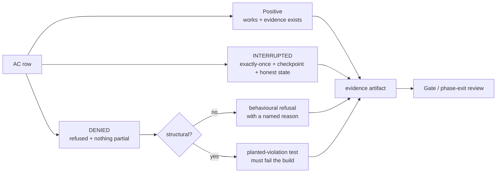
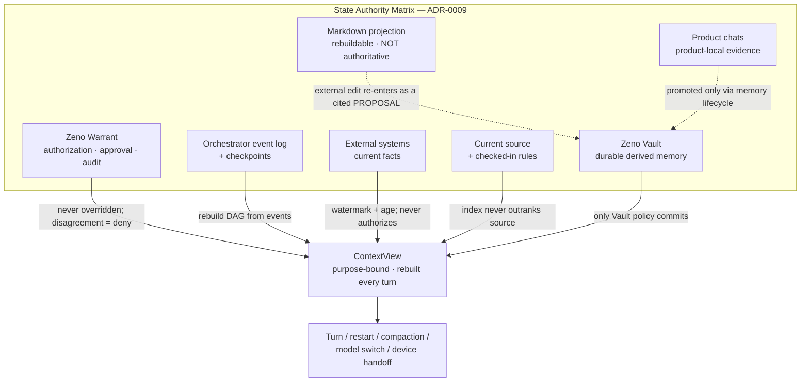
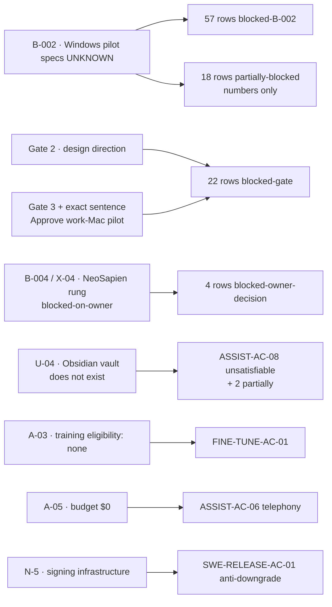

# 17 — Zeno private evaluation suite and executable acceptance-test plan

**Artifact:** Phase 0B, Gate 1 design deliverable.
**Source requirements:** master prompt §15 (definition of done) and §15.1 (end-to-end acceptance matrix), read at `/Users/abheet.isher/Downloads/personal-ai-suite-claude-code-master-prompt.md`.
**Machine-readable companion:** `ledgers/acceptance-test-plan.csv` — 196 rows, one per acceptance criterion, joining to `ledgers/acceptance-criteria.csv` on `ac_id`.
**Products under test:** Zeno (assistant) · Zeno Forge (coding) · Zeno Counsel (meetings) · Zeno Command (control plane) · Zeno Vault (memory) · Zeno Mesh (paired-device and sync layer) · Zeno Glass (design system).

---

## How to read this document

### Evidence labels

**[V]** verified — a primary artifact was fetched or a file was read, with the citation given.
**[I]** inferred — a reasoned conclusion from verified facts, marked as reasoning.
**[U]** unknown — genuinely undetermined. Never filled in with a plausible guess.
**[N]** normative — a requirement adopted from the master prompt or a Phase-0 register, not an empirical claim.

### What this document is deliberately not allowed to do

1. **It sets no number that blocker B-002 blocks.** Every latency, frame-pacing, thermal, GPU, diarization-accuracy and real-time figure appears as a *target conditional on B-002*, matching `12-architecture-and-adrs.md` §8 and `18-roadmap-and-risk-register.md` §3.3. L5 §8 risk 2 is explicit: Gate 1 must not accept such a commitment while the pilot hardware is unknown **[V]**.
2. **It never re-resolves a disposition in `02-conflict-and-disposition-register.md`.** Where a test would cross one, the register row is cited instead.
3. **It never claims a criterion is satisfiable when it is not.** §9 lists the three that are unsatisfiable as written and says why.
4. **It is not legal, safety or compliance clearance.** SUITE-AC-09 and SAN-AC-13 produce evidence packs; they do not produce a verdict.
5. **It never proposes running anything against `~/Work`.** Every fixture is a copy or synthetic. The work-Mac boundary (A-02) holds until Gate 3 plus the exact sentence *"Approve work-Mac pilot"*.

### The one sentence this whole plan exists to enforce

> §15: *"tests cover denied and interrupted paths, not only success."* **[N]**

Every one of the 196 rows therefore carries three execution columns, not one. A row whose DENIED or INTERRUPTED column is empty is an incomplete row, and the plan has none.

---

## Contents

1. [The test-plan ledger — schema and join](#1-the-test-plan-ledger--schema-and-join)
2. [The three paths, defined precisely](#2-the-three-paths-defined-precisely)
3. [The harness set](#3-the-harness-set)
4. [Statistical discipline for the 30 stochastic criteria](#4-statistical-discipline-for-the-30-stochastic-criteria)
5. [Coverage, at a glance](#5-coverage-at-a-glance)
6. [Cross-cutting test infrastructure](#6-cross-cutting-test-infrastructure)
7. [The Interaction Latency Budget — targets conditional on B-002](#7-the-interaction-latency-budget--targets-conditional-on-b-002)
8. [The Capability and Degradation matrix](#8-the-capability-and-degradation-matrix)
9. [Unsatisfiable criteria — stated honestly](#9-unsatisfiable-criteria--stated-honestly)
10. [What is blocked, and by what](#10-what-is-blocked-and-by-what)
11. [Conflicts the owner must resolve](#11-conflicts-the-owner-must-resolve)
12. [What this plan does not cover](#12-what-this-plan-does-not-cover)

---

## 1. The test-plan ledger — schema and join

`ledgers/acceptance-test-plan.csv` has **196 data rows and 25 columns**. It is a strict left join onto `ledgers/acceptance-criteria.csv` (196 rows) on `ac_id`; the join was verified programmatically as a set equality, not a row count **[V]**.

| Column | Meaning |
|---|---|
| `ac_id` | **Join key.** Identical to the criteria ledger |
| `test_id` | `ATP-001` … `ATP-196`, stable, assigned in criteria-ledger order |
| `group`, `product_module`, `criterion_summary` | Carried through from the criteria ledger so the file stands alone |
| `given` / `when` / `then` | The Gherkin triple. `then` states the observable, never the implementation |
| `target_platforms` | Where the test runs. `none - document artifact` where no host is involved |
| `positive_path` | The capability works and the evidence is produced |
| `denied_path` | The same attempt under a condition that must refuse |
| `interrupted_path` | The attempt cut mid-flight |
| `slo_or_threshold` | The measurable gate. `BLOCKED on B-002` where a number cannot honestly be set |
| `stochastic` | `yes` where the result is a rate, not a boolean |
| `sample_size` | The n, **with the reasoning for that n**, not a round number |
| `confidence_interval` | The interval method and which bound the gate reads |
| `evidence_format` | The artifacts the run must leave behind |
| `owner` | `Build` · `Owner - decision` · `Owner - employer channel` · `Owner + counsel`, per `18-roadmap` §9.1 **[V]** |
| `ac_earliest_phase` | From the criteria ledger — when the AC first becomes *satisfiable* |
| `first_run_phase` | When the **test** first executes. Differs from the above in 19 rows |
| `gate_dependency` | From the criteria ledger |
| `harness` | Which suite owns the row (§3) |
| `blocked_by` | The specific blocker, never a generic "TBD" |
| `testability` | One of ten controlled values (§5) |
| `notes` | The correction, register row or research finding the row depends on |

**Why `first_run_phase` differs from `ac_earliest_phase` in 19 rows.** The criteria ledger records when a criterion is first *satisfiable*. This plan records when its *test* first *runs*. **Sixteen** Phase-0A rows now first run at 0B simply because 0A is complete and the checks are re-runnable today. **Three move later**, and each of those matters:

- `SUITE-AC-13` (0A → 1) — the scope-record lifecycle, expiry and revocation tests need a running policy layer to be denied by;
- `CAP-CATALOG-AC-01` (0A → 1) — populating the Atomic Action Catalogue is blocked on B-002, because §5.2.1 forbids inferring one host's capabilities from another (register row #9 / X-01);
- `MAC-COVERAGE-AC-01` (0A → 6) — gated `WorkMac`, so it cannot run before the exact sentence.

Listing any of the three as a 0A test would have been fiction.

**One carried column is stale, and is left stale deliberately.** `REPO-BOOTSTRAP-AC-01`'s `criterion_summary`, copied verbatim from `acceptance-criteria.csv`, still reads `abheet19/{{family_slug}}` — it was written before the Brand Gate passed. This plan's own authored `given` for that row names the real target, `abheet19/zeno`. The carried column is **not** rewritten here, because a join copy that silently diverges from its source of truth is worse than a visible staleness. **Owner action:** the upstream criteria ledger should be updated to `abheet19/zeno` in a single pass, along with any other pre-Brand placeholder, and this file rebuilt from it.

---

## 2. The three paths, defined precisely

A row is not complete because three cells contain prose. Each column has a fixed meaning, and a test that does not assert the italicised part is not the test.

**Positive.** The capability works *and* the specified evidence artifact exists afterwards. A green assertion with no artifact does not satisfy §15's "recorded evidence".

**DENIED.** The same attempt under a condition that must refuse. The assertion is two-part: the refusal happened, *and nothing partially happened*. Most real failures in a system like this are half-successes, not clean refusals. Where the refusal must hold structurally — the code path must not exist — the row says *structural* and the assertion is a static-analysis or architecture test with a **planted violation** proving the check itself works. A check that has never failed has never been tested.

**INTERRUPTED.** The attempt is cut mid-flight: cancel, `SIGKILL`, network drop, lease expiry, reconnect, lock, sleep. The assertions are exactly-once external effect, checkpoint recovery, and *honest state* — no partial work presented as complete. Interruption is a first-class path in this architecture, not an error path (invariant I-7) **[V]**.

---

## 3. The harness set

Fourteen named suites. Every row names one or two; nothing lands in an unnamed "misc" bucket.

| Harness | Proves | Runs |
|---|---|---|
| `zeno-trace` | Traceability, ledgers, chronology, load receipts, zero-unmapped assertions | Every MR; on demand today |
| `zeno-arch-test` | The seven architecture rules, structural impossibility claims, dependency acyclicity — each with a planted violation | Every MR |
| `zeno-contract` | Protocol and package contracts both directions; MCP `2026-07-28` conformance; schema conformance | Every MR touching an L1 package |
| `zeno-policy-test` | The T0–T4 tier table, approval binding, every denial, the negative "approval cannot be inferred from…" list | Every MR touching policy or approvals |
| `zeno-san-eval` | Sanitizer per-class precision/recall/FPR/FNR, residual leakage, calibration, utility loss | Per sanitizer or policy release |
| `zeno-forensic` | Filesystem, database, vector-neighbour, graph, cache, backup, packet and process inspection; canary scans | Nightly and per boundary MR |
| `zeno-fuzz` | Property and fuzz testing of parsers, argv/quoting, target expressions, injection corpora, causal-sync simulation | Nightly; per MR on the relevant parser |
| `zeno-chaos` | Fault injection, delivery semantics, partitions, clock skew, concurrent-failure journeys | Per wave; full matrix at each phase-exit review |
| `zeno-e2e` | Journeys end to end, cross-surface handoff, resume, standalone product independence | Per wave |
| `zeno-host` | Anything needing the real machine: input, focus, terminals, browsers, files, wake, dictation | Blocked on B-002 |
| `zeno-perf` | The Interaction Latency Budget, frame pacing, voice metrics, soak resource curves | Blocked on B-002 for absolutes; relative gate runs today |
| `zeno-soak` | Long-session memory growth, handle leaks, lease expiry, log rotation | Nightly from Wave B |
| `zeno-a11y` | Keyboard completeness, screen-reader parity including graph surfaces, contrast, zoom, reduced modes | Per surface slice — **not deferrable** |
| `zeno-review` | The seven rows that need named human judgement (originality, semantic video analysis, design comparison) | Per Gate-2 artifact |

**`zeno-review` is not a euphemism for "untested".** Originality, trade-dress similarity and semantic scene meaning are not machine-decidable. The honest design is a named reviewer, a written rationale, and a recorded sign-off — which is exactly what DESIGN-EVIDENCE-AC-01 demands when it says *automated decode alone is not semantic analysis* **[N]**.

---

## 4. Statistical discipline for the 30 stochastic criteria

**30 of 196 rows are stochastic** — their result is a rate, not a boolean **[V]**. Each carries a sample size *with its reasoning* and an interval method. Three rules govern all of them.

**Rule 1 — the gate reads the interval bound, never the point estimate.** VOICE-AC-08 targets FAR < 0.1%. The criterion is met when the *upper* 95% bound is below 0.001, not when the observed rate is. By the rule of three, observing zero false accepts in *n* trials supports only an upper bound of 3/*n*, so 500 trials support 0.6%, not 0.1%. Roughly 3,000–5,000 impostor trials are needed. This is why a "0 false accepts" headline is not evidence.

**Rule 2 — zero events is reported as a bound, never as zero risk.** VOICE-AC-06 specifies 10,000 non-trigger windows. Zero events in 10,000 gives a 95% Wilson upper bound of about 0.00037 per window. That bound is what gets published. NATURAL-COMMAND-AC-01 and FINE-TUNE-AC-01 follow the same rule.

**Rule 3 — the sampling unit is the independent one.** COUNSEL-AC-06 bootstraps over *meetings*, not over questions: questions inside one meeting share a speaker, a room and an acoustic condition and are not independent. VOICE-AC-09 bootstraps over meetings for the same reason. SAN-AC-04 reports Wilson bounds *per injection family*, because a family with 20 items and zero escapes has an upper bound near 0.16 and must not be pooled into a reassuring aggregate.

**Percentiles.** p99 is undefined below 100 samples and unstable well past it; latency rows specify n ≥ 1,000 per condition per path and report a bootstrap 95% CI with ≥ 10,000 resamples, publishing the interval and the sample count beside every number. §11.1's own instruction is *do not hide p95/p99 tails behind averages* **[N]**.

**Per-slice, never pooled.** VOICE-AC-10 requires that a promoted adapter is *not worse in any slice*. That decision is made on per-slice CIs; a pooled comparison lets a regressed slice hide behind an improved one.

---

## 5. Coverage, at a glance

### By testability

| `testability` | Rows | Meaning |
|---|---:|---|
| `automatable-at-phase` | 71 | Fully specified; runs when its phase arrives |
| `blocked-B-002` | 57 | Needs the Windows pilot specification or the machine itself |
| `blocked-gate` | 22 | Needs Gate 2 (design direction) or Gate 3 plus the exact sentence |
| `partially-blocked` | 18 | Correctness half runs now; a number or one sub-path is blocked |
| `automatable-now` | 12 | Runnable today, on this machine, against Phase-0 artifacts |
| `human-judgement` | 7 | Requires a named reviewer; not machine-decidable |
| `blocked-owner-decision` | 4 | Waiting on the NeoSapien degradation rung (ADR-0010 / ADR-0020) |
| `unsatisfiable-as-written` | 3 | Cannot pass as literally worded — §9 |
| `blocked-unprovisioned` | 1 | Needs a resource nobody has bought (ASSIST-AC-06, telephony) |
| `blocked-scope` | 1 | Denied by the scope record's `training eligibility: none` (FINE-TUNE-AC-01) |

**The twelve runnable today**, exactly: `SUITE-AC-01`, `SUITE-AC-10`, `SUITE-AC-14`, `RESEARCH-AC-01`, `RESEARCH-AC-02`, `ARTIFACT-DOC-AC-01`, `BRAND-AC-01`, `VIDEO-AC-01`, `VIDEO-AC-02`, `VIDEO-AC-13`, `VIDEO-AC-14`, `ARTIFACT-FEASIBILITY-AC-01` — the ledger, brand, video-evidence and artifact-discipline rows. They are the **Gate 1 admission set**: if the traceability checker does not exit zero, no other row's result means anything.

`RESEARCH-GITHUB-AC-01` sits beside them and is *not* in the twelve, because it is unsatisfiable as written (§9.3) — its ledger runs, but the criterion it is meant to satisfy cannot close.

### By first-run phase

| Phase | Rows | Character |
|---|---:|---|
| 0B | 37 | Ledgers, brand, video evidence, and the Gate-2 design and originality artifacts |
| 1 | 60 | The deterministic spine, sanitization, memory, capability broker, voice |
| 2 | 30 | Forge MVP, terminal envelope, destructive classification, dev previews |
| 3 | 24 | Work intake, connectors, drafts, approvals, outbox |
| 4 | 9 | Multi-agent, infrastructure, security, release, on-call |
| 5 | 14 | Counsel and the Windows Pilot Gate |
| 6 | 21 | Work-Mac promotion, cross-device, Zeno Mesh, Vault sync |
| 7 | 1 | Commerce commit |

The 0B bucket is the largest not because most work is done there, but because of what it contains: of its 37 rows, **12 are `automatable-now`, 15 are `blocked-gate` or `human-judgement`** (Gate-2 design artifacts and originality reviews, *produced* at 0B but *approved* by a person rather than executed by a runner), 6 are `blocked-B-002`, 2 are partially blocked and 2 are unsatisfiable as written. **20 of the 37 carry a Gate 2 dependency.**

### Owner distribution

164 rows are owned by `Build`. 32 carry a joint owner because they need a decision only the owner can make — a threshold, a gate approval, a hardware freeze, a waiver, or a legal question. **All four roles currently resolve to the same person**, which is itself risk R-24 in the register **[V]**; the roles are named separately so that a decision is never mistaken for an engineering result.

---

## 6. Cross-cutting test infrastructure

These suites exist once and are consumed by many rows. Building them per-AC would produce fourteen incompatible implementations of "inject a fault".

### 6.1 Delivery semantics — duplicate, delayed and out-of-order webhooks

**Consumed by:** ASSIST-AC-05, COMMAND-AC-05, WORK-AC-01, WORK-AC-03, OUTBOX-AC-01, LINK-AC-04, TASK-CANDIDATE-AC-01/02.

One event-replay fixture generator, driven by a seeded schedule, produces every delivery pathology against a recorded provider transcript:

| Pathology | Generated as | Required behaviour |
|---|---|---|
| Exact duplicate | same payload, same delivery ID, twice | Second is suppressed by the idempotency key; no second effect |
| Duplicate with a new delivery ID | same semantic event, new envelope | Suppressed by the **content** dedup key (issue + version), not the envelope |
| Delayed | delivered after a later event | Applied by causal order, not arrival order; a stale-but-newer-arriving event does not overwrite |
| Out of order | events 3, 1, 2 | Final state equals the in-order state; asserted by replaying both orders and comparing |
| Edited source | event, then an edit of its source | Derived drafts and receipts are invalidated (13-threat §4.4) |
| Deleted source | event, then a deletion | Derived artifacts cascade (SAN-AC-09) |
| Replayed after long delay | event redelivered past the dedup window | Rejected on the watermark, not merely on the window |
| Spoofed | forged signature or forged Jira key | Rejected at authentication, never classified |

**The assertion that matters is convergence:** for every permutation of a fixture's event set, the final aggregate state is identical. That is a property test, not an example test, and it lives in `zeno-fuzz`.

**Idempotency is not universal.** 13-threat-model §4.7 step 1 is *skipped entirely* for any provider that does not **document** that a repeated key returns the original object rather than creating a second **[V]**. The fixture set therefore includes a provider that does not support it, and the correct behaviour there is reconciliation by authoritative state query — or owner adjudication — never a replay.

### 6.2 Network partitions

**Consumed by:** SUITE-AC-12, MEMORY-AC-03, CAP-AC-04, LINK-AC-01/02, VAULT-AC-01/02, COMMAND-AC-04.

Three partition shapes, each injected at three points in a task's lifecycle:

1. **Clean partition** — traffic dropped both ways. Tests that the offline side appends proposals only and never overwrites durable memory.
2. **Asymmetric partition** — requests arrive, responses are lost. This is the one that manufactures `outcome_unknown`, and it is where duplicate external effects are actually born.
3. **Slow partition** — high latency, no loss. Tests lease expiry and fencing while both sides still believe they are connected. A stale writer must be rejected **by the executor**, not by convention (ADR-0009) **[V]**.

On heal: gap detection, reconciliation, tombstone replay, and acquisition of **exactly one** executor lease. Asserted by sampling `executor_count` continuously and requiring it never to be 2 and never to be 0 for longer than the declared reconnection window.

### 6.3 Clock skew

**Consumed by:** MEMORY-AC-03, ASSIST-AC-09, PERSONAL-UTILITY-AC-01, NEO-MCP-AC-02, FORGE-AC-03, COMMAND-AC-05.

Four skew shapes: monotonic drift forward, drift backward, a step jump (NTP correction), and a leap-second-shaped repeated second. Plus two calendar hazards that are not skew but behave like it: **a DST boundary** and **a timezone-boundary query** — both explicitly named in NEO-MCP-AC-02 and FORGE-AC-03 **[N]**.

**The design rule the tests enforce:** leases, epochs and ordering use a *monotonic* clock; wall-clock time is display-only and is never an ordering input. A test that passes only because both machines happened to agree on the wall clock has not tested anything.

### 6.4 Provider and API version change

**Consumed by:** SUITE-AC-07, SUITE-AC-08, CAP-AC-01, CAP-AC-04, VIDEO-AC-09, SWE-API-AC-01, COUNSEL-AC-03.

Four change classes, each with a required response:

| Change | Required response |
|---|---|
| Tool or resource **schema change** on an MCP server | Server moves to `schema_changed` and is **disabled pending review** — not auto-accepted |
| **Scope change** on an OAuth connector | Dependent approvals invalidated; scope diff shown; no silent broadening |
| **Endpoint or transport change** | Capability disabled; the fallback ladder engages with a receipt at each rung |
| **Model or weight version bump** | Licence re-read at the new revision before use |

That last row is not hypothetical. **NeMo Sortformer moved v2 `CC-BY-4.0` → v2.1 `license:other`, and pyannote 4.x's default moved MIT → CC-BY-4.0, between point releases [V]** (C-028). The gallery test in VIDEO-AC-09 therefore re-reads on every bump rather than once at adoption.

**The MCP `2026-07-28` conformance suite is a ban list, not a feature list.** `initialize`, protocol sessions, `Mcp-Session-Id`, `ping`, `logging/setLevel`, `notifications/roots/list_changed` and HTTP+SSE are **removed or rejected**; `resources/subscribe` is replaced; `server/discover` is mandatory; Sampling is deprecated and rejected at design time **[V]** (C-026). The suite asserts zero uses statically *and* refuses them at runtime. Per-SDK extension support is **[U]** for all ten SDKs and is recorded as unknown, not assumed.

### 6.5 Corrupted imports

**Consumed by:** SUITE-AC-10, SAN-AC-05, VIDEO-AC-01, MEMORY-AC-04, MAC-AUTOMATION-AC-01, SWE-TEST-AC-01.

Every importer gets the same six-shape corruption set: **truncated**, **byte-flipped**, **schema-drifted** (a field type changed), **version-skewed** (a schema two versions old and two versions ahead), **adversarially nested** (archive within archive past the decode bound), and **partially-authentic** (a valid header over invalid content). Each must produce a *named* rejection and a quarantined artifact — never a partial import silently treated as complete, and never an exception trace shown as a result.

§15 additionally requires importers to preserve **role, order, attachment and tool-result** structure and to distinguish compacted from fuller authorized sessions **[N]**. That is asserted by round-trip comparison against a golden fixture, not by eyeballing the output.

### 6.6 Fuzz and property tests for parsers and policy

**Consumed by:** TERMINAL-AC-02, DESTRUCTIVE-AC-01, SAN-AC-04, SAN-AC-05, MEMORY-AC-03, VOICE-AC-04.

Five property suites. Each states a universally quantified property; a single counterexample is a failure, and the harness reports the **shrunk minimal counterexample** rather than a pass rate.

| Suite | Property |
|---|---|
| **argv / quoting** | For all generated command strings, the envelope's tokenization equals a reference tokenizer's, or the envelope refuses. ≥ 10,000 cases |
| **destructive target expansion** | For all generated target expressions (globs, symlinks, mount points, relative escapes, home and root), the classifier's expansion equals an oracle's. ≥ 5,000 cases |
| **canonicalization** | For all inputs, scan-before ∪ scan-after ⊇ ground-truth spans. Catches the single-pass scanner that passes the naive corpus and fails the encoded one |
| **policy decision** | For all (actor, capability, zone, tier) tuples, the simulator's answer equals production's. Exhaustive over the finite matrix, not sampled |
| **causal sync** | For all event permutations of a fixture set, the converged state is identical. Seeded and replayable |

**Why property rather than example testing here.** The space of shell-quoting behaviours and glob expansions is too large to enumerate by example, and it is precisely where injection lives. An example suite over these parsers tests the author's imagination, not the parser.

### 6.7 Fault injection, crash, soak and long-session

**Fault injection** (`zeno-chaos`) covers eight single classes — offline, connector failure, model failure, device failure, low disk, thermal pressure, crash, network partition — each at three lifecycle points, plus the **three approved concurrent pairs** from ADR-0010: *Jira + NeoSapien unavailable*, *Git provider + CI unavailable*, *Vault/device partition* **[V]**.

**Crash testing** uses `SIGKILL`, never a graceful shutdown, at twelve marked points per journey: pre-plan, mid-plan, pre-approval, post-approval-pre-commit, mid-commit, post-commit, mid-stream, mid-handoff, mid-cascade, mid-migration, mid-index, mid-lease-renewal. Graceful shutdown tests the shutdown handler; `SIGKILL` tests the durability design.

**Soak** (`zeno-soak`, nightly from Wave B) runs ≥ 72 hours and asserts: resident memory growth within an approved bound with a **fitted slope whose CI excludes a positive trend**, file and socket handle counts stable, no lease that outlives its epoch, log rotation working, and no unbounded queue. The absolute memory bound is **[U] blocked on B-002**; the *slope* assertion is hardware-independent and committable today.

**Long-session** is distinct from soak: one continuous task across ≥ 500 turns with ≥ 20 compactions, ≥ 5 model switches and ≥ 3 device handoffs, asserting ContextView field-level equality throughout (MEMORY-AC-01). This is where "the agent forgot what it was doing" becomes a measurable defect rather than a complaint.

### 6.8 Low-disk, thermal and offline modes

| Mode | Injected as | Asserted |
|---|---|---|
| **Low disk** | a filled loopback volume holding the store | Writes fail closed with a named reason; no truncated append; the event log stays replayable; the UI states the condition. **Trigger threshold [U] — B-002** |
| **Thermal** | sustained load until the platform reports pressure | Cinematic 3D and background inference degrade *first*; wake, audio, UI acknowledgement, stop/cancel and approval surfaces are never degraded. **Thresholds [U] — B-002** |
| **Offline** | interface down, verified by packet capture | Local wake, voice, Vault snapshot, repository exploration, editing and local tests continue; external reads become stale with a watermark; **writes stop**; no T2/T3 effect is queued for later execution |

The QoS ordering under thermal pressure is a §11.1 requirement **[N]** and is hardware-independent as an *ordering* claim even though its trigger points are not.

### 6.9 Upgrade, migration, rollback and restore drills

**Consumed by:** COMMAND-AC-07, SWE-RELEASE-AC-01, SUITE-AC-03, MEMORY-AC-03, VAULT-AC-02.

Five drills, each run per release train (`core` / `services` / `runtime` / `clients` / `brokers`):

1. **Expand-contract migration** — expand, dual-write, backfill, verify, contract. Assert the previous two minor consumers still run at every step. Killing the migration at each of the five stages must leave a readable store.
2. **Rolling protocol compatibility** — new provider against previous-2-minor consumers, and new consumer against previous provider. Contract change and consumer change are separate MRs in that order (roadmap §7.1) **[V]**.
3. **Rollback** — flag off; train rollback; **cache purge on model or engine rollback**, because prefix-cache keys include model and harness and a stale hit is a correctness bug (roadmap §7.4) **[V]**. A sanitizer may roll back only to a version with a published evaluation report.
4. **Restore** — the event store is append-only and the Markdown projection is rebuildable, so restore is a **replay**, not a copy. Drill asserts replay from event 0 reproduces the checkpointed state byte-for-byte, and that a restore never resurrects a tombstoned item.
5. **Anti-downgrade** — a signed artifact of a lower version must be refused. Blocked on N-5 (signing infrastructure); recorded rather than silently skipped.

**One drill has no positive path, by design.** A deletion is not rollbackable (roadmap §7.4) **[V]**. The test asserts that no UI offers an undo for one and that no hidden retention window exists — the honest product property, not a repaired one.

### 6.10 State Authority, ContextView and pattern memory

**Consumed by:** MEMORY-AC-01 … MEMORY-AC-04, SUITE-AC-04, SUITE-AC-11, LINK-AC-02, VIDEO-AC-11.

**Three test families:**

**(a) State Authority conflict tests.** For every ordered pair of authority classes, manufacture a disagreement and assert the *specified* winner. Seven classes give 42 ordered pairs; each is a fixture. The critical negative is that **generic last-write-wins never appears** — asserted structurally by proving the merge path contains no unconditional overwrite, and behaviourally by the convergence property in §6.1.

**(b) ContextView reconstruction tests.** After each of restart, compaction, model switch and device handoff, rebuild and compare **field by field** across all fifteen ContextView fields. A summary-level "looks the same" comparison would hide precisely the drift this test exists to catch. Also asserted: handoffs pass *the view and references*, never ambient database access and never unrestricted raw history (ADR-0009) **[V]**.

**(c) Pattern-memory lifecycle tests.** The lifecycle is `quarantined/observed → proposed → reviewed/accepted → active → superseded/expired/revoked → tombstoned`. Positive tests walk every legal transition. The load-bearing tests are the **counterexamples**:

- one accidental action must not become a preference;
- one rejected output must not become a preference;
- one raw meeting transcript must not become a preference;
- a **security-boundary observation must never be learned at all** — "the owner approved this once" must not become "approve this class";
- a correction must offer *this turn / this session / this project / always* and default to the narrowest;
- a temporary or private session must read no durable memory and contribute none (SUITE-AC-11), verified by store inspection, not by configuration.

A positive-only lifecycle suite passes trivially. The counterexample corpus is the test.

---

## 7. The Interaction Latency Budget — targets conditional on B-002

> **[U] The Windows pilot machine's specifications are UNKNOWN (B-002 / U-01)** — edition and build, CPU, GPU, RAM, storage, displays and refresh rates, audio devices, WSL2/Docker/Hyper-V availability, admin status, security software, and platform-authenticator presence. The machine is confirmed to exist and to be the owner's personal machine **[V]**; every specification is **[U]** **[V]** (`18-roadmap` §2.1 E1-3).

**Nothing in this section is a commitment.** L5 §8 risk 2 requires that Gate 1 accept no latency budget while the hardware is unknown **[V]**. The table below reproduces the master prompt's *initial prototype targets* verbatim in intent, labelled as targets, because §11.1 says they may be revised **only through measured Gate 1 evidence and owner approval** **[N]**.

| Interaction path | Initial target (**not a commitment**) | Instrumentation point |
|---|---:|---|
| Pointer / keyboard / command acknowledgement | p95 ≤ 100 ms | input event → first painted frame |
| Wake / PTT / hotkey → visible or haptic listening ack | p95 ≤ 150 ms | trigger → indicator paint |
| Speech → stable-enough partial transcript update | p95 ≤ 400 ms | new words → partial render |
| Speech end → finalized endpoint / visible working state | p95 ≤ 450 ms / ≤ 150 ms after endpoint | VAD endpoint → state change |
| Resolved correction → preview / committed edit | p95 ≤ 150 ms / ≤ 500 ms | resolution → paint / apply |
| Barge-in or stop → TTS silence / visible cancel ack | p95 ≤ 150 ms / ≤ 100 ms | detect → audio stop / paint |
| Prewarmed local endpoint → first useful streamed text / audio | p95 ≤ 800 ms / ≤ 1.2 s | endpoint → first token / first audio |
| Other-speaker question → first Counsel suggestion / cited answer | p95 ≤ 1.5 s / ≤ 3.0 s | question endpoint → render |
| Resolved warm app/tab target → verified focus | p95 ≤ 500 ms, excluding third-party cold launch | resolution → verified postcondition |
| Backend event → Observable Execution Stream update | p95 ≤ 250 ms local / ≤ 750 ms paired device | event emit → client paint |
| Warm HUD or palette / cold primary shell first-interactive | p95 ≤ 300 ms / ≤ 1.5 s | invoke → interactive |
| Authorized post-unlock → first privacy-safe frame / briefing shell | p95 ≤ 250 ms / ≤ 500 ms | unlock → paint |
| Indexed authorized local search first results | p95 ≤ 150 ms | keystroke → first result |

### What *is* committable today

Three things, all hardware-independent:

1. **The relative regression gate.** On the same machine, same corpus, same network profile, no release may regress p50, p95 or p99 by more than **10%** against the previous release. This is the gate already adopted for the sanitizer (`14-context-sanitization-gateway` §12.5) **[V]** and it generalises.
2. **The investigation boundary.** Every primary UI-thread stall above **100 ms** is investigated. Apple's over-250 ms shipping-app hang metric is an investigation boundary, not permission for routine 249 ms stalls **[N]**.
3. **The instrumentation contract.** Monotonic correlated timestamps across microphone → VAD/wake → ASR → intent/grounding → retrieval → model/router → tool → verification → TTS, with cold/warm/offline/degraded/low-power slices, error budgets, and queueing, first-token, cancellation-propagation and action-stream-freshness measured separately. Percentiles are published with their sample count and CI. Averages are never published alone.

### The honesty constraints that outrank every number

- **Register row #7:** "zero latency" is never claimed or marketed. The commitment is *no unexplained waiting* **[V]**.
- **No fake completion.** Acknowledgement uses the truthful vocabulary *heard / received / resolving / checking / waiting / blocked / complete*, reconciled against audit events (PRESENCE-CONTROL-AC-01).
- **Optimistic UI is bounded to reversible presentation.** It may never claim a message posted, a pipeline passed, a payment completed, a file changed, a permission granted or a service healthy **[N]**.
- **Two baselines, never merged.** Windows pilot first, Apple Silicon independently. Carrying a number across platforms fails MAC-NATIVE-AC-01 structurally.

---

## 8. The Capability and Degradation matrix

Every capability registers one row and exactly one of **fourteen** canonical health states:

`not_configured` · `discovering` · `healthy` · `degraded` · `stale` · `rate_limited` · `reauth_required` · `permission_denied` · `schema_changed` · `offline` · `unsupported` · `revoked` · `failed` · `recovering`

**`healthy` is not authorization** (invariant I-3) **[V]**. The strongest test of that is not behavioural: CAP-AC-01 requires a **static-analysis assertion that no authorization decision reads the health field at all**. A policy that merely *chooses* not to consult health can regress; one that structurally cannot has no regression to make.

Results are `complete-current` / `complete-with-approved-fallback` / `partial` / `blocked` / `unknown`.

### The dependency and fallback matrix under test

| Dependency | Class | Ladder under test | Truthful failure state |
|---|---|---|---|
| **Jira** (WEBEXT only) | required for work intake | webhook → least-scoped polling → export/permalink with version and time → local draft marked `Jira unverified` | `blocked`; no assignment claim, no external create/update |
| **NeoSapien** | **[U] see §9 and §11** | *(top two rungs do not exist)* → proposed `vendor-provisioned-undocumented` rung → official export/file drop → per-task waiver/block | `unknown`; never presented as an official result |
| **Slack** | optional | Events/API → bounded polling → export/permalink | Local cited summary only; posting disabled |
| **Git provider** | substitutable for facts | webhook/API/MCP → local git for repository facts only → MR/CI export | Local work continues; push, comment, MR, rerun, merge, deploy disabled |
| **Figma** | optional | MCP/API → owner-supplied `.fig`/PDF/SVG/PNG/tokens with hash and version | `stale` snapshot, never live; a required design gate blocks |
| **CI** | substitutable | provider API → the repository's documented local equivalent at the same HEAD | Labelled `local preflight`, **never** `CI passed` |
| **Email / calendar** | optional | provider API → audited native adapter → EML/ICS export | Search, summary and draft only; send and invite disabled |
| **MCP server** | required per tool | reviewed healthy server → built-in adapter or official API/export → block | Any tool, schema, endpoint or scope change **disables** it pending review |
| **Cloud model** | substitutable | authorized local model → smaller local / deterministic / retrieval / manual → queue-defer | Capability mismatch **blocks the step**; switching to cloud needs explicit provider, egress and cost authorization |
| **Auth** | required | user-driven official reauthentication **only** | Never request a password or token; never swap accounts automatically |
| **Internet** | optional for local work | *(offline mode, §6.8)* | Reads become `stale` with a watermark; writes stop |
| **Device** | required for execution | hand off only to a paired compatible device after negotiation and fencing | Exactly one executor; T2/T3 never silently migrates |
| **Storage / index / graph / observability** | optional acceleration | local SQLite/FTS/exact/LSP/git and local diagnostics as the minimum path | Missing acceleration or telemetry **never** blocks core local operation and never causes a cloud upload |

**The single most valuable fixture pair in this whole plan** is CAP-AC-02's: a source that returns HTTP 200 with an empty body, versus a source that is genuinely empty. Reporting the first as `complete-current` is the archetypal silent failure of an agent system, and it is invisible to every positive-path test.

**T2/T3 writes have no silent fallback and are never queued for delayed execution while offline.** After reconnect, state is re-read, the preview is rebuilt, and a **fresh** approval is required. Only idempotent reads and explicitly approved reversible local T1 work may auto-resume **[N]**.

---

## 9. Unsatisfiable criteria — stated honestly

Three of the 196 cannot pass as literally worded. Each is marked `unsatisfiable-as-written` in the CSV with the reason in `notes`.

### 9.1 `ASSIST-AC-08` — the Obsidian Vault does not exist

The criterion requires reports to land *"in the authorized Obsidian Vault"* with evidence including *"Obsidian graph traversal"*.

**Fact [V]:** Obsidian is **not installed on the owner machine**. No `.obsidian` directory exists anywhere under the home directory at depth 5–6, `Obsidian.app` is not present, and there is no application-support directory (X-03). U-04 — whether a vault exists on another device — is open.

**Consequence.** Any Obsidian-graph evidence produced today would be fabricated. `SAN-AC-07` and `MEMORY-AC-04` are partially affected for the same reason.

**Proposed substitution, requiring owner ratification:** reports land in the **Zeno Vault Markdown root**, which is Obsidian-openable but not Obsidian-dependent, and the evidence becomes Markdown/frontmatter schema validation plus link-graph validation over that root. **This changes an acceptance criterion**, which is why it is flagged rather than silently applied (ADR-0017 is `blocked-on-owner`; `18-roadmap` P2-S22 carries the same note) **[V]**.

### 9.2 `NEO-MCP-AC-01` — the criterion's own success state is unreachable

The criterion requires Context Bootstrap to find *"an official NeoSapien memory server"* and record vendor identity, transport, scopes, region and licence, with *"look-alikes never official"*.

**Facts [V]:** zero results in the official MCP registry; zero in the claude.ai connector registry; nothing on any `neosapien.ai` property; no GitHub organisation. Every findable "neo" MCP server (`NeoAIResearch/neo-mcp`, `neo4j`, `neo-n3`, `heyneo`) is a confirmed name collision (C-011). **And yet a live, account-bound NeoSapien connector is present in the owner session** with `search_memories`, `get_reminders`, `get_memory_transcript` and `export_memories`.

**Consequence.** The "official" branch cannot be reached. The only truthful outcome is the criterion's *other* branch — an explicit `unavailable / unverified` state. The master prompt's own preference order has **no rung** for "account-provisioned but undocumented" (X-04).

**Proposed rung, requiring owner ratification (ADR-0010 / ADR-0020):**

> `vendor-provisioned-undocumented` — usable **read-only**, under a task-scoped grant, through the gateway only; **never citable as "verified official documented"**; never a silent dependency; any Forge handoff depending on it requires the recorded per-task waiver.

Four further rows (`NEO-MCP-AC-02/03/04`, `FORGE-AC-03`) are `blocked-owner-decision` behind this, and two more (`CAP-AC-04`, `WORK-AC-04`) are partially blocked. **Their fixture halves are testable today**; only the live half waits.

One additional finding, from `14-context-sanitization-gateway` §2.6: **NeoSapien is a *sink* as well as a source**, so egress rules apply in both directions — a read-only grant does not exempt what is sent in the query.

### 9.3 `RESEARCH-GITHUB-AC-01` — fork deduplication is impossible through the documented interface

The criterion requires a `dedup key` and fork state per returned repository, and §12 asks to *"deduplicate forks and mirrors"*.

**Fact [V]:** GitHub code and repository search **excludes forks by default**, so every returned record reports `fork=false` and fork-based clone detection is unavailable through the documented interface (C-014). Register row #10 already records this as a modified requirement.

**Consequence.** The dedup key can be populated only by **URL canonicalization**, which catches redirects and renames but not independent clones. The census also discloses two further caps: query 1 alone matches 62,731 repositories, so page-1 sampling is a cap and not coverage; and the seed list is not a complete map of the space — the census surfaced `openclaw/openclaw` at roughly 387k stars, which the master prompt never names (C-015) **[V]**.

### 9.4 Adjacent — not unsatisfiable, but not achievable as implied

| Row | Issue |
|---|---|
| `ASSIST-AC-06` (phone) | No WebRTC or SIP endpoint is provisioned. Any number is a **paid** dependency and therefore a costed proposal, never an assumption (A-05, budget **$0**) |
| `ASSIST-AC-07` (commerce) | Requires a fresh device biometric per T3. **Platform-authenticator presence is [U]** (N-1); §1.2 forbids assuming Windows Hello exists. If absent, the pilot has no T3 second factor at all (risk R-16) |
| `FINE-TUNE-AC-01` | The scope record sets **`training eligibility: none`** (A-03) **[V]**. Under the record as written this row can only ever be exercised on synthetic corpora |
| `VIDEO-AC-06` (gesture) | Body-diversity evaluation with a single-user test population is not achievable. The limitation must be **stated**, not simulated. Camera presence is also not in the B-002 question list |
| `VOICE-AC-05` (anti-spoof) | **The ASVspoof 5 dataset licence is unverified** (Zenodo returned 403) **[V]**. L5 §2.3: no anti-spoofing evaluation may be *planned* on it until the record is read |
| `VAULT-AC-01/02`, `LINK-AC-*` | Sync and multi-device tests need **at least two devices**. The corpus inventories exactly one machine. This prerequisite is not recorded anywhere and belongs alongside B-002 |

---

## 10. What is blocked, and by what

**B-002 is the dominant blocker: 57 rows outright, plus 9 of the 18 `partially-blocked` rows where only a number is missing — 66 rows, a third of the entire plan.** That matches `18-roadmap` §3.3's finding that B-002 is the single highest-leverage unblock in the plan **[V]**. It is not a design question; every design here is written. It is a *fact* question.

**Two additions to B-002 this exercise surfaced**, neither currently on the question list:

1. **Camera presence and capability** — VIDEO-AC-06 has no runtime without it.
2. **A second device of any kind** — ten rows name a device or display inventory as a blocker: `XDEVICE-PRODUCT-AC-01`, `LINK-AC-01/02/04`, `COMMAND-AC-04`, `REVIEW-COMPANION-AC-01`, `VAULT-AC-01/02/03` and `DESIGN-XPLAT-AC-01`. All require two endpoints; the corpus inventories one machine.

A third, already flagged in C-031 but still unanswered: **is the work Mac Apple Silicon or Intel?** ONNX Runtime dropped macOS x86_64 in 1.24, so on an Intel Mac local speaker identification does not run **at all** **[V]** — which does not merely slow VOICE-AC-02 and VOICE-AC-08, it removes their subject.

---

## 11. Conflicts the owner must resolve

These are the decisions this plan cannot make for itself. Each is already recorded elsewhere; this section states what each one does to *testing*.

| # | Decision | What it unblocks | Where it lives |
|---|---|---|---|
| **D-1** | **Supply B-002** (minimum viable subset: OS edition/build, CPU/GPU/RAM, platform-authenticator presence, microphone presence, camera presence, employer-data confirmation) | 57 blocked rows; every number in §7 | B-002 / U-01; `18-roadmap` R-11 |
| **D-2** | **Ratify or reject the `vendor-provisioned-undocumented` rung** for NeoSapien | NEO-MCP-AC-01…04, FORGE-AC-03, and the NeoSapien half of CAP-AC-04 and WORK-AC-04 | X-04, C-011; ADR-0010, ADR-0020 |
| **D-3** | **Ratify the Obsidian → Zeno Vault Markdown root substitution**, or supply the vault's location | ASSIST-AC-08 (currently unsatisfiable), plus the Obsidian halves of SAN-AC-07 and MEMORY-AC-04 | X-03, U-04; ADR-0017 |
| **D-4** | **Approve the correctness and utility thresholds in SAN-AC-10** (they are hardware-independent and committable now) | The sanitizer release gate — which gates every egress path | `14-gateway` §12.3–12.4 |
| **D-5** | **Confirm whether a second device (and any additional display) exists** for Zeno Mesh, Vault sync and cross-device testing | 10 rows that currently have no second endpoint | New — surfaced by this document |
| **D-6** | **Decide the T3 posture if the pilot has no platform authenticator**: accept a pilot with no T3 capability, or supply hardware that provides one | ASSIST-AC-07 outright; the T3 tier generally | N-1; `18-roadmap` R-16 |
| **D-7** | **Confirm the register-row-#9 split** — brand-neutral schemas pre-gate, population blocked on B-002 — for CAP-CATALOG-AC-01 and MAC-COVERAGE-AC-01 | Whether those two rows are "deferred" or "failed" at Gate 1 | Register row #9; X-01 |
| **D-8** | **Accept or decline the phase-exit reviews PER-1…PER-8** as proposed | Whether §5's phase buckets have a closing gate at all | `18-roadmap` §1.2 D-8 |

**One conflict is new and is raised here for the first time.** `COMMAND-AC-08` requires a policy simulator whose answers match production exactly. That criterion is **only passable if the simulator and the enforcement point share one policy artifact.** If they are two implementations of the same rules, differential testing will find disagreements forever and the criterion can never close. This is an architecture consequence of an acceptance criterion, and it should be settled in ADR-0011 (Cedar vs OPA) rather than discovered in Phase 1.

---

## 12. What this plan does not cover

Stated so that its absence is a decision rather than an oversight.

- **No test schedules a run against `~/Work`.** Fixtures are copies or synthetic. `ASSISTANT_PROMPT.md` tests operate on a copy; the real file at `~/Work/ASSISTANT_PROMPT.md` (322 lines, `# TASK` at lines 250–290, C-004) is never written.
- **No test uses real meeting audio.** Speaker embeddings are Article 9 GDPR special-category data and DPDP personal data; owner and vendor are both India-domiciled (C-032). Every Counsel and voice corpus in this plan is synthetic or owner-only-consented.
- **No test performs a real financial transaction.** ASSIST-AC-07 is sandbox-only, and register row #3 stands: autonomous payment is rejected, not deferred.
- **This plan does not re-run the research lanes.** It consumes their conclusions and cites the corrections that overturned them.
- **It sets no legal verdict.** SUITE-AC-09's four-column licence record and SAN-AC-13's evidence pack are inputs to counsel, not substitutes for it.
- **It does not estimate effort or duration.** `18-roadmap` §1.4 explains why there are no dates while B-002 is open, and inventing them here would contradict that.

---

## Closing note

The plan's own honest self-assessment: **12 of 196 rows can run today, 71 more are fully specified and waiting only for their phase, and 57 are waiting on a single unanswered hardware question.** The largest risk to this suite is not that a test fails. It is that a blocked row quietly acquires a plausible number so that a gate can close — which is the exact failure mode L5 §8 risk 2 exists to prevent, and the reason every blocked cell in `acceptance-test-plan.csv` says `BLOCKED` rather than a figure.

*Nothing in this document is legal clearance. Read-only throughout: nothing was installed, executed against a live provider, purchased or registered. No repository was created and `~/Work` was not modified.*
