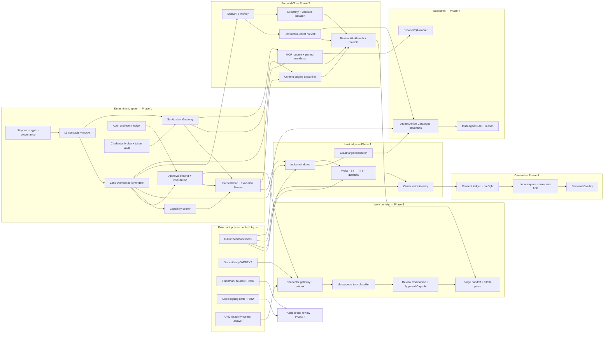
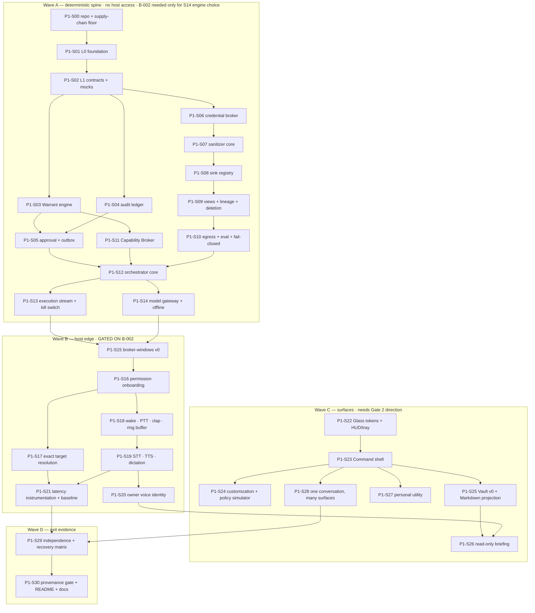
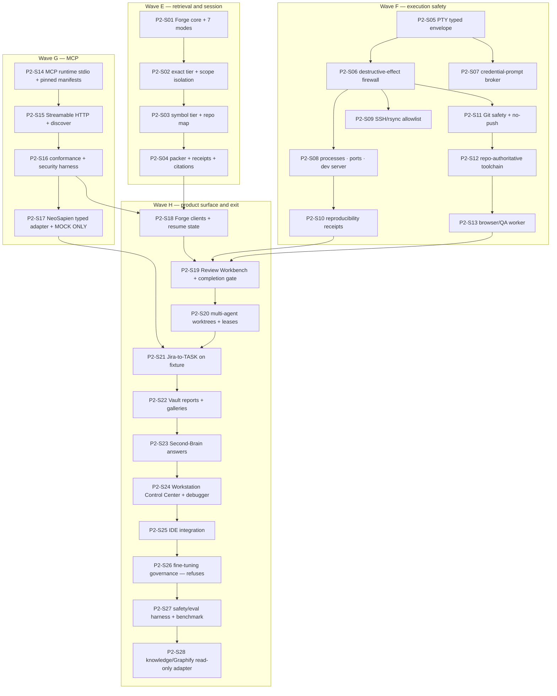

# 18 — Zeno Roadmap, Dependency Graph, Vertical Slices and Risk Register

**Phase 0B Gate 1 artifact.** Sources: master prompt §14 (Phase plan and stop gates, phases 1–8), §15 (definition of done for every vertical slice), §16.2 items 9, 15 and 16.

**Depends on and does not repeat:** `10-PRD-suite-and-products.md` (suite and product PRDs, productization boundary), `12-architecture-and-adrs.md` (component architecture, trust boundaries, ADR queue, withheld numeric commitments), `14-context-sanitization-gateway.md` (§9.1 gateway design), `02-conflict-and-disposition-register.md`, `03-corrections-log.md`, `04-assumptions-contradictions-unknowns.md`, `research/L5-skeptic-review.md`, `ledgers/acceptance-criteria.csv`.

---

## How to read this document

### Evidence labels

Every claim carries one of: **[V]** verified against a primary artifact with a citation in the corpus · **[I]** inferred, reasoning shown · **[U]** unknown, deliberately not filled in. A sequencing decision that follows from an [U] is written as *conditional*, never as a commitment.

### What this document is not allowed to do

- It **creates nothing**. No repository, no package name, no bundle ID, no branch, no dependency, no installation, no purchase, no service connection. The `abheet19/zeno` repository named in slice **P1-S00** is a *planned* action gated on Gate 1, not an executed one.
- It **does not set a number that B-002 blocks.** Every latency, GPU, thermal, frame-pacing, diarization-accuracy and real-time commitment appears as a *target conditional on B-002*, matching `12-architecture-and-adrs.md` §8. L5 risk #2 is explicit that Gate 1 must not accept such a commitment while the pilot hardware is unknown.
- It **does not re-resolve a conflict** already dispositioned in `02-conflict-and-disposition-register.md` or raised in `10-PRD` §11 / `12-architecture` §10. Where a roadmap decision depends on one, the dependency is named and the phase is marked blocked.
- It **does not authorize a work-Mac pilot.** Nothing in this document, and neither gate checklist at the end, is the sentence *"Approve work-Mac pilot"*.

### Three vocabularies used throughout

| Term | Meaning here | Never means |
|---|---|---|
| **Phase** | A band of master-prompt §14 work closed by a named gate | A time box. No calendar dates appear in this document — see §1.4 |
| **Slice** | One vertical, demonstrable, independently reviewable merge request satisfying §15's definition of done | A layer, a package, or a sprint |
| **Gate** | A stop point where work halts until the owner says something explicit | A status meeting or a checklist the build agent can self-certify |

---

## 1. The roadmap in one page

### 1.1 The phase table

| Phase | What it delivers | Closed by | ACs first satisfiable here | Hard prerequisites |
|---|---|---|---|---|
| **0A** | Research, ledgers, corrections, Brand Gate | Brand Gate — **PASSED** (ZENO, 2026-08-24) | 19 | — |
| **0B** | PRDs, architecture, ADR queue, sanitization design, design packet, this roadmap | **Gate 1** + **Gate 2**, requested separately | 21 | Brand selection |
| **1** | Secure Windows pilot foundation and read-only assistant | PER-1 *(proposed)* | **58** | Gate 1, Gate 2, **B-002 answered** |
| **2** | Zeno Forge MVP on a fixture repository | PER-2 *(proposed)* | **30** | PER-1 |
| **3** | Scoped work context and event drafts — draft-only | PER-3 *(proposed)* + scope-record delta review *(prompt-named)* | 24 | PER-2, Jira authority live, scope record valid |
| **4** | Safe Windows OS/browser execution and multi-agent work | PER-4 *(proposed)* + per-entry conformance *(prompt-named)* | 9 | PER-3 |
| **5** | Zeno Counsel on Windows, synthetic/consented meetings only | **Gate 3 — Windows Pilot Gate** *(prompt-named)* | 14 | PER-4 |
| **—** | **Gate 3** produces the signed pilot report, defect/risk list, Windows→macOS delta matrix, Mac rollout/rollback plan, exact first-Mac-slice permissions | Owner says **“Approve work-Mac pilot”** *(prompt-named, exact sentence)* | *(WIN-FIRST-AC-01/02 — already counted inside Phase 5)* | Phase 5 complete |
| **6** | Approved work-Mac promotion, then cross-device, mobile, home, phone | PER-6 *(proposed)*; the **first Mac slice** needs the exact sentence | 20 | Gate 3 **and** the exact sentence |
| **7** | Prepare-only travel and commerce, then controlled commit | **Separate written approval** before any T3 commit *(prompt-named)* | 1 | PER-6 |
| **8** | Hardening, signed release, ecosystem watch, wake-word testing | Release approval + public-brand review *(gate proposed; contents prompt-named)* | **0 — see R-19** | PER-7 |

**Total: 196 acceptance criteria [V]** — counted from `ledgers/acceptance-criteria.csv` (197 lines including the header). The nine phase rows sum to exactly 196; the Gate 3 row names two criteria already counted inside Phase 5 and is not an additional bucket.

### 1.2 Which gates the master prompt actually names

This matters, because inventing a gate is as bad as skipping one.

**Prompt-named, non-negotiable:** the Clarification Gate (passed), the Brand Gate (passed), **Gate 1**, **Gate 2**, the **per-slice LLD/UI-Artifact/Plan gates** (LLD-GATE-AC-01, FORGE-AC-05), **Gate 3 — Windows Pilot Gate**, the **exact sentence** *"Approve work-Mac pilot"*, the **separate written approval** before T3 commerce commit, and per-action approvals at T2/T3.

**Proposed by this document and requiring owner ratification:** the phase-exit reviews **PER-1 … PER-8**. §14 does not name a gate that closes Phases 1, 2, 3, 4, 6 or 8. Without one, a phase ends when someone decides it has, which is exactly the failure mode §15 exists to prevent. Each PER is defined in §2 by its exit criteria, is cheap (a review packet, not a ceremony), and can be declined by the owner in favour of relying on per-slice LLD gates alone — that is **Gate 1 decision D-8** (§10).

### 1.3 Gate map

```mermaid
flowchart TD
    CG["Clarification Gate<br/>PASSED 2026-08-24"] --> P0A["Phase 0A<br/>research and ledgers"]
    P0A --> BG["Brand Gate<br/>PASSED — ZENO"]
    BG --> P0B["Phase 0B<br/>PRDs, architecture, design, this roadmap"]
    P0B --> G1{"Gate 1<br/>architecture and product"}
    P0B --> G2{"Gate 2<br/>design"}
    G1 --> B002{"B-002 answered<br/>Windows pilot specs"}
    G2 --> B002
    B002 --> P1["Phase 1<br/>Windows foundation, read-only assistant"]
    P1 --> PER1{"PER-1 proposed"}
    PER1 --> P2["Phase 2<br/>Zeno Forge MVP on fixtures"]
    P2 --> PER2{"PER-2 proposed"}
    PER2 --> P3["Phase 3<br/>scoped work context, drafts only"]
    P3 --> PER3{"PER-3 proposed<br/>+ scope-record delta review"}
    PER3 --> P4["Phase 4<br/>Windows OS/browser execution"]
    P4 --> PER4{"PER-4 proposed"}
    PER4 --> P5["Phase 5<br/>Zeno Counsel on Windows"]
    P5 --> G3{"Gate 3<br/>Windows Pilot Gate"}
    G3 --> SENT{{"Owner says exactly:<br/>Approve work-Mac pilot"}}
    SENT --> P6["Phase 6<br/>Mac promotion, then cross-device"]
    G3 -.->|"non-Mac cross-device work only"| P6
    P6 --> PER6{"PER-6 proposed"}
    PER6 --> P7["Phase 7<br/>prepare-only commerce"]
    P7 --> WA{{"Separate written approval<br/>before any T3 commit"}}
    WA --> P8["Phase 8<br/>hardening and release"]
    P8 --> REL{"Release approval<br/>+ public-brand review"}
```

### 1.4 Why there are no dates

Three independent reasons, each sufficient on its own:

1. **B-002 is open.** Phase 1 cannot start, so no downstream date has a start anchor. [V — `00-DECISIONS.md` open blockers]
2. **There is one part-time builder**, whose primary employment is the QuillBot browser-add-on work recorded across the owner's own memory files. Any velocity figure would be an unfalsifiable performance claim, which register row #7 and L5 §7.2 both reject on principle.
3. **The $0 budget** means every paid prerequisite (code signing — N-5; trademark counsel — N-6) is an unscheduled external dependency.

What this document commits to instead is **ordering and preconditions**, which are falsifiable. Any calendar attached to this plan later must be attached by the owner, not derived here.

---

## 2. Phase-by-phase roadmap

Each phase states: **entry criteria** (what must be true before the first slice starts), **exit criteria** (what must be demonstrably true to close it), **the gate that closes it**, **the ACs it makes satisfiable**, and **what it is forbidden to touch**.

### 2.0 Where we are now — Phase 0B

**State:** PRDs, architecture and ADR queue, sanitization gateway and this roadmap are written. The design packet (master-prompt §16.2 item 8, the three interactive directions) is the remaining Gate 2 input and is **not evidenced by this document** — see §11 and R-20.

**Forbidden right now, and until both gates pass:** production code, scaffolding, dependency installation, migrations, repository creation (DESIGN-GATE-AC-01 [V]). Only approved, isolated, disposable, synthetic-data prototypes exist.

---

### 2.1 Phase 1 — secure Windows pilot foundation and read-only assistant

The largest phase by acceptance-criterion count: **58 of 196**. It builds the entire deterministic spine — policy, approvals, audit, sanitization, capability, credential broker, orchestrator, Windows broker — plus a genuinely read-only assistant on top of it.

#### Entry criteria

| # | Criterion | Status today |
|---|---|---|
| E1-1 | **Gate 1 approved** in writing | not started |
| E1-2 | **Gate 2 approved** in writing; one design direction selected | not started |
| E1-3 | **B-002 answered**: Windows edition/build, CPU/GPU/RAM/storage, displays and refresh, microphone and audio devices, Windows Terminal / PowerShell / WSL2 / Docker / Hyper-V availability, admin status, security software, **platform-authenticator presence**, and confirmation it holds no employer data | **partially resolved** — machine exists and is the owner's personal machine [V]; every specification above is still [U] |
| E1-4 | The owner-decision set in §10 is resolved: NEW-11 … NEW-14, N-1 … N-7, X-01, coverage gaps A/B/C, Cedar-vs-OPA | open |
| E1-5 | `abheet19/zeno` repository availability check run **authenticated**, owner and private visibility displayed before creation (REPO-BOOTSTRAP-AC-01) | not started |
| E1-6 | Every `adopt`/`compose` verdict in the ADR queue carries a four-column licence record — code / weights / datasets / **required runtime** — each with a fetched primary URL (L5 risk #1) | partially — the ADR queue carries the convention; several rows still read `unverified` |

**E1-3 is a hard blocker, not a soft one.** §5.2.1 forbids inferring one host's capabilities from another. Without it, the Capability Catalogues cannot be truthfully populated (register row #9 / X-01), the Interaction Latency Budget has no baseline (REALTIME-SLO-AC-01), VOICE-AC-08's frozen hardware set cannot be frozen, and the T3 second-factor question (N-1) cannot be answered.

#### Exit criteria — PER-1

1. All 58 Phase-1 ACs pass, **or** each unmet one has an owner-accepted written deferral naming its new phase. No AC is closed by reinterpretation without an explicit owner ratification (the N-3 precedent).
2. `zeno-arch-test`'s seven rules pass in CI: no cycles, no cross-app store access, no duplicated permission logic, **no raw-to-sink bypass**, versioned contracts tested both ways, mocks-only unit suites, and the **provenance gate** (`12-architecture` §6.2).
3. The three L5 §3 preconditions exist **before** the capabilities they protect, verified by test, not by prose: hash-pinned human-approved MCP tool manifests with deny-by-default egress; the code worker confined to a dedicated worktree with mechanically-enforced no-push; the browser worker on a zero-employer-session profile with a domain allowlist.
4. **Interaction Latency Budget baseline measured** on the actual pilot machine and recorded as the first real numbers in the corpus (REALTIME-SLO-AC-01). Until this exists, every number in `12-architecture` §8 stays withheld.
5. Offline Voice profile acceptance test passes with **no DNS and no socket attempt** (VOICE-AC-11).
6. Independence demo: Assistant, Command and the Forge shell each launch, work, save and recover with the other two stopped (SUITE-AC-02).
7. Kill switch revokes outstanding capabilities in one action, proven under load (SUITE-AC-06).
8. Deletion cascade traverses the Sanitization Lineage DAG and is proven to remove derived content from index, vectors, cache, projection and audit-referenced views (SAN-AC-09).
9. WORK-MAC-GATE-AC-01 holds: the work Mac has received **no binary, no login item, no permission prompt, no pairing, no capture, no privilege test**. This is asserted every phase, not once.

**Gate that closes it:** PER-1 (proposed). Per-slice LLD gates close each slice inside it.

#### Forbidden in Phase 1

External writes of any kind. Real employer repositories beyond the minimum covered by the scope record. Production sync. Broad work-context ingestion (deferred to Phase 3). Any macOS artifact. 3D as substrate — Cinematic 3D ships behind a flag, off by default, after Gate 2 only (VIDEO-AC-08, DESIGN-PERF-AC-01).

---

### 2.2 Phase 2 — Zeno Forge MVP

**30 ACs.** The Forge MVP runs on the Windows pilot machine against **non-sensitive fixture repositories and test accounts only**. Windows host adapter, shell/toolchain paths, packaging and conformance evidence are explicit. The work Mac remains untouched.

#### Entry criteria

| # | Criterion |
|---|---|
| E2-1 | PER-1 closed |
| E2-2 | A **synthetic fixture repository** exists with a real toolchain, real tests, a real failing test, a real lint error and a real dirty-worktree state — built for this purpose, containing zero employer content |
| E2-3 | Synthetic engineering-journey fixtures exist **before** any real work-repository execution (prompt §14 Phase 2, explicit) |
| E2-4 | MCP posture ratified: **stdio + Streamable HTTP only**; Sampling, Roots, Logging, DCR and HTTP+SSE rejected at design time, not at port time (C-026 [V], L5 §7.8/§7.9) |
| E2-5 | ADR-0002 (desktop shell) resolved — currently **needs-spike + blocked-on-B-002**, so this is a real gate on Phase 2's client slices |
| E2-6 | ADR-0005 (context index and graph) and ADR-0006 (Graphify) approved; the graph substrate is **not** a graph database in the MVP, on licence grounds (Neo4j GPLv3, FalkorDB SSPL v1, both [V]) |

#### Exit criteria — PER-2

1. All 30 Phase-2 ACs pass or are deferred with written owner acceptance.
2. **The end-to-end fixture journey runs unattended and is demoable**: Explore → LLD Artifact → Plan → approval → Build in an isolated worktree → tests → browser QA → Review Workbench → minimal diff → receipt. FORGE-AC-05 requires this shape for every slice; Phase 2 must prove the shape works on itself.
3. **MCP conformance and security harness passes**, including malicious tool description, malicious tool output, injection/exfiltration, replay/idempotency, output-limit, schema-change reapproval, auth expiry, restart/reconnect and multi-agent/workspace/data-zone isolation (§15). No credential appears in an imported config, prompt, log, trace, model context or audit receipt.
4. **Destructive-effect firewall** proven to classify by effect, not by tool name — including the broad/linked/mounted/protected-path cases (DESTRUCTIVE-AC-01).
5. **Git existing-work protection** proven: repo, worktree, HEAD, branch, remote and full dirty state recorded before mutation; the owner's standing *never commit or push* rule enforced **mechanically** (credential-less worktree or a pre-push hook), never by prompt instruction.
6. Reproducibility receipts emitted for every terminal/build/test run and verified **secret-free** by the sanitizer's own test suite (REPRO-AC-01, SAN-AC-13).
7. **NeoSapien is exercised only against the mock fixture.** No real account is connected in Phase 2 — prompt §14 Phase 2, explicit.
8. Safety/evaluation harness and benchmark report produced, with confidence intervals for stochastic evaluations (§16.2 item 13).
9. WORK-MAC-GATE-AC-01 re-asserted.

**Gate that closes it:** PER-2 (proposed).

#### Forbidden in Phase 2

Real Jira, real Slack, real GitLab, real Figma, real NeoSapien, real employer repositories. Any external write. Any provider rerun. Any fine-tuned artifact. Any Mac artifact.

---

### 2.3 Phase 3 — scoped work context and event drafts

**24 ACs.** The first phase that touches real employer systems, and it is **draft-only throughout**.

#### Entry criteria

| # | Criterion |
|---|---|
| E3-1 | PER-2 closed |
| E3-2 | **Workspace Context Scope Record validated as unchanged**, or a concise **delta review** run for the actual new source/repository/purpose/provider/region/egress/retention/training use. A delta review is prompt-named, not proposed |
| E3-3 | Jira authority live and least-scoped: `quillbot.atlassian.net`, project **WEBEXT**, board 15, account `abheet.isher@quillbot.com`, accountId `712020:ffe2227d-9292-46ff-81db-6ee44ab6b470`, **WEBEXT-only allowlist**, automatic read-only Intake enabled [V] |
| E3-4 | **U-09 answered** — the owner's own assessment of employer policy on running an assistant against QuillBot systems. Flagged, never assumed away |
| E3-5 | **U-02 escalated or closed** — which vendor received repository content during the removed Graphify "deep mode" window. This outranks the rest of Phase 3 and is an employer-data question that predates the project |
| E3-6 | ADR-0020 resolved: the NeoSapien connector's treatment, including whether the `vendor-provisioned-undocumented` rung is added to the §10.1 ladder (NEW-11) |

#### Exit criteria — PER-3

1. All 24 Phase-3 ACs pass or are deferred with written acceptance.
2. **Zero provider-visible effects occurred without an exact-preview approval.** COMM-DRAFT-AC-01 is the load-bearing one: no inbound event and no agent output ever produces an outward effect directly.
3. Only **verified Jira** creates automatic read-only Intake; every other event class produces a read-only **Task Candidate** with no early mutation (WORK-AC-01, TASK-CANDIDATE-AC-01).
4. Source Requirement Matrix and fallback ladder published per Intake; required-unavailable produces `blocked`, never a silent `no result` (WORK-AC-04, CAP-AC-02).
5. **CI work is diagnosis plus a bounded retry *proposal/dry-run* only.** Phase 3 does not execute a rerun — the prompt is explicit. Actual provider rerun begins in Phase 4 and only after the exact T2 preview and approval path has passed its conformance tests.
6. The **Mac Review Companion remains an approved Artifact/specification only** — no Mac runtime (REVIEW-COMPANION-AC-01 is satisfied on Windows and Command; the Mac surface is design-only).
7. WORK-MAC-GATE-AC-01 re-asserted.

**Gate that closes it:** PER-3 (proposed) plus the prompt-named scope-record delta review, which gates *entry* rather than exit.

---

### 2.4 Phase 4 — safe Windows OS/browser execution and multi-agent work

**9 ACs**, all `SWE-*` plus AGENT-HANDOFF-AC-01 — but the AC count badly understates the work: this is where the Atomic Action Catalogue is promoted from *classified* to *executable*, one entry at a time.

#### Entry criteria

- PER-3 closed.
- The **populated Windows Capability Catalogue** exists — which is only possible after B-002 (register row #9 / X-01).
- Every entry promoted to executable has passed its own conformance test. Promotion is per-entry, never per-category.
- The browser worker's zero-employer-session profile and domain allowlist are in force and tested (never `quillbot.atlassian.net`, GitLab or any authenticated employer surface).

#### Exit criteria — PER-4

1. Every promoted Atomic Action Catalogue entry has conformance evidence; every non-promoted entry reports a truthful `partial`, `takeover`, `roadmap`, `unsupported` or `prohibited` state. **Coverage never means wildcard authority** (CAP-CATALOG-AC-01).
2. UAC, secure desktop, administrator, security and native-confirmation operations remain **takeover-only** — no automation path exists, by construction.
3. Mac Finder / Accessibility / App Intent / Shortcut / Apple Event entries remain **unavailable**, not merely unimplemented. Windows evidence proves nothing about Mac (MAC-NATIVE-AC-01).
4. Multi-agent work uses isolated worktrees, leases, budgets, typed cited handoffs, cancellation, recovery and audit. **No agent has lateral movement and no agent can self-approve or approve another agent's high-risk action** (T4, permanently).
5. Actual provider CI rerun enabled only behind the tested exact T2 preview and approval path.
6. WORK-MAC-GATE-AC-01 re-asserted.

**Gate that closes it:** PER-4 (proposed) plus prompt-named per-entry conformance.

---

### 2.5 Phase 5 — Zeno Counsel

**14 ACs.** Validated **on Windows first**, with synthetic or explicitly consented test meetings.

#### Entry criteria

| # | Criterion |
|---|---|
| E5-1 | PER-4 closed |
| E5-2 | **A written biometric lawful-basis, retention and residency design exists and is approved** — before any enrolment. Speaker embeddings are Art. 9 GDPR special-category data and DPDP personal data; owner and vendor are both India-domiciled (L5 risk #7). This is a precondition, not a mitigation |
| E5-3 | The **cloning path is structurally separated from the meeting-capture store** (ADR-0019). A suite that both identifies and clones voices while recording third parties is deepfake-capable by composition |
| E5-4 | The **participant consent ledger** exists and preflight is mandatory and fail-closed |
| E5-5 | Real-time diarization feasibility measured on the actual pilot machine. Conditional on B-002; if the machine cannot do it, Counsel ships **post-hoc only** and says so |
| E5-6 | N-2 ratified: **dual capture off, NeoSapien optional and never required.** Counsel's own artifact is canonical; NeoSapien evidence is cited supplemental material, always labelled as coming from an undocumented endpoint |
| E5-7 | Weights pinned by revision, mirrored, with an in-product **NOTICE/attribution surface** where CC-BY-4.0 applies (L5 risk #4) |

#### Exit criteria

1. All 14 Phase-5 ACs pass, including VOICE-AC-03 (other voices default to ephemeral meeting-local labels) and VOICE-AC-09 (DER/JER and stabilization latency — numbers set from the Phase-1 baseline, not assumed).
2. **No undetectability claim exists anywhere** in product, docs, marketing or code comments. Register row #1 stands; L5 §7.1 supplies the technical reason as well as the ethical one — the open-source clone's own README concedes invisibility is *best-effort, not guaranteed* [V].
3. Self-capture exclusion **verified per platform**, with a fail-closed platform matrix and visible indicators. An unverified platform is `unsupported`, not "probably fine".
4. Assist-only retain-nothing mode leaves **no** persistent audio, transcript, screenshot, embedding, summary or derived artifact — proven by a filesystem and store diff, not by configuration (COUNSEL-AC-05).
5. Append-only source transcript; human notes byte-preserved and separate; overlay lineage tested (COUNSEL-AC-08).
6. Uncaptured-interval recap **denial** tested — the system refuses to recap what it did not capture (§15).
7. Visible participant-bot capture stays **deferred** (§7.4). Not built, not flagged, not stubbed.

**Gate that closes it:** **Gate 3 — Windows Pilot Gate.**

---

### 2.6 Gate 3 — Windows Pilot Gate

Prompt-named and mandatory before **any** work-Mac runtime use.

**Required contents** (all six, none substitutable):

1. **Signed pilot report** — Windows implementations of Assistant/Command, Forge, Counsel, Vault and Mesh have each completed their approved primary journeys, with §1.2 evidence.
2. **Unresolved-defect and risk list** — the honest one, including everything still open in the register at §9.
3. **Windows→macOS delta matrix** — every capability that must be re-proven natively, with the explicit statement that no Windows grant, test result or conformance evidence transfers (MAC-NATIVE-AC-01).
4. **Mac rollout and rollback plan.**
5. **Exact permissions and data requested for the first Mac slice** — enumerated, least-scoped, individually revocable, each with what it enables, what it does *not* enable, what breaks if denied, and how to revoke.
6. **WIN-FIRST-AC-01 and WIN-FIRST-AC-02 evidence** — one Windows release candidate completing independent validation across voice/dictation, exact app/browser/Explorer/terminal control, MCP fixtures and the rest.

**Then stop and ask the owner to say exactly:** *"Approve work-Mac pilot"*.

A Phase approval, a Gate approval, a passing Windows test, an enthusiastic reply or a request to continue is **not** equivalent to that sentence. [V — prompt §14, §1.2]

---

### 2.7 Phase 6 — approved work-Mac promotion, then cross-device

**20 ACs**, twelve of which carry the `WorkMac` gate dependency.

#### Entry criteria

- Gate 3 passed **and** the exact sentence received. These are two separate events.
- The first Mac slice is **signed, reversible, least-privileged**, with synthetic and read-only tests first, and every native permission requested **visibly and independently**.
- ADR-0017 resolved (Obsidian projection target — currently **blocked-on-owner**, U-04/X-03).
- Mesh pairing design approved; E2EE device-group sync, signed voice/capability negotiation and deterministic single-responder arbitration specified.

#### Sequencing rule inside Phase 6

The phase has two halves and they are **not** interchangeable:

1. **Mac broker/client slice first.** Validate Mac-specific capability, accessibility, capture, focus, privacy, performance, update and uninstall behaviour on its own evidence. Only then enable approved work context and executable actions.
2. **Cross-device second.** Capability-adaptive clients across the approved platform rows; macOS becomes the privileged reference; unsupported local operations transparently delegate to an explicitly selected paired workstation.

**WebRTC calling first. SIP/phone number only after explicit cost/provider approval** — $0 budget is in force, so a phone number is a costed proposal, never an assumption.

#### Exit criteria — PER-6

All 20 ACs pass; cross-device voice passes exactly-one-responder, duplicate suppression, handoff, partition, offline and privacy-routing tests; LINK-AC-03's latency numbers are set from measured LAN/WAN characterization, not assumed.

---

### 2.8 Phase 7 — prepare-only travel and commerce

**1 AC** (ASSIST-AC-07) and the most dangerous phase per unit of code.

**Entry:** PER-6 closed. Register row #3 in force: autonomous payments, purchases and bookings are **rejected**; the safe substitute is autonomous research and preparation plus an immutable prepare/commit protocol.

**The phase runs in two strictly separated stages:**

| Stage | Content | Approval needed |
|---|---|---|
| **7a — prepare only** | Search, compare, cart, reservation preparation with exact previews. Adversarial, duplicate, price-change, fraud, cancellation and privacy tests | Ordinary phase entry |
| **7b — controlled commit** | T3 transaction commit with a fresh platform-authenticator confirmation per transaction | **A separate written approval**, prompt-named. Blocked outright if N-1 resolves to "no platform authenticator" |

**N-1 interacts here directly.** The default in force is the strict one: with no platform authenticator present, **T3 is blocked, not downgraded to T2**. A missing security factor reduces capability, never the requirement. If the pilot machine has no authenticator, Phase 7b cannot run on it at all.

---

### 2.9 Phase 8 — hardening and release

**Zero acceptance criteria [V].** That is coverage gap A, raised in `12-architecture` §10 and carried here as risk **R-19**. Phase 8 currently has no way to fail.

**Contents** (prompt-named): performance, accessibility, reliability, security, privacy, licensing, model, prompt-injection, red-team, backup/restore, crash recovery, update/uninstall and long-session testing; signed and notarized releases; staged rollout; telemetry **opt-in**; operator runbooks; incident response; disaster recovery; public-brand review; an opt-in ecosystem watch that may propose upgrades but **never auto-installs a dependency, changes a model or rewrites product scope**; and phonetic / wake-word false-accept-false-reject / Indian-English / noisy-room / Bluetooth-microphone / accidental-trigger testing for **"Zeno"** and **"Zeno, attend"** before the spoken and public name is finalized.

**Two Phase-8 items are blocked on money, not effort:**

- **Code signing and notarization** (N-5). Amounts are [U] and unverified. $0 budget in force. Until funded, P0 runs unsigned local builds and P1 personal release cannot ship.
- **Trademark counsel** (N-6). The ZENO Class 042 exposure is real and worse than first recorded: three further live/pending US Cl 42 ZENOs beyond the known one, including Quantum Generative Materials' Cl 9 recital ending in the unqualified clause *"downloadable computer software development tools"* [V, C-034]. No public brand review can conclude without a lawyer.

**Required before PER-8 can be defined at all:** raise a `RELEASE-AC-*` family (R-19). A phase with no acceptance criteria is a phase that closes by assertion.

---

## 3. Dependency graph

### 3.1 What actually blocks what

The phase chain in §1.3 is the *coarse* view. The real dependencies are between capabilities, and several cross phase boundaries.

### 3.2 The critical path

**B-002 → broker-windows → exact target resolution → voice → Forge Context Engine → Forge handoff → Atomic Action Catalogue promotion → Counsel capture → Gate 3.**

Everything on that chain is serial. Everything off it can be parallelized, and the slice waves in §5 and §6 are ordered to exploit that.

### 3.3 What B-002 blocks — the precise list

| Blocked item | AC | Why B-002 specifically |
|---|---|---|
| Interaction Latency Budget numbers | REALTIME-SLO-AC-01 | No baseline machine, no p50/p95/p99 |
| Cross-device latency numbers | LINK-AC-03 | Same, plus network characterization |
| Owner-vs-other voice thresholds | VOICE-AC-08 | The "frozen consented target hardware set" cannot be frozen |
| Diarization metrics and feasibility | VOICE-AC-09 | Real-time diarization may not run at all on the pilot |
| Frame-pacing and thermal budgets | VIDEO-AC-10, DESIGN-PERF-AC-01 | GPU unknown; Acrylic-class live blur is GPU-intensive and auto-disabled in Battery Saver [V] |
| Populated Windows Capability Catalogue | CAP-CATALOG-AC-01 | §5.2.1 forbids inferring one host's capabilities from another |
| T3 second factor | N-1, ASSIST-AC-07 | Platform-authenticator presence is [U]; §1.2 forbids assuming Windows Hello |
| Local model engine choice | ADR-0004 | Engine selection is a function of GPU/RAM |
| Desktop shell choice | ADR-0002 | Needs-spike **and** blocked-on-B-002 |
| Voice stack component choice | ADR-0012 | Same |

Nine of these are *numbers*, one is a *catalogue* and three are *technology choices*. None of them is a design question — the designs are written. B-002 is the single highest-leverage unblock in the entire plan.

---

## 4. The vertical-slice contract

### 4.1 What counts as a slice

A slice is **vertical**: it crosses from a user-visible or operator-visible surface down through policy to storage, and it can be demonstrated. A slice is **not** a layer ("build the L1 contracts"), a package, or a sprint.

Two deliberate exceptions are marked **[foundation]** in §5: P1-S01 and P1-S02 have no user surface because contracts and types cannot have one. They are kept small, they ship with their conformance suites and mocks, and they are the only two slices exempt from the demo-path requirement — their demo is the mock-only test run itself.

### 4.2 Size rule for a small reviewable merge request

| Dimension | Target | Hard ceiling | On breach |
|---|---|---|---|
| Production diff | ≤ 400 changed lines | 800 | Split, or record why in the LLD |
| Files touched | ≤ 15 | 30 | Split |
| Packages touched | ≤ 3 | 5 | Almost always a layering smell — check `zeno-arch-test` rule 1 |
| New dependencies | 0 | 1, with a full four-column licence record | A second new dependency is its own slice |
| Contract changes | 0 or 1 L1 package | 1 | Two contract changes in one MR breaks the both-ways compatibility test |
| Review sitting | Reviewable in ≤ 45 minutes | — | Split |

Tests, fixtures, generated schema and documentation are excluded from the diff count. A slice that *deletes* more than it adds is fine and encouraged.

### 4.3 The LLD gate — LLD-GATE-AC-01

> *"Every production slice has an approved cited LLD Artifact and Plan hash before its first code."* [V]

Operationally, for every slice below:

1. **Explore** — read-only. Produces the cited findings, the affected surface list and the open questions.
2. **LLD Artifact** — the `lld-artifact` skill's format: verified facts with labels, TL;DR first, a mermaid flow of the actual mechanism, the ACs it claims, the tests it will add, and its own open questions. Where a slice has a UI surface, a **UI Design Artifact** accompanies it and must trace to the Gate-2-approved direction and tokens.
3. **Plan** — the exact file list, the test list, the rollback, and a **plan hash**.
4. **Owner approval** of the LLD and the Plan hash. Approval of one slice's LLD is never approval of the next.
5. Only then, code. The plan hash is recorded in the slice's receipt; if the plan changed, the receipt shows both hashes and the slice returns to step 4.

FORGE-AC-05 makes this Forge's own required workflow, so Phase 2 both *uses* this gate and *implements* it.

### 4.4 The nine fields every slice carries

**Requirement IDs** (the ACs it advances or satisfies) · **LLD gate** (the artifact required before code) · **Tests** · **Demo path** (what a human watches) · **Security impact** · **Performance impact** · **Cost impact** · **Rollback** · **Documentation updates**.

Plus §15's full definition of done, which applies to every slice without exception and is not restated per slice below.

---

## 5. Phase 1 vertical slices

**31 slices, four waves, 58 acceptance criteria.** Two cross-cutting assertions apply to *every* slice below and are not repeated in each: **LLD-GATE-AC-01** (approved LLD Artifact plus Plan hash before first code) and **WORK-MAC-GATE-AC-01** (the work Mac receives no binary, login item, permission prompt, pairing, capture or privilege test — re-asserted in every slice's receipt, not once per phase).

### 5.0 Wave map

**Parallelism note.** Wave A needs no host, and the only place it touches B-002 is P1-S14's engine-selection row (the gateway *contract* ships regardless) — so it can start the moment Gate 1 passes. Wave B cannot start until B-002 is answered. Wave C cannot start until Gate 2 selects a direction. That is three genuinely independent unblock conditions, and the wave structure exists so that one blocked condition does not idle the other two.

---

### Wave A — the deterministic spine

#### P1-S00 · Repository and supply-chain floor
- **ACs** — REPO-BOOTSTRAP-AC-01 · SUITE-AC-09 (opens)
- **LLD** — LLD-P1-S00: the exact bootstrap sequence, the settings to apply, and the verification order. This is the one slice whose LLD is mostly a checklist.
- **Tests** — a post-create verification script asserts: owner is `abheet19`, visibility is **private**, default branch protected, required reviews on, secret scanning and push protection on where available, dependency alerts on, signed-release policy recorded, and **Pages, packages, Actions artifacts and logs cannot leak public**. The script fails the bootstrap if any assertion fails.
- **Demo** — the authenticated availability check output and the owner/visibility display shown to the owner *before* creation, then the verification script's green run after.
- **Security** — this is the slice that decides whether everything after it is private. A wrong owner or a public default is unrecoverable in the sense that matters: the content was public for some interval.
- **Performance** — none.
- **Cost** — $0. Private repositories are free at this scale [I]; verify at execution time rather than assuming.
- **Rollback** — delete the repository. Trivial only because it is empty; this is why it is slice zero.
- **Docs** — repository conventions, branch policy, the "never commit or push on the owner's behalf" standing rule recorded as a contributor rule and enforced later by P2-S11.

#### P1-S01 · L0 foundation packages **[foundation]**
- **ACs** — SUITE-AC-03 (opens) · SUITE-AC-09 (provenance runtime)
- **LLD** — LLD-P1-S01: the branded-ID scheme, the zone and tier enums, the 14 canonical health states, the hash-chain primitive, and the four-column provenance record schema.
- **Tests** — property tests on branded IDs and content addressing; a golden test per enum so an accidental reordering is caught; `zeno-arch-test` rules **1** (no cycles) and **2** (no storage driver outside `zeno-eventstore`/`zeno-vault`) land here and must fail on a deliberately planted violation.
- **Demo** — mocks-only test run under the no-network, no-filesystem-outside-tmp profile. *(Foundation exception to the demo-path rule — §4.1.)*
- **Security** — `zeno-crypto` is where hash-chain and signature verification live. Getting content addressing wrong silently breaks the audit ledger's tamper evidence.
- **Performance** — negligible; these are types and pure functions.
- **Cost** — $0.
- **Rollback** — revert; nothing depends on it yet.
- **Docs** — the L0 layer contract and the seven `zeno-arch-test` rules as a living document.

#### P1-S02 · L1 contract packages, mocks and both-ways compatibility **[foundation]**
- **ACs** — SUITE-AC-03
- **LLD** — LLD-P1-S02: the eleven L1 contract packages, each with types + JSON Schema + conformance suite + `<pkg>/mock`, plus the semver-and-schema-hash rule.
- **Tests** — the CI job that runs the **previous two minor versions** of each consumer against the new provider and the new consumer against the previous provider; a schema-hash change without a version bump must fail the build. `zeno-arch-test` rule **5**.
- **Demo** — mocks-only test run; the deliberate schema-drift test showing the build going red. *(Foundation exception.)*
- **Security** — contracts are where "no direct raw-to-consumer path" becomes structurally checkable; the sanitizer contract's shape determines whether rule 4 can be enforced at all.
- **Performance** — none.
- **Cost** — $0.
- **Rollback** — revert; contract-only.
- **Docs** — contract catalogue, versioning policy, mock-authoring guide.

#### P1-S03 · Zeno Warrant — the deterministic policy engine
- **ACs** — APPROVAL-BINDING-AC-01 (opens) · PROVIDER-ETHICS-AC-01 (opens)
- **LLD** — LLD-P1-S03. **Blocked on Gate 1 decision D-7 (Cedar vs OPA).** The architecture recommends Cedar at medium confidence contingent on a spike; L5 disagreement #9 records this as *"an undecided decision that must not drift"*. The LLD must state which engine and why, or run the spike first.
- **Tests** — the full T0–T4 tier table as table-driven cases including every T4 denial; `zeno-arch-test` rule **3** greps every other package for tier literals and authorization verbs and fails on a hit; a fuzz/property suite over policy inputs; an explicit test that **a better model grants no broader permission** (invariant I-5).
- **Demo** — a policy REPL showing a decision with its full reasoning for an allowed T1, a preview-required T2, a blocked T3 (no authenticator — N-1's strict default) and a denied T4.
- **Security** — this is the single component that may compute an authorization decision. It is **embeddable** so `broker-windows` re-enforces the same policy in-process rather than trusting the caller.
- **Performance** — every privileged call pays a policy evaluation. Budget it explicitly in the P1-S21 baseline; a slow policy engine becomes a latency tax on everything.
- **Cost** — $0. Both Cedar and OPA are open source; the four-column licence record for whichever is chosen is a slice deliverable, not a footnote.
- **Rollback** — feature-flag the engine behind the policy contract; the previous decision path is a build-time swap. **The flag can never enable a capability the policy layer denies** — flags are not a permission system.
- **Docs** — the tier table as canonical documentation, the invalidation conditions, and the ADR-0011 outcome recorded as decided.

#### P1-S04 · Audit and event ledger
- **ACs** — MEMORY-AC-03 (opens) · SAN-AC-13 (opens)
- **LLD** — LLD-P1-S04: append-only hash-chained store in its own process and its own store, **separate from optional product telemetry**.
- **Tests** — tamper detection on a mutated record; chain continuity across restart and crash; write-ordering under concurrent producers; a test that the ledger process is the **only** one able to write it; a compliance-evidence record shape test (classification, purpose, authority/consent, provider/region, retention).
- **Demo** — mutate one byte of a stored record and show the chain verification failing with the exact record identified.
- **Security** — disabling audit is T4, permanently. The separation from telemetry is what stops "we turned off analytics" from also turning off accountability.
- **Performance** — append path must not block the interactive path; measure the fsync policy against the P1-S21 baseline. Conditional on B-002 storage characteristics.
- **Cost** — $0; disk growth measured and reported per slice thereafter.
- **Rollback** — the ledger is append-only by design, so rollback means *stop writing new record types*, never *delete records*. Schema evolution is expand-contract only.
- **Docs** — audit record catalogue; retention and the fact that audit retention is independent of content retention.

#### P1-S05 · Approval binding, invalidation and the durable outbox
- **ACs** — APPROVAL-BINDING-AC-01 · OUTBOX-AC-01
- **LLD** — LLD-P1-S05: one canonical approval-binding schema; the complete invalidation condition list; the durable action ID; the at-most-one-attempt rule; `Outcome unknown` handling.
- **Tests** — every invalidation condition as a case (target, account, recipients, thread, context, payload, attachments, visibility, schedule, provider schema, side effects, policy, executor); **negative** tests that approval cannot be inferred from a wake phrase, voice identity, notification open, silence, gaze, "looks good" outside the bound flow, a previous approval, repeated behaviour, urgency, model confidence, standing autonomy, an agent vote or a notification action; duplicate/delayed/out-of-order delivery; timeout → `Outcome unknown` → automatic retry frozen; clock skew.
- **Demo** — approve an action, mutate one field of the payload, watch it return to `awaiting review` with the changed field named.
- **Security** — the highest-value target in the suite. An approval that survives a payload change is a confused-deputy vulnerability by construction.
- **Performance** — revalidation on approval must be fast enough not to invite a "skip revalidation" flag. There is no such flag.
- **Cost** — $0.
- **Rollback** — outbox records are durable; rolling back the code must not orphan a pending action. Migration is expand-contract with a reconciliation pass.
- **Docs** — the approval state machine (already drawn in `10-PRD` §2.2) promoted to the implementation reference; provider-accurate receipt language rules — a Slack `ok: true` proves API acceptance only.

#### P1-S06 · Credential broker and the local token vault
- **ACs** — SAN-AC-03
- **LLD** — LLD-P1-S06: OS-keystore backing, two-hop indirection, the just-in-time rehydration rule, and the six places a secret may never be rehydrated into (`14-context-sanitization-gateway` §4).
- **Tests** — a scanning test that asserts no token appears in prompts, model traces, command plans, UI, logs, exported configs or audit receipts; registered-secret matching **without logging the secret value**; keystore-unavailable degradation; revocation propagation.
- **Demo** — issue a placeholder to a model, watch the destination adapter rehydrate at the boundary, then grep every artifact produced by the run for the real value and find nothing.
- **Security** — the difference between "the model never sees secrets" as a claim and as a property.
- **Performance** — one keystore round trip per rehydration; cache nothing.
- **Cost** — $0.
- **Rollback** — placeholders are inert without the broker, so a rollback fails closed rather than leaking.
- **Docs** — placeholder grammar; the T4 boundary (revealing or exporting a secret is denied to everyone, forever).

#### P1-S07 · Sanitizer core — taxonomy, deterministic detectors, ingress and prompt stages
- **ACs** — SAN-AC-01 (opens) · SAN-AC-02 · SAN-AC-04 · SAN-AC-05
- **LLD** — LLD-P1-S07: the classification taxonomy (S/person/E/I/derivatives), deterministic-first ordering, scanning **before and after** bounded canonicalization, and the structural isolation of untrusted source instructions.
- **Tests** — golden corpora per class; the canonicalization-evasion suite (the reason for scanning twice); a prompt-injection suite proving untrusted source instructions **cannot** change policy, sanitization or destination; separate-store and separate-key assertions for Raw/Quarantine vs sanitized views; `zeno-arch-test` rule **4** — no module imports the Raw/Quarantine store except `zeno-sanitizer`, proven by planting a violation.
- **Demo** — feed a document containing a fake credential, an employer-confidential paragraph and an embedded "ignore previous instructions" block; show the model prompt that results and the audit record explaining each transformation.
- **Security** — L5 §3.1 is explicit that containers bound execution, not the MCP attack surface: tool descriptions and tool results are attacker-controlled text entering the model's context. This slice is the control that actually addresses it.
- **Performance** — sanitization sits on the hot path of every model call. Budget it in P1-S21; a slow sanitizer creates pressure to bypass it, and there is no bypass.
- **Cost** — $0 for deterministic tiers. The model-assisted classifier tier has a token cost — measured, reported, and **off by default** until measured.
- **Rollback** — fail-closed: if the sanitizer is rolled back or unavailable, egress stops (SAN-AC-11 lands in P1-S10, but the fail-closed default is set here).
- **Docs** — the taxonomy, the transformation vocabulary, and the E1 asymmetry rule.

#### P1-S08 · The sink registry — all twelve classes
- **ACs** — SAN-AC-01 · SAN-AC-06 · SAN-AC-13
- **LLD** — LLD-P1-S08: one registered sink contract per class — model prompt, tool argument, UI, notification, log/telemetry, memory/Vault/vector/graph, cache/backup, dev preview, export, and the rest of the twelve.
- **Tests** — the architecture test that **no unregistered raw-to-consumer path exists**; the locked-screen / wearable / shared-display notification test proving only the approved generic view is emitted; a support-bundle test proving prompts, model and tool bodies, source, diffs, paths, identities, audio, transcripts, screenshots and clipboard are excluded by default.
- **Demo** — the same source record rendered into four different sinks side by side, with the differences explained by the sink contracts rather than by ad-hoc code.
- **Security** — this is where "notification privacy" stops being a setting and becomes a contract.
- **Performance** — per-sink transformation is cached by view key; measure cache hit rate.
- **Cost** — $0.
- **Rollback** — an unregistered sink cannot receive content, so removing a registration fails closed.
- **Docs** — the sink registry table; the rule that a new consumer requires a new registered contract, never a special case.

#### P1-S09 · Purpose-bound views, the Sanitization Lineage DAG and the deletion cascade
- **ACs** — SAN-AC-07 · SAN-AC-09
- **LLD** — LLD-P1-S09: the exact view key; the lineage DAG's node and edge model; what a deletion cascade must reach.
- **Tests** — source correction, revocation and deletion each traverse the DAG and remove or re-derive **every** dependent artifact: index entries, vectors, graph edges, caches, projections, replicas and paired-device copies; a test that memory, Vault, embeddings and graph contain **only** sink-authorized content; a tombstone test proving a minimal non-content tombstone remains and nothing else.
- **Demo** — write a note derived from three sources, revoke one source, and watch the note re-derive with the revoked content gone and a receipt naming what changed.
- **Security** — without lineage, "delete my data" is a promise nobody can verify. With it, it is a traversal.
- **Performance** — cascade cost grows with derivation depth; cap depth and report it.
- **Cost** — $0 direct; storage for lineage metadata measured.
- **Rollback** — deletions are not rollbackable by design. The rollback here is of the *code*, and the migration must preserve existing lineage edges.
- **Docs** — the deletion cascade's guarantees **and its honest limits**: weight-level deletion is not guaranteeable where any adapter was ever trained, and that is disclosed, not hidden.

#### P1-S10 · Egress rebuild, sanitizer evaluation and fail-closed
- **ACs** — SAN-AC-08 · SAN-AC-10 · SAN-AC-11
- **LLD** — LLD-P1-S10: every model-provider egress, training job, export and external write rebuilt from a destination-bound view; the per-class evaluation metric set; the fail-closed conditions.
- **Tests** — per-class precision / recall / FPR / FNR with a residual-leakage measurement and calibration report, run per sanitizer release and stored as a versioned artifact; gateway failure, stale policy state and unclassified high-risk content each block new model egress and produce a truthful blocked state.
- **Demo** — the release report for the current sanitizer version, then kill the gateway process and show egress stopping rather than degrading.
- **Security** — SAN-AC-11 is the difference between a gateway and a filter. A filter that fails open is worse than none, because it is trusted.
- **Performance** — the evaluation run is offline; the fail-closed check is on the hot path and must be cheap.
- **Cost** — $0 if evaluation runs against local models; a cloud-model evaluation has a token cost and becomes a costed line item.
- **Rollback** — a sanitizer version can only be rolled back to another version that has a published evaluation report. No unevaluated sanitizer ever handles egress.
- **Docs** — the evaluation methodology and the standing statement that these numbers are measured, never asserted.

#### P1-S11 · Capability Broker, health states and the degradation contract
- **ACs** — CAP-AC-01 · CAP-AC-02 · CAP-AC-03
- **LLD** — LLD-P1-S11: one registry row per connector, MCP server, model, device and privileged local adapter; the 14 canonical health states; Capability Snapshot sealing; the standard fallback ladder; the five-value result vocabulary.
- **Tests** — **`healthy` is never authorization** as an explicit negative test; every prohibited transformation (`unavailable`, `processing`, `not authorized`, `stale`, `not searched` → `no result`/`not applicable`) as a failing case; snapshot invalidation on account, scope, schema, endpoint, egress, device, watermark or health change; plan repair proven to move only sideways or down in risk, within the same identity, scope and data zone (invariant I-4).
- **Demo** — degrade a dependency mid-run and watch the workflow report `complete-with-approved-fallback` with per-source age, coverage and omissions — rather than silently returning less.
- **Security** — CAP-AC-03 is the control that stops an automatic repair from quietly broadening OAuth, switching provider or weakening approval.
- **Performance** — health polling must not become a background CPU cost; event-driven where the provider supports it.
- **Cost** — $0. Note that a degraded-path fallback must never *start* paid or cloud processing — that is an explicit I-4 prohibition.
- **Rollback** — registry rows are data; rolling back code leaves rows intact and re-derives snapshots.
- **Docs** — the 14 health states with exactly one meaning each; the fallback ladder; the result vocabulary with **no synonyms permitted**.

#### P1-S12 · Orchestrator core — three processes, task graph, ContextView
- **ACs** — MEMORY-AC-01 · MEMORY-AC-03 · SUITE-AC-11
- **LLD** — LLD-P1-S12: `orchestrator-core` (no network sockets, no model client linked), `model-egress`, `event-store`; the canonical task/session graph; purpose-bound ContextView reconstruction.
- **Tests** — an OS-level assertion that `orchestrator-core` **cannot** open a socket and has no model client linked (process capability, not code convention); statefulness across restart, compaction, model switch and device handoff; causal parents, aggregate versions, idempotency, leases/epochs and fencing tokens under concurrent writers; **temporary/private sessions read no durable memory and contribute none**, with configured audio and transcript behaviour verified.
- **Demo** — kill the orchestrator mid-task, restart, and watch the task resume from governed state with no model-context dependency.
- **Security** — this is how §13's "no privileged model process" becomes an OS fact.
- **Performance** — IPC between the three processes is on the interactive path; measure it in P1-S21.
- **Cost** — $0.
- **Rollback** — the event store is append-only; code rollback replays.
- **Docs** — the State Authority Matrix as implemented; invariant I-2 (stateful experience over a stateless replaceable model).

#### P1-S13 · Observable Execution Stream, interruption and the kill switch
- **ACs** — SUITE-AC-05 · SUITE-AC-06
- **LLD** — LLD-P1-S13: the stream's field set — goal, phase, editable plan, agent/model, target, redacted tool/action, evidence, budget, checkpoint, blocker, next approval — and the interruption verbs.
- **Tests** — a **negative** test asserting the stream never exposes or persists chain-of-thought, private scratchpads, raw prompts or reasoning tokens (register row #5, invariant I-6); ask / steer / edit-plan / pause / resume / cancel / stop-at-next-safe-boundary / take-over available from every supported surface; reconnect-safe replay; the global kill switch revoking outstanding capabilities in one action, tested under load and mid-write.
- **Demo** — start a multi-step task, edit the plan mid-flight from a second surface, then hit the kill switch and show capabilities revoked and the ledger explaining what stopped where.
- **Security** — the kill switch is a T4-protected control: disabling it is denied to everyone, permanently.
- **Performance** — stream fan-out must not backpressure the task. Bounded buffers with visible drop accounting rather than silent loss.
- **Cost** — $0.
- **Rollback** — the stream is derived; rollback loses presentation, not truth.
- **Docs** — the difference between *observable execution* and *exposed reasoning*, written for a reader who will be tempted to conflate them.

#### P1-S14 · Model gateway, local inference and the Offline Voice profile
- **ACs** — PROVIDER-ETHICS-AC-01 · SUITE-AC-12 (opens) · VOICE-AC-11 (opens)
- **LLD** — LLD-P1-S14. **Engine selection blocked on B-002** (ADR-0004 is `blocked-on-B-002`; the gateway *contract* is `proposed`). The LLD ships the contract; the engine row stays [U] until the machine is specified.
- **Tests** — provider-neutrality via the contract's fake; prefix caches keyed by user, model, harness, policy version, data zone, repository/revision/worktree and instruction/skill hashes, with purge-on-change, isolation, revocation, invalidation, retention and **no-cache fallback** tests; **the Offline profile acceptance test asserting no DNS query and no socket attempt occurs**; a hard negative test that no key, account, free tier or endpoint cycling path exists — quota exhaustion surfaces as a visible degraded state.
- **Demo** — run a full local interaction with the network interface disabled, then show the packet capture confirming zero attempts.
- **Security** — secret context cannot cross a provider boundary; provider selection is always visible.
- **Performance** — **the** dominant latency term for most journeys. Its numbers are exactly what B-002 unblocks.
- **Cost** — local inference is $0 in money and non-zero in disk, RAM, energy and thermals — all measured, none assumed. Any cloud provider call is a visible per-call cost with the account named.
- **Rollback** — provider and engine sit behind the contract; a rollback is a configuration change plus a cache purge.
- **Docs** — the model posture: **MCP Sampling is dead** (deprecated, prescribed migration is direct provider integration) so no design may assume free inference on the host's subscription.

---

### Wave B — the host edge · every slice gated on B-002

#### P1-S15 · `broker-windows` v0 — the privilege edge
- **ACs** — SUITE-AC-03 (broker contract) · CAP-AC-01 (device rows)
- **LLD** — LLD-P1-S15: a separate signed process; named-pipe/loopback IPC with **peer identity verification**; per-request capability tokens; the embedded Warrant engine re-enforcing in-process before every privileged call.
- **Tests** — an unauthenticated peer is refused; a forged or expired capability token is refused; a token for capability A cannot invoke capability B; the broker refuses any call the embedded policy denies **even when the caller claims it was already approved**; five-state return values (`local`, `remote-delegated`, `review-only`, `takeover-required`, `unavailable`) each with a reason.
- **Demo** — attempt a privileged call from a process that is not the orchestrator and watch it refused at the IPC boundary with the reason logged.
- **Security** — the single most privileged component on the pilot machine. Everything else is a client of it.
- **Performance** — IPC plus in-process policy on every privileged call; this is the tax P1-S21 must quantify.
- **Cost** — $0 in P0 (unsigned local builds). **Signing is a P1-release cost, unbudgeted — N-5.**
- **Rollback** — the broker is a separate binary on its own release train; roll it back independently, with the broker contract version negotiated at runtime.
- **Docs** — the broker contract as a **capability-availability** contract, never a capability-presence contract.

#### P1-S16 · Least-privilege permission onboarding and permission education
- **ACs** — SUITE-AC-12 · CAP-AC-01
- **LLD** — LLD-P1-S16: per-permission explanation shown **before** the OS prompt — what it enables, what it does **not** enable, what breaks if denied, how to revoke.
- **Tests** — denial is a first-class supported state with a working degraded path, never a nag loop; revocation mid-session degrades correctly; a test that **no permission is requested on any macOS host** (WORK-MAC-GATE-AC-01, asserted at the code path level).
- **Demo** — deny every optional permission and complete a reduced but honest journey.
- **Security** — least privilege is only real if denial works. A product that breaks on denial trains the user to grant everything.
- **Performance** — none.
- **Cost** — $0.
- **Rollback** — permissions are OS state; the app's rollback must not silently retain a grant it no longer explains.
- **Docs** — the permission catalogue with the four explanation fields per entry.

#### P1-S17 · Exact target resolution — open and focus without implicit execution
- **ACs** — ASSIST-AC-03 (partial: open/focus/navigate only) · TERMINAL-AC-01
- **LLD** — LLD-P1-S17: resolution of the exact app, window, browser and **profile**, Windows Terminal / PowerShell / WSL workspace, tab and pane. Ambiguity resolves by asking, never by guessing.
- **Tests** — two windows of the same app; two browser profiles; two terminal profiles; a closed target; a target on another virtual desktop; **an explicit test that opening or focusing never executes anything** — no implicit command run, no implicit navigation to a non-normalized URL.
- **Demo** — "Zeno, open the WEBEXT board in my work profile" opens the right browser profile and stops there, showing the resolved target chain.
- **Security** — the boundary between *navigation* and *execution* is the whole safety story of a read-only assistant.
- **Performance** — target resolution is user-perceived latency; measured in P1-S21.
- **Cost** — $0.
- **Rollback** — capability-flagged per surface; unresolved surfaces report `unavailable` with a reason.
- **Docs** — the resolution ladder and the ambiguity policy.

#### P1-S18 · Wake, push-to-talk, double-clap and the RAM ring buffer
- **ACs** — ASSIST-AC-01 · VOICE-AC-06 · NATURAL-COMMAND-AC-01
- **LLD** — LLD-P1-S18. **Two open dependencies must be resolved in the LLD, not deferred:** (a) a wake model for the exact phrase **"Zeno, attend"** must be produced, and **openWakeWord's pretrained models are CC BY-NC-SA 4.0 [V]** — NC *and* ShareAlike, so the framework is usable only with **self-trained** models; (b) ADR-0012 is `needs-spike + blocked-on-B-002`.
- **Tests** — in wake-only mode, untriggered audio stays **only** in the disclosed RAM ring buffer of at most two seconds and reaches no disk, no log, no telemetry and no model — asserted by a filesystem and network diff, not by configuration; false-accept and false-reject measured on the pilot hardware; compound commands, ellipsis and deictic grouping for the selected address name.
- **Demo** — speak near the machine without the wake phrase for a minute; show that nothing left the ring buffer.
- **Security** — an always-listening component is the single most privacy-sensitive thing in the suite. The two-second bound is a hard limit, disclosed in-product.
- **Performance** — wake latency is a headline number and is **conditional on B-002**.
- **Cost** — $0 in money; **self-training a wake model has a real compute cost and a data-collection burden**, and that is a slice deliverable, not a footnote.
- **Rollback** — push-to-talk is the always-available fallback; wake can be disabled entirely without losing the product.
- **Docs** — the disclosed listening model, in plain language, in-product.

#### P1-S19 · Local STT, TTS and system-wide dictation
- **ACs** — ASSIST-AC-02
- **LLD** — LLD-P1-S19. **Component selection is genuinely open**: `faster-whisper` has no commit since 2025-11-19 and is **downgraded to `spike`** [V]; **Piper is GPL-3.0** [V], which is learn-only for a proprietary distributed app. Each candidate needs the four-column record, and the required-runtime column is the one that has bitten this corpus before.
- **Tests** — streaming partial and final transcription; correction; punctuation; Indian-English adaptation; code-switching; noisy room; Bluetooth microphone; dictation writing into the authorized application with the insertion point, selection and IME state preserved; **an explicit test that dictation never steals focus or assistive-technology commands**.
- **Demo** — dictate a paragraph into a text field, correct a word by voice, and show the audit record of what was written where.
- **Security** — dictation writes into other applications; the target must be resolved and confirmed, not inferred.
- **Performance** — partial-latency and final-latency budgets, **conditional on B-002**.
- **Cost** — $0 in money; model weights consume disk, measured and reported. Weights are **pinned by revision and mirrored**, with the in-product NOTICE surface where CC-BY-4.0 applies.
- **Rollback** — per-engine behind the model contract; a rollback is an engine swap plus a re-measured baseline.
- **Docs** — the four-column licence record for every model actually shipped, with fetched primary URLs.

#### P1-S20 · Owner voice identity — enrollment, adaptation, deletion
- **ACs** — VOICE-AC-01 · VOICE-AC-02 · VOICE-AC-04 · VOICE-AC-05 · VOICE-AC-07 · VOICE-AC-08 · VOICE-AC-10 · VOICE-AC-11 · VOICE-AC-12
- **LLD** — LLD-P1-S20. **Precondition: the written biometric lawful-basis, retention and residency design must exist and be approved before this slice starts** (L5 risk #7). The LLD must also separate, explicitly, the four things VOICE-AC-01 requires kept apart: transcription adaptation, meeting-local diarization, the owner's enrolled identity, and any voice-cloning capability.
- **Tests** — OS-authenticated enrollment ceremony with purpose and retention consent; **voice identity is never sufficient authorization** — uncertain, replayed, synthetic and unknown voices all fail closed; adaptation is **off by default**, versioned, rollbackable, and promotion cannot worsen false-match rate; local-only mode supports enrollment, diarization, verification, adaptation, export and deletion with no network; **forget/withdraw disables matching immediately and deletes local artifacts within a minute**, with paired-device propagation.
- **Demo** — enroll, verify, then withdraw consent and show every artifact gone within the minute and matching disabled instantly.
- **Security** — speaker embeddings are Art. 9 GDPR special-category data and DPDP personal data. Embeddings **never leave the device**; the retention clock and the deletion path are independent of everything else.
- **Performance** — VOICE-AC-08's FAR ≤ 0.1% / FRR ≤ 5% requires a **frozen consented target-hardware set**, which cannot be frozen until B-002. The threshold is designed; the number is unset.
- **Cost** — $0 in money. **If the eventual Mac is Intel, local speaker identification does not run there at all** — ONNX Runtime dropped macOS x86_64 in 1.24 [V]. That is a Phase-6 planning fact recorded now.
- **Rollback** — enrollment is deletable in one action; a code rollback must not resurrect a deleted enrollment.
- **Docs** — the consent record shape; the honest statement that voice is an identity *hint*, never an authorization.

#### P1-S21 · Latency instrumentation and the first real baseline
- **ACs** — REALTIME-SLO-AC-01 · PRESENCE-CONTROL-AC-01
- **LLD** — LLD-P1-S21: monotonic end-to-end traces with cold, warm, offline, degraded and low-power slices, and error budgets. **The instrumentation contract is designed today; the numbers are set by this slice's measurement run.**
- **Tests** — every interface acknowledges immediately with a truthful `heard` / `received` / `resolving` / `checking` state; p50/p95/p99 captured for pointer and key acknowledgement, wake and PTT, partial and final ASR, correction, barge and stop, first useful local text and audio, app focus, HUD cold shell, post-unlock and local search.
- **Demo** — the baseline report itself: the first falsifiable performance numbers this project has ever had.
- **Security** — none directly; latency data must carry no content (a sink contract governs it).
- **Performance** — this *is* the performance slice. Everything before it was designed against [U].
- **Cost** — $0.
- **Rollback** — instrumentation is additive and independently disableable.
- **Docs** — **the Interaction Latency Budget, filled in.** Register row #7 governs the language: *no unexplained waiting* and measured budgets; **"zero latency" is never claimed.**

---

### Wave C — surfaces · gated on the Gate 2 direction

#### P1-S22 · Zeno Glass tokens and the 2D HUD/tray substrate
- **ACs** — COMMAND-AC-10 · DESIGN-PERF-AC-01 (implementation half)
- **LLD** — LLD-P1-S22 plus a **UI Design Artifact** tracing to the Gate-2-approved direction and its tokens.
- **Tests** — settled, hidden, idle and static surfaces **stop continuous rendering**, asserted by a frame-callback counter; focus indicators are a real border or outline, **never a glow** (WCAG 2.4.13 Note 1 excludes shadow and glow effects [V]); an in-app **"solid surfaces" toggle** exists and works, because `prefers-reduced-transparency` is Baseline-limited and Chrome/Edge only; High Contrast, Reduced Motion and 2D variants render correctly.
- **Demo** — the HUD idle for five minutes with a frame counter showing zero renders, then the same surface with Cinematic 3D flag on and off.
- **Security** — none directly. A passive HUD **never steals typing, selection or IME state**.
- **Performance** — **the operational substrate is 2D over an OS-drawn material.** Cinematic 3D is an opt-in, pausable enhancement on a bounded surface, behind a flag, off by default. Frame-pacing numbers conditional on B-002.
- **Cost** — $0. **Apple SF Pro, SF Mono, New York and SF Symbols are rejected outright** — including in mock-ups — and the licence additionally requires registered-Apple-Developer status [V]. Radix Colors: adopt the architecture, **generate the values**.
- **Rollback** — the 3D flag is the rollback; the product is fully usable with it permanently off.
- **Docs** — token catalogue; the standing rule that a graph is a *view* over a first-class linear list with the same operations, never the primary surface.

#### P1-S23 · Zeno Command shell — dashboard, streaming chat, launcher
- **ACs** — COMMAND-AC-01 · COMMAND-AC-02 (shell) · COMMAND-AC-03 · COMMAND-AC-06
- **LLD** — LLD-P1-S23 plus a UI Design Artifact. Command **mounts the same L5 product cores** and forks no state (`zeno-arch-test` rule 1 forbids app-to-app edges).
- **Tests** — streaming text and voice with barge-in; attachments and screen/file context; the launcher finding authorized apps, commands, people, files, chats and code **with zero results for anything outside the authorized scope**; Today/Attention and Task Candidates render as empty-but-truthful shells in Phase 1 (their content arrives in Phase 3).
- **Demo** — one conversation, streamed, interrupted mid-response, resumed.
- **Security** — the launcher is a search surface over governed content; its index obeys the same sink contracts as everything else.
- **Performance** — cold-shell and local-search numbers land in the P1-S21 baseline.
- **Cost** — $0.
- **Rollback** — Command is a client; rolling it back leaves the cores untouched.
- **Docs** — Command is a **control plane, not a fourth brain** — stated where a future contributor will read it.

#### P1-S24 · Customization and the policy/capability simulator
- **ACs** — COMMAND-AC-07 · COMMAND-AC-08
- **LLD** — LLD-P1-S24 plus a UI Design Artifact.
- **Tests** — all supported customization reachable through Command (layout, theme, glass/motion/accessibility settings); the simulator correctly explains whether an agent can read or act through a specific device, connector or capability, **including the denial reason** — verified against the policy engine's own decisions rather than a reimplementation (rule 3 forbids a second decision function).
- **Demo** — ask the simulator "can Forge push to `origin/master` in this worktree?" and get a denial with the exact rule cited.
- **Security** — a simulator that disagrees with the engine is worse than none; the test is that it *cannot* disagree because it calls the engine.
- **Performance** — negligible.
- **Cost** — $0.
- **Rollback** — presentation only.
- **Docs** — the simulator as the canonical way to answer "why was that denied?"

#### P1-S25 · Zeno Vault v0 — governed memory and the Markdown projection
- **ACs** — MEMORY-AC-01 · MEMORY-AC-02
- **LLD** — LLD-P1-S25. **Blocked on ADR-0017 (`blocked-on-owner`).** Obsidian is **not installed on the owner machine** [V] and whether a vault exists elsewhere is U-04. Default in force: **target-agnostic Markdown in an authorized Zeno Vault Markdown root, Obsidian-openable**, which is the N-3 reinterpretation of ASSIST-AC-08 and **requires owner ratification because it changes an acceptance criterion**.
- **Tests** — the full lifecycle `quarantined/observed → proposed → reviewed/accepted → active → superseded/expired/revoked → tombstoned`; only Vault policy commits, though Assistant, Forge and Counsel may propose; the projection is **rebuildable and never authoritative**; deterministic rebuild from governed state.
- **Demo** — propose a memory from a conversation, review it, accept it, then rebuild the entire Markdown projection from scratch and diff it to zero.
- **Security** — memory is a sink; only sink-authorized sanitized content enters it (SAN-AC-07, landed in P1-S09).
- **Performance** — projection rebuild is offline; measure and report.
- **Cost** — **$0. Obsidian Sync is $4–$10/month if ever chosen** [V] and is a costed proposal, never an assumption. Not needed: an Obsidian vault is already plain Markdown, so the migration concern is sync ownership, not extraction.
- **Rollback** — the projection is derived; delete and rebuild.
- **Docs** — the State Authority rule that the Markdown projection is never the source of truth.

#### P1-S26 · Read-only daily briefing and truthful activity awareness
- **ACs** — ASSIST-AC-04 · CAP-AC-02 (applied)
- **LLD** — LLD-P1-S26: allowlisted disclosed sources only; every item shows **which app or event produced it**.
- **Tests** — a source that is unavailable, processing, unauthorized, stale or not searched renders as exactly that — never as "nothing found" (the prohibited transformations, tested end-to-end for the first time here); coverage and as-of time shown per source; **no source outside the allowlist is read**, asserted by a filesystem and network diff.
- **Demo** — a briefing with one source deliberately down, showing `partial` with the omission named.
- **Security** — activity awareness is the most tempting place to quietly widen a scope. The allowlist is enforced, not documented.
- **Performance** — briefing assembly is a batch path; budget separately from interactive.
- **Cost** — $0 in Phase 1 (local and synthetic sources only).
- **Rollback** — per-source flags.
- **Docs** — the disclosed-source list, in-product.

#### P1-S27 · Personal utility — timers, alarms, reminders, calculations
- **ACs** — PERSONAL-UTILITY-AC-01
- **LLD** — LLD-P1-S27: exact-device resolution for every timer, alarm and reminder.
- **Tests** — device targeting is exact and confirmed; deterministic calculations are deterministic (no model in the arithmetic path); survives restart, sleep/wake and clock changes.
- **Demo** — set a timer by voice, restart the machine, watch it still fire on the right device.
- **Security** — trivial surface, real value: it is the first slice where the assistant is *useful* rather than *safe*, which matters for a single-user product that must survive its own build.
- **Performance** — negligible.
- **Cost** — $0.
- **Rollback** — self-contained.
- **Docs** — user-facing help.

#### P1-S28 · One root conversation across every surface
- **ACs** — SUITE-AC-04
- **LLD** — LLD-P1-S28: handoff across HUD, tray, Command chat, launcher and voice **without forking state**.
- **Tests** — start on one surface, continue on another, with the unsent draft, plan, artifacts and review state preserved; a **negative** test that no surface holds private conversation state the others cannot see.
- **Demo** — begin a request by voice, finish it by typing in Command, with the same session ID visible in both.
- **Security** — none directly; the sink contract for each surface still governs what renders where.
- **Performance** — handoff latency measured.
- **Cost** — $0.
- **Rollback** — surfaces degrade to independent sessions with a visible warning, never silently.
- **Docs** — the one-conversation model.

---

### Wave D — exit evidence

#### P1-S29 · Independence, recovery and the degraded-mode matrix
- **ACs** — SUITE-AC-02 · SUITE-AC-12
- **LLD** — LLD-P1-S29: the failure matrix — offline, connector failure, model failure, device failure, low disk, thermal pressure, crash, network partition — and the expected truthful state for each.
- **Tests** — each product launches, works, saves/exports and recovers with the other two stopped, and **stopping one never terminates, corrupts or duplicates another**; every failure-matrix cell produces a truthful state, not an exception; three concurrent-failure chaos journeys (CAP-AC-04's design, runnable here for the first time); crash, soak and long-session runs.
- **Demo** — kill each product in turn during active work and show the other two unaffected.
- **Security** — a crash must not leave a capability token, a lease or a permission grant outstanding.
- **Performance** — recovery-time targets set from the P1-S21 baseline.
- **Cost** — $0.
- **Rollback** — n/a; this slice adds tests and fixes, not capability.
- **Docs** — the degraded-mode matrix as the operator runbook's first page.

#### P1-S30 · Provenance gate, SBOM, README and documentation set
- **ACs** — SUITE-AC-09 · SUITE-AC-03 (release evidence)
- **LLD** — LLD-P1-S30: `zeno-provenance` wired as a **build-failing** gate, plus the README's required contents.
- **Tests** — the build **fails** when any shipped dependency, model, dataset, font, icon, sound, shader, 3D asset or MCP server lacks a four-column record with a fetched primary URL, or has an `unverified` required-runtime column on an `adopt`/`compose` verdict — proven by planting a violation; SBOM generated per release train; independent build and release evidence per train.
- **Demo** — add a dependency with no licence record and watch CI go red with the missing column named.
- **Security** — supply chain. L5 risk #1 is the corpus's single biggest hole; this is the control that closes it structurally rather than by review.
- **Performance** — CI time only.
- **Cost** — $0.
- **Rollback** — the gate can be *tightened*, never loosened, without an owner decision.
- **Docs** — README with an original logo/wordmark placeholder, verified feature/status table, architecture and security overview, local-first quick start, roadmap, contributing/security/licence notices, **no unverified claims and no copied competitor imagery**. Screenshots only after the approved design exists.

---

## 6. Phase 2 vertical slices — Zeno Forge MVP

**28 slices, four waves, 30 acceptance criteria.** Everything runs against a **synthetic fixture repository and test accounts only**. The same two cross-cutting assertions apply to every slice (LLD gate before code; work Mac untouched), and FORGE-AC-05 additionally makes the LLD gate *Forge's own required workflow* — so Phase 2 both uses this gate and implements it.

### 6.0 What "Forge MVP" means, stated narrowly

**In:** one fixture repository · Ask / Explore / Plan / Build / Review / Debug / QA modes · exact-first retrieval with provenance · supervised PTY with a typed envelope · destructive-effect firewall · Git existing-work protection with mechanically-enforced no-push · MCP host over stdio and Streamable HTTP with pinned manifests · reproducibility receipts · Review Workbench · desktop workspace, terminal/TUI and headless SDK clients.

**Out, and moved to a named later phase or cut entirely:** see §8. The Phase-2 scope in master prompt §14 is materially larger than this; §8.3 lists each item moved and where it went.

### 6.1 Wave map

---

### Wave E — retrieval and session

#### P2-S01 · Forge core, the seven modes and the task-context receipt
- **ACs** — FORGE-AC-01 (opens) · FORGE-AC-07 (opens)
- **LLD** — LLD-P2-S01: the mode state machine (Ask / Explore / Plan / Build / Review / Debug / QA) and the receipt that a task **cannot leave Context state without**.
- **Tests** — a task refused entry to Build when its receipt does not identify repo, worktree, branch, revision and data zone; **Ask and Explore are read-only by construction**, proven by a filesystem-write assertion, not a convention.
- **Demo** — attempt to enter Build with an incomplete receipt and watch it blocked with the missing field named.
- **Security** — mode is a policy input, not a UI label. Read-only modes must be unable to write, not merely instructed not to.
- **Performance** — mode transitions are cheap; the receipt assembly is not — measure it.
- **Cost** — $0.
- **Rollback** — modes behind a flag; the fallback is Ask-only, which is safe.
- **Docs** — the seven modes with exactly one meaning each.

#### P2-S02 · Context Engine exact tier and scope isolation
- **ACs** — FORGE-AC-01 · FORGE-AC-02
- **LLD** — LLD-P2-S02: ripgrep-class exact search first (Zoekt only at a scale the fixture does not reach), with the index isolating repository, branch, worktree, revision and data zone.
- **Tests** — **no index answers across scopes without an explicit cited cross-scope grant**, proven by planting content in a sibling worktree and asserting it is unreachable; provenance recorded per hit; a negative test that vectors are absent from this tier entirely.
- **Demo** — the same query in two worktrees returning two different, correctly-scoped answer sets.
- **Security** — cross-scope leakage is the quiet failure mode of every code-intelligence system. The isolation test is the control.
- **Performance** — exact search is the latency floor for retrieval; budget it separately from model time.
- **Cost** — $0.
- **Rollback** — index rebuild is deterministic.
- **Docs** — the retrieval ladder, exact-first, with **vectors as a complement and never primary truth**.

#### P2-S03 · Symbol tier and the graph-ranked repo map
- **ACs** — FORGE-AC-02
- **LLD** — LLD-P2-S03: LSP / SCIP / tree-sitter / git symbol graph, then the graph-ranked repo map.
- **Tests** — symbol resolution correctness on the fixture's known symbols; stale-index detection after an edit; graceful degradation to exact search when a language server is unavailable, reported as `partial` rather than as fewer results.
- **Demo** — resolve a symbol, then break the language server and watch the answer degrade **visibly**.
- **Security** — an LSP is a program that runs on your source. It runs inside the worker sandbox, not on the host.
- **Performance** — symbol indexing is the heaviest background cost in Forge; measure CPU, RAM and disk.
- **Cost** — $0.
- **Rollback** — tier-flagged; exact search stands alone.
- **Docs** — which tier answered, always visible in the receipt.

#### P2-S04 · Context packer, budgets, receipts and citations
- **ACs** — FORGE-AC-02 · MEMORY-AC-04 (opens)
- **LLD** — LLD-P2-S04: rerank, dedupe, freshness, budget; the context manifest; the citation format.
- **Tests** — every packed item traceable to a source with an as-of time; budget overflow drops the *lowest-ranked* item and says so; a **negative** test that no unsanitized content can be packed (the sink contract is enforced at pack time, not at send time).
- **Demo** — a context pack rendered as a human-readable manifest: what went in, what was dropped, why, and from when.
- **Security** — the packer is a sink. This is where SAN-AC-01's registry meets Forge.
- **Performance** — packing is on the interactive path.
- **Cost** — token budget per pack is measured and shown; this is the main lever on model cost.
- **Rollback** — packer versions are recorded in the receipt; a rollback changes future packs only.
- **Docs** — the context manifest schema.

---

### Wave F — execution safety

#### P2-S05 · Shell/PTY worker and the immutable typed envelope
- **ACs** — TERMINAL-AC-02
- **LLD** — LLD-P2-S05: structured argv by default; explicit target, cwd, host and container; a sanitized, reviewed startup environment.
- **Tests** — a command with unclassifiable shell or startup behaviour is **blocked or moved to a disposable approved sandbox**, never run optimistically; terminal output and control sequences are treated as **untrusted input** and cannot alter the envelope; the envelope is immutable after approval — mutating any field invalidates it.
- **Demo** — attempt a command whose environment cannot be classified and watch it refused with the unclassifiable element named.
- **Security** — with the destructive firewall (P2-S06), this is the pair that makes a shell agent survivable.
- **Performance** — envelope construction adds a fixed cost per command; measure it.
- **Cost** — $0.
- **Rollback** — the worker is a separate binary; roll it back independently.
- **Docs** — the envelope schema and the untrusted-output rule.

#### P2-S06 · Destructive-effect firewall
- **ACs** — DESTRUCTIVE-AC-01
- **LLD** — LLD-P2-S06: classification by **effect**, independent of tool name, covering broad, linked, mounted, protected and out-of-scope paths.
- **Tests** — a benign-looking command with a destructive effect is caught (the point of the AC); a symlink escaping the scoped root is caught; a mounted volume is caught; paths are **canonicalized and re-checked at use time**, not only at plan time (TOCTOU); patch preimage hashes verified before apply.
- **Demo** — a table of twenty commands with their classification and the reason, including three that look safe and are not.
- **Security** — the highest-value control in Phase 2.
- **Performance** — path canonicalization at use time costs a syscall per path; accept it.
- **Cost** — $0.
- **Rollback** — the firewall can only be tightened without an owner decision.
- **Docs** — the destructive-effect taxonomy.

#### P2-S07 · Credential-prompt broker for the terminal
- **ACs** — TERMINAL-AC-04
- **LLD** — LLD-P2-S07: passwords, raw tokens, passkeys, biometric prompts, SSH trust decisions and signing prompts are routed to the human and **never enter the agent's context**.
- **Tests** — a command that triggers a credential prompt hands off to the human with the exact prompt shown and the agent blind to the response; scanning tests over transcript, log, receipt and model trace confirm absence.
- **Demo** — run a `sudo`-requiring command and show the agent transcript containing only "credential prompt handled by owner".
- **Security** — one of the two ways an agent accidentally becomes a credential harvester. (The other is P1-S06.)
- **Performance** — human-in-the-loop by definition.
- **Cost** — $0.
- **Rollback** — fails closed: no broker, no privileged command.
- **Docs** — which prompt classes are takeover-only, permanently.

#### P2-S08 · Long-running processes, ports, logs and the local dev server
- **ACs** — TERMINAL-AC-03 · DEV-SERVER-AC-01 · SAN-AC-12
- **LLD** — LLD-P2-S08: stable session ownership for builds, watchers, tests and dev servers; the repo-defined server resolved rather than guessed.
- **Tests** — the dev server runs **unprivileged**, **binds only to loopback**, and its output is **sanitized** before it reaches any sink; port conflicts are reported, never silently reassigned; a killed process is reported as killed, not as finished; log tailing is bounded and never unbounded-buffered.
- **Demo** — start the fixture's dev server, show it on loopback only, and show a deliberately-planted secret in its output redacted at the sink.
- **Security** — a dev server is an unauthenticated HTTP surface on the developer's machine. Loopback-only is not a default; it is a requirement.
- **Performance** — log streaming must not backpressure the process.
- **Cost** — $0.
- **Rollback** — per-capability flags.
- **Docs** — the process/port/log model.

#### P2-S09 · SSH, SCP, SFTP, rsync and tunnel operations
- **ACs** — TERMINAL-AC-05
- **LLD** — LLD-P2-S09: exact allowlisted host, account, paths and **direction** resolved before any transfer.
- **Tests** — a host outside the allowlist is refused; direction reversal (pull vs push) is treated as a different operation requiring its own approval; a wildcard path is refused; the SSH agent is **not** reachable from the worker sandbox.
- **Demo** — attempt an unlisted host and an unintended direction; both refused with reasons.
- **Security** — remote transfer is the shortest path from a sandboxed worker to data exfiltration.
- **Performance** — n/a.
- **Cost** — $0.
- **Rollback** — capability off by default.
- **Docs** — the allowlist format and its review cadence.

#### P2-S10 · Reproducibility receipts
- **ACs** — REPRO-AC-01
- **LLD** — LLD-P2-S10: executor, toolchain, versions, environment digest, inputs, outputs and exit state, **secret-free**.
- **Tests** — the sanitizer's own suite runs over every receipt; two identical runs produce comparable receipts; a receipt is sufficient to re-run the command by hand.
- **Demo** — hand a receipt to a human who reproduces the run from it alone.
- **Security** — receipts are exportable evidence, so they are a sink with a contract.
- **Performance** — receipt assembly is post-run.
- **Cost** — $0; storage measured.
- **Rollback** — additive.
- **Docs** — the receipt schema.

#### P2-S11 · Git existing-work protection and mechanically-enforced no-push
- **ACs** — GIT-SAFETY-AC-01
- **LLD** — LLD-P2-S11: record repo, worktree, HEAD, branch, remote and **full dirty state** before any mutation; preserve existing work; operate only in a dedicated worktree.
- **Tests** — uncommitted work survives every Forge operation, including the ones that "shouldn't touch it"; **the standing owner rule "never `git commit` / `git push`" is enforced by a credential-less worktree or a pre-push hook**, and the test proves a push attempt fails even when the agent tries; force-push is denied by default (T4); the concurrent-session hazard is covered — the owner's own memory records several agent sessions driving one checkout at once, so a lease test lands here.
- **Demo** — dirty the worktree, run a full Build slice, and show the dirty state byte-identical afterwards; then have the agent attempt a push and show it fail at the credential layer.
- **Security** — this is where an agent most plausibly destroys a human's work.
- **Performance** — a full dirty-state snapshot on a large repo is not free; measure and bound it.
- **Cost** — $0.
- **Rollback** — protection can only be tightened.
- **Docs** — the Git safety contract, including the explicit statement that no prompt instruction is trusted to enforce it.

#### P2-S12 · Repo-authoritative toolchain, build and test derivation
- **ACs** — SWE-TEST-AC-01
- **LLD** — LLD-P2-S12: runtimes, package manager, lockfile, build and test commands derived **from the repository**, never guessed or remembered.
- **Tests** — a repo with an unusual runner is handled; a missing lockfile is reported as `partial`, not silently defaulted; a version-manager mismatch is surfaced.
- **Demo** — point Forge at the fixture and watch it state the derived toolchain with the file each fact came from.
- **Security** — running the wrong build tool is a supply-chain event.
- **Performance** — derivation is cached per revision.
- **Cost** — $0.
- **Rollback** — falls back to asking.
- **Docs** — the derivation precedence order.

#### P2-S13 · Browser/QA worker and the clean-profile proof bundle
- **ACs** — SWE-QA-AC-01
- **LLD** — LLD-P2-S13: a **dedicated browser profile with zero employer sessions**, plus a domain allowlist that never includes `quillbot.atlassian.net`, GitLab or any authenticated employer surface (L5 §3.3, promoted to architecture).
- **Tests** — the profile has no cookies, no saved credentials and no extension state from the owner's real profiles, asserted at launch; a navigation to a non-allowlisted domain is refused; the proof bundle is replayable and covers DOM/CSS, accessibility and console.
- **Demo** — the QA bundle for a fixture page, plus a refused navigation to an employer domain.
- **Security** — a credentialed browser driver is one of L5's three `adopt`-with-no-named-control risks. This slice is the named control.
- **Performance** — browser launch cost per QA run; reuse the profile, never the session.
- **Cost** — $0.
- **Rollback** — capability off by default.
- **Docs** — the allowlist and the zero-session rule, with the reason written down.

---

### Wave G — MCP, against the `2026-07-28` rewrite

> **Framing for all four slices:** MCP `2026-07-28` is a **breaking rewrite, not a bump** [V]. `initialize` removed; protocol sessions and `Mcp-Session-Id` removed; `ping`, `logging/setLevel` and `notifications/roots/list_changed` removed; `resources/subscribe` replaced; `server/discover` mandatory; MRTR replaces server-initiated requests; Sampling deprecated. Design is **stdio + Streamable HTTP only**. Sampling, Roots, Logging, DCR and HTTP+SSE are rejected at design time. **Per-SDK extension support is [U] for all ten SDKs** and must be verified per SDK, per version, before selection.

#### P2-S14 · MCP runtime v1 — stdio, registry, hash-pinned manifests
- **ACs** — SUITE-AC-07 (opens)
- **LLD** — LLD-P2-S14: the gateway as the **sole** model↔MCP path; global and workspace registry; a **content hash per server**; human-approved tool manifests; deny-by-default egress; the inspector.
- **Tests** — a server whose manifest hash changed cannot be used until re-approved; a tool absent from the approved manifest cannot be called; egress from a server container is denied by default and allowlisted per server; **tool descriptions and tool results are sanitized as untrusted data before entering any model context**.
- **Demo** — change one character of a fixture server's tool description and watch the runtime block it pending re-approval.
- **Security** — L5 §3.1: containers bound execution, not the actual attack surface. This is the control that does.
- **Performance** — manifest verification per session start.
- **Cost** — $0.
- **Rollback** — servers are individually disableable; the registry is data.
- **Docs** — the pinning and re-approval workflow.

#### P2-S15 · Streamable HTTP, `server/discover`, reconnect, cancel, progress
- **ACs** — SUITE-AC-07
- **LLD** — LLD-P2-S15: stateless transport, mandatory `server/discover`, MRTR, capability/version negotiation, progress, cancellation and reconnection **without protocol sessions**.
- **Tests** — reconnect mid-call; cancellation honoured; progress reported; auth expiry handled; a server advertising a deprecated capability is refused; **a negative test that no code path constructs an `Mcp-Session-Id` or an `initialize` request**.
- **Demo** — kill the transport mid-tool-call and watch clean cancellation and reconnection.
- **Security** — stateless transports remove a class of session-fixation problems and add a class of replay problems; the replay tests are in P2-S16.
- **Performance** — per-call negotiation overhead measured.
- **Cost** — $0.
- **Rollback** — stdio remains fully functional alone.
- **Docs** — the transport matrix and the explicit list of rejected features with their SEP numbers.

#### P2-S16 · MCP conformance and security harness, plus the fixture server
- **ACs** — SUITE-AC-07
- **LLD** — LLD-P2-S16: the pinned-protocol conformance suite, the security suite, one **harmless local fixture server**, and the optional narrow read-only Forge MCP server behind policy.
- **Tests** — the full §15 list: restart/reconnect, cancellation, auth expiry, schema-change reapproval, **malicious description**, **malicious output**, injection/exfiltration, replay/idempotency, output-limit, and multi-agent/workspace/data-zone isolation; **no credential appears in an imported config, prompt, log, trace, model context or audit receipt**; dry-run configuration import.
- **Demo** — the adversarial fixture server attempting a prompt injection through a tool description and being neutralized, with the attempt recorded.
- **Security** — the harness is the standing regression net for the entire MCP surface.
- **Performance** — CI time.
- **Cost** — $0.
- **Rollback** — the Forge MCP **server** is optional and off by default; the host/client is not.
- **Docs** — the conformance report format, published per protocol revision.

#### P2-S17 · Typed NeoSapien adapter — **mock fixture only**
- **ACs** — FORGE-AC-03 (fixture half) · NEO-MCP-AC-03 (state coverage, exercised early)
- **LLD** — LLD-P2-S17. **Blocked on ADR-0020 (`blocked-on-owner`) for anything beyond the mock.** No official NeoSapien MCP exists publicly — 0 results in the official MCP registry, 0 in the claude.ai connector registry, nothing on any vendor property, no GitHub org [V] — yet a live account-bound connector is present in the owner session. The proposed disposition (NEW-11) adds a `vendor-provisioned-undocumented` rung: read-only, task-scoped, gateway-only, waiver-gated, and **never citable as "verified official documented"**. That requires owner ratification.
- **Tests** — capability discovery, read-only query and pagination, and every degraded state: **no result, processing, unavailable, timeout, expired auth, denied scope, deleted record, conflict** — each producing its own truthful state and never collapsing into "no result"; deletion and revocation receipts.
- **Demo** — the mock server driven through all eight states with the UI rendering each distinctly.
- **Security** — an undocumented endpoint is a **sink** as well as a source (`14-context-sanitization-gateway` §2.6). Query text leaving for it is egress and is sanitized as such.
- **Performance** — n/a against a mock.
- **Cost** — $0. **No real account is connected in Phase 2** — prompt §14 Phase 2, explicit.
- **Rollback** — the adapter is off by default and has no real endpoint configured.
- **Docs** — the adapter contract, with the officialness caveat printed in the docs and surfaced in the UI, not buried.

---

### Wave H — product surface and exit evidence

#### P2-S18 · Forge clients — desktop workspace, terminal/TUI, headless SDK
- **ACs** — FORGE-AC-06 · FORGE-AC-10 · VIDEO-AC-11
- **LLD** — LLD-P2-S18 plus a UI Design Artifact. **Blocked on ADR-0002** (desktop shell: native vs Tauri 2 + helper vs Electron — `needs-spike + blocked-on-B-002`).
- **Tests** — the same session reachable from all three clients with no state fork; **a truthful priority-ordered resume state naming what waits and why**; the Host/Client Capability Matrix reports Windows honestly and reports macOS as **unavailable**, not as untested; permission UX, checkpoints, diffs, worktrees and model/effort selection present.
- **Demo** — start a task in the TUI, resume it in the desktop workspace, inspect it through the SDK.
- **Security** — a narrow client must never imply a privilege it lacks.
- **Performance** — client cold-start measured against the P1-S21 baseline.
- **Cost** — $0 in P0; **signing costs at P1 — N-5.**
- **Rollback** — clients roll back independently on the `clients` train.
- **Docs** — the capability matrix, per client.

#### P2-S19 · Review Workbench, evidence-first debugging and the completion gate
- **ACs** — FORGE-AC-07 · FORGE-AC-08
- **LLD** — LLD-P2-S19: what "done" means mechanically — minimal diffs, relevant tests, browser QA where applicable, security and licence checks.
- **Tests** — a change that grows the diff without justification is flagged; a change with no test is refused completion; **evidence-first debugging is enforced by requiring a cited observation before a proposed cause**; register row #4 is honoured — no "retry until green" path exists, retries are bounded, budgeted and idempotent.
- **Demo** — submit a passing-but-untested change and watch completion refused with the reason.
- **Security** — the completion gate is where licence and secret scanning actually run.
- **Performance** — the gate runs per completion, not per keystroke.
- **Cost** — $0.
- **Rollback** — the gate can only be tightened.
- **Docs** — the definition of done, restated in the tool that enforces it.

#### P2-S20 · Multi-agent worktree isolation, leases and typed cited handoffs
- **ACs** — FORGE-AC-09
- **LLD** — LLD-P2-S20: isolated worktrees, writer leases with epochs and fencing tokens, typed handoff artifacts with citations.
- **Tests** — two agents cannot hold the same writer lease; a fenced write from a stale epoch is rejected; **agents cannot silently hand off without a typed cited artifact**; **no agent can approve another agent's action** (T4).
- **Demo** — force a lease conflict and show the loser fenced with a clear message rather than corrupting state.
- **Security** — self-approval and agent-vote approval are permanently denied; this is the structural proof.
- **Performance** — lease acquisition latency measured.
- **Cost** — $0; concurrent agents multiply model cost — shown per run.
- **Rollback** — single-agent mode is the fallback and is always available.
- **Docs** — the handoff artifact schema.

#### P2-S21 · Jira-to-TASK context assembler — **on a non-sensitive fixture**
- **ACs** — ASSIST-AC-09 · FORGE-AC-03
- **LLD** — LLD-P2-S21: the spoken *find-ticket-and-build* path and the automatic Jira trigger **converge on one Intake** — two entry points, one object, one state machine.
- **Tests** — both entry points produce the identical Intake object; a duplicate trigger is deduplicated by issue plus version; the assembler searches evidence and reports coverage, unavailable sources and omissions rather than silently proceeding.
- **Demo** — trigger the same fixture ticket by voice and by simulated webhook; show one Intake, not two.
- **Security** — **no real Jira in Phase 2.** The fixture mimics the WEBEXT shape; the real connection is Phase 3 and needs the scope-record validation plus U-09.
- **Performance** — assembly time measured.
- **Cost** — $0.
- **Rollback** — either entry point can be disabled independently.
- **Docs** — the Intake object and its one state machine.

#### P2-S22 · Vault reports and the source/licence/version galleries
- **ACs** — ASSIST-AC-08 · VIDEO-AC-09
- **LLD** — LLD-P2-S22. **Carries the N-3 reinterpretation**: reports land as versioned Markdown in the authorized **Zeno Vault Markdown root** (Obsidian-openable), because Obsidian is not installed [V] and U-04 is open. **Owner ratification required — this changes an acceptance criterion.**
- **Tests** — reports are versioned, rebuildable and never authoritative; every gallery entry (prompt, component, skill, model, visual template) displays **source, licence, version and provenance**, and an entry lacking any of those cannot be displayed.
- **Demo** — generate a report, edit the source, regenerate, and diff the versions; then attempt to add a gallery item with no licence and watch it refused.
- **Security** — the Markdown root is a sink with its own contract.
- **Performance** — report generation is batch.
- **Cost** — $0. **Obsidian Sync, if ever chosen, is $4–$10/month** [V] and stays a costed proposal.
- **Rollback** — projections are derived; delete and rebuild.
- **Docs** — the report front-matter schema.

#### P2-S23 · The Second-Brain answer surface
- **ACs** — MEMORY-AC-04
- **LLD** — LLD-P2-S23: answers carry citations, as-of time, coverage, unavailable sources and omissions.
- **Tests** — an answer with an uncited claim is refused; a partially-covered answer says so with the missing sources named; a stale source is labelled stale with its age.
- **Demo** — ask a question whose sources are partly unavailable and read the honest answer.
- **Security** — a confident wrong answer is the product's main reputational risk to its single user.
- **Performance** — retrieval plus model; measured end to end.
- **Cost** — token cost per answer, shown.
- **Rollback** — the surface degrades to search results with citations.
- **Docs** — **no "Second-Brain" marketing language** ships in P0; the phrase is an internal label until the owner decides otherwise.

#### P2-S24 · Workstation Control Center and the Workflow Debugger
- **ACs** — COMMAND-WORKSTATION-AC-01 · COMMAND-AC-09
- **LLD** — LLD-P2-S24 plus a UI Design Artifact.
- **Tests** — the Control Center reconciles repositories, IDE buffers, terminal panes, processes and ports against reality and reports drift rather than assuming; the Debugger exposes checkpoints, retries, **redacted** I/O, external effects, failure and recovery.
- **Demo** — kill a process outside Zeno and watch the Control Center notice and report it.
- **Security** — the Debugger shows I/O, so its redaction is a sink contract, tested.
- **Performance** — reconciliation polls; make it event-driven where the OS allows.
- **Cost** — $0.
- **Rollback** — read-only surfaces; safe to disable.
- **Docs** — the reconciliation model.

#### P2-S25 · IDE integration — exact workspace, worktree, file, symbol
- **ACs** — SWE-IDE-AC-01
- **LLD** — LLD-P2-S25: open the exact workspace, worktree, file and symbol, and **preserve dirty buffers**.
- **Tests** — a dirty buffer survives every navigation; the wrong workspace is never opened when two are similar; an unavailable IDE reports `unavailable`, not a silent no-op.
- **Demo** — navigate to a symbol in an IDE with unsaved changes and show them intact.
- **Security** — IDE automation touches unsaved human work; treat it like the Git safety slice.
- **Performance** — measured.
- **Cost** — $0.
- **Rollback** — capability off by default.
- **Docs** — supported IDEs, honestly enumerated. **The IDE next-edit-completion spike is cut from Phase 2 — see §8.3.**

#### P2-S26 · Fine-tuning governance — the lab that refuses
- **ACs** — FINE-TUNE-AC-01
- **LLD** — LLD-P2-S26. This slice implements the **governance**, not the training. It ships a lab that can accept a proposal and **decline it** for a stated reason.
- **Tests** — a proposal without reproducible dataset and model cards is refused; without a rights and authorization approval, refused; without held-out **base vs rules vs rules+retrieval vs adapter** results, refused; without memorization/extraction and cross-zone-leakage tests, refused; without a tested rollback and source-revocation behaviour, refused. **Training on raw histories is refused unconditionally and permanently.**
- **Demo** — submit a plausible proposal and read the five reasons it cannot proceed.
- **Security** — a fine-tuned artifact is the one place where deletion is not guaranteeable; the lab must say so out loud.
- **Performance** — n/a.
- **Cost** — **$0, because nothing trains.** Any future training run is a costed proposal with measured energy and time.
- **Rollback** — nothing to roll back.
- **Docs** — the adaptation ladder, with the honest statement that levels 0–3 must be measured before PEFT/LoRA is even discussed.

#### P2-S27 · Safety and evaluation harness, benchmark report, trajectory replay
- **ACs** — FORGE-AC-05 (evidence) · PER-2 exit condition
- **LLD** — LLD-P2-S27: the evaluation suite, the benchmark report format, and **side-effect-free** trajectory replay with active profile hashes.
- **Tests** — replay produces no external effect, proven by a network and filesystem diff; harness profile hashes recorded per run; **confidence intervals reported for every stochastic evaluation**; denied and interrupted paths are covered, not only success paths.
- **Demo** — replay a completed trajectory and show zero side effects and identical decisions.
- **Security** — replay is how a regression is diagnosed without re-running the dangerous part.
- **Performance** — the benchmark is the Phase-2 performance evidence.
- **Cost** — token cost of the evaluation suite, measured and reported per run.
- **Rollback** — additive.
- **Docs** — the benchmark report, with the standing rule that **no unfalsifiable performance claim ships** (register row #7; L5 §7.2's "100% accurate" calibration example).

#### P2-S28 · Knowledge-base / Graphify read-only adapter, on a fixture
- **ACs** — FORGE-AC-02 (knowledge half) · FORGE-AC-03
- **LLD** — LLD-P2-S28 · **ADR-0006 governs.** The verdict already taken is **adapter for the report, replace for the store**: the committed graph is **48% vendored third-party noise and undirected**, and the "insight" sections demonstrably generate false positives. `graphifyy` is third-party **Apache-2.0**; upstream is real (110,065★, 217 releases since 2026-04-04, current 0.9.49) while employer CI pins **0.8.39 from 2026-06-12 with no lockfile or hash** [V].
- **Tests** — versioned adapter contract with an evidence-backed source map; complete citations; current-source parity evaluation; deterministic rebuild; and tests for stale, deleted, conflicting and **poisoned** records, broken edges, schema drift, access revocation, branch/revision/tenant isolation, failure/recovery and degraded mode (§15's full list).
- **Demo** — the adapter reading a fixture graph, citing every claim, and refusing a poisoned record.
- **Security** — **U-02 is a hard precondition for the real integration, not this fixture one.** Which vendor received repository content during the removed "deep mode" window is undetermined, and that question outranks the integration itself.
- **Performance** — read-only; measured.
- **Cost** — $0 against a fixture.
- **Rollback** — the adapter is optional; Forge works without it.
- **Docs** — the source map and the honest statement of what the upstream report is and is not good for. **The real repository knowledge base is Phase 3, gated on the scope record, U-02 and U-09.**

---

## 7. Small-MR plan, test strategy, rollout and rollback

### 7.1 The merge-request discipline

Beyond the size rule in §4.2:

| Rule | Rationale |
|---|---|
| **One slice, one MR, one LLD, one plan hash.** | LLD-GATE-AC-01. If an MR needs two LLDs it is two slices |
| **The MR body is the review packet.** Plan, diff summary, tests added, screenshots where there is a surface, audit sample, known limitations, next gate | §15's "human-readable demo/review packet" |
| **A refactor never rides along with a behaviour change.** | Keeps the diff reviewable and the rollback surgical |
| **Contract change and consumer change are separate MRs**, in that order, with the both-ways compatibility job green in between | `zeno-arch-test` rule 5 |
| **No MR lands with a failing or skipped test**, including the deliberately-planted-violation tests | Those tests are the only proof the architecture rules are enforced rather than described |
| **The owner lands every commit.** The build agent edits the working tree and never runs `git commit` or `git push` | The owner's standing rule, enforced mechanically by P2-S11 |

### 7.2 Test strategy

§15 lists the complete definition of done and is not restated. The **shape** of the suite:

| Layer | What it proves | Where it runs |
|---|---|---|
| **Unit, mocks only** | Every L3+ package builds and passes against fakes, with no network and no filesystem outside a temp directory | Every MR. `zeno-arch-test` rule 6 |
| **Contract, both directions** | Previous two minor consumers against the new provider; new consumer against the previous provider | Every MR touching an L1 package |
| **Architecture** | The seven rules, each with a planted-violation test | Every MR |
| **Policy** | The full tier table, every T4 denial, and the negative "approval cannot be inferred from…" list | Every MR touching policy or approvals |
| **Security** | Prompt injection, malicious MCP description and output, exfiltration, replay, output limits, credential absence across seven artifact classes | Nightly plus every MR touching a boundary |
| **Sanitization evaluation** | Per-class precision / recall / FPR / FNR, residual leakage, calibration | Per sanitizer release, stored as a versioned artifact |
| **Integration / E2E** | The fixture journey end to end | Per wave |
| **Denied and interrupted paths** | Explicitly, not only success | Every slice — §15 requires it |
| **Recovery** | Offline, connector/model/device failure, low disk, thermal pressure, crash, partition, clock skew, duplicate/delayed/out-of-order delivery | Per wave; the full matrix at PER-1 |
| **Soak / long-session** | Memory growth, handle leaks, lease expiry, log rotation | Nightly from Wave B onward |
| **Performance** | The Interaction Latency Budget, once P1-S21 sets it | Per MR touching a hot path, against the recorded baseline |
| **Accessibility** | Keyboard-complete operation, screen-reader parity for **every** surface including any graph or canvas, real focus outlines, High Contrast, Reduced Motion, solid-surfaces toggle | Per surface slice; **not deferrable even in P0** |

**Two standing test rules that exist because of specific corpus findings:**

1. **Freshness is checked by `.atom` feed** (`/commits/<branch>.atom`, `/releases.atom`), never by a rendered landing page. That method would have caught all three of L5's staleness findings.
2. **SEO listicles are banned as status evidence.** 2026-dated "best coding agent" articles still recommend archived projects and invent repositories that do not exist [V].

### 7.3 Rollout

There is **one user on one machine**, so "rollout" means something narrower than usual and should be written that way rather than borrowing SaaS vocabulary.

| Stage | Meaning here |
|---|---|
| **Flagged off** | Merged, tested, unreachable. Every new capability lands here first |
| **Owner-enabled in the fixture zone** | Reachable only against synthetic data and fixture repositories |
| **Owner-enabled in the personal zone** | Real personal data; still no employer surface |
| **Owner-enabled in the work zone** | Only within the Workspace Context Scope Record, and only from Phase 3 |
| **Default on** | Requires a slice of its own that flips the default and states why |

**Expand-contract migrations only. Rolling protocol compatibility. Feature flags on every new capability — and a flag can never enable a capability the policy layer denies.** Signed artifacts with provenance and anti-downgrade protection are a **P1-release** requirement blocked on N-5, not a P0 one.

### 7.4 Rollback

| Failure | Rollback |
|---|---|
| A slice misbehaves | Flip its flag off; the slice was built so that off is a valid state |
| A release train regresses | Roll that train back independently; the contract version is negotiated at runtime (`core` / `services` / `runtime` / `clients` / `brokers`) |
| A broker regresses | Brokers are separately signed binaries on the slowest train and roll back alone |
| A contract regresses | Both-ways compatibility means the previous two minor consumers still run; roll the provider back |
| A model or engine regresses | Swap behind the model contract and **purge the prefix cache** — cache keys include model and harness, so a stale hit is a correctness bug |
| A sanitizer regresses | Roll back only to a version with a published evaluation report. No unevaluated sanitizer handles egress |
| Data corruption | The event store is append-only and the Markdown projection is rebuildable; restore is a replay, not a copy |
| **A deletion** | **Not rollbackable, by design.** This is stated as a product property, not repaired with a hidden retention window |

---

## 8. NOT IN MVP

### 8.1 What the MVP actually is

**MVP = Phase 1 + Phase 2.** One Windows machine. One person. No external writes. No employer systems. A read-only assistant with voice, exact targeting, a briefing and personal utility; and a coding agent that works safely on a **synthetic fixture repository**.

What the owner can do on the day the MVP ships:

| Can | Cannot |
|---|---|
| Say "Zeno, attend", dictate, open and focus the exact app / window / browser profile / terminal pane | Have it click, type or execute anything on their behalf |
| Get a truthful read-only briefing from allowlisted local sources | Have it read Jira, Slack, email, GitLab or Figma |
| Set timers, alarms and reminders on an exact device; run deterministic calculations | Have it send a message, post a comment or create a ticket |
| Run Forge end to end on a fixture repo — explore, plan, build, test, QA, review | Point Forge at `~/Work` or any employer repository |
| Ask questions with citations, as-of times and honest coverage | Get a meeting transcribed, summarized or assisted |
| Inspect every decision, approval, capability and receipt | Use any of it on the work Mac, or on a phone, or on a second device |

That is a deliberately small product. **The security spine is most of the work, and it is the part that cannot be added later.**

### 8.2 Cut from the MVP — with where each returns

| Cut | Returns | Why it is cut |
|---|---|---|
| **Zeno Counsel, entirely** | Phase 5 | Needs the voice-identity stack, a consent ledger, a written biometric lawful-basis design and a platform-specific overlay. Every one of those is a phase of work on its own |
| **Zeno Mesh, cross-device, E2EE sync, Device Fleet** | Phase 6 | There is one machine. Sync between one device and itself is not a feature |
| **Every macOS artifact** | Phase 6, after Gate 3 **and** the exact sentence | Non-negotiable |
| **Mobile, web, wearable, voice-satellite and browser-extension clients** | Phase 6+ | Each is a capability-negotiation surface with its own truthfulness burden |
| **WebRTC calling; SIP phone number** | Phase 6; SIP is a **costed decision** and may never happen | $0 budget |
| **Home Assistant / Wyoming / private-network devices** | Phase 6 | The suite integrates an ecosystem, never rebuilds one |
| **Travel, flights, groceries, purchases, payment** | Phase 7, prepare-only; commit needs a **separate written approval** | Register row #3 |
| **Real Jira, Slack, GitHub/GitLab, Figma, calendar, CI, email** | Phase 3 | Needs the validated scope record, U-09, and the whole draft-only approval spine |
| **Real NeoSapien account** | Phase 3, and only if ADR-0020 / NEW-11 is ratified | No official MCP exists publicly; the connector is undocumented |
| **Real repository knowledge base and Graphify** | Phase 3, gated on **U-02** and **U-09** | The historical data-egress question outranks the integration |
| **Claude / Codex / ChatGPT / Cursor history import** | **Probably never, and not for want of effort** | OpenAI documents **zero** export-to-another-agent path in any direction; Cursor has **no official export** and retains embeddings and filename metadata permanently even under Privacy Mode; Claude Code transcripts before 2026-07-01 were **deleted by a local retention sweep** (U-06) [all V]. What remains is an owner-initiated official Claude export, which is a manual file hand-off, not an integration |
| **Obsidian Sync** | Never as a dependency; a $4–$10/month costed option if the owner wants it | Obsidian is not installed [V]; U-04 open |
| **A2A interoperability** | Deferred; ADR-0003 records adopt/defer/reject | Nothing in a single-user suite needs cross-vendor agent federation |
| **Vector embeddings / semantic index** | Phase 3 at the earliest, and only if a **measured** gap remains after exact + symbol + repo-map | Exact-first answers the fixture-scale question. Vectors are a complement, never primary truth |
| **Temporal knowledge graph (Graphiti or equivalent); any graph database** | Only after Graphify and the knowledge base are audited **and** a measured gap remains | **Licence, decisively.** Graphiti is Apache-2.0 but requires **Neo4j (GPLv3)** or **FalkorDB (SSPL v1)** [V]. If the suite is ever distributed or hosted, both are permanently out — see NEW-12, unresolved |
| **Fine-tuning, PEFT, LoRA, adapters** | Only after adaptation-ladder levels 0–3 are **measured**. Phase 2 ships the governance that refuses, not the training | Deletion is not guaranteeable once weights are trained |
| **Sarah, the Agent Coordination Channel, QA/developer/design handoffs** | Phase 4 | Multi-agent coordination on top of an unproven single-agent loop multiplies failure modes |
| **Model/Evaluation Lab leaderboards, prompt/component marketplaces** | Phase 8 or never | The MVP needs one benchmark report, not a gallery of them |
| **Cinematic 3D as anything but a flagged, off-by-default enhancement; WebGPU-dependent surfaces** | Never as substrate | WebGPU Baseline is **limited** with **no Firefox**; Apple says use its glass material *"sparingly"*; Microsoft's live blur is GPU-intensive and auto-disabled in Battery Saver [all V] |
| **Camera gesture control (VIDEO-AC-06)** | Post-Gate-3 at the earliest | An always-on camera is a second biometric surface. It is a Gate-2 *design* deliverable, not a Phase-1/2 build |
| **Multi-screen and ultrawide complementary roles (VIDEO-AC-12)** | Gate 2 designs it; implementation is post-MVP | One machine, unknown displays (B-002) |
| **Theme Studio beyond the Gate-2 tokens; sound design beyond a minimal set** | Phase 8 | Customization surface area is a support burden with one user and no support team |
| **Signed and notarized installers, auto-update, staged rollout, telemetry** | Phase 8; signing is **blocked on money** (N-5) | P0 runs unsigned local builds |
| **Public repository, marketing site, app-store listing, domain, handle, bundle-ID reservation, trademark filing** | Blocked on **N-6** (paid legal step) | The ZENO Class 042 exposure is real and worse than first recorded [V] |
| **Multi-tenant / hosted / team edition** | **Permanent non-goal for v1** (§8.4 of the PRD) | Local data does not move to a cloud control plane pre-emptively |

### 8.3 Cut from Phase 2 specifically

Master prompt §14's Phase 2 list is materially larger than §6's slice plan. Each item moved is named here so nobody can claim it was quietly satisfied:

| §14 Phase 2 item | Moved to | Reason |
|---|---|---|
| Live duplex **voice** build conversation | Phase 4 | Text duplex ships in P2-S18; voice duplex needs the Phase-1 voice stack plus barge-in against a long-running agent, which is a distinct latency problem |
| Interruptible multi-agent workflow **DAGs**, task steering, budgets, review packets | Phase 4 | P2-S20 ships worktree isolation, leases and typed handoffs — the *safety* half. The orchestration half rides with Phase 4's mission families |
| IDE **next-edit-completion** spike | Phase 4 | A spike, by definition, and not on the critical path to a working Forge |
| **Live Preview Inspector** vertical slice | Phase 4 | P2-S08 ships the loopback dev server and its sanitized output; the Inspector is a surface on top |
| **Multi-repository** workspace isolation | Phase 3 | The MVP has one fixture repository. Isolation *rules* are enforced from P2-S02; multi-repo *workspaces* wait |
| **Multi-resolution memory**, Personal Pattern/Preference Layer | Phase 3 | Needs real usage history to be anything other than speculative |
| Model-specific **harness profiles**, governed lifecycle hooks, reusable commands | Partly P2-S27 (profile hashes in replay); the hook/command trust-sandbox-ordering-timeout suite moves to Phase 4 | Hooks are an execution surface and belong with Phase 4's execution work |
| **Prompt-cache governance** | Already in Phase 1 (P1-S14) | It is a model-gateway property, not a Forge property |
| Forge **MCP server** exposure | P2-S16, optional and **off by default** | Exposing Zeno as a server before the host is proven is backwards |

### 8.4 Permanently rejected — not deferred

These never return, in any phase, under any framing. Each is denied by a structural control named in `12-architecture` §7 invariant I-8, not by a policy sentence.

- **Undetectable or concealed meeting presence.** Register row #1. Also technically undeliverable: the open-source clone's own README concedes invisibility is *best-effort, not guaranteed* [V].
- **Silent biometric enrollment / training on every voice heard.** Register row #2.
- **Autonomous payments, purchases or bookings.** Register row #3.
- **Clicking pipelines until green; bypassing permissions as a mode.** Register row #4. The "bypass" profile is a separate OS user or VM with no credential-store access, never a UI toggle, and never applies to messaging, publishing, payment, production, credentials, export, destructive actions or organizational controls.
- **Exposing hidden chain-of-thought.** Register row #5.
- **Key, quota, account or endpoint cycling to evade limits.** PROVIDER-ETHICS-AC-01.
- **Unfalsifiable performance claims** — "zero latency", "100% accurate", "unlock all devices", "5-minute builds". Register rows #7 and #8.
- **A free-canvas node/graph editor as a primary surface.** If a graph exists it is a *view* over a first-class linear list with the same operations, or it fails WCAG 2.1.1 outright.
- **Glow as a focus indicator.** WCAG 2.4.13 Note 1 excludes shadow and glow effects [V].
- **MCP Sampling** (deprecated; prescribed migration is direct provider integration) and **HTTP+SSE transport** (deprecated with the nearest removal horizon on the list).
- **Standing one-way sync of the owner's agent configuration into a third-party vendor** — a continuous, un-revocable-by-export mirror [V].
- **Training on raw histories**, regardless of availability.
- **Undocumented private OS frameworks** without separate platform and legal approval.
- **Apple SF Pro, SF Mono, New York and SF Symbols** — including in mock-ups; the licence additionally requires registered-Apple-Developer status [V].
- **Rebuilding the home/IoT ecosystem.**

### 8.5 What cutting this much actually costs — stated honestly

**The MVP does not help the owner's real working day.** Phase 1 and Phase 2 produce a secure, well-tested assistant that cannot read Jira, cannot see Slack, cannot touch a QuillBot repository and cannot sit in a meeting. The first phase that changes the owner's day is **Phase 3**, and the first phase that addresses meetings is **Phase 5**.

Three honest consequences:

1. **Motivation risk is real** (R-24). A single unpaid builder who gets no daily value for two phases is the most likely reason this project stops. P1-S26 (briefing), P1-S27 (personal utility) and the Phase-2 fixture Forge are deliberately included partly as *morale surface* — that is the honest reason, and it is written down rather than dressed up.
2. **The meeting problem waits five phases.** If meetings are the owner's most acute pain, this ordering is wrong for them personally even though it is right for safety. See **Gate 1 decision D-9**.
3. **Reordering is possible but expensive.** Counsel cannot be pulled forward past its preconditions — the voice-identity stack (P1-S18…S20), the consent ledger, and the written biometric lawful-basis design. What *could* be pulled forward is a **post-hoc, owner-voice-only, no-live-overlay** Counsel subset. That is a Gate 1 decision, not a build-agent decision, and it is offered as D-9's alternative rather than taken.

---

## 9. Risk register

### 9.1 How these are scored

**Probability** — `High` (more likely than not to occur, or has already occurred once) · `Medium` (plausible under normal conditions) · `Low` (needs an unusual combination).
**Impact** — `Critical` (stops the project, or causes irreversible harm to employer data, third-party privacy or the owner's employment) · `High` (forces a re-architecture, a gate re-run, or a legal/financial exposure) · `Medium` (costs a phase of rework) · `Low` (annoyance).

**Owner** is a *role*, and every role currently resolves to the same person. That is itself risk **R-24**, and it is the reason the roles are named separately rather than collapsed:
`Owner — decision` (only the owner can choose) · `Owner — employer channel` (must be raised inside QuillBot, outside this project) · `Owner + counsel` (needs a paid professional) · `Build` (the implementing agent, under an approved LLD).

**Seeded from:** L5 §8's top ten (R-01…R-10), blocker **B-002** (R-02, R-11), **U-02** (R-08), **U-04** (R-12), **U-06** (R-13), **U-07** (R-14), plus the conflicts raised in `10-PRD` §11 and `12-architecture` §10.

---

### 9.2 The register

#### R-01 · Transitive licence surface is unchecked across the whole corpus
**Owner** Build · **Probability** High — *already realized twice* · **Impact** Critical
- **Why** Every lane checked the licence of what it recommended; **no lane checked the licence of what that thing requires to run** [V]. A `compose` verdict already steered into **Neo4j (GPLv3)** and **FalkorDB (SSPL v1)**; an `adopt` verdict already shipped MIT code over pyannote weights (Argmax SpeakerKit).
- **Mitigation** The four-column record — **code / weights / datasets / required runtime** — each with a fetched primary URL, enforced by `zeno-provenance` as a **build-failing gate** (P1-S30), not a checklist. Every existing verdict re-run through it before Gate 1.
- **Trigger** Any `adopt`/`compose` row whose required-runtime column reads `unverified`; any new dependency arriving without a record; a CI red on the provenance gate.
- **Exit** Gate 1 cannot pass until every `adopt`/`compose` verdict carries all four columns with fetched URLs, and the gate is proven by a planted violation. Re-opens on every dependency addition.

#### R-02 · Every GPU, latency, real-time and thermal commitment is currently unfalsifiable
**Owner** Owner — decision (supply B-002) · **Probability** High · **Impact** Critical
- **Why** B-002/U-01 record CPU/GPU/RAM as [U], yet the corpus recommends heavy diarization installs, real-time diarization, WebGPU 3D and Acrylic-class live blur. One cited architecture reference assumes an **RTX 3090 24GB** [V]. No lane conditioned on the hardware.
- **Mitigation** `12-architecture` §8 withholds every number; this document repeats the withholding; **P1-S21 measures the first real baseline** on the actual machine before any number is written down.
- **Trigger** Any document, LLD or MR that states a latency, frame-rate, DER or thermal figure without citing the P1-S21 baseline.
- **Exit** B-002 answered **and** the P1-S21 baseline published. Only then may REALTIME-SLO-AC-01, LINK-AC-03, VOICE-AC-08, VOICE-AC-09, VIDEO-AC-10 and DESIGN-PERF-AC-01 carry numbers.

#### R-03 · Untrusted MCP servers, a write-capable code agent and a credentialed browser driver all arrive with no named control
**Owner** Build · **Probability** High · **Impact** Critical
- **Why** The MCP specification itself declares tool descriptions and tool results untrusted input entering the model's context [V]. Containers bound *execution*, not that surface. A code agent with LSP write capability plus a browser driver holding real sessions completes the chain from poisoned text to employer-system action.
- **Mitigation** Three preconditions ship **before** the capabilities they protect: (a) hash-pinned, human-approved MCP tool manifests with deny-by-default egress (P2-S14); (b) the code worker confined to a dedicated worktree with **mechanically-enforced** no-push (P2-S11); (c) the browser worker on a zero-employer-session profile with a domain allowlist that never includes `quillbot.atlassian.net` or GitLab (P2-S13).
- **Trigger** Any MR that enables one of the three capabilities before its control's tests are green; any allowlist entry pointing at an authenticated employer surface.
- **Exit** PER-1 for (b) and (c) foundations; PER-2 with all three proven by adversarial fixture tests, including a malicious tool description and a malicious tool output.

#### R-04 · Model-weight and dataset licences drift between point releases, and one already did
**Owner** Build · **Probability** High — *already realized* · **Impact** High
- **Why** NeMo Sortformer moved **v2 CC-BY-4.0 → v2.1 `license:other`**; pyannote 4.x's default moved **MIT → CC-BY-4.0**; openWakeWord pretrained models are **NC + ShareAlike**; the Revai reverb weights are `license:other` **and gated** [all V]. openWakeWord's own README explains the general mechanism: models went NC *because of training data with unknown or restrictive licensing*.
- **Mitigation** Pin weights **by revision**; mirror them where the licence permits with attribution preserved; re-read the licence on every bump; build the in-product **NOTICE/attribution surface** CC-BY-4.0 requires; reject any gated bundle that cannot be read without a login.
- **Trigger** A weights bump in any MR; a `gated: auto` flag on a candidate; a licence field that changed since the record was written.
- **Exit** Never fully closes. It is contained when every shipped weight is revision-pinned with a NOTICE entry and a re-read date, checked by the provenance gate.

#### R-05 · ZENO was selected with a live Class 042 conflict that has never had legal review
**Owner** Owner + counsel · **Probability** Medium · **Impact** High
- **Why** L5 overturned L7b's blanket "registers unreachable" claim — every primary register returned **HTTP 200** [V] — and the recovered evidence made ZENO **worse**, not better: beyond the known Zeno Technologies registration, **three further live/pending US Class 42 ZENOs** exist, including **PRONTO.AI** (plain word mark, AI/ML SaaS) and **Quantum Generative Materials**, whose Class 9 recital ends with the unqualified clause *"downloadable computer software development tools"* — direct overlap with a coding agent [V]. **No candidate graded LOW**; every one of the six has a live registration in Class 9 or 42.
- **Mitigation** The brand decision already constrains the exposure: packages are **always** scoped `@abheet19/zeno-*`, the bare `zeno` name is never claimed on any registry, and nothing public exists — no domain, handle, bundle-ID reservation, filing or listing. The suite stays private and single-user, where trademark exposure is minimal.
- **Trigger** Any move toward public distribution, an app-store listing, a domain, a public repository or a commercial edition.
- **Exit** Either (a) the product stays private forever, in which case the risk stays dormant, or (b) counsel clears the mark before the first public act. **P2 (commercial edition) cannot be designed until (b).** This is N-6.

#### R-06 · MCP `2026-07-28` is a breaking rewrite and the corpus under-reported it
**Owner** Build · **Probability** High · **Impact** High
- **Why** `initialize` removed; protocol sessions and `Mcp-Session-Id` removed; `ping`, `logging/setLevel` and `notifications/roots/list_changed` removed; `resources/subscribe` replaced; `server/discover` mandatory; MRTR replaces server-initiated requests; Sampling deprecated [V]. **Per-SDK extension support is [U] for all ten SDKs.**
- **Mitigation** Budget a **port, not a bump**. Design to **stdio + Streamable HTTP only**. Reject Sampling, Roots, Logging, DCR and HTTP+SSE **at design time**. Treat Tasks as spec-ready / ecosystem-unready and build behind a flag with a synchronous fallback. Verify extension support **per SDK, per version** before selecting one.
- **Trigger** Any code path constructing an `initialize` request or an `Mcp-Session-Id`; any SDK selected without a verified version-specific support statement.
- **Exit** PER-2, with the conformance suite pinned to the protocol revision and a published conformance report.

#### R-07 · Biometric voice data has no lawful-basis, retention or residency design
**Owner** Owner — decision · **Probability** High · **Impact** High
- **Why** Register row #2 rejects silent enrolment, but nothing yet addresses that **speaker embeddings are Art. 9 GDPR special-category data and DPDP personal data**; owner and the NeoSapien vendor are both India-domiciled; and the vendor's own site **contradicts itself** on whether other participants are identified [V, both texts].
- **Mitigation** Embeddings **never leave the device**; an independent retention clock and an independent deletion path; **the cloning path is structurally separated from the meeting-capture store** (ADR-0019) — a suite that both identifies and clones voices while recording third parties is deepfake-capable by composition.
- **Trigger** Any enrolment ceremony implemented before the written design exists; any code path where a cloning model can read the capture store.
- **Exit** A written, approved lawful-basis, retention and residency design is a **precondition of P1-S20** and of Phase 5 entry (E5-2). Not a mitigation to add later.

#### R-08 · `graphifyy` runs unpinned in employer CI with push rights, and the historical data egress is undetermined (U-02)
**Owner** Owner — employer channel · **Probability** High · **Impact** Critical
- **Why** [V]: Apache-2.0, real upstream (110,065★, 217 releases since 2026-04-04, current 0.9.49), but employer CI pins **0.8.39 from 2026-06-12**, installs from PyPI **with no lockfile or hash**, and the job runs `git push origin HEAD:master` — it has twice destabilised merge trains. Separately, a paid/LLM "deep mode" existed and was removed 2026-06-22; `cost.json` and `memory/` in the ignore lists prove it was once enabled. **Which vendor received repository content during that window is undetermined.**
- **Mitigation** *Outside this project, and this project never modifies `~/Work`.* Recommended: hash-pin or vendor the wheel; **remove push capability** from the job (emit an artefact, let a human land it); escalate the historical egress question through the employer's own channel.
- **Trigger** Any Phase-3 work that touches the real repository knowledge base while U-02 is open.
- **Exit** U-02 answered or formally accepted as unanswerable by the employer. **This gates Phase 3 entry (E3-5)** and outranks everything else in that phase.

#### R-09 · An open-core dependency moves the exact feature depended on behind a paid tier
**Owner** Build · **Probability** Medium-High — *already realized* · **Impact** Medium-High
- **Why** **meetily moved speaker identification to a $10/user/month Commercial tier while its repo tagline still advertised diarization** [V]. The same open-core gradient is present in Serena, Mem0, Anarlog and Argmax.
- **Mitigation** Depend only on features **already shipping in the permissive tier**; pin versions; record a named replacement for each; re-read the pricing page, not the README, at pin time.
- **Trigger** A dependency's pricing page gaining a tier that includes a feature currently used; a README claim that the pricing table contradicts.
- **Exit** Never fully closes. Contained when every `adopt` dependency has a recorded replacement and a dated pricing-page read.

#### R-10 · Named `adopt` dependencies are effectively unmaintained, and staleness was judged from landing pages
**Owner** Build · **Probability** Medium · **Impact** Medium
- **Why** faster-whisper: **no commit since 2025-11-19**; 3D-Speaker: **zero releases ever**, last commit 2025-12-08; and one `[V]`-labelled staleness figure in the corpus was simply wrong (Aider's latest release is 2026-02-12, not 2025-08-09) [all V].
- **Mitigation** Both downgraded to `spike`. **`.atom` feeds become the standard freshness method** (`/commits/<branch>.atom`, `/releases.atom`) — cheap, unauthenticated, and they would have caught all three. Re-audit any remaining `adopt` judged from a rendered page. **SEO listicles are banned as status evidence** — 2026-dated "best coding agent" articles still recommend archived projects and invent nonexistent repositories [V].
- **Trigger** Any freshness claim without an `.atom` citation.
- **Exit** Gate 1: every remaining `adopt` verdict re-audited by feed, with the read date recorded.

#### R-11 · B-002 is never answered and Phase 1 never starts
**Owner** Owner — decision · **Probability** Medium · **Impact** Critical
- **Why** Distinct from R-02. R-02 is *committing to numbers we cannot support*; this is *the project stalling at the gate*. B-002 has been open since 2026-08-24 and was only **partially** resolved — the machine exists and is the owner's personal machine [V]; every specification is still [U].
- **Mitigation** Define a **minimum viable B-002 subset** that unblocks Wave A and Wave C even if the full inventory is not supplied: OS edition/build, CPU/GPU/RAM, **platform-authenticator presence** (N-1), microphone presence, and the employer-data confirmation. The remainder can arrive with Wave B. Wave A needs no B-002 answer at all — that is why it is sequenced first.
- **Trigger** Gate 1 passing with B-002 still fully open.
- **Exit** The minimum subset supplied. Full inventory before Wave B starts.

#### R-12 · There is no Obsidian vault, and several acceptance criteria assume one (U-04 / X-03 / N-3)
**Owner** Owner — decision · **Probability** High — *already true* · **Impact** Medium
- **Why** **Obsidian is not installed on the owner machine** [V] — no `.obsidian` directory anywhere under `~`, no application, no application-support directory. Yet **ASSIST-AC-08** requires reports to land "in the authorized Obsidian Vault", **VAULT-AC-02** requires external-Obsidian-editor watcher tests, and **MEMORY-AC-04** references graph traversal.
- **Mitigation** Default in force: **target-agnostic versioned Markdown in an authorized Zeno Vault Markdown root, Obsidian-openable**. ADR-0017 offers option B (install and declare a root, with Mesh owning it and Obsidian Sync not enabled) or option C (drop Obsidian and amend the criteria).
- **Trigger** Any slice claiming ASSIST-AC-08 satisfied without the owner having ratified the reinterpretation.
- **Exit** **Owner ratifies N-3 at Gate 1.** This changes an acceptance criterion, so it cannot be done silently — that is the whole point of raising it.

#### R-13 · Claude Code history before 2026-07-01 is gone (U-06)
**Owner** Owner — decision · **Probability** High — *already true* · **Impact** Low-Medium
- **Why** Deleted by a local retention sweep. Longitudinal work-history analysis is blocked locally and is recoverable only by an **owner-initiated official Claude export** — which is a manual file hand-off, not an integration.
- **Mitigation** Design nothing that depends on pre-July history. Where a longitudinal claim would be useful, label it [U] rather than reconstructing it from what survived. If the owner runs the official export, treat it as a one-time fixture, not a live source.
- **Trigger** Any design assuming continuous history, or any "learned from your past work" claim in a P0 surface.
- **Exit** Closes when the owner either supplies an official export or accepts the gap. It does not block any phase.

#### R-14 · GitLab MR and pipeline history is unavailable (U-07)
**Owner** Owner — decision · **Probability** High — *already true* · **Impact** Medium
- **Why** The GitLab MCP server in this session is unauthorized and cannot complete an OAuth flow non-interactively. Graphify job-reliability evidence and all later CI work depend on it.
- **Mitigation** Phase 2 uses fixtures only, so no Phase-2 slice depends on it. Phase 3's CI diagnosis work (SWE-CI-AC-01) does. Authorization is an interactive `/mcp` step the owner performs; it is a **new-service approval**, not an assumption.
- **Trigger** Any Phase-3 CI slice starting before authorization exists.
- **Exit** Owner authorizes the connector in an interactive session, **and** the connection is registered in the Capability Broker with its scopes, acting account and health state (CAP-AC-04). Blocks part of Phase 3, nothing earlier.

#### R-15 · Employer policy on running an assistant against QuillBot systems is unassessed (U-09)
**Owner** Owner — employer channel · **Probability** Medium · **Impact** Critical
- **Why** Every action tier assumes the owner has authority they assert. The Workspace Context Scope Record captures **scope**, not **employer permission**. This has been flagged and never assumed away.
- **Mitigation** No employer system is touched before Phase 3, and Phase 3 is draft-only. The scope record plus a delta review is the mechanism; the *permission* is a separate question the owner must answer for themselves.
- **Trigger** Any Phase-3 slice starting before the owner records their own assessment.
- **Exit** Phase-3 entry criterion E3-4. Not resolvable by this project.

#### R-16 · T3 may have no second factor on the pilot machine (N-1)
**Owner** Owner — decision · **Probability** Medium · **Impact** High
- **Why** Master prompt §8 requires a *fresh Touch ID / device biometric* for every T3 action; §1.2 forbids assuming **Windows Hello** exists; B-002 leaves the authenticator [U]. T3 covers merge, production deploy, payment, secrets, permissions, bulk export and remote wipe.
- **Mitigation** The **strict default is in force**: with no platform authenticator present, **T3 is blocked, not downgraded to T2**. A missing security factor reduces capability, never the requirement.
- **Trigger** Any proposal to downgrade a T3 action to T2 because the factor is missing.
- **Exit** B-002 reports authenticator presence. If absent, the owner decides between (a) accepting a pilot with no T3 capability at all, or (b) supplying hardware that provides one. Blocks Phase 7b outright.

#### R-17 · Signed update channels require money that is not budgeted (N-5)
**Owner** Owner — decision · **Probability** High · **Impact** Medium
- **Why** §8 mandates code signing, notarization and signed auto-update; §1.1 mandates signed update channels; the budget is **$0**. Amounts are [U] and unverified. An unsigned Windows binary triggers SmartScreen; an unsigned, un-notarized Mac binary is worse.
- **Mitigation** **P0 runs unsigned local builds** — explicitly acceptable for a private developer preview. A costed line item with a verified current price and a free or self-hosted alternative must reach Gate 1.
- **Trigger** Any attempt to declare a P1 personal release without signing.
- **Exit** Either the owner funds signing, or **P1 (personal release) stays unreachable** and the product remains P0 indefinitely. Stated plainly rather than hoped past.

#### R-18 · The commercial lane is gated on an unfunded legal step (N-6)
**Owner** Owner + counsel · **Probability** High · **Impact** Medium
- **Why** §1.1 invites a commercial/team edition; the brand gate requires the Class 042 exposure to reach a lawyer first (R-05); the budget is $0.
- **Mitigation** **P2 stays deferred** (`10-PRD` §8.4): no filing, no domain, no handle, no bundle-ID reservation, no app-store submission, no public repository.
- **Trigger** Any public act at all.
- **Exit** Counsel engaged and the mark cleared, or the commercial lane formally abandoned.

#### R-19 · Phase 8 has zero acceptance criteria — it cannot fail (coverage gap A)
**Owner** Owner — decision · **Probability** High — *already true* · **Impact** High
- **Why** Of 196 criteria, **zero map to Phase 8** [V, counted]. Release signing and notarization, staged rollout, operator runbooks, disaster recovery, the ecosystem watch and wake-word false-accept/false-reject testing are all unmapped. Several land squarely on the `brokers` release train.
- **Mitigation** Raise a **`RELEASE-AC-*` family before Gate 1**, covering at minimum: signed and notarized artifacts with anti-downgrade protection; staged rollout and verified rollback; restore drills against a declared RPO/RTO; secure uninstall with no orphan process, port, credential or capture permission; the wake-word test matrix for **"Zeno"** and **"Zeno, attend"**; and the ecosystem watch's hard constraint that it **never auto-installs, never changes a model and never rewrites scope**.
- **Trigger** Gate 1 passing without the family raised.
- **Exit** The family exists, is numbered, and PER-8 is definable in terms of it.

#### R-20 · Gate 2 is the larger unmet gate and its evidence bar is unusually literal
**Owner** Build · **Probability** Medium · **Impact** High
- **Why** **29 of 196 criteria carry a Gate 2 dependency** [V, counted] and the prompt's bar is exact: the 23-Aug compilation requires **exactly 9,530 frame rows covering 0–9529** and the 24-Aug compilation **exactly 8,065 rows covering 0–8064**, with an **unresolved-interval count of zero**; and Gate 2 **cannot pass on static screenshots, moodboards, video or prose** — interactive prototypes are mandatory. This roadmap does not evidence any of it; the design packet is a separate artifact.
- **Mitigation** The frame ledgers were independently reproduced and both row counts match exactly [V], so the numeric half is in hand. **Six candidate missed boundaries remain across 17,595 frames** (23-Aug frames 18, 62, 1370, 2035, 2125 and 24-Aug frame 4650) and are flagged for the Gate 2 semantic pass — automated decoding alone is explicitly **not** frame-by-frame semantic review.
- **Trigger** Any claim that Gate 2 is ready while the unresolved-interval count is non-zero or a prototype is static.
- **Exit** The Gate 2 checklist in §11, in full.

#### R-21 · The NeoSapien connector is real, undocumented, and the degradation ladder has no rung for it (B-004 / NEW-11)
**Owner** Owner — decision · **Probability** High — *already true* · **Impact** Medium
- **Why** No official NeoSapien MCP exists publicly — **0 results** in the official MCP registry, **0** in the claude.ai connector registry, nothing on any vendor property, no GitHub org [V] — yet a **live account-bound connector** is present in the owner session. §10.1's ladder begins *"verified official MCP → another verified official documented interface"*; neither exists. Vendor build artefacts label it MCP, so the mechanism is real even though the schema is unpublished.
- **Mitigation** Proposed rung `vendor-provisioned-undocumented`: **read-only, task-scoped, gateway-only, waiver-gated, and never citable as "verified official documented."** Never a silent dependency; never a Forge-handoff dependency without a recorded per-task waiver. Phase 2 exercises a **mock only**. It is also a **sink**, not just a source — query text sent to it is egress and is sanitized as such.
- **Trigger** Any artifact describing it as official, verified or documented; any workflow that fails when it is absent.
- **Exit** Owner ratifies the ladder amendment (ADR-0020), **or** the vendor publishes documentation, **or** the connector is dropped.

#### R-22 · Productization intent is undecided, and two ADRs cannot close without it (NEW-12)
**Owner** Owner — decision · **Probability** High · **Impact** High
- **Why** Whether the suite will ever be distributed or offered as a service decides whether **Neo4j (GPLv3)** and **FalkorDB (SSPL v1)** are even candidates, which decides ADR-0005 and ADR-0006. §1.1 contemplates a private preview, a personal release **and** a commercial edition — and **§1.1 has zero acceptance criteria** (coverage gap B).
- **Mitigation** Until decided, the **SQLite path is the only path** and no graph database is adopted. Graphiti, if ever revisited, is written as *"self-host-only, never distribute, never offer as a service"* — never as `compose`.
- **Trigger** Any ADR closing that assumes an answer; any dependency chosen on the strength of "we probably won't distribute it".
- **Exit** Owner states the intent at Gate 1 (decision D-4). Raise acceptance criteria for §1.1 either way.

#### R-23 · Several agent sessions drive one employer checkout concurrently
**Owner** Owner — decision · **Probability** High — *already true* · **Impact** High
- **Why** The owner's own operating notes record multiple concurrent agent sessions against `~/Work/browser-add-on`. A code worker with write capability landing in that environment is a corruption risk to real, unpushed work.
- **Mitigation** This project **never modifies `~/Work`**. When Forge eventually touches an employer repository (Phase 3+), it does so **only** in a dedicated worktree with a writer lease, epoch and fencing token (P2-S11, P2-S20), and destructive operations are guarded. Git work is done in a worktree, never the primary checkout.
- **Trigger** Any Forge configuration pointing at a primary checkout; any lease-free write path.
- **Exit** PER-2 proves the lease and worktree isolation under a forced conflict. Re-asserted at Phase-3 entry.

#### R-24 · One person is builder, reviewer, approver and owner — with $0 and no independent review
**Owner** Owner — decision · **Probability** High — *structural* · **Impact** High
- **Why** Every role in this register resolves to the same person. The gates in this plan derive their value from an independent approver; a self-approving gate is a formality. Compounding factors: part-time availability alongside full-time employment, $0 budget, and a scope (§8.5) that produces no daily value until Phase 3.
- **Mitigation** Three partial compensations, none sufficient alone: (a) the architecture rules are **mechanically enforced** by `zeno-arch-test` and the provenance gate, so they hold even when attention lapses; (b) the LLD gate forces a written artifact before code, which is reviewable later even if not reviewed now; (c) the slice size rule keeps every change small enough to review honestly in one sitting.
- **Trigger** A gate approved in the same session that produced the work under review; a slice landing without an LLD; three consecutive slices with no test additions.
- **Exit** Does not close. It is *managed*, and the honest management step is that the owner reads this row before approving Gate 1.

#### R-25 · MVP discipline erodes one reasonable-sounding slice at a time
**Owner** Owner — decision · **Probability** High · **Impact** High
- **Why** The master prompt describes roughly five products, forty-plus integrations and a design language, at 2,286 lines. Each individual addition will sound modest. §8's cut list is long precisely because the pull is strong.
- **Mitigation** §8 is a **contract**, not a summary. Anything on the cut list re-enters only by an owner decision that names what it displaces. The phase-exit reviews (PER-*) each re-read §8 and record any drift.
- **Trigger** A slice appearing in Phase 1 or 2 that is not in §5 or §6; an AC claimed satisfied that is not in that phase's roster; the phrase "while we're in here".
- **Exit** Does not close. Checked at every PER.

#### R-26 · Two more coverage gaps: §1.1 has no criteria, and ten `MAC-*` criteria have no `WIN-*` counterparts
**Owner** Owner — decision · **Probability** High — *already true* · **Impact** Medium
- **Why** Coverage gap B: §1.1 (productization and commercial-readiness boundary) has **zero acceptance criteria** and is the input to R-22, ADR-0001, ADR-0005 and ADR-0006. Coverage gap C: **ten `MAC-*` per-surface criteria exist with no Windows counterparts** while Windows is the first pilot — WIN-FIRST-AC-01/02 carry the entire load generically for the platform that ships first.
- **Mitigation** Decide at Gate 1 whether eight `WIN-*` surface criteria mirror the `MAC-*` set, or whether WIN-FIRST-AC-01/02 are intended to carry it alone; raise criteria for §1.1 either way.
- **Trigger** Gate 3 approaching with Windows evidence resting on two generic criteria while macOS has ten specific ones.
- **Exit** Gate 1 decision D-6.

#### R-27 · The work-Mac boundary is crossed by accident
**Owner** Build · **Probability** Low · **Impact** Critical
- **Why** The owner machine is the **work Mac**, and every Phase-0 artifact is being produced on it. The boundary is procedural, and procedural boundaries fail quietly. WORK-MAC-GATE-AC-01 requires that before the exact sentence, the work Mac receives **no suite binary, no login item, no permission prompt, no pairing, no capture and no privilege test**.
- **Mitigation** The boundary is asserted **per slice, not per phase** — every Phase-1 and Phase-2 slice re-asserts it in its receipt. `broker-macos` **does not exist as a running artifact**; the Swift package builds only post-Gate-3. Windows grants, results and conformance evidence never transfer (MAC-NATIVE-AC-01).
- **Trigger** Any macOS build target enabled; any permission prompt on the Mac; any `broker-macos` binary present; any artifact claiming Mac evidence from a Windows run.
- **Exit** Does not close until Gate 3 **and** the exact sentence. Until then it is re-asserted at every slice and every PER.

#### R-28 · Tooling built on internal, undocumented formats breaks on any upstream release
**Owner** Build · **Probability** Medium · **Impact** Medium
- **Why** The Claude Code session JSONL format is documented as *internal* and able to break on any release [V]; the NeoSapien endpoint's schema and stability are [U]; per-SDK MCP extension support is [U] for all ten SDKs.
- **Mitigation** Treat every such format as a **one-time import fixture behind an adapter with a schema hash**, never a live dependency. Fixture and golden tests cover current and version-skewed schemas, corrupt and truncated input, and a revoked connector — §15 requires exactly this of every context importer.
- **Trigger** A parse failure after an upstream update; a schema hash mismatch.
- **Exit** Contained rather than closed: every such adapter has a golden corpus and a degraded mode that reports `unknown` rather than guessing.

---

### 9.3 Risk burn-down — which risks close where

| Gate / milestone | Risks it must close or contain |
|---|---|
| **Gate 1** | R-01 (four-column rule enforced) · R-05 (exposure understood and accepted) · R-10 (adopt verdicts re-audited by feed) · R-12 (N-3 ratified) · R-16 (strict default confirmed) · R-17 (costed line item) · R-19 (`RELEASE-AC-*` raised) · R-21 (ladder ratified) · R-22 (productization intent stated) · R-26 (coverage gaps decided) |
| **Gate 2** | R-20 in full |
| **B-002 answered** | R-02 · R-11 · R-16's factual half |
| **PER-1** | R-02's numeric half (baseline measured) · R-03 (b) and (c) foundations · R-07 (written design exists before P1-S20) · R-27 re-asserted |
| **PER-2** | R-03 in full · R-06 · R-23 · R-25 checked |
| **Phase 3 entry** | R-08 (U-02) · R-14 (U-07) · R-15 (U-09) — all three are entry criteria, not exit criteria |
| **Gate 3** | R-27 finally testable · R-26's Windows-evidence question becomes concrete |
| **Never closes; managed continuously** | R-04 · R-09 · R-13 · R-24 · R-25 · R-28 |

---

## 10. Gate 1 approval checklist — architecture and product

Master prompt §14: *"Wait for my explicit approval of scope, research conclusions, architecture, security/data boundaries, licenses, costs, and Phase 1 plan. Do not create the GitHub repository or write implementation code before this approval."*

Seven acceptance criteria carry a Gate-1 dependency [V]: **SUITE-AC-01, SUITE-AC-03, SUITE-AC-14, RESEARCH-AC-01, RESEARCH-AC-02, RESEARCH-GITHUB-AC-01, REPO-BOOTSTRAP-AC-01.**

### G1.A — Scope

- [ ] The **MVP definition in §8.1** is accepted: Phase 1 + Phase 2, one Windows machine, no external writes, no employer systems, Forge on a fixture repository only.
- [ ] The **"not in MVP" list in §8.2–§8.4** is accepted as a contract, including that Counsel, cross-device, macOS, real integrations and commerce are all out.
- [ ] The **permanently-rejected list in §8.4** is confirmed — each item stays rejected in every future phase.
- [ ] The **honest cost of cutting** in §8.5 is read and accepted: the MVP does not change the owner's working day, and the meeting problem waits five phases.
- [ ] Workspace Context Scope Record v1 remains valid and unchanged (SUITE-AC-13).

### G1.B — Research conclusions

- [ ] The **41 corrections** in `03-corrections-log.md` are accepted as governing over the master prompt's own seed claims where they conflict — including C-018 (the prompt's 24-Aug video gap profile is wrong), C-026 (MCP is a breaking rewrite), C-027 (Graphiti's transitive licence trap) and C-011 (no official NeoSapien MCP).
- [ ] The **ten conflict-register dispositions** stand, none silently re-resolved (SUITE-AC-01).
- [ ] The **disclosed research caps** are accepted rather than treated as met: fork/mirror deduplication is unsatisfiable through GitHub search (C-014); page-1 sampling is a cap, not coverage (C-015); `help.openai.com` is bot-gated (C-016).
- [ ] **`.atom` feeds** are adopted as the standard freshness method and **SEO listicles are banned** as status evidence (R-10).
- [ ] Every remaining `adopt` verdict judged from a rendered landing page has been re-audited by feed, with the read date recorded (R-10).

### G1.C — Architecture

- [ ] The component architecture, five tiers and trust boundaries in `12-architecture-and-adrs.md` are approved.
- [ ] **SUITE-AC-03's package boundaries** and the **seven `zeno-arch-test` rules** are approved as build-failing controls, each with a planted-violation test.
- [ ] The **five independent release trains** (`core` / `services` / `runtime` / `clients` / `brokers`) are approved, with brokers validated per host and **no inherited pass**.
- [ ] The **eight cross-cutting invariants** I-1…I-8 are approved, in particular I-8: every rejected pattern is denied by a structural control, not a policy sentence.
- [ ] **ADR dispositions** accepted, with the blocked ones acknowledged as blocked: ADR-0002 and ADR-0012 (`needs-spike + blocked-on-B-002`), ADR-0004 (`blocked-on-B-002`), ADR-0017 and ADR-0020 (`blocked-on-owner`).
- [ ] The **phase-exit reviews PER-1…PER-8** are adopted or declined (**D-8**).

### G1.D — Security and data boundaries

- [ ] The **Context Sanitization Gateway** design in `14-context-sanitization-gateway.md` is approved, including the twelve sink classes, the two storage classes, the token vault's two-hop indirection and the nine enforcement stages.
- [ ] **SAN-AC-01's architectural test** — no unregistered raw-to-consumer path exists — is approved as a build gate.
- [ ] The **T0–T4 approval tiers** and the single canonical approval-binding schema are approved, including the full "approval cannot be inferred from…" negative list.
- [ ] **N-1's strict default is confirmed:** with no platform authenticator, **T3 is blocked, not downgraded** (**D-10**).
- [ ] **L5's three preconditions** (R-03) are accepted as *preconditions* that ship before the capabilities they protect, not as mitigations added later.
- [ ] The **biometric lawful-basis, retention and residency design** is accepted as a precondition of P1-S20 and Phase 5 entry (R-07).
- [ ] **WORK-MAC-GATE-AC-01 is asserted per slice**, not per phase (R-27).

### G1.E — Licences

- [ ] The **four-column rule** — code / weights / datasets / **required runtime**, each with a fetched primary URL — is approved as a **build-failing** gate via `zeno-provenance` (R-01, SUITE-AC-09).
- [ ] **Graphiti is restated** as *"self-host-only, never distribute, never offer as a service"*, or excluded outright — because Neo4j is **GPLv3** and FalkorDB is **SSPL v1** [V]. Which of the two applies depends on **D-4**.
- [ ] **Weights are pinned by revision and mirrored**, with the in-product NOTICE/attribution surface CC-BY-4.0 requires (R-04).
- [ ] **openWakeWord pretrained models are learn-only** (CC BY-**NC**-**SA** 4.0); the framework is usable only with self-trained models. **Piper is GPL-3.0.** Both acknowledged as constraints on P1-S18/S19.
- [ ] **Apple SF Pro, SF Mono, New York and SF Symbols are rejected**, including in mock-ups.
- [ ] The standing disclaimer is accepted: **this is not legal clearance.** Anything that ships needs counsel review against the actual LICENSE and NOTICE files at a pinned commit.

### G1.F — Costs

- [ ] **$0 budget confirmed in force.** Every paid item is a costed proposal, never an assumption.
- [ ] **N-5 acknowledged (D-11):** code signing and notarization are **paid and unbudgeted**, amounts [U]. P0 runs unsigned local builds; **P1 personal release is unreachable until funded** (R-17).
- [ ] **N-6 acknowledged:** the commercial lane is gated on a paid legal step; P2 stays deferred (R-18).
- [ ] Obsidian Sync ($4–$10/month), a SIP number, hosted Vexa ($0.30/hr bot time), Neo4j Enterprise, meetily Pro, Argmax Pro and Screenpipe tiers are each recorded as **costed options, none assumed** (L5 §5.1).
- [ ] Non-monetary costs are accepted as real and measured, not ignored: disk for weights, RAM, energy, thermals, and token spend per pack, per answer and per evaluation run.

### G1.G — Phase 1 plan

- [ ] The **31 Phase-1 slices** in §5 are approved as the work plan, with the wave structure and its three independent unblock conditions.
- [ ] The **slice-size rule** in §4.2 and the **MR discipline** in §7.1 are approved.
- [ ] The **LLD gate** in §4.3 is approved: no slice starts code before its own approved LLD Artifact and Plan hash (**LLD-GATE-AC-01**), and approval of one slice's LLD is never approval of the next.
- [ ] The **test strategy, rollout stages and rollback matrix** in §7.2–§7.4 are approved, including that **a deletion is not rollbackable by design**.
- [ ] **PER-1's nine exit criteria** in §2.1 are approved as the definition of Phase 1 being finished.
- [ ] The owner's standing rules are carried into the plan: **never `git commit` or `git push`**; **never run builds**; the owner lands every commit.

### G1.H — Owner decisions that must be made at this gate

Each is listed in full in **Appendix C**. None can be made by the build agent.

- [ ] **D-1** — NeoSapien: ratify the `vendor-provisioned-undocumented` ladder rung, or reject the connector (NEW-11 / ADR-0020 / R-21)
- [ ] **D-2** — Obsidian: ADR-0017 option B or C, and ratify the **N-3 reinterpretation of ASSIST-AC-08** (R-12)
- [ ] **D-3** — Record that the product is **Zeno Mesh** while the AC IDs stay `LINK-AC-*`; neither half gets "fixed" (NEW-14)
- [ ] **D-4** — **Productization intent**: will the suite ever be distributed or offered as a service? This decides ADR-0005 and ADR-0006 (NEW-12 / R-22)
- [ ] **D-5** — Confirm the capability-catalogue split: schemas now, population blocked on B-002 (X-01 / register #9)
- [ ] **D-6** — Coverage gaps: raise `RELEASE-AC-*`; raise criteria for §1.1; decide on `WIN-*` mirrors for the ten `MAC-*` criteria (R-19, R-26)
- [ ] **D-7** — **Cedar or OPA**, or run the spike first (L5 disagreement #9; "must not drift")
- [ ] **D-8** — Adopt or decline the **PER-1…PER-8** phase-exit reviews
- [ ] **D-9** — **Phase order**: accept that Counsel is five phases away, or approve a post-hoc, owner-voice-only, no-live-overlay Counsel subset earlier (§8.5)
- [ ] **D-10** — Confirm **N-1's strict default**: no authenticator ⇒ T3 blocked, never downgraded
- [ ] **D-11** — **N-5**: accept unsigned P0 builds and require a costed signing line item before P1
- [ ] **D-12** — **N-7**: retain or rename **Zeno Vault / Zeno Forge / Zeno Glass**, shadowed in developer search by HashiCorp Vault, Autodesk APS / SourceForge and Google Glass. Renaming is free **now** and expensive later
- [ ] **D-13** — **N-2**: ratify *dual capture off; NeoSapien optional and never required*; Counsel's own artifact is canonical
- [ ] **D-14** — **N-4**: policy service is an **embeddable library plus a local service**, never a remote singleton — needs its own ADR at this gate
- [ ] **D-15** — Supply the **minimum viable B-002 subset** (R-11): OS edition/build, CPU/GPU/RAM, **platform-authenticator presence**, microphone presence, employer-data confirmation

### G1.I — Blockers acknowledged as open

- [ ] **B-002** — Windows pilot specifications: partially resolved, still blocking Phase 1
- [ ] **B-004 / X-04** — NeoSapien officialness
- [ ] **U-02** — historical Graphify data egress: which vendor received repository content. **Outranks everything in Phase 3**
- [ ] **U-03** — `graphifyy` security posture beyond licence
- [ ] **U-04 / X-03** — Obsidian vault existence
- [ ] **U-05** — whether local Codex memories are enabled
- [ ] **U-06** — Claude Code history before 2026-07-01, deleted
- [ ] **U-07** — GitLab MR/pipeline history, OAuth unauthorized
- [ ] **U-08** — Wispr Flow in scope?
- [ ] **U-09** — employer policy on running an assistant against QuillBot systems
- [ ] **[U]** — Apple Silicon or Intel for the eventual Mac (on Intel, local speaker ID does not run at all [V])
- [ ] **[U]** — per-SDK MCP `2026-07-28` extension support, all ten SDKs
- [ ] **[U]** — ASVspoof 5 dataset licence; VoxCeleb distribution terms; Argmax SpeakerKit's model-resolution path

### G1.J — What approving Gate 1 does and does not authorize

- [ ] Understood: Gate 1 authorizes **creating the private `abheet19/zeno` repository** after an authenticated availability check that displays the actual owner, and **writing Phase-1 implementation code** — but only slice by slice, each behind its own approved LLD.
- [ ] Understood: Gate 1 **does not** authorize any design implementation. **No visual or non-visual production implementation may begin until both Gate 1 and Gate 2 are approved** (DESIGN-GATE-AC-01).
- [ ] Understood: Gate 1 **does not** authorize connecting any real service, ingesting any private history, or touching any employer repository.
- [ ] Understood: **Gate 1 does not authorize a work-Mac pilot.**

---

## 11. Gate 2 approval checklist — design

Master prompt §14: *"Wait for my explicit approval of one Sarah direction and the final interactive prototypes for all three core apps."*

**29 acceptance criteria carry a Gate-2 dependency** [V]: COMMAND-AC-10, VIDEO-AC-01…16 (excluding 09 and 11), DESIGN-EVIDENCE-AC-01, DESIGN-SYNTHESIS-AC-01…03, DESIGN-WINDOWS-AC-01, DESIGN-MAC-AC-01/02, DESIGN-MATERIAL-AC-01, DESIGN-XPLAT-AC-01, DESIGN-PERF-AC-01, DESIGN-GATE-AC-01, ARTIFACT-FEASIBILITY-AC-01, BRAIN-AC-01, CEREMONY-AC-01.

**Status note:** this roadmap evidences none of them. The design packet is a separate artifact and is the remaining Gate-2 input (R-20).

### G2.A — Video evidence, at the prompt's literal bar

- [ ] **23-Aug compilation: exactly 9,530 frame rows covering 0–9529.** Independently reproduced [V] — 9,530 rows, first PTS 0.000000, last 158.993333, gap range 16.666–66.667 ms, exactly ten gaps above 20 ms, 17 duplicates in 11 runs.
- [ ] **24-Aug compilation: exactly 8,065 rows covering 0–8064.** Independently reproduced [V] — last PTS 134.431667, 81 duplicates in 44 runs, max run 7.
- [ ] **The prompt's own 24-Aug gap figure is superseded.** There is **no 33.333 ms gap anywhere** in that file; ~16.667 ms gaps number **8,047, not 8,062**, and there is exactly **one** gap above 20 ms (25.000 ms), not two (C-018 [V]).
- [ ] **Unresolved-interval count is zero.** Six candidates remain across 17,595 frames — 23-Aug frames 18, 62, 1370, 2035, 2125 and 24-Aug frame 4650 — each requiring a semantic disposition, because **automated decoding alone is explicitly not frame-by-frame semantic review**.
- [ ] Method reproducibility is preserved: `-fps_mode passthrough` as an **output** option (without it the 23-Aug source silently loses 7 frames), and scene thresholds calibrated to the material (0.10, not a generic 0.40) — C-020, C-021.
- [ ] Audio-evidence status recorded per file; **desktop-monitor footage is not evidence for mobile, accessibility, gesture or voice behaviour** (VIDEO-AC-14).
- [ ] Source video and every derived frame, contact sheet, OCR, embedding, ledger and annotation are governed by the recorded retention and access rules (VIDEO-AC-13).

### G2.B — Synthesis, originality and the transformation record

- [ ] **Reference Transformation and Morphological Matrix** covers every supplied clip and accepted reference (DESIGN-SYNTHESIS-AC-01).
- [ ] **No reference is copied**, and the frame ledger is **never used as a reconstruction storyboard** (VIDEO-AC-03).
- [ ] **Direction Board** holds at least nine meaningful permutations before A/B/C are finalized (DESIGN-SYNTHESIS-AC-03).
- [ ] **A / B / C are deliberate original permutations with identical feature coverage** (DESIGN-SYNTHESIS-AC-02).
- [ ] Independent originality and similarity review completed.
- [ ] **Architectures adopted, values generated** — no reference system's colour values (Radix, Vercel AI Elements, Figma First Draft) are taken verbatim.

### G2.C — Direction and interactive prototypes

- [ ] **One direction selected** by the owner from A **Cinematic Instrument**, B **Spatial Observatory**, C **Obsidian Foundry**.
- [ ] **Three linked interactive prototypes** exist for Assistant/Command, Forge and Counsel. **Static screenshots, moodboards, video and prose are not acceptable substitutes** — either official Claude Artifacts or an explicitly owner-approved locally runnable interactive equivalent (ARTIFACT-FEASIBILITY-AC-01).
- [ ] The **same synthetic day-to-day workflow** is demonstrated in every direction, **through the Windows target first**, with separately labelled future-Mac adaptation panels.
- [ ] **BRAIN-AC-01**: one original Strategic Cortex grammar at tray/menu-bar, HUD and Command scales.
- [ ] **CEREMONY-AC-01**: Abstract Cortex, name-neutral Classical Strategist and Pure Instrument ceremony studies. **Both Athena-conditional branches are closed** — ZENO was selected, and Zeno of Citium is a Stoic, so no mythological imagery is licensed by the name.
- [ ] **VIDEO-AC-04/05/07**: the unlock ceremony reflects **real** checks with distinguishable pass / degraded / blocked states; every topology edge, node, pulse and status resolves to a real property; the core/face state machine has one tested mapping for all sixteen named states.

### G2.D — Surface maps and the platform delta

- [ ] **Windows Pilot Surface Map** — the selected direction proven first as a coherent Windows experience across tray, palette, HUD and panels (DESIGN-WINDOWS-AC-01).
- [ ] **Mac Surface Map** as a design contract only (DESIGN-MAC-AC-01) — **no Mac runtime is authorized by this gate**.
- [ ] **Windows→macOS capability-delta map** and the **GlassMaterialAdapter matrix** with version-gated public APIs and supported older fallbacks (DESIGN-MATERIAL-AC-01).
- [ ] **Cross-Platform Surface Matrix** where every released platform gives a capability-honest experience (DESIGN-XPLAT-AC-01).
- [ ] **DESIGN-MAC-AC-02**: a passive HUD or Counsel overlay **never steals typing, selection or IME state**.
- [ ] **L4's material inversion accepted as a Gate-1/Gate-2 constraint**: Windows Mica-class static-sample material is the base, not Apple/Acrylic live blur — Microsoft publishes a documented five-condition fallback matrix; Apple publishes no equivalent; the pilot is Windows-first.

### G2.E — Performance, material honesty and accessibility

- [ ] **3D is not the substrate.** Cinematic 3D is limited to brand, wake/unlock, idle, high-level topology and major transitions — opt-in, pausable, bounded, flagged off by default (VIDEO-AC-08).
- [ ] **DESIGN-PERF-AC-01**: settled, hidden, idle and static surfaces stop continuous rendering. Numeric p95/p99 frame times, jank, long tasks, input latency, power and thermal limits are **defined and left unset until B-002** (VIDEO-AC-10).
- [ ] **VIDEO-AC-15**: no full-screen flashes, no uncontrolled parallax, no focus loss during graph morphs, no colour-only state.
- [ ] **Focus is a real border or outline — never a glow.** WCAG 2.4.13 Note 1 excludes shadow and glow effects [V].
- [ ] **An in-app "solid surfaces" toggle is the mechanism**; `prefers-reduced-transparency` is a bonus, being Baseline-limited and Chrome/Edge only.
- [ ] **Screen-reader parity for every graphical surface**, including any graph or canvas — list and timeline parity is mandatory. **A graph is never the primary surface.**
- [ ] Reduced-motion and high-contrast variants produced for every surface, not retrofitted.
- [ ] **VIDEO-AC-12**: desktop/ultrawide, phone and secondary screens have documented **complementary** roles, not duplicated ones.
- [ ] **VIDEO-AC-06**: optional camera gesture control is specified with calibration, armed/clutch state, indicators, timeouts and fail-safes — and is **not built in the MVP** (§8.2).

### G2.F — Handoff and gate hygiene

- [ ] Tokens, component and state inventory, motion and state grammar, responsive and platform rules, focus and window behaviour, accessibility plan and the measured perceived/active/idle performance-energy budget are all delivered.
- [ ] Implementation handoff bundle produced, and **COMMAND-AC-10**'s requirement is traceable: every graphical surface maps to the approved dark-first family with a Dark default.
- [ ] **One evidence-backed recommendation** is offered **without preempting the owner's decision**.
- [ ] **DESIGN-GATE-AC-01 confirmed**: no production code, scaffold, dependency install, migration or repository creation began before both gates.

### G2.G — What approving Gate 2 does and does not authorize

- [ ] Understood: Gate 2 authorizes implementing the **selected direction** in Phase 1's Wave C surface slices, against the approved tokens.
- [ ] Understood: Gate 2 **does not** authorize any Mac runtime, any 3D-as-substrate, any camera capture, or any surface not in the approved direction.
- [ ] Understood: **Gate 2 does not authorize a work-Mac pilot.**

---

## 12. What neither gate authorizes

Stated separately because it is the one thing in this document that must not be inferred from anything else.

**Neither Gate 1 nor Gate 2 — nor both together, nor a phase approval, nor a passing Windows test, nor a request to continue, nor an enthusiastic reply — authorizes a work-Mac pilot.**

That requires, in order:

1. Phases 1 through 5 complete on Windows;
2. **Gate 3 — the Windows Pilot Gate** — with all six required contents (§2.6);
3. the owner saying, in their own words, exactly: **“Approve work-Mac pilot”**.

Until all three have happened, the work Mac receives **no suite binary, no login item, no permission prompt, no pairing, no capture and no privilege test** (WORK-MAC-GATE-AC-01), and `broker-macos` **does not exist as a running artifact** (MAC-NATIVE-AC-01).

Additionally out of scope for both gates: connecting any real service; ingesting any private history; touching any employer repository; creating any public identifier — domain, handle, package on a public registry, bundle-ID reservation, app-store listing or trademark filing; spending any money; and enabling any T3 commerce commit, which needs its own separate written approval at Phase 7b.

---

## Appendix A — Acceptance-criterion roster by phase

196 criteria [V]. Counted from `ledgers/acceptance-criteria.csv`; the per-phase counts sum to 196.

| Phase | Count | Criteria |
|---|---|---|
| **0A** | 19 | SUITE-AC-01, SUITE-AC-10, SUITE-AC-13, SUITE-AC-14, CAP-CATALOG-AC-01, MAC-COVERAGE-AC-01, RESEARCH-AC-01, RESEARCH-AC-02, ARTIFACT-DOC-AC-01, BRAND-AC-01, RESEARCH-GITHUB-AC-01, NEO-MCP-AC-01, VIDEO-AC-01, VIDEO-AC-02, VIDEO-AC-13, VIDEO-AC-14, VIDEO-AC-16, DESIGN-EVIDENCE-AC-01, ARTIFACT-FEASIBILITY-AC-01 |
| **0B** | 21 | VIDEO-AC-03…08, VIDEO-AC-10, VIDEO-AC-12, VIDEO-AC-15, DESIGN-SYNTHESIS-AC-01…03, DESIGN-WINDOWS-AC-01, DESIGN-MAC-AC-01/02, DESIGN-MATERIAL-AC-01, DESIGN-XPLAT-AC-01, DESIGN-PERF-AC-01, DESIGN-GATE-AC-01, BRAIN-AC-01, CEREMONY-AC-01 |
| **1** | **58** | SUITE-AC-02…06, SUITE-AC-09, SUITE-AC-11, SUITE-AC-12, WORK-MAC-GATE-AC-01, LLD-GATE-AC-01, CAP-AC-01…03, PROVIDER-ETHICS-AC-01, MEMORY-AC-01…03, SAN-AC-01…11, SAN-AC-13, REPO-BOOTSTRAP-AC-01, COMMAND-AC-01…03, COMMAND-AC-06…08, COMMAND-AC-10, ASSIST-AC-01…04, APPROVAL-BINDING-AC-01, OUTBOX-AC-01, PERSONAL-UTILITY-AC-01, NATURAL-COMMAND-AC-01, REALTIME-SLO-AC-01, PRESENCE-CONTROL-AC-01, TERMINAL-AC-01, VOICE-AC-01/02/04…08/10…12 |
| **2** | **30** | SUITE-AC-07, MEMORY-AC-04, SAN-AC-12, COMMAND-AC-09, COMMAND-WORKSTATION-AC-01, ASSIST-AC-08, ASSIST-AC-09, TERMINAL-AC-02…05, DEV-SERVER-AC-01, DESTRUCTIVE-AC-01, REPRO-AC-01, VIDEO-AC-09, VIDEO-AC-11, FORGE-AC-01…03, FORGE-AC-05…10, FINE-TUNE-AC-01, SWE-IDE-AC-01, GIT-SAFETY-AC-01, SWE-TEST-AC-01, SWE-QA-AC-01 |
| **3** | 24 | SUITE-AC-08, CAP-AC-04, COMMAND-AC-05, REVIEW-COMPANION-AC-01/02, ASSIST-AC-05, COMM-CLASSIFY-AC-01, COMM-DRAFT-AC-01, JIRA-CREATE-AC-01, WORK-AC-01…05, TASK-CANDIDATE-AC-01…03, NEO-MCP-AC-02…04, FORGE-HANDOFF-AC-01/02, FORGE-AC-04, SWE-CI-AC-01 |
| **4** | 9 | AGENT-HANDOFF-AC-01, SWE-API-AC-01, SWE-DATA-AC-01, SWE-INFRA-AC-01, SWE-OBS-AC-01, SWE-SEC-AC-01, SWE-RELEASE-AC-01, SWE-ONCALL-AC-01, SWE-E2E-AC-01 |
| **5** | 14 | WIN-FIRST-AC-01/02, VOICE-AC-03, VOICE-AC-09, COUNSEL-AC-01…10 |
| **6** | 20 | MAC-NATIVE-AC-01, XDEVICE-PRODUCT-AC-01, LINK-AC-01…04, COMMAND-AC-04, ASSIST-AC-06, VAULT-AC-01…03, MAC-TARGET-AC-01/02, MAC-FILES-AC-01, MAC-WEB-AC-01, MAC-CONTENT-AC-01, MAC-SYSTEM-AC-01, MAC-AUTOMATION-AC-01, MAC-A11Y-AC-01, MAC-RECOVERY-AC-01 |
| **7** | 1 | ASSIST-AC-07 |
| **8** | **0** | **None — coverage gap A / R-19** |

---

## Appendix B — Slice → acceptance-criterion coverage, Phases 1 and 2

All 58 Phase-1 criteria and all 30 Phase-2 criteria are assigned. **WORK-MAC-GATE-AC-01** and **LLD-GATE-AC-01** are cross-cutting and asserted in every slice.

### Phase 1

| Slice | Criteria |
|---|---|
| P1-S00 | REPO-BOOTSTRAP-AC-01, SUITE-AC-09 (opens) |
| P1-S01 | SUITE-AC-03, SUITE-AC-09 |
| P1-S02 | SUITE-AC-03 |
| P1-S03 | APPROVAL-BINDING-AC-01 (opens), PROVIDER-ETHICS-AC-01 (opens) |
| P1-S04 | MEMORY-AC-03 (opens), SAN-AC-13 (opens) |
| P1-S05 | APPROVAL-BINDING-AC-01, OUTBOX-AC-01 |
| P1-S06 | SAN-AC-03 |
| P1-S07 | SAN-AC-01 (opens), SAN-AC-02, SAN-AC-04, SAN-AC-05 |
| P1-S08 | SAN-AC-01, SAN-AC-06, SAN-AC-13 |
| P1-S09 | SAN-AC-07, SAN-AC-09 |
| P1-S10 | SAN-AC-08, SAN-AC-10, SAN-AC-11 |
| P1-S11 | CAP-AC-01, CAP-AC-02, CAP-AC-03 |
| P1-S12 | MEMORY-AC-01, MEMORY-AC-03, SUITE-AC-11 |
| P1-S13 | SUITE-AC-05, SUITE-AC-06 |
| P1-S14 | PROVIDER-ETHICS-AC-01, SUITE-AC-12 (opens), VOICE-AC-11 (opens) |
| P1-S15 | SUITE-AC-03 (broker contract), CAP-AC-01 (device rows) |
| P1-S16 | SUITE-AC-12, CAP-AC-01 |
| P1-S17 | ASSIST-AC-03 (open/focus/navigate only), TERMINAL-AC-01 |
| P1-S18 | ASSIST-AC-01, VOICE-AC-06, NATURAL-COMMAND-AC-01 |
| P1-S19 | ASSIST-AC-02 |
| P1-S20 | VOICE-AC-01, 02, 04, 05, 07, 08, 10, 11, 12 |
| P1-S21 | REALTIME-SLO-AC-01, PRESENCE-CONTROL-AC-01 |
| P1-S22 | COMMAND-AC-10 |
| P1-S23 | COMMAND-AC-01, 02 (shell), 03, 06 |
| P1-S24 | COMMAND-AC-07, COMMAND-AC-08 |
| P1-S25 | MEMORY-AC-01, MEMORY-AC-02 |
| P1-S26 | ASSIST-AC-04, CAP-AC-02 (applied) |
| P1-S27 | PERSONAL-UTILITY-AC-01 |
| P1-S28 | SUITE-AC-04 |
| P1-S29 | SUITE-AC-02, SUITE-AC-12 |
| P1-S30 | SUITE-AC-09, SUITE-AC-03 (release evidence) |

### Phase 2

| Slice | Criteria |
|---|---|
| P2-S01 | FORGE-AC-01 (opens), FORGE-AC-07 (opens) |
| P2-S02 | FORGE-AC-01, FORGE-AC-02 |
| P2-S03 | FORGE-AC-02 |
| P2-S04 | FORGE-AC-02, MEMORY-AC-04 (opens) |
| P2-S05 | TERMINAL-AC-02 |
| P2-S06 | DESTRUCTIVE-AC-01 |
| P2-S07 | TERMINAL-AC-04 |
| P2-S08 | TERMINAL-AC-03, DEV-SERVER-AC-01, SAN-AC-12 |
| P2-S09 | TERMINAL-AC-05 |
| P2-S10 | REPRO-AC-01 |
| P2-S11 | GIT-SAFETY-AC-01 |
| P2-S12 | SWE-TEST-AC-01 |
| P2-S13 | SWE-QA-AC-01 |
| P2-S14 | SUITE-AC-07 (opens) |
| P2-S15 | SUITE-AC-07 |
| P2-S16 | SUITE-AC-07 |
| P2-S17 | FORGE-AC-03 (fixture half), NEO-MCP-AC-03 (Phase-3 criterion exercised early against a mock) |
| P2-S18 | FORGE-AC-06, FORGE-AC-10, VIDEO-AC-11 |
| P2-S19 | FORGE-AC-07, FORGE-AC-08 |
| P2-S20 | FORGE-AC-09 |
| P2-S21 | ASSIST-AC-09, FORGE-AC-03 |
| P2-S22 | ASSIST-AC-08 (under the N-3 reinterpretation), VIDEO-AC-09 |
| P2-S23 | MEMORY-AC-04 |
| P2-S24 | COMMAND-WORKSTATION-AC-01, COMMAND-AC-09 |
| P2-S25 | SWE-IDE-AC-01 |
| P2-S26 | FINE-TUNE-AC-01 |
| P2-S27 | FORGE-AC-05 (evidence) |
| P2-S28 | FORGE-AC-02 (knowledge half), FORGE-AC-03 |

---

## Appendix C — Open owner decisions, consolidated

Fifteen decisions, none of which the build agent may take. Sources are named so each can be traced to where it was raised.

| ID | Decision | Raised in | Default in force if undecided | Consequence of leaving it open |
|---|---|---|---|---|
| **D-1** | NeoSapien: ratify the `vendor-provisioned-undocumented` ladder rung, or reject the connector | NEW-11, ADR-0020, X-04 | Mock-only; never citable as official | Phase 3's meeting-evidence path has no source |
| **D-2** | Obsidian: ADR-0017 option B or C; ratify the N-3 reinterpretation of ASSIST-AC-08 | NEW-13, N-3, U-04 | Target-agnostic Markdown root | An acceptance criterion stays unsatisfiable as written |
| **D-3** | Record: the product is **Zeno Mesh**; the AC IDs stay `LINK-AC-*` | NEW-14 | As stated | Someone "fixes" one half and breaks traceability |
| **D-4** | **Productization intent** — will the suite ever be distributed or offered as a service? | NEW-12, coverage gap B | Assume never; SQLite path only, no graph database | ADR-0005 and ADR-0006 cannot close |
| **D-5** | Capability catalogues: schemas now, population blocked on B-002 | X-01, register #9 | The split as proposed | A populated catalogue today would be fiction |
| **D-6** | Coverage gaps: raise `RELEASE-AC-*`; raise §1.1 criteria; decide `WIN-*` mirrors | Gaps A, B, C | None raised | Phase 8 cannot fail; Windows evidence rests on two generic criteria |
| **D-7** | **Cedar or OPA** | L5 disagreement #9, ADR-0011 | Cedar, medium confidence, spike-contingent | The decision drifts into implementation |
| **D-8** | Adopt or decline **PER-1…PER-8** | This document §1.2 | Adopt | Phases end when someone decides they have |
| **D-9** | **Phase order** — accept Counsel five phases out, or approve an earlier post-hoc, owner-voice-only subset | This document §8.5 | Accept the order as written | The owner's most acute pain may go unaddressed longest |
| **D-10** | Confirm **N-1's strict default**: no authenticator ⇒ T3 blocked, never downgraded | N-1, §2.2.1 | Strict | A security tier's guarantee could quietly become hollow |
| **D-11** | **N-5** — accept unsigned P0; require a costed signing line item before P1 | N-5 | Unsigned P0 | P1 personal release is unreachable |
| **D-12** | **N-7** — retain or rename Zeno Vault / Forge / Glass | N-7 | Retain | Renaming is free now and expensive later |
| **D-13** | **N-2** — ratify dual capture off; NeoSapien optional and never required | N-2 | As stated | Counsel's canonical source is ambiguous |
| **D-14** | **N-4** — policy service as embeddable library plus local service, never a remote singleton; needs its own ADR | N-4 | As stated | COUNSEL-AC-01 and SUITE-AC-02 become unsatisfiable together |
| **D-15** | Supply the **minimum viable B-002 subset** | B-002, R-11 | None — this is the hard blocker | Phase 1 never starts |

---

## Closing statement

**Nothing was created, installed, connected, registered or spent to produce this document.** No repository, package, domain, handle, bundle ID or trademark filing. No dependency installed. No service connected. No file outside this one written. `~/Work` untouched. The work Mac remains a Phase-0 artifact machine only, and will until Gate 3 and the owner's exact sentence.

**Every number in this document that describes future performance is absent on purpose.** B-002 is open; L5 risk #2 governs; the first real numbers arrive from P1-S21 and not before.

**This is not legal clearance.** Every licence statement is a reading of a text a lane fetched on 2026-08-24. Licences change, weights and datasets carry terms separate from code, and repository landing pages misreport SPDX identifiers. Anything that ships needs counsel review against the actual LICENSE and NOTICE files at a pinned commit.

> **I have not created a repository, connected production services, ingested unapproved private histories, purchased anything, contacted anyone, or started production implementation. Awaiting explicit Gate 1 and Gate 2 decisions.**
