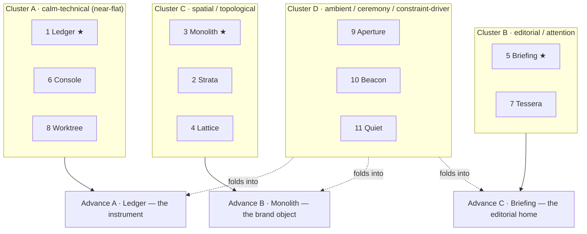

# 21 — Design Divergence Lab (Master Prompt §11.2)

**Phase 0B · Gate 2 design evidence · Worker: Zeno design lane · Date: 2026-08-28**

## 0. What this document is, and the rule it obeys

This is the **suite-level concept-seed generator** that sits downstream of the Reference
Transformation & Morphological Matrix (`20-reference-transformation-matrix.md`). Its job: take the
nine independent morphological axes that document defined, **deliberately permute them** into a
spread of genuinely different whole-suite directions, cluster them, and nominate exactly three to
carry into the A/B/C interactive-prototype round — each a real point in the space, not three shades
of one idea.

**The absolute rule (MP §11.2), restated so it governs every seed below.** The two reels are
**evidence of principles, never a design to copy.** A seed FAILS Gate 2 if an independent reviewer
could mistake it for a reskin or collage of a reel. No seed may reproduce a reel frame order, camera
path, transition timing, component silhouette, spatial arrangement or distinctive composition.
Forbidden as screen-level compositions and rejected before any seed is written (Matrix §1): **F1**
cyan sphere + gold halo + radial capability labels · **F2** orange brain + concentric department
rings · **F3** three tilted smoked-glass cards on a curved rail · **F4** department-to-red mapping ·
**F5** full-screen white flash · **F6** fabricated telemetry · **F7** gesture/voice as authorization.
Every seed states, explicitly, how its signature geometry is **not** the orb / halo / hexagon.

**The invariants every seed inherits (non-negotiable; not re-litigated per seed).** Dark-first
near-black graphite (plus Dark/Light/System/High-Contrast); **≤3 depth layers**, glass only on
nav/controls/overlays/agent-state/wake, never behind code/diffs/transcripts/tables/approvals/long
text, no glass-on-glass; **the list is the primary structure everywhere**, any graph/canvas is a
secondary view over the same data with the same operations and a full keyboard/list equivalent;
**every animation maps to exactly one real state** (asleep · waking · listening · transcribing ·
retrieving · planning · executing · awaiting-approval · paused · blocked · success · error) — no
motion without state, no perpetual loops, no fabricated telemetry, no meaningless waveform;
**truthful state** (a success animation never precedes a verified receipt); **semantic colour is
reserved** — amber = approval/warning, red = blocked/error/destructive/denied ONLY, domains carry a
single neutral accent (never a reserved semantic); **WCAG 2.2 AA** — 4.5:1 text against worst-case
backdrop, 3:1 controls/graphics/state, focus is a **real border/outline not a glow** (2.4.13 Note 1),
2.4.11 Focus-Not-Obscured for every overlay, 2.5.8 24px targets, 2.2.2 pause/stop/hide for anything
moving >5 s, **no flash** (2.3.1; the reels' white flash is rejected outright); status is never
colour-only; **hardware is UNKNOWN (B-002)** so performance is a *target to measure*, never a
displayed achievement, and a full 2D / no-GPU path is always functional; **each seed ships its own
2D, High-Contrast, Reduced-Motion and Reduced-Transparency renderings from the start, never
retrofitted** (the in-app "solid surfaces" toggle is the mechanism — `prefers-reduced-transparency`
is Baseline-limited and cannot be relied on; `prefers-reduced-motion` is widely available).

These are **design-specification** notes, not code and not a live prototype. Layouts are described
precisely enough to build a prototype from; no reel asset, trade dress, shader, audio, layout or
code is reproduced anywhere.

---

## 1. The morphological axes being permuted (from Matrix §6)

Each seed is a **tuple**: one original choice per axis, chosen so the whole never resembles a reel
signature. Independence is the point — a seed is not a theme applied to a fixed layout, it is a
different point on nine axes at once.

| Axis | Options permuted below |
|---|---|
| **A · Signature geometry** | A1 faceted graphite monolith · A2 layered depth-planes (parallax slabs) · A3 centreless lattice/mesh · A4 folded ribbon (not the textura path) · A5 no hero object (typographic/luminance brand) |
| **B · Information architecture** | B1 section→view→detail · B2 verb-first launcher-primary · B3 timeline/attention-primary (Today is home) · B4 object-primary (agents/runs/artifacts as the spine) |
| **C · Spatial depth** | C1 flat reading planes + one floating control layer · C2 tray/menu-bar-anchored glass + opaque body · C3 modal-overlay depth only (HUD on demand) · C4 sidebar-rail depth |
| **D · Panel composition** | D1 single-column list · D2 list + inspector (master/detail) · D3 three-pane (nav/list/detail) · D4 split editor (form left / secondary preview right) |
| **E · Material opacity** | E1 near-solid everywhere · E2 Mica-class static-sample base + small Tier-B live-blur controls · E3 opaque body + translucent transient surfaces only |
| **F · Typography / density** | F1 editorial / low-density · F2 operational / high-density · F3 code-optimised / mono-forward |
| **G · Topology treatment** | G1 list/tree only (no canvas) · G2 list-primary + read-only node overlay · G3 list-primary + interactive node view with full keyboard parity |
| **H · Motion / state grammar** | H1 motion-forward (each state a bounded motion) · H2 shape/iconography-forward (motion minimal) · H3 luminance/opacity-forward |
| **I · Wake ceremony** | I1 luminance bloom from graphite (no ring) · I2 signature primitive assembles once, then settles static · I3 edge-in from the docked rail · I4 minimal (indicator + earcon, no 3D) |

**Admissibility gate applied to every tuple below.** Reject any tuple that, read as a whole,
reconstructs a reel signature (e.g. `{A1 + centred glow + G-canvas primary + gold-as-status}`
rebuilds F1 regardless of the individual choices). All eleven seeds passed this gate; the
originality-risk row of each records the residual reviewer risk and its mitigation.

---

## 2. The seeds at a glance — the tuple matrix

The map of the space. Read each row as "this direction is *these nine choices at once*." Rows that
share a cluster (§4) still differ on ≥3 axes — no two seeds are recolours of one layout.

| # | Seed | A | B | C | D | E | F | G | H | I | Pole |
|---|---|---|---|---|---|---|---|---|---|---|---|
| 1 | **Ledger** | A5 | B1 | C1 | D3 | E1 | F2 | G1 | H2 | I4 | calm-technical |
| 2 | **Strata** | A2 | B1 | C1 | D2 | E2 | F2 | G2 | H3 | I1 | spatial (light) |
| 3 | **Monolith** | A1 | B4 | C4 | D2 | E2 | F2 | G2 | H1 | I2 | spatial (brand-object) |
| 4 | **Lattice** | A3 | B4 | C4 | D3 | E2 | F2 | G3 | H1 | I2 | spatial (topological) |
| 5 | **Briefing** | A5 | B3 | C1 | D2 | E3 | F1 | G1 | H3 | I1 | editorial |
| 6 | **Console** | A5 | B2 | C3 | D1 | E3 | F2 | G1 | H2 | I3 | calm-technical (verb) |
| 7 | **Tessera** | A5 | B3 | C2 | D2 | E2 | F1 | G1 | H2 | I3 | editorial (glance) |
| 8 | **Worktree** | A5 | B4 | C1 | D3 | E1 | F3 | G2 | H2 | I4 | calm-technical (maker) |
| 9 | **Aperture** | A4 | B2 | C3 | D1 | E3 | F1 | G1 | H1 | I3 | ceremony/HUD |
| 10 | **Beacon** | A5 | B3 | C2 | D1 | E2 | F1 | G1 | H3 | I3 | ambient/minimal |
| 11 | **Quiet** | A5 | B3 | C3 | D2 | E3 | F1 | G1 | H2 | I4 | constraint-driver |

---

## 3. The eleven seeds in full

Each seed carries the twelve required fields: name · hypothesis · signature geometry (and how it is
**not** the orb/halo/hexagon) · primary Mac IA · depth & material opacity · motion/state grammar ·
wake ceremony · workflow benefit · reference-transformation lineage · originality risk ·
accessibility/performance cost · advance-or-park rationale.

### Seed 1 — **Ledger** · the instrument, not the light show

| Field | Specification |
|---|---|
| **Hypothesis** | A control plane earns trust by looking like a measuring instrument: near-zero translucency, no hero geometry, every state a legible glyph and every number bound to an inspectable receipt. The most conservative point in the space — and the surface every other seed degrades toward. |
| **Signature geometry** | **None rendered.** The "signature" is a precise baseline grid, a monospaced status ledger, and the wordmark; brand presence is a one-step luminance lift, never an object. **Not orb/halo/hexagon** because there is no central 3D form at all — the only geometry is typographic and tabular. |
| **Primary Mac IA** | B1 section→view→detail over the full Command tree (Today · Work · Approvals · Products · Context · Capabilities · Diagnostics · Settings). D3 three-pane: left nav rail (sections) · centre list (records) · right detail. Global chrome G1 Status Rail top, G2 palette on hotkey, G4 kill switch always present. |
| **Depth & opacity** | Uses **2 of the 3-layer budget**: opaque graphite body + one floating control layer (palette G2, Approval Capsule G5). **E1 near-solid everywhere** — Reduce-Transparency is essentially the default look; glass appears only on the palette/capsule at minimal Tier-B blur, with a scrim. Mica static-sample base optional on Windows; degrades to solid with zero visual loss. |
| **Motion / state grammar** | **H2 shape/iconography-forward.** Each of the twelve states is icon + label + a shape/fill delta (executing = a determinate bar bound to the active step; awaiting-approval = amber capsule outline; blocked = red square-stop glyph; success only after a verified receipt renders). Transitions are ≤120 ms cross-fades. **No idle animation anywhere** — settled surfaces stop rendering by construction. |
| **Wake ceremony** | **I4 minimal.** The Status-Rail glyph brightens asleep→listening with an optional earcon and a visible armed indicator (hotkey/wake/PTT, never gesture/voice as authority, F7). 2D by construction; nothing to fall back from. |
| **Workflow benefit** | Fastest to read under load; the densest views (W1.1 Intake Detail, W2.1 Run Detail, D1 Debugger) get maximum reading area and zero decorative competition. Lowest cognitive drama — squarely "calm, exact, deliberate." |
| **Lineage** | Matrix ADOPT 23A f1116–1235 (N-of-M health panel) · ADOPT 23A f7232–7387 (near-opaque code/log reading planes) · F6 (every number bound to real state) · L4 G1 (Mica degraded matrix) · WCAG floor (L4 F1). |
| **Originality risk** | **Very low.** A dense dark instrument is generic; the residual risk is looking like a stock IDE/dashboard, not like a reel — the opposite of the §11.2 hazard. |
| **A11y / perf cost** | **Lowest of all eleven.** Near-solid, no GPU, list-only, motion-minimal. This *is* the High-Contrast / Reduced-Transparency / 2D floor the others must produce, so building it first de-risks every other seed. |
| **Rationale** | **ADVANCE** — the calm-technical pole, and the universal fallback made first-class. |

### Seed 2 — **Strata** · depth you can read as stacked planes

| Field | Specification |
|---|---|
| **Hypothesis** | Depth rendered as **parallel offset slabs** (near control plane · mid reading plane · far graphite ground) teaches the 3-layer contract literally, so a user always knows what floats and what is content. |
| **Signature geometry** | Parallel, non-centred planes that shift a few px on pointer/scroll, like tectonic strata. **Not orb/halo/hexagon** — there is no focal object and no ring; the geometry is flat planes at different depths, never a centre. |
| **Primary Mac IA** | B1 tree, D2 list + inspector. |
| **Depth & opacity** | Uses **all 3 layers as its identity**: Mica static-sample far ground + opaque mid reading plane + one live-blur near control layer (**E2**), one glass root per cluster (backdrop-root rule, L4 G4), scrim on the clearest slab. |
| **Motion / state grammar** | **H3 luminance/opacity-forward.** States are luminance/opacity deltas across slabs (retrieving = far slab dims while a near progress edge advances). Parallax is pointer-driven, bounded, ≤5 s, pausable; reduced-motion freezes to a static offset. |
| **Wake ceremony** | **I1** graphite ground blooms in luminance, slabs settle into offset, rendering stops. |
| **Workflow benefit** | Communicates place and hierarchy without a hero object; the depth model becomes self-documenting. |
| **Lineage** | Axis A2 · L4 G1 (Mica layering) · L4 G4 (one backdrop root / the opacity-parent trap that forbids fading a glass container) · F3 reduced-motion tier. |
| **Originality risk** | **Low–medium.** Parallax "floating planes" is a common web theme; must avoid reading as generic depth-for-decoration. |
| **A11y / perf cost** | **Medium.** Parallax must honour reduced-motion (freeze) and reduced-transparency (flatten to Seed 1); entrance motion must move/scale a pre-composited surface, never fade a glass parent (L4 G4). |
| **Rationale** | **PARK** — a lighter spatial variant that overlaps Ledger's calm reading and Monolith's layering; its depth-teaching folds into whichever spatial seed advances. |

### Seed 3 — **Monolith** · one faceted solid carries brand, wake and topology

| Field | Specification |
|---|---|
| **Hypothesis** | A single **angular, matte, faceted graphite solid** — lit, never glowing — can be the suite's ownable brand object *and* a functional topology surface (facet = subsystem), giving depth and memorability without a company-brain metaphor and without breaking list-first. |
| **Signature geometry** | An irregular faceted monolith (cut-basalt feel), off-centre, lit by a single key light, matte and non-emissive; it performs a bounded morph only on major transitions and lives **only** on the wake screen and the C4 topology tab, never as the working surface. **Not a sphere** (angular, irregular, not round) · **not a halo** (no ring, no emission, no radial labels) · **not a hex core** (off-centre, non-central, never primary; facets map to real subsystems, not decoration). |
| **Primary Mac IA** | **B4 object-primary** — the spine is Agents (W3) / Runs (W2) / Artifacts (W4) as first-class lists; sections hang off objects. D2 list + inspector; C4 sidebar-rail depth. |
| **Depth & opacity** | Sidebar rail is the single floating glass layer; body opaque (**E2** Mica base + Tier-B controls). The monolith is the **one opt-in WebGPU hero surface**; its 2D fallback is a static faceted SVG that carries the identical state mapping. |
| **Motion / state grammar** | **H1 motion-forward, bounded.** The monolith's facets light per real state (planning = facets trace the plan graph once and stop; executing = the facet for the active step pulses in sync with it; blocked = a facet goes matte red; success only after a verified receipt). Every state has a reduced-motion variant (facet colour/label swap, no motion, no z-translation). |
| **Wake ceremony** | **I2** — the monolith assembles once from graphite shards, settles to static, then stops rendering. Reduced-motion = instant static assembly. Trigger explicit and armed (F7). |
| **Workflow benefit** | Gives the suite a distinct, memorable identity that is also *useful* (a glanceable subsystem-health object) while every operation still happens in lists. Strongest brand differentiation of the eleven. |
| **Lineage** | Matrix ADAPT 23A f1386–1490 (motion instead of chrome — principle adopted, membrane rejected) · Axis A1 + I2 · F1/F2 explicitly rejected (angular, off-centre, non-emissive, list-primary) · L4 G5 (WebGPU opt-in, 2D mandatory). |
| **Originality risk** | **Medium.** Any hero 3D object in this genre risks a "Jarvis core" read; mitigated hard by matte/faceted/angular/off-centre/non-emissive/non-central + list-primary + facet=real-subsystem. Must be reviewed against F1 at prototype. |
| **A11y / perf cost** | **Medium–high.** WebGPU is Baseline-limited → mandatory functional 2D path; motion-forward states need the full reduced-motion set; the object must never become the primary interactive surface (WCAG 2.1.1). |
| **Rationale** | **ADVANCE** — the spatial/brand-object pole; maximally different from the flat seeds and the only direction that hands the suite a signature object without a forbidden composition. |

### Seed 4 — **Lattice** · the anti-brain, a graph with no centre

| Field | Specification |
|---|---|
| **Hypothesis** | A **centreless** lattice expresses "a fabric of agents, devices and knowledge" — the deliberate inversion of the reels' core-and-rings brain: no focal point, every node a peer, every node keyboard-reachable. |
| **Signature geometry** | An even, edge-to-edge graph field with **no privileged centre and no concentric rings**; nodes are real objects (agents/devices/knowledge), edges are typed and labelled. **Not orb/halo/hexagon** and specifically **not F2's brain+rings** — the absence of a centre is the whole point. |
| **Primary Mac IA** | B4 object spine, D3 three-pane; the lattice is the **secondary** view over W3 Agents and C4 Knowledge & Graph — the list is primary, the canvas is G3 with full keyboard parity (tab order = list order, every canvas op available from the list). |
| **Depth & opacity** | Rail glass; opaque body (E2); the lattice canvas is a **near-opaque reading plane, not glass** (content never on glass). |
| **Motion / state grammar** | **H1** — an edge animates only when a real dependency is active (retrieving = the feeding edge lights; executing = the active worker node pulses once per step). No perpetual particle drift, no idle motion. |
| **Wake ceremony** | **I2** — a small local cluster assembles once near the rail, then settles. |
| **Workflow benefit** | Best comprehension of multi-agent orchestration and Mesh device fan-out; answers the reels' company-graph *need* precisely, on the correct (list-first) substrate. |
| **Lineage** | Matrix F2 rejected → W3 list + optional node view · ADAPT 23A f4168–4415 (tool→worker fan-in) · ADAPT 24A f1650–3125 (Mesh multi-device) · Axis A3 + G3. |
| **Originality risk** | **Medium–high — the highest of the eleven.** A glowing node graph is the closest surface in the whole set to F2; centrelessness, list-primacy and typed edges are the guardrails, but reviewer risk stays elevated. |
| **A11y / perf cost** | **Highest.** An interactive canvas owes full keyboard/SR parity, a complete list equivalent, and pause/stop — the most expensive direction to get right. |
| **Rationale** | **PARK** — Monolith delivers the spatial/topology benefit at materially lower originality risk and cost; keep Lattice's centreless-graph as the *topology view* inside whichever seed advances, not as the whole identity. |

### Seed 5 — **Briefing** · the assistant as a calm editorial page

| Field | Specification |
|---|---|
| **Hypothesis** | For an assistant, home should read like a **calm editorial briefing** — generous type, a strong reading measure, one thing at a time, translucency only on transient surfaces — so *attention* is the product and chrome disappears. |
| **Signature geometry** | **None rendered.** The signature is editorial typography, a disciplined measure, and luminance. "Motion-forward" here means *reading* motion — items settle, briefings compose — never object motion. **Not orb/halo/hexagon** — there is no object. |
| **Primary Mac IA** | **B3 timeline/attention-primary** — Today & Attention Center (T1) and Briefings (T2) are home, with per-source coverage + age + why-now + consequence-of-ignoring; Work/Approvals reachable but the spine is time + attention. D2 list + inspector. |
| **Depth & opacity** | **E3** — the body is a fully opaque editorial reading plane; glass appears only on transient surfaces (palette, Approval Capsule, HUD). The editorial pole of the material axis. |
| **Motion / state grammar** | **H3 luminance/opacity-forward.** States are luminance and staggered reveal bound to real arrival (streaming = the tail grows with explicit gap markers on reconnect; success = an item resolves into a receipt chip). Motion-forward but all list-settling, all pausable, no loops, no flash. |
| **Wake ceremony** | **I1** — the morning/unlock briefing composes as a luminance bloom from graphite; reduced-motion = instant, no bloom. |
| **Workflow benefit** | Best for the Zeno assistant home, T2 briefings and Counsel notes/summaries; the lowest-drama, most human reading surface — a real counterweight to instrument density. |
| **Lineage** | Matrix F3 rejected → T1/T2 list-first Attention Center · ADOPT 24A f5836–6482 (assistant home — architecture taken, chrome diverged) · L4 §4 convergent editorial patterns (Linear/Notion/Perplexity) · Axis F1 + B3. |
| **Originality risk** | **Low.** Editorial layouts are safe and generic; the residual risk is reading as a reader app rather than a control plane — a positioning question, not a trade-dress one. |
| **A11y / perf cost** | **Low.** Editorial + list + transient-only glass is cheap and highly accessible; motion is opacity-only. |
| **Rationale** | **ADVANCE** — the editorial/attention pole and the assistant-first reading; genuinely different from both the instrument and the brand-object. |

### Seed 6 — **Console** · the whole suite as a verb space

| Field | Specification |
|---|---|
| **Hypothesis** | Power users live in the command palette; make the **launcher the primary surface** (Raycast-class), summoning views as overlays — the suite as a space of verbs and entities rather than a tree of screens. |
| **Signature geometry** | The palette itself is the signifier — a docked command bar that expands into a ranked result list; no hero object, no canvas. **Not orb/halo/hexagon.** |
| **Primary Mac IA** | **B2 verb-first launcher-primary** (G2 elevated to the spine), views summoned as C3 modal overlays; D1 single-column. Must visibly separate read/navigation from consequential actions and never cross a project or privacy boundary (COMMAND-AC-06). |
| **Depth & opacity** | **C3 modal-overlay depth only**; **E3** transient translucency on palette/overlay; body opaque when a view is pinned. |
| **Motion / state grammar** | **H2** — states are glyphs in the result rows and the Status Rail; overlays scale/slide in bounded, reduced-motion cross-fades. |
| **Wake ceremony** | **I3 edge-in from the docked rail** — the palette is always one keystroke away with a visible armed state. |
| **Workflow benefit** | Fastest operation for expert owners; keyboard parity is native, not retrofitted; ideal for the four independent paths (Ask/Explore, Manual Intake, Counsel-only, Assistant-only). |
| **Lineage** | L4 D5 Raycast (keyboard-first entry) · G2 launcher · COMMAND-AC-06 · Axis B2 + C3 + I3. |
| **Originality risk** | **Very low** — a command palette is a safe, generic pattern. |
| **A11y / perf cost** | **Low** — keyboard-first by construction; the summoned overlay must satisfy 2.4.11 Focus-Not-Obscured. |
| **Rationale** | **PARK** — overlaps Ledger's calm-technical pole (both instrument-like, list-only, low-motion); its launcher-primacy becomes a *mode* inside the advancing instrument seed rather than a separate A/B/C. |

### Seed 7 — **Tessera** · the glanceable briefing, done as a flat mosaic

| Field | Specification |
|---|---|
| **Hypothesis** | The morning glance wants tiles — but **flat, equal, non-tilted, list-backed tiles on an opaque plane**, a mosaic that is the explicit accessible correction of the reels' tilted-glass carousel. |
| **Signature geometry** | A flat mosaic of equal status tiles on an opaque reading plane, each tile a view over a real source with coverage + age. **Not orb/halo/hexagon**, and specifically **not F3** — many flat tiles, list-backed, no tilt, no curved rail, no glass-on-glass. |
| **Primary Mac IA** | B3 attention-primary; tiles are T1/T2 sources; selecting a tile opens its list. D2. |
| **Depth & opacity** | **C2** tray/menu-bar glass for the HUD; body + mosaic opaque (E2); **no glass under the tiles**. |
| **Motion / state grammar** | **H2** — tile badges are state glyphs bound to real source health; a degraded tile *names the missing source and the fix* (L4 B1). Tiles re-order by priority with a bounded settle; no paging animation. |
| **Wake ceremony** | **I3** — the mosaic edges in from the tray on unlock. |
| **Workflow benefit** | The glance surface, delivered accessibly; formally retires F3. |
| **Lineage** | Matrix F3 rejected → T1/T2 mosaic · L4 B1 (degraded names the missing thing) · Axis C2 + B3. |
| **Originality risk** | **Low–medium** — must stay visibly *un-carousel*; flatness, count and list-backing are the guardrails. |
| **A11y / perf cost** | **Low** — flat tiles + list equivalent. |
| **Rationale** | **PARK** — essentially Briefing's attention-home rendered as tiles; let the mosaic be a T1 layout option inside the editorial seed. |

### Seed 8 — **Worktree** · themed from the code plane outward

| Field | Specification |
|---|---|
| **Hypothesis** | For the maker's surface the reading plane is sacred: **near-opaque, mono-forward, zero glass behind code/diff/log**, the Observable Execution Stream as the canonical streaming surface — and the suite themed *from Forge outward*. |
| **Signature geometry** | None; the identity is the execution stream and the diff plane; a read-only run DAG is the only spatial element. **Not orb/halo/hexagon.** |
| **Primary Mac IA** | **B4 object-primary** (Runs/Worktrees/PRs), D3 three-pane (files · runs · diff); Forge workspace P1 and W5 Workstation are the exemplars. |
| **Depth & opacity** | **E1 near-solid everywhere** (code demands it); the single floating layer is the command/approval capsule; **never glass under code**. |
| **Motion / state grammar** | **H2** — typed progress (thought · tool-call · plan · elicitation · response · error), reconnect-safe with gap markers; success only after a verified test/merge receipt. |
| **Wake ceremony** | **I4 minimal** — a coder wants no ceremony. |
| **Workflow benefit** | The strongest reading-plane discipline in the set; directly serves Forge + W5. |
| **Lineage** | Matrix ADOPT 23A f7232–7387 · L4 G7 (Vercel AI Elements typed progress) · IA W2.1 Observable Execution Stream · Axis F3 + E1. |
| **Originality risk** | **Very low** — IDE tropes are generic. |
| **A11y / perf cost** | **Low** — near-solid, mono, list. |
| **Rationale** | **PARK** — this is a *surface law* (near-opaque code planes + typed stream), not a whole-suite identity; it is an invariant all three advancing seeds inherit, so fold it in rather than run it as a standalone. |

### Seed 9 — **Aperture** · a summoned fold, never a persistent object

| Field | Specification |
|---|---|
| **Hypothesis** | The assistant is a **summoned aperture** — a docked graphite ribbon that unfolds into a HUD on demand and refolds away — never a persistent floating hero. |
| **Signature geometry** | A folded graphite ribbon that unfolds (bounded, origami-discrete) into the HUD and refolds; the fold is the wake/idle primitive. **Not orb/halo/hexagon**, and distinct from the textura membrane→helix — a discrete fold, not a particle mesh, not on a camera-dolly path. |
| **Primary Mac IA** | B2/B3 — HUD summoned over any app; the docked tray is home, full Command behind it. D1. |
| **Depth & opacity** | **C3** — the HUD is the only floating layer, on demand; **E3** transient; masks content on locked/shared/untrusted displays (SAN-AC-06) and never steals typing/selection/IME (DESIGN-MAC-AC-02). |
| **Motion / state grammar** | **H1** — the ribbon's fold state maps asleep(folded)→waking(unfolding)→listening(open); executing shows a bounded edge-fill; reduced-motion = instant open, no fold. |
| **Wake ceremony** | **I3** — edge-in unfold from the rail with a visible armed state (F7). |
| **Workflow benefit** | The cleanest wake/HUD ceremony; an ownable, original wake primitive that never clutters the workspace. |
| **Lineage** | Matrix ADAPT 23A f56–114 (docked summonable HUD) · Axis A4 + C3 + I3 · DESIGN-MAC-AC-02 · F7 (explicit armed trigger). |
| **Originality risk** | **Medium** — a folding-into-HUD motion is distinctive (good) but could read as a trope; origami-fold + non-central + no-persistence keep it clean. |
| **A11y / perf cost** | **Medium** — fold motion owes a reduced-motion variant; the HUD must satisfy 2.4.11 Focus-Not-Obscured. |
| **Rationale** | **PARK** — an excellent wake/HUD *treatment* that can sit inside any of the three poles; carry the folding ribbon as the shared wake-primitive candidate, not as a whole identity. |

### Seed 10 — **Beacon** · a quiet presence that lives in the menu bar

| Field | Specification |
|---|---|
| **Hypothesis** | The suite lives mostly **in the menu bar / tray**; the full window is the exception. A persistent, truthful status glyph (device · mic · capture · model · network · privacy zone · safe mode) is the primary presence; everything else is summoned. |
| **Signature geometry** | The Status-Rail glyph and its truthful read-out; no hero object, no canvas. **Not orb/halo** — a small docked glyph reporting real state (the reels' persistent orb + telemetry is rejected, F1/F6). |
| **Primary Mac IA** | B3, D1; the menu-bar extra is home, Command summoned. **C2** tray/menu-bar glass + opaque body. |
| **Motion / state grammar** | **H3 luminance** — the glyph's luminance/shape is device/capture/privacy state; **no fabricated numbers** (F6, B-002). |
| **Wake ceremony** | **I3 edge-in.** |
| **Workflow benefit** | Lowest-footprint presence; strong for Mesh multi-device + privacy/lock state; the "it is just quietly there" model. |
| **Lineage** | Matrix ADAPT 23A f9427–9529 (persistent corner indicator — orb+telemetry rejected) · ADAPT 24A f394–1649 (lock/privacy state, amber correct) · L4 A7 (menu-bar extras) · Axis C2 + I3. |
| **Originality risk** | **Very low.** |
| **A11y / perf cost** | **Low.** |
| **Rationale** | **PARK** — this is the G1 Status Rail elevated to a mode; it folds into all three advancing seeds rather than standing alone. |

### Seed 11 — **Quiet** · the system designed outward from its most privacy-hostile surface

| Field | Specification |
|---|---|
| **Hypothesis** | Design the whole suite **outward from the Counsel meeting overlay** — the surface with the least room for error — so *fail-closed*, *focus-not-obscured* and *never-steal-focus* become the system-wide defaults instead of afterthoughts. |
| **Signature geometry** | None; a restrained overlay that defaults to a generic "Approval needed / no content" on locked/shared/external displays (SAN-AC-06); the identity is **restraint**. **Not orb/halo/hexagon.** |
| **Primary Mac IA** | B3, **C3 overlay-only**, D2; **E3** transient translucency that masks on untrusted displays and fails closed when privacy is unverifiable. |
| **Motion / state grammar** | **H2** — listening/transcribing are glyphs, **never a decorative waveform**; state is never colour-only. |
| **Wake ceremony** | **I4 minimal.** |
| **Workflow benefit** | Makes the hardest privacy surface first-class and forces the whole suite to inherit fail-closed defaults — a genuinely different *design driver* (start from the constraint, not the hero). |
| **Lineage** | Matrix ADAPT 24A f3126–3925 (privacy/handoff, capture indicator is real, not an effect) · Counsel PRD §5.3 non-goals · WCAG 2.4.11 · DESIGN-MAC-AC-02. |
| **Originality risk** | **Very low.** |
| **A11y / perf cost** | **Low** — restraint is cheap. |
| **Rationale** | **PARK** — a crucial *law set* rather than a whole-suite visual identity; its fail-closed defaults are folded into all three advancing seeds. |

---

## 4. Clustering and the three to advance

The eleven seeds fall into four clusters. Within a cluster the seeds still differ on ≥3 axes; the
clusters are what make the A/B/C choice a choice between *kinds of system*, not shades of one.

**The three nominated to advance — three genuinely different points in the space:**

| Advance | Seed | Pole it holds | Why it, over its cluster-mates | Span requirement it satisfies |
|---|---|---|---|---|
| **A** | **1 · Ledger** | Calm-technical instrument | It *is* the High-Contrast / Reduced-Transparency / 2D floor every other direction must produce, so it is first-class by necessity, not merely conservative. Chosen over **Console** (its launcher-primacy becomes a mode here) and **Worktree** (a surface law it already contains). | the required **near-flat / calm-technical** seed |
| **B** | **3 · Monolith** | Spatial brand-object | The only direction that gives the suite an ownable, memorable signature object *and* keeps list-first, at lower originality-risk and cost than **Lattice** (highest F2 risk / highest a11y cost) and with more identity than **Strata** (which overlaps Ledger). Lattice's centreless graph survives *inside* it as the C4 topology view. | the required **heavier spatial / topological** seed |
| **C** | **5 · Briefing** | Editorial attention-home | The assistant-first, lowest-drama reading surface — the true counterweight to instrument density. Chosen over **Tessera**, whose mosaic becomes a T1 layout option here. | the required **editorial / motion-forward** seed |

**Why these three cohere as A/B/C rather than compete.** They are maximally separated on the axes
that matter most to the eventual owner decision — **A (geometry): A5 vs A1 vs A5-editorial**,
**E (opacity): E1 vs E2 vs E3**, **H (motion): H2 vs H1 vs H3**, **B (IA spine): B1 vs B4 vs B3** —
so the owner is choosing between an *instrument*, a *branded spatial system*, and a *calm editorial
assistant*, not between three palettes. And they nest cleanly: **Ledger is the surface Monolith and
Briefing both degrade to** under Reduce-Transparency / Reduce-Motion / no-GPU, so building A first
yields the mandatory fallback for B and C at no extra cost.

**What is parked, and where each lives on.** Strata → depth-teaching folds into Monolith's
layering · Lattice → survives as Monolith's C4 topology view (list-primary, G3) · Console → a
launcher *mode* in Ledger · Tessera → a T1 tile layout in Briefing · Worktree → a cross-cutting
surface law (near-opaque code planes + typed Observable Execution Stream) all three inherit ·
Aperture → the shared folding-ribbon wake primitive candidate · Beacon → the G1 Status Rail as a
mode · Quiet → the fail-closed / focus-not-obscured law set all three inherit. Nothing is discarded;
every parked seed has a home inside an advancing one.

**Shipped from the start with each of A/B/C (never retrofitted).** Its 2D / no-GPU rendering; its
High-Contrast palette; its Reduced-Motion tier (opacity-only transitions, static blur radii, no
z-translation, no idle animation, all transitions interruptible); its Reduced-Transparency /
solid-surfaces rendering via the in-app toggle; a full keyboard + list parity pass; and a truthful
performance stance — every figure a *target to measure* against real state (B-002), never a
displayed achievement.

---

*End 21 — Design Divergence Lab. Clean-room: no reel asset, trade dress, shader, audio, layout or
code reproduced; every direction is an original tuple over the morphological axes, each stated
against the forbidden compositions and the suite invariants. Not legal clearance. The three
nominated directions proceed to the A/B/C interactive-prototype round.*
