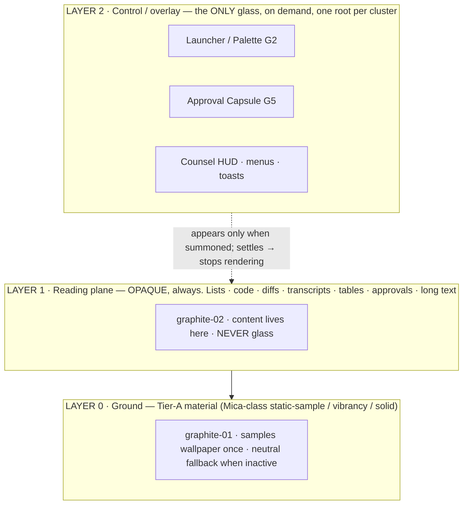
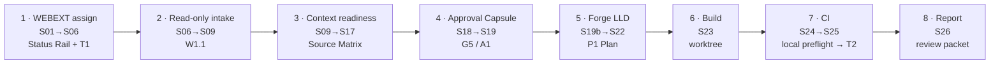

# 22 — Direction A · Cinematic Instrument (Master Prompt §11.2, A/B/C round)

**Phase 0B · Gate 2 design evidence · Worker: Zeno design lane · Date: 2026-08-28**

## 0. What this document is, and the one sentence it commits to

This is the complete **design specification** for **Direction A — Cinematic Instrument**, the first of
the three directions nominated by `21-design-divergence-lab.md` (Seed 1 · *Ledger* · the calm-technical
pole) carried to full-surface detail. It is a specification, not a prototype: layouts are described
precisely enough to build a prototype from, and no reel asset, trade dress, shader, audio, layout or
code is reproduced anywhere.

> **The single sentence.** *Zeno as a precision measuring instrument — near-solid graphite reading
> planes, list-first everywhere, one calibrated reference line (the Fiducial) that carries real state
> instead of a hero object, and a single bounded cinematic gesture spent only at wake — the most
> shippable, lowest-risk direction, whose real risk is reading as a generic stock IDE rather than an
> ownable brand.*

**Lineage (verified upstream; not re-derived here).** Direction A is the tuple
`A5 · B1 · C1 · D3 · E1 · F2 · G1 · H2 · I4` from the divergence lab, with the parked seeds that the
lab folds into it made first-class: *Console* → the launcher **mode**; *Beacon* → the Status Rail as a
**mode**; *Worktree* → the **near-opaque code-plane law**; *Quiet* → the **fail-closed / focus-not-obscured
law set**; *Aperture* → the **wake primitive candidate**. Its evidence base is `20-reference-transformation-matrix.md`
(forbidden compositions F1–F7; ADOPT/ADAPT lessons), `research/L4-design-research.md` (material tiers,
WCAG floors, Apple-font prohibition, Mica / `backdrop-filter` / WebGPU baselines, the 12-step colour
architecture, the typed-agent-progress vocabulary), `10-PRD-suite-and-products.md` (the seven products,
approval tiers, Zeno Glass constraints) and `11-journeys-and-information-architecture.md` (the S01–S28
state machine, the ten view states, the Command navigation tree).

**Why "Cinematic Instrument", not just "instrument".** The suite's hard constraint reserves cinematic
3D for brand, wake/unlock, idle, high-level topology and major transitions. Direction A is the reading
that spends that budget to the *floor*: it earns exactly **one** cinematic gesture — a bounded, one-shot
luminance *calibration sweep* along the Fiducial at wake — and spends nothing else on spectacle. The
cinema is in the restraint. Every other direction spends more; A is the surface they all degrade to.

### 0.1 One Zeno Glass family, three permutations — where A sits

A, B and C are **not** three brands and **not** three recolours. They share **one** Zeno Glass token
set, **one** twelve-state motion grammar, **one** two-tier material model and **one** type system
(§1). They differ only as deliberate permutations of the nine morphological axes:

| Axis | **A · Cinematic Instrument** | B · Monolith (brand-object) | C · Briefing (editorial) |
|---|---|---|---|
| A signature geometry | **A5** — no hero object; the **Fiducial** (typographic/luminance) | A1 — faceted graphite monolith | A5 — editorial type/luminance |
| E material opacity | **E1** — near-solid everywhere | E2 — Mica base + Tier-B controls | E3 — opaque body + transient glass |
| H motion grammar | **H2** — shape/iconography-forward, motion minimal | H1 — motion-forward, bounded | H3 — luminance/opacity-forward |
| B IA spine | **B1** — section → view → detail | B4 — object-primary | B3 — attention/timeline-primary |
| I wake | **I4 → "Pure Instrument"** | I2 — primitive assembles once | I1 — luminance bloom |

**The nesting that makes A load-bearing.** *Ledger is the surface Monolith and Briefing both degrade to*
under Reduce-Transparency, Reduce-Motion and no-GPU. Building Direction A first therefore yields the
mandatory 2D / high-contrast / solid-surfaces / reduced-motion floor for **all three** directions at no
extra cost. A is conservative by *necessity*, not merely by taste.

### 0.2 The invariants A inherits without re-litigating (from the lab)

Dark-first near-black graphite (+ Dark/Light/System/High-Contrast); **≤3 depth layers**, glass only on
nav/controls/overlays/agent-state/wake, **never** behind code/diffs/transcripts/tables/approvals/long
text, no glass-on-glass; **the list is the primary structure everywhere**, any node/graph view is
secondary over the same data with the same operations and full keyboard parity; **every animation maps
to exactly one real state**; **truthful state** (a success animation never precedes a verified receipt);
**semantic colour reserved** — amber = approval/warning, red = blocked/error/destructive/denied ONLY;
**WCAG 2.2 AA** — 4.5:1 text against worst-case backdrop, 3:1 controls/graphics/state, focus a **real
border/outline not a glow** (2.4.13 Note 1), 2.4.11 Focus-Not-Obscured on every overlay, 2.5.8 24px
targets, 2.2.2 pause/stop/hide, **no flash** (2.3.1); status never colour-only; **hardware is UNKNOWN
(B-002)** so performance is a *target to measure*, never a displayed achievement, and a full 2D / no-GPU
path is always functional; **no Apple system fonts or SF Symbols anywhere, mock-ups included** (the
strongest legal finding in the corpus).

---

## 1. Design tokens — the Zeno Glass family, rendered for Direction A

The token *architecture* is shared by A/B/C; the *usage discipline* below is Direction A's. Colour
follows the Radix method — **12 fixed-role steps, a solid and an alpha variant of each, guaranteed text
steps — with original values generated, never Radix's own** (L4 G6). All hex values are the **design
target set, to be locked with a combined WCAG-2.2 + APCA check at token-freeze**; WCAG ratios are
deterministic and asserted as a design guarantee (distinct from performance, which is unknown).

### 1.1 The graphite neutral ramp (dark-first)

A single cool graphite hue (~215°), near-black at the base. Roles are fixed per step.

| Token | Hex | Role | Contrast guarantee (target) |
|---|---|---|---|
| `graphite-01` | `#0B0D10` | **App ground** (Layer 0). Tier-A material base | — |
| `graphite-02` | `#0F1319` | **Reading plane** (Layer 1) — all content sits here | text `-12` on this ≥ 14:1 |
| `graphite-03` | `#161B22` | Component background — normal | — |
| `graphite-04` | `#1C222B` | Component background — hover | — |
| `graphite-05` | `#232A34` | Component background — pressed / selected fill | — |
| `graphite-06` | `#2C3542` | Subtle border — non-interactive (rows, cards, separators) | ≥ 3:1 vs `-02` (target; verify) |
| `graphite-07` | `#384250` | Subtle border — interactive components | ≥ 3:1 vs `-02` |
| `graphite-08` | `#495663` | Strong separator / hairline dividers in dense tables | ≥ 3:1 vs `-01` |
| `graphite-09` | `#5C6875` | Solid neutral (filled non-accent controls) | — |
| `graphite-10` | `#6B7784` | Solid neutral — hover | — |
| `graphite-11` | `#9AA6B2` | **Low-contrast text** — secondary, metadata, `as_of` | ≥ 4.5:1 on `-02` (target ≈ 7:1) |
| `graphite-12` | `#E8ECF1` | **High-contrast text** — primary body, headings | ≥ 12:1 on `-01`/`-02` |

Each step also has an **alpha companion** (`graphite-a03 … graphite-a08`) for tinting the single Tier-B
glass surface predictably over an unknown backdrop — the reason the alpha pairs exist (L4 G6).

### 1.2 Accent and semantic colour — the reserved-channel discipline

Direction A carries **one neutral domain accent (cyan = information)**, **one owner-signal accent
(stoic gold = the owner's current selection / attention / brand luminance)**, and the **two reserved
semantics (amber, red)** — kept strictly apart from both accents. This is the explicit correction of
the reels' `gold-as-status` (F1) and `Sales = red` (F4) mappings.

| Token | Hex | Reserved for | Never used for |
|---|---|---|---|
| `cyan-09` | `#2E93A6` | **Information / interactive** solid — links, the `listening` state, info chips. Deliberately **desaturated** vs the reels' electric cyan | status, success, selection |
| `cyan-11` | `#63C7D8` | Accessible cyan text/icon on `graphite-02` (≥ 4.5:1 target); **focus-ring** stroke | accent text on any translucent surface (L4 rule) |
| `gold-09` | `#A8863F` | **Owner-selection** solid — the 2px left **selection bar** on the active nav row / selected list row; brass, low-chroma, "stoic" | any status chip, any ring around a core |
| `gold-11` | `#CBB075` | **Brand luminance** — the wordmark's one-step lift; owner "you-are-here" emphasis | warning, approval, error |
| `amber-09` | `#E08A1E` | **Semantic: approval / warning** solid — the Approval Capsule outline, the `awaiting-approval` state. Warmer, more saturated than gold | selection, brand, information |
| `amber-11` | `#F5B65A` | Accessible amber text/icon; always paired with an icon **and** a label | colour-only status |
| `red-09` | `#D2453C` | **Semantic: blocked / error / destructive / denied ONLY** | any neutral domain, any "state 3" |
| `red-11` | `#F07A70` | Accessible red text/icon; always paired with a stop/triangle glyph **and** a label | decoration |
| `sage-09` / `sage-11` | `#3E9B6B` / `#66C795` | **Verified-positive, subordinate** — rendered *only* alongside a verified receipt + check glyph | a status channel on its own; it is never sufficient alone |

**The gold-vs-amber collision safeguard (a real risk, flagged for prototype test).** Stoic gold
(selection) and amber (warning) are separated three ways at once: **hue** (brass ~45°, low chroma vs
orange ~38°, high chroma), **placement** (gold is a left-edge *bar*; amber is a *chip/outline*), and
**redundant coding** (gold selection also shifts text weight; amber warning always carries an icon +
word). No user ever distinguishes owner-selection from warning by hue alone. This pairing must still be
verified for the 3:1 non-text separation **and** for deuteranopia/protanopia distinctness (§9).

### 1.3 Typography — real, independently-licensed families (no Apple fonts, mock-ups included)

Apple's font licence forbids SF Pro / SF Mono / New York and SF Symbols in a Windows-first product,
*including in mock-ups* (L4 A11 / X-5). Direction A therefore names three permissively-licensed
families, all **SIL Open Font License 1.1**, that cohere as one system and each ship tabular figures:

| Face | Family (licence) | Used for | Why |
|---|---|---|---|
| **Display** | **Space Grotesk** (SIL OFL 1.1) | Wordmark, wake, section headers, large tabular numerals (Today counts, budgets, N-of-M) | Engineered, drawn-with-a-compass grotesque — gives the brand a signature *through type*, exactly what A5 ("no hero object") requires; calm, not decorative |
| **Body / UI** | **Inter** (SIL OFL 1.1) | The operational workhorse — dense lists, tables, chips, Command W-views, diagnostics | The reference face for legibility at small sizes on dark; `tnum`/`cv` features give true tabular alignment for an instrument |
| **Mono / telemetry** | **JetBrains Mono** (SIL OFL 1.1) | Observable Execution Stream, diffs, terminal, hashes, `as_of` watermarks, Source-Matrix times | Increased x-height and unambiguous glyph shapes for code and telemetry legibility |

The shared Zeno Glass system reserves **Newsreader** (SIL OFL) as the long-form reading face for
Direction C (editorial) and Counsel prose; **Direction A uses it minimally or not at all** — its
identity is grotesque + mono, not editorial serif.

**Type scale (operational / high-density, F2).** display-lg 28/32 · display 22/28 (Space Grotesk 500) ·
title 16/22 (Inter 600) · **body 14/20 (Inter 450 — the default)** · body-sm 13/18 · label 12/16 (Inter
500, +0.02em) · mono 13/18 · mono-sm 12/16 (JetBrains Mono 450) · caption/`as_of` 11/14 (JetBrains Mono
400, only where ≥ 4.5:1 holds). Icon + accessible name is mandatory on every control (L4 G8: an
icon-only button a screen reader can't parse is one our own agent can't parse either).

### 1.4 Spacing, rhythm, radii

**4px base grid.** `space-1..11` = 2 · 4 · 8 · 12 · 16 · 20 · 24 · 32 · 40 · 48 · 64. The Fiducial's tick
rhythm is an 8px minor / 24px major cadence, aligned to the 20px body line and the **24px hit-target
floor** (WCAG 2.5.8); primary controls are 28 or 32px. **Radii:** `radius-1` 4 (chips/inputs) ·
`radius-2` 8 (rows/cards) · `radius-3` 12 (the one Layer-2 overlay/capsule) · `radius-full` (state dots).
Restraint is the point — an instrument has precise, small radii, not soft cards.

### 1.5 Depth & material — three layers, spent sparingly (E1)



| Token | Value / rule | Basis |
|---|---|---|
| `material-tierA` | Window base: **Mica-class static-sample** on Windows, `vibrancy` sidebar on macOS, **solid** everywhere else. Opaque. One backdrop per app, never on an element | L4 G1/G3, X-3 |
| `material-tierB` | The single live-blur surface (Layer 2 only): `blur(20px)` + `scrim` + 1px `graphite-07` border. **Small, short-lived.** Auto-disabled on Battery Saver; solid on the solid-surfaces toggle | L4 G2/G4, A4 |
| `scrim` | `rgba(8,10,13,0.35)` — the 35% dark dimming floor over any bright backdrop, then verified against 4.5:1 | L4 A4 |
| `elevation` | Depth is a **1px hairline** (`graphite-06/07`) + a soft `shadow-overlay` on Layer 2 **only**. Focus is never expressed by shadow/glow | L4 F1, WCAG 2.4.13 Note 1 |
| `focus-ring` | **2px solid `cyan-11` outline + 1px `graphite-01` offset**, ≥ 3:1 vs both surfaces, never obscured by an overlay (2.4.11) | L4 F1 |

Direction A's defining move: for most of the session **only Layers 0 and 1 are on screen** — the glass
Layer 2 is summoned (palette, capsule, HUD) and then dismissed. Because E1 is near-solid, the
solid-surfaces rendering is essentially the *default look*: Reduce-Transparency costs Direction A almost
nothing (its lowest-cost property, and the reason it is the shared fallback).

### 1.6 Motion — the twelve-state grammar (H2: shape/iconography-forward)

**Tokens.** `motion-instant` 0ms · `motion-fast` 120ms (state cross-fades — Ledger's ceiling) ·
`motion-plane` 180ms (panel/plane transitions) · `motion-wake` 640ms (the one-shot calibration sweep) ·
`ease-standard` `cubic-bezier(0.2,0,0,1)` · `ease-exit` `cubic-bezier(0.4,0,1,1)`. **All transitions
interruptible; no idle loops anywhere; settled surfaces stop rendering.**

Each of the twelve real states has an **icon + label + a shape/fill delta** — motion is minimal by
identity, so the reduced-motion tier is a near-no-op (its own advantage).

| State | Glyph | Fiducial / status-chip delta | Tier-1 motion | Reduced-motion (Tier 2) |
|---|---|---|---|---|
| `asleep` | hollow dot | Fiducial dim (≥ 3:1) | none (stopped) | none |
| `waking` | dot filling | luminance **calibration sweep** travels the Fiducial once | 640ms one-shot | instant luminance set |
| `listening` | filled dot | Fiducial → `cyan-11` | 120ms brighten | instant |
| `transcribing` | caret | a caret tick advances **per finalized utterance** (real endpoint, not a loop) | tick on real event | tick on real event |
| `retrieving` | converging arrows | one travelling tick per active source fetch | tick on real fetch | static labelled count |
| `planning` | list-outline | plan rows compose top-down | 120ms per real row | instant list |
| `executing` | determinate bar | segment fills bound to the active step's real % | determinate | determinate, no smoothing |
| `awaiting-approval` | amber capsule outline | `amber-09` segment | 120ms fade-in | instant amber |
| `paused` | pause bars | luminance held, dimmed | none | none |
| `blocked` | red stop-square | `red-09` cap | 120ms | instant |
| `success` (verified) | check + receipt | `sage` tick — **only after a verified receipt renders** | receipt row appears | same |
| `error` | red triangle | `red-09` | 120ms | instant |

---

## 2. Signature geometry — **The Fiducial**, and why it is not the orb, halo or hexagon

Direction A renders **no hero object** (A5). Its signature is **the Fiducial**: a single, calibrated
**vertical reference line** — a hairline "meridian" — set at the functional boundary between the
navigation rail and the reading plane, carrying minor tick-marks on the baseline rhythm. It is the
index mark of a precision instrument (a sextant scale, a plumb line, a gauge's fiducial), and it is the
literal expression of the brand promise *reason before action*: a plumb line reads as measured,
deliberate, exact.

**Behaviour.** At rest it is a near-invisible 1px `graphite-08` seam (≥ 3:1, never below). It carries
**real state** as luminance and marks (the §1.6 grammar): dim when `asleep`, `cyan` when `listening`, a
travelling tick when `retrieving`, a determinate fill when `executing`, an `amber` segment when
`awaiting-approval`, a `red` cap when `blocked`, a `sage` check only on a verified `success`. The
wordmark **ZENO** (Space Grotesk) sits beside it with a one-step `gold-11` luminance lift. That is the
entire brand geometry — typographic and linear, never volumetric.

**Demonstrably not any forbidden composition:**

| Forbidden | Why the Fiducial is not it |
|---|---|
| **F1** cyan sphere + gold halo + radial capability labels | The Fiducial is a **straight vertical line** — no sphere (no volume, no roundness), **no ring or halo** (nothing circular, nothing radial, nothing emissive), and **no radial labels** (every label is in a linear list to the *right*). Gold appears only as owner-selection and wordmark luminance — **never as a status ring, never around a core** |
| **F2** orange brain + concentric department rings | **No central object, no concentric anything, no brain metaphor, no department mapping.** A line at a layout boundary, off-centre, is the opposite of a centred core-and-rings |
| **F3** three tilted smoked-glass cards on a curved rail | The Fiducial is a **single straight element**; all content is **flat, non-tilted lists on opaque planes** — no tilt, no curve, no rail, no glass-on-glass |
| **F5 / F6 / F7** | The one motion (calibration sweep) is a **bounded 2D luminance travel** — no white flash (F5), no fabricated telemetry (every mark is bound to real state, F6), and wake is triggered by an explicit armed hotkey/wake/PTT, never gesture-as-authority (F7) |

The "cinematic" budget is spent **once**, on the wake calibration sweep (§7), and on an *optional* 2D→3D
depth on the wake seam whose 2D form is the shipped default. No persistent object, no idle motion, no
camera path — an independent reviewer cannot mistake a calibrated reference line for a Jarvis core.

---

## 3. Zeno Command — the control-plane layout

Command is B1 **section → view → detail**, depth capped at three, rendered as a **D3 three-pane** shell
on flat reading planes (C1) with a single floating control layer. It mounts the products; it never forks
their state. Every view resolves to real inspectable state or truthfully reports it cannot.

### 3.1 The shell

```
┌──────────────────────────────────────────────────────────────────────────────┐
│ G1 STATUS RAIL   device · mic · capture · model · network · privacy zone · safe mode   [G4 ⏻] │  ← Layer 1, opaque, always truthful
├───────────┬───────────────────────────────┬──────────────────────────────────┤
│  NAV RAIL │  LIST / RECORDS (centre)       │  DETAIL (right)                   │
│ (sections)│  ▏the Fiducial runs here       │                                   │
│           │  ▏                              │                                   │
│  Today    │  ▏ row  · state glyph · label   │  selected record, full depth      │
│ ▏Work     │  ▏ row  · state glyph · label   │  (state-machine trace, matrix,    │
│  Approvals│  ▏ row  · …                     │   stream, receipts …)             │
│  Products │  ▏                              │                                   │
│  Context  │  ▏                              │                                   │
│  Capabil. │  ▏                              │                                   │
│  Diagnost.│  ▏                              │                                   │
│  Settings │  ▏                              │                                   │
├───────────┴───────────────────────────────┴──────────────────────────────────┤
│ G3 MAIN-AGENT CHAT  (persistent, streaming; read visibly separated from consequential) │
└──────────────────────────────────────────────────────────────────────────────┘
```

- **G1 Status Rail** (Beacon folded in as a mode): a truthful read-out — every value bound to real
  device/mic/capture/model/network/privacy/safe-mode state, **no fabricated numbers** (B-002). It is the
  persistent presence the reels expressed as a glowing orb + telemetry (ADAPT 23A f9427); here it is a
  quiet strip that reports and never approves. It stays operable in safe mode and offline.
- **Nav rail** — the eight sections. The active section carries a **2px `gold-09` left selection bar** +
  weight shift (owner-selection). A section the owner has no capability for renders its **health state**
  (`not_configured` / `permission_denied` / `unsupported`) with the exact reason — never silently hidden.
- **Centre list** — the primary structure; **the Fiducial runs down its left edge.** Rows are flat, on
  `graphite-02`, each `record · state glyph · label · as_of`.
- **Right detail** — the third and final level; anything deeper is a panel *inside* it, not a fourth level.
- **G2 Launcher / Palette** (Console folded in as a mode): the one keystroke away, a Layer-2 glass
  surface that **visibly separates read/navigation from consequential actions** and never crosses a
  project or privacy boundary (COMMAND-AC-06). Keyboard parity is native, not retrofitted.
- **G4 Pause / Kill Switch** — one action, present and operable in every view and every state (its whole
  purpose); it can never itself be empty/loading/approval-gated.
- **G3 Main-Agent Chat** — persistent, multimodal, streaming; the surface where any of the ten view
  states can surface, with **G6 Context & Egress receipt chips** on every composer and response.

### 3.2 Today & Attention (T1/T2) — the list-first correction of the carousel

The explicit accessible correction of F3 (the NEXUS tilted-glass carousel). T1 is a **threaded,
deduplicated, flat list** on an opaque plane (Direction A renders it dense, F2 — not editorial; that is
Direction C). Each item shows, as text: **why now · what changed · source age · confidence · consequence
of ignoring**, and a **per-source coverage banner** — an item's absence is "nothing today" *only* when
every configured source returned a proven `Empty` (with its timezone; §3.6). The parked *Tessera* mosaic
survives here as an **optional flat, non-tilted, equal-tile layout** over the same list — never a rail,
never tilted, never glass-under-tiles. A degraded tile **names the missing source and the one fix**.

### 3.3 The Approval Capsule (G5) — the one consequential Layer-2 surface

The single glass surface where a consequential action is decided. **Opening never approves.**

| Property | Specification |
|---|---|
| Surface | Layer 2, Tier-B glass, `radius-3`, **2px `amber-09` outline** (the `awaiting-approval` semantic), soft `shadow-overlay`. Solid-surfaces toggle → `graphite-03` + border, zero information lost |
| Shows | The **complete exact** payload — resolved recipients incl. CC/BCC and distribution-list expansion, attachments + hashes, visibility, schedule, side effects, **sanitization chips**, **risk-tier chip**, expiry, and the **action hash** (JetBrains Mono) | 
| Controls | Edit · Regenerate · Explain · Open authoritative source · **Approve · Deny** · Snooze · Dismiss · Do-not-draft-similar — Approve/Deny visibly separated from read controls |
| Invalidation | Any change to target/account/recipients/thread/context/payload/attachments/visibility/schedule/provider-schema/side-effects/policy/executor returns it to `awaiting_review` and increments the version (a version mismatch on a deep link renders `stale` and forces a fresh preview) |
| Tier gate | T2 = fresh preview + explicit approval; **T3 = exact preview + a fresh platform-authenticator confirmation** — and on the pilot, if no authenticator exists, **T3 is blocked, not downgraded** (N-1), rendered honestly in the capsule |
| Privacy | On a locked / shared / screen-shared / external / meeting-profile display it **masks to a generic "Approval needed"** with no sender, ticket, repo, branch, file, excerpt or payload; it is **never spoken** (SAN-AC-06) |

The capsule is one object addressed identically from the tray, the notification, the Approval Center
(A1) and the phone — one approval queue, one audit ledger.

### 3.4 The Observable Execution Stream (W2.1) — the canonical streaming surface

A **Layer-1 opaque reading plane** (never glass behind a stream), the canonical `streaming` surface:
**reconnect-safe, with an explicit gap marker when events were missed, and never a hidden
chain-of-thought.** Progress is **typed, not decorative** (L4 G7 / D2), each row a distinct type with its
own glyph, live-region policy and collapsed/expanded default:

`thought` · `tool-call` (+ result) · `plan` · `elicitation` (a structured question) · `response` ·
`checkpoint` · `error`.

Timing law (L4 F5 fused with D2): **first typed acknowledgement within 10s** or the agent is shown as
unresponsive; **1–10s → indeterminate indicator + a named current step**; **>10s → determinate progress
or an itemised completed/current/pending list**. `role="progressbar"` with real `aria-valuenow` on
determinate work; an indeterminate loop over 5s carries pause/stop/hide (2.2.2). Success renders **only
after a verified receipt** — never before.

### 3.5 The Workstation Control Center (W5)

The dense operational **table** (F2, Layer 1) that makes the local machine a legible place (the
transferable lesson of the reels' physical-workstation shot, ADOPT 23A f7160 as environment only — no
geometry taken). Columns render truthful state per capability: repos / worktrees / HEADs · IDE buffers ·
terminals / panes · processes / ports / dev-servers / watchers / logs · toolchains · builds / tests · QA
profiles · containers / VMs / DBs · git remotes · CI / release · cloud & k8s context · **action tier per
control** · **reproducibility receipts (secret-free)**. It **never exposes raw secrets**; start / stop /
interrupt / take-over controls carry their tier; a capability the machine lacks reads `unsupported` /
`degraded`, never blank. List/table is primary; there is no free canvas here.

---

## 4. Zeno Forge — the coding workspace (P1)

The maker's surface, themed **from the code plane outward** (Worktree law folded in). The sacred rule:
**near-opaque reading planes for code, diff, terminal and browser — zero glass behind any of them**
(E1). Mono-forward (JetBrains Mono).

### 4.1 The plane layout

```
┌ IDENTITY STRIP  mode ▸ model/effort ▸ permission tier ▸ worktree@HEAD ▸ zone ────────────┐  ← Layer 1, always visible
├───────────┬───────────────────────────────────────┬──────────────────────────────────────┤
│ FILES /   │  EDITOR / DIFF  (opaque, mono)          │  AGENT · Observable Execution Stream  │
│ RUNS TREE │  ▏Fiducial (run state)                  │  typed rows · plan · elicitation      │
│ (list,    │  ┌─────────────┬─────────────┐          │                                       │
│  primary) │  │  before      │  after       │  diff  │  [ DAG inspector ]  ◁ toggle          │
│           │  └─────────────┴─────────────┘          │  (opens BESIDE code, never behind)    │
│           ├───────────────────────────────────────┤                                       │
│           │  TERMINAL (structured argv) · BROWSER QA (isolated profile)                     │
└───────────┴───────────────────────────────────────┴──────────────────────────────────────┘
```

- **Editor / diff / terminal / browser** are all Layer-1 opaque planes. The diff is a calm two-column
  reading plane; the terminal is structured-argv execution shown as typed output (not an ambient shell);
  browser QA runs in an **isolated, disposable profile** — visibly never the owner's authenticated one
  (SWE-QA-AC-01).
- **The agent DAG is a toggleable inspector, never behind code.** Direction A keeps it **list-primary**
  (G1/G2): the canonical form is the **W2.1 dependency list** (who-feeds-whom as typed, labelled rows);
  the node view is an **optional read-only overlay over that list**, opening in its own pane *beside* the
  editor, with **tab order = list order** and every canvas operation available from the list (WCAG
  2.1.1). The interactive, fully-navigable node canvas is Direction B's territory; A stays restrained.
- **Mode / model / permission identity strip.** A persistent Layer-1 strip makes authority
  unmistakable: **mode** (Ask / Explore / **read-only** clearly separated from Build / **write-capable**),
  **model + effort** (local / cloud via K4, with the egress state and licence/hardware compatibility),
  **permission tier** in force, and **worktree@HEAD + data zone** (Z1 personal vs Z2 company, never
  mixed). Ask and Explore create **no** write capability; Build is the only ordinary mode that receives
  scoped write, inside an isolated worktree.

### 4.2 Forge state truthfulness

Local test results are labelled **`local preflight`, never `CI passed`** (§6). Checkpoints distinguish
conversation/plan, file/worktree, environment/DB and **already-executed external effects** — compensation
is never labelled guaranteed rollback. A reproducibility receipt per run is **secret-free** (only
non-resolvable, task-expiring descriptors). Forge **validates and rehydrates** the sealed upstream
Context Pack receipt; it never builds a rival context, never self-waives a `required` source, and never
reaches Build without an Intake ID and an approved plan hash (FORGE-HANDOFF-AC-02).

---

## 5. Zeno Counsel — the meeting overlay (P3)

The most privacy-hostile surface, so the whole suite inherits its fail-closed defaults (Quiet law). It
is a **HUD-class** overlay (L4 A6: small, few controls, dark, colour used sparingly), an **original Zeno
Glass composition — not the trade dress of any existing product** — that **never steals typing,
selection or IME** (DESIGN-MAC-AC-02).

### 5.1 The quiet two-stage composition

**Stage 1 — Passive (docked ribbon).** A small edge-docked Layer-2 capsule that shows **presence and
state only**: a persistent capture indicator (real, not an effect), the `listening` / `transcribing`
state glyph (never a decorative waveform), the **consent state**, and **provider legibility** — which
model, **local or cloud**, egress on/off, retention. No answer content overlays the meeting in Stage 1.
It masks to a generic state on locked/shared/external displays and **fails closed when privacy is
unverifiable**.

**Stage 2 — Active ("say this").** On a **real other-speaker question / decision / handoff cue** the
capsule expands into the answer surface. The owner's *own* speech updates context and marks what was
already said — it **never** triggers a redundant suggestion unless the owner explicitly asks.

### 5.2 Capture / consent / provider legibility (the preflight)

Before capture, a mandatory preflight is **fail-closed** — any failed or unknown critical check **blocks
capture and is never hidden**. It shows, legibly: mic + system-audio selection and levels · provisional
transcript preview · intended capture source (+ screenshot preview if visual context is on, redacting
exactly what will be sent) · output device + echo test · **model and local/cloud path, egress,
retention** · **overlay-visibility preview — what others can see** · **policy + per-participant consent
state**. "Visible only to me" is stated as **not a guarantee**; self-capture exclusion is used only where
officially supported and verified by a real preflight.

### 5.3 The "say this" answer surface

A calm, glanceable Layer-2 card (opaque-backed for legibility): one **`say this` sentence** in plain
prose · **3–5 key points** · **confidence** · **citations with source age** · **copy / pin / dismiss /
follow-up**. It **never auto-speaks and never auto-sends** (both prohibited). A live suggestion streams a
labelled provisional, stabilises as the utterance completes, and finalises **without visual flicker**.
The human-note-first scratchpad preserves the owner's notes exactly; AI may propose an adjacent
enhancement, never overwrite. Secrets, credentials, payment data and private messages are **never read
aloud and never shown**.

---

## 6. The synthetic end-to-end journey, rendered in Direction A

The canonical QuillBot path — **WEBEXT Jira assign → read-only intake → context readiness → approval
capsule → Forge LLD → build → CI → report** — mapped to the S01–S28 machine and the ten view states, with
the surface, depth layer and Fiducial/colour each step shows. *(Illustrative; `WEBEXT-XXXX` is a
placeholder. Per the worked matrix in the IA doc, the Jira authority row is `not_configured` in Phase 0,
so this is the **designed run**, not a live one — states are named honestly, including where the real
run would block.)*



| # | Step | Surface · nav node | Workflow state | View state | Fiducial / colour | Depth | The truthful discipline |
|---|---|---|---|---|---|---|---|
| 1 | **WEBEXT Jira assign** (signed webhook) | Status Rail glyph → T1 notification → T3 candidate | `S01→S02→S03→S05→S06` | `streaming` → `default` | `retrieving` tick · cyan | L1 | Notification masks on untrusted displays; **opening never approves**; the event envelope is immutable |
| 2 | **Read-only intake** | **W1.1 Intake Detail** | `S06→S07→S08→S09` | `default` / `streaming` | `retrieving` · cyan | L1 | The densest view; hosts the state-machine trace. Read-only object, permanently — no mutation reachable here |
| 3 | **Context readiness** | W1.1 · Source Requirement Matrix + Readiness Report | `S09→S10→S11→S14→S17` | `degraded` (Graphify stale, KB partial) or **`blocked`** (NeoSapien `not_configured`) | `retrieving` → context-ready (holding) · amber where partial | L1 | The **N-of-M health panel** (ADOPT 23A f1116): each source row = `source · mark · state-sentence in its own words · as_of · what it blocks · the one action`. `Unavailable`/`Stale`/`NotSearched` **never** collapse to "no result"; the aggregate is a CoverageVector, never a boolean |
| 4 | **Approval Capsule** | **G5 → A1** | `S18→S18b→S19` | **`approval`** → `default` | `awaiting-approval` (**amber**) → `executing` | **L2** (the one glass) | Exact TASK diff + pack hash + patch hash; **approve = compare-and-swap recheck (S18b)** — any sealed value drifted returns to the earliest affected state; **S19 is the first local mutation of the day** (TASK applied, T1) |
| 5 | **Forge LLD** | P1 Forge · Plan mode | `S19b→S20→S21→S22` | `streaming` → `approval` | `planning` → `awaiting-approval` · amber | L1 (stream) + L2 (capsule) | Pre-handoff hash recheck (S19b) fails **closed** on any mismatch; **LLD Artifact + UI Design Artifact each approved** via the capsule; identity strip shows **Plan = read-only** |
| 6 | **Build** | P1 · Build mode · isolated worktree | `S23` | `streaming` | `executing` (determinate) · cyan | L1 | Identity strip flips to **Build = write-capable, scoped worktree, T1**; Observable Execution Stream typed rows; determinate progress bound to real steps |
| 7 | **CI** | P1 / W2.1 → Outbox A2 | `S24→S25` | `streaming` → `approval` (T2) or **`outcome-unknown`** | `executing` → `awaiting-approval` / outcome-unknown | L1 + L2 | Local run is labelled **`local preflight`, never `CI passed`**; the real CI trigger/rerun is **T2 with a fresh approval**; if the provider outcome is unprovable → **`outcome-unknown`, retry frozen**, options *inspect / reconcile / take over / new action* |
| 8 | **Report** | W2.1 artifacts · Vault P3 · G6 receipts | `S26 Complete` | `outcome` / `default` | **`success`** (sage check) | L1 | Review packet + **reproducibility receipt (secret-free)**; **success renders only after every external effect is verified at its own tier** — the animation never precedes the receipt; the receipt chip is durable and dismissable, watermarked `as_of` if snapshotted |

---

## 7. Wake / unlock ceremony — **Pure Instrument**

The three name-neutral ceremony options for the A/B/C round, and which Direction A uses:

| Option | What it is | Fits |
|---|---|---|
| **Abstract Cortex** | A 3D abstract volumetric brand object assembles/settles | **Direction B** (Monolith · A1 · I2) |
| **Classical Strategist** *(name-neutral)* | A restrained figurative/allusive presence resolves | risky — a "face/avatar" read approaches F1 (reznikov "Apex"); reserved, avatar-only, disableable |
| **Pure Instrument** | The **Fiducial performs a one-shot luminance calibration sweep**; the wordmark resolves; the Status Rail runs a truthful boot inventory | **Direction A** |

**Direction A uses Pure Instrument, and why.** It is the calm precision-instrument reading and the
**lowest-risk** ceremony: no 3D object, no avatar, no "cortex". The sequence is (1) the Fiducial's
luminance **calibration sweep** travels its length once (640ms, `motion-wake`), (2) the **ZENO** wordmark
lifts one step in `gold-11` luminance, (3) the **Status Rail runs a list-first N-of-M boot/permission/
health inventory** (the ADOPT 23A f1116 panel — each check an inspectable row with its own receipt;
"all clear" renders **only** after every check returns a verified pass; a missing source is `partial`/
`degraded`, never hidden). It spends the least of the cinematic budget of any direction — one bounded
2D gesture, no particles, no flash, no camera path.

**Always skippable, never delaying access.** Any input (key, pointer, wake, PTT) cuts immediately to the
ready state; **unlock never waits on the animation**; reduced-motion sets the end-state instantly with no
sweep. The unlock surface **masks content on locked / shared / untrusted displays** and fails closed when
privacy is unverifiable (SAN-AC-06). The trigger is always an explicit **armed** hotkey/wake/PTT/
double-clap with a visible armed indicator — **gesture and voice are presence, never authority** (F7).

---

## 8. Reduced-motion, high-contrast, 2D and low-power variants (shipped from the start, never retrofitted)

| Variant | What changes | Mechanism / basis |
|---|---|---|
| **Reduced-motion** | Opacity-only transitions; **static blur radii, no z-translation** (L4 A9); the wake sweep becomes an instant luminance set; the twelve states swap glyph/fill instantly; all transitions interruptible. Because H2 is already motion-minimal, this is a near-no-op — Direction A's structural advantage | `prefers-reduced-motion` (Baseline, reliable) **and** the in-app Reduce-Motion toggle |
| **High-contrast** | HC palette: ground → near-`#000`, primary text → near-`#FFF`; borders raised to ≥ 4.5:1; **focus ring thickened to 3px**; semantics carry a shape/pattern as well as hue; the gold selection bar gains a solid fill + bold; all translucency off | Apple/Windows Increase-Contrast; WCAG 1.4.11 |
| **2D / no-GPU** | **The shipped default.** No WebGPU / WebGL anywhere; the Fiducial and every surface are pure CSS/SVG. The single optional 3D depth on the wake seam has a 2D form that is the default; everything is fully functional with the GPU absent | WebGPU Baseline `limited`, no Firefox (L4 G5 / X-10) |
| **Low-power / Reduced-transparency (solid surfaces)** | The one Tier-B glass → solid `graphite-03` + 1px border + shadow; Mica → neutral solid; **auto-disabled on Battery Saver**, on the inactive window, on low-end hardware, on transparency-off, on pre-22000 Windows — **zero information lost** (the instrument reads identically, just solid) | Windows five-condition matrix (L4 G1); **the in-app "solid surfaces" toggle is the mechanism**, because `prefers-reduced-transparency` is Baseline-`limited` and undetectable on Safari/Firefox (L4 F4 / X-4) |

Every variant ships with a full keyboard + list parity pass and a truthful performance stance (every
figure a target to measure against B-002, never a displayed achievement).

---

## 9. Honest weaknesses, and the measured claims to verify at prototype

**Weaknesses (stated, not hidden).**

1. **Brand distinctiveness is the real risk.** A dense dark instrument is generic; the residual hazard is
   reading as a **stock IDE/dashboard**, not as a reel (the opposite of the §11.2 collage hazard, but a
   real brand risk). The Fiducial + type + luminance must be shown to be **ownable and memorable** in an
   unbranded review, or the direction wins on safety and loses on identity.
2. **Information density (F2) can overwhelm.** W1.1, W2.1 and W5 are the densest views in the product;
   cognitive load and worst-case-backdrop contrast must be tested on exactly those.
3. **The gold-selection / amber-warning pairing** could still confuse despite the three-way safeguard.
4. **Least emotional range.** By spending the least motion and spectacle, A is the least *delightful*
   direction; it wins trust, not affection — an explicit trade the owner is choosing.

**Measured claims to verify at prototype time (none asserted as achieved here).**

| Claim | How it must be verified |
|---|---|
| Every colour pair meets WCAG 2.2 (4.5:1 text / 3:1 non-text) at worst-case backdrop | Lock the §1 hex set with a combined WCAG + APCA checker at **token-freeze** (ratios are deterministic — asserted as a design guarantee, verified with a tool) |
| Gold-selection vs amber-warning are distinguishable | 3:1 non-text separation **and** deuteranopia/protanopia distinctness, with the redundant-coding fallback confirmed |
| The Fiducial does not read as "Jarvis cyan" HUD | Independent-reviewer test that a calibrated line + desaturated cyan is not mistaken for a reel HUD (the §11.2 gate) |
| The read-only DAG overlay has full keyboard/SR parity + a complete list equivalent | Screen-reader + keyboard pass; tab-order = list-order; every canvas op reachable from the list (WCAG 2.1.1) |
| Tier-B blur is affordable | INP / battery on the **unknown pilot hardware** (B-002) — **never claim an fps**; the 2D/solid path is the shipped default and Tier-B is an opt-in enhancement |
| The wake sweep adds zero access latency | Prove it is interruptible and that unlock never waits on it; reduced-motion sets the end-state instantly |
| T3 on the pilot | If no platform authenticator is present, the capsule renders **T3 blocked, not downgraded** (N-1) |
| Counsel "visible only to me" | Fail-closed on every unverified platform in the Zoom/Meet/Teams/Webex/Slack matrix; the overlay warns it is not a guarantee |
| First-acknowledgement ≤ 10s / determinate > 10s in the Execution Stream | Instrument the timing law against real runs (D2/F5), reported per condition, not as one average |

---

*End 22 — Direction A · Cinematic Instrument. Clean-room: no reel asset, trade dress, shader, audio,
layout or code reproduced; the Fiducial, the Command/Forge/Counsel layouts and the wake ceremony are
original permutations over the shared Zeno Glass axes, each stated against the forbidden compositions and
the suite invariants. Design specification only — the interactive A/B/C prototype follows the owner's
direction pick. Not legal clearance.*
