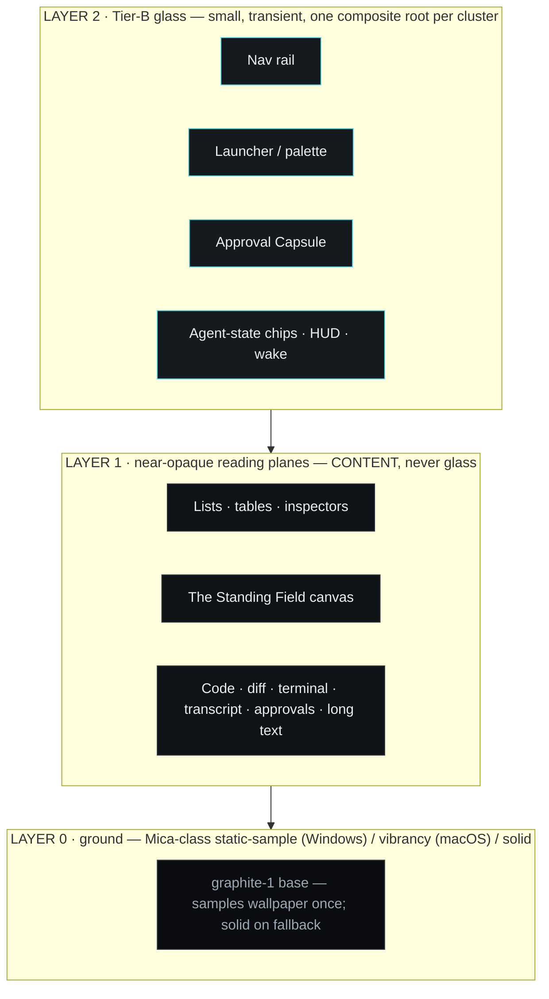
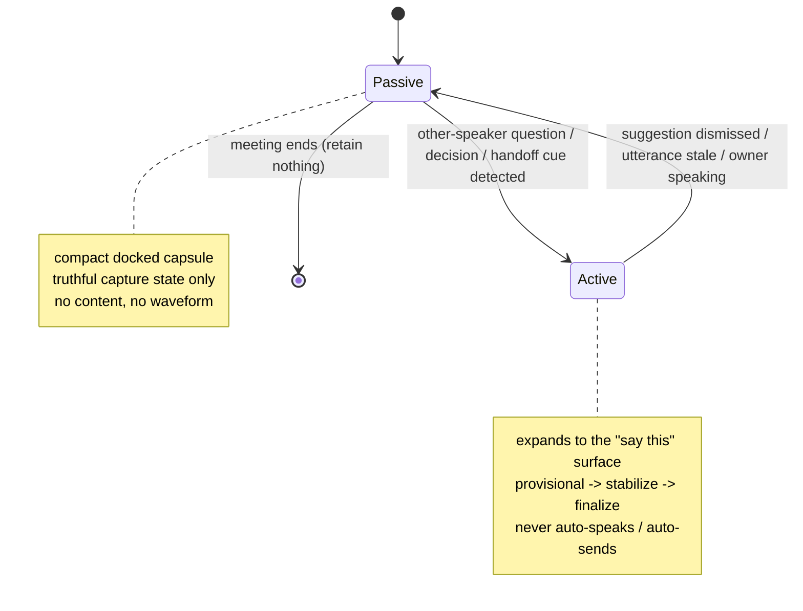
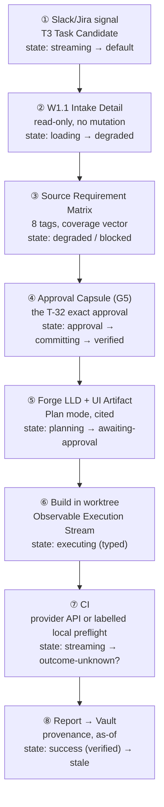
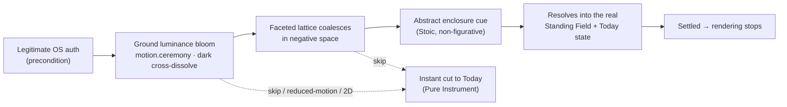

# 22 — Direction B · Spatial Observatory (Master Prompt §11 · Gate 2)

**Phase 0B · Gate 2 design evidence · Worker: Zeno design lane · Date: 2026-08-28**

## 0. What this document is, and the rule it obeys

This is the **complete design specification for Direction B — Spatial Observatory**, one of the
three A/B/C directions the owner will choose between (A **Cinematic Instrument** · B **Spatial
Observatory** · C **Obsidian Foundry**). It is a specification, not a prototype: layouts are
described precisely enough to build an interactive prototype from, and no reel asset, trade dress,
shader, audio, layout or code is reproduced anywhere.

**The absolute rule (MP §11.2), restated so it governs every surface below.** The two supplied reel
compilations are **evidence of principles, never a design to copy.** This direction FAILS Gate 2 if
an independent reviewer could mistake it for a reskin or collage of a reel. Nothing here reproduces
a reel frame order, camera path, transition timing, component silhouette, spatial arrangement or
distinctive composition. The forbidden screen-level compositions — **F1** cyan sphere + gold halo +
radial capability labels · **F2** orange brain + concentric department rings · **F3** three tilted
smoked-glass cards on a curved rail · **F4** department-to-red · **F5** full-screen white flash ·
**F6** fabricated telemetry · **F7** gesture/voice as authorization — are rejected up front, and
this is the direction with the **highest** residual originality risk (§9), so its signature geometry
is stated against each of them explicitly in §2.3.

**Where this direction sits.** It productizes **Cluster C (spatial / topological)** of the Design
Divergence Lab (`21`): the **Monolith** advance (a matte, faceted, off-centre, non-emissive brand
object that is also a functional subsystem surface), with **Lattice**'s centreless typed-edge graph
folded in as the topology view and **Strata**'s depth-teaching folded into the layer model. Its
morphological tuple (Matrix `20` §6):

| Axis | Choice for Direction B |
|---|---|
| **A · Signature geometry** | **Original** — *the Standing Field* (§2): a bounded, matte, **axonometric** depth field of the suite's real objects. Synthesises A1 (faceted matte markers) + A3 (centreless typed edges). Explicitly **not** sphere / halo / membrane→helix / hex core / orb. |
| **B · Information architecture** | **B4 object-primary** — Agents · Runs · Devices · Artifacts · Memory are the spine; sections hang off objects. |
| **C · Spatial depth** | **C4 sidebar-rail depth** + the Field rendered as a near-opaque **content** plane (never glass). |
| **D · Panel composition** | **D2 / D3** — list+inspector and three-pane; the Field is always the *secondary* pane of a list⇄field master-detail. |
| **E · Material opacity** | **E2** — Mica-class static-sample base + small Tier-B live-blur controls only. |
| **F · Typography / density** | **F2** operational (Command) · **F3** mono-forward (Forge) · **F1** editorial (Counsel notes, briefings) — one shared family, density flexed per surface. |
| **G · Topology treatment** | **G3** — list-primary + **interactive** node view with **full keyboard parity**. This is the signature axis and the highest-cost commitment. |
| **H · Motion / state grammar** | **H1 motion-forward, bounded** — each of the twelve states is a distinct, bounded, interruptible motion; no idle loop. |
| **I · Wake ceremony** | **I2** — the signature primitive assembles once, then settles static → **Abstract Cortex** default (§7). |

**The one-line thesis.** *Governance you can stand over:* the suite's agents, devices, runs and
memory laid out as a **calm survey model at a fixed vantage**, where depth means **provenance
distance** — not drama — and every spatial view is the second pane of a first-class list it can never
outrank.

**Inherited invariants (non-negotiable, not re-litigated per surface).** Dark-first near-black
graphite (+ Dark/Light/System/High-Contrast); **≤3 depth layers**, glass only on
nav/controls/overlay/agent-state/wake, never behind code/diffs/transcripts/tables/approvals/long
text, no glass-on-glass; **the list is primary everywhere**, every canvas is a view over the same
data with the same operations and full keyboard/list parity; **every animation maps to exactly one
real state** (asleep · waking · listening · transcribing · retrieving · planning · executing ·
awaiting-approval · paused · blocked · success · error); **truthful state** — success never precedes
a verified receipt; **semantic colour reserved** — amber = approval/warning, red =
blocked/error/destructive/denied only; **WCAG 2.2 AA** — 4.5:1 text and 3:1 controls/graphics against
the **worst-case** backdrop, focus is a **real border/outline not a glow** (2.4.13 Note 1), 2.4.11
Focus-Not-Obscured, 2.5.8 ≥24px targets, 2.2.2 pause/stop/hide for anything moving >5 s, **no flash**
(2.3.1); **hardware is UNKNOWN (B-002)** — performance is a *target to measure*, and a full 2D /
no-GPU path is always functional; ships its own 2D, High-Contrast, Reduced-Motion and
Reduced-Transparency renderings from the start (§8).

---

## 1. The shared Zeno Glass token family

All three directions draw on **one** Zeno Glass token, state and motion family — they are deliberate
permutations, not three brands and not three recolours. This section defines that shared family;
§1.6 states what Direction B does *differently within it*. Values are **generated, not borrowed**:
the 12-step scale **architecture** is adopted from Radix (fixed role per step, solid+alpha pairs,
guaranteed text steps — L4 G6), the **values are ours**, and no Apple font or symbol appears anywhere
including mock-ups (L4 A11 / X-5, the strongest legal finding in the corpus). Contrast figures below
are computed at token-build time and re-verified against each surface's worst-case backdrop
(including over glass); the numbers quoted are the measured design targets, not a conformance claim.

### 1.1 Graphite — the dark-first neutral scale

A cool near-black graphite, 12 steps, dark-first. Each step has exactly one job.

| Token | Hex | Role | Target contrast |
|---|---|---|---|
| `graphite-1` | `#0A0C0F` | **App ground.** The Mica-class base samples wallpaper into a tint of this; the 2D/solid fallback *is* this | — |
| `graphite-2` | `#0F1216` | Raised reading-plane base (lists, tables, the Field plane, code planes) | worst-case text backdrop |
| `graphite-3` | `#151A1F` | Component background (rows, cards, marker faces) | — |
| `graphite-4` | `#1B2127` | Component background — hover | — |
| `graphite-5` | `#222A31` | Component background — pressed / selected fill | — |
| `graphite-6` | `#2A333B` | **Subtle border** — separators, rail/card edges (decorative; not a state signal) | 1.5:1 (decorative) |
| `graphite-7` | `#354049` | Border — resting interactive, paired with a fill delta | — |
| `graphite-8` | `#43515C` | Border — strong / hover | 2.3:1 |
| `graphite-9` | `#5A6B77` | Solid muted / disabled foreground | 3.4:1 |
| `graphite-10` | `#6E808D` | **State-identifying border/graphic minimum** — marker outlines, tick marks (≥3:1 across component backgrounds) | 4.6:1 / 4.0:1 hover |
| `graphite-11` | `#9AA9B4` | **Low-contrast text** — secondary labels, metadata, timestamps | 7.8:1 on `-2` |
| `graphite-12` | `#E8EDF1` | **High-contrast text** — primary body and headings | 15.9:1 on `-2` |

### 1.2 Accent and reserved-semantic colours — the strict separation

The single most reviewer-visible discipline in this direction. **One neutral domain accent (cyan)**;
**owner-selection is its own channel (stoic-gold)**; **semantic colour is reserved** and never used
for identity. No status is ever colour-only — every status also carries a glyph, a label and, where
it is a marker, a shape delta.

| Token | Hex | **Bound meaning — and nothing else** | Target |
|---|---|---|---|
| `info-cyan-9` | `#38C3D9` | **Information / provenance / liveness.** The one neutral accent every domain shares: live edges in the Field, the streaming tail, provenance markers, links, "active" ticks. A **flat 3:1 accent**, never an emissive core or halo. | 8.9:1 graphic/text |
| `info-cyan-8` | `#57D4E6` | **Focus** — a 2px solid outline/border, never a glow (2.4.13 Note 1). | 10.7:1 |
| `owner-gold-9` | `#C7A55A` | **Owner-selection & owner-presence ONLY** — the "you are here" front-rank marker, the current owner selection, owner-authored notes. **Matte, low-chroma, never emissive, never a status.** (Directly rejects the reels' gold-as-status halo, F1.) | 8.0:1 |
| `warn-amber-9` | `#E8912A` | **Approval / warning ONLY** — awaiting-approval, tier badges, reversible-caution. Warmer and more saturated than gold; a build-time check asserts gold and amber never sit adjacent as the sole differentiator. | 7.6:1 · 7.9:1 dark-on-amber |
| `danger-red-9` | `#E5484D` | **Blocked / error / destructive / denied ONLY.** Never a domain, never "Sales = red" (F4). Always paired with a square-stop glyph + label. | 4.8:1 |
| `verified-green-9` | `#37A06B` | **Verified / success / complete / healthy ONLY.** Renders **only** once a real receipt is verified; a success motion never precedes it. Paired with a receipt glyph. | 5.7:1 |

Each accent also ships **alpha variants** (`…A-3/4/5`) for tints over a Tier-B glass control, so a
translucent surface tinted with `cyanA-3` over an unknown backdrop behaves predictably where a
hand-picked `rgba()` would not (L4 G6). **Accent-coloured text is never placed on a translucent
surface** (L4 G2 / A6). Categorical encodings (charts, domain tags) use a generated neutral-hue set
paired with shape/label, never a reserved semantic.

### 1.3 Typography — one display, one body, one mono (all SIL OFL)

Independently licensed families only; embeddable and redistributable; no Apple type anywhere.

| Role | Family | Licence | Used for |
|---|---|---|---|
| **Display** | **Space Grotesk** | SIL OFL 1.1 | Wordmark, wake ceremony, large section titles, the Field's axis labels. Technical, precise, calm — distinctive without drama. |
| **Body / UI** | **Inter** | SIL OFL 1.1 | Every dense operational surface: lists, tables, inspectors, labels, metadata. Tabular figures for counts/coverage. Exceptional small-size legibility on dark. |
| **Mono / telemetry** | **JetBrains Mono** | SIL OFL 1.1 | Code, diffs, terminal, hashes, timestamps, receipts, budgets, the Observable Execution Stream. Ligatures off by default. |

Fallback stacks: Space Grotesk → `"Space Grotesk", "Segoe UI", system-ui, sans-serif`; Inter →
`"Inter", "Segoe UI", Roboto, system-ui, sans-serif`; JetBrains Mono → `"JetBrains Mono",
"Cascadia Code", "Consolas", ui-monospace, monospace`. Type scale (1.20 minor-third, rem):
`0.75 · 0.8125 · 0.875 · 1 · 1.125 · 1.333 · 1.6 · 2 · 2.5`. Body text never below **13px**
effective; line length 60–75ch on reading planes.

### 1.4 Spacing, radius, sizing

4px base grid. Space scale: `2 · 4 · 8 · 12 · 16 · 20 · 24 · 32 · 40 · 48 · 64`. Radius:
`sm 4 · md 8 · lg 12 · xl 16 · pill 999`. **Interactive targets ≥ 24×24 CSS px** (WCAG 2.5.8);
default control height 32, comfortable 40. Rail width 56 (collapsed) / 240 (expanded). Inspector
min-width 360. Focus outline 2px `info-cyan-8`, 2px offset, always inside the not-obscured region.

### 1.5 Depth and material — the three-layer contract



| Token | Recipe | Where | Never |
|---|---|---|---|
| `material.ground` | Mica-class static-sample (samples wallpaper **once** — L4 G1); solid `graphite-1` on the five documented degraded conditions (transparency off / battery saver / low-end HW / inactive window / pre-22000) and everywhere off-Windows without vibrancy | The window base, always | A live blur |
| `material.plane` | Opaque `graphite-2/3`; 1px `graphite-6` hairline; soft occlusion shadow | **All content**: lists, tables, inspectors, the Field, code/diff/terminal/transcript/approvals | Behind glass; carrying accent-coloured text on translucency |
| `material.glass.regular` | Tier-B `backdrop-filter` blur `r=16`, `graphiteA-70` tint, 1px `graphite-7` inner hairline, scrim | Rail, palette, Approval Capsule, agent-state chips | Base layers; edge-to-edge; behind content; glass-on-glass |
| `material.glass.clear` | Higher translucency + **mandatory 35% dark scrim** (L4 A4) | **Counsel overlay only**, over shared screen/video | Anywhere a `regular` surface would read |
| `material.solid` | Fully opaque equivalents of every glass token | The Reduce-Transparency / High-Contrast rendering, driven by the in-app **solid-surfaces toggle** (the mechanism — `prefers-reduced-transparency` is Baseline-limited, a bonus only, L4 F4) | — |

**One composite root per glass cluster** (L4 A5/G4): children paint on top; a glass container is
never faded on entrance (the backdrop-root trap silently kills the blur), so entrances move/scale a
pre-composited surface or cross-fade under reduced motion.

### 1.6 Motion tokens — and what Direction B does with them

| Token | Duration | Curve | Bound to |
|---|---|---|---|
| `motion.instant` | 0 | — | Reduced-motion substitutions; safe-mode |
| `motion.micro` | 80–120ms | `ease-out` | State cross-fades (one state → next), selection |
| `motion.short` | 160–220ms | `ease-out` decelerate | Overlay/inspector in-out; a Field marker settling |
| `motion.medium` | 280–360ms | `ease-in-out` | Major transition; a bounded **Field reframe** (re-orient the vantage, never a swooping camera) |
| `motion.ceremony` | 1200–1800ms | custom calm | Wake only, skippable, interruptible (§7) |

No spring, no bounce, no perpetual loop (low-drama, calm, exact). **Every motion maps to exactly one
state**; a settled Field or a hidden surface **stops rendering** (DESIGN-PERF-AC-01). Because Direction
B is **H1 motion-forward**, more states carry a bounded motion here than in A or C — and each therefore
owes an explicit reduced-motion variant (§8), which is the tax this direction pays for being the most
animated of the three.

**What is permuted vs A and C.** Same tokens; Direction B pushes **E toward E2** (a live-blur control
tier the near-flat A avoids), **H to H1** (A is H2 shape-forward, C is H3 luminance-forward), **B to
B4** (A is B1 section-tree, C is B3 attention-timeline), and **G to G3** (A/C stay at G1/G2 — no
interactive canvas). Under Reduce-Transparency + Reduce-Motion + no-GPU, Direction B **degrades to
Direction A's near-flat instrument** by construction — which is why A is built first and is B's
mandatory floor at no extra cost.

---

## 2. The signature geometry — the Standing Field

### 2.1 What it is

The signature is **the Standing Field**: a **bounded, matte, axonometric depth field** of the suite's
**real** objects, rendered on a near-opaque graphite plane and viewed from a **single fixed vantage**
(≈30° dimetric). Think architect's massing model or a survey table — a calm thing you *stand over and
read*, not a cosmos you fly through. It is the ownable brand-and-topology surface of Direction B, and
it appears in exactly four places, always as the **second pane of a list⇄field master-detail**:
Work → Tasks & Runs (W2), Agents (W3), Device Fleet (K6), and Knowledge & Graph (C4). Nowhere else.

**The load-bearing idea: depth = provenance distance.** The receding axis is not decoration and not
parallax — it is an **ordinal semantic axis**: how far a thing sits from the owner, i.e. how many trust
boundaries a request crosses to reach it. Front to back:

| Rank | Depth band | Holds | Meaning |
|---|---|---|---|
| **R0** | Front edge (nearest, `owner-gold`) | **You** + this device | The owner and the local host — the origin of authority |
| **R1** | | The **Orchestrator** | The single runtime authority / approval boundary |
| **R2** | | **Active agents** (executors, one active per non-idempotent action) | What is doing work now |
| **R3** | | **Tools · MCP servers · skills** | The capability surface an agent reaches through |
| **R4** | Back edge (farthest) | **External providers / accounts** (Jira, Slack, CI, NeoSapien…) | Off-device; the egress frontier |

Reading depth therefore answers a real governance question at a glance — *how far from me is this
running, and what boundary does it cross?* — which is exactly the question the reels answered with a
glowing centre and rings, and which this direction answers with a legible ordered axis instead.

**Markers, not orbs.** Each object is a **matte, flat-topped marker** (a low plinth) sitting on the
groundplane grid at its real rank. The top face carries the object's **label + state glyph + a shape
delta** (never colour alone). Markers do not glow, do not float, do not orbit. Size encodes nothing
decorative; if scale is used it maps to one real quantity (e.g. active lease count) and is labelled.

**Edges, typed and earned.** Dependencies are **typed, labelled flat ribbons** on the groundplane. An
edge lights (`info-cyan`) **only when its dependency is actually active** — retrieving lights the
feeding edge; executing pulses the active worker's marker *once per real step*; blocked turns a
marker matte-red with a stop glyph. There is **no idle particle drift and no perpetual motion**: a
still Field is a still image that has stopped rendering.

### 2.2 Layout and interaction (the parity contract)

```
┌──────────────────────────────────────────────────────────────────────┐
│ G1 Status Rail  ·  device · mic · capture · model · network · zone · safe │  ← Tier-B glass
├────────┬─────────────────────────────┬───────────────────────────────┤
│ nav    │  LIST / TABLE  (primary)     │  INSPECTOR (detail)            │
│ rail   │  ▸ every object, one row     │  selected object: fields,     │
│ (C4,   │    label · rank · state ·    │  receipts, edges as a list,   │
│ glass) │    coverage · as-of          │  actions at their tier        │
│        ├─────────────────────────────┤                               │
│        │  THE STANDING FIELD (secondary, near-opaque CONTENT plane)   │
│        │  ▸ same objects as markers at their provenance rank          │
│        │  ▸ selection is shared with the list (select one → both)     │
│        │  ▸ [⊟ list only] [⊞ list + field] toggle · list is default   │
└────────┴─────────────────────────────┴───────────────────────────────┘
```

- **The list is default and primary.** The Field is an **opt-in** second pane; a user can run the
  entire product having never opened it. Toggling the Field on never changes what data or which
  operations exist — it is the *same rows*, drawn spatially.
- **Selection is one model.** Selecting a row highlights its marker and vice-versa; the inspector is
  identical from either. **Tab order in the Field = row order in the list.** Every Field operation
  (select, expand edges, open inspector, run an action at its tier) is reachable from the list with
  the keyboard; the Field adds no capability the list lacks (WCAG 2.1.1; principle 7; COMMAND-AC
  keyboard/SR parity).
- **Never behind content.** The Field is itself a content plane; nothing text-heavy is ever drawn
  *on* it, and it is never rendered in glass.
- **Bounded viewpoint.** One fixed dimetric vantage. A **reframe** (`motion.medium`) may re-orient
  to face a chosen rank or cluster; there is **no free-orbit camera, no dolly, no zoom-to-core**. Pan
  within the bounds is allowed; the bounds are always visible (it is a table, not a void).
- **Settling stops rendering.** After any transition the Field composites once and halts; no frame is
  drawn until the next real event.

### 2.3 How it is demonstrably **not** any forbidden composition

| Forbidden | Why the Standing Field is not it |
|---|---|
| **F1 · cyan sphere + gold halo + radial capability labels** | No sphere and no round hero of any kind; no ring, no emission, no halo. Capabilities are **markers on an ordinal grid + rows in a list**, never labels on a radial. Cyan is a **flat 3:1 accent**, never a glowing core. Gold is **owner-selection only**, never a status halo. |
| **F2 · orange brain + concentric department rings** | **No centre and no rings.** Depth is a **straight ordinal provenance axis**, not concentric circles around a core; there is no "brain" and no density-as-intelligence. Domains carry the **single neutral cyan accent**, never a per-department hue. This is the closest surface in the whole set to F2 (§9), so centrelessness, the ordinal axis, typed labelled edges and strict list-primacy are stated as its guardrails. |
| **F3 · three tilted smoked-glass cards on a curved rail** | Markers are **matte and opaque** (not glass), **flat-topped** (not tilted), on a **flat grid** (not a curved rail), and there are **as many as there are real objects** (never exactly three). No carousel, no glass-on-glass. |
| **F4 · department-to-red** | Red is reserved to blocked/error/destructive/denied only; domains never carry a semantic. |
| **F5 · full-screen white flash** | No flash anywhere; transitions are bounded dark cross-dissolves under the three-flash threshold; reduced-motion is an instant cut (§7–§8). |
| **F6 · fabricated telemetry** | Every marker, edge and number binds to a real inspectable event or does not render; performance is a target to measure (B-002). |
| **Reel galaxy / accretion-disk / particle-vortex hero** (23A f1799+, 24A f7569+) | Explicitly avoided: the Field is an **architect's-model at a fixed survey angle**, not a cosmos — no stars, no orbits, no central void, no particle field, no swooping camera. "Observatory" is read as *a place you survey from*, never as astronomy. |

---

## 3. Zeno Command — the layout in this direction

Command is **B4 object-primary**: the spine is objects (Agents, Runs, Devices, Artifacts, Memory),
and the eight sections of the canonical nav tree (`11` §7) hang off them. The nav rail is the single
Tier-B glass surface (C4 depth); every body surface is a near-opaque plane.

### 3.1 Navigation and global chrome

- **Nav rail (Layer 2 glass, C4).** 56/240px, the eight sections (Today · Work · Approvals ·
  Products · Context · Capabilities · Diagnostics · Settings). A view the owner has no capability for
  renders with its health state (`not_configured` / `permission_denied` / `unsupported`) and the exact
  reason — **permission-aware, not permission-hiding** (principle 4). Object-primary means the rail
  also surfaces **pinned objects** (a running Run, a watched Agent) above the sections.
- **G1 Status Rail (top, glass).** Truthful device · mic · capture · model · network · privacy-zone ·
  safe-mode read-out. **No fabricated numbers** (F6/B-002); every value resolves to real state or reads
  `not_configured`. This is also the persistent presence glyph (the reels' persistent orb + telemetry
  is rejected).
- **G2 Universal Launcher (glass, global hotkey).** Fuzzy search over objects and verbs; **visibly
  separates read/navigation from consequential actions** and never crosses a project or privacy
  boundary (COMMAND-AC-06). In Direction B the launcher can **frame the Field** ("show Runs feeding
  CI") — but framing is a read, and it says so.
- **G3 Main-Agent Chat (persistent plane).** Streaming, multimodal; every response carries **G6
  context & egress receipt chips**. Not glass — it is long text.
- **G4 Global Pause / Kill (every interface).** One action; revokes outstanding leases; must remain
  operable in every state including safe mode. Rendered as a fixed, always-hittable control, never
  animated away.
- **G5 Approval Capsule** — §3.3.

### 3.2 Today & Attention (T1)

The home of "what is happening?" — threaded, deduplicated across calendar, Jira, Slack/email/
GitHub/GitLab/Figma/CI, meetings, drafts, approvals, alerts, focus blocks and agent blockers, each row
carrying **why now · what changed · source age · confidence · consequence of ignoring** (COMMAND-AC-05).

- **List-first, always.** T1 is a near-opaque reading plane of attention rows. No Field here — Today is
  a feed, not a topology.
- **Per-source coverage banner** (text): "nothing today" renders **only** when *every configured
  source returned `Empty` with a walked-pagination proof*; otherwise the banner names what is
  `unavailable / processing / not authorized / stale / not searched` and its denominator — *"6 items
  across 4 of 6 sources · 1 unavailable · 1 still processing"* (the §5.4 closed-union discipline; a bare
  count is a lint failure).
- **Motion (H1).** A newly-arrived, higher-priority row settles in with a bounded re-order
  (`motion.short`); it never flashes and never auto-acts. Reduced-motion: instant insert.

### 3.3 The Approval Capsule (G5)

The compact, authenticated review surface — the same canonical versioned object as the notification,
the Approval Center (A1) and the phone. **Opening never approves** (REVIEW-COMPANION-AC-01).

- **Material.** Tier-B `glass.regular` with scrim — it is a transient control overlay, one of the few
  legitimate glass surfaces. It **masks content on locked/shared/screen-shared/external/meeting
  displays independently of state**, defaulting to a generic *"Approval needed"* with no sender,
  ticket, repo, branch, file, excerpt or payload (SAN-AC-06); it is **never spoken**.
- **Payload (complete and exact).** Resolved recipients incl. CC/BCC and list expansion; attachments +
  hashes; visibility; schedule; side effects; sanitization chips; **risk tier**; expiry; and the
  **action hash**. Controls: Edit · Regenerate · Explain · Open authoritative source · Approve · Deny ·
  Snooze · Dismiss · Do-not-draft-similar. Never a blind Send.
- **Tier legibility.** The tier badge uses `warn-amber` for T2 and a distinct **fresh-authenticator**
  treatment for T3 (exact immutable preview + platform-authenticator confirmation); on the Windows
  pilot, if no platform authenticator is present, **T3 is blocked, not downgraded** (§2.2.1 / N-1) and
  the capsule says so.
- **Truthful lifecycle motion (H1).** `awaiting-review` shows a steady amber capsule outline (not a
  pulse-as-drama); `committing` shows a determinate bar bound to the real outbox attempt;
  **`verified` (green) renders only on a verified provider receipt** — a success motion never precedes
  it; `outcome-unknown` freezes retry and offers *inspect / reconcile / take over / prepare new*. Any
  change to target/payload/policy invalidates and returns to `awaiting-review`.
- **The Capsule is never rendered in the Field.** Approvals are text and consequence; they live on a
  plane, not in the topology.

### 3.4 The Observable Execution Stream (W2.1 Run Detail)

The canonical `streaming` surface, and a **near-opaque mono-forward reading plane** — never glass,
never hidden chain-of-thought.

- **Typed progress, not a log soup** (L4 G7 / derived law 10): each event is a **typed card** —
  `thought-summary · plan · tool-call · elicitation · response · checkpoint · error` — each with its
  own live-region and focus policy. First typed acknowledgement within 10 s or the agent is presented
  as unresponsive; 1–10 s indeterminate; >10 s determinate/step-list.
- **Reconnect-safe.** An explicit **gap marker** renders when events were missed on reconnect; events
  are never silently dropped.
- **The DAG is an inspector, not the surface.** Run Detail leads with the **editable plan + the typed
  stream** on the plane. The run's dependency graph is available as a **toggleable Standing-Field
  inspector** at inspector scale (same grammar, same parity) — **never drawn behind the stream**. One
  active executor per non-idempotent action is always visible (Mesh).
- **Observer vs steer.** An **Ask-about-this-run** observer lane (cannot mutate) is visually separate
  from **Steer-this-run** controls (cancel · retry-from-safe-step · edit plan → re-approve). Retry is
  bounded, budgeted, idempotent — never "click pipelines until green".

### 3.5 The Workstation Control Center (W5)

"What is my machine actually doing" — repos/worktrees/HEADs, IDE buffers, terminals/panes,
processes/ports/dev-servers/watchers/logs, toolchains, builds/tests, containers/VMs/DBs, git remotes,
CI/release, cloud & k8s context — each rendered with a **truthful `unsupported`/`degraded`** state and
**no raw secrets**.

- **Primary: a dense operational list/table** (F2), grouped by object. This is the reading surface.
- **Optional: the Standing Field over the workstation**, where markers are **processes/servers/
  containers at their provenance rank** (R0 local host → R4 cloud/CI) and edges are **real dependency
  or data-flow** (a dev server → the port it holds; a worktree → its remote). An edge lights only on
  live traffic/activity; a stuck process shows a matte-red marker + stop glyph. **No fabricated
  throughput** — if a rate cannot be measured it is not drawn (B-002/F6).
- **Actions carry tiers** (`A` state): start/stop/interrupt/takeover each preview and, where
  consequential, sit at T2/T3. Reproducibility receipts are secret-free descriptors only (REPRO-AC-01).

---

## 4. Zeno Forge — the coding workspace in this direction

Forge is the surface where the **reading plane is sacred**: near-opaque, **mono-forward (F3)**, and
**zero glass behind code, diff, terminal, transcript or log**. Direction B's spatial signature is
present here **only** as a small, opt-in inspector — it never competes with the code.

### 4.1 Panes

Three-pane object-primary (files/runs left · work centre · context right), all `material.plane`:

| Plane | Content | Rule |
|---|---|---|
| **Editor / diff** | Code and diffs, mono, syntax by role not decoration | Never glass; focus is a real outline; 4.5:1 on `graphite-2` |
| **Terminal** | Structured argv execution surfaced as a stream; a genuinely-required shell starts from a pinned sanitized profile | Never glass; no ambient shell by default |
| **Browser / QA** | DOM-first Playwright view in a disposable clean profile; a11y tree second, visual last | Never attached to the owner's authenticated profile by default (SWE-QA-AC-01) |
| **Plan / chat** | Editable cited Plan (its version is part of every approval hash) + the typed Observable Execution Stream | Plan is read-only until approved; Ask/Explore are read-only by construction |

### 4.2 The agent DAG as a toggleable inspector — never behind code

The multi-agent / multi-step run graph is the **Standing Field at inspector scale**, invoked from a
control in the plan/stream pane and docked as a **right-hand inspector or a slide-over**, on its own
near-opaque plane:

- Markers = **plan steps / sub-agents / tools** at their provenance rank; edges = **typed
  dependencies** (feeds · blocks · verifies). An edge lights only when that dependency is live; the
  active step's marker pulses once per real step.
- **Parity:** the same graph is always available as the **plan step-list** with identical operations
  (open step → `zeno://run/{id}/step/{id}`), identical keyboard order, identical actions. The Field
  adds comprehension of fan-in/fan-out, never capability.
- **It is dismissable and it stops rendering when idle.** Code is never occluded by it; it is never
  drawn *under* the editor or the stream.

### 4.3 Mode · model · permission identity (always legible)

A persistent **identity strip** on the Forge chrome states, at all times and in plain language:

- **Mode** — Ask · Explore · Plan · Build · Review · Debug · QA. Ask/Explore/Plan are read-only;
  **Build is the only ordinary mode that may hold scoped write** (and only inside an isolated worktree).
- **Model / effort** — which local or cloud model, routed via Forge's own gateway (no MCP Sampling),
  with **egress legibility** (local vs cloud, licence/hardware compat, K4).
- **Permission tier of the pending action** — T0/T1 inline; **T2/T3 always route to the one Approval
  Center queue**, never a Forge-local shortcut. "Bypass permissions" is a disposable, auto-expiring,
  credential-less sandbox profile, never applicable to publish/merge/deploy/credentials.

The strip uses **shape + label + tier badge**, never colour alone; Build-with-write is unmistakable
from Explore-read-only at a glance (a filled vs outlined mode glyph + the word).

---

## 5. Zeno Counsel — the overlay in this direction

Counsel is the **quietest** surface in the suite, and the place where Direction B **deliberately shows
the least of itself**: the Standing Field, the Strategic Cortex and every spatial flourish are
**banned** from Counsel's live overlay by spec (`11` §9.2; `10` §6.5). Counsel in Direction B therefore
looks all but identical to Counsel in A and C — which is the point: restraint is the identity here.

### 5.1 The two-stage passive/active composition



- **Stage 1 — Passive.** A small docked capsule showing **only truthful capture/consent/provider
  state** and nothing else. It never shows a decorative waveform (listening/transcribing are **glyphs**,
  not an animated wave — H2 restraint applies inside this one surface even though the direction is
  otherwise H1). It **never steals typing, selection or IME** (DESIGN-MAC-AC-02).
- **Stage 2 — Active.** On a detected *other-speaker* question/decision/handoff cue, the capsule
  **expands** (`motion.short`; reduced-motion: instant) into the **"say this" answer surface**. It
  contracts back when the suggestion is dismissed, goes stale, or the owner starts speaking (the
  owner's own speech updates context and marks what was already said — it never triggers a redundant
  suggestion unless explicitly asked; COUNSEL-AC-06).

### 5.2 Capture · consent · provider legibility (the non-negotiable chrome)

Always visible in **both** stages, as text + glyph:

| Chip | Reads | Fails to |
|---|---|---|
| **Capture** | Persistent local capture indicator — on/off, mic + which **authorized system-audio** channel | never conceal presence (Register #1: no stealth/undetectable/screen-share-safe mode exists) |
| **Consent** | Per-participant consent-ledger state; renews on late-join, source/classification/egress change, sensitive segment | never treat a calendar invite, silence or auto-join as consent |
| **Provider** | Local vs cloud model, region, retention; **any cloud↔local switch is visible**, never silent | never a silent provider change |
| **Overlay visibility** | What others can see; a warning that the overlay may still be visible; **fails closed** when privacy is unverifiable | never claim "visible only to me" it cannot verify |

If any critical preflight check is unknown or failed, capture is **blocked, reason shown, never
hidden** (COUNSEL-AC-04). Material is `glass.clear` **with the mandatory 35% dark scrim** (the one
place clear glass is licensed, because it floats over shared screen/video) — small, HUD-restrained
(L4 A6), never glass-on-glass.

### 5.3 The "say this" answer surface

One glanceable **say-this sentence** (display face, high contrast), then **3–5 key points**, optional
deeper explanation, **confidence**, and **citations with source age**; controls copy · pin · dismiss ·
follow-up. Provisional → stabilizes as the utterance completes → finalizes after endpoint detection
**without visual flicker** (COUNSEL-AC-02). **Never auto-speaks, never auto-sends.** A cited answer's
"success" is the citation resolving, not an animation. The human-note scratchpad is preserved exactly;
AI may propose an adjacent diff, never overwrite (COUNSEL-AC-08).

---

## 6. The synthetic end-to-end journey, rendered in this direction

The same WEBEXT journey every direction must show — Jira assign → read-only intake → context readiness
→ approval capsule → Forge LLD → build → CI → report — with the **state each surface shows** named. (In
Phase 0 this is a *design*, not a run: the worked Intake in `11` §5.3 shows the Jira-authority and
NeoSapien rows `not_configured`, so the honest aggregate is **`blocked`** until an owner-supplied
export or a recorded waiver. The states below are what each surface is *specified to render*.)



| # | Surface | Direction-B rendering | State shown |
|---|---|---|---|
| ① | **T3 Task Candidate** (Today) | A read-only attention row: why-now, source age, consequence. **No early mutation.** No Field. | `streaming` while arriving → `default`; `approval` only on the Jira-draft/promote path |
| ② | **W1.1 Intake Detail** | The densest reading plane in the product; state-machine trace + sealed-pack preview. Read-only intake — `~/Work` and Jira are never mutated. | `loading` → `degraded` (a required source unresolved) |
| ③ | **Source Requirement Matrix** | Each row: *source · mark · one-line state sentence in its own words · as-of · what it blocks · the one action that changes it.* The **coverage vector** never collapses `unavailable/processing/not-authorized/stale/not-searched` into "no result" (§5.4). Optionally the **Standing Field** shows the *sources* as R3/R4 markers with their live/blocked state — the same rows, spatially. | `degraded`; **aggregate `blocked`** because ≥1 required row (Jira authority, NeoSapien) is `blocked` |
| ④ | **Approval Capsule (G5)** | The `T-32` exact approval — full sanitized payload, egress chips, action hash, tier. **Opening never approves.** | `approval` → `committing` (determinate) → **`verified` (green, only on receipt)**; else `outcome-unknown` (retry frozen) |
| ⑤ | **Forge LLD + UI Artifact** | Cited LLD Artifact; **UI Design Artifact because UI is affected**; Plan mode, editable, plan-version in the hash. Read-only until approved. | `planning` → `awaiting-approval` |
| ⑥ | **Build** | Isolated worktree; the **Observable Execution Stream** as typed cards; the run **DAG available as the toggleable Field inspector**, never behind the code. One active executor visible. | `executing` (typed, reconnect-safe, gap-marked) |
| ⑦ | **CI** | Provider API status, or the repo's reproducible local equivalent **labelled `local preflight`, never `CI passed`**. Rerun/deploy wait for reconnect + **fresh** approval. | `streaming` → `success`/`error`, or `outcome-unknown` if the effect is unprovable |
| ⑧ | **Report → Vault** | Markdown root Zeno owns (Obsidian-compatible, not Obsidian-required — N-3); provenance, citations, `as_of`. | **`success` (verified)** → `stale` once snapshotted (receipt chip with `as_of` watermark) |

At no point does a success animation precede a verified receipt; at no point is a required source's
absence rendered as "nothing"; at every external effect a fresh T2/T3 capsule is the only path.

---

## 7. The wake / unlock ceremony

Direction B uses **Abstract Cortex** as its **default** ceremony, because it is the direction whose
signature is already spatial: the ceremony can *become* the Standing Field rather than being a
detached flourish. All three treatments remain **independently selectable** in Theme Studio
(CEREMONY-AC-01); Direction B simply ships Abstract Cortex as the default and **Pure Instrument** as
both the always-available minimal option and the reduced-motion/2D floor.

**Naming discipline.** ZENO is the selected family name; **Zeno of Citium is a Stoic**, so **no
mythological/Athena imagery is licensed** — both Athena-conditional branches are closed. Any
"protective enclosure/crest" cue stays **abstract, geometric and non-figurative**; it never depicts a
statue, actor, photoreal face, literal brain, Marvel/Ultron helmet, glowing red eyes, arc reactor,
thunderbolt, weapon, battle stance, costume armour or fake classical glyphs. The cues are wisdom,
strategy, craft, protection, calm readiness — never war or conquest.

| Treatment | Direction-B use | What it is |
|---|---|---|
| **Abstract Cortex** *(default)* | The signature entrance | A faceted graphite lattice coalesces through **negative space**, briefly suggests a calm protective **enclosure** (abstract, Stoic — a boundary, not a helm), then **resolves into the real Standing Field** settling with the owner's actual front-rank objects, and stops rendering. Ties the ceremony to the signature and opens into **real Today/Orchestrator state**, never a decorative hold. |
| **Classical Strategist** *(selectable, off by default)* | Available, name-neutral | The same assembly with a restrained geometric aegis/olive/owl *cue* rendered as non-figurative facets. Off by default because the Stoic name licenses no figure. |
| **Pure Instrument** *(selectable + the floor)* | The minimal + reduced/2D path | No archetype: a single luminance bloom of the ground and the Status-Rail glyph arming. This **is** the reduced-motion, high-contrast and 2D ceremony. |

**Ceremony contract (all treatments).** Begins **only after legitimate OS authentication**; is
**optional and immediately skippable**; **never steals focus and never delays device access**; uses a
**bounded dark cross-dissolve** (no white flash, F5); is **interruptible** and stops rendering once
settled; and has static / reduced-motion / reduced-transparency / high-contrast / 2D / low-power
equivalents. The trigger is explicit and armed (hotkey / wake / push-to-talk / configurable double-clap
with a visible armed indicator) — **gesture and voice are presence, never authorization** (F7).



---

## 8. Reduced-motion, high-contrast, 2D-fallback and low-power variants

Shipped **from the start**, never retrofitted (`21` §4). Because Direction B is the most animated and
the only one with an interactive canvas, these variants are where it earns its keep — and each degrades
cleanly toward Direction A's near-flat instrument.

| Variant | Trigger | The Standing Field becomes | The rest becomes |
|---|---|---|---|
| **Reduced-motion** | `prefers-reduced-motion` (Baseline-reliable) + in-app toggle | Static markers; edges show live/blocked as a **state glyph/fill delta, no pulse, no z-translation, no animate-into-blur** (L4 A9); reframe is an instant cut | All transitions opacity-only, static blur radii, interruptible; ceremony → instant (Pure Instrument) |
| **Reduced-transparency / solid-surfaces** | **In-app toggle** (the mechanism; `prefers-reduced-transparency` is a bonus, Baseline-limited, L4 F4) | Unchanged geometry, rendered on `material.solid`; the Field was already near-opaque content, so it barely moves | Every glass surface → its solid equivalent; scrims become solid fills |
| **High-contrast** | OS high-contrast + in-app | Marker outlines lift to `graphite-12`/system colours; edges at ≥3:1; state carried by glyph+label+shape, never colour | System-colour honoured; borders replace fills; focus outline thickened |
| **2D / no-GPU** | WebGPU/`backdrop-filter` unavailable, or user choice | A **static axonometric SVG snapshot** of the same markers/edges/ranks — and at the floor, **collapses to the docked list/table**, which was always primary and lossless | Solid surfaces; no live blur; nothing lost but the depth *rendering* |
| **Low-power** | Battery Saver (Mica auto-disables live blur, L4 G1/G2), thermal pressure, or user choice | Field stops any residual rendering; static frame or list | Idle surfaces already stopped rendering; motion drops to `micro` cross-fades only |

**The honest floor.** Under Reduce-Transparency **+** Reduce-Motion **+** no-GPU, Direction B **is**
Direction A: a dense, near-solid, motion-minimal, list-only instrument. Nothing in Direction B is only
reachable through the Field, the glass or the motion — the spatial rendering is a comprehension aid over
a list that already carries every datum and every operation.

---

## 9. Honest weaknesses, and the claims that must be measured at prototype

This is the ambitious direction; its weaknesses are stated on the record.

| # | Weakness / risk | Why it is real | Mitigation already built in | Verify at prototype |
|---|---|---|---|---|
| W1 | **Highest originality risk of the three.** A lit node field is the closest surface in the whole set to **F2** (brain + rings) and adjacent to F1. | An independent reviewer's snap read of any topology view is the exact §11.2 hazard. | Centrelessness; the **ordinal provenance axis** (not rings); matte non-emissive markers; typed labelled edges; strict list-primacy; cyan-as-flat-accent; gold-as-owner-only. | An **independent originality/similarity review against F1 and F2** specifically, name-on/name-off, before this direction ships. |
| W2 | **Highest rendering cost**, on **unknown** hardware (B-002). | Live blur is GPU-intensive and battery-costly (L4 G2); a 2.5D/WebGPU field competes with the user's compiler and calls. | Field is a **near-opaque content plane** (cheap), not glass; WebGPU is **opt-in enhancement**, static-sample base, settled surfaces stop rendering, full 2D floor. | **Frame pacing, INP (≤200ms target), idle CPU/GPU, thermal and battery** on the *actual* pilot machine — every figure a target to measure, never displayed as achieved. |
| W3 | **Keyboard/SR parity for a 2.5D field is expensive** and easy to get wrong. | An interactive canvas that isn't perfectly mirrored by its list fails WCAG 2.1.1 outright. | Tab-order = row-order; selection is one model; every Field op exists on the list; the list is default. | A **full keyboard + screen-reader traversal** and a **graph⇄list reconciliation** test on every Field surface. |
| W4 | **Depth-as-provenance is a novel encoding.** Users may not read "further back = more trust boundaries" without teaching. | An unlabelled semantic axis can read as decorative parallax — the very thing to avoid. | Ranks are **always labelled**; the list carries the same rank column; a one-time coach-mark; Strata's depth-teaching folded in. | **Comprehension testing**: can a user answer "how far from me is this running?" from the Field alone? |
| W5 | **Glass-budget drift.** The temptation to make the Field or its markers glassy would break the 3-layer / no-content-on-glass law. | Spatial surfaces invite translucency. | Field and markers are **content = opaque**, by token; glass is only rail/palette/capsule/chips/wake; one composite root per cluster. | A **material audit**: assert no content plane resolves to a glass token; assert no glass-on-glass. |
| W6 | **Motion-forward means more reduced-motion surface area.** H1 owes a reduced-motion variant for every state. | More motions = more ways to fail 2.2.2 / A9. | Each state's reduced-motion variant is specified (§8); all transitions interruptible; nothing loops. | A **motion inventory test**: every animated state has a fade-only, blur-static, z-static variant, all pausable. |
| W7 | **Positioning risk:** the spatial signature could read as "impressive demo" rather than "calm instrument," against the brand promise *reason before action*. | Spectacle is the reels' failure mode; this direction flirts nearest to it. | Fixed vantage (no swoop), no idle motion, no telemetry, edges earned by real state, Counsel deliberately shows none of it. | An **owner read** on whether the Field feels like governance or like a screensaver — the single most important qualitative check. |

**Measured claims that must not be stated as achieved until B-002 is closed:** any frame rate, GPU
capability, INP/latency figure, thermal/battery envelope, or "renders smoothly" assertion. All are
**targets to measure** on the specified pilot machine, each with the 2D/list fallback that is always
functional.

---

*End 22 — Direction B · Spatial Observatory. Clean-room: no reel asset, trade dress, shader, audio,
layout or code reproduced; the signature geometry is an original axonometric provenance field stated
explicitly against F1/F2/F3 and the reel galaxy hero; every surface obeys the shared Zeno Glass token,
state and motion family; list-primacy, truthful state, reserved semantic colour, the 3-layer material
contract and WCAG 2.2 AA hold throughout. Not legal clearance. Proceeds to the A/B/C
interactive-prototype round for the owner's decision.*
