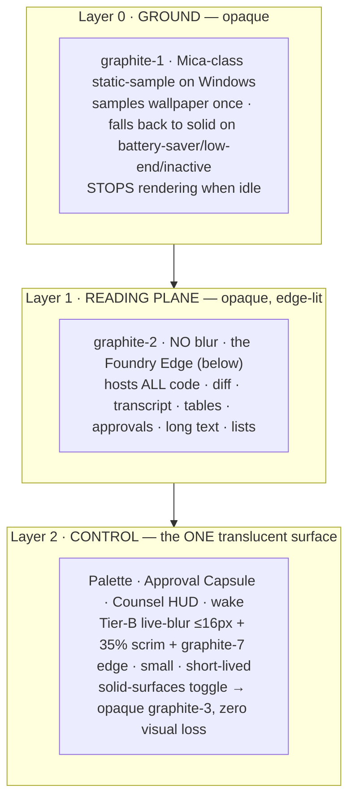
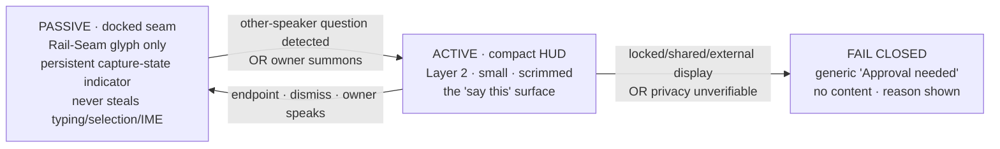

# 22 — Direction C: **Obsidian Foundry** (Gate 2 design specification)

**Phase 0B · Gate 2 design evidence · Worker: Zeno design lane · Date: 2026-08-28**
**Deliverable:** the third of three A/B/C directions carried out of the Divergence Lab (`21-`) into the interactive-prototype round. This is the **restrained technical pole**: near-opaque graphite planes, precise luminous *edges* rather than glowing surfaces, sparse state-bound transition particles, tuned for accessibility, battery and Forge/Counsel density. The direction that wins on legibility and calm.

**Lineage (verified, not re-derived).** Obsidian Foundry is the clean-room build-out of **Divergence-Lab Seed 1 · Ledger** — tuple `A5·B1·C1·D3/D2·E1·F2/F3·G1/G2·H2·I4` (`21-` §2, §3, §4). It is the surface the other two directions *degrade to* under Reduce-Transparency / Reduce-Motion / no-GPU, so it is first-class by necessity, not merely conservative (`21-` §4). It absorbs the parked seeds that were always laws rather than identities: **Worktree** (near-opaque code planes + typed Observable Execution Stream), **Console** (launcher-as-mode), **Beacon** (Status Rail as presence), **Quiet** (fail-closed / focus-not-obscured defaults) (`21-` §4).

### 0.1 The rule this document obeys (Master Prompt §11.2)

The two reels are **evidence of principles, never a design to copy**. This direction FAILS Gate 2 if a reviewer could mistake it for a reskin or collage of a reel. Every signature below is stated **against** the forbidden compositions **F1** cyan sphere + gold halo + radial labels · **F2** orange brain + concentric rings · **F3** three tilted smoked-glass cards on a curved rail · **F4** domain-to-red mapping · **F5** full-screen white flash · **F6** fabricated telemetry · **F7** gesture/voice as authorization (`20-` §1). Obsidian Foundry is the *safest* of the three on trade-dress: it renders **no hero object at all**, so it has no orb/halo/hexagon to be confused with — its residual risk is looking like a generic dark IDE, the opposite of the §11.2 hazard (`21-` Seed 1 originality row).

### 0.2 Shared family vs. this direction's permutation

All three A/B/C directions inherit **one** Zeno Glass token / state / motion family — they are deliberate permutations of compatible principles, not three brands and not three recolours (`10-PRD` §7.3). This file is authored first, so **§1 defines that shared family in full**; each token row marks whether it is `[SHARED]` (identical across A/B/C) or `[C-PERMUTATION]` (Obsidian Foundry's specific setting of a shared knob — density, opacity budget, motion tier, wake). The other two directions re-set only the `[C-PERMUTATION]` rows; they never fork the palette, the semantic-colour law, the type family, the state vocabulary or the accessibility floor.

**Invariants inherited without re-litigation** (`20-` §6, `21-` §0, `10-PRD` §7.3, L4 §6): dark-first graphite; **≤3 depth layers**, glass only on nav/controls/overlays/agent-state/wake, never behind code/diffs/transcripts/tables/approvals/long text, no glass-on-glass, one backdrop-root per cluster; **the list is primary everywhere**, any graph is a secondary view over the same data with full keyboard parity; **every animation maps to exactly one real state**, no perpetual loops, no fabricated telemetry, no meaningless waveform; **truthful state** — a success animation never precedes a verified receipt; **semantic colour reserved** — amber = approval/warning, red = blocked/error/destructive/denied ONLY; **WCAG 2.2 AA** with 2.4.11 / 2.4.7 / 2.5.8 at AA and 2.2.2 / 2.3.1 at A, focus a **real border, never a glow** (2.4.13 Note 1); **hardware is UNKNOWN (B-002)** so performance is a *target to measure* with an always-functional 2D path; each rendering (2D / High-Contrast / Reduced-Motion / Reduced-Transparency) ships from the start via the in-app **solid-surfaces** toggle, never retrofitted.

---

## 1. Design tokens — the Zeno Glass family, set for Obsidian Foundry

### 1.1 The graphite palette `[SHARED architecture · own values]`

A 12-step dark-first ramp using the **Radix scale architecture** (fixed job per step, solid + alpha pairs, guaranteed text steps) with **entirely original values** — adopting Radix's numbers would make the palette recognisably Radix and defeat originality (L4 G6 / X-6 note; `10-PRD` §7.3 "take architectures, generate values"). Undertone is a cool blue-green graphite so the cyan information accent reads as *of the same material*, not applied on top.

| Token | Hex | Role (Radix-step job) | Notes |
|---|---|---|---|
| `graphite-1` | `#0A0C0E` | App **ground** (Layer 0) | Near-black; Mica-class static-sample base on Windows |
| `graphite-2` | `#0F1214` | **Reading-plane** base (Layer 1) | The plane behind code/diff/transcript/tables/text |
| `graphite-3` | `#151A1D` | Component background | List rows, cells, cards (opaque) |
| `graphite-4` | `#1B2124` | Component **hover** | |
| `graphite-5` | `#222A2E` | Component **active / selected** | Selection fill (pairs with gold edge, §1.2) |
| `graphite-6` | `#2C363B` | **Subtle border** — non-interactive | Sidebars, headers, separators, plane hairlines |
| `graphite-7` | `#384349` | **Border** — interactive | Inputs, buttons, the Foundry Edge key-line |
| `graphite-8` | `#47555C` | Strong border / disabled-text boundary | |
| `graphite-9` | `#5C6C74` | Solid low | Icons at rest, meter tracks |
| `graphite-10` | `#6E8088` | Solid hover | |
| `graphite-11` | `#9AAAB2` | **Low-contrast text** (secondary) | Target ≥ 4.5:1 on `graphite-1/2` (measured ≈ 7.5:1) |
| `graphite-12` | `#E6ECEE` | **High-contrast text** (primary) | Target ≥ 12:1 on `graphite-1/2` |

Alpha companions (`graphite-A1…A12`) are the *same hues at defined opacity* over an unknown backdrop, used **only** on the one translucent control layer (§1.5) so a tint behaves predictably instead of a hand-picked `rgba()` (L4 G6). Every text pairing is validated against the **worst-case** backdrop, not the mock (WCAG 1.4.3; L4 F1). All contrast figures here are design targets to be validated by a combined **WCAG-2.2 + APCA** pass at prototype — APCA is a perceptual cross-check, never a substitute for the 4.5:1 / 3:1 floor (L4 G6).

### 1.2 Accent is separate from semantic — the four-channel discipline `[SHARED]`

The reels collapse identity and status (gold halo = presence *and* importance; Sales = red). Zeno Glass keeps **four channels strictly disjoint**, and Obsidian Foundry renders each as *edge + glyph + label*, never as a fill wash and never colour-only (`20-` F1/F4; `10-PRD` §2.2).

| Channel | Token | Hex (solid / text) | Means | Never |
|---|---|---|---|---|
| **Information** (system speaking) | `cyan-info` | `#38C3D6` / `#86DEEC` | A neutral, domain-agnostic accent: the current object, an active edge, an in-progress indicator, a citation marker | A status; a halo; emission; a per-domain identity that could imply a reserved meaning |
| **Owner selection** (the human's hand) | `stoic-gold` | `#B99A54` / `#D8BE7E` | The owner's *current selection*, "you are here", the owner-held control in an Approval Capsule, the owner's pinned item | A status; a warning; a glowing ring; a completion signal (rejects F1 gold-as-status) |
| **Approval / warning** | `amber` | `#E0A128` / `#F0C05A` | Awaiting-approval, a caution, a reversible risk the owner should weigh | Success; identity; a domain accent |
| **Blocked / error / destructive / denied** | `red` | `#E5484D` / `#F2787B` | Blocked, error, destructive/denied action, a failed guard | A domain colour (rejects F4 "Sales = red"); a neutral "state 3" (rejects the reel hex-core colour walk) |

**Verified-receipt seal** `verify-green` `#3DB07A` is the single exception hue, scoped to *exactly one meaning*: **a verified receipt exists**. It appears **only** on the receipt seal glyph, **always** paired with a check mark and a `verified · HH:MM` timestamp, and **never before** verification (truthful state; `10-PRD` §2.2 outbox contract). It is not a general "good" colour and never washes a surface.

Cyan = the system; gold = the owner; amber = a decision is owed to you; red = stop; green-seal = proven. A reviewer can learn the whole status language in one sentence, and none of it is a reel signature.

### 1.3 Typography `[SHARED family · C-PERMUTATION density]`

Three independently-licensed families — **no Apple system fonts or symbols anywhere, including in mock-ups** (L4 A11 / X-5; `10-PRD` §2.5, §7.3, the strongest legal finding in the corpus). All three are on Google Fonts (the one external host a Claude artifact may load) *and* embeddable as `@font-face` for the native shells, each with a real fallback stack.

| Face | Family | Licence | Job | Fallback stack |
|---|---|---|---|---|
| **Display** | **Space Grotesk** | SIL OFL 1.1 | Wordmark, section headers, the Pure-Instrument wake type, empty-state headlines | `"Space Grotesk", "Segoe UI", system-ui, sans-serif` |
| **Body / UI** | **Inter** | SIL OFL 1.1 | All operational UI, lists, inspectors, long-form reading — chosen for small-size legibility on dark | `"Inter", "Segoe UI", Roboto, system-ui, sans-serif` |
| **Mono / telemetry** | **JetBrains Mono** | Apache-2.0 | Code, diff, terminal, hashes, receipts, budgets, the Status Rail read-out, every number bound to real state | `"JetBrains Mono", "Cascadia Mono", ui-monospace, monospace` |

The **family is shared** across A/B/C; directions differ only in *emphasis*. Obsidian Foundry's `[C-PERMUTATION]` is **operational/high-density + mono-forward** (axis F2/F3): Space Grotesk is used sparingly (brand and section headers only, never body); Inter runs at a tighter type scale and tracking than the editorial direction; **JetBrains Mono carries an unusually large share** — every receipt, hash, budget, timestamp, coverage vector and telemetry read-out is mono, because in an instrument a number's monospaced alignment *is* legibility. Editorial Direction B leans on Space Grotesk and a generous measure; spatial Direction A uses Space Grotesk for its brand object — same fonts, different weightings.

**Type scale (Foundry density, 1.20 minor-third, px):** `11` caption/telemetry · `12` secondary · `13` body-dense (default UI) · `14` body · `16` sub-head · `20` section · `28` view title · `40` wake wordmark. Line-height 1.35 for reading planes, 1.2 for dense lists, 1.5 for long-form prose (Counsel notes, LLD, reports). Numeric telemetry uses `font-variant-numeric: tabular-nums`.

### 1.4 Spacing, grid, radii `[SHARED scale · C-PERMUTATION density]`

- **Spacing scale (4 px base — "the Ledger Grid"):** `2 · 4 · 8 · 12 · 16 · 24 · 32 · 48 · 64`. Foundry defaults to the tight end (row padding `8`/`12`, gutters `16`) to maximise reading area in W1.1, W2.1, Forge and Counsel.
- **Baseline grid:** an 8 px vertical rhythm; a faint `graphite-A6` column/baseline substrate is *available* as a toggle (the instrument's measuring rule) but off by default so it never competes with content.
- **Radii (machined, tighter than editorial):** `card 6` · `control 4` · `chip 4` · `capsule 10` · `hairline-plane 8`. Concentric radii nest (outer − padding = inner) so edges stay parallel.
- **Target size:** every interactive control ≥ **24 × 24 CSS px** (WCAG 2.5.8; L4 F1). Dense list rows meet this by row height, not by shrinking the hit area.

### 1.5 Depth & material — three layers, and the Foundry Edge `[SHARED budget · C-PERMUTATION opacity E1]`

The 3-layer budget is shared; Obsidian Foundry sets material opacity to **E1 near-solid everywhere** — the Reduce-Transparency look *is* the default, so there is almost nothing to degrade (`21-` Seed 1; L4 derived-constraints 1–3).



**The Foundry Edge** is the direction's whole optical identity, and it is a *token set*, not an object: a near-opaque plane is defined by a **1 px raking key-line** on its top and left edges (a `graphite-8 → graphite-7` luminance step, as if a single key light rakes a matte, machined, anodised surface) and a **1 px shadow-line** on its bottom and right (toward `graphite-1`). Depth is read from **edge luminance**, never from translucency, glow or a drop-shadow bloom. This is the authoring method from Apple's *layered-icon* guidance turned inside out: separated, opaque-authored, hard-edged layers with per-layer edge treatment, optical highlight as a runtime parameter dialled to a whisper (L4 A10). Tokens: `edge-key` (top/left), `edge-shadow` (bottom/right), `edge-active` (cyan-info 1 px, for the currently-focused plane), `edge-select` (stoic-gold 1 px, owner selection). Under the solid-surfaces toggle the edges *stay* — they cost nothing and carry the identity into the accessible rendering.

Rules enforced by the token layer: never glass-on-glass; **one backdrop-root per cluster** (Apple `GlassEffectContainer` / MDN backdrop-root trap; L4 A5, G4); entrance motion moves/scales or cross-fades a **pre-composited** surface, never fades a glass *container* (which silently breaks its children's blur); no accent-coloured text on the translucent layer (L4 G2). Because Layer 2 is the only blur and it is tiny and short-lived, the GPU/battery cost that Microsoft warns of for live-blur base layers is structurally avoided (L4 G1/G2).

### 1.6 Motion tokens `[SHARED tokens · C-PERMUTATION tier H2]`

Durations `dur-0 0ms · dur-1 80ms · dur-2 120ms · dur-3 200ms · dur-4 320ms`. Easings `settle cubic-bezier(0.2,0,0,1)` (decelerate to rest), `standard cubic-bezier(0.4,0,0.2,1)`. Obsidian Foundry's `[C-PERMUTATION]` is **H2 shape/iconography-forward** — motion is minimal and every instance is a bounded transition **mapped to exactly one real state**; there is **no idle animation anywhere**, and settled surfaces stop rendering (`10-PRD` DESIGN-PERF-AC-01). Default transition is a `dur-2` cross-fade. The only "particles" in the system are the **sparse edge-settle**: on a real compose event (a plane arriving, a wake), **≤ 24 graphite motes** drift a few px along the plane's leading edge over `dur-4` and then stop — low-luminance graphite, never white, never a field, never a swirl, incapable of the F5 flash by construction (luminance delta held far under the three-flash threshold; L4 F1 SC 2.3.1, and the numeric threshold itself must be read at `w3.org/TR/WCAG22` before this ships — L4 AL-10). Anything that could move > 5 s beside content carries pause/stop/hide (WCAG 2.2.2). **Reduced-motion tier:** all transitions → opacity-only ≤ `dur-2`, no z-translation, no blur animation, no particles, every transition interruptible (L4 A9, F3).

### 1.7 The twelve states → Obsidian Foundry signatures `[SHARED vocabulary · C-PERMUTATION rendering]`

The state vocabulary is shared; the *rendering* is Foundry's H2 grammar — **icon + label + a shape/fill/edge delta**, colour never the sole channel, motion minimal and always bounded, success only after a verified receipt (`20-` F6; L4 D2/G7 typed-progress; `10-PRD` §2.2).

| State | Glyph (mono/line) | Edge / fill delta | Motion (full → reduced) | Never |
|---|---|---|---|---|
| **asleep** | hollow dot | plane at `graphite-1`, edges dim | none (stopped rendering) | a breathing glow |
| **waking** | dot filling | Status-Rail seam ignites cyan `dur-4` | one edge-settle → static | a ring, a sphere |
| **listening** | concentric caret (not a ring) | rail seam steady cyan | none | a decorative waveform |
| **transcribing** | line-caret advancing | mono text tail grows | tail append `dur-1` | fabricated levels |
| **retrieving** | bracket scan | active edge cyan; determinate bar if N known | bar advance, else caret pulse `dur-2` | a perpetual spinner past 10 s |
| **planning** | outline list forming | plan rows compose top-down | row cross-fade `dur-2` → instant | a graph animating around a core |
| **executing** | filled bar bound to step | active step edge cyan; determinate bar | bar tied to real progress | motion detached from the step |
| **awaiting-approval** | amber caret | capsule outline amber `edge`, glyph + label | none (rests) | colour-only; auto-advance |
| **paused** | two-bar pause | edges neutral, dimmed one step | none | implying work continues |
| **blocked** | red square-stop | red `edge` + reason text | none | red as decoration |
| **success** | check + `verify-green` seal | seal glyph + `verified · HH:MM` | seal draw `dur-2` after receipt | seal before the receipt exists |
| **error** | red X | red `edge` + error copy (distinct from blocked) | none | collapsing into "degraded" |

The ten **view states** (empty · loading · streaming · approval · stale · outcome-unknown · degraded · offline · error · safe-mode; `11-IA` §8.1) map onto the same grammar: `streaming` uses the transcribing/executing tail with a **gap marker** on reconnect; `degraded` **names the missing source and the fix** (L4 B1); `stale` shows an `as_of` watermark; `loading` transitions to `degraded` rather than spinning forever.

---

## 2. Signature geometry — "The Foundry Edge" and its non-identity proof

Obsidian Foundry chooses axis **A5 — no hero object**. Its signature is not a rendered form but a **discipline of light on matte graphite**: (1) the **Foundry Edge** (§1.5) — planes read as machined metal defined by a single raking key-line; (2) the **Rail Seam** — one vertical cyan hairline down the left nav rail, the sole always-present "signature" line, which brightens to signal wake/listening and is otherwise inert; (3) the **Ledger Grid** — an optional faint measuring substrate; (4) the **sparse edge-settle** — ≤ 24 state-bound motes. Brand presence is a **one-step luminance lift and the wordmark**, never an object (`21-` Seed 1 signature row).

**How it is demonstrably NOT the forbidden compositions:**

| Forbidden | Why Obsidian Foundry cannot be mistaken for it |
|---|---|
| **F1** cyan sphere + gold halo + radial capability labels | There is **no central 3D form of any kind** — nothing round, nothing emissive, no ring. Capabilities are a **list** (K5 Explorer, D4 Diagnostics), never radial labels. Cyan is a 1 px *edge/seam*, not a sphere; gold marks *owner selection*, never a halo and never a status (§1.2). |
| **F2** orange brain + concentric department rings | No core, no brain, no concentric rings. Topology is a **list-primary indented tree** (W3) with an *optional, off-to-the-side, read-only* node overlay (G2) that has no privileged centre; edges are typed and labelled. Domains carry the single neutral cyan accent, never a per-domain hue. |
| **F3** three tilted smoked-glass cards on a curved rail | Planes are **flat, orthogonal, axis-aligned and opaque** — never tilted, never on a curved rail, never glass-on-glass. Today/Attention is a **vertical list**, not a carousel; any tiles are flat, equal, list-backed. |
| **F5** full-screen white flash | The wake and every transition are **dark cross-dissolves**; the only particles are low-luminance *graphite* motes, luminance delta held far under threshold. There is no white frame anywhere in the system. |

The honest residual risk is the inverse of the §11.2 hazard: a dense dark instrument can read as a **stock IDE/dashboard**. That is a positioning risk (§9), not a trade-dress one, and it is mitigated by the consistent Foundry Edge language, the mono-forward telemetry identity and the Rail Seam — none of which any surveyed product uses in combination.

---

## 3. Zeno Command — the control-plane layout

IA spine **B1 section → view → detail**, depth **C1 flat reading planes + one floating control layer**, panels **D3 three-pane** for dense views and **D2 list + inspector** elsewhere (`11-IA` §7). Command *mounts* products, never forks their state; a panel renders its dependency's **health state**, never an empty box or a fabricated value (`11-IA` §6, principle 9; `10-PRD` §6.3).

### 3.1 Frame and global chrome (present on every view)

```
┌──────────────────────────────────────────────────────────────────────────┐
│ G1 STATUS RAIL  device·mic·capture·model·network·privacy-zone·safe-mode    │  ← top, mono read-out, real state only
├────────────┬─────────────────────────────────────────┬─────────────────────┤
│ NAV RAIL   │  LIST / PRIMARY                          │  DETAIL / INSPECTOR │
│ (sections) │  (records, one column, keyboard-first)   │  (opaque plane)     │
│ Rail Seam▏ │                                          │                     │
│ Today      │                                          │                     │
│ Work       │                                          │                     │
│ Approvals  │                                          │                     │
│ Products   │                                          │                     │
│ Context    │                                          │                     │
│ Capabilities│                                         │                     │
│ Diagnostics│                                          │                     │
│ Settings   │                                          │                     │
├────────────┴─────────────────────────────────────────┴─────────────────────┤
│ G3 MAIN-AGENT CHAT (persistent, collapsible)   ·   G6 context+egress chips  │
└──────────────────────────────────────────────────────────────────────────┘
   G2 Launcher = ⌘/Ctrl-K overlay (Layer 2)   ·   G4 Pause/Kill = always-visible control   ·   G5 Approval Capsule = tray/HUD
```

- **G1 Status Rail** — a single mono line of truthful state; each field is text + icon, never colour-only; `not_configured` is a legible value, not a blank (`11-IA` §8.2). This is the parked **Beacon** seed elevated to permanent chrome. It **reports, never approves**.
- **G2 Universal Launcher** — the parked **Console** seed as a *mode*: a `⌘/Ctrl-K` command bar on Layer 2 that **visibly separates read/navigation rows from consequential rows** and never crosses a project or privacy boundary (COMMAND-AC-06). Keyboard-first, four commitment levels (ask → converse → saved command → tool-using agent; L4 D5).
- **G4 Global Pause / Kill** — one action, present and operable in **every** state including safe-mode; revokes outstanding leases (`10-PRD` §2, SUITE-AC-06). It is never itself empty/loading/approval-gated.
- **G6 Context & Egress chips** — on every composer and response: what context was used, what will leave the device, sanitized (L4 D10; `11-IA` §7). "No context used" is itself a chip, not an empty state.

### 3.2 Today & Attention Center (T1)

A **threaded, deduplicated vertical list** on an opaque reading plane — the accessible correction of the reel carousel (rejects F3). Each item row carries the mandatory five: **why now · what changed · source age · confidence · consequence of ignoring** (COMMAND-AC-05), each a labelled sub-field in Inter/JetBrains Mono. A **per-source coverage banner** sits above the list; an item's absence is only "nothing today" when **every source returned proven-`Empty`** — `unavailable`/`processing`/`not-authorized`/`stale`/`not-searched` render as a **degraded coverage chip that names the missing source and its fix**, never as "no items" (`11-IA` §5.4; L4 B1). Priority re-order uses a bounded `dur-2` settle, never a paging animation. The parked **Tessera** mosaic is available here as a flat, equal, list-backed **tile layout option** for glance mode — never tilted, never on glass.

### 3.3 The Approval Capsule (G5) and Approval Center (A1)

The Approval Capsule is a **Layer 2** surface — one of the few places Obsidian Foundry uses the translucent control material, and even here it defaults to a heavy scrim so it reads near-solid. It shows **one complete exact payload, never a partial stream** (`11-IA` §8.2): resolved recipients incl. CC/BCC and list expansion, attachments + hashes, visibility, schedule, side effects, **sanitization chips**, **risk tier**, expiry, and the **action hash** in mono. It **masks content on locked / shared / screen-shared / external / meeting-profile displays**, defaulting to a generic "Approval needed" with no sender/ticket/repo/branch/excerpt — independent of every other state (SAN-AC-06; `11-IA` §9.2, the parked **Quiet** law). Controls: `Edit · Regenerate · Explain · Open source · Approve · Deny · Snooze · Dismiss · Do-not-draft-similar`.

Foundry rendering: the capsule's **outline is `amber` `edge`** while awaiting-approval (never a fill wash, never colour-only — the amber caret glyph and "Awaiting your approval" label carry it too). The **Approve control** is the one place `stoic-gold` marks the owner's hand: a gold `edge-select` on focus, so *the owner's own decision point* is the gold moment, not any system status. **Opening never approves**; a version mismatch renders `stale` and forces a fresh preview (`11-IA` §9.1). Approval is **hash-bound, single-use, short-lived**; any change to target/payload/policy invalidates it (`10-PRD` §2.2). A1 is the same canonical object with queue history, outbox state and provider receipts. This is the parked convergent **plan-then-confirm / Confirmation** law made concrete (L4 C1/D4/D9/G7).

### 3.4 The Observable Execution Stream (W2.1 Run Detail, and D1)

The canonical `streaming` surface, and the exemplar of "content is never on glass" — it lives on an **opaque reading plane** (rejects any glass-behind-log temptation; the parked **Worktree** law; L4 ADOPT 23A f7232). It is a **typed** stream, not a decorative log: each entry is one of `thought · action(tool: name·params·result) · plan · elicitation · response · error · checkpoint` (L4 D2 Linear activity types + G7 AI-Elements), rendered as labelled rows in Inter with mono for tool names/hashes. It is **reconnect-safe with an explicit gap marker** when events were missed, and it **never hides chain-of-thought behind a spinner** nor exposes private raw CoT (`11-IA` §8.4; `10-PRD` §6.5 register #5). Timing contract: a first typed acknowledgement within ~10 s or the run shows **unresponsive**; ≤ 10 s → indeterminate caret + named current step; > 10 s → determinate bar or an itemised completed/current/pending step list (L4 D2 + F5 fused). An **Ask-about-this-run** observer lane (cannot mutate) is visually separated from **Steer-this-run** controls (`10-PRD` §6.5). Run Detail also carries the editable plan, dependencies (list-primary, optional node view), worktree/branch, budget, evidence, artifacts, checkpoints, cancel and retry.

### 3.5 Workstation Control Center (W5)

The densest operational surface, and where mono-forward density earns its keep. A **three-pane D3**: left = resource groups (repos/worktrees/HEADs · IDE buffers · terminals/panes · processes/ports/dev-servers/watchers/logs · toolchains · builds/tests · QA profiles · containers/VMs/DBs · git remotes · CI/release · cloud & k8s context); centre = the selected group's **list/table**; right = per-item detail with **action tier** and **reproducibility receipt**. Every capability renders a truthful `unsupported` / `degraded` state and **never exposes a raw secret** (`11-IA` §8.4; `10-PRD` §6.5). Start/stop/interrupt/takeover controls carry approval tiers (the `A` state). This is a **table-first** surface — no canvas — so it is keyboard- and screen-reader-native by construction (`11-IA` principle 7).

---

## 4. Zeno Forge — the coding workspace

Forge is where Obsidian Foundry is *most* at home: the maker's reading plane is sacred — **near-opaque, mono-forward, zero glass behind code / diff / log** (`10-PRD` §4; the parked Worktree law). Object spine **B4** (Runs / Worktrees / PRs are first-class), three-pane **D3**.

### 4.1 The plane layout

```
┌───────────────┬───────────────────────────────────────┬────────────────────┐
│ FILES / RUNS  │  EDITOR · DIFF  (opaque graphite-2)    │  TERMINAL / BROWSER│
│ (tree, list)  │  JetBrains Mono · Foundry Edge frames  │  QA (opaque)       │
│               │  the active pane in cyan edge-active   │                    │
├───────────────┴───────────────────────────────────────┴────────────────────┤
│ MODE · MODEL · PERMISSION IDENTITY BAR   (persistent, mono, truthful)        │
├─────────────────────────────────────────────────────────────────────────────┤
│ OBSERVABLE EXECUTION STREAM  (typed · reconnect-safe · never behind code)    │
└─────────────────────────────────────────────────────────────────────────────┘
```

- **Editor / diff / terminal / browser-QA are all opaque reading planes.** The only visual differentiation is the **Foundry Edge**: the pane with focus takes a 1 px `edge-active` cyan key-line; others sit at `graphite-6`. No blur, no glow, no tilt — code demands E1 (L4 A4 "don't put glass in the content layer").
- **Diff** uses shape + position, not colour alone: added/removed are gutter glyphs `+`/`−` and a left `edge` marker in a **non-reserved neutral pair** (never green/red as the *only* signal, so red stays free for blocked/error). `diffWords`-style intra-line changes are underlined, not just tinted.

### 4.2 Mode / model / permission identity — always truthful, always visible

A persistent mono bar states, at all times, **which mode** (`Ask · Explore · Plan · Build · Review · Debug · QA`), **which model/effort** (local vs cloud, with the **egress posture** and licence/hardware-compat surfaced from K4), and **which permission profile** is in force (the six typed permission categories × four levels, with the **user denylist that a "run-until-completion" chord can never override** — Zeno's deliberate divergence from Warp; L4 D3/X-7). Ask and Explore are **read-only by construction** and the bar says so; only **Build** may hold scoped write capability; a **visible sandbox profile** badge appears whenever bypass-permissions is active and auto-expires (`10-PRD` §4.5). This bar is the antidote to "a guarantee that lives in one UI is not a guarantee" (L4 C3/X-11): consent state is shown where the work happens.

### 4.3 The agent DAG — a toggleable inspector, never behind code

Forge's run graph (tool → worker fan-in, plan dependencies) is a **secondary, toggleable inspector** over the **primary run list/table**, with **full keyboard parity** — tab order = list order, every canvas operation reachable from the list (G2/G3; rejects F2; `10-PRD` §6.5 free-canvas-primary = prohibited). It opens in a side inspector or an overlay; it is **never rendered behind or beneath the code/diff/terminal**, and it is **never the default view**. It is a *near-opaque reading plane with nodes drawn on it*, not glass, with no privileged centre and typed, labelled edges. An edge lights (cyan `edge-active`) **only** while its dependency is actually executing — no idle particle drift (`21-` Seed 4 → folded here as the topology view; L4 ADAPT 23A f4168).

---

## 5. Zeno Counsel — the quiet meeting overlay

Counsel is the surface with the **least room for error**, so Obsidian Foundry designs it outward from the constraint (the parked **Quiet** law): **fail-closed, focus-not-obscured, never-steal-focus** are defaults, not afterthoughts (`10-PRD` §5.3; `11-IA` §9.2). The overlay is an **original Zeno Glass composition — not the trade dress of any existing product** (`10-PRD` §5.5).

### 5.1 The two-stage passive/active composition



- **Stage 1 — Passive (docked).** A single-line docked presence: the **capture-state indicator** (the most important state in the product — *am I capturing?* — rendered unmissable, non-colour-dependent, on any background, and therefore **not in glass** but as a solid mono chip; L4 D6), plus mic/system-audio channel and provider. It **never steals typing, selection or IME** (DESIGN-MAC-AC-02) and renders nothing sensitive.
- **Stage 2 — Active (compact HUD).** A small Layer-2 surface, heavily scrimmed, that appears **only** when an other-speaker question/decision/handoff cue is detected or the owner summons it, and refolds at endpoint. It masks on untrusted displays and **fails closed** when overlay privacy is unverifiable (SAN-AC-06). It satisfies **2.4.11 Focus-Not-Obscured** — it never covers the focused control of the app beneath.

### 5.2 Capture, consent and provider legibility

The **mandatory preflight** (mic + system-audio selection/levels/test · transcript preview · capture source · output/echo · **model & local/cloud path, egress, retention** · **overlay-visibility preview** · policy & per-participant consent) renders as a **list-first checklist** on an opaque plane — the accessible transform of a "system check", one inspectable row per check with its own health state; **"all clear" renders only after every critical check returns a verified pass**, and any failed/unknown check **blocks capture with the reason shown, never hidden** (rejects F1's radial roles; `10-PRD` §5.4 J-C1; L4 ADOPT 23A f1116). The **per-participant consent ledger** is a table (identity confidence, disclosure method, timestamps, source, purpose, retention). Provider identity — which model, local vs cloud, what egresses — is a persistent chip; a cloud↔local switch is **always visible**, never silent (`10-PRD` §5.7).

### 5.3 The "say this" answer surface

When an other-speaker question is detected, the active HUD presents (J-C3; COUNSEL-AC-02/06): a single glanceable **"say this"** sentence (Space Grotesk sub-head weight for scanability), **3–5 key points** (Inter list), an optional deeper explanation, **confidence**, **citations with source age** (inline cyan markers + a sources rail with real accessible names — L4 D10), and `copy · pin · dismiss · follow-up`. Streaming is **flicker-free**: a provisional suggestion streams, **stabilises** as the utterance completes, and **finalises after endpoint detection** — cancel/replace stale suggestions rather than jitter. Listening/transcribing are the §1.7 **glyphs, never a decorative waveform**. It **never auto-speaks or auto-sends** (T4-adjacent prohibition), and the owner's own speech marks what was already said without triggering a redundant answer.

---

## 6. The synthetic end-to-end journey, rendered in Obsidian Foundry

The canonical WEBEXT day (`11-IA` §1), each surface named with the **canonical state (S-id)** and the **view state** it shows. This is a *Phase-3 design*, not a running behaviour — no Jira connector is connected, and every payload claim is a design (`11-IA` §0.4). Performance is ordering, never a time budget (B-002).

```mermaid
flowchart TD
  W["Wake · Pure Instrument<br/>Status Rail seam ignites · briefing composes as a list"] --> B["T2 Briefing<br/>view: streaming→degraded<br/>per-source coverage banner"]
  B --> J["Jira assigns WEBEXT-XXXX to 712020:ffe2227d…<br/>S06 INTAKE_OPEN → S07 RESOLVING<br/>read-only · repo@HEAD frozen"]
  J --> R["W1.1 Intake Detail (densest view)<br/>S08 skills/rules → S09 Context Readiness_1<br/>view: loading→streaming · Source Requirement Matrix"]
  R --> N["S10 RETRIEVING_NEOSAPIEN (labelled undocumented)<br/>S11 RECONCILING → S14 SANITIZING<br/>view: degraded names any missing source"]
  N --> RDY["S17 CONTEXT_READY · ONE review packet<br/>sealed pack + TASK diff preview<br/>view: approval"]
  RDY --> CAP["G5 Approval Capsule · S18 AWAITING_TASK_APPROVAL<br/>amber edge · gold Approve control · action hash (mono)<br/>owner approves pack_hash + patch_hash"]
  CAP --> CAS["S18b compare-and-swap recheck<br/>drift → back to prep · unchanged → apply"]
  CAS --> APP["S19 TASK_APPLIED (first local mutation · T1)<br/>S20 FORGE_HANDOFF_ACK · sender = receiver hash"]
  APP --> LLD["Forge · S21 PLANNING → S22<br/>LLD Artifact → Design Artifact (UI) → Plan Mode<br/>three approvals · view: approval"]
  LLD --> BUILD["S23 BUILDING → S24 TESTING_QA<br/>Observable Execution Stream (opaque plane)<br/>view: streaming · reconnect-safe"]
  BUILD --> CI["CI · classified code/config/infra/flaky<br/>local preflight ≠ 'CI passed'<br/>bounded budgeted retries"]
  CI --> SHIP["S25 AWAITING_EXTERNAL_ACTION<br/>push/MR/rerun each at own tier (T2/T3)<br/>view: approval → outcome-unknown if unproven"]
  SHIP --> DONE["S26 COMPLETE<br/>versioned Markdown report · lineage<br/>success glyph + verify-green seal AFTER receipt"]
```



| Surface | Canonical state | View state | What Obsidian Foundry shows |
|---|---|---|---|
| Wake | *(pre-machine)* | — | Pure-Instrument boot; briefing interactive before the ceremony ends |
| Briefing (T2) | *(pre-Intake)* | `streaming` → `degraded` | Cited items, source + age each; coverage banner; six event classes read `not_configured` honestly (`11-IA` §4.5) |
| Intake (W1) | `S06`→`S07` | `loading` | Read-only Intake, deduped; repo/worktree/branch/HEAD frozen; **no** Forge, **no** ticket comment |
| Intake Detail (W1.1) | `S08`→`S09` | `loading`→`streaming` | Skills-manifest receipt (hash/precedence/conflicts); Context Readiness Report with an explicit **unknowns list** |
| NeoSapien + reconcile | `S10`→`S11`→`S14` | `degraded` | NeoSapien labelled *undocumented endpoint*; a tagged result state that can never collapse to "no memories"; sanitization view-manifest chips |
| Review packet | `S17`→`S18` | `approval` | ONE packet: sealed pack + TASK-only candidate diff + hashes + model/effort proposal + Source Requirement Matrix |
| Approval Capsule (G5) | `S18` / `S18b` | `approval` | Amber edge, gold Approve control, mono action hash; opening never approves; compare-and-swap on approve |
| TASK applied → handoff | `S19`→`S20` | `outcome` | First local mutation (T1); byte-identity proven outside stable markers; complete hashed `ASSISTANT_PROMPT.md`, sender = receiver hash |
| Forge planning | `S21`→`S22` | `approval` | LLD → Design (UI) → Plan Mode; three approvals; no impl code before all three |
| Build / QA | `S23`→`S24` | `streaming` | Observable Execution Stream on an opaque plane; isolated worktree; browser/extension QA in a disposable profile |
| CI | *(within S24)* | `degraded`/`streaming` | Failures classified; **`local preflight` never labelled `CI passed`**; retries bounded by attempts/time/cost |
| Ship | `S25` | `approval`→`outcome-unknown` | Push/MR/rerun/deploy/merge each wait at their own tier; unprovable effect → outcome-unknown, retry frozen |
| Close | `S26` | `outcome` | Versioned Markdown report with full lineage; **success glyph + verify-green seal render only after the receipt** |

---

## 7. Wake / unlock ceremony — **Pure Instrument**

Three name-neutral ceremony archetypes are defined for the A/B/C round; each direction picks one that matches its thesis, and **all three are always skippable and never delay access**.

| Archetype | What it is | Used by | Why not here |
|---|---|---|---|
| **Abstract Cortex** | A non-representational luminous topology assembles once from graphite, then settles static (axis I2) | the spatial/brand-object direction | Introduces a hero object Obsidian Foundry deliberately does not have (A5) |
| **Classical Strategist** (name-neutral) | A restrained, more representational advisor *presence* composes on unlock — name-neutral, never a real person, never "Jarvis" | the editorial direction | Too much character/drama for an instrument; risks the avatar reading as a status channel |
| **Pure Instrument** ← **Obsidian Foundry** | No avatar, no hero form. The **instrument powers on**: the Rail Seam ignites cyan from black, the ground lifts one luminance step, the Ledger baseline resolves, and the briefing **composes as a list** with a single sparse edge-settle (axis **I4 minimal / I1 luminance bloom**) | **this direction** | — |

Pure Instrument is the only ceremony consistent with "the instrument, not the light show." Trigger is **always explicit and armed** — hotkey / wake phrase ("Zeno, attend") / push-to-talk / configurable double-clap with a **visible armed indicator**; **gesture and voice are presence signals, never authority** (rejects F7; `20-` F7; `10-PRD` Trigger Registry §4.2). It is **2D by construction** with nothing to fall back *from*; **reduced-motion → instant** (seam on, ground lifted, list present, no settle); the **briefing is interactive before the ceremony finishes**, and any input (key/click/hotkey) lands the owner straight in the UI — the ceremony never gates access (WCAG 2.2 "let people cancel motion"; L4 F3). Settled, it **stops rendering**.

---

## 8. Reduced-motion, high-contrast, 2D-fallback and low-power variants

All four ship from the start — never retrofitted — and the in-app **solid-surfaces / reduced-motion** toggles are the mechanism, because `prefers-reduced-transparency` is Baseline-limited (Chrome/Edge only, no Firefox/Safari) while `prefers-reduced-motion` is widely available (L4 F4/X-4; `10-PRD` §6.5). Obsidian Foundry is the cheapest of the three to render in every accessible variant because its default already *is* near-solid and near-still (`21-` Seed 1 a11y-cost row).

| Variant | What changes | What stays identical |
|---|---|---|
| **Reduced-motion** | All transitions → opacity-only ≤ `dur-2`; no z-translation; no blur animation; **no edge-settle particles**; wake is instant | Every state's glyph + label + edge delta; all information; the Foundry Edge |
| **High-contrast** | Text to `graphite-12`; borders step up (`graphite-6→8`); focus outline thickens; accents shift to their `-text` tints for ≥ 7:1; disabled states get a hatch, not just dimming | Layout, hierarchy, the four-channel colour *meaning* (never colour-only anyway) |
| **2D / no-GPU** | Layer-2 blur → opaque `graphite-3` + scrim; no compositor tricks; Mica → solid `graphite-1` (Windows five-condition fallback matrix; L4 G1) | 100% of function; the whole system is 2D already — there is **no** 3D substrate to lose |
| **Low-power / battery-saver** | Idle surfaces already stopped; Layer-2 live-blur auto-disables → solid (matches Microsoft Acrylic behaviour, L4 G2); telemetry poll rates back off; wake settle suppressed | Every control, every state, every receipt |

Because the direction owns **no persistent GPU pipeline, no idle animation and no live-blur base layer**, it is the reference implementation of the mandated 2D / High-Contrast / Reduced-Transparency floor that Directions A and B degrade to — building it first de-risks both (`21-` §4).

---

## 9. Honest weaknesses, and the claims that must be measured at prototype

**Weaknesses (stated, not papered over):**

1. **"Generic dark IDE" risk.** With no hero object, Obsidian Foundry's distinctiveness rests entirely on the Foundry Edge + Rail Seam + mono-forward identity. If those are rendered timidly it can read as a stock dashboard — a **positioning** risk. Mitigation: the edge language and the four-channel colour discipline must be applied consistently and confidently; the wordmark and Space Grotesk headers must do real brand work. This is the trade-off for maximum trade-dress safety.
2. **Density vs. approachability.** F2/F3 high density serves Forge/Counsel experts and the owner, but the same screens can feel austere or intimidating to a first-time or casual user. Mitigation: the launcher-first path (Console mode) and the editorial tile option in T1 soften entry; Direction B (editorial) exists precisely as the counterweight.
3. **Edge-luminance depth is subtle.** A 1 px raking key-line is elegant but can be lost on a low-quality or glare-heavy panel, or at very high brightness. The 3:1 non-text-contrast floor for the edge must be *measured*, and High-Contrast must thicken it.
4. **Mono-forward telemetry assumes the numbers are real.** The identity leans on JetBrains Mono read-outs; the moment any of them is not bound to inspectable state, the whole "instrument" credibility collapses (F6). This is a discipline cost carried on every surface.
5. **Least "wow".** In a side-by-side demo against a spatial direction, calm can read as unfinished to a stakeholder expecting spectacle. That is the intended cost of winning on legibility; it should be framed, not hidden.

**Measured claims to verify at prototype (all currently targets, per B-002):**

| Claim | How it must be verified |
|---|---|
| Every text/background and text/edge pairing in §1.1–1.2 meets **4.5:1 / 3:1** | Automated WCAG-2.2 contrast sweep + APCA cross-check on the real tokens, in dark/light/high-contrast |
| The **Foundry Edge** hits **3:1 non-text contrast** on every plane it defines | Measure `edge-key`/`edge-active`/`edge-select` against adjacent fills (WCAG 1.4.11) |
| Sparse edge-settle stays **under the flash threshold** | Read the WCAG general/red-flash threshold definition (L4 AL-10) and measure luminance delta/rate |
| Layer-2 live-blur cost is acceptable and **INP ≤ 200 ms** on interaction | Measure on the actual pilot machine once B-002 is answered; else ship solid-surfaces default |
| Wake ceremony **never delays access** | Instrument first-input-to-interactive; assert < the (to-be-set) budget and that reduced-motion is instant |
| Observable Execution Stream is **reconnect-safe with correct gap markers** | Fault-injection: drop/resume the event stream, assert no silent loss and a visible gap marker |
| Full **keyboard + screen-reader parity** for every list, table, capsule, DAG inspector and canvas | Manual + automated a11y pass; the DAG inspector must be fully operable from its list |
| Counsel overlay **fails closed** on locked/shared/external displays and **never steals IME** | Platform matrix (Zoom/Meet/Teams/Webex/Slack) + focus/IME tests; unverified privacy → masked |
| Mica/solid fallback and battery-saver behaviour render with **zero function loss** | Toggle each of the five Windows degraded conditions; assert identical capability |

None of these is asserted as *achieved* here. They are the Gate-3 acceptance checklist this direction hands the prototype round.

---

*End 22 — Direction C: Obsidian Foundry. Clean-room: no reel asset, trade dress, shader, audio, layout or code reproduced; the signature is a discipline of edge-light on matte graphite, stated against every forbidden composition. Shared Zeno Glass family defined here for A/B/C; this file sets only the direction's own permutation rows. Not legal clearance. Proceeds to the A/B/C interactive-prototype round.*
