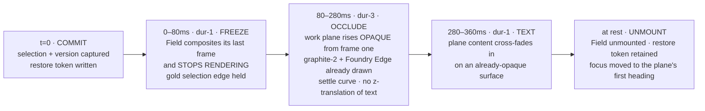
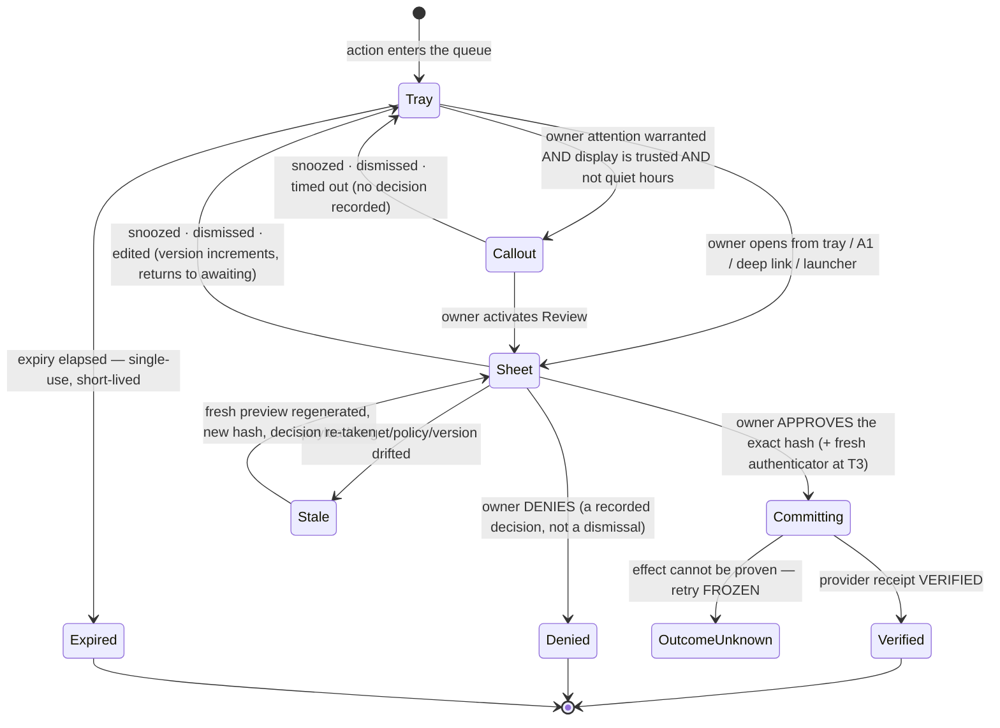
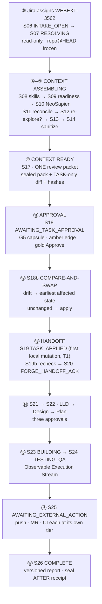

# 24 — Prototype Specification: **Zeno Assistant + Zeno Command**, in B+C

**Phase 0B · Gate 2 prototype round · Worker: Zeno design lane · Date: 2026-08-28**
**Direction: B+C**, selected by the owner from the Gate-2 direction board on 2026-08-28 (`00-DECISIONS`).

---

## 0. What this document is, and the seam it exists to specify

This is the **detailed prototype specification for the Assistant and Command halves of the suite** in the
selected direction. It is precise enough that an interactive prototype could be built from it: layouts,
states, tokens, motion, keyboard maps, budgets and failure behaviour. It is **not product code**, and it
describes **no running behaviour** — no Jira connector is connected, six of nine trigger classes are
`not_configured` (`11-IA` §4.5), and every payload below is a *design*, not an observed run.

### 0.1 What B+C means, stated once

> **The 3D Standing Field is the Overview and the way you navigate. The moment you go to work — Command
> lists, Forge code, Counsel — surfaces become calm, near-opaque, flat planes with luminous edges.**
> *3D where it helps, quiet where you read.*

B+C is **not** a third brand and **not** a blend of two palettes. It is one direction that resolves each
morphological axis (`20-` §6) by naming **which half of the product the axis applies to**:

| Axis | Overview / navigation half | Work / reading half | Source of truth |
|---|---|---|---|
| **A · Signature geometry** | **The Standing Field** — bounded, matte, axonometric, centreless | **The Foundry Edge** — no hero object; planes defined by a 1 px raking key-line | `22-B` §2 · `22-C` §1.5, §2 |
| **B · Information architecture** | **B4 object-primary** — objects are the spine | **B1 section → view → detail** | `22-B` §3 · `11-IA` §7 |
| **C · Spatial depth** | Field is a **near-opaque content plane** at Layer 1 | Flat reading planes + one floating control layer (C1) | `22-C` §1.5 |
| **D · Panel composition** | Field is always the **second pane of a list⇄field master-detail** | D2 / D3 | `22-B` §2.2 |
| **E · Material opacity** | **E1 near-solid, everywhere, including the Field** | E1 | `22-C` §1.5 |
| **F · Type / density** | Operational (F2), mono-forward telemetry | F2 Command · F3 Forge · F1 briefings | `22-C` §1.3 |
| **G · Topology** | **G3** list-primary + interactive node view with full keyboard parity | G1 — no canvas on any work surface | `22-B` §2.2 |
| **H · Motion** | **H1 bounded** — Field states carry motion, each mapped to one real state | **H2 shape/iconography-forward** — motion minimal, no idle animation | `22-B` §1.6 · `22-C` §1.6 |
| **I · Wake** | The Field **settles into its real state** (I2) | Instant under reduced-motion (I4) | `22-B` §7 · `22-C` §7 |

**The one synthesis decision that is genuinely new here, and the reason B+C is coherent rather than a
compromise: B+C buys depth with *geometry*, not with *glass*.** Direction B spent part of its budget on an
E2 live-blur control tier; B+C does not. The Field is an **opaque content plane**, the nav rail is
**opaque with the Rail Seam** (`22-C` §2), and the translucent Layer 2 shrinks to `22-C`'s near-solid
E1 setting — launcher, Approval Capsule, agent-state chips, wake, Counsel HUD, all heavily scrimmed, all
small, all short-lived. Every "richness" token in this direction is spent on the one surface where spatial
comprehension does real work, and nowhere else.

### 0.2 The seam law — the most important rule in this document

The Standing Field renders in **exactly six places**, and is **prohibited everywhere else**:

| Field renders here | Role | Default |
|---|---|---|
| **Ø Overview** *(new top-level node, above Today)* | The Field **is** this view — primary navigation surface | Field + docked list, split |
| `W2` Tasks & Runs | Secondary pane of list⇄field | List only |
| `W3` Agents | Secondary pane of list⇄field | List only |
| `K6` Device Fleet | Secondary pane of list⇄field | List only |
| `C4` Knowledge & Graph | Secondary pane of list⇄field | List only |
| `W2.1` Run Detail | Toggleable **inspector-scale** DAG, docked right or slide-over | Off |

**Prohibited, without exception:** behind or beneath any code, diff, terminal, transcript, table,
approval, long text or list; in `T1` Today, `T2` Briefings, `T3` Task Candidates; in `A1` Approval Center
or the `G5` Approval Capsule; in `W1.1` Intake Detail; anywhere in Forge's editor/diff/terminal/QA planes;
anywhere in Counsel's live overlay; in Settings, Diagnostics tables or the `G3` main-agent chat.

Three corollaries, each testable:

1. **No text is ever legibly composited over a rendering Field.** The work plane is opaque from its first
   frame and *occludes* rather than overlays (§2.1).
2. **The Field adds comprehension, never capability.** Every Field operation exists on its list with the
   same keyboard, the same tier and the same receipt. A user can run the entire product having never
   opened it (`11-IA` principle 7; WCAG 2.1.1).
3. **A settled Field stops rendering.** No frame is drawn until the next real event
   (`10-PRD` DESIGN-PERF-AC-01).

### 0.3 Inherited, not re-derived

The **shared Zeno Glass token family is `22-C` §1 verbatim** — palette, four-channel colour law,
typography, spacing, radii, the three-layer depth budget, the Foundry Edge token set, the motion tokens
and the twelve-state vocabulary. The **Standing Field geometry, its node/edge grammar and its 2D-parity
obligations are `22-B` §2 verbatim**. Nothing below re-opens either. Two tokens are *added* as declared
B+C permutation rows, using existing palette values only and introducing no new hex:

| Added token | Value | Job | Why it is not a fork |
|---|---|---|---|
| `edge-focus` | 2 px solid `#86DEEC` (the `cyan-info` **text tint**, `22-C` §1.2), 2 px offset | The focus indicator on every surface, including Field markers | `22-C` mandates "focus a real border, never a glow" but names no colour; this binds it to an existing family value that clears 3:1 on `graphite-1…5` |
| `motion.ceremony` | 1200 ms, calm custom curve | Wake only; skippable, interruptible | Carried in from `22-B` §1.6 unchanged, because B+C's wake resolves into the Field |

Invariants held throughout and not restated per surface: dark-first graphite with Dark/Light/System/
High-Contrast; **≤ 3 depth layers**, glass only on nav-adjacent controls/overlays/agent-state/wake, never
behind code/diffs/transcripts/tables/approvals/long text, **no glass-on-glass**; **the list is primary
everywhere**; **every animation maps to exactly one real state**, no perpetual loops, no fabricated
telemetry, no meaningless waveform; **truthful state** — a success animation never precedes a verified
receipt; **semantic colour reserved** — amber = approval/warning, red = blocked/error/destructive/denied
only, gold = owner selection, cyan = information/listening, `verify-green` = a verified receipt exists;
**WCAG 2.2 AA** — 4.5:1 text, 3:1 controls and graphics against the **worst-case** backdrop, focus a real
border, 2.4.11 Focus-Not-Obscured, 2.5.8 ≥ 24 px targets, 2.2.2 pause/stop/hide, 2.3.1 no flash;
**hardware is UNKNOWN (B-002)** — every performance figure below is an authoring budget or a target to
measure, never an achieved result, and the 2D/no-GPU path is always functional.

### 0.4 What this document is not

It is not Gate 2 approval, not permission to build, and not legal clearance. No reel asset, trade dress,
shader, audio, layout or code is reproduced anywhere; the signature is stated **against** the forbidden
compositions in §1.12.

---

# PART I — THE STANDING FIELD

## 1. The Standing Field as Overview

### 1.1 Where it sits, and what it replaces

The Field is promoted to a **new top-level IA node, `Ø Overview`**, sitting above `1 TODAY` in the
canonical nav tree (`11-IA` §7). This is the only structural change B+C makes to the IA, and it is made
because the owner selected the Field as *the way you navigate*. Depth stays capped at three
(`section → view → detail`); Overview is a section whose primary view happens to be spatial.

`Ø Overview` answers exactly one question — **"what is my system, and where is anything running right
now?"** It is deliberately *not* Today. Today answers "what needs me?" and is a feed; Overview answers
"what exists and how is it connected?" and is a topology. Neither is allowed to become the other.

```
┌─────────────────────────────────────────────────────────────────────────────────────────┐
│ G1 STATUS RAIL  device · mic · capture · model · network · privacy-zone · safe-mode     │
├────────────────┬─────────────────────────────────────────────┬──────────────────────────┤
│ NAV RAIL       │  THE STANDING FIELD                         │  INSPECTOR               │
│ opaque, Seam | │  near-opaque CONTENT plane, graphite-2      │  opaque plane            │
│                │  fixed dimetric vantage, bounded            │  selected object:        │
│ Ø Overview     │  ┌──────────────────────────────────┐       │   fields, state          │
│ 1 Today        │  │ R0 ─ R1 ─ R2 ─ R3 ┊ R4           │       │   edges as a LIST        │
│ 2 Work         │  │ rank bands, always labelled      │       │   receipts               │
│ 3 Approvals    │  │ ┊ = the egress boundary          │       │   actions at tier        │
│ 4 Products     │  └──────────────────────────────────┘       │                          │
│ 5 Context      │  [1..4 detail] [M motion] [list|split]      │                          │
│ 6 Capabilities ├─────────────────────────────────────────────┤                          │
│ 7 Diagnostics  │  THE OBJECT LIST  (primary, always there)   │                          │
│ 8 Settings     │  name, class, rank, state, live             │                          │
│                │  edges, coverage, as_of, pin                │                          │
│                │  > one row per object, keyboard-first       │                          │
├────────────────┴─────────────────────────────────────────────┴──────────────────────────┤
│ G3 MAIN-AGENT CHAT (persistent, collapsible)   G6 context + egress chips                │
└─────────────────────────────────────────────────────────────────────────────────────────┘
  G2 Launcher Ctrl-K (Layer 2)   G4 Pause/Kill (always visible)   G5 Capsule (tray)
```

**The list is not hidden behind a toggle in Overview.** Field and list are co-resident by default in a
split; `⊟` collapses the Field, never the list. There is no layout in which the Field exists and the list
does not.

### 1.2 The rank axis — depth is provenance distance

The receding axis is an **ordinal semantic axis**, never parallax and never decoration: *how many trust
boundaries a request crosses to reach this object*. Five bands, **always labelled**, always mirrored by a
`rank` column in the list.

| Rank | Band label (rendered) | Holds | The governance question it answers |
|---|---|---|---|
| **R0** | `R0 · you + this host` | The owner marker (gold) and the local device | This is the origin of authority |
| **R1** | `R1 · authority` | The **Orchestrator** — one node, exactly one | The single runtime authority and approval boundary |
| **R2** | `R2 · execution` | Active agents, and any paired device acting as an executor | What is doing work right now, on whose behalf |
| **R3** | `R3 · capability` | Repos and worktrees, skills, MCP servers and tools, local indexes | The surface an agent reaches *through* — still on-device |
| **R4** | `R4 · egress` | External providers and accounts (Jira, GitLab, CI, Slack, NeoSapien) | Off-device. Crossing into R4 is always a T2/T3 question |

**The R3/R4 line is the egress frontier and it is drawn, not implied.** A single continuous 1 px
`graphite-7` rule runs across the plane between R3 and R4, labelled `egress boundary`. It is the one
piece of chrome in the Field that is not an object, and it exists because "what leaves this device" is
the question the whole approval system is built around.

**A worked distinction that the taxonomy must survive:** a repository is *two* nodes. The local
worktree at `~/Work/browser-add-on` is a **repo** node at R3. Its GitLab remote is a **source** node at
R4. The edge between them is `publishes-to`, dashed until a push is actually in flight. Rendering them
as one node would put an external write inside the local band — exactly the collapse the rank axis
exists to prevent.

### 1.3 Node taxonomy — five classes, a closed set

Five classes. The set is **closed**: an object that does not fit is not drawn, it is listed with a
`class: unclassified` row and a defect is filed. Class is carried by **shape + label + rank**, never by
colour — all five classes are the same matte graphite face.

| Class | Rank(s) | Marker footprint | Label (Inter 12) | Sub-label (JetBrains Mono 11) | Renders when unknown |
|---|---|---|---|---|---|
| **core** | R1 | **Square**, 1.25× base footprint | `Orchestrator` | `authority · leases: n` | Never absent. If unreachable → `blocked` marker + reason; the Field does not render without it |
| **agent** | R2 | **Rounded square**, radius `4` | Agent name | `mode · lease · budget` | `not_configured` marker with the reason and the one action |
| **device** | R0 (this host) / R2 (paired executor) | **Wide rectangle**, 2:1 | Device name | `trust · capture · thermal` | `unpaired` / `unsupported`; never a fabricated resource figure (B-002) |
| **repo** | R3 | **Notched rectangle** (a corner clipped at 45°) | `repo · branch` | `HEAD abcd1234 · worktree` | `not_configured`; a frozen HEAD renders the freeze glyph |
| **source** | R3 (local) / R4 (external) | **Chevron**, apex pointing away from R0 | Provider name | `acct · as_of · coverage tag` | **`not_configured` is a legible value, not a blank** — six of nine classes are this today |

**The `core` node is a node, not a centre.** It is not centred, not larger for drama (its 1.25× footprint
encodes "one node holds all leases", is labelled, and is the only scale delta in the system), not
emissive, and carries no ring, halo or orbit. Nothing is arranged radially around it. Its identity comes
from its label, its glyph and its rank — read it in the list and you learn the same fact.

**Within-band arrangement** is a stable deterministic sort (class order as tabled above, then name), laid
on a regular groundplane grid. It is **not** force-directed, **not** clustered by affinity, and **not**
animated to re-settle: the same objects always land in the same cells, so the Field is memorable and a
screenshot is comparable. When the set changes, new markers appear in place with a `dur-2` cross-fade;
existing markers do not move unless the sort key genuinely changed.

### 1.4 Marker anatomy

Every marker is a **matte, flat-topped, opaque low plinth**. It does not glow, float, orbit, tilt or
bob. Depth is read from the Foundry Edge treatment (`22-C` §1.5) applied to the marker's own faces: a
1 px `edge-key` on the top/left face boundary, a 1 px `edge-shadow` on the bottom/right.

| Zone | Content | Rules |
|---|---|---|
| **Top face** | Label · state glyph · up to 2 badges | Label always ≥ 4.5:1 on the face fill; never truncated below 8 characters — beyond that the marker de-labels to a class glyph + count and the full name lives in the list and the tooltip |
| **State glyph** | The `22-C` §1.7 glyph for the object's current state | Icon **and** label in the list; on the marker the glyph is mandatory and colour is secondary |
| **Badge 1** | Tier of the pending action, if any (`T2` / `T3`) | Amber outline, shape + text |
| **Badge 2** | Coverage tag for `source` nodes (`Matches`/`Empty`/`Processing`/`Unavailable`/`NotAuthorized`/`Stale`/`NotSearched`/`Unknown`) | Text, from the `11-IA` §5.4 closed union — **never collapsed to a dot** |
| **Base ring** | *(absent)* | There is deliberately no ring, halo or ground-glow of any kind |
| **Face fill** | `graphite-3` at rest | Hover `graphite-4`, selected `graphite-5` |

### 1.5 Edge grammar

Edges are **flat, typed, labelled ribbons on the groundplane**, drawn between marker footprints, never
arcing through the air and never crossing the egress boundary rule without a label stating the crossing.

| Rendering | Means | Drawn when | Never |
|---|---|---|---|
| **Solid** 1.5 px `graphite-8` | **Direct invocation** — a real, currently-authorized call path this object uses directly | The relation exists in the live capability graph *and* has been exercised or is authorized now | A hoped-for or documented-but-unauthorized relation |
| **Dashed** 1.5 px `graphite-7`, 4/4 dash | **Proposed or aggregated** — (a) a planned dependency in an unapproved plan, or (b) a bundle standing in for *n* collapsed edges | A plan proposes it, or the edge budget collapsed *n ≥ 2* real edges into one | Anything that is actually invoking right now |
| **Moving particle** — 1–3 motes, `cyan-info`, travelling source→target | **Live work, and only when real** | One particle per **real in-flight unit of work** with a real event id, for exactly the duration of that unit | Idle drift · ambient flow · a loop · a "system is alive" flourish · a particle without an event id |
| **Red edge** 2 px `red` + square-stop glyph at the blocked end | The dependency is **blocked**; the reason is in the list and the tooltip | A real guard failed | Decoration; a "slow" or "degraded" state |
| **Gold edge** 1.5 px `stoic-gold` | The edge the **owner selected** in the list (an edge is selectable) | Owner selection only | A status |

**Edge types are named**, and the name renders as a label on hover/focus and as a column in the edge list:
`invokes · reads · writes · publishes-to · depends-on · feeds · blocks · verifies · holds-lease-on`.
An unnamed edge is a defect, not a fallback.

**The particle contract, stated in full, because it is the single easiest place in this direction to
fabricate telemetry (F6):**

1. A particle exists **iff** the runtime has emitted a typed in-flight event carrying an id, a source, a
   target and a start timestamp. No event ⇒ no particle. There is **no** "probably busy" particle.
2. Particle **rate encodes nothing.** Speed is a constant; it is not a throughput indicator, and no
   number derived from particle motion is ever displayed.
3. **Caps:** ≤ 3 particles per edge, ≤ 24 across the whole Field (the `22-C` §1.6 mote budget). Beyond
   the cap the edge renders a mono count chip — `×12 in flight` — which is a real number bound to a real
   queue depth, or it renders nothing.
4. Particles **stop** when the unit completes, fails or is cancelled. On completion the edge does not
   flash; the *target marker* takes its new state glyph, and `success` waits for a verified receipt.
5. **WCAG 2.2.2:** the Field header carries a persistent, keyboard-reachable **`Motion: on/off`** control
   (a real control, not a buried setting) because particle motion can exceed 5 s. Under
   `prefers-reduced-motion` or with the control off, every live edge renders a **static `live` glyph plus
   the count chip** and carries identical information.

### 1.6 Depth, scale and opacity rules

| Rule | Setting | Floor that overrides it |
|---|---|---|
| **Vantage** | One fixed dimetric angle (≈30°). Pan within bounds; the bounds are always visible | No free orbit, no dolly, no zoom-to-anything, no camera path. Ever |
| **Depth cue** | Rank band position + a 1 px band rule + the band label | Depth is never the *only* carrier of rank: the list has a `rank` column and every marker's tooltip states its band |
| **Scale** | Constant per class. The single exception is `core` at 1.25×, which is labelled | Scale never encodes importance, activity, size, cost or recency |
| **Atmospheric attenuation** | Far bands may darken their **face fill** by at most **one graphite step** (R4 faces sit at `graphite-2` where R0 sits at `graphite-3`) | **Labels, glyphs, badges and edges never attenuate.** All text holds ≥ 4.5:1 and all state graphics ≥ 3:1 at every band. If a fill step would break a floor, the step is not applied |
| **Occlusion** | A nearer marker may overlap a farther one by at most 25% of the farther marker's footprint; the grid sort guarantees no label is ever occluded | If the layout cannot satisfy this at the current detail level, the Field **aggregates** (§1.10) rather than overlapping |
| **Shadow** | A single 1 px `edge-shadow` line per marker | No soft drop shadow, no bloom, no ambient occlusion pass, no depth-of-field blur |

### 1.7 Interaction states on the Field

Six visual states, strictly disjoint, each carried by **at least two channels**. Selection, focus and
system-activity are three different things and must remain readable when they coincide.

| State | Rendering | Second channel | Announced |
|---|---|---|---|
| **rest** | Face `graphite-3`, `edge-key`/`edge-shadow` | Label + state glyph | Row present in list |
| **hover** | Face `graphite-4`; tooltip after 400 ms | Cursor + tooltip text | *(pointer only; not a state for AT)* |
| **focus** | **2 px solid `edge-focus` `#86DEEC` outline, 2 px offset, drawn outside the marker footprint** | The marker lifts to full contrast even if attenuated | `"{name}, {class}, rank {n}, state {s}, row {i} of {N}"` |
| **selected** (owner) | 1 px `edge-select` `stoic-gold` on the marker's own edges + face `graphite-5` | The list row takes the same gold left-edge; the inspector fills | `selected` |
| **active** (system) | 1 px `edge-active` `cyan-info` on the **leading** edge only + the `executing`/`retrieving` glyph | The feeding edge carries particles or a count chip | Live-region update, throttled |
| **blocked** | 2 px `red` edge + square-stop glyph + the marker's reason line | Red row marker in the list + the reason sentence | `blocked: {reason}` |

**Focus vs active must never be confused.** They differ on three axes simultaneously: *geometry*
(outside-the-footprint outline vs on-the-edge key-line), *weight* (2 px vs 1 px) and *tint* (`#86DEEC`
text tint vs `#38C3D6` accent). This three-way separation is a **claim to be measured** (§9), including
with a colour-vision simulation, because it is the most fragile visual distinction in the direction.

**The twelve states on the Field** (vocabulary from `22-C` §1.7, unchanged; rendering permuted for markers):

| State | Marker | Edge | Motion (full) | Motion (reduced) |
|---|---|---|---|---|
| asleep | dim face, hollow-dot glyph | none | none — Field stopped rendering | none |
| waking | face lifts one step | Seam ignites | one settle, `dur-4` | instant |
| listening | caret glyph on the R0 device marker | none | none | none |
| transcribing | advancing line-caret on R0 device | none | glyph tick, `dur-1` | none |
| retrieving | bracket-scan glyph on the *consumer* | **the feeding edge lights + particles** | particle travel, real duration | static `live` glyph + count |
| planning | outline-list glyph on the agent | **dashed** proposed edges appear | dashed edges cross-fade in, `dur-2` | instant |
| executing | filled-bar glyph bound to the real step | solid edge lit + particles | one marker pulse **per real step**, `dur-1` | glyph change only |
| awaiting-approval | amber caret + `T2`/`T3` badge | edge held, no particles | none — it rests | none |
| paused | two-bar glyph, face dimmed one step | edges neutral | none | none |
| blocked | red square-stop + reason | red edge | none | none |
| success | check + `verify-green` seal + `verified · HH:MM` | edge returns to solid rest | seal draw `dur-2`, **after the receipt** | instant seal |
| error | red X + error copy (distinct from blocked) | red edge | none | none |

### 1.8 Keyboard navigation, and the rule that makes parity real

**The DOM is the list. The Field is a painted projection of it.** This is an implementation constraint,
stated here because it is the only structure that makes WCAG 2.1.1 parity provable rather than promised:

- Every object is a **real focusable element in the object list**, in the canonical order (rank-major,
  then class, then name). Screen readers, Voice Control, Full Keyboard Access and Find-in-page all
  traverse that list.
- The Field's markers are **painted** (SVG/canvas) and carry **no independent focus targets**. Focus in
  the Field is drawn by projecting the *list's* current focus onto its marker. There is therefore no
  possible drift between tab order and visual order — they are the same order by construction.
- The Field container itself is a single tab stop with a labelled description and a "skip Field" link.

| Key | Action | Notes |
|---|---|---|
| `Tab` / `Shift+Tab` | Move between regions: rail → Field → list → inspector → chat | Regions are landmarks; `F6` cycles regions directly |
| `↑` / `↓` | Previous / next object **in canonical list order** | Field selection follows; the Field pans only if the marker is out of bounds |
| `←` / `→` | Previous / next object **within the current rank band** | Wraps within the band, never across it |
| `[` / `]` | Move one rank band toward R0 / toward R4 | Announces the band label |
| `Home` / `End` | First / last object | |
| `Space` | Select (owner selection, gold) | Selection is one model, shared with the list |
| `Enter` | **Commit** — open the object's work surface (§2) | The seam transition |
| `E` | Expand this object's **edges as a list** in the inspector | Every edge is a row: type · direction · peer · state · last-exercised |
| `1`…`4` | Set detail level Z0…Z3 (§1.11) | Discrete; never continuous zoom |
| `\` | Toggle `⊟ list only` / `⊞ split` | List can never be collapsed |
| `M` | Toggle Field motion (the 2.2.2 control) | Persistent, visible, keyboard-reachable |
| `.` | Re-frame to the current selection | Bounded `dur-4` reframe; never a swoop |
| `Esc` | Return focus to the list | |
| `/` | Filter (class, rank, state, coverage tag, live-only) | Filters the **list**; the Field reflects the filtered set |

Every action above is reachable from the list's own row menu with the same keyboard, and every one is
also a launcher (`G2`) verb — the Field introduces no exclusive gesture.

### 1.9 The synchronized list equivalent

The list is not a fallback; it is the record. Columns (all sortable, all in the accessible table):

| Column | Content | Notes |
|---|---|---|
| `name` | Object name | Row link → inspector |
| `class` | core / agent / device / repo / source | Text, not an icon alone |
| `rank` | `R0`…`R4` + band label | The list's carrier of the depth semantic |
| `state` | One of the twelve, as **glyph + word** | Never colour-only |
| `live` | `—`, or `n in flight` (mono) | The list's carrier of the particle semantic |
| `edges` | `n in · n out` → expands to the edge table | The list's carrier of the topology |
| `coverage` | Closed-union tag for `source` nodes | `Matches`/`Empty`/`Processing`/`Unavailable`/`NotAuthorized`/`Stale`/`NotSearched`/`Unknown` |
| `as_of` | Timestamp + timezone (mono, tabular) | An `Empty` without its timezone is not a verified no-match (`11-IA` §5.4) |
| `pin` | Owner-pinned (gold) | Owner channel |

**The parity contract**, testable as a checklist:

| Guarantee | How it is enforced |
|---|---|
| Tab order = row order | The DOM *is* the list; markers are painted (§1.8) |
| Selection is one model | One selection store; the Field subscribes, it does not own |
| Every Field operation exists on the list | Every operation is a list-row action **and** a launcher verb; the Field binds keys to the same handlers |
| No datum is Field-only | The Field renders only fields that appear as list columns or inspector rows |
| Counts agree | A single lint asserts `visible markers + aggregated count = list row count`, and the Field header states both: `48 of 61 drawn · 13 aggregated` |
| Field can be absent | `⊟` is a first-class layout; a Field render failure degrades to list-only with a named error, never a blank pane |

### 1.10 Budgets, and what happens when they are exceeded

These are **authoring budgets, not performance claims.** Hardware is unknown (B-002); the real
thresholds must be measured on the pilot machine and the numbers below re-derived from that measurement.

| Budget | Soft (aggregate beyond this) | Hard (refuse beyond this) |
|---|---|---|
| Markers drawn | 48 | 96 |
| Edges drawn | 96 | 192 |
| Particles in flight | 24 total, 3 per edge | 24 — the cap is the hard cap |
| Labels rendered | 48 | Beyond 48, markers de-label to class glyph + count |
| Rank bands | 5 | 5 — the axis is closed |

**Overflow behaviour, in order:**

1. **Aggregate within (rank × class).** *n* markers collapse into one **group marker**: same footprint,
   label `12 sources`, mono sub-label listing the dominant states (`8 not_configured · 3 healthy · 1 blocked`).
   A group marker's edges become **dashed aggregated** edges with a count.
2. **State the aggregation, always.** The Field header renders `48 of 61 drawn · 13 aggregated` in mono.
   Aggregation is never silent, and a group marker is visually distinct (double `edge-key` line) so it
   can never be mistaken for a single object.
3. **Never truncate the list.** The list always contains every object. If the Field cannot draw the set
   at any detail level, it renders `Field unavailable at this scale — 412 objects; use the list or a
   filter`, and the list is the complete record. This is a **degraded** state with a named cause and a
   named action, never an empty pane and never a silent drop.
4. **Filters are the intended escape**, not zoom: `/` filters the list by class, rank, state, coverage or
   live-only, and the Field draws the filtered set with the filter stated in the header.

### 1.11 Semantic zoom — the path from field to inspector

Detail level is **discrete, owner-controlled and never automatic**. It changes *what is drawn*, not where
the camera is; the vantage never moves.

| Level | Key | What is drawn | What the list does |
|---|---|---|---|
| **Z0 · Bands** | `1` | Five band markers only, each with a class breakdown in mono | List groups by rank, collapsed |
| **Z1 · Classes** | `2` | One group marker per (rank × class), with counts | List groups by rank + class, collapsed |
| **Z2 · Objects** *(default)* | `3` | Individual markers: label + state glyph + badges | Flat list, all rows |
| **Z3 · Face** | `4` | The **selected** marker's top face expands in place to a 3–5 field summary — name, state, rank, last-exercised, pending tier — in Inter/mono at ≥ 4.5:1 on the opaque face | List row expands to the same 3–5 fields |
| **Inspector** | `Enter` on the list row, or click the marker's `open` affordance at Z3 | *(no longer the Field)* — the flat opaque inspector plane fills the right pane | Row shows selected |
| **Work surface** | `Enter` on the marker or the row | **The seam** (§2) — the Field gives way entirely | View changes |

Z3 is the last level that is still the Field, and it is deliberately shallow: at most five fields, no
long text, no code, no diff, no transcript, no approval. **The moment content would need to be read
rather than glanced, it belongs on a plane** — that is the seam, and Z3 is the last step before it.

### 1.12 Non-identity proof

| Forbidden composition | Why the B+C Standing Field cannot be mistaken for it |
|---|---|
| **F1** cyan sphere + gold halo + radial capability labels | There is **no round hero, no sphere, no ring, no halo, no emission**. Capabilities are markers on an ordinal grid and rows in a list, never labels on a radial. `cyan-info` appears as a 1 px edge, a particle mote and a focus-adjacent tint — never as a glowing core. `stoic-gold` marks **owner selection only** and never a status. |
| **F2** orange brain + concentric department rings | **No centre and no rings.** The `core` node is one labelled square at R1, not centred and not orbited; nothing is arranged radially. Depth is a **straight ordinal provenance axis**, not concentric circles. Domains carry no per-domain hue — all five classes are the same matte graphite, separated by *shape*. This is the closest surface in the whole set to F2, so centrelessness, the ordinal axis, typed labelled edges, shape-not-colour class encoding and strict list-primacy are its named guardrails, and an independent similarity review is a Gate-3 blocker (§9). |
| **F3** three tilted smoked-glass cards on a curved rail | Markers are **matte, opaque, flat-topped, axis-aligned** on a flat grid — never tilted, never glass, never on a curved rail, and there are as many as there are real objects, never exactly three. Today is a vertical list, not a carousel. |
| **F4** domain-to-red mapping | Red is reserved to blocked/error/destructive/denied. No class, rank, provider or domain ever carries a semantic colour. |
| **F5** full-screen white flash | Every transition is a bounded dark cross-dissolve; the only moving elements are ≤ 24 low-luminance motes; there is no white frame anywhere in the system. |
| **F6** fabricated telemetry | The particle contract (§1.5) makes liveness *unrenderable* without a real event id; scale encodes nothing; no rate, throughput or frame figure is displayed; `not_configured` renders as itself. |
| **F7** gesture/voice as authorization | Nothing in the Field approves anything. Selecting, framing, filtering and opening are all reads. Approval lives only in the Capsule (§4), hash-bound and explicit. |
| Reel galaxy / accretion-disk / particle-vortex hero | Fixed dimetric survey vantage, a visible bounded groundplane, a labelled ordinal axis, no stars, no orbits, no central void, no swooping camera, no particle field. "Field" means *a surveyed plane*, never a force field. |

---

# PART II — THE SEAM

## 2. Field → work: how the spatial surface gives way to flat planes

This is the transition B+C exists to get right. It happens dozens of times a day, and if it is wrong the
product feels like two applications stitched together.

### 2.1 The transition, frame by frame

**Trigger.** `Enter` on a focused marker or list row, activation of a marker's `open` affordance at Z3, a
launcher verb that resolves to a work surface, or a deep link (`zeno://…`). All four run the identical
sequence — there is no "spatial" variant and no "fast path".



**The four rules this sequence enforces:**

1. **The work plane is opaque from its first frame.** It *occludes* the Field; it never overlays it.
   There is no frame in which any text, code, table row, approval field or transcript line is legibly
   composited over a spatial image. This is the mechanical guarantee behind "content is never on glass"
   and "never behind code", extended to "never over the Field".
2. **The Field stops rendering before the plane starts moving.** The freeze precedes the occlude. The two
   never render simultaneously, so the transition's cost is one composite, not two live surfaces.
3. **Nothing blurs.** The work plane does not blur the Field behind it (there is nothing behind it), and
   no `backdrop-filter` is involved in the seam at any point.
4. **Focus is moved deliberately, once.** At rest, focus lands on the work plane's first heading, and the
   accessible name announced is `"{view name} · {object name} · {state}"`. It is never left orphaned on
   an unmounted marker.

**Reverse (work → field):** `Esc` at the top level of a work view, the `Back to Overview` control, or
`Ø` in the launcher. The plane fades out `dur-2`; the Field remounts and **restores exactly**: detail
level, pan offset, filter, sort, selection and focused row. It does **not** replay the wake settle, and
it does not re-run any animation — a remount is not an event.

**From any list row anywhere: `Locate in Field`.** Available on every row in `W2`, `W3`, `K6`, `C4` and
the Overview list. It switches to `Ø Overview`, restores the Field at Z2, selects that object and frames
it. It is a **read**, it changes no state, and it is announced as a navigation.

### 2.2 What carries over the seam — and what must not

| Carried | How it appears on the flat plane | Why it must survive |
|---|---|---|
| **Object identity + version** | The plane's title block: name, class, `id` and `version` in mono | The same canonical versioned object is addressed from every surface (`11-IA` principle 2) |
| **Rank / provenance** | The **provenance ribbon** — a labelled chip in the plane header: `R4 · egress · Jira` plus a five-segment position glyph | The single most valuable thing the Field teaches; losing it at the seam would make depth decorative |
| **State** | The `22-C` §1.7 glyph **and word**, in the header, identical vocabulary | State must not change meaning across the seam |
| **Selection** | The row is selected in whatever list the work view leads with | One selection model, both directions |
| **Live edges** | The inspector's **`Upstream` / `Downstream` edge tables** — type · direction · peer · state · last-exercised | The topology becomes rows; the information is preserved, the geometry is dropped |
| **Coverage** | The coverage banner / the source row's closed-union tag and `as_of` | An honest absence must not become a blank on the plane |
| **Pending tier** | The `T2`/`T3` badge in the header, linking to the queued capsule | The approval path is the same object |
| **Restore token** | Held by the `Back to Overview` control | The return is exact, so the Field feels like a place, not a re-render |

| Deliberately **not** carried | Reason |
|---|---|
| Depth, vantage, perspective, any 3D affordance | Work surfaces are flat, orthogonal and opaque. Full stop |
| Markers, edges, particles, the groundplane | Topology on a work plane is a table |
| Any Field motion | Work surfaces are H2: motion minimal, bounded, state-mapped |
| Field-only colour usage | The four-channel law is identical on both sides; there is no "Field palette" |
| Camera state as a shareable link | `zeno://` links address objects, never viewpoints — a viewpoint is not a fact |

### 2.3 The three prohibitions of the seam

1. **No glass in the seam.** The transition uses opacity and an opaque surface. It never introduces a
   translucent intermediate, never a "frosted" wipe, never a blur ramp. Layer 2 is untouched by
   navigation.
2. **No approval survives the seam implicitly.** Opening a work surface from a marker is a read. If the
   object has a pending action, the plane shows the `awaiting-approval` state and a link to the capsule —
   it never pre-authorizes, pre-fills a confirmation, or shortens the approval path
   (`11-IA` §9.1: opening never approves).
3. **No state is invented to smooth the transition.** If the work surface's data is not yet loaded, it
   shows `loading` with a cancel, and `loading` **must** transition to `degraded` rather than spin
   (`11-IA` §8.1). The seam never renders a plausible-looking placeholder.

---

# PART III — THE ASSISTANT AND TODAY

## 3. Today & Attention, and the Assistant's own surfaces

### 3.1 Why Today is a list and never a field

Today answers *"what needs me?"*. That is a prioritised, threaded, deduplicated, time-ordered question,
and the honest rendering of it is a **vertical list on an opaque reading plane** — never a carousel
(rejects F3), never tiles that hide items, never a topology. The Field is prohibited here (§0.2). This is
also the direction's clearest answer to the reels: the same "glanceable multi-source briefing" need,
solved with threading, dedupe, coverage and age instead of three tilted cards.

### 3.2 Item anatomy

Every row carries the mandatory five (`COMMAND-AC-05`) as **labelled sub-fields**, not as prose. The row
is one focusable element; its sub-fields are readable in order by a screen reader without expansion.

```
┌──────────────────────────────────────────────────────────────────────────────────┐
│ | <state glyph>  TITLE - one plain sentence, Inter 14                    <T2>    │
│ | WHY NOW        you are assigned and the sprint ends in 2 days                  │
│ | WHAT CHANGED   status In Progress -> In Review, 2 new comments                 │
│ | SOURCE         Jira, WEBEXT-3562, as_of 09:12 IST        AGE  14m              │
│ | CONFIDENCE     high - provider-verified event, exact key match                 │
│ | IF IGNORED     the MR misses today's cut; no automatic action is taken         │
│ | [Open] [Snooze] [Dismiss] [Locate in Field]        thread > 3 related          │
└──────────────────────────────────────────────────────────────────────────────────┘
  | = the 2px left edge:  graphite-6 rest  ·  stoic-gold selected
                          amber awaiting-approval  ·  red blocked
```

| Field | Rendering | Rule |
|---|---|---|
| **State glyph** | `22-C` §1.7 glyph + the word in the row's accessible name | Never colour-only |
| **Title** | One plain sentence, provider-accurate language | Never a marketing summary; never implies an action was taken |
| **Why now** | The *trigger*, in the trigger's own words | The registry entry that fired, not a guess. If it fired on a schedule, it says so |
| **What changed** | A diff-shaped statement (`from → to`, counts) | If nothing changed and this is a re-surface, it says `re-surfaced · nothing changed since 08:40` |
| **Source + as_of** | Provider · object id · timestamp **with timezone**, mono tabular | A timestamp without a timezone is not a fact (`11-IA` §5.4, conflict J-3) |
| **Age** | Elapsed, mono, recomputed on render — **not animated** | No live ticking counter; age is a value, not a clock |
| **Confidence** | `high / medium / low` + the one-clause reason | Never a percentage unless a real calibrated score exists |
| **Consequence of ignoring** | What actually happens, including *"no automatic action will be taken"* when true | This field is where the product refuses to manufacture urgency |
| **Tier badge** | `T2`/`T3` if the item's action is consequential | Amber outline, shape + text |
| **Row actions** | `Open · Snooze · Dismiss · Locate in Field` (+ item-specific) | `Open` never approves; approval only ever happens in the capsule |

### 3.3 Threading and dedupe

- **Thread key** = the canonical object (`jira:WEBEXT-3562`, `run:{id}`, `intake:{id}`). Every signal about
  one object joins one thread; the thread renders as a single row with `▸ n related` and expands in place.
  A thread never splits across the list.
- **Dedupe key** follows `11-IA` §4.4 exactly: `{provider}:{object}:{issue_updated_iso}:{changelog_id}`,
  because a timestamp alone silently collapses two edits inside one clock granularity. The webhook is a
  **hint**; the read-only re-read at `T-11` and again at the CAS guard is the authority.
- **Events are assumed at-least-once, duplicated, delayed, missing and out of order.** The list therefore
  renders **gap markers** when a sequence hole is detected (`3 events may be missing between 09:02 and
  09:14 — refresh to reconcile`), and a **tombstone** row when an upstream object was deleted, rather than
  the row vanishing.
- **Re-ordering** on new priority uses a bounded `dur-2` settle of the affected rows only. Rows never
  flash, never page, never auto-open, and a re-order never moves a row that currently has focus — if the
  focused row's rank changes, the change is applied on blur and announced politely.

### 3.4 Coverage — the banner that makes "nothing today" honest

A **per-source coverage banner** sits above the list, always, in mono:

```
6 items across 4 of 6 configured sources  ·  1 unavailable  ·  1 still processing
▸ jira not_configured — no connector is connected · [Configure]
▸ neosapien not_configured — schema inspection only under scope record v1 · [Review scope]
```

Rules, taken verbatim from `11-IA` §5.4–5.6 and not re-derived:

- **"Nothing today" renders only when every configured source returned a proven `Empty`** with walked
  pagination and a stated timezone. Anything else renders as **`degraded` coverage that names the missing
  source and its one action**.
- A **count never renders without its denominator and its coverage.** A bare `6 items` is a lint failure.
- Coverage denominators are the **configured** source set, never the responding set.
- Each row renders `source · mark · one-line state sentence in the state's own words · as-of · what it
  blocks · the one action that would change it`.
- The aggregate follows the §5.5 lattice — `blocked` if any **required** source is
  `Unavailable/NotAuthorized/NotSearched/Unknown/Processing`; never a boolean.

**What this looks like today, honestly:** with scope record v1 in force, six of nine event classes are
`not_configured` (`11-IA` §4.5). Today will therefore render a short list and a long coverage banner. That
is the correct rendering and it must not be prettied up for the prototype — it is also a known demo
weakness (§9.9).

### 3.5 The view states of Today

| State | Rendering | The mistake it prevents |
|---|---|---|
| **empty** | `Nothing today.` **plus** the full coverage banner proving every configured source returned `Empty` with its window and timezone | "Nothing here" when the query failed |
| **loading** | Row skeletons, cancellable, coverage banner already showing what is known. **Transitions to `degraded`, never spins** | An infinite spinner standing in for an error |
| **streaming** | New rows append with a live tail; a **gap marker** renders if events were missed | Silently dropping events on reconnect |
| **approval** | Rows whose action is blocked on a hash-bound approval carry the amber left edge + tier badge and link to the capsule. **The list never approves** | A deep link that acts |
| **stale** | `as_of` watermark on the banner and on each affected row; the row states it cannot prove current state | Treating cached data as current |
| **outcome-unknown** | The row shows `outcome unknown`, retry frozen, and offers *inspect / reconcile / take over / prepare a new action* | Blind retry, double-send |
| **degraded** | The banner names each unhealthy source, its state sentence and its one action; the list still functions with **labelled reduced coverage** | Presenting partial as complete |
| **offline** | Local data only; the banner says so; **T2/T3 approvals cannot be granted for later execution** | Queuing an external write for "when we're back" |
| **error** | The view's own failure, named and distinct from a dependency's health | Collapsing app errors into "degraded" |
| **safe mode** | Only recovery controls render; the kill switch stays operable | A dashboard control becoming a permission bypass |

### 3.6 Briefings (T2) and Task Candidates (T3), in one paragraph each

**T2 Briefings** — morning / unlock / on-demand. Editorial density (F1) on an opaque plane: a short
cited summary, then the same item anatomy as T1. Every item carries source and age; a briefing with a
required source missing is **`partial`, never `complete`**; a briefing commits nothing, so
`outcome-unknown` does not apply. The briefing is **interactive before the wake ceremony finishes**, and
any input lands the owner straight in the UI.

**T3 Task Candidates** — read-only objects, permanently (`S04b`). They render with a visible
`read-only · this object can never mutate anything` chip. Controls: `Link Jira · Prepare Jira draft ·
Clarification draft · Promote (policy-gated) · Snooze · Dismiss`. `approval` here is the Jira-draft or
promotion path only. Manual Task Intake defaults **OFF** (conflict J-1), and when off the `Promote`
control renders **disabled with its reason and the setting that changes it** — never hidden
(`11-IA` principle 4).

### 3.7 The Assistant's own surfaces

**`G3` Main-agent chat** — persistent, collapsible, multimodal, streaming, on an **opaque reading plane**
(it is long text; never glass). Anatomy: the composer with `G6` **context and egress chips** above the
send control; the response stream with per-response chips; a mode/model/effort selector stated in mono;
the four commitment levels visibly separated (ask → converse → saved command → tool-using agent). Every
response carries: what context was used (source + `as_of`), what left the device, what was sanitized, and
`no context used` **as its own chip, never an empty state**.

**Presence and wake.** The Assistant's presence is the **Rail Seam** (a single vertical `cyan-info`
hairline down the left nav rail) plus the `G1` Status Rail read-out — never an avatar, never an orb,
never a waveform. The wake trigger is **always explicit and armed** — hotkey, wake phrase *"Zeno, attend"*,
push-to-talk, or configurable double-clap — with a **visible armed indicator**. **Gesture and voice are
presence signals, never authority** (F7): no utterance, clap, gaze or wake phrase can approve anything at
any tier.

**The wake ceremony in B+C** is `22-B`'s I2, disciplined by `22-C`: after legitimate OS authentication,
the ground lifts one luminance step, the Rail Seam ignites, and **the Standing Field settles once into
the owner's real objects at their real states** — then stops rendering. It is bounded
(`motion.ceremony` 1200 ms), skippable, interruptible, never focus-stealing, never delaying access, a
dark cross-dissolve with no white frame, and under reduced-motion it is an **instant cut** to a settled
Field with a briefing already interactive. Nothing in the ceremony is decorative: every marker it settles
is a real object, and if an object is `not_configured` the ceremony settles it as `not_configured`.

**Listening and transcribing** render as the `22-C` §1.7 **glyphs on the R0 device marker and in the
Status Rail** — a concentric caret and an advancing line-caret. There is **no waveform**, no level meter
and no fabricated audio visualisation anywhere in the Assistant.

---

# PART IV — THE APPROVAL CAPSULE

## 4. The Approval Capsule (`G5`), in full

The capsule is the **only** place in the suite where an external effect can be authorized. Everything
else — the Field, Today, the chat, the stream, a notification, a deep link, a wake phrase — is a read.
It is the same **canonical versioned object** as the notification, the Approval Center (`A1`) and the
phone; opening it from any of them never approves.

### 4.1 The ladder



Every arrow into `Committing` requires an **explicit owner action on the exact hash**. Approval **cannot**
be inferred from a wake phrase, voice identity, a notification open, silence, gaze, "looks good" outside
the bound flow, a previous approval, repeated behaviour, urgency, model confidence, standing autonomy, an
agent vote, or a notification action (`10-PRD` §2.2).

### 4.2 Stage 1 — the passive tray state

The tray/menu-bar glyph is the capsule at rest. It is the **quietest possible truthful presence**.

| Property | Specification |
|---|---|
| **Material** | Opaque. The tray glyph is not glass — it must be legible on any wallpaper, at any DPI, in any theme |
| **Content** | The `awaiting-approval` **amber caret glyph** + a count. Nothing else. No sender, no subject, no provider, no excerpt |
| **Count** | `n` pending, mono, tabular. `0` renders as the neutral rest glyph, not as a hidden icon |
| **Highest tier** | If any pending item is `T3`, the glyph carries a second static mark (a filled corner), because "there is a critical approval waiting" is materially different from "there are approvals waiting" |
| **Motion** | **None.** The tray never pulses, bounces, breathes or animates. A count change is an instant swap |
| **Sound** | None by default. Any sound is a registry setting, is suppressed in quiet hours, and never speaks content |
| **Quiet hours** | Suppress **interruption** only. The tray still shows the true count — quiet hours never hide state, never change authority, and never suppress a safe-mode alert (`11-IA` §4.3) |
| **Hover / focus** | `n approvals awaiting · highest tier T3` — a count and a tier, still no content |
| **Activation** | Opens the **sheet** (stage 3) directly. The tray never opens a partial view |

### 4.3 Stage 2 — the anchored callout, which never steals focus

The callout is the one *proactive* surface. It appears when the queue warrants attention, the display is
trusted, and quiet hours are not in force.

| Property | Specification |
|---|---|
| **Material** | Layer 2, `22-C` §1.5 — Tier-B blur ≤ 16 px, **heavy scrim so it reads near-solid**, 1 px `graphite-7` edge, `amber` outline while awaiting. Small, short-lived. No glass-on-glass, one backdrop-root |
| **Anchor** | Anchored to the tray glyph, on the same display as the tray. Never centred, never modal, never full-screen |
| **Focus** | **It does not take focus.** It is announced politely (`aria-live="polite"`), the owner's caret, selection and IME state are untouched (`DESIGN-MAC-AC-02`), and it is reachable by a **reserved global chord** when the owner chooses to go to it |
| **Focus-Not-Obscured (2.4.11)** | It is positioned so it never covers the focused control of the app beneath. If no position satisfies that, **it does not render** — it stays in the tray |
| **Content ceiling** | Title (one plain sentence) · provider + account · **tier badge** · expiry countdown · `Review` · `Snooze` · `Dismiss`. **That is the maximum.** No payload, no recipients, no body, no attachment names, no excerpt |
| **The one control it must not have** | **`Approve`.** Approval requires the sheet and the full payload. A one-click Approve on a summary is a blind Send by another name |
| **Motion** | Enters by moving/scaling a **pre-composited** surface (never fading a glass container — the backdrop-root trap), `dur-3` settle. Exits `dur-2`. Reduced-motion: instant |
| **Timeout** | Auto-returns to tray after a bounded interval. A timeout is **not** a decision: nothing is approved, denied or dismissed, and the item stays queued at full tier |
| **Masking** | Subject to §4.9 **independently of every other state** |

### 4.4 Stage 3 — the authenticated expanded sheet

The sheet is where a decision is taken. It is **near-opaque**, it is **scrollable**, and it shows **one
complete exact payload, never a partial stream** (`11-IA` §8.2 — `streaming` is not a valid capsule state).

| Property | Specification |
|---|---|
| **Material** | Layer 2 with the heaviest scrim in the system; under the solid-surfaces toggle it is fully opaque `graphite-3` with **zero information loss**. The **payload region inside it is always fully opaque** `graphite-2` — the payload is long text, and long text is never on glass |
| **Geometry** | A single column, `max-width` a comfortable reading measure, on the display that has the owner's attention. Not modal to the OS; modal within Command |
| **Focus** | Opening the sheet **does** move focus (the owner asked for it). Focus lands on the sheet's title; a focus trap holds inside it; `Esc` returns focus to the exact prior element |
| **Header (always visible while scrolling)** | Action title · provider + account · **tier badge** · expiry countdown · `action hash` (mono, truncated with a copy control) · masked-state indicator if applicable |
| **Footer (always visible while scrolling)** | The decision controls (§4.8). The footer never scrolls out of reach, and the controls never move position between capsules |
| **Authentication** | `T2` requires an explicit deliberate action on the exact hash. `T3` additionally requires a **fresh platform-authenticator confirmation** immediately before commit. On the Windows pilot with no platform authenticator present, **`T3` is blocked, not downgraded**, and the sheet says exactly that with the one action that changes it |

### 4.5 The exact payload preview — every field

Rendered in this order. A field that does not apply renders **`n/a` with a reason**, never as a blank
row. A field that cannot be resolved renders **`unresolved`** and **blocks approval** — the capsule
refuses rather than guesses.

| # | Field | Rendering | Never |
|---|---|---|---|
| 1 | **What will happen** | One sentence in **provider-accurate language** — `post a comment to WEBEXT-3562 as abheet.isher@quillbot.com` | "Send it", "finish up", or any phrasing that overstates the provider's guarantee (a Slack `ok:true` is not "delivered", "read" or "acknowledged") |
| 2 | **Action identity** | `action_id` · `version` · originating product · originating run/intake (deep link) | A link that acts |
| 3 | **Risk tier + why** | `T2 external write` + the one clause that determines the tier | A tier without its reason |
| 4 | **Target** | Provider · account/workspace · **acting identity** · region | An implied "your account" |
| 5 | **Resolved recipients** | To / CC / **BCC**, fully resolved, **distribution lists expanded** with their member count and names, **external domains flagged** | An unexpanded alias. A list that expands after approval is a different action |
| 6 | **Payload body** | The **complete exact** body, on an opaque plane, in the format it will be sent, scrollable, selectable, copyable | A truncated preview, a summary, a stream, or "…and 4 more lines" |
| 7 | **Attachments** | Name · size · **content hash** (mono) · classification | An attachment listed without a hash |
| 8 | **Visibility / permission** | Who will be able to see it, at what permission level, download policy, **revocation path** | "Shared" with no scope |
| 9 | **Schedule** | `now`, or the exact time **with timezone** | A time without a timezone |
| 10 | **Side effects** | Everything else this causes: notifications raised, webhooks fired, CI triggered, state transitions, watchers notified | A side effect discovered after approval |
| 11 | **Reversibility** | Can this be undone, by what mechanism, within what window — or **`irreversible`** stated plainly | Implying reversibility that does not exist |
| 12 | **Context chips** | What context was used: source · `as_of` · why included. **`no context used` is itself a chip** | An empty state where a chip belongs |
| 13 | **Sanitization chips** | Classes **included / omitted / transformed** · placeholders substituted · `view_manifest_id` · detector version · policy version | A green "sanitized" tick with no manifest |
| 14 | **Egress chips** | What leaves this device · to which provider/region · retention · local vs cloud model | A cloud call that is not stated |
| 15 | **Approval binding** | The **action hash** and the full bound tuple: `(pack_hash, patch_hash, base_file_hash, repo@HEAD, skills_manifest_hash, model, permissions)`, mono, copyable | A hash the owner cannot compare |
| 16 | **Expiry** | Absolute time + a countdown; **single-use, short-lived** | An approval that outlives its preview |
| 17 | **Provenance** | What proposed this: which run, which policy rule, which registry entry, at what time | An action with no origin |
| 18 | **Never rendered** | Raw secrets · raw quarantine content · private chain-of-thought · another zone's data | — |

**The completeness rule, stated as a test:** if any field 1–17 is missing, unresolved or elided, the
`Approve` control is **disabled with the reason on it**. There is no configuration, no expert mode and no
"I know what I'm doing" toggle that enables approval over an incomplete preview.

### 4.6 Context and sanitization chips — the anatomy of one chip

Chips are small, opaque, shape-and-text controls (never colour-only, never on the translucent layer as
accent-coloured text). Each is focusable and expands in place to its evidence.

| Chip | Face | Expands to | Rule |
|---|---|---|---|
| **Context** | `ctx · 4 sources` | Per-source: name, `as_of`, why included, and a link into `C1` Context Inspector | `no context used` is a chip, not a blank |
| **Included** | `incl · code, ticket` | The classes present in the payload | — |
| **Omitted** | `omit · 2 classes` | What was withheld **and why**, with the policy rule id | Over-redaction is also a defect: this chip is how the owner sees whether useful context was stripped |
| **Transformed** | `xform · 3` | Each transformation, its placeholder, its reversibility | Never shows the raw value |
| **Manifest** | `manifest 8f2c…` | `view_manifest_id`, purpose binding, detector + policy versions, link into `C2` | A sanitization claim with no manifest id is not a claim |
| **Egress** | `egress · Jira Cloud (eu)` | Destination, region, retention, whether a cloud model was involved | A silent cloud↔local switch is prohibited |
| **Zone** | `zone Z2 → Z4` | The zone crossing this action performs | Unknown/unclassified takes the most restrictive applicable policy |

### 4.7 Expiry, staleness and invalidation

| Condition | What the capsule does | What it never does |
|---|---|---|
| **Expiry elapsed** | State → `expired`. Controls collapse to `Regenerate`. The item stays in `A1` history with its expiry receipt | Silently extend, or approve after expiry |
| **Any change to target, account, recipients, thread, context, payload, attachments, visibility, schedule, provider schema, side effects, policy or executor** | **Invalidates** the approval, increments the version, returns to `awaiting-review`, and renders a **what-changed diff** between the previewed and current payload | Carry an approval across a payload change |
| **Version mismatch on open** (`zeno://approval/{id}?v=…`) | Renders **`stale`** with the `as_of` watermark and forces a **fresh preview** before any decision | Approve the version the link named |
| **Drift detected at commit (compare-and-swap)** | Commit is refused; the machine returns to the earliest affected state; a `cas-receipt` records what drifted | Apply on drift |
| **Approval already used** | Single-use: the control renders `already used · see receipt` | Permit a second commit attempt on one approval |
| **Offline** | `T2`/`T3` approvals **cannot be granted for later execution**; the sheet says so and offers `prepare` only | Queue an external write for "when we're back" |
| **Safe mode** | The capsule renders recovery information only; no approval is grantable | Become a permission bypass |

### 4.8 The nine canonical controls

Fixed set, fixed order, fixed position across every capsule so muscle memory is never punished.

| Control | Tier effect | What it does | What it never does | Key |
|---|---|---|---|---|
| **Edit** | — | Opens the payload for owner editing; **increments the version and returns to `awaiting-review`** | Preserve a prior approval across the edit | `E` |
| **Regenerate** | — | Asks the originating agent for a new draft; new version, new hash, `awaiting-review` | Auto-approve the regenerated draft | `R` |
| **Explain** | — | Plain-language *why this is proposed*: the trigger, the evidence, the policy rule, the confidence and its basis | Reveal private chain-of-thought (register #5) | `X` |
| **Open authoritative source** | — | Opens the provider's own object (the Jira issue, the MR, the thread) read-only | Act on the source; carry authorization | `O` |
| **Approve** | T2 explicit · **T3 + fresh authenticator** | Commits **exactly one** attempt bound to the hash tuple | Approve anything not fully previewed; approve over drift; approve twice | `⌘/Ctrl+Enter` |
| **Deny** | — | A **recorded decision** with an optional reason, fed back to the proposing rule | Be confused with dismissal; be silent | `D` |
| **Snooze** | — | Returns to tray until a stated time, **stated in the control** (`snooze until 14:00 IST`) | Change the tier or the expiry; silently drop the item | `S` |
| **Dismiss** | — | Removes the callout. **Not a decision.** The item remains queued at full tier | Be recorded as a denial; suppress the item from `A1` | `Esc` |
| **Do-not-draft-similar** | — | A **standing scope reduction**: creates a rule, shows the rule it created, and links to `A3` where it can be edited or removed | Create an invisible rule; be irreversible; widen any permission | `N` |

`Approve` is the **one control in the entire product that carries `stoic-gold`** — a gold `edge-select`
on focus. The gold moment in Zeno is the owner's own hand on the decision, never a system status
(this is the direct inversion of the reels' gold-as-status halo, F1).

### 4.9 Masked variants

Masking is evaluated **independently of every other state** and applies at all times, including during
quiet hours, in safe mode and while a capsule is already open (`SAN-AC-06`, `REVIEW-COMPANION-AC-02`).

| Condition | What renders | What is withheld |
|---|---|---|
| **Locked screen** | Generic **`Approval needed`** · count · `Unlock to review` | Sender, ticket, repository, branch, file, excerpt, payload, provider, recipients, attachments — everything in §4.5 |
| **Screen share / capture detected** | The sheet **collapses to the masked card in place**, with `Details hidden — this screen is being shared` and the one action `Move to a private display` / `Stop sharing` | Same as above. An already-open payload is **hidden immediately**, not on next render |
| **External / untrusted display** | Masked card only; the capsule will not open its payload on that display | Same |
| **Meeting privacy profile active** | Masked card only; Counsel's live overlay never hosts a capsule at all | Same |
| **Private mode** | Masked card only | Same |
| **Any display whose privacy cannot be verified** | **Fails closed** to the masked card, with the reason `overlay privacy unverifiable` | Same |
| **All of the above** | **Never spoken aloud** under any condition | — |

The masked card still shows: that an approval exists, how many, the **highest tier**, and the expiry
countdown. Those four facts are not content — withholding them would leave the owner unable to know a
decision is owed, which is its own failure.

**A masked capsule can never be approved.** There is no "approve without preview" path from any masked
state; the only forward action is to move to a trusted display or unlock.

### 4.10 Truthful lifecycle motion

| Lifecycle state | Rendering | Motion | The lie it prevents |
|---|---|---|---|
| `awaiting-review` | Steady **amber** capsule outline + amber caret glyph + the words `Awaiting your approval` | **None — it rests** | A pulsing capsule that manufactures urgency |
| `committing` | A **determinate** bar bound to the real outbox attempt, with the attempt number (`attempt 1 of 1`) | Bar advance tied to the real attempt | A spinner that implies work that is not happening |
| `verified` | `verify-green` receipt seal + check + `verified · HH:MM` + the provider's receipt id | Seal draws `dur-2` **after** the receipt is verified | A success animation before a verified receipt |
| `outcome-unknown` | `Outcome unknown` + **retry frozen** + `inspect source · reconcile · take over · prepare a new action` | None | A blind retry or a double-send |
| `denied` | Recorded, with the reason and the receipt | None | A denial that looks like a dismissal |
| `expired` | `Expired` + `Regenerate` | None | An approval that outlives its preview |
| `stale` | `as_of` watermark + `fresh preview required` | None | Approving a snapshot |

**The one-line law:** *the seal is the last thing that renders, and it renders only from a receipt.*

### 4.11 The capsule and the Field

The capsule is **never rendered in, over, or as part of the Standing Field**, and no marker is ever
approvable. A marker with a pending action shows the `awaiting-approval` glyph and its tier badge, and
`Enter` navigates to the capsule — a navigation, not an authorization. Approvals are text and
consequence; they live on a plane.

---

# PART V — EXECUTION, AND THE WORKSTATION

## 5. The Observable Execution Stream

The canonical `streaming` surface (`W2.1` Run Detail, and `D1` Workflow Debugger), and the exemplar of
"content is never on glass and never over the Field": it lives on an **opaque reading plane**,
mono-forward, with the Foundry Edge marking the focused pane.

### 5.1 Event anatomy

A **typed** stream, not a log. Each event is one row; each type has its own live-region and focus policy.

| Field | Rendering | Rule |
|---|---|---|
| `seq` | Monotonic integer, mono | Gaps are detectable and are rendered (§5.3) |
| `ts` | Timestamp **with timezone**, mono tabular | Never relative-only |
| `type` | One of exactly seven (below), as a labelled chip | An untyped event is a defect, not a fallback |
| `actor` | Agent or tool identity, mono | Never "the system" |
| `title` | One plain sentence | Provider-accurate language |
| `body` | Type-specific detail, collapsed by default beyond 3 lines | Never truncated without an expand |
| `tier` | `T0`…`T3` badge when the event carries consequence | Shape + text |
| `evidence` | Deep links to the artifact, diff, file, receipt | Links never act |
| `cost` | Budget delta, mono, when a real budget is bound | Absent, not zero, when unbound |
| `duration` | Elapsed, mono | Not animated |
| `state` | The `22-C` §1.7 glyph + word | Never colour-only |

| Type | Carries | Never |
|---|---|---|
| `thought` | A **summary** of reasoning: what is being considered and why | **Private chain-of-thought tokens** (register #5) |
| `plan` | The editable plan, its version, its hash | An unversioned plan |
| `action` | `tool: name` · parameters (sanitized) · result · duration · tier | A raw secret in parameters or result |
| `elicitation` | A structured question to the owner, with its schema and its blocking effect | A free-text prompt that silently blocks the run |
| `response` | The agent's output for this step | An output presented as verified when it is not |
| `checkpoint` | A resumable point, its id, and what it captured | A checkpoint that cannot actually be resumed from |
| `error` | The failure, its classification (code / configuration / infrastructure / flaky), and the bounded retry policy | Collapsing an error into `degraded` |

### 5.2 Typed progress and the timing contract

| Elapsed since the step began | What renders |
|---|---|
| No typed acknowledgement within **~10 s** | The run is presented as **unresponsive**, with `inspect · pause · cancel` |
| ≤ 10 s | Indeterminate caret **plus the named current step** — never a bare spinner |
| > 10 s | A **determinate** bar bound to real progress, **or** an itemised `completed / current / pending` step list |
| Any duration | The current step's name is always visible; chain-of-thought is never hidden behind a spinner |

### 5.3 Reconnect safety

Events are assumed lost, duplicated and out of order. On reconnect the stream renders an explicit
**gap marker**:

```
─── gap · events 412–418 were not received · 09:41:02 → 09:41:37 IST · [Reconcile] ───
```

Events are never silently dropped, never silently reordered, and a gap is never smoothed over by
renumbering. Reconciliation is an explicit action with its own receipt.

### 5.4 The two lanes — observe vs steer

The separation is **structural, not decorative**:

```
┌────────────────────────────────────────────┬──────────────────────────────┐
│ OBSERVABLE EXECUTION STREAM (opaque plane) │ ASK ABOUT THIS RUN           │
│  typed events, newest at the tail          │ observer lane — CANNOT MUTATE│
│  ...                                       │ ─────────────────────────────│
│                                            │ answers are marked           │
│                                            │ `observation` and are NEVER  │
│                                            │ inserted into the stream     │
├────────────────────────────────────────────┴──────────────────────────────┤
│ STEER THIS RUN  (separate container, tab group, labelled rule)            │
│  [Pause] [Cancel] [Retry from safe step] [Edit plan -> re-approve]        │
│  [Adjust budget → re-approve]                                             │
└───────────────────────────────────────────────────────────────────────────┘
```

| Property | Ask-about-this-run | Steer-this-run |
|---|---|---|
| **Can mutate the run** | **No — by construction** | Yes, at its tier |
| **Container** | Its own region with its own landmark and heading | Its own region, separated by a labelled rule |
| **Keyboard** | Separate tab group; `F6` moves between regions — `Tab` never crosses from observing into steering | Separate tab group |
| **Output** | Marked `observation`; never appended to the stream; never becomes evidence | Emits real typed events into the stream |
| **Tier** | T0, always | `Edit plan` and `Adjust budget` **invalidate the affected approval** and return to `awaiting-approval` |
| **Retry** | n/a | **Bounded and budgeted** by attempts, elapsed time and cost; idempotent; never "click pipelines until green" |

### 5.5 Global pause / kill (`G4`)

| Property | Specification |
|---|---|
| **Presence** | Fixed, always visible, always operable in **every** view and **every** state — including `loading`, `offline`, `error` and **safe mode** |
| **Never** | Empty, loading, streaming, approval-gated, stale, outcome-unknown, animated away, hidden in a menu, or disabled by any other state |
| **Pause** | Immediate. Suspends new steps; running steps are asked to yield at their next checkpoint; the stream renders `paused` and says explicitly what is still in flight |
| **Kill** | **Revokes outstanding leases** (`SUITE-AC-06`), stops executors, and emits a receipt. Two-step, because it is destructive — but the second step is a confirmation of scope, never a re-authentication that could fail when it is most needed |
| **Honesty** | `paused` never implies work continues; if a step cannot be interrupted, the stream says which one and why |
| **Prohibited** | Disabling audit or the kill switch from the UI is **T4 — nobody, ever** |

## 6. Workstation Control Center (`W5`) — summary

The densest operational surface in Command, and a **table-first** view: no canvas is required to use it,
so it is keyboard- and screen-reader-native by construction.

**Three panes (D3).** Left: resource groups. Centre: the selected group's list/table. Right: per-item
detail with **action tier** and **reproducibility receipt**.

| Group | Rows are | Truthful states it must render |
|---|---|---|
| Repos / worktrees / HEADs | Path · branch · HEAD · dirty · frozen-for-intake | `not_configured`, `degraded`, frozen |
| IDE buffers | File · unsaved · owner | `unsupported` where no integration exists |
| Terminals / panes | Session · cwd · last command class | Never a raw secret from scrollback |
| Processes / ports / dev servers / watchers / logs | Name · port · pid · state | A stuck process renders `blocked` + reason, never a guess |
| Toolchains · builds · tests | Version · last result · duration | `local preflight` is **never** labelled `CI passed` |
| QA profiles | Disposable profile · attached target | Never the owner's authenticated profile by default |
| Containers / VMs / DBs | Name · state · resource binding | No fabricated resource figure (B-002) |
| Git remotes · CI / release | Remote · pipeline · last status | Provider-accurate status language only |
| Cloud & k8s context | Context · account · region | Never a raw credential |

**Rules.** Every capability renders a truthful `unsupported` / `degraded` / `not_configured` state with the
exact reason and the one action. **No raw secret is ever exposed**, including in reproducibility receipts,
which are secret-free descriptors only. `start / stop / interrupt / takeover` each carry an approval tier
and preview their effect. The Standing Field is available here **only** as an optional secondary pane over
the same rows (processes and servers at their provenance rank, edges = real dependency or data flow, an
edge lit only on measured activity) — and it is **off by default**, because this is a reading surface.

---

# PART VI — THE JOURNEY, THE VARIANTS, THE WEAKNESSES

## 7. The WEBEXT journey, rendered step by step in B+C

The canonical day (`11-IA` §1.2, §2). **This is a design, not a run:** no Jira connector is connected, the
Jira-authority and NeoSapien rows are `not_configured`, and the honest aggregate for a real Intake today
would be **`blocked`** until an owner-supplied export or a recorded waiver. What follows is what each
surface is *specified to render*. Performance is expressed as ordering, never as a time budget (B-002).



### 7.1 The five named steps, in full

| | **③ Jira assigned** | **④–⑨ Context assembling** | **⑩ Context ready** | **⑪ Approval** | **⑬ Handoff** |
|---|---|---|---|---|---|
| **Canonical state** | `S06` → `S07` | `S08`→`S09`→`S10`→`S11`→(`S12`)→`S13`→`S14` | `S17` | `S18` → `S18b` | `S19` → `S19b` → `S20` |
| **Standing Field (`Ø`)** | A **new `repo` marker at R3** appears in place (`browser-add-on @ frozen HEAD`, freeze glyph) with a **solid `reads` edge** from the Orchestrator; the Jira `source` marker at R4 shows coverage `Matches`, `as_of` stamped | The consuming agent marker at R2 shows **`retrieving`**; its **feeding edges light with real particles** — one per in-flight retrieval; the NeoSapien R4 `source` marker shows its true tag (`Processing` / `Unavailable` / `NotAuthorized` / **`not_configured`**), never `Empty`. On `S11` the agent switches to **`planning`** and **dashed proposed edges** appear | Agent marker → **`awaiting-approval`** with an amber caret and a `T1` badge; **all particles stop**; edges hold. The Field is now still and has stopped rendering | Unchanged and **still**. The Field renders **no capsule and no approve affordance** — the marker only shows `awaiting-approval` and its tier | `S19`: the `repo` marker at R3 briefly takes **`executing`** for the single real patch step, then `success` **only after** the patch-applied receipt. `S20`: a **solid `invokes` edge** from Orchestrator to the Forge agent marker becomes live |
| **Command surface + view state** | `W1` Intakes → **`loading`**; `T1` Today gains one threaded row (`why now: you are assigned`) | `W1.1` Intake Detail — the densest plane in the product — **`loading` → `streaming`**, and **`degraded`** the moment any required source is not `Matches`/`Empty`. The **Source Requirement Matrix** renders every row as *source · mark · state sentence · as-of · what it blocks · the one action* | `W1.1` → **`approval`**. **ONE review packet**: sealed Task Context Pack + **TASK-only** candidate diff + destination path + base-file hash + candidate-patch hash + repo/branch/HEAD + model/effort proposal + any waiver + the full Source Requirement Matrix | `W1.1` (or `A1`) shows **`approval`** and **holds** — it reflects the pending decision, it never takes it | `W1.1` → **`outcome`**; `W2` gains a run row; `W2.1` Run Detail opens at **`loading`** |
| **Approval Capsule (`G5`)** | Not present. **No approval exists at this step** | Not present | Not present — the packet is assembled but not yet queued | **Present. `awaiting-review`** — steady amber outline, **gold `Approve`**, the exact payload of §4.5 including the `action hash` and the bound tuple `(pack_hash, patch_hash, base_file_hash, repo@HEAD, skills_manifest_hash, model, permissions)`. Opening never approves; `T1` here, so no fresh authenticator, but the hash binding is identical | `committing` → **`verified`** with the `verify-green` seal **only after** the `cas-receipt` and `patch-applied-receipt` exist |
| **Execution Stream** | Not yet — no run | Typed events: `action(tool: skills.load)` with the **skills-manifest receipt** (hash + precedence + conflicts), `action(tool: neosapien.search)` with its **query-plan receipt** (window, timezone, pagination cursors, completeness, tagged result state), `thought` summaries, `error` if a mandatory skill is unavailable | A `plan` event carrying the packet version and hash | A single `elicitation` event: *approval required*, with its blocking effect stated | `checkpoint` at `S19`; `action` for the patch; `response` carrying **sender = receiver hash equality** at `S20` |
| **Forbidden at this step** | Starting Forge · editing `ASSISTANT_PROMPT.md` · commenting on the ticket · rerunning CI · touching code | Letting a NeoSapien summary override code, policy or an approved human decision · rendering any non-`Matches` tag as "no memories" · presenting tokenization or embedding coverage as proof of understanding | Applying the patch · revealing the patch as applied · streaming partial packets | Inferring approval from a notification open, a wake phrase, confidence, or a prior approval · approving over an incomplete preview · approving on a masked display | Handing off TASK alone, a summary, or a truncated prompt · acknowledging before every sealed hash is rechecked |

### 7.2 The remainder of the day

| # | Step | Canonical state | Field | Command surface + view state | Stream / Capsule |
|---|---|---|---|---|---|
| ① | Wake / unlock | *(pre-machine)* | Settles once into the owner's **real** objects, then stops rendering | `T2` Briefing — **`streaming` → `degraded`**; per-source coverage banner; six of nine event classes read `not_configured` honestly | — |
| ② | PM/product call | *(outside the Intake machine)* | Counsel device marker at R0 shows `listening`/`transcribing` **glyphs** if and only if Counsel is running | `P2` Counsel workspace; the conversation is an unbound **memory candidate**, never an Intake | `consent-ledger-entry`, `counsel-session-receipt` |
| ⑭ | Forge planning | `S21` → `S22` | Forge agent marker at R2 shows `planning`; **dashed** plan-dependency edges | `P1` Forge — **`approval` ×3**: LLD Artifact → Design Artifact (UI is affected) → Plan Mode. **No implementation code before all three** | Three `elicitation` events, three bound approvals |
| ⑮ | Build / QA | `S23` → `S24` | Agent `executing`, marker pulses **once per real step**; the `repo` marker's worktree edge live | `W2.1` — **`streaming`**, reconnect-safe with gap markers; isolated worktree; browser/extension QA in a **disposable** profile | Typed events; `checkpoint`s; bounded budgeted retries |
| ⑯ | CI | *(within `S24`)* | The CI `source` marker at R4 lights only on a real provider response | `W2.1` — **`degraded` / `streaming`**; failures classified code / configuration / infrastructure / flaky; **`local preflight` is never labelled `CI passed`** | — |
| ⑰ | Ship | `S25` | The R3→R4 **egress boundary** crossing is the visible event: a `publishes-to` edge goes from dashed to solid **only on a real push** | `A1` — **`approval`** per effect (push, MR create, CI rerun, deploy, merge each at its own tier), then **`outcome-unknown`** if an effect cannot be proven, with retry **frozen** | Capsule per action; `outbox-action-id` + provider receipt in provider-accurate language |
| ⑱ | Close | `S26` | Markers return to rest; the Field stops rendering | `P3` Vault — versioned Markdown report with full lineage; **`outcome`** → `stale` once snapshotted | **Success glyph + `verify-green` seal render only after the receipt** |

**Two invariants the whole journey exists to protect, restated:** at no point does a success animation
precede a verified receipt, and at no point is a required source's absence rendered as "nothing".

## 8. Reduced-motion, high-contrast, 2D-fallback and low-power variants

All four ship **from the start**, never retrofitted. The in-app **solid-surfaces** and **reduced-motion**
toggles are the mechanism, because `prefers-reduced-transparency` is Baseline-limited (Chrome/Edge only)
while `prefers-reduced-motion` is widely available. B+C's work half is already near-solid and near-still
(it *is* `22-C`), so the entire variant cost of this direction is concentrated in the Field.

| Variant | The Standing Field becomes | Everything else becomes | What is identical |
|---|---|---|---|
| **Reduced-motion** | Static markers; **no particles** — live edges render a `live` glyph + mono count chip; no reframe animation (instant cut); no settle; wake is an instant cut to a settled Field | All transitions opacity-only ≤ `dur-2`; no z-translation; no blur animation; every transition interruptible | Every datum, every state glyph + label, every edge type, the Foundry Edge, the whole seam contract |
| **High-contrast** | Marker outlines lift to `graphite-12`; band rules and the egress boundary thicken; edges hold ≥ 3:1; the focus outline thickens; **atmospheric attenuation is disabled entirely** — every band renders at full contrast | Text to `graphite-12`; borders step `graphite-6 → 8`; disabled states get a hatch, not just dimming; accents shift to their `-text` tints | Layout, hierarchy, and the four-channel colour *meaning* — which was never colour-only anyway |
| **2D / no-GPU** | A **static axonometric rendering** of the same markers, edges and ranks (no compositing effects); at the floor it **collapses to the docked list/table**, which was always primary and lossless | Layer-2 blur → opaque `graphite-3` + scrim; Mica → solid `graphite-1` (the five-condition Windows fallback) | **100% of function.** Nothing in B+C is reachable only through the Field, the glass or the motion |
| **Low-power / battery-saver** | Stops any residual rendering; particles suppressed to count chips; detail level held at the owner's setting, never auto-degraded without saying so | Idle surfaces already stopped; live-blur auto-disables to solid; telemetry poll rates back off; wake settle suppressed | Every control, every state, every receipt, every approval path |

**Motion inventory** — every animation in this specification, with its bound state and its reduced-motion
substitute. Anything not on this list does not animate.

| # | Animation | Bound to (exactly one real state) | Duration | Reduced-motion |
|---|---|---|---|---|
| 1 | Wake settle of the Field | `waking` | `motion.ceremony` 1200 ms | Instant cut to settled |
| 2 | Rail Seam ignition | `waking` | `dur-4` | Instant |
| 3 | Marker appears / disappears | Object entered or left the real set | `dur-2` cross-fade | Instant |
| 4 | Dashed proposed edges appear | `planning` | `dur-2` cross-fade | Instant |
| 5 | Edge particle travel | `retrieving` / `executing`, one per real in-flight unit | Real event duration, capped | Static `live` glyph + count chip |
| 6 | Marker pulse | `executing`, **once per real step** | `dur-1` | Glyph change only |
| 7 | Field reframe to selection | Owner pressed `.` | `dur-4` settle | Instant cut |
| 8 | Detail-level change | Owner pressed `1`–`4` | `dur-2` cross-fade | Instant |
| 9 | The seam (field → work) | Navigation commit | `dur-1` + `dur-3` + `dur-1` | Freeze, then instant plane, then instant text |
| 10 | Today row re-order | A real priority change | `dur-2` settle, affected rows only | Instant insert |
| 11 | Callout enter / exit | An approval warrants attention | `dur-3` / `dur-2`, pre-composited surface | Instant |
| 12 | Committing bar | `committing`, bound to the real attempt | Real duration, determinate | Determinate bar, no easing |
| 13 | Receipt seal draw | `success`, **after** a verified receipt | `dur-2` | Instant seal |
| 14 | Stream tail append | `streaming` | `dur-1` | Instant |
| 15 | Sparse edge-settle motes on plane arrival | A real compose event | ≤ 24 motes, `dur-4` | **None** |

Nothing in this table loops, nothing runs while idle, nothing runs without a state, and item 5 — the only
one that can exceed 5 s — is covered by the persistent `Motion: on/off` control (WCAG 2.2.2).

## 9. Honest weaknesses, and what must be measured at build time

Stated on the record, not papered over.

| # | Weakness | Why it is real | What is already built in | How it must be measured |
|---|---|---|---|---|
| 1 | **The seam is a new failure mode.** Two visual languages in one product can read as two applications | No prior direction had a seam; B+C invented one by combining B and C. A user who loses the thread at the transition loses trust in both halves | One token family (`22-C` §1), the carry-over contract (§2.2), the provenance ribbon, identical state vocabulary and identical focus behaviour on both sides | **Seam comprehension test:** after committing from the Field, can the user still say what object they are looking at, what its rank is and what state it is in — without scrolling? And an owner read on whether it feels like one product |
| 2 | **The Field is the highest originality risk in the whole set.** A lit node field is the closest surface to **F2** (brain + rings) and adjacent to **F1** | An independent reviewer's snap read of any topology view is the exact §11.2 hazard, and B+C makes that view the *first thing the owner sees* — raising the stakes above Direction B's own assessment | Centrelessness; the ordinal provenance axis; matte non-emissive markers; **shape-not-colour** class encoding; typed labelled edges; strict list-primacy; cyan as a 1 px edge; gold as owner-only | An **independent originality/similarity review against F1 and F2 specifically**, name-on and name-off, **before this direction ships**. This is a Gate-3 blocker, not a nice-to-have |
| 3 | **Depth-as-provenance is a novel encoding** users may not read without teaching | An unlabelled semantic axis reads as decorative parallax — the very thing to avoid | Bands always labelled; `rank` is a list column; the egress boundary is drawn and named; a one-time coach mark; the provenance ribbon carries it across the seam | **Comprehension test:** can a user answer *"how far from me is this running, and what boundary does it cross?"* from the Field alone, and again from the list alone? |
| 4 | **Focus / selection / active are three states in two colours** | `edge-focus` `#86DEEC` and `edge-active` `#38C3D6` are neighbours in the same hue family, and they can co-occur on one marker | Three simultaneous differentiators: geometry (outside-footprint vs on-edge), weight (2 px vs 1 px), tint | Measure all three against each other and against every face fill for **3:1 non-text contrast**; run a **colour-vision simulation** (protan/deutan/tritan) and a **monochrome** pass. If they are not separable in monochrome, the geometry must change, not the colour |
| 5 | **Keyboard/SR parity for a spatial view is expensive and easy to get wrong** | An interactive canvas that is not perfectly mirrored by its list fails WCAG 2.1.1 outright | The **DOM-is-the-list** rule (§1.8) makes drift structurally impossible rather than merely tested | A **full keyboard and screen-reader traversal** of every Field surface, plus a **graph⇄list reconciliation lint** asserting `drawn + aggregated = row count` |
| 6 | **The particle contract depends on a runtime that emits per-unit events.** If it cannot, the Field loses its liveness — and the pressure to fabricate becomes real | This is the F6 trap in its most tempting form: a still field looks broken to a stakeholder, and a plausible loop is one line of code away | Particles are **unrenderable** without a real event id; the fallback is a mono count chip bound to a real queue depth; a still Field is documented as **correct** | A **fabrication audit**: assert every particle traces to an event id in the audit ledger, and that removing the event source produces a still field, not a loop |
| 7 | **Node/edge budgets are authoring guesses on unknown hardware** | 48/96/24 are chosen for legibility, not measured for cost. B-002 is open | Aggregation and filters are the designed escape; the list is never truncated; the Field can be absent entirely | Measure **frame pacing, INP (≤ 200 ms target), idle CPU/GPU, thermal and battery** on the actual pilot machine, then **re-derive these numbers from the measurement**. Never display any of them as achieved |
| 8 | **"One complete exact payload" collides with capsule geometry.** A long payload means a scrolling sheet, and a scrolling sheet invites approval without reading | This is a genuine, unresolved tension between completeness (§4.5) and attention | The footer never scrolls away; `Approve` is disabled while any field is unresolved; the what-changed diff highlights drift | Test a **scroll-to-end gate on `Approve`** for long payloads — and test it honestly, because it may simply train reflexive scrolling. If it does, reject it and find another mechanism. Do not ship it on intuition |
| 9 | **Honest coverage demos badly.** With scope record v1, six of nine event classes are `not_configured`; Overview will be sparse and Today will show a long coverage banner | The correct rendering looks like an unfinished product. The temptation to seed the prototype with plausible data is exactly the failure this design exists to prevent | `not_configured` is a first-class legible value with a reason and one action; the coverage banner is the feature, not the apology | Every prototype dataset must be **labelled synthetic on the surface itself**, and the demo script must show the `not_configured` state on purpose rather than around it |
| 10 | **Two IA spines coexist.** Overview is object-primary (B4); the rest of Command is section-primary (B1) | Two spines can produce two mental models of "where things live" | Overview is a *section* whose view is spatial; depth stays capped at three; `Locate in Field` and `Back to Overview` make the two spines mutually addressable | Card-sort or a **findability test**: can a user reach the same object by both routes, and do they agree on where it "lives"? |
| 11 | **The Field's calm can read as spectacle anyway** | Fixed vantage, no idle motion and earned edges are the guardrails, but a spatial hero is still a spatial hero, and *reason before action* is the promise being risked | No swoop, no orbit, no zoom, no idle motion, no telemetry, prohibited from every reading surface | An **owner read** on whether the Overview feels like governance or like a screensaver. This is the single most important qualitative check in the direction |

**Measured claims — none of these is asserted as achieved anywhere above:**

| Claim | Verification |
|---|---|
| Every text/background, text/edge and graphic pairing meets **4.5:1 / 3:1** on the worst-case backdrop | Automated WCAG-2.2 sweep + APCA cross-check on the real tokens, in dark / light / high-contrast, at every rank band including attenuated fills |
| Marker edges, band rules and the egress boundary hit **3:1 non-text contrast** | Measure `edge-key` / `edge-active` / `edge-select` / `edge-focus` against every adjacent fill (WCAG 1.4.11) |
| Particles and edge-settle motes stay **under the flash threshold** | Read the WCAG general/red-flash threshold definition at `w3.org/TR/WCAG22` and measure luminance delta and rate |
| The Field sustains its budgets, and **INP ≤ 200 ms** on interaction | Measure on the actual pilot machine once B-002 is answered; otherwise ship 2D-static by default |
| **Tab order = row order** on every Field surface, with no orphaned focus at the seam | Automated traversal + manual SR pass; assert focus lands on the work plane's first heading after every commit |
| The Execution Stream is **reconnect-safe with correct gap markers** | Fault injection: drop and resume the event stream; assert no silent loss and a visible gap marker |
| The capsule **masks correctly** on locked / shared / screen-shared / external / meeting displays, including while already open | Platform matrix + a live screen-share test that begins **after** a payload is open; assert immediate collapse, and assert nothing is ever spoken |
| **`T3` is blocked, not downgraded**, where no platform authenticator exists | Test on a machine with no authenticator; assert the capsule refuses and names the one action |
| Wake **never delays access** | Instrument first-input-to-interactive; assert the briefing is interactive before the ceremony ends and that reduced-motion is instant |
| The 2D / high-contrast / reduced-motion / low-power renderings lose **zero function** | Toggle each variant and re-run the full keyboard traversal and the full approval path |

---

*End 24 — Prototype specification: Zeno Assistant + Zeno Command, in B+C. Clean-room: no reel asset,
trade dress, shader, audio, layout or code reproduced. The Standing Field is an original bounded,
centreless, matte, axonometric provenance field stated explicitly against F1/F2/F3/F5/F6/F7 and the reel
galaxy hero; every work surface is a flat opaque plane defined by the Foundry Edge. The shared Zeno Glass
token family (`22-C` §1) and the Field geometry (`22-B` §2) are inherited unchanged; two permutation
tokens are declared. List-primacy, truthful state, reserved semantic colour, the three-layer material
contract, the seam law and WCAG 2.2 AA hold throughout. Design specification only — not product code, not
Gate 2 approval, not legal clearance.*
