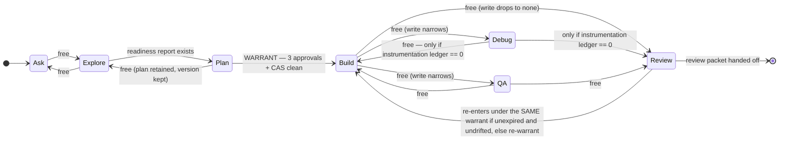
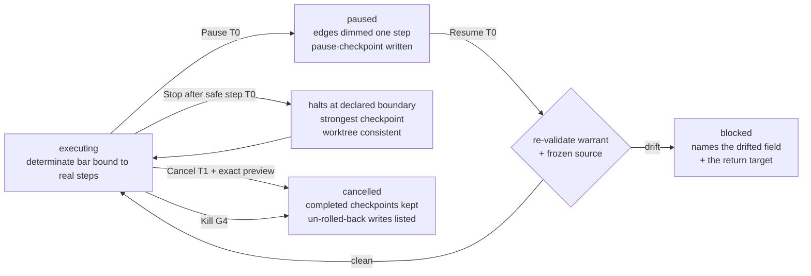
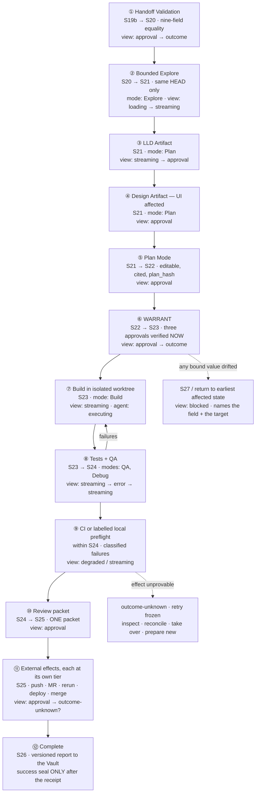

# 25 — Zeno Forge, specified in **B+C**

**Phase 0B · Gate 2 detailed prototype specification · Worker: Zeno design lane · Date: 2026-08-28**

## 0. What this document is, and the direction it obeys

This is the **detailed design specification for Zeno Forge in the selected B+C language** — precise
enough that an interactive prototype could be built from it, and nothing more. It is a design, not
product code, not a build authorization, and not Gate 2 approval.

### 0.1 The selected direction, quoted not re-derived

> **2026-08-28 — DESIGN DIRECTION SELECTED: B+C.** "B+C = the 3D Standing Field for the Overview and
> navigation … calm opaque planes for the work surfaces (Command lists, Forge code, Counsel).
> *3D where it helps, quiet where you read.*" — `00-DECISIONS.md`

Forge is the surface where the second half of that sentence carries the most weight. **Forge is a
reading instrument.** A person in Forge is doing the two things translucency and motion damage most:
reading code and deciding whether to authorize an effect. So Forge is rendered almost entirely in
Direction C's **near-opaque, edge-lit, mono-forward** grammar, and Direction B's **Standing Field**
appears in exactly two licensed, bounded places (§0.4) — never behind, beneath or through anything a
person reads.

### 0.2 The B+C seam law, and which document governs what

**The seam law (one sentence):** *the Standing Field answers "where is this running and what boundary
does it cross"; the Foundry Edge answers everything else — and the two never occupy the same z-stack.*

| Concern | Governing source | Status here |
|---|---|---|
| Palette, type, spacing, radii, semantic-colour law, motion tokens, the twelve agent states | `22-direction-C` **§1** | **Inherited verbatim.** Not re-derived, not re-valued |
| The Foundry Edge (edge-key / edge-shadow / edge-active / edge-select), the 3-layer budget, E1 near-solid default | `22-direction-C` §1.5 | **Inherited.** Every Forge plane is defined by it |
| Standing Field geometry: bounded, matte, axonometric, fixed ≈30° dimetric vantage, centreless, depth = provenance distance, ranks R0–R4, flat-topped markers, typed labelled ribbon edges, no free-orbit camera | `22-direction-B` §2 | **Inherited**, scoped to §0.4's two licensed appearances |
| List-primacy and the 2D-parity obligations for any Field | `22-direction-B` §2.2, §8 | **Inherited and tightened** for Forge (§3.3) |
| The forbidden compositions F1–F7 | `20-` §1 | **Restated against**, per surface (§0.5) |
| The canonical S01–S28 machine, the ten view states, Source Requirement Matrix, IA node names | `11-` §2, §5, §7, §8 | **Cited, never redefined** |
| Forge scope, modes, capability tiers, journeys J-F1…J-F6, the independence contract | `10-PRD` §4 | **Cited, never widened** |
| Effect Vector, the ordered tier rules R0–R17, destructive classification | `13-` §3 | **Cited** for §6.4 |

**Token reconciliation, stated once.** Directions B and C each printed the shared family; a few hex
values differ by one or two steps of the same ramp (`graphite-1` `#0A0C0E` vs `#0A0C0F`; `graphite-12`
`#E6ECEE` vs `#E8EDF1`; gold `#B99A54` vs `#C7A55A`; amber `#E0A128` vs `#E8912A`; green `#3DB07A` vs
`#37A06B`). **Direction C `§1` is authoritative for every value and every token name in this
document**, per the direction brief. Direction B's motion names map onto C's duration scale:
`motion.micro → dur-1/dur-2`, `motion.short → dur-3`, `motion.medium → dur-4`; `motion.ceremony` has
**no Forge use** — Forge has no wake ceremony (§9.2). Where this document needs a token C did not
name, it is introduced explicitly and marked `[D]`.

### 0.3 Evidence labels

Per `11-` §0.1: **[V]** verified against a cited artifact · **[I]** inferred, reasoning shown ·
**[U]** genuinely unknown, never quietly filled in · **[D]** a design decision this document makes.
A bare `§…` cites *this* document; other artifacts are cited by filename.

### 0.4 Where the Standing Field is licensed inside Forge — and where it is banned

The Field appears in Forge in **exactly two places**, both of which are *replacements* for the work
plane or *docked inspectors beside it*, never layers under it.

| # | Appearance | Scale | How it is reached | The rule that makes it safe |
|---|---|---|---|---|
| **SF-1** | **Forge Overview** — the workspace itself as a provenance field: repositories, worktrees, executors, tools/MCP servers, remotes, CI, model providers, at their real ranks | Full pane | `⌘⇧O` or the Overview toggle in the navigator header. It **replaces** the work plane; it never renders behind or beneath it | It cannot coexist with a code plane in the same z-stack, so "never glass behind code" is satisfied by construction, not by discipline |
| **SF-2** | **The DAG lens** — the current run's plan steps, sub-agents and tools as a graph | Inspector | The Lens dock (§3), from the plan or the execution stream | Docked beside, on its **own opaque plane**; dismissable with one key; never the default; stops rendering when hidden |

**Banned outright inside Forge, with the reason:**

| Banned | Reason |
|---|---|
| The Field **behind** the editor, diff, terminal, transcript, execution stream, review packet or approval capsule | `22-direction-C` §4.1 — code demands E1; the content layer is never a canvas and never glass |
| The Field as the **default** view of any Forge surface | The list is primary everywhere (`11-` §6 principle 7; `10-PRD` §6.5 free-canvas-primary = `prohibited`) |
| A Field **marker that carries body text**, a code excerpt, a diff or a log line | Markers carry a label, a state glyph and a shape delta only; text lives on planes |
| Any **camera** motion — orbit, dolly, zoom-to-core, swoop | `22-direction-B` §2.2 bounded viewpoint; the reel galaxy hero is explicitly rejected |
| The Field **during an active build or test run** | §9.4 — Forge must not spend the GPU the owner's compiler needs (B-002) |

### 0.5 The forbidden compositions, restated against Forge specifically

| # | Why Forge cannot be mistaken for it |
|---|---|
| **F1** cyan sphere + gold halo + radial capability labels | Forge renders **no round form at all**. Capabilities are the mode table (§2.1), the permission profile and the MCP registry — all lists. `cyan-info` in Forge is a **1 px `edge-active` key-line on the focused plane** and a citation marker; nothing emits. `stoic-gold` appears on exactly two things: the owner's current selection, and the owner-held control in an approval (§2.4, §6.4) |
| **F2** orange brain + concentric rings | The DAG lens is **centreless** — an ordinal provenance axis R0→R4, not rings around a core. Edges are typed and labelled (`feeds · blocks · verifies`). Its list equivalent (the plan step-list) is the primary, and the lens is never the default |
| **F3** three tilted smoked-glass cards on a curved rail | Every Forge plane is **flat, orthogonal, axis-aligned and opaque**. There is no carousel anywhere; the navigator, the diff stacks and the QA matrix are vertical lists and tables |
| **F4** domain-to-red | Red in Forge means exactly four things: **blocked, error, destructive, denied**. It is never a language, a repository, a test suite, a diff-removal or a severity gradient (§4.3 is the load-bearing case) |
| **F5** full-screen white flash | No white frame exists. Transitions are `dur-2` dark cross-fades; the only particles in the system (C's sparse edge-settle) are **suppressed in Forge entirely** (§9.2) |
| **F6** fabricated telemetry | Every number in Forge resolves to an inspectable receipt or renders as `not sampled` / `not_configured`. CPU, memory, coverage, duration and cost each name their source (§6.3, §5.8) |
| **F7** gesture / voice as authorization | Forge has no voice or gesture authorization path at all. Mode changes, warrants and every T2/T3 route through the Approval Center; a wake phrase can open Forge and can never approve anything |

### 0.6 Invariants inherited without re-litigation

Dark-first graphite with Dark/Light/System/High-Contrast; **≤3 depth layers**, glass only on floating
nav/controls/overlays/agent-state/wake and **never** behind code, diffs, transcripts, tables,
approvals or long text, no glass-on-glass, one backdrop-root per cluster; **the list is primary
everywhere**; **every animation maps to exactly one real state** with no perpetual loops and no
fabricated telemetry; **truthful state** — a success animation never precedes a verified receipt;
**semantic colour reserved**; **WCAG 2.2 AA** — 4.5:1 text, 3:1 non-text, focus a real border never a
glow, 2.4.11, 2.5.8 ≥24 px, 2.2.2, 2.3.1; **hardware is UNKNOWN (B-002)** so every performance figure
is a target to measure with an always-functional 2D path.

---

## 1. The workspace layout

### 1.1 The frame

```
┌─ G1 STATUS RAIL (suite) ── device · mic · capture · model · network · zone · safe-mode ──────────┐
├──────────────────┬───────────────────────────────────────────┬────────────────────────────────────┤
│ A · NAVIGATOR    │ B · WORK PLANE                            │ C · INSPECTOR                      │
│   repositories   │   editor · diff · review packet ·         │   ▸ Conversation (chat)            │
│   worktrees      │   handoff validation · QA evidence ·      │   ▸ Plan (editable, cited)         │
│   runs           │   Forge Overview (SF-1, replaces)         │   ▸ Actions (pending, by tier)     │
│   files          │                                           │   ── THE LENS (toggle, §3) ──      │
│   findings       │   opaque graphite-2 · Foundry Edge        │   opaque graphite-2 · own plane    │
│   [list-primary] │   focused pane takes edge-active (cyan)   │   never behind B                   │
├──────────────────┴───────────────────────────────────────────┴────────────────────────────────────┤
│ D · DRAWER (optional, collapsed by default) — Terminal · Tests · CI · Processes & Ports           │
├───────────────────────────────────────────────────────────────────────────────────────────────────┤
│ E · IDENTITY STRIP  project · worktree/branch · HEAD · dirty · MODE · model/effort · permission   │
├───────────────────────────────────────────────────────────────────────────────────────────────────┤
│ F · OBSERVABLE EXECUTION STREAM (typed · reconnect-safe · opaque · never behind code)              │
└───────────────────────────────────────────────────────────────────────────────────────────────────┘
   G4 Global Pause / Kill — always present, always operable, never animated away, never gated
```

Regions **B**, **C**, **D**, **F** are independently focusable panes. **E** is chrome, not a pane: it
is never focused as a unit, but every field in it is tab-reachable and every field is a link to its
receipt.

### 1.2 The five regions

| Region | Contents | Layer | Material | Edge treatment | Never |
|---|---|---|---|---|---|
| **A · Navigator** | A single indented **tree over one list model**: workspace → repository → worktree → (files ∣ runs ∣ findings ∣ QA evidence). Each repository node carries its own `zone` (Z1/Z2), `remote`, `rules source`, `test command` and `approval state` | 1 | opaque `graphite-2`, rows `graphite-3`, hover `-4`, selected `-5` | `edge-key` top/left, `edge-shadow` bottom/right; selected row takes `edge-select` (gold, 1 px) | Flattening repositories into one index (J-F6); hiding a repository the owner lacks capability for — it renders its health state and the exact reason instead |
| **B · Work plane** | Editor · diff · review packet · handoff validation · QA evidence · Forge Overview (SF-1) — **one at a time**, as a tab strip whose tabs are a list | 1 | opaque `graphite-2`; code rows on `graphite-2`, gutters `graphite-3` | Focused pane takes `edge-active` (cyan, 1 px); unfocused sit at `graphite-6` | Any blur, glow, tilt, translucency, or a Field rendered underneath |
| **C · Inspector** | Conversation · Plan · Actions, plus **the Lens** (§3) as a fourth slot that borrows the whole dock | 1 | opaque `graphite-2` | Same as B; the Lens gets a `graphite-7` divider from the tabs above it so a reader can see it is a different kind of thing | Rendering the Lens *and* a tab at once (no lens-on-lens, the analogue of no glass-on-glass) |
| **D · Drawer** | Four tabs: **Terminal** (§6.2) · **Tests** · **CI** · **Processes & Ports** (§6.3). Collapsed by default; opens to 30% height, resizable, remembers per-worktree | 1 | opaque `graphite-2` | `edge-key` on its top edge only — it reads as a plane sliding up from the floor | Auto-opening on output. It opens only on an owner action or on a `blocked`/`error` event that names it |
| **E · Identity strip** | §1.3 | **1, deliberately** | opaque `graphite-3` | `edge-key` top, `edge-shadow` bottom | **Glass.** This is the direction's one explicit refusal of its own glass licence: the identity strip is a *truth surface*, and a truth surface that can be misread through translucency is a defect, not a style |
| **F · Execution stream** | §5 | 1 | opaque `graphite-2` | `edge-key` top | Ever being placed behind code, or hidden behind a spinner |

**The two glass surfaces Forge is allowed**, and nothing else (Layer 2, Tier-B blur ≤16 px + 35 %
scrim + `graphite-7` edge, small, short-lived, one backdrop-root, solid under the toggle):

1. The **Approval Capsule / destructive-effect preview** (`11-` G5, and §6.4 here).
2. The **Command Palette** (`11-` G2) invoked over Forge.

Everything else in Forge — including the identity strip, the Lens, the stream, the drawer and every
notice — is opaque Layer 1. **Layer budget audit: ground (Layer 0, `graphite-1`, static, stops
rendering) → planes (Layer 1) → capsule/palette (Layer 2). Three. No Forge surface nests a Layer 2
inside a Layer 2.**

### 1.3 The identity strip — every field, its source, and what invalidates it

One mono line (`JetBrains Mono` 12, `tabular-nums`), left to right, no wrapping; fields elide from the
right into a `⋯` disclosure that opens the full strip as a list. **Every field is text + glyph; none
is colour-only. `not_configured` is a legible value, never a blank.**

| # | Field | Renders | Source of truth | Amber when | Red when | Never |
|---|---|---|---|---|---|---|
| 1 | **Project** | `⟨project⟩ · ⟨session⟩` + zone chip `Z1`/`Z2` | Session record; `10-PRD` §4.8 | — | Zone mismatch between the session and the focused repository | Two zones sharing one session |
| 2 | **Repository** | `⟨repo⟩` (multi-repo: `⟨n⟩ repos ▾` opening the per-repo list) | Navigator selection | — | — | Flattening repositories (J-F6) |
| 3 | **Worktree / branch** | `⟨worktree-path-tail⟩ @ ⟨branch⟩` | `frozen-source-receipt` (T-12) | — | Branch deleted or moved out from under the session | Showing the primary checkout when work is in a worktree |
| 4 | **HEAD** | `⟨sha:8⟩` mono | `frozen-source-receipt` | — | `HEAD drifted — ⟨sha:8⟩ → ⟨sha:8⟩` while a warrant is held | Rendering a short sha without the ability to expand to the full one |
| 5 | **Dirty state** | `clean` · `dirty · ⟨n⟩ files` · `dirty · ⟨n⟩ files · ⟨m⟩ in frozen scope` | `git status` against the frozen scope | — | ≥1 dirty path **inside** the frozen scope while a Build warrant is held → the warrant is void (§2.4) | Rendering a bare file count. Dirt outside the frozen scope is **neutral information**, not a warning — inflating it teaches the owner to ignore the field |
| 6 | **Mode** | Glyph + word: `Ask` `Explore` `Plan` `Build` `Review` `Debug` `QA`. **Outlined glyph = read-only · filled glyph = may write** | §2 | Mode is `Build` and the warrant expires in < 5 min | Mode was suspended by drift | A mode name without its write-capability glyph |
| 7 | **Write capability** | `write: none` · `write: worktree ⟨path⟩ (scoped)` · `write: instrumentation only` (Debug) · `write: qa artifacts only` (QA) | Permission profile + mode | — | An attempted write outside scope was refused | Ever reading `write: repo` — no mode grants that |
| 8 | **Model / effort** | `⟨model⟩ · ⟨effort⟩ · local` **or** `· cloud → ⟨provider⟩ ⟨region⟩` | K4 routing; `10-PRD` §2.4 | A capability mismatch put the model in reduced-capability mode | The model fails a **required** capability → the step is blocked, not silently downgraded | Hiding a cloud path. A local↔cloud switch is always visible, never silent |
| 9 | **Egress posture** | `egress: none` · `egress: ⟨n⟩ sinks ▾` opening the C2 view manifest | Sanitization Gateway | First-time destination (`destination_novelty ≠ known`) | Egress attempted with an unresolved sanitization manifest | An egress chip that is not clickable through to its manifest |
| 10 | **Permission tier** | `perm: ⟨profile⟩ · ceiling T⟨n⟩` + the six typed categories as a compact `▪▪▫▪▫▫` glyph row with a hover/focus list | `13-` §3; L4 D3 | The pending action is T2 | The pending action is T3 and no platform authenticator exists → **blocked, not downgraded** (N-1) | Showing a global "autonomy" level. Permissions are typed by action class, and **the owner denylist is not overridable by any chord** — Zeno's recorded divergence from Warp (L4 D3 / X-7) |
| 11 | **Sandbox badge** | `sandbox ⟨profile⟩ · expires ⟨t⟩` — present **only** while a bypass-permissions profile is active | `10-PRD` §4.5 | Always amber while present | Expired but still bound | Being absent while such a profile is live |
| 12 | **Warrant** | `warrant ⟨8-hex⟩ · 3/3 · expires ⟨t⟩` — present **only** in Build | §2.4 | < 5 min to expiry | Any bound field drifted | A Build mode with no warrant chip. That combination cannot exist |
| 13 | **Budget** | `⟨used⟩/⟨cap⟩ steps · ⟨used⟩/⟨cap⟩ min · ⟨used⟩/⟨cap⟩ cost` | S4 budgets | ≥80 % of any cap | Any cap exhausted → run blocks | A percentage without its denominator |

**Interaction.** Every field opens its receipt in the Lens (`L-WARRANT`, `L-CONTEXT`, `L-EGRESS`,
`L-CHECK`) on click or `Enter`. Nothing in the strip is a control that *changes* state except the
mode selector (field 6), and that is a menu, not a toggle (§2.3).

### 1.4 Focus, keyboard, and pane cycling

- **Focus is a 2 px solid `cyan-info` border with a 2 px offset**, computed against both adjacent
  fills for ≥3:1, thickening to 3 px `graphite-12` in High Contrast. **Never a glow** (2.4.13 Note 1).
- `F6` / `⇧F6` cycles panes in the fixed order **A → B → C → D → F** and back. The order never
  changes with layout, so muscle memory survives a collapsed drawer.
- Within a pane, `Tab` order equals visual/list order. In SF-1 and SF-2, **tab order equals the
  order of the list the Field is a view over** (§3.3).
- Every control is ≥24×24 CSS px (2.5.8); dense list rows meet this by row height, never by shrinking
  the hit area.
- The **Escape ladder** is fixed and never ambiguous: Escape closes the Lens → then the drawer →
  then returns focus to the work plane. Escape never cancels a run; cancelling is an explicit,
  tiered control (§5.5).

### 1.5 Narrow windows and the collapse order

Forge must remain complete on a small screen; nothing is reachable only through a wide layout.

| Width band | Layout |
|---|---|
| **Wide** | A · B · C, drawer optional, stream docked |
| **Medium** | A collapses to a 56 px rail of section glyphs with accessible names; C becomes a slide-over on the same opaque plane |
| **Narrow** | A, C and D become full-width sheets reached from a fixed tab bar; B keeps the full width; the identity strip **never collapses** — it truncates from field 13 backwards, and fields 5, 6, 7, 10 and 12 are the last to go, because they are the ones that state authority |
| **Minimum** | The stream and the strip. A Forge that cannot show what mode it is in and what it is doing does not open |

### 1.6 Shell states

The workspace shell itself carries the ten view states (`11-` §8.1). The ones that shape the layout:

| State | Forge shell renders |
|---|---|
| `empty` | No repository open: the navigator shows the Add-repository path and the **Recent worktrees list**, never an illustration. `empty` is only rendered when the workspace genuinely holds zero repositories |
| `loading` | Skeleton rows in A, a named current step in the stream, **cancellable**, and a hard transition to `degraded` rather than an indefinite spinner (threshold **[U]**, blocked on B-002) |
| `degraded` | A banner naming the **missing dependency and the one action that changes it** (L4 derived law 13) — e.g. `LSP index unavailable for ⟨repo⟩ — exact search and git remain; symbol navigation is off. Action: rebuild index` |
| `offline` | Editing, local tests, local preflight and checkpointing continue and say so. Push, MR, comment, CI, deploy and merge are **disabled and not queued**; T2/T3 cannot be granted for later execution |
| `safe mode` | Only recovery controls render; tier is capped at T0; the strip reads `safe-mode` and the mode selector offers Ask only |

---

## 2. The seven modes

### 2.1 What each mode permits — the capability table

The mode is **not** a trust level. It is a typed capability set, and the six typed permission
categories (apply diffs · read files · create plans · execute commands · interact with running
commands · ask clarifying questions) are configured **independently within it**, with a user denylist
that no escalation chord can override (L4 D3, and the recorded divergence at X-7).

| Mode | Produces | File writes | Command execution | Network | Tier it can originate | Entry requires | Structurally impossible |
|---|---|---|---|---|---|---|---|
| **Ask** | Cited answers (file · symbol · commit · date) + an explicit unknowns list | **none** | **none** | Model call only, per the strip's egress posture | **T0** | A repository at a frozen state | Any write, any `git` mutation, creating a write capability as a side effect (`10-PRD` J-F1) |
| **Explore** | The **Context Readiness Report** with its unexamined-areas list; the repo map; symbol/reference results | **none** | Only enumerated, non-mutating introspection whose Effect Vector resolves to `persistence: none, external: false` (rule R16) | Same | **T0** | Same | Running a repository hook, setup script or package lifecycle script — those are never automatic (`13-` TM-M11) |
| **Plan** | The editable **cited Plan**, the **LLD Artifact**, and the **Design Artifact where UI is affected**; the plan's `plan_hash` participates in every downstream approval | **none** — planning is read-only (L4 derived law 11) | none | Same | **T0** | Explore's readiness report exists | Being approved by Forge. Approval is the owner's act, taken in the capsule |
| **Build** | Code changes, commits **local only**, checkpoints, the diff | **scoped** — the isolated worktree only, with **mechanically enforced** no-push (a credential-less worktree or a hook, not a prompt instruction) | Yes, per the command envelope and the tier rules | Same | **T1** locally. Anything external **leaves Build** and becomes a bound T2/T3 in the one Approval Center | **A warrant** (§2.4): Intake ID + three approvals + unchanged frozen source | Entering by choosing it (§2.3). Push, MR, comment, CI, deploy or merge from inside Build |
| **Review** | Findings with stable IDs, severity, confidence, rule/model/version, evidence, suggested patch; the **review packet** (§4.5) | **none** against product code | Test execution only (read-only re-runs) | Same | **T0**; **publishing a comment is T2** and routes out to the capsule | A diff — local, or a fetched MR at a named revision | Silently widening authority; editing the code it is reviewing |
| **Debug** | Reproducible case → hypotheses → discriminating checks → evidence → root cause → minimal fix proposal → regression test | **instrumentation only**, inside the worktree, tracked in an **instrumentation ledger** | Yes, bounded | Same | **T1** | A symptom and a repository | Handing to Review or QA with a non-empty instrumentation ledger. The ledger must be zero, and the UI shows the count at all times |
| **QA** | Test results, browser/extension QA evidence, the replayable proof bundle | **qa artifacts only** | Yes, inside a **disposable clean profile** | Only the QA target's allowlisted hosts | **T1** | A build artifact or a running dev server | **Editing a test.** QA cannot write to a test path at all — the only path to a test change is Build, where it is tagged `test-change` in the diff budget and requires a stated reason (`10-PRD` §4.3, §4.10) |

Three properties of the table that must not drift:

1. **Only Build holds ordinary write capability.** Debug and QA hold *narrower* writes than Build, not
   broader ones, and neither can widen itself.
2. **No mode originates T2 or above.** Every external effect leaves the mode and becomes a fresh,
   hash-bound approval in the one Approval Center. There is no Forge-local shortcut.
3. **A mode cannot self-waive a `required` source.** Forge can neither reconstruct, skip nor
   self-waive any Source Requirement Matrix row (`11-` §5.2; negative test P-14).

### 2.2 How the current mode is made unmistakable

Five simultaneous, redundant channels. **Colour is never one of them** — the mode is not a status, so
it does not spend a semantic channel.

| # | Channel | Read-only modes (Ask · Explore · Plan · Review) | Writing modes (Build · Debug · QA) |
|---|---|---|---|
| 1 | **The word** | Inter 13 semibold in the identity strip, always visible | Same |
| 2 | **The glyph** | **Outlined** mode glyph | **Filled** mode glyph |
| 3 | **The write-capability field** | `write: none` | `write: worktree ⟨path⟩ (scoped)` / `instrumentation only` / `qa artifacts only` |
| 4 | **The work-plane edge** | Single 1 px `edge-key` | **Double key-line**: 1 px `edge-key` + a 1 px inset `graphite-9` rule, 2 px apart. A *shape* delta, not a hue — visible in High Contrast, in greyscale, and to a colour-blind reader |
| 5 | **The caret** | The editor renders a **reading caret** (hollow block outline) and is not editable. A keystroke that would insert produces a one-line inline notice naming the current mode and the exact control that changes it — never a beep, never a silent no-op | A standard insertion caret |

A sixth channel exists only in Build: the **warrant chip** (field 12). Build without a warrant chip is
not a renderable state.

### 2.3 Transitions between modes



| Rule | Statement |
|---|---|
| **Widening needs a receipt** | Any transition that *increases* write capability requires a warrant re-validation. `Plan → Build` requires a new warrant; `Review → Build` re-validates the existing one and re-warrants if it has expired or drifted |
| **Narrowing is free** | Any transition that reduces capability is instant, needs no approval, and is always available. The owner can always get *smaller* |
| **Debug's exit gate** | `Debug → Build` and `Debug → Review` are refused while the instrumentation ledger is non-empty. The refusal lists the instrumentation, its file and line, and offers `remove all` |
| **Mode thrash is visible, not silent** | Every mode change writes a `mode-transition` event into the execution stream with the reason and, where applicable, the warrant id. The stream is the record; the strip is the current value |
| **A refused mode says why** | A mode the owner cannot enter renders in the selector as `⟨mode⟩ — unavailable`, followed by **the exact missing item and the one action that supplies it** — never greyed out with no explanation, and never hidden (permission-aware, not permission-hiding) |

### 2.4 The Build Warrant — how entering Build visibly references its approved receipt

**Build cannot be entered by choosing it.** The mode selector renders Build as
`Build — needs a warrant · missing: ⟨items⟩`. Selecting it opens the **Warrant plane** in region B, not
Build mode.

The Warrant plane is a mono equality table. It is a *reading* surface, not an approval surface — the
approvals it references were taken earlier, in the capsule.

```
WARRANT — Build · intake WEBEXT-XXXX
────────────────────────────────────────────────────────────────────────────
bound value              sealed at approval        now                match
────────────────────────────────────────────────────────────────────────────
pack_hash                ⟨sha256:12⟩               ⟨sha256:12⟩         ✓
patch_hash               ⟨sha256:12⟩               ⟨sha256:12⟩         ✓
plan_hash                ⟨sha256:12⟩               ⟨sha256:12⟩         ✓
lld_artifact             v3  ⟨sha256:12⟩           v3  ⟨sha256:12⟩     ✓
design_artifact          v2  ⟨sha256:12⟩           v2  ⟨sha256:12⟩     ✓     (UI affected → required)
repo @ HEAD              ⟨repo⟩@⟨sha:8⟩            ⟨repo⟩@⟨sha:8⟩      ✓
worktree                 ⟨path⟩                    ⟨path⟩              ✓
skills-manifest          ⟨sha256:12⟩               ⟨sha256:12⟩         ✓
model / effort           ⟨model⟩ · ⟨effort⟩        ⟨model⟩ · ⟨effort⟩  ✓
permission profile       ⟨profile⟩ · policy v⟨n⟩   ⟨profile⟩ · v⟨n⟩    ✓
────────────────────────────────────────────────────────────────────────────
approvals                LLD    ⟨token⟩  owner  ⟨t⟩
                         DESIGN ⟨token⟩  owner  ⟨t⟩
                         PLAN   ⟨token⟩  owner  ⟨t⟩
single-use · expires ⟨t⟩ · device-bound ⟨device⟩ · executor-bound ⟨executor⟩
────────────────────────────────────────────────────────────────────────────
                                            ✓ verified · HH:MM   [ Enter Build ]
```

| Property | Specification |
|---|---|
| **Verification happens now, not then** | The `now` column is re-read at the moment the plane opens. The `verify-green` seal + `verified · HH:MM` renders **only** when every row matches — the direction's single exception hue, scoped to "a verified receipt exists" and never rendered before one (C §1.2) |
| **Three approvals, not one** | LLD · Design-where-UI · Plan are three separate `approval_token`s (T-42). If UI is affected and the Design row is absent, the plane renders `design_artifact — required, absent` and Build is refused — the UI expression of negative test **P-09** |
| **Not-applicable is a claim** | `design_artifact` may read `not_applicable` **only** with a recorded reason shown inline. It can never read `—` |
| **The gold moment** | `[ Enter Build ]` takes `edge-select` (`stoic-gold`, 1 px) on focus. This is the only gold in the Forge chrome, and it marks *the owner's hand*, never a status |
| **The persistent reference** | Once in Build, the strip carries `warrant ⟨8-hex⟩ · 3/3 · expires ⟨t⟩`. Activating it re-opens this plane read-only in the Lens (`L-WARRANT`). The receipt is never one screen you passed through — it is permanently addressable from the mode you are in |
| **Drift suspends, never downgrades** | If any bound value drifts while in Build (HEAD moves, a frozen-scope path goes dirty, a skill hash changes, the approval expires), the chip flips to the red square-stop glyph, **Build is suspended**, the work plane's double key-line drops to single, and a blocking notice names **the drifted field and the return target** — mirroring `cas-failure-receipt` (T-36). It never silently becomes Review, and it never keeps writing |

### 2.5 Mode state rendering, in the twelve-state grammar

The mode is a capability; what the *agent* is doing inside it is one of the twelve states, rendered in
Direction C's H2 grammar (glyph + label + edge/fill delta; motion minimal and bounded).

| Agent state | Where it renders in Forge | Motion (full → reduced) |
|---|---|---|
| `asleep` | Stream idle, planes at rest, **rendering stopped** | none |
| `waking` | Session resume: the strip resolves its fields left to right as each receipt is re-read | one `dur-2` cross-fade → instant |
| `listening` / `transcribing` | Only if voice input is used to compose; the concentric-caret and line-caret glyphs. **No waveform** | tail append `dur-1` → instant |
| `retrieving` | Explore: `bracket scan` glyph, `edge-active` on the pane; determinate bar when N is known, otherwise a named current step | bar advance, else caret `dur-2` → static |
| `planning` | Plan: rows compose top-down as the plan is written | row cross-fade `dur-2` → instant |
| `executing` | Build/QA: determinate bar **bound to the real step count**; the active step's row takes `edge-active` | bar tied to real progress → static bar |
| `awaiting-approval` | An action is queued at T2/T3: amber caret + `Awaiting your approval` + the capsule | none — it rests |
| `paused` | §5.5: edges neutral, one luminance step dimmed, the pause glyph | none |
| `blocked` | Red square-stop + the reason text + the one action that changes it | none |
| `success` | Check + `verify-green` seal + `verified · HH:MM` — **after** the receipt | seal draw `dur-2` → instant |
| `error` | Red X + error copy, kept **distinct from blocked** (a failed guard is not a crash) | none |

---

## 3. The Lens — the agent DAG and every other inspector

### 3.1 What the Lens is `[D]`

**The Lens is Forge's single inspector dock.** One dock, many lenses, **one lens at a time**. This is
the structural analogue of "no glass on glass": inspectors do not stack, so a reader is never asked to
hold two frames of reference at once, and the layer budget cannot drift.

| Lens | Shows | Its primary list (always available, always first) |
|---|---|---|
| **L-DAG** | The current run's graph — plan steps, sub-agents, tools — as the **Standing Field at inspector scale** (SF-2) | The **plan step-list** in the Plan tab |
| **L-WARRANT** | The Warrant plane (§2.4) read-only, plus every approval token and its lineage | The approvals list |
| **L-CONTEXT** | The current prompt pack: sources, token budget, omissions, memory scopes, conflicts, freshness, per-item pin/exclude (Command **C1**, mounted not forked) | The context item table |
| **L-EGRESS** | Sinks, view manifests, classes included/omitted/transformed, placeholders, provider/region/retention, detector and policy versions, the exact allow/block reason (Command **C2**, mounted) | The sink table |
| **L-MATRIX** | The bound Intake's **Source Requirement Matrix** — all eight result tags, never collapsed (`11-` §5) | The matrix itself; it *is* a table |
| **L-PROV** | Citations for the focused answer, plan line or finding — file · symbol · commit · date, with source age | The citation list |
| **L-CHECK** | The checkpoint ladder (§5.6) and its coverage | The checkpoint table |

**Rules that hold for every lens, without exception:**

1. It opens **beside** the work plane (region C) or as a slide-over on its **own opaque plane**. It is
   never drawn behind, beneath or through the editor, diff, terminal, review packet or stream.
2. It is **never the default**. Forge opens with the Conversation tab, not a lens.
3. It is **dismissable with one key** (`Escape`, first rung of the ladder in §1.4).
4. When hidden it **stops rendering** — no idle frames, no background layout (DESIGN-PERF-AC-01).
5. Every lens has a **list or table equivalent that is the primary**, and the lens adds comprehension,
   never capability.

### 3.2 The DAG lens — the Standing Field at inspector scale

Geometry inherited from `22-direction-B` §2: bounded, matte, axonometric, **one fixed ≈30° dimetric
vantage**, centreless, flat-topped markers on a groundplane grid, typed labelled flat ribbon edges,
no camera. Depth is **provenance distance**, and in Forge the ranks read as:

| Rank | Holds, in a Forge run | The governance question it answers |
|---|---|---|
| **R0** | The owner + this host, and the Forge session | Where authority originates |
| **R1** | The orchestrator / the session's approval boundary | Where a decision must be taken |
| **R2** | The **isolated worktree**, the build executor, the disposable QA profile | What is doing work now, and inside which container |
| **R3** | Tools, MCP servers, skills, the shared Context Engine, the LSP/index | The capability surface being reached through |
| **R4** | Git remote, CI, Jira, NeoSapien, the model provider | The **egress frontier** — off-device, and what boundary a request crosses to get there |

For a *run* graph the markers are **plan steps, sub-agents and tools**; edges are typed
`feeds · blocks · verifies`. The marker top face carries the step label, its state glyph and a shape
delta; never a code excerpt, never body text.

**Motion, bound to real state and nothing else:**

| Event | Rendering | Never |
|---|---|---|
| A dependency is **actually executing** | Its edge lights `cyan-info` for exactly as long as it runs | An idle drift, a particle flow, a perpetual pulse |
| A step **completes a real step boundary** | Its marker takes one bounded `dur-2` settle | Motion detached from the step |
| A step is **blocked** | Matte-red marker + square-stop glyph + the reason on the row in the list | Red as decoration or as a severity gradient |
| Nothing is happening | The Field composites **once** and halts. A still Field is a still image | Any frame drawn without an event |

**Bounded viewpoint.** A **reframe** (`dur-4`, `settle`) may re-orient to face a chosen rank or
cluster; pan within the always-visible bounds is allowed. There is **no orbit, no dolly, no zoom to a
core** — because there is no core.

### 3.3 The parity contract

This is the most expensive commitment in the direction and the one most likely to be quietly broken,
so it is stated as testable properties rather than as an intention.

| # | Property | How a test proves it |
|---|---|---|
| P1 | **The list is default and primary.** A person can complete every Forge journey having never opened the Lens | Drive the full WEBEXT journey (§8) with the Lens disabled; assert zero blocked steps |
| P2 | **Same data, same operations.** The Lens adds no datum and no action the list lacks | Enumerate every operation reachable in L-DAG; assert each has an identical entry point in the plan step-list, with the same tier and the same confirmation |
| P3 | **Tab order in the Field = row order in the list** | Automated traversal comparing the two orders element-for-element |
| P4 | **Selection is one model** | Select in either; assert the other's selection and the inspector contents are identical |
| P5 | **Deep links are shared** | `zeno://run/{id}/step/{id}` resolves identically from list and Field |
| P6 | **Screen-reader parity** | Every marker exposes an accessible name, its rank, its state and its typed edges as text; a full traversal reaches every node without entering a canvas trap |
| P7 | **The Field is never the only path** | Static check: no action handler is registered exclusively on a Field element |

### 3.4 What the Lens must never become

- A place where **code, a diff, a log or a transcript** is rendered. Those are planes.
- A **free canvas** the owner arranges. `10-PRD` §6.5 puts "free-canvas node/graph editor as the
  primary agent surface" at `prohibited`; the DAG lens is a *view*, with a fixed layout derived from
  the plan, and it has no arrange mode.
- **Two lenses at once**, or a lens inside a lens.
- Open **while a build or test is running** (§9.4).

---

## 4. Diff and review presentation

### 4.1 The diff plane

Opaque `graphite-2`. Mono. No blur, no glow, no tilt, no translucency, no Field beneath. The focused
diff pane takes `edge-active`; unfocused sit at `graphite-6`. Line length is not wrapped by default;
overflow scrolls **inside the pane's own `overflow-x` container** so the workspace never scrolls
horizontally.

### 4.2 Minimal-diff emphasis — the diff budget header

Minimal-diff adherence is a measured success criterion (`10-PRD` §4.10), so it gets a surface rather
than a hope. Every diff plane opens with one mono line bound to the approved plan:

```
plan: 4 files · +61 / −12          actual: 6 files · +88 / −31
substantive: 4 files · +61 / −12   noise: 2 files · +27 / −19  (1 lockfile · 1 formatting)
beyond plan: 2 files ▾             test-change: 1 file — reason required
```

| Element | Rule |
|---|---|
| **`beyond plan`** | Lists every file the approved plan did not name. Each needs a stated reason; without one, the review packet renders `plan-drift` and Review flags it. Beyond-plan files are **never hidden** to make the number look better |
| **Noise classes** | A hunk may be tagged `formatting` · `generated` · `lockfile` · `moved` · `test-change` · `instrumentation`. These collapse by default **with a visible count and label** — the collapse is announced, never silent — and are excluded from `substantive` |
| **`instrumentation`** | Any hunk still tagged `instrumentation` in a review packet is an **error state**, not a warning: Debug's contract is that the ledger is empty before handoff (§2.1) |
| **`test-change`** | Always surfaced separately, never inside `noise`, and always carrying a required reason field. This is the UI expression of "does not edit tests to hide a product failure" |
| **`moved`** | Detected as a move, shown as a move (source → destination, with the unchanged body collapsed), not as a delete plus an add. A rename that reads as 400 removed lines is the commonest cause of a diff that cannot be reviewed |
| **Intra-line** | Word-level changes are **underlined**, not merely tinted, so the change survives greyscale, High Contrast and a colour-blind reader (C §4.1) |

### 4.3 Colour in diffs — the load-bearing case for the reserved-semantic law

Green and red are the two most conventional colours in software, and they are the two Zeno has
reserved for `verified receipt exists` and `blocked/error/destructive/denied`. Spending them on
"added" and "removed" would destroy the one status channel the owner must be able to trust — the exact
failure F4 names. **So the default diff carries no reserved hue at all.**

| Row kind | Fill | Left rule | Gutter glyph | Redundancy |
|---|---|---|---|---|
| **Added** | `graphite-4` (raised one step) | **solid** 2 px `graphite-10` | `+` | fill luminance + rule style + glyph |
| **Removed** | `graphite-2` (recessed one step, below the code plane) | **dashed** 2 px `graphite-9` | `−` | fill luminance + rule style + glyph |
| **Context** | `graphite-2` | none | none | — |
| **Conflict / blocked hunk** | `graphite-3` | `red` 2 px + **hatch** overlay on the gutter | square-stop | colour + shape + glyph + label |

All rules are measured for ≥3:1 against both the code plane and the row fill (WCAG 1.4.11).

**The honest accommodation.** A conventional green/red diff palette is available in Theme Studio as an
**opt-in**, because forcing an unfamiliar diff on a working engineer is a real cost (§10, weakness 1).
Choosing it is a trade, and the UI states the trade: while it is on, `blocked`/`error` inside the diff
plane switch to **hatch + square-stop glyph + explicit label** so they remain distinguishable from a
removed line, and the theme picker says so in one sentence before the choice is made.

### 4.4 Cross-repository changes — per-repository stacks

J-F6 requires one cited cross-repository plan with **per-repository** diffs, commits, checks and MR
approvals, and forbids flattening repositories into one index or letting one repository's rules govern
another. The diff plane is therefore **segmented, never merged**:

```
┌─ REPOSITORY 1 ─ ⟨repo⟩ @ ⟨sha:8⟩ · worktree ⟨path⟩ · Z2 · rules: CLAUDE.md@HEAD ────────┐
│  tests: ⟨cmd⟩ · remote ⟨url⟩ · approval: none pending                                    │
│  ▸ diff budget · file list · hunks                                                        │
└───────────────────────────────────────────────────────────────────────────────────────────┘
        ⇣  compatibility contract — REPO 1 must land before REPO 2 · contract ⟨id⟩ ⇣
┌─ REPOSITORY 2 ─ ⟨repo⟩ @ ⟨sha:8⟩ · worktree ⟨path⟩ · Z1 · rules: AGENTS.md@HEAD ────────┐
│  tests: ⟨cmd⟩ · remote ⟨url⟩ · approval: MR pending (T2)                                  │
└───────────────────────────────────────────────────────────────────────────────────────────┘
```

| Rule | Statement |
|---|---|
| **Separate everything** | ACL, zone, rules, skills, remote, branch, index, Graphify scope, test command, commits and approvals are per-repository and shown per-repository (`10-PRD` §4.5) |
| **Zone is on the header, always** | A `Z1` stack and a `Z2` stack next to each other is exactly the situation the zone label exists for. Cross-zone context flow is structurally prevented; the label makes it visible |
| **Ordering is a typed contract, not a note** | The band between stacks names the ordering, the contract id, the rollback plan and the partial-failure recovery path. This is the one place in Forge where the **DAG lens earns its keep**: change ordering and partial-failure fan-out are genuinely easier to read as a graph than as a list |
| **Approvals never batch** | Each repository's push/MR/CI/deploy/merge is its own tier, its own preview, its own approval. There is no "approve all" |

### 4.5 The review packet

**One packet**, versioned, mirroring the upstream discipline of `S17`'s single review packet — never a
stream of partial prompts. It is the artifact `S24 → S25` produces (T-46), and it is exportable to the
Vault Markdown root with its provenance intact.

| Section | Contents | State it can show |
|---|---|---|
| **1 · Header** | Intake ID · warrant id · repo(s)@HEAD · worktree(s) · plan version · LLD version · Design version or `not_applicable` + reason · model/effort · policy version | `stale` if any receipt has been superseded |
| **2 · Diff** | The per-repository stacks (§4.4) with the diff budget (§4.2) | — |
| **3 · Source Requirement Matrix** | Every row with its mark, availability, freshness, evidence pointer, fallback rung, result and receipt — **all eight result tags rendered distinctly**, none collapsed to "no result" (`11-` §5.4) | `degraded` / `blocked` |
| **4 · Tests** | Targeted **and** full relevant runs; each with command, envelope id, duration, and pass/fail counts bound to real output | `error` on failure, never a bare red count |
| **5 · Browser / extension QA evidence** | §7 — the matrix, the artifacts, the profile provenance | `not_run` is a legitimate value; a check without an artifact is never `passed` |
| **6 · CI** | Provider status, **or** the repository's reproducible local equivalent explicitly labelled **`local preflight` — never `CI passed`**; failures classified `code / configuration / infrastructure / flaky`; retries bounded by attempts, elapsed time **and** cost | `degraded` / `outcome-unknown` |
| **7 · Findings** | Review Workbench findings: stable ID, severity, confidence, rule/model/version, evidence pointer, suggested patch, disposition | — |
| **8 · Checkpoints** | The four-layer ladder and its coverage (§5.6) | — |
| **9 · Reproducibility receipt** | Secret-free: non-resolvable, task-expiring descriptors only — never values, keychain paths, account identifiers or replayable IDs (REPRO-AC-01) | — |
| **10 · Pending external effects** | Push · MR · comment · CI rerun · deploy · merge — each listed **separately, at its own tier**, each with its own preview, none pre-selected | `approval`; `outcome-unknown` if an effect was attempted and cannot be proven |

**The packet never contains a success seal for an effect that has not been verified.** Section 10 is a
list of *requests*, not of *outcomes*; outcomes appear only after a provider receipt (A2).

### 4.6 The Review Workbench findings list

List-primary, sortable, filterable by severity/confidence/rule/file. Each finding row: `id · severity ·
confidence · rule@version · file:line · one-sentence claim`, expanding to evidence and a suggested
patch that can be **previewed as a diff** but never applied from Review (that returns to Build).
**Publishing a comment is T2** and leaves the workbench for the capsule, with the exact comment body,
target, account and destination shown.

---

## 5. The execution stream, and steering a long build

### 5.1 The typed stream

The canonical `streaming` surface, on an **opaque reading plane** — the exemplar of "content is never
on glass" (`22-direction-C` §3.4). It is typed, not a log:

| Event type | Row renders | Rule |
|---|---|---|
| `thought` | A **summary** of reasoning, in Inter, collapsed to one line by default | Never private raw chain-of-thought (`10-PRD` §6.5 register #5); never hidden behind a spinner either |
| `action` | `tool: ⟨name⟩` (mono) · resolved params (sanitized) · result state · duration · receipt id | The tool name and every hash are mono; the description is Inter |
| `plan` | A plan version marker with its `plan_hash` | Linkable into the Plan tab |
| `elicitation` | A structured question — multiple choice where possible — with its own focus policy | It **stops** the run; it never guesses and proceeds |
| `response` | The agent's answer, with `L-PROV` citations inline (`cyan-info` markers with real accessible names) | — |
| `checkpoint` | The checkpoint layer, its id and its coverage | §5.6 |
| `error` | Distinct from `blocked`: an error is a failure, a block is a refused guard | Never collapsing the two into "degraded" |
| `mode-transition` | The mode change, its reason and its warrant id | §2.3 |
| `gap` | §5.3 | — |

Row anatomy: `⟨HH:MM:SS mono⟩ ⟨type chip⟩ ⟨title Inter⟩ ⟨target chip §6.1⟩ ⟨duration mono⟩ ⟨receipt
id mono⟩ ⟨▸ expand⟩`. Each type has **its own live region and focus policy** (L4 derived law 10) — an
`elicitation` moves focus; a `thought` never does.

### 5.2 The timing contract

| Elapsed | What the stream shows |
|---|---|
| No typed acknowledgement within **~10 s** | The run is presented as **`unresponsive`** — a truthful state with its own copy, not a longer spinner |
| **≤ 10 s** | Indeterminate caret **plus the named current step**. An indeterminate indicator without a named step is not permitted |
| **> 10 s** | A **determinate bar bound to the real step count**, or an itemised completed / current / pending step list. Never a perpetual spinner |

The progress bar's fill is bound to completed steps. **There is no interpolation, no easing toward a
number the system does not have, and no "almost done."** If the step count is unknown, the bar does not
render and the step list does.

### 5.3 Reconnect and the gap marker

The stream is reconnect-safe. When events were missed, an explicit row renders:

```
⟂  gap · ⟨n⟩ events unknown between ⟨HH:MM:SS⟩ and ⟨HH:MM:SS⟩ · reconciling from the run ledger
```

and, once reconciled, the backfilled events appear **below the gap marker with the marker retained**.
Events are never silently dropped and never silently backfilled as though nothing happened.

### 5.4 Observer and steer are visually separate

| Lane | Rendering | Contract |
|---|---|---|
| **Ask about this run** (observer) | An inset composer on `graphite-3`, indented, labelled `observe — cannot change this run`, with its own `edge-key` | Cannot mutate the run, the plan, the worktree or the tier. It reads |
| **Steer this run** | A separate control cluster with its own edge, each control carrying its tier badge | Every control here changes the run, and each says so |

The two are never adjacent siblings in the same visual group, because the whole failure mode this
separation prevents is a person typing a steering instruction into an observer field and believing it
took effect (`10-PRD` §6.5).

### 5.5 The four steering controls

| Control | What it does | Effect on the checkpoint | Tier | Confirmation |
|---|---|---|---|---|
| **Pause** | Stops dispatch of the **next** step. The in-flight step runs to its own boundary and is not interrupted mid-write | Writes a `pause-checkpoint` at the last completed boundary. **Nothing is rolled back** | T0 | none |
| **Resume** | Re-dispatches from the pause checkpoint **after re-validating the warrant and the frozen source** | Consumes the checkpoint. If any bound value drifted, resume is **refused** and the drifted field is named | T0 | none — but the revalidation result is shown before the first step dispatches |
| **Stop after safe step** | Marks the run to halt at the next **declared safe boundary** — a step the plan marked as leaving the worktree consistent, tests runnable and instrumentation removed | Produces the **strongest** checkpoint in the ladder | T0 | none |
| **Cancel** | Stops dispatch now and abandons the in-flight step | Every completed-step checkpoint is kept. The abandoned step's partial writes are rolled back to its entry checkpoint **or** are listed, file by file, as **not rolled back, with the reason** | **T1** — it mutates the worktree | An exact preview: what will be rolled back, what will not, and what remains dirty afterwards |
| **Kill** (G4, global) | The suite-wide one-action stop; revokes outstanding leases | As Cancel, plus lease revocation; the run terminates `cancelled` with a receipt | — | **None.** It is the emergency control. It is never gated, never approval-bound, never animated away, and it is operable in every state including safe mode |

**The honest limit of "stop after safe step."** The control is only as good as the plan's safe-step
declarations. **If the plan declares no safe boundaries, the control renders
`unavailable — this plan declares no safe boundaries` and offers `Pause` instead.** It never picks a
boundary itself and calls it safe. A plan authored in Plan mode is prompted for safe-step declarations
precisely so this control has something true to stand on.



### 5.6 The checkpoint ladder — truthful layers

Rendered in `L-CHECK` and in review-packet §8. Four layers, and the fourth is the one that must never
be misdescribed (`10-PRD` §4.5 "truthful layered checkpoints").

| Layer | Covers | Restorable? | Rendered as |
|---|---|---|---|
| **1 · Conversation / plan** | Session state, plan version | Yes, locally | `restorable` |
| **2 · File / worktree** | The isolated worktree's tracked and untracked state | Yes, locally | `restorable` + the exact paths |
| **3 · Environment / database** | Container state, fixture databases, dev-server state | **Only where a snapshot exists**; otherwise `not covered`, listed by name | `restorable ⟨n⟩ of ⟨m⟩` — never a bare tick |
| **4 · Already-executed external effects** | Pushes, MRs, comments, CI triggers, deploys, merges | **No.** Compensation at best | **`not rollback — compensating action only`**, in words, every time. A pushed commit is not un-pushed; a posted comment is not un-posted |

**Layer 4's label is non-negotiable copy.** Calling compensation "rollback" is the single most
dangerous inaccuracy this surface can commit.

### 5.7 Budgets

A mono line above the steer cluster: `steps ⟨used⟩/⟨cap⟩ · elapsed ⟨used⟩/⟨cap⟩ · cost ⟨used⟩/⟨cap⟩ ·
retries ⟨used⟩/⟨cap⟩`. Every figure is bound to a real counter or renders `not metered`. Exhausting any
cap **blocks** and offers the owner an explicit extension — it never silently continues, and retries
are bounded by attempts, elapsed time **and** cost so "keep clicking pipelines until green" has no
expression in the UI (`10-PRD` §4.3).

---

## 6. Terminal and process supervision

### 6.1 Target chips — the "where does this land" law

Every executable action in Forge — a terminal command, a test run, a QA step, a dev server — renders a
**target chip row** before it can be run, and the law is absolute:

> **No Run affordance renders until every target chip resolves.** An unresolved chip means the Effect
> Vector cannot be fully computed, which is rule **R0 — BLOCK, not a tier** (`13-` §3.2). The UI asks
> for the missing resolution; it never guesses.

| Chip | Resolves to | Rendering | Blocked when |
|---|---|---|---|
| **device** | Which host executes: this Mac · a paired Mesh executor · a container | `device: ⟨name⟩ · ⟨executor-profile⟩` | The executor is unpaired, untrusted, or its capability set is unknown |
| **profile** | The environment profile: sanitized startup env, declared grants, and an **explicit absence list** | `profile: ⟨id⟩ · no keychain · no ssh-agent · no docker socket · no cloud metadata · no cookies` | Any of those five cannot be *proven* absent. Absence is asserted, not assumed (`13-` TM-B04) |
| **tab** | For browser/extension QA: the browser context, profile and tab the action lands in | `tab: ⟨profile-id⟩ / ⟨context⟩ / ⟨tab-title⟩` | The profile is the owner's everyday authenticated profile — that is **blocked by default**, not warned (SWE-QA-AC-01) |
| **cwd** | Resolved absolute path + which worktree it belongs to + its zone | `cwd: ⟨abs-path⟩ · worktree ⟨name⟩ · Z2` | The path resolves outside the scoped root, or resolves through a symlink whose target is outside it |
| **host** | The network target(s): resolved hosts, `loopback only`, or `none` | `host: none` / `host: 127.0.0.1:⟨port⟩` / `host: ⟨fqdn⟩ (allowlisted)` | Any host is unresolved, or a non-loopback bind is requested |

Target chips appear in three places and read identically in all three: above the terminal composer, on
every `action` row in the execution stream, and inside the destructive-effect preview.

### 6.2 The command envelope card — why Forge does not show you a command line

Forge does not get an ambient shell (`10-PRD` §4.3). Structured argv bypasses the user shell where
possible; a genuinely-required shell starts from a **pinned sanitized environment profile**. The UI
reflects that literally: a command is rendered as a **table**, not as a command line, because a command
line invites a reader to believe a shell exists and that `.zshrc`, `PATH` and `direnv` are in play.

```
COMMAND ENVELOPE ⟨id⟩
  argv[0]     ⟨program⟩
  argv[1..]   ⟨arg⟩  ⟨arg⟩  ⟨arg⟩            (one per row, individually inspectable)
  cwd         ⟨abs-path⟩ · worktree ⟨name⟩ · Z2
  env         sanitized profile ⟨id⟩ · ⟨n⟩ vars · none inherited from the login shell
  grants      ⟨declared grants⟩
  limits      stdout ⟨bytes⟩ · stderr ⟨bytes⟩ · timeout ⟨s⟩
  effect      external:false · persistence:local-scoped-root · reversibility:owner-reversible
              breadth:3 (enumerated ▾) · production:false · money:null · authority:false
  tier        T1 — rule R15
```

**When a real shell is required**, the envelope renders a labelled exception row —
`shell: ⟨shell⟩ · pinned profile ⟨id⟩ · reason ⟨text⟩` — and the reason is mandatory. Unclassifiable
shell behaviour **blocks** (`13-` TM-M03).

**Output.** Bounded and **sanitized before display and before model access**. When control sequences
were stripped, the pane shows a chip: `sanitized · ⟨n⟩ control sequences stripped ▾`, expandable to
what they were. Terminal output is untrusted data; a window title it tries to rewrite, a clipboard it
tries to write, or an instruction it addresses to the agent is quoted as content and never executed
(`13-` TM-M04).

### 6.3 Running processes and ports

A table, not a canvas — keyboard- and screen-reader-native by construction.

| Column | Rule |
|---|---|
| `pid` · `envelope id` | Every process traces back to the envelope that started it. A process with no envelope is rendered `unmanaged` and is never offered a control |
| `argv[0]` + `▾` | Full argv on expand. Never a re-serialized command string |
| `started` · `uptime` | Real clock values |
| `cwd / worktree / zone` | The same resolution as the `cwd` chip |
| `profile` | The sanitized profile it runs under |
| `ports held` | `⟨port⟩ · bind ⟨loopback∣any⟩ · ⟨protocol⟩ · reachable-from ⟨scope⟩`. **A non-loopback bind renders `blocked` by default**, with the reason and the one action that changes it (`13-` TM-M07) |
| `state` | `running · idle · stopped · exited(⟨code⟩) · unresponsive` |
| `cpu / mem` | **`not sampled` unless actually sampled.** No estimate, no smoothed graph, no invented rate. Hardware is unknown (B-002) and a plausible number here is exactly F6 |
| controls | `stop · interrupt · take over` — each with its tier and, where consequential, an exact preview |

A dev server additionally shows: unprivileged · sanitized env · loopback-only on a random high port ·
unsafe debug/reloader disabled · Host/Origin validated · default-deny CORS · `no-store` — each as a
verified chip or as `unverified`, never as a decorative badge (DEV-SERVER-AC-01).

### 6.4 The destructive-effect preview

This is one of Forge's **two** legitimate Layer-2 glass surfaces (Tier-B blur ≤16 px, 35 % scrim,
`graphite-7` edge, opaque under the solid-surfaces toggle with zero information loss). It renders
whenever the effect classifier returns a destructive effect, `breadth == broad`, or any rule ≥R10.

**Effects are classified by what they do, never by tool name.** `rm`, `git clean -xfd`,
`git reset --hard`, `DROP TABLE`, `terraform destroy`, `kubectl delete` and a Python `shutil.rmtree`
are one class, and none is identifiable by name matching (DESTRUCTIVE-AC-01).

```
┌ DESTRUCTIVE EFFECT — approval required ──────────────────────── amber edge ┐
│  what it does      delete ⟨n⟩ paths, unrecoverable outside the checkpoint    │
│  exact targets     ⟨path⟩                                                    │
│                    ⟨path⟩                                                    │
│                    ⟨path⟩            ▸ show all ⟨n⟩   (enumerated, not glob) │
│  breadth           3 · enumerated ✓                                          │
│  reversibility     owner-reversible via worktree checkpoint ⟨id⟩             │
│  backup state      checkpoint ⟨id⟩ taken ⟨t⟩ · covers ⟨n⟩ of ⟨n⟩ targets      │
│  what a dry run    proves the target set and the permissions.                │
│  cannot prove      it cannot prove the effect of a hook, a trigger or a       │
│                    watcher that fires afterwards                             │
│  tier              T2 — rule R14 (a destructive local effect is not T1        │
│                    merely because it is local)                               │
│  requested by      ⟨actor⟩ · derived from ⟨source⟩                            │
│                                                                              │
│                                     [ Deny ]           [ Approve ]  ← gold   │
└──────────────────────────────────────────────────────────────────────────────┘
```

| Rule | Statement |
|---|---|
| **Enumerate or block** | A wildcard, recursive, unresolved or unenumerable target set **raises to at least T3, or BLOCKS if the exact set cannot be shown**. The preview never renders a glob as if it were a target list |
| **Fail closed on breadth** | Broad, linked, mounted, protected or production targets fail closed (`13-` TM-M08) |
| **The dry-run honesty row** | Every preview states what a dry run **cannot** prove. A dry run that is described as proof is worse than no dry run |
| **Confused-deputy row** | When the action derives from an untrusted source that also requested it, the requesting source and actor are displayed. No tier change — but the situation becomes visible as one (`13-` TM-H09) |
| **Amber edge, gold control** | The capsule outline is `amber` while awaiting approval; the **Approve** control takes `edge-select` gold on focus. Amber is the system saying a decision is owed; gold is the owner's hand. They never swap |
| **Opening never approves** | And a version mismatch renders `stale` and forces a fresh preview |

### 6.5 Drawer states

`empty` (no processes — proven, not assumed) · `streaming` (live output with the gap marker) ·
`degraded` (a capability is `unsupported` on this host, named with the reason) · `blocked` (a target
chip unresolved, or a non-loopback bind) · `error` (the process itself failed). **No raw secret ever
renders in any of them**, and a value the sanitizer redacted shows a typed placeholder, never a blank.

---

## 7. Browser and extension QA evidence

### 7.1 Profile provenance, above everything

The QA plane opens with a banner that is never collapsible:

```
disposable profile ⟨id⟩ · created ⟨t⟩ · zero employer sessions · destroyed on close
browser ⟨name⟩ ⟨version⟩ · extension ⟨version⟩ build ⟨sha:8⟩ · target ⟨url-or-local⟩
```

If the target profile is ever the owner's everyday authenticated profile, the plane renders
**`blocked`**, not a warning — that is the default position, not a preference (SWE-QA-AC-01).

### 7.2 The evidence ladder, rendered in its real order

Three tabs, in a **fixed** order that encodes their evidential strength:

| Order | Tab | What it is | How it is labelled |
|---|---|---|---|
| 1 | **DOM** | Structured assertions against selectors, attributes and state — the default | `strongest — asserts behaviour` |
| 2 | **Accessibility tree** | The a11y tree snapshot and its assertions | `structural — asserts what assistive tech sees` |
| 3 | **Visual** | Screenshots and visual diffs | **`weakest evidence — a screenshot proves appearance, not behaviour`** |

The visual tab is never the default, and a visual-only pass is never rendered as `passed`.

### 7.3 The extension QA matrix

One row per J-F5 obligation, each carrying a state from the fourteen canonical health states plus
`not_run`, and each requiring an **artifact id** before it may read `passed`.

| # | Check | Evidence a `passed` requires |
|---|---|---|
| 1 | Install · load-unpacked · update · uninstall | Per-transition DOM assertions + the resulting extension state |
| 2 | **MV3 service-worker suspension and restart** | A forced suspension, a restart, and an assertion that state survived or was correctly rebuilt |
| 3 | Content-script isolation | Assertions that page globals and extension globals do not cross |
| 4 | CSP and host permissions | The resolved permission set + a blocked-request assertion |
| 5 | Extension storage **and schema migration** | Before/after storage snapshots across the version boundary |
| 6 | Popup · options · side panel · toolbar · inline card | One DOM + one a11y assertion per surface |
| 7 | Multi-tab / multi-window / multi-profile | Concurrency assertions, not a single-tab pass |
| 8 | Offline | Behaviour with the network down, asserted |
| 9 | Performance | Measured on the actual machine, with the machine named — or `not measured` (B-002) |
| 10 | Accessibility | Keyboard traversal + a11y-tree assertions per surface |

**The rule that makes the matrix honest:** a check with no attached artifact is `not_run` or `unknown`.
It is never `passed`. A tick without an artifact id cannot be rendered.

### 7.4 The evidence card and the proof bundle

Each artifact renders as a card: `artifact ⟨id⟩ · kind ⟨dom∣a11y∣trace∣screenshot⟩ · as_of ⟨t⟩ ·
profile ⟨id⟩ · extension ⟨version⟩@⟨sha:8⟩ · browser ⟨name⟩ ⟨version⟩ · replayable ⟨yes∣no⟩`.
A **replayable QA proof bundle** — the artifacts plus the envelope that produced them — is a
first-class artifact of the review packet, exportable to the Vault with its provenance.

### 7.5 States

`not_run` (default, honest) · `loading` · `streaming` (a run in flight, with the gap marker) ·
`degraded` (the browser or driver is unavailable; the ladder rung is named) · `error` (a check failed —
distinct from the driver being unavailable) · `stale` (evidence is from an older extension build; the
`as_of` and the build delta are shown, and it **cannot** stand for the current build).

---

## 8. The WEBEXT journey inside Forge

The Forge-side segment of the canonical day (`11-` §1, §2), from the handoff acknowledgement to the
review packet. **This is a design, not a run:** Jira authority and NeoSapien are `not_configured`
today, so the honest aggregate upstream is `blocked` (`11-` §5.3). What follows is what each surface
is *specified to render*.



### 8.1 Stage by stage, with the visible state

| # | Stage | Canonical state | Mode | Forge surface | View state | Agent state | What is structurally impossible here |
|---|---|---|---|---|---|---|---|
| ① | **Handoff validation** | `S19b→S20` | — | **Handoff Validation plane** in region B: a nine-row equality table (destination path · full-file hash · TASK markers · pack version · repo/worktree/branch/HEAD · skill hashes · model · permissions · omissions), each row `sender ∣ receiver ∣ equal ✓/✗` | `approval` → `outcome` | `retrieving` → `success` **after** both hashes match | Proceeding on a partial payload. A truncated file, a dropped manifest or a missing readiness report is refused on hash or completeness (negative test **P-08**) |
| ② | **Bounded Explore** | `S20→S21` | Explore | Editor + navigator + `L-CONTEXT`; the Context Readiness Report with its **explicit unexamined-areas list** | `loading` → `streaming` | `retrieving` | A second independent context assembly. Forge **rehydrates the frozen upstream receipt**, never a divergent copy (T-40). Exploration is on the **same HEAD only** |
| ③ | **LLD Artifact** | `S21` | Plan | The LLD in region B; `L-PROV` for its citations | `streaming` → `approval` | `planning` | Implementation code. No mode with write capability is reachable from here |
| ④ | **Design Artifact** | `S21` | Plan | The UI Design Artifact — **required because UI is affected**; absent → the warrant refuses Build with `design_artifact — required, absent` | `approval` | `planning` | Skipping it because "the LLD covers the UI". P-09's second clause is exactly this |
| ⑤ | **Plan Mode** | `S21→S22` | Plan | The editable cited Plan in region C; **safe-step declarations are collected here** (§5.5) | `approval` | `planning` → `awaiting-approval` | Editing anything but the plan. Planning is read-only |
| ⑥ | **Warrant** | `S22→S23` | Plan → Build | The **Warrant plane** (§2.4). Three tokens, re-verified **now**, `verify-green` seal only on a full match | `approval` → `outcome` | `awaiting-approval` → `success` | Building on one approval, or on three stale ones. Both are refused, with the missing or drifted item named |
| ⑦ | **Build** | `S23` | Build | Editor + diff + the execution stream; diff budget live; isolated worktree with **mechanically enforced** no-push | `streaming` | `executing` | Push, MR, comment, CI trigger, deploy or merge. Those are not Build actions at any tier |
| ⑧ | **Tests + QA** | `S23↔S24` | QA · Debug | Drawer Tests tab + the QA plane (§7); Debug's instrumentation ledger visible at all times | `streaming` → `error` → `streaming` | `executing` / `error` | Editing a test from QA. The only test-change path is Build, tagged and reasoned (§4.2) |
| ⑨ | **CI** | within `S24` | Review | Drawer CI tab: provider status **or** the repository's reproducible local equivalent labelled **`local preflight`**; failures classified `code / configuration / infrastructure / flaky`; retries bounded by attempts, time **and** cost | `degraded` / `streaming` | `executing` / `blocked` | Labelling a local preflight `CI passed`. The string does not exist on that path |
| ⑩ | **Review packet** | `S24→S25` | Review | **One** packet (§4.5), versioned, exportable to the Vault | `approval` | `awaiting-approval` | A stream of partial packets |
| ⑪ | **External effects** | `S25` | Review | Each of push / MR / comment / CI rerun / deploy / merge as its **own** capsule, its own preview, its own tier; **before every T2 push**: re-resolved owner, remote URL, authenticated account, source branch, destination, commits and diff, plus secrets/credentials/PII/large-file/generated-artifact/cross-zone checks — with the approval bound to that preflight result | `approval` → `outcome-unknown` if unprovable | `awaiting-approval` → `success` / `blocked` | Batching them. Approving inside a sequence. A changed diff or remote silently keeping its approval (GIT-SAFETY-AC-01) |
| ⑫ | **Complete** | `S26` | — | A versioned Markdown report with full lineage, written to the Vault Markdown root | `outcome` | `success` — **the seal renders only after the provider receipt** | A success animation before a verified receipt |

### 8.2 Three failure branches, rendered

| Branch | Trigger | What Forge shows |
|---|---|---|
| **Warrant drift** | HEAD moved, a frozen-scope path went dirty, a skill hash changed, or the approval expired — at ⑥ or during ⑦ | The warrant chip flips to the red square-stop; Build **suspends**; the work plane's double key-line drops to single; a blocking notice names **the drifted field and the earliest affected return target**. Completed checkpoints are kept. The owner is never asked to "just continue" |
| **Required source missing** | NeoSapien `not_configured`, or any `required` matrix row unsatisfied | `L-MATRIX` renders the row with its **own tag** — `Unavailable` / `Processing` / `NotAuthorized` / `Stale` / `NotSearched` — its `as_of`, what it blocks, and the one action that changes it. It is **never** rendered as "no memories found". **Forge cannot waive it**; only the owner can, per task, with a receipt (P-14) |
| **Outcome unknown** | A push or MR was attempted and its effect cannot be proven | The effect enters `outcome-unknown`; **automatic retry is frozen**; four controls render — *inspect source · reconcile · take over · prepare a new action*. No blind retry, no double-send (P-13) |

---

## 9. Reduced-motion, high-contrast, 2D and low-power variants

All four ship from the start. The **in-app solid-surfaces and reduced-motion toggles are the
mechanism**, because `prefers-reduced-transparency` is Baseline-limited (Chrome/Edge only) while
`prefers-reduced-motion` is widely available; the media queries are a bonus, never the mechanism.
Forge is the cheapest surface in the suite to render in every variant, because its default already is
near-solid and near-still.

### 9.1 The variant matrix

| Variant | What changes in Forge | What is identical |
|---|---|---|
| **Reduced-motion** | Every transition → opacity-only ≤ `dur-2`; no z-translation; no blur animation; **no edge-settle particles anywhere** (they are suppressed in Forge by default regardless — §9.2); the DAG's edge-lighting becomes a **static state delta**, not a pulse; the SF-1 reframe is an instant cut; the progress bar still advances, because it is data, not decoration | Every state's glyph + label + edge delta; the Foundry Edge; every datum; every control |
| **High-contrast** | Text to `graphite-12`; borders step `graphite-6 → -8`; the focus outline thickens to 3 px `graphite-12`; the diff's add/remove rules step up and gain a hatch; disabled states get a hatch rather than dimming; accents shift to their `-text` tints for ≥7:1 | Layout, hierarchy, and the four-channel colour *meaning* — which was never colour-only |
| **2D / no-GPU** | SF-1 becomes a **static axonometric SVG** of the same markers, edges and ranks, and at the floor **collapses to the navigator list/table** — which was always primary. SF-2 collapses to the plan step-list. Layer-2 blur → opaque `graphite-3` + scrim | **100 % of function.** Nothing in Forge is reachable only through a Field, a blur or a motion |
| **Low-power / battery-saver** | Layer-2 live blur auto-disables → solid; process/telemetry poll rates back off and **say so** (`cpu/mem: not sampled — low-power`); idle surfaces were already not rendering | Every control, every state, every receipt |

### 9.2 Forge-specific motion decisions

| Decision | Reason |
|---|---|
| **The sparse edge-settle is off in Forge by default**, in every variant | Direction C licenses ≤24 graphite motes on a real compose event. In Forge, the compose events are a diff appearing and a plane arriving — beside code. Motion beside code is a cost with no benefit, so Forge spends none of that budget |
| **Forge has no wake ceremony** | Seed 8 (Worktree): *a coder wants no ceremony*, axis I4. Opening Forge resolves the identity strip's fields as their receipts are re-read, and that is the whole of it |
| **The progress bar is never eased toward an unknown value** | An eased bar is a fabricated number with a curve on it (F6) |
| **Nothing in Forge moves for more than 5 s beside content without pause/stop/hide** | WCAG 2.2.2. The only long-lived motion is the determinate bar, which is data and is pausable via §5.5 |

### 9.3 Where the toggles live and what they must guarantee

Theme Studio (`11-` **S2**) and Accessibility (**S5**), and both are reachable from Forge's own command
palette. **The guarantee that must be tested rather than asserted:** toggling any variant, at any
moment, in any mode, **loses no state** — not the run, not the checkpoint, not the warrant, not the
diff selection, not the drawer's scroll position.

### 9.4 The no-GPU and no-competition proof for Forge

Two claims, and both are structural rather than optimistic:

1. **Nothing in Forge requires a GPU.** SF-1 and SF-2 are the only spatial renderings, both are opt-in,
   both are secondary views over lists that carry every datum and every operation, and both have a
   static-SVG rung and a list rung below them.
2. **Forge never competes with the owner's build.** While a build, test or QA run is executing,
   **SF-1 and SF-2 suspend rendering** and show a static frame with a labelled reason —
   `paused while a run is executing`. The owner's compiler gets the machine. This is a Forge-specific
   rule, because Forge is the only product in the suite where the user's *other* work is on the same
   silicon.

Performance figures — frame pacing, INP, idle CPU/GPU, thermal, battery — are **targets to measure on
the specified pilot machine once B-002 is closed**, never displayed as achieved, never claimed here.

---

## 10. Honest weaknesses, and the claims that must be measured

### 10.1 Weaknesses

| # | Weakness | Why it is real | What is already built in | The cost of the mitigation |
|---|---|---|---|---|
| **W1** | **A diff with no green and no red is unfamiliar.** Every engineer has decades of muscle memory for the conventional palette | Reading diffs is the single highest-frequency act in this product. An unfamiliar encoding taxes it every time | Add/remove carry three redundant channels (fill luminance, rule style, glyph) and never need colour; an opt-in conventional palette exists | Choosing the familiar palette **spends the reserved channel**, so blocked/error inside the diff must fall back to hatch + stop glyph + label. The trade is stated at the moment of choosing, but it is still a trade, and some owners will make it without reading |
| **W2** | **The identity strip is thirteen fields.** A truth surface people stop reading is not a truth surface | Banner blindness is real, and this strip is present on every screen, always | Elision order puts authority fields last to go; every field is a link to its receipt; `not_configured` is legible rather than blank | It is still a lot of chrome, and the mitigation is discipline, not structure |
| **W3** | **The Standing Field competes for the exact GPU the owner needs.** Forge is the one product where the user's other work is on the same machine | A spatial view that stutters a compile is worse than no spatial view | Both Field appearances are opt-in, secondary, and **suspend during runs** (§9.4); a full 2D and list floor exists | Suspending the Field during a run means it is unavailable at precisely the moment a fan-out graph would be most interesting. That is the right trade and it is still a loss |
| **W4** | **Seven modes is a lot of modes.** Mode confusion and mode thrash are the classic failure of modal tools | A person who is wrong about the current mode is wrong about what the tool can do | Only Build changes ordinary write capability; the other six differ mainly in what they *produce*; five redundant channels state the mode; narrowing is always free | The five channels are chrome; and "only Build writes" is a claim that must hold in the implementation, not just in this document |
| **W5** | **"Stop after safe step" inherits the plan's quality.** A plan with careless safe-step declarations makes the control useless — or worse, misleading | The control's value is entirely in the truth of the declarations | It renders `unavailable` rather than guessing a boundary; Plan mode collects the declarations explicitly | Plan authorship becomes load-bearing for a runtime safety control. That coupling is real and is not designed away |
| **W6** | **One lens at a time** means comparing the DAG against the context pack requires switching | Some genuine comparisons are two-panel comparisons | The layer budget and the no-lens-on-lens rule are what keep the depth model honest | Accepted friction. If it proves untenable, the answer is a *wider single lens*, never a second stacked one |
| **W7** | **Per-repository stacks cost vertical space.** A three-repository change can push the first real hunk below the fold | Cross-repo work is exactly when a reader most needs to see the code | Stacks collapse to their headers; the diff budget summarizes before the hunks | Vertical cost is inherent to refusing to flatten repositories, and refusing to flatten them is non-negotiable |
| **W8** | **Density.** Forge inherits Direction C's operational density and Direction B's object-primary spine | The same screens that serve an expert can read as austere to anyone else | Forge's user is the owner, an expert, by definition; the launcher-first path softens entry | Genuinely a positioning cost, not a defect — but it is a cost |
| **W9** | **The warrant chip is only as good as the drift detection behind it.** The entire "visible receipt" idea collapses if any bound field is not actually re-checked | A green `3/3` that is not re-verified is worse than no chip, because it manufactures confidence | The `now` column is re-read on open; drift suspends rather than downgrades | This is the one place where a UI promise depends completely on an implementation guarantee, and it must be tested by fault injection on **every** bound field, not sampled |
| **W10** | **Mono-forward telemetry assumes the numbers are real.** The identity leans on JetBrains Mono read-outs across the strip, the envelope, the budget, the process table and the packet | The moment one of them is not bound to inspectable state, the whole instrument's credibility goes with it | `not sampled` / `not metered` / `not_configured` are first-class values everywhere | A discipline cost carried on every surface, forever |

### 10.2 Claims that must be measured at prototype — none is asserted as achieved

| Claim | How it must be verified |
|---|---|
| Every text/background and text/edge pairing meets **4.5:1 / 3:1** against the **worst-case** backdrop | Automated WCAG-2.2 sweep + APCA cross-check, in Dark, Light and High-Contrast |
| The **diff rules** (`graphite-10` solid, `graphite-9` dashed) hit **3:1** against both the code plane and the row fill | Direct measurement (WCAG 1.4.11), plus a greyscale and a colour-blind-simulation pass |
| The **Foundry Edge** hits 3:1 on every Forge plane it defines, including the Build double key-line | Measure `edge-key` / `edge-active` / `edge-select` against adjacent fills |
| **Full keyboard + screen-reader parity** for the navigator, every table, the diff, the packet, the QA matrix, SF-1 and SF-2 | Manual + automated traversal; the **P1–P7 parity properties in §3.3 as executable tests** |
| The **execution stream is reconnect-safe with correct gap markers** | Fault injection: drop and resume the event stream; assert no silent loss and a visible marker |
| **Every warrant-bound field actually invalidates.** Fault-inject each of the ten bound values in turn | Ten distinct suspensions, ten distinct named fields, ten distinct return targets — the Forge analogue of negative test **P-06** |
| **Cancel's rollback claim is exact** — what it says it rolled back, it rolled back; what it did not, it listed | Kill a run mid-write repeatedly; diff the worktree against the claim, byte for byte |
| **No mode can widen itself**, and QA cannot write a test path | Static capability audit + attempted writes from every mode to every path class |
| **Layer budget holds**: no Forge content plane resolves to a glass token; no glass-on-glass anywhere | A material audit as a build-time assertion over the token graph |
| **A variant toggle loses no state** in any mode, at any moment | Toggle each variant during Explore, Plan, Build, a running test and a pending approval; assert full state survival |
| **`local preflight` is never rendered as `CI passed`** | String-inventory rule: the literal exists at exactly one call site, reachable only from a provider-verified result |
| Forge's **idle CPU/GPU is zero when settled**, and SF-1/SF-2 draw no frame without an event | Frame-capture on an idle window; assert zero composites |
| INP, frame pacing, thermal and battery envelopes | **Measured on the actual pilot machine once B-002 is closed.** Until then every such figure is a target, and the 2D/list path is the shipped floor |

---

## Appendix A — Forge keyboard map

Every operation below also exists as a visible control; nothing is keyboard-only, and nothing is
pointer-only.

| Keys | Action |
|---|---|
| `F6` / `⇧F6` | Cycle panes A → B → C → D → F (fixed order, layout-independent) |
| `⌘K` | Command palette (Layer 2), read/navigation rows visibly separated from consequential rows |
| `⌘⇧O` | Toggle **SF-1 Forge Overview** (replaces the work plane) |
| `⌘⇧L` | Toggle **the Lens**; `⌘1…⌘7` inside it selects a lens |
| `⌘⇧M` | Mode selector (a menu, never a toggle) |
| `⌘⇧W` | Open the **Warrant plane** |
| `⌘J` | Toggle the drawer; `⌘⇧J` cycles its four tabs |
| `Escape` | Close the Lens → close the drawer → return focus to the work plane. **Never cancels a run** |
| `⌘.` | **Pause** the run |
| `⌘⇧.` | **Stop after safe step** (renders unavailable if the plan declares none) |
| `⌘⌥.` | **Cancel** — opens the exact preview first |
| `⌘⌃K` | **Global Pause / Kill** (G4) — operable in every state, including safe mode |
| `⌘⇧D` | Diff budget: expand `beyond plan` |
| `⌘⇧E` | Egress manifest (`L-EGRESS`) |
| `⌘⇧R` | Build the review packet |

## Appendix B — Acceptance criteria this specification is written against

| AC / rule | Where it is satisfied |
|---|---|
| FORGE-HANDOFF-AC-01 (nine-field acknowledgement, fail closed) | §8.1 ① |
| FORGE-HANDOFF-AC-02 (Forge cannot reconstruct, skip or self-waive a required source) | §2.1 note 3, §8.2 |
| FORGE-AC-04 / FORGE-AC-05 / LLD-GATE-AC-01 (three approvals before Build) | §2.4, §8.1 ③④⑤⑥ |
| SWE-QA-AC-01 (never the owner's authenticated profile by default) | §6.1 `tab` chip, §7.1 |
| GIT-SAFETY-AC-01 (T2 push preflight, approval bound to it) | §8.1 ⑪ |
| DESTRUCTIVE-AC-01 (effect-first classification, enumerated targets) | §6.4 |
| TERMINAL-AC-02/04/05 (typed envelope, sanitized env, no ambient credentials, bounded output) | §6.2, §6.1 `profile` |
| DEV-SERVER-AC-01 (loopback-only, sanitized, no privileged reach) | §6.3 |
| REPRO-AC-01 (secret-free reproducibility receipt) | §4.5 §9 |
| OUTBOX-AC-01 / P-13 (outcome-unknown, retry frozen, four controls) | §8.2 |
| WORK-AC-02 / P-06 (compare-and-swap, per-field invalidation) | §2.4 drift rule, §10.2 |
| CAP-AC-02 / WORK-AC-04 / NEO-MCP-AC-03 (no collapse into "no result") | §4.5 §3, §8.2 |
| COMMAND-AC-06 (launcher separates read from consequential) | Appendix A `⌘K` |
| DESIGN-PERF-AC-01 (settled surfaces stop rendering) | §3.1 rule 5, §9.4 |
| WCAG 2.2 AA — 1.4.3, 1.4.11, 2.1.1, 2.2.2, 2.3.1, 2.4.7, 2.4.11, 2.4.13, 2.5.8 | §1.4, §3.3, §4.3, §9.1, §10.2 |

---

*End 25 — Zeno Forge in B+C. Clean-room: no reel asset, trade dress, shader, audio, layout or code
reproduced; the Standing Field is licensed in exactly two bounded places and banned from every
reading surface; every plane behind code, diff, terminal, transcript, table, approval or long text is
opaque and edge-lit; every animation maps to one real state; semantic colour stays reserved, including
in the diff, which is the hardest place to keep it; the list is primary everywhere and the Field's
parity contract is stated as seven testable properties. Tokens inherited from `22-direction-C` §1,
geometry from `22-direction-B` §2, states and journeys from `11-`, scope from `10-PRD` §4, tiering
from `13-` §3. Not legal clearance, not Gate 2 approval, and not authorization to build.*
