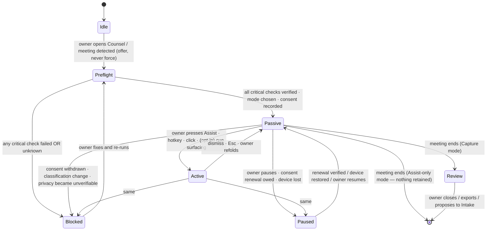
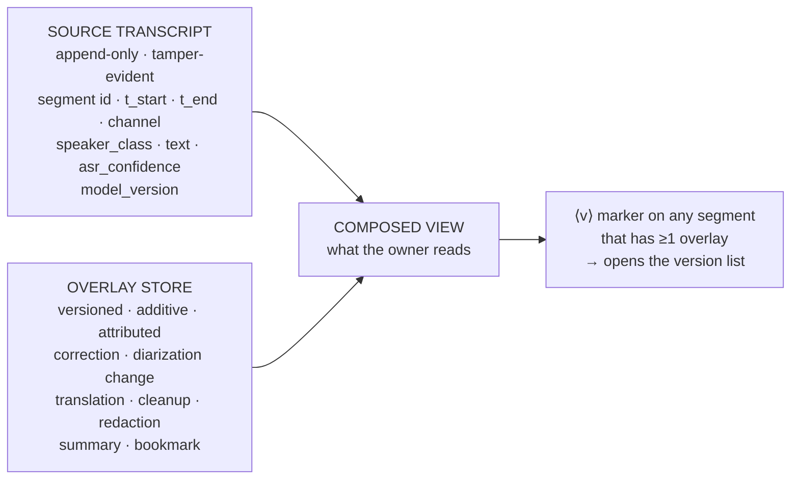
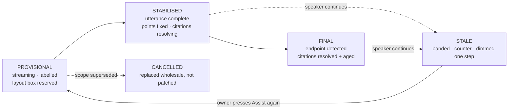
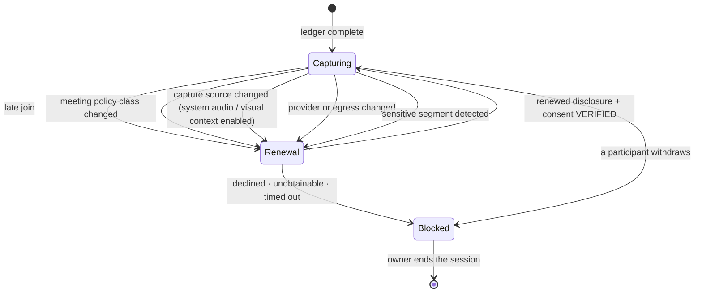
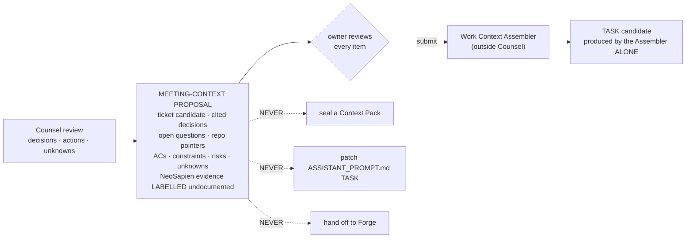

# 26 — Prototype: **Zeno Counsel** in B+C (Gate 2 detailed prototype specification)

**Phase 0B · Gate 2 · Detailed prototype spec · Date: 2026-08-28 · Direction: B+C (owner-selected, `00-DECISIONS.md`)**

**What this is.** A build-ready design specification for **Zeno Counsel** — the meeting surface — in the
selected **B+C** language. Precise enough that a prototype could be built from it; it is **not product
code and authorizes no build** (`00-DECISIONS.md`: phases followed strictly, no build before the owner
reviews design + LLDs and says so).

**What it obeys, and does not re-derive.** The shared **Zeno Glass** token family (`22-C` §1), the
Standing Field's geometry and parity law (`22-B` §2), the forbidden compositions (`20-` §1), the
canonical state machine and Command IA (`11-`), product scope and the independence contract (`10-` §5),
and the owner's captured **Counsel live-assist requirement** of 2026-08-28 (`00-DECISIONS.md`). Where
two authorities could be read as pulling apart, this document **names the reconciliation** rather than
silently choosing (§0.3).

---

## 0. How B+C applies to Counsel

### 0.1 The ruling, applied honestly: **Counsel is the C pole, entirely**

B+C is *"3D where it helps, quiet where you read."* The owner's own phrasing puts Counsel in the second
half of that sentence, alongside Command lists and Forge code. `22-B` §5 is unambiguous and is not
softened here:

> the Standing Field, the Strategic Cortex and every spatial flourish are **banned** from Counsel's live
> overlay by spec.

And `22-B` §2.1 bounds the Field to **exactly four surfaces** — W2 Tasks & Runs, W3 Agents, K6 Device
Fleet, C4 Knowledge & Graph — *"Nowhere else."* Counsel is not one of the four.

**Therefore: the Standing Field never appears anywhere in Counsel — not in the live overlay, not in the
post-meeting review, not in the preflight.** Counsel renders in **Obsidian Foundry**: near-opaque
graphite planes, the Foundry Edge, mono-forward telemetry, minimal bounded motion. This is not a
compromise; it is the direction working as intended. The one place a Counsel object is ever drawn as a
Field marker is **Command's C4 Knowledge & Graph**, after the owner has promoted an artifact — and that
is a Command surface governed by `22-B`, reached from Counsel only by a `zeno://` link.

### 0.2 The one thing Counsel does inherit from B — and it is a *label*, not a geometry

`22-B` §2.1's load-bearing idea is **depth = provenance distance**: an ordinal rank R0–R4 measuring how
many trust boundaries a thing sits behind. That is a **data model**, and it answers a question Counsel
must answer at speed: *where did this answer come from, and how far from me is it?*

Counsel therefore adopts **rank as a column and a chip**, never as a rendered axis:

| Rank | In Counsel it labels | Rendered as |
|---|---|---|
| **R0** | The owner's own words, the owner's private ask, the owner's notes | `owner` chip, `stoic-gold` hairline |
| **R1** | Counsel's own local reasoning over locally-held context | `local` chip |
| **R2** | The active retrieval/answer worker and its model identity | `model` chip in the provider readout |
| **R3** | The four in-scope repositories, the ticket source, prior-meeting artifacts (the authorized context surface) | `source` chip on every citation |
| **R4** | Anything off-device — a cloud provider, an undocumented endpoint, an external account | `egress` chip, always visible, never silent |

No canvas, no markers, no edges, no 2.5D. A citation shows `R3 · repo · 4d` in mono; a cloud provider
shows `R4 · egress`. The governance question is answered in text, which is the only form that survives
a screen reader, a 2D fallback and a shared screen.

### 0.3 Reconciliations this document makes explicit (rather than choosing silently)

| # | The tension | Reconciliation adopted here |
|---|---|---|
| **X-1** | `22-B` §5.1 / `22-C` §5.1 permit the active surface to open **on a detected other-speaker cue**; the owner's 2026-08-28 ruling makes assistance **on demand only** | Split the two events. **Cue detection may mark the transcript** (a passive inline marker) and, under an opt-in setting, may **surface the panel at the cue**. **Answer generation is never automatic** — it requires the Assist press, always. Default: panel stays passive; nothing is generated. §5.1 |
| **X-2** | `10-` J-C2 "Assist only — retain nothing" vs J-C5 which produces a post-meeting artifact | These are **two retention modes**, chosen at preflight and displayed for the whole session: **Assist-only** (Z6 volatile, nothing survives) and **Capture** (artifacts under the consent ledger's recorded terms). The capsule carries the mode at all times. §3.1, §8.4 |
| **X-3** | "Private ask" could be read as private from *everyone* | **Private means private from the meeting.** If the answering provider is cloud (R4), the private ask **egresses to that provider** and the lane says so, on the lane, permanently. §6.3 |
| **X-4** | `22-C` §1.3 sets Obsidian Foundry to high-density mono-forward (F2/F3); axis F1 names Counsel as the editorial/low-density case | Counsel is **F1 for the two reading bodies** (transcript prose, answer prose: 14px Inter, 1.5 line-height) and **F2/mono for all chrome and telemetry** (timestamps, confidence, ranks, hashes, source ages). Same tokens, different weighting — a permitted per-surface density choice, not a token fork. §1.3 |
| **X-5** | An "Assist button that generates what to say" is the capability the covert-overlay category markets | Counsel takes the **capability** and rejects the **posture and the trade dress**: manual, labelled, permanently accompanied by capture/consent/provider/visibility chrome, never claiming undetectability, structurally unable to conceal itself. §2.3, §10 |

---

## 1. Tokens as Counsel sets them — inheritance and deltas only

Counsel introduces **no new token**. It inherits `22-C` §1 in full. This section states only the
**subset it uses** and the **five deltas** that are specific to floating over another application's
window.

### 1.1 Palette subset (from `22-C` §1.1 — values unchanged)

| Token | Hex | Counsel's use |
|---|---|---|
| `graphite-1` | `#0A0C0E` | The overlay's scrim base; the review window ground |
| `graphite-2` | `#0F1214` | **Every reading plane**: transcript, answer body, code block, notes, ledger, preflight |
| `graphite-3` | `#151A1D` | Rows, chips, the solid capture chip, the solid-surfaces substitution for Layer 2 |
| `graphite-4/5` | `#1B2124` / `#222A2E` | Row hover / selected segment |
| `graphite-6/7/8` | `#2C363B` / `#384349` / `#47555C` | Plane hairlines · interactive borders + the Foundry Edge key-line · high-contrast border step |
| `graphite-11` | `#9AAAB2` | Secondary text: timestamps, source ages, ranks, help copy |
| `graphite-12` | `#E6ECEE` | Primary text: transcript body, say-this sentence, key points, notes |
| `cyan-info` | `#38C3D6` / text `#86DEEC` | Listening/transcribing/retrieving glyphs; the active plane's edge; citation markers |
| `stoic-gold` | `#B99A54` / text `#D8BE7E` | **Owner channel only**: owner speech attribution, the private-ask lane's edge, the owner's selection, owner-held controls |
| `amber` | `#E0A128` / text `#F0C05A` | Consent renewal owed; a preflight check that needs the owner's decision; a share awaiting T2 |
| `red` | `#E5484D` / text `#F2787B` | Capture blocked; a failed critical check; a withdrawn consent; a destructive control |
| `verify-green` | `#3DB07A` | **Seal only**: a verified consent receipt, a verified share receipt, a resolved citation — always with a check glyph and `verified · HH:MM`, never before the receipt exists |

**The colour law, restated where it is easiest to break.** In a meeting overlay the temptation is to
paint the whole capsule red when something is wrong and green when it is fine. Forbidden: `verify-green`
never washes a surface, `red` never decorates, and **no state is ever carried by colour alone** — every
one is glyph + label + an edge/fill delta (`22-C` §1.7; WCAG 1.4.1).

### 1.2 The depth budget over someone else's window

Counsel is the only Zeno surface whose **Layer 0 is not ours** — it is the meeting client, the browser,
the IDE. The three-layer budget is therefore counted like this, and it is the hard ceiling:

| Layer | In Counsel | Material | Rule |
|---|---|---|---|
| **L0 · ground** | The host application beneath | *not ours* | Never dimmed, never blurred by us, never obscured at the focused control (WCAG 2.4.11) |
| **L1 · reading planes** | Transcript · answer body · code block · notes · ledger · preflight rows · review window | `material.plane`, opaque `graphite-2`, Foundry Edge | **Never glass.** Every character the owner reads sits here |
| **L2 · control** | The passive capsule; the expanded panel's *frame*, title bar and control strip; the assist button; the ask lane's send control | `material.glass.clear` + **mandatory 35% dark scrim** (`22-B` §1.5 — the one place clear glass is licensed) + `graphite-7` inner hairline | One backdrop root for the whole overlay. **No glass-on-glass.** A pre-composited surface is moved or scaled on entrance, never faded (the backdrop-root trap) |

**Consequence, stated because it is the rule most likely to be violated in a mock:** the expanded panel
is a **glass frame hosting opaque children**. The transcript is an opaque plane painted *on top of* the
single backdrop root; it is not a second translucent surface. If a mock shows transcript text sitting
directly on blur, the mock is wrong.

### 1.3 Typography — the F1/F2 split (X-4)

| Role | Face · size · leading | Why |
|---|---|---|
| Say-this sentence | **Space Grotesk** 20/1.3, medium | One glanceable line; the only display-face use in the live overlay |
| Transcript body | **Inter** 14/1.5 | Editorial density — this is prose read under pressure |
| Key points | Inter 14/1.45, list | Same |
| Deeper explanation | Inter 14/1.5 | Collapsed by default |
| Notes | Inter 14/1.5 | The human record; never restyled by AI |
| Chips, labels, section heads | Inter 12/1.2, tracking +0.02em, caps for chips | Chrome |
| **Timestamps · durations · confidence · rank · source age · hashes · device names · levels** | **JetBrains Mono** 11–12, `tabular-nums` | Every number bound to real state is mono, and mono is the tell that it is bound |
| Code / diff surfaced by Assist | JetBrains Mono 13/1.45 | On an opaque plane, with a file/commit citation |

No Apple system font or SF Symbol anywhere, including in mock-ups (`10-` §2.5).

### 1.4 Spacing, size, targets

Foundry density: row padding `8`/`12`, gutters `16`, radii `capsule 10 · card 6 · control 4 · chip 4`.
Every interactive control **≥ 24 × 24 CSS px** (WCAG 2.5.8); in the capsule this is met by control height,
never by shrinking a hit area to fit the capsule. **The Assist button is ≥ 44 × 32** — it is pressed
under time pressure, often without looking.

### 1.5 Motion — Counsel is the most restrained surface in the suite

| Where | Permitted | Duration | Forbidden |
|---|---|---|---|
| Capsule ⇄ panel | Scale/translate of a pre-composited surface | `dur-3` 200ms `settle` | Fade of the glass container; bounce; overshoot |
| Transcript tail | Append only, no reflow above the tail | `dur-1` 80ms | Scroll-jump; re-layout of settled segments |
| Answer provisional → stabilised | Opacity cross-fade **within a reserved box** | `dur-2` 120ms | Height jitter; re-ordering; word-by-word flicker |
| Chip state change | Cross-fade + glyph swap | `dur-2` | Pulsing; breathing; perpetual loops |
| **Edge-settle motes** (`22-C` §1.6) | **Never in the live overlay** | — | Any particle beside a live meeting |
| Post-meeting review | One edge-settle on first compose | `dur-4` | Anything after settling |

**Nothing in Counsel loops.** A settled overlay **stops rendering** (DESIGN-PERF-AC-01). There is **no
waveform**, animated or static-with-motion — listening and transcribing are the `22-C` §1.7 **glyphs**.
A meter that moved with real microphone level exists in **preflight only**, is labelled a level meter,
is bound to the real device, and does not exist during the meeting.

### 1.6 The twelve states, as Counsel renders them

| State | Where it occurs in Counsel | Glyph + label | Motion (full → reduced) |
|---|---|---|---|
| asleep | Counsel not in a session | hollow dot · `Idle` | none |
| waking | Preflight opening | dot filling · `Preflight` | one edge ignite → instant |
| listening | Capture on, no speech in window | concentric caret · `Listening` | none |
| transcribing | Segments arriving | line-caret · `Transcribing` | tail append `dur-1` → instant |
| retrieving | Assist pressed, sources being read | bracket-scan · `Reading sources` + determinate count when N is known | bar/caret `dur-2` → static |
| planning | Assist composing the answer shape | outline-list · `Composing` | row cross-fade → instant |
| executing | *(not used in the live overlay)* | — | — |
| awaiting-approval | A share/send/proposal is queued at T2 | amber caret · `Awaiting your approval` | none (rests) |
| paused | Owner paused, or consent renewal owed, or device lost | two-bar · `Paused — <reason>` | none |
| blocked | Preflight failed/unknown; consent withdrawn; overlay privacy unverifiable | red square-stop · `Blocked — <reason>` | none |
| success | A **verified receipt** exists (consent recorded, share delivered, citation resolved) | check + `verify-green` seal + `verified · HH:MM` | seal draw `dur-2` **after** the receipt |
| error | Counsel's own failure, distinct from a dependency's health | red X · `Error — <what failed>` | none |

`executing` is deliberately absent from the live overlay: **Counsel executes nothing in a meeting.** If
it ever renders, it is a defect.

---

## 2. Counsel's signature — and the compositions it is stated against

### 2.1 What Counsel looks like, in one paragraph

A **small, solid, mono-labelled capsule** with a hard edge, sitting where the owner put it, saying what
it is doing in words. When it opens, it becomes a **flat, near-opaque graphite panel** with a
raking-light key-line on its top and left, divided into three plain regions — transcript, answer, and
the owner's own lane. No object, no orb, no ring, no avatar, no waveform, no carousel, no glow. It
looks like an instrument someone left running on the desk, and its most prominent element is the one
that says whether it is capturing.

### 2.2 The non-identity proof

| Forbidden (`20-` §1) | Why Counsel cannot be mistaken for it |
|---|---|
| **F1** cyan sphere + gold halo + radial capability labels | No 3D form of any kind, no ring, no halo, no radial. Cyan is a 1px edge and a glyph; **gold is owner-origin only** (the owner's speech, the owner's private lane, the owner's selection) and never a status or a rim. Capabilities/health are the **preflight list** (§8) |
| **F2** orange brain + concentric department rings | No centre, no rings, no topology surface at all — the Standing Field is banned here (§0.1). Provenance is an **ordinal text chip** (R0–R4), never a concentric geometry |
| **F3** three tilted smoked-glass cards on a curved rail | Regions are **flat, orthogonal, opaque, axis-aligned**; there is never a fixed count of three; nothing tilts; nothing is on a rail; there is no glass behind any text |
| **F4** department-to-red | Red only for blocked / error / destructive / denied. A speaker, a source, a repository, a meeting policy class **never** carries a semantic colour |
| **F5** full-screen white flash | No flash. The expand is a 200ms move of a pre-composited dark surface; reduced-motion is an instant cut; there is no white frame anywhere |
| **F6** fabricated telemetry | Every number in the capsule binds to a real inspectable value — session elapsed time, device name, channel, provider, egress state, segment count, source age, confidence — **or it does not render**. **No latency, frame rate or accuracy figure is displayed as achieved** (B-002) |
| **F7** gesture/voice as authorization | The wake phrase and any hotkey are **presence signals**. Starting capture is T1 behind a passed preflight; every share is T2 in a bound surface. **No voice command can approve, share, send, or alter consent** |
| *(category hazard)* covert-overlay trade dress | The chrome that the covert category removes is the chrome Counsel makes **permanent and un-hideable**: capture state, consent state, provider + egress, and "what others can see". There is no hide-from-share control, no process-name control, and no mode named or marketed stealth/undetectable/screen-share-safe/interview-safe (`10-` §5.3, Register #1) |

### 2.3 The Assist button's own anti-signature

The owner asked for a **Cluely-class** control: press it, get the answer on screen. Counsel implements
the capability and rejects the posture, and the difference is visible in the design, not just the copy:

| Covert-category convention | Counsel's design |
|---|---|
| Overlay markets itself as invisible to the call | Overlay carries a permanent **"What others can see"** chip whose default is `unverified — assume visible` (§8.5) |
| Assistance appears continuously and automatically | Assistance appears **only on the Assist press**; nothing is generated otherwise (§5) |
| Answer is uncited or plausibly-worded | Answer **cannot render a claim without a citation**; with no authorized source it renders `no authorized source` and says what it would need (§5.6) |
| Speaker identity guessed and asserted | Channel provenance first; diarization second; **`Unknown` is a first-class, permanent answer** (§4.3) |
| Session leaves the least possible trace | Retention mode is **declared before capture** and shown for the whole session; the consent ledger is the product (§8.6) |

---

## 3. The two-stage overlay



**Blocked outranks everything.** It is not a degraded state and it is not dismissible by ignoring it:
in Blocked, capture stops, the transcript stops growing, Assist is disabled with its reason on the
control, and the capsule renders the reason in words (`10-` §5.4; COUNSEL-AC-04).

### 3.1 Stage 1 — the passive capsule (small, non-activating)

```
┌──────────────────────────────────────────────────────────────────────────┐
│ ⦿ CAPTURE  00:14:22 │ ◎ Listening │ ⌁ mic: Studio Mic · sys: Meet tab   │  ← row 1 (solid chip + mono)
│ ✓ consent 5/5 · 12:02 │ ⛨ local · no egress │ ◈ other speaker           │  ← row 2
│                                          [ Assist  ⌘⇧A ]  [ ⌃ Expand ]   │  ← row 3 (controls)
└──────────────────────────────────────────────────────────────────────────┘
   width 420–560px · height 3 rows ≈ 96px · radius 10 · L2 glass.clear + 35% scrim
   the CAPTURE chip is the ONE element rendered SOLID graphite-3, never in glass
```

**Anatomy, field by field.** Every field is present at all times; none is truncated away to make room.
If the capsule is too narrow to show them all, it **grows** — it never hides a state field.

| # | Field | Reads | Bound to | Never |
|---|---|---|---|---|
| 1 | **Retention mode** | `CAPTURE` or `ASSIST-ONLY` | The mode chosen at preflight, immutable for the session | Change mid-session without returning to preflight and re-recording consent |
| 2 | **Timer** | `HH:MM:SS` elapsed, mono, tabular | The real capture session clock; **frozen and struck while Paused/Blocked** | Keep counting while paused (that would imply capture continues) |
| 3 | **Activity** | `Listening` · `Transcribing` · `Paused — <reason>` · `Blocked — <reason>` | The §1.6 state machine | Show a waveform, a level, or an animation |
| 4 | **Input sources** | `mic: <device name>` · `sys: <authorized channel>` or `sys: none` | The actual OS device + the authorized system-audio channel | Assume system audio exists on any host (`10-` §5.5 — `partial`, never assumed) |
| 5 | **Consent** | `consent n/m · HH:MM` + seal when all verified; `renewal owed` in amber; `withdrawn` in red | The consent ledger (§8.6) | Count a calendar invite, silence or auto-join toward `n` |
| 6 | **Provider / egress** | `local · no egress` or `cloud · <provider> · <region> · egress` | The live model route | Change silently in either direction |
| 7 | **Speaker class** | `owner` (gold) · `other` · `unknown` | Channel provenance, then diarization | Assert a person's name from a voice without a Speaker Profile Consent Record |
| 8 | **Visibility** | `others may see this overlay` / `self-capture excluded — verified` / `unverified` | The preflight's platform matrix, re-checked on share/display change | Claim "visible only to me" it cannot verify |
| 9 | **Assist** | The button. Idle / Armed / Working / Answered / Stale | §5 | Fire on its own |

Fields 1–3 occupy row 1; 5–8 compress into row 2 as chips with their glyphs; the Assist and Expand
controls hold row 3. Under 420px the capsule **stacks to four rows** rather than dropping a field.

**The non-activating contract** (DESIGN-MAC-AC-02, the hardest requirement on this surface):

- The capsule is a **non-activating floating panel**. Clicking it does not activate Counsel's
  application, does not move key-window status, and **never steals typing, selection or IME state** from
  the meeting client or the editor beneath.
- The **only** element that takes focus on click is a control the owner deliberately pressed (Assist,
  Expand, Pause). Pressing it **announces the focus transition** ("Counsel — Assist, focus moved") and
  **Esc returns focus to the previous application, window and insertion point** where the OS permits;
  where the OS does not permit it, that limitation is stated in preflight, not discovered later.
- The global hotkey (`⌘⇧A` / `Ctrl+Shift+A`, rebindable) is the primary path precisely because it does
  not require a click into our surface.
- The capsule **never sits over the host application's focused control** (WCAG 2.4.11). It self-nudges
  along its docked edge when the focused control would be occluded, and the nudge is a `dur-2` translate,
  never a re-dock the owner did not ask for.
- Drag to move; drag the leading edge to resize; position and size persist per display, per meeting
  policy class. `⌘⇧←/→` cycles docked corners from the keyboard.

**What the capsule never renders:** transcript text, answer text, participant names, ticket keys,
repository names, file paths, or any private-ask content. It is a **state surface**. On a locked,
shared, screen-shared, external or meeting-profile display it additionally masks fields 4 and 6 to
`mic: ••• · sys: •••` and `provider: •••` while keeping 1, 2, 3, 5 and 8 fully legible — presence is
never concealed by masking (`11-` §9.2; SAN-AC-06).

### 3.2 Stage 2 — the expanded active panel

```
┌─ Zeno Counsel ─────────────────────────────────────────────── [◱] [—] [✕] ┐  L2 frame
│ ⦿ CAPTURE 00:14:22 · ◎ Transcribing · ⌁ mic/sys · ✓5/5 · ⛨ local · 👁 unverified│  the capsule row, unchanged
├──────────────────────────────┬────────────────────────────────────────────┤
│ TRANSCRIPT            (L1)   │  ANSWER                              (L1)  │
│ ───────────────────────────  │  ────────────────────────────────────────  │
│ 12:14:02  Other · S2         │  SAY THIS                                  │
│   "how are we handling the   │  We already ship a fallback — it retries   │
│    retry when the pipeline   │  three times with backoff, then surfaces   │
│    is flaky?"        ⟨?⟩     │  the failure classified.                   │
│                              │                                            │
│ 12:14:11  Owner              │  KEY POINTS                                │
│   "let me pull that up"      │  1 · Retries are bounded by attempts,      │
│                              │      time and cost — not infinite    ⟨c1⟩  │
│ 12:14:15  Unknown            │  2 · Failures are classified code /        │
│   "…and the CI cost?"  ⟨?⟩   │      config / infra / flaky          ⟨c2⟩  │
│                              │  3 · A local preflight is never labelled   │
│ ▸ 142 segments · gap 12:09   │      "CI passed"                     ⟨c3⟩  │
│                              │  ▸ Deeper explanation                      │
│                              │  ────────────────────────────────────────  │
│                              │  CONFIDENCE  verified · 3 of 3 cited       │
│                              │  SOURCES  c1 R3 repo · 4d   c2 R3 repo·11d │
│                              │           c3 R3 ticket · 2d                │
│                              │  [copy] [pin] [insert to notes] [dismiss]  │
├──────────────────────────────┴────────────────────────────────────────────┤
│ ▌ASK COUNSEL — private · not in the transcript · not broadcast      (L1)  │  gold edge
│ ▌ ┌──────────────────────────────────────────────────┐  ⛨ cloud · egress  │
│ ▌ │ type a private follow-up…                        │      [ Send  ⌘↵ ]  │
│ ▌ └──────────────────────────────────────────────────┘                    │
├───────────────────────────────────────────────────────────────────────────┤
│ NOTES (yours — never rewritten)                                     (L1)  │
│ • asked about retry budget — check WEBEXT ticket            ⧉ 12:14:11    │
└───────────────────────────────────────────────────────────────────────────┘
   default 720 × 560 · min 560 × 420 · max 60% of the display's short side
```

| Region | Layer | Contents | Rules |
|---|---|---|---|
| Frame + capsule row | L2 glass.clear + 35% scrim | Window chrome, the entire §3.1 state row | The capsule row is **identical** in both stages — expanding never removes a state field |
| **Transcript** | **L1 opaque** | §4 | Never on glass. Independently scrollable. Follows the tail unless the owner has scrolled up, in which case a `↓ N new` control appears and the view does **not** auto-jump |
| **Answer** | **L1 opaque** | §5 | Empty until Assist is pressed — and the empty state says so: *"Press Assist to generate an answer for the selected question."* |
| **Ask Counsel** | **L1 opaque**, `stoic-gold` 1px leading edge | §6 | Always visible in the expanded panel; never in the passive capsule |
| **Notes** | **L1 opaque** | §7 | Collapsible; the human record, byte-preserved |

**Layout at three widths.** ≥ 1000px: transcript and answer side by side as drawn. 720–1000px: answer
**above** transcript (the answer is why the panel was opened), ask + notes below, all full width.
< 720px: single column, region order transcript → answer → ask → notes, with a segmented control to jump
between them; nothing is removed.

**Expansion triggers, exhaustively** (X-1): the Assist press · the Expand control · the global hotkey ·
clicking a `⟨?⟩` question marker in the transcript · **and, only if the owner has enabled
`Surface panel on detected question`, a detected other-speaker cue** — which opens the panel **scrolled
to the cue with the Answer region still empty**. There is no sixth trigger, and none of the five
generates an answer.

**Refold** on Esc, the Expand control, dismissing the answer, or (opt-in) after N seconds of no
interaction with the panel while the owner is speaking. Refolding **never** discards the answer — it
returns as `pinned` in the capsule's Assist button state until dismissed.

---

## 4. The live transcript

### 4.1 Two records, not one: append-only source + versioned overlays

Mutating the source transcript is **prohibited** (`10-` §5.3; COUNSEL-AC-08). The UI therefore renders
**one visible stream produced by composing two stores**, and it can always show you which is which.



| Overlay kind | Who may create it | How it renders | Reversible |
|---|---|---|---|
| **Correction** | Owner (typed), or a two-pass ASR finalisation | Corrected text in place + `⟨v⟩`; the version list shows the original token, the new token, the author (`owner` / `asr:<model_version>`) and the time | Yes — revert to source |
| **Diarization change** | Owner re-labels a segment's speaker | New label + `⟨v⟩`; a persistent note that re-labelling **applies to this meeting's notes only and creates no cross-meeting identity** | Yes |
| **Translation** | Owner-invoked | Adjacent, never replacing; a `translated` chip with the source language | Yes |
| **Cleanup** | Owner-invoked | Disfluency-removed variant behind a toggle; **off by default** | Yes |
| **Redaction** | Owner, or the sanitization pass | Text replaced by a typed placeholder (`⟦secret⟧`, `⟦pii:email⟧`); the source segment is **not** altered, the redaction is what egresses | Yes, locally |
| **Summary / bookmark** | Owner, or Counsel on request | Adjacent marker in the gutter | Yes |

**No LLM, agent, summary tool or MCP client is given a mutation path to either store.** The overlay
store is writable only by the owner's explicit action or by a labelled ASR finalisation; the MCP surface
is read-only (`10-` §5.5).

### 4.2 Segment anatomy

```
 12:14:02   Other · S2                                    ⟨?⟩ ⟨v⟩ ⧉ ⚑
 ┌ how are we handling the retry when the pipeline is flaky?
 └ ····                          ← low-ASR-confidence run: dotted underline + title
```

| Element | Rendering | Notes |
|---|---|---|
| Timestamp | JetBrains Mono 11, `graphite-11`, tabular | Click = copy a `zeno://` deep link to the segment (Capture mode only) |
| Speaker label | Inter 12 caps chip | `Owner` (gold text + gold leading rule) · `Other · S2` (neutral) · `Unknown` (neutral + a hollow glyph) |
| Provenance glyph | 1 glyph before the label | `⌁` channel-derived · `◈` diarization-derived · `◇` weak voice-match (only with a separate consent record) — **hover/focus states the basis in words** |
| Body | Inter 14/1.5, `graphite-12` | Selectable; selection is the Assist scope (§5.2) |
| Low-confidence run | Dotted underline + accessible name `low confidence` | **Never colour-only**; never hidden; never silently "fixed" |
| `⟨?⟩` | Question/decision/handoff cue marker | Passive. Clicking it selects that segment as the Assist scope. **It never triggers generation** |
| `⟨v⟩` | This segment has overlays | Opens the version list |
| `⧉` | Copy segment | Copies text + timestamp + speaker label + `as_of` |
| `⚑` | Bookmark | An overlay, not a mutation |

### 4.3 Speaker labelling — the precedence, and the right to say "unknown"

Precedence is fixed and is shown, not inferred by the reader (`10-` J-C3):

1. **Channel provenance** — the microphone channel is the **owner**; an authorized system-audio channel
   is **other**. This is the strongest and cheapest signal and it is used first.
2. **Meeting-local diarization** — `Other · S1`, `Other · S2`, ephemeral, reset at the configured
   boundary. Renaming a label for this meeting's notes **never** creates a cross-meeting identity.
3. **Voice matching** — only where a **Speaker Profile Consent Record** exists, only as a **weak signal**,
   and always rendered as such (`◇`, plus the word `weak` in the tooltip and the accessible name).

**Open-set is mandatory.** `Unknown` is a real, permanent, non-embarrassing answer; a voice is **never
forced to the nearest known person**. When two labels are plausible, the segment shows the label plus
`alternatives: S1 · S3` and lets the owner choose — the system does not choose silently.

**Never rendered from voice, face, talk-time or any generated score:** emotion, sentiment, health,
truthfulness, trustworthiness, competence, performance, or any protected trait. There is no talk-time
chart, no "engagement" number, no speaker scoreboard. These are not settings that are off — they do not
exist (`10-` §5.3).

### 4.4 Continuity, gaps and interruptions

| Event | Rendering | Never |
|---|---|---|
| Reconnect after a dropped stream | An inline **gap marker**: `⌁ gap · 12:09:41 → 12:09:58 · 17s not captured` | Silently stitch the two sides together |
| Owner pauses | A `paused` band spanning the gap with its duration; the timer freezes and is struck | Imply capture continued |
| Audio device lost / hot-swapped | Capture **pauses** with `Paused — input device lost: <name>`; a resume control appears once a device is present | Continue on an unknown source |
| Crosstalk / overlap | Overlapping segments render stacked with a `overlap` marker; both are kept | Drop one speaker to make a tidy line |
| Local model too slow for real time | A visible `reduced capability` band: transcript continues, **live suggestions pause**, with the reason | Silently drop to cloud (`10-` §5.7) |
| Cloud STT unavailable | Falls back to local **with a visible provider change** in field 6 and a one-line band | A silent cloud↔local switch in either direction |

### 4.5 Transcript accessibility

The transcript is a **list** (`role="log"` semantics, `aria-live="polite"`, and see §11.3 for why it is
**off by default in a meeting**). Each segment is one focusable row whose accessible name is
`<time>, <speaker label>, <provenance basis>, <text>, <confidence if low>`. `↑/↓` move by segment,
`⇧↑/⇧↓` extend the Assist scope, `Home/End` jump to first/tail, `f` follows the tail, `b` bookmarks,
`c` corrects. There is no operation in the transcript that is not on the keyboard.

---

## 5. The Assist flow — the owner's requirement, in full

> Owner requirement (`00-DECISIONS.md`, 2026-08-28): *a manual Assist button; on press, Counsel generates
> the answer on screen — a short "say this" sentence, 3–5 key points, citations with source age, and a
> confidence level. **On demand only.** Never auto-spoken, never auto-sent.*

### 5.1 The control

| Property | Specification |
|---|---|
| Label | **`Assist`** — a verb the owner performs, never "Auto", never "Live" |
| Placement | Capsule row 3 (passive) and the answer region's header (expanded); identical control, one state |
| Keyboard | `⌘⇧A` / `Ctrl+Shift+A` global, rebindable; `Enter` when focused |
| Size | ≥ 44 × 32; focus is a **2px `graphite-12` border**, never a glow (`11-` §9.3) |
| Disabled when | Blocked (any critical check failed/unknown) · consent renewal owed · reduced-capability mode with suggestions paused · no scope selected and no other-speaker segment exists yet |
| Disabled rendering | Dimmed **plus a hatch fill** plus the reason on the control itself (`Assist — blocked: consent renewal owed`). Never a silently dead button |

**Assist button states**

| State | Glyph + label | Means |
|---|---|---|
| `idle` | `Assist` | Ready; nothing generated |
| `armed` | `Assist · scope: 12:14:02` | A scope is selected (a `⟨?⟩` marker or a manual selection) |
| `working` | bracket-scan + `Reading sources…` → outline + `Composing…` | The `retrieving` and `planning` states of §1.6, with a **determinate count when the number of sources is known** (`3 of 7 read`) |
| `answered` | check + `Answer ready` | A stabilised answer is on screen |
| `stale` | two-bar + `Answer stale · 4 segments since` | §5.5 |
| `blocked` | red stop + reason | As above |

### 5.2 Scope — what Assist answers

Default scope is **the most recent other-speaker segment carrying a `⟨?⟩` cue**, and the armed state
names it (`scope: 12:14:02`). The owner may override by selecting any range of transcript text, clicking
a `⟨?⟩` marker, or extending with `⇧↑/⇧↓`. The scope is **always shown before generation and cited in
the answer's header**, so an answer can never be about a question the owner did not mean.

Assist over the owner's own speech is permitted **only when explicitly scoped by the owner** — the
owner's speech otherwise updates context and marks what has already been said, and **never triggers a
redundant suggestion** (COUNSEL-AC-06).

### 5.3 Answer anatomy

| Slot | Content | Rendering | Hard rule |
|---|---|---|---|
| **Header** | `answering: <scope timestamp> · <speaker label>` | Mono 11 | Always present |
| **SAY THIS** | One sentence, ≤ 25 words, speakable aloud by the owner | Space Grotesk 20/1.3, `graphite-12` | **Never spoken by Counsel.** There is no audio output path |
| **KEY POINTS** | **3–5** points, each ≤ 20 words, each carrying its own citation marker | Inter 14, numbered list | Fewer than 3 renders as *"only N supported points found"* — the list is never padded |
| **Deeper explanation** | Optional, collapsed | Inter 14/1.5 on the same opaque plane | Collapsed by default; opening it never reflows the points above |
| **Content block** | Code / diff / status table / an interview answer (§5.4) | Mono 13 on an **opaque** plane, horizontally scrollable in its own container | Never on glass; never truncated without a scroll affordance |
| **CONFIDENCE** | `verified` · `inference` · `unknown` + the count `n of m points cited` | Chip + label, mono count | Three named levels, not a percentage. A percentage would be fabricated precision |
| **SOURCES** | One row per citation: marker · rank · kind · identifier · **age** · `as_of` | Mono 11, real accessible names (not "source 1") | **Age is mandatory on every citation.** Ages ≥ the configured staleness threshold render an amber `stale` chip |
| **Controls** | `copy` · `pin` · `insert to notes` · `follow-up` · `dismiss` | 24px targets | **There is no `send`, no `speak`, and no `post`** |

**Confidence vocabulary, defined once:**

| Level | Means | Renders when |
|---|---|---|
| `verified` | Every point resolves to a citation in authorized context that Counsel actually read this session | All points cited, no citation stale |
| `inference` | The answer is composed from cited material but at least one step is Counsel's reasoning | Any uncited connective step, or a stale citation |
| `unknown` | Counsel could not support the answer from authorized context | No qualifying source — see §5.6 |

### 5.4 Two output classes — answering, and surfacing

The owner's requirement covers both. They share the frame and differ in the body:

| Class | Trigger | Body | Citation form |
|---|---|---|---|
| **Answer a question** | A spoken question, technical or otherwise | Say-this + points | Repo / ticket / prior-meeting citation with age |
| **Surface content — code** | "how do we do X", "show me the handler" | A code block: language, path, symbol, line range, commit short-hash, all mono; a `copy` and an `open in Forge (read-only)` control | `R3 · repo · <path>:<lines> · <short-hash> · <age>` |
| **Surface content — status** | "where is that ticket", "did that ship" | A small table: key, status, assignee, updated | `R3 · ticket · <key> · as_of <time>` with a `stale` chip when the read is old |
| **Surface content — prior decision** | "didn't we decide this already" | The decision line + its lifecycle state (§9.2) + the meeting it came from | `R3 · prior meeting · <date> · <age>` |
| **Interview answer** | An interview question addressed to the owner | Say-this + points, drawn from the owner's own authorized material only | Same. **Never fabricates firsthand experience**; where no authorized source exists it returns `unknown` rather than inventing a story (`10-` §5.3) |

### 5.5 Provisional → stabilised → final, and the staleness ladder



**The flicker-free contract** (COUNSEL-AC-02) — what is allowed to change, phase by phase:

| | Provisional | Stabilised | Final |
|---|---|---|---|
| Say-this sentence | May grow at the tail; may be **replaced once** on stabilise via a `dur-2` cross-fade inside a reserved box | Frozen | Frozen |
| Key points | May append; **never re-order** | Frozen in count and order | Frozen |
| Citations | Render as `resolving…` placeholders of fixed width | Resolve in place | Resolved + aged |
| Confidence | Renders `provisional`, not a level | Renders its level | Same |
| Layout box | Height reserved from the first token using the maximum of (3 points, prior answer height) | Unchanged | Unchanged |
| Controls | `dismiss` only | All | All |

A superseded scope **cancels and replaces the whole answer** — it is never patched in place, because
patching is what produces jitter. Cancellation renders as an instant swap to the new provisional, with
the old answer available under `previous` for the session.

**Staleness when the speaker continues** — the case the owner specifically named:

| Rung | Condition | Rendering |
|---|---|---|
| `fresh` | ≤ 1 new other-speaker segment since generation | Normal |
| `continued` | 2–3 new segments, none carrying a new `⟨?⟩` | A quiet band: `the speaker has continued — 3 segments since this answer`, plus a mono `since 00:42` counter |
| `stale` | > 3 new segments, or any new `⟨?⟩`, or > the configured age | Band turns amber-labelled `stale`; the answer plane **dims one luminance step**; the say-this sentence gets a leading `⌁ stale` marker; controls remain live; **a `re-assist for the latest question` control appears** |
| `cancelled` | The owner pressed Assist on a new scope | Replaced wholesale |

Dimming is never the only signal — the band, the counter and the marker carry it in text.

### 5.6 The uncited case, and the authorized-context boundary

Assist reads **only** authorized context: the four in-scope repositories, the ticket source, and prior
meeting artifacts the owner may access (Scope Record v2, `01-`; not restated here). It does not read
the meeting client, other windows, the clipboard, notifications, or any display, and it does not browse.

When nothing authorized supports an answer, the answer region renders — **as the answer, not as an
error**:

```
CONFIDENCE  unknown — no authorized source
I can't support an answer from your authorized context.
WHAT WOULD HELP    · the WEBEXT ticket for this pipeline change (not connected)
                   · a prior meeting artifact from this series (none in scope)
[ open Ask Counsel ]   [ note the question ]   [ dismiss ]
```

**No uncited claim ever renders.** The suggestion to note the question is the honest path: it puts the
question into the owner's scratchpad as an open item, which becomes an *unknown* in the post-meeting
review (§9.1).

### 5.7 Where a citation is stale, or the source is undocumented

- A citation older than the configured threshold renders `stale` (amber chip + the word) and **caps the
  answer's confidence at `inference`**.
- Evidence originating from the NeoSapien connector is **always labelled as coming from an undocumented
  endpoint** (`10-` N-2; B-004), in the source row itself, and is never required — its absence renders
  `unavailable`, never `no result` (`11-` §5.4).
- An **Answer Card**, if one is ever retrieved, shows its owner, version, effective/expiry and review
  state; conflicts and freshness are surfaced, and an unreviewed live answer **never becomes policy,
  memory or training data** (`10-` §5.5, COUNSEL-AC-09).

---

## 6. The private ask lane

> Owner requirement: *a private "Ask Counsel" text field with a Send button, so the owner can type a
> private follow-up during the meeting without it entering the transcript or being broadcast.*

### 6.1 Anatomy

```
▌ ASK COUNSEL — private · not in the transcript · not broadcast
▌ ┌───────────────────────────────────────────────────┐   ⛨ cloud · <provider> · egress
▌ │ what's our current retry budget on that job?      │        [ Send  ⌘↵ ]
▌ └───────────────────────────────────────────────────┘
▌ 12:15:02  you asked  ·  answer below  ·  ⟨not in transcript⟩
```

| Element | Specification |
|---|---|
| Lane identity | 1px `stoic-gold` leading edge + the word **private** in the header. Gold is licensed here because this lane is **owner-origin** — the owner's hand — which is exactly what gold means; it is not a status |
| Header copy | `private · not in the transcript · not broadcast` — permanent, never truncated, never a tooltip |
| Field | Multi-line, grows to 4 rows then scrolls; `Enter` inserts a newline |
| **Send** | An explicit button, always visible, always the primary path. `⌘↵` / `Ctrl+↵` is the shortcut. **`Enter` alone never sends** — a stray Enter mid-meeting must not fire a request |
| Egress chip | On the lane, beside Send: `local · no egress` or `cloud · <provider> · <region> · egress`. §6.3 |
| History | The session's asks and answers thread **inside the lane**, newest at the bottom, each stamped `⟨not in transcript⟩` |
| Answers | Render in the **Answer region** with the header `answering: your private ask · 12:15:02`, using the same anatomy as §5.3 including citations, ages and confidence |

### 6.2 The isolation contract

| Guarantee | How it is realised |
|---|---|
| The ask never enters the source transcript | The lane writes to a **session-scoped private buffer**, which is not an input to the transcript store. There is no code path from the lane to either transcript store |
| The ask is never broadcast | **Counsel has no send-to-meeting capability of any kind.** There is no meeting chat integration, no keystroke injection, no clipboard auto-paste, no TTS. This is structural, not a setting — there is no control to disable, because there is no control |
| The ask never appears in the meeting artifact | Private asks are excluded from the post-meeting artifact **by default**; the owner may promote one to a note (§7), which converts it into a human note the owner authored, marked `promoted from private ask` |
| The ask leaves no trace in Assist-only mode | Discarded with the Z6 session buffer at session end, with everything else (§8.4) |
| The ask cannot alter consent, capture or the transcript | The lane is a read/compose surface. It has no privileged verbs |

### 6.3 The honest scope of the word "private" (X-3)

**Private means private from the meeting — not necessarily private from the model provider.**

| Provider route | The lane's chip reads | What is true |
|---|---|---|
| Local model | `local · no egress` + a `verify-green` seal once the route is verified | The ask does not leave the device |
| Cloud model | `cloud · <provider> · <region> · egress` in `graphite-11` with the `R4` rank glyph, **never hidden, never collapsed to an icon** | The ask **is sent to that provider**, under its retention terms as stated in preflight |

If the route changes mid-session, the chip changes **and a one-line band appears in the lane**: *the
answering provider changed from local to cloud — your asks now egress.* A silent switch in either
direction is prohibited (`10-` §5.7). Redaction runs before egress, and the lane shows the typed
redaction chips that were applied (`⟦secret⟧`, `⟦pii:*⟧`) so the owner can see what was withheld.

---

## 7. The human-note-first scratchpad

**Law (COUNSEL-AC-08):** typed notes, pasted images, bookmarks, corrections and the owner's ordering are
preserved **exactly**. AI may propose an adjacent enhancement or a diff; it may **never** overwrite or
silently rewrite the human record.

```
┌ NOTES (yours) ────────────────────────────────┬ COUNSEL PROPOSES (adjacent) ──┐
│ • retry budget question — check WEBEXT ticket │ ⟨+⟩ link: WEBEXT-#### ⟨R3·2d⟩ │
│ • they want the fallback classified           │ ⟨+⟩ 3 points from 12:14 answer│
│ • [pasted image: pipeline screenshot]         │                                │
│ ▏cursor                                        │ [accept] [accept all] [reject]│
└───────────────────────────────────────────────┴───────────────────────────────┘
```

| Rule | Design |
|---|---|
| The human column is **authoritative** | Byte-preserved. No normalisation, no reflow, no reordering, no autocorrect, no summarisation of what the owner typed |
| Proposals live in a **separate adjacent gutter** | Never inline, never as ghost text inside the owner's line, never as a pre-filled edit |
| Accepting is an explicit, per-item act | `accept` inserts at the owner's caret **as the owner's text**, tagged `from Counsel · 12:14` in the item's provenance (visible on focus, not as visual clutter) |
| Rejecting is free and silent | No re-proposal of the same item for the session |
| Ordering | The owner's order is preserved; Counsel may **suggest** a reorder as a proposal, never perform one |
| Images / pastes | Preserved as pasted, with their own provenance row; never re-encoded away, never OCR'd into the note body without an explicit accept |
| Crash recovery | Notes are journalled per keystroke-batch; on recovery the owner sees `recovered — N characters, last saved 12:16:04` and the **source transcript's partial recovery** is shown separately with its own gap marker |
| Diff view | `⟨v⟩` on any note item shows what was accepted from a proposal, when, and from which answer |

**Counsel never edits a note.** If a proposal would require changing the owner's words, it renders as a
diff **in the gutter** with the owner's original on the left — and the accept still writes a new item
rather than mutating the old one.

---

## 8. Preflight and the consent ledger

### 8.1 Shape: a list-first checklist on an opaque plane

The preflight is **not** a "system check" animation. It is one inspectable row per check, each with its
own health state, its evidence, and — where it fails — the exact fix. This is the accessible transform
of the reels' radial system-check (`20-` F1 → list-first inventory).

```
PREFLIGHT — Zeno Counsel                      policy class: [ normal ▾ ]  ← owner-set, never inferred
┌──────────────────────────────────────────────────────────────────────────────┐
│ ✓  1  Microphone            Studio Mic · 48 kHz · level ▮▮▮▮▯      verified   │
│ ✓  2  System audio          "Meet — tab audio" (authorized)         verified  │
│ ✓  3  Transcript preview    12 words captured in 6s · sample shown  verified  │
│ ✓  4  Output / echo         Headphones · echo test passed           verified  │
│ ⚠  5  Model & egress        cloud · <provider> · <region> · 30d     needs you │
│ ✕  6  Overlay visibility    self-capture exclusion UNVERIFIED       BLOCKING  │
│ ⚠  7  Consent               3 of 5 participants disclosed           needs you │
│ ✓  8  Visual context        OFF (no window/screen selected)         verified  │
│ ✓  9  Retention mode        ASSIST-ONLY — nothing will be retained  verified  │
└──────────────────────────────────────────────────────────────────────────────┘
   CAPTURE IS BLOCKED — row 6 is unverified.  ⓘ what this means · how to fix
   [ re-run checks ]   [ start capture ]  ← disabled + hatched + reason on the control
```

| Health state | Glyph | Rendering | Effect |
|---|---|---|---|
| `verified` | `✓` + `verify-green` seal | Evidence shown (device name, sample, receipt time) | Passes |
| `needs you` | `⚠` amber | The decision the owner must make, stated | Blocks until decided |
| `unknown` | `?` red-outline | *What could not be determined and why* | **Blocks** — unknown is treated as failure |
| `unsupported` | `⊘` | The platform does not support this check | **Blocks** if the row is critical |
| `not applicable` | `—` | With the recorded reason | Does not block |
| `failed` | `✕` red | The failure and the fix | **Blocks** |

**`all clear` renders only after every critical row returns `verified`.** There is no aggregate that can
be green while a row is unknown — the aggregate is computed as the **worst** row, never an average, and
the blocking row is named in the aggregate line (`11-` §5.5: this is exactly where collapse happens).

### 8.2 Rows 1–4 — sources

Real device names, a real level meter (the only meter in Counsel, and it exists **only here**), a real
6-second transcript sample the owner can read, and an echo test. If system audio is unavailable on the
host, row 2 renders `unsupported — this host exposes no authorized system-audio channel`, and Counsel
**does not pretend otherwise**; capture may still proceed mic-only, with the capsule showing
`sys: none`, and every transcript segment from the meeting side then labelled `Unknown`.

### 8.3 Row 5 — model, path, egress, retention

| Field | Shown | Never |
|---|---|---|
| Model identity + version | Exact | "AI" |
| Local or cloud | Explicit, with the `R4` glyph if cloud | Implied |
| Provider + region | Named | Hidden behind "secure" |
| What egresses | The classes of content (audio? transcript? private asks? selected visual context?) | A vague "some data" |
| Retention at the provider | The stated period | Omitted |
| **Minimal security-audit residue** | Disclosed **before** starting, itemised (COUNSEL-AC-05) | Discovered afterward |

### 8.4 Row 9 — the retention mode, chosen before capture (X-2)

| Mode | What survives the session | Capsule reads |
|---|---|---|
| **Assist-only** | **Nothing.** No audio, source transcript, screenshot, private ask, embedding, summary, index entry, training example, analytics event or backup — beyond the disclosed audit residue (J-C2) | `ASSIST-ONLY` |
| **Capture** | The artifacts the consent ledger's recorded terms permit; raw audio is **deleted after transcription by default**; artifacts promote out of Z6 only under those terms | `CAPTURE` |

The mode is immutable for the session. Switching requires ending the session and re-running preflight,
because the consent that participants gave was to the mode they were told about.

### 8.5 Row 6 — the honest "what others can see" check

This is the row that fails closed, and the row that distinguishes Counsel from the covert category.

| The check does | The check cannot |
|---|---|
| Detect whether a screen share is active on a **supported** platform, and which surface is shared | Know what a phone camera in the room sees |
| Query the platform's **documented** self-capture-exclusion API where one exists, and verify it took effect | Guarantee an administrator, a recording, a screenshot, or an unsupported sharing mode does not include the overlay |
| Detect a second display and which one is being shared | Prove absence of capture by any external tool |
| Re-run automatically on share start/stop, display change, window move | — |

**Platform matrix** — one row per meeting platform, versioned, each cell one of `verified` /
`unverified` / `unsupported`; **an unread cell is `unverified`, never blank**:

| Platform | Self-capture exclusion | Overlay-in-share behaviour | Default posture |
|---|---|---|---|
| Zoom | *(to determine per version)* | *(to determine)* | `unverified` → **assume visible** |
| Google Meet | *(to determine)* | *(to determine)* | `unverified` → **assume visible** |
| Microsoft Teams | *(to determine)* | *(to determine)* | `unverified` → **assume visible** |
| Webex | *(to determine)* | *(to determine)* | `unverified` → **assume visible** |
| Slack Huddles | *(to determine)* | *(to determine)* | `unverified` → **assume visible** |

The matrix ships **empty and honest** (QC-3 is `[U]`: which platforms will be used is not yet known);
every cell is filled by a real versioned test, never by an assumption. **Mandatory copy on this row,
verbatim in intent:** *"Others may still see this overlay — through a recording, a screenshot, an
administrator's view, a camera, or a sharing mode we cannot verify. Zeno never claims to be
undetectable."*

**Fail-closed behaviour when privacy is unverifiable:** capture is blocked; if it was already running,
Counsel **pauses**, hides all content regions (transcript, answer, ask, notes) leaving only the state
capsule and the reason, and requires an explicit owner acknowledgement to continue in a mode where the
overlay is assumed visible. There is no path that continues silently.

### 8.6 The consent ledger

A table, on an opaque plane, one row per participant. It is the product, not a formality.

| Column | Content | Rules |
|---|---|---|
| Participant | Name as known from the meeting platform, or `Unknown participant (S3)` | A generated speaker name is **never** an identity |
| **Identity confidence** | `platform-verified` / `owner-asserted` / `unknown` | Never inflated |
| **Disclosure method** | `spoken at 12:01` / `in-meeting message` / `pre-meeting notice` / **`none`** | **A calendar invitation, silence, auto-join, or a generic employment term is `none`** and renders red-outlined `not consent — disclosure required` (`10-` §5.3) |
| Timestamps | disclosed · consented · objected · withdrawn · late-join | Mono, tabular |
| Applicable source | mic / system audio / visual context | Per participant |
| Purpose | The stated purpose | Immutable for the session |
| Retention | The mode + period | Matches row 9 |
| Effect of pause / deletion | Stated in words for this participant | Not a link |
| Policy evidence | The record the entry rests on | Inspectable |

**Renewal triggers** — each one **pauses and fails closed** until renewed disclosure and consent succeed
(`10-` J-C1). This is the one place a graceful degrade would be the wrong answer:



**Withdrawal** takes effect immediately: capture pauses, the withdrawing participant's future audio is
not captured, and the ledger records the withdrawal with its time. What the withdrawal means for
already-captured material is stated in that participant's row **before** capture begins, not negotiated
afterward.

**Late join** renders a banner: `a participant joined at 12:22 — disclosure required`, with capture
paused and the timer frozen and struck until the row is completed.

---

## 9. Post-meeting review

The review is a **window**, not an overlay — Obsidian Foundry at full density, three-pane
(nav / list / detail), everything on opaque planes. It exists only in **Capture** mode; in
**Assist-only** mode the session ends with a single honest screen: *"Assist-only — nothing was
retained. Your notes are below; export them now or they are gone."* with the notes and an export
control, and nothing else.

### 9.1 The three lists — decisions, actions, unknowns

```
┌ REVIEW · <meeting> · <date> ────────────────────────────────────────────────┐
│ [ Decisions 4 ] [ Actions 6 ] [ Unknowns 3 ] [ Transcript ] [ Notes ]       │
├──────────────────────────────┬──────────────────────────────────────────────┤
│ DECISIONS                    │  DETAIL                                      │
│ ▸ Retry budget stays bounded │  state: proposed → [confirm] [dispute]       │
│   proposed · 12:14:02  ⧉     │  source: 12:14:02  Other · S2  ⧉ jump        │
│ ▸ Fallback must classify     │  evidence: 2 transcript segments, 1 note     │
│   confirmed · 12:19:40  ✓    │  owner acceptance: — (not accepted)          │
│ ▸ Ship behind a flag         │  supersedes: —      superseded by: —         │
│   disputed · 12:31:05  ⚠     │  ⚠ TENTATIVE — "we could maybe" — this was   │
│                              │     not stated as a commitment               │
└──────────────────────────────┴──────────────────────────────────────────────┘
```

Every item — decision, action, unknown — carries: a **lifecycle state**, a **source timestamp** that
deep-links into the transcript, its **evidence** (which segments and notes), **owner acceptance**
(separate from the state), a due date where one was actually said, status evidence, and supersession
links.

**Unknowns** are first-class, not a leftovers bin: every question Assist answered `unknown` (§5.6),
every `⟨?⟩` cue the owner never resolved, and every contradiction between two segments lands here with
its evidence.

### 9.2 The lifecycle, and the two rules that protect it

| State | Means | Entered by |
|---|---|---|
| `proposed` | Counsel extracted it; nobody has confirmed it | Extraction |
| `confirmed` | The owner confirmed the meeting actually decided this | Owner |
| `disputed` | The owner marked it contested, or two segments contradict | Owner / detection |
| `superseded` | A later decision replaced it — with a link both ways | Owner |
| `accepted by owner` | The owner takes it on — **separate from `confirmed`** | Owner |
| `in progress` · `blocked` · `complete` · `cancelled` | Downstream status, each with evidence | Owner / linked source |

- **No silent assignment.** An action's owner field is `unassigned` unless a person was named in the
  transcript **and** the owner confirms it. The transcript segment that names them is shown beside the
  field. Counsel never assigns work to a person because they spoke.
- **No tentative statement becomes a commitment.** Hedged language ("maybe", "we could", "if we have
  time") sets a persistent `TENTATIVE` marker on the item that **cannot be cleared by an edit** — only
  by the owner explicitly confirming, which is recorded with its own timestamp.

### 9.3 Sharing and sending — T2, every time

Any draft to Slack, email, the ticket source, a Git provider, calendar or Vault is **prepared**, never
sent. The share preview shows, exactly (COUNSEL-AC-10): resolved recipients including CC/BCC and
distribution-list expansion, account/workspace, external domains, the included time range and sources,
the redactions applied, the permission level, the expiry and download policy, and the revocation path.
Approval is hash-bound; **opening the preview never approves**; a changed payload invalidates the
approval and requires a fresh one. Bulk or cross-zone transcript export is **T3**.
`verify-green` seals appear **only after a provider receipt**; where the effect cannot be proven the
item renders `outcome-unknown` with retry frozen (`11-` §8.1).

### 9.4 The proposal to Intake — and the boundary drawn in the UI



The proposal screen carries a permanent, non-dismissible band:

> **This is a proposal, not a task.** Counsel cannot seal a Context Pack, cannot patch TASK, and cannot
> start Forge. The Work Context Assembler correlates this with verified task authority and alone
> produces the reviewable TASK candidate.

The three prohibited operations are **absent controls, not disabled ones** — there is no seal button, no
patch button and no "send to Forge" button anywhere in Counsel. Every item in the proposal is
individually included/excluded by the owner, shows its provenance, and travels with it; nothing is
included by default that the owner has not seen (COUNSEL-AC-01, `11-` §10.3).

**Independence, rendered:** with **Command stopped**, the whole path above still works — preflight,
ledger, capture, transcript, Assist, notes, review, artifact, local export (COUNSEL-AC-01). With
**Forge absent**, the proposal is written to Vault and nothing about a handoff is shown or implied.
With **Vault absent**, artifacts are session-local under an explicit `not durably stored` banner and
export still works. With **NeoSapien unreachable**, Counsel is fully usable and the row reads
`unavailable`, never `no result`.

---

## 10. What Counsel must **never** do

Prohibitions are only real if the interface cannot express them. This table states, for each, **how the
design makes it unavailable** — and the third column is the one that matters.

| # | Never | Realised as |
|---|---|---|
| 1 | **Auto-speak an answer** | Counsel has **no audio output path** in a meeting. There is no TTS binding, no "read aloud" control, no voice on the answer surface. The say-this sentence is text the owner may choose to say |
| 2 | **Auto-send anything** | No send-to-meeting capability exists (§6.2). Every outward artifact is T2 with an exact preview and a hash-bound approval; there is no auto-send setting to leave on |
| 3 | **Generate without being asked** | Generation has exactly one trigger: the Assist press (or its shortcut). Cue detection marks; it does not generate (X-1) |
| 4 | **Offer an undetectable / stealth / invisible / screen-share-safe / interview-safe mode** | No such mode exists, is named, or is marketable. The visibility row (§8.5) defaults to *assume visible* and says so in words. Register #1 |
| 5 | **Hide its process, presence or indicators** | No control exists to alter process identity, taskbar/menu-bar presence, recording indicators, or monitoring-tool visibility. The capture chip is rendered **solid**, outside the glass layer, precisely so it survives every rendering path |
| 6 | **Treat a calendar invite, silence, auto-join or an employment term as consent** | The ledger's disclosure column has no value that those map to; they render `none — not consent` and **block** (§8.6) |
| 7 | **Mutate the source transcript** | Append-only + tamper-evident; every change is a versioned overlay; no LLM, agent, summary tool or MCP client has a mutation path (§4.1) |
| 8 | **Seal a Context Pack, patch TASK, or hand off to Forge** | Absent controls; the boundary band; the Assembler is a separate component Counsel cannot invoke (§9.4) |
| 9 | **Enrol a voice silently, or infer traits** | Persistent profiles require a Speaker Profile Consent Record with a speaker-controlled ceremony; `Unknown` is a first-class answer; there is no emotion, sentiment, talk-time, engagement or competence rendering anywhere (§4.3) |
| 10 | **Clone a participant's voice** | Cloning is owner-voice-only and the TTS subsystem is **structurally unable to read the meeting store** — different process, different key, no code path (`10-` §5.5.1) |
| 11 | **Continuously harvest screens, notifications, password fields or private chat** | Visual context is a **single explicitly-selected** window/slide/manual screenshot, previewed and redacted before it is used, timestamped, cited and deletable. There is no "capture my screen" mode |
| 12 | **Rewrite the owner's notes** | Proposals live in a separate gutter and write new items on accept (§7) |
| 13 | **Show a success state before a verified receipt** | `verify-green` renders only with a receipt and a `verified · HH:MM` stamp (§1.6) |
| 14 | **Display a latency, accuracy or frame-rate figure as achieved** | Hardware is unknown (B-002). Such figures exist only in the evaluation harness, as targets, labelled as targets (§12.2) |
| 15 | **Let a voice command approve, share, send, or change consent** | Voice and gesture are presence signals; approvals are hash-bound in a bound surface (`20-` F7) |

---

## 11. Variants: reduced-motion, high-contrast, reduced-transparency, 2D, low-power

Counsel's default is already near-solid and near-still, so these are small deltas — which is the
argument for the C pole on this surface.

| Variant | What changes | What is identical |
|---|---|---|
| **Reduced-motion** | Capsule⇄panel expansion becomes an **instant cut**; the provisional→stabilised cross-fade becomes an instant swap inside the same reserved box; transcript appends without transition; no edge-settle anywhere; every transition interruptible | Every state's glyph + label + edge delta; the reserved layout box (so nothing jitters); all information |
| **Reduced-transparency / solid-surfaces** (in-app toggle — the mechanism; `prefers-reduced-transparency` is a Baseline-limited bonus) | The L2 frame and capsule become **opaque `graphite-3` + the same `graphite-7` hairline**; the 35% scrim becomes a solid fill | Geometry, spacing, every field. The reading planes were already opaque, so the content does not move at all |
| **High-contrast** | Text to `graphite-12`; borders step `graphite-6 → 8`; focus border thickens to 3px; accents move to their `-text` tints; **disabled controls gain a hatch**, not just dimming; the low-confidence dotted underline thickens | Layout, hierarchy, and the meaning of every channel — nothing was ever colour-only |
| **2D / no-GPU** | No `backdrop-filter`: the overlay renders fully opaque. **Nothing is lost — Counsel has no 3D substrate, no canvas and no Standing Field** (§0.1) | 100% of function |
| **Low-power / battery-saver** | Live blur auto-disables to solid; settled surfaces already stop rendering; the level meter (preflight only) drops its refresh rate and says so | Every control, every state, every receipt, the whole capture and consent path |
| **Locked / shared / external / meeting-profile display** | Content regions mask (§3.1); notifications degrade to a generic *"Approval needed"* with no sender, ticket, repository, branch, file, excerpt or payload, and are **never spoken** | The capture, consent and visibility chips stay fully legible — masking never conceals presence |

### 11.1 Keyboard map (the complete surface)

| Key | Action |
|---|---|
| `⌘⇧A` / `Ctrl+Shift+A` | Assist on the current scope (global) |
| `⌘⇧C` / `Ctrl+Shift+C` | Toggle capsule ⇄ panel |
| `⌘⇧P` | Pause / resume capture |
| `⌘⇧K` | Focus the private ask lane |
| `⌘↵` | Send the private ask |
| `⌘⇧N` | Focus notes at the caret |
| `Esc` | Refold the panel and **return focus to the previous application, window and insertion point** |
| `↑ / ↓` | Move by transcript segment |
| `⇧↑ / ⇧↓` | Extend the Assist scope |
| `f` · `b` · `c` | Follow tail · bookmark · correct (transcript focused) |
| `1…5` | Focus key point N in the answer (jumps to its citation with `⌥`) |
| `⌘⇧←/→` | Cycle the capsule's docked corner |
| `⌘⇧V` | Open the "what others can see" row |

Every operation in Counsel is on this map. There is **no pointer-only affordance**.

### 11.2 Screen-reader and focus contract

- Focus indicators are **borders, never glows** (`11-` §9.3), 2px normally, 3px in high contrast, with a
  contrasting inner line so they survive on both `graphite-2` and `graphite-3`.
- The overlay is a **non-modal, non-activating** surface; it never traps focus, and activating it
  **announces the transition**.
- Every chip has a real accessible name that includes its *value and its basis*: not "provider", but
  *"provider: cloud, region eu-west, egress on, rank R4"*.
- Citations have real accessible names (repository/path/commit/age), never "source 1" (`22-C` §5.3).
- The **Assist button announces its own state and reason**, including why it is disabled.

### 11.3 The screen-reader-in-a-meeting problem, stated honestly

A live transcript that announces every segment is unusable in a meeting: the screen reader talks over
the meeting audio the owner is trying to hear. So:

- Transcript live-announcement is **off by default in a session**; the region is `aria-live="polite"`
  and the owner opts in per meeting.
- **Braille first**: the transcript region is a properly structured log that a braille display can track
  without speech.
- Discrete on-demand commands replace continuous announcement: `read the last segment`, `read the
  answer`, `read the say-this sentence only`, `read the sources`.
- **Two announcements are never suppressed**, in any configuration: a **capture-state change** and a
  **block/consent-renewal event**. Those are safety-relevant and are announced `assertive`.

This is a real accessibility trade-off with a real cost, and it is stated rather than resolved by
declaring the default fine (§12.1 W6).

---

## 12. Honest weaknesses, and what must be measured

### 12.1 Weaknesses

| # | Weakness | Why it is real | Mitigation in this spec | What must be verified |
|---|---|---|---|---|
| W1 | **Reading an answer while listening to a human is genuinely hard.** No layout solves divided attention | The say-this sentence exists precisely because the owner cannot read five bullets and listen | One ≤25-word sentence in the largest type; points secondary; deeper explanation collapsed | Comprehension-under-load testing: can the owner say the sentence within N seconds of pressing Assist while the speaker continues? |
| W2 | **A manual Assist button will sometimes be pressed too late**, after the moment passed | On-demand is the owner's ruling and the right one for consent, but it costs latency the auto-category doesn't pay | Cue markers make the scope pre-selected; the shortcut is global; staleness is explicit rather than hidden | Measure press-to-usable-answer against the conversational window; measure how often the answer arrives after the topic moved |
| W3 | **Speaker labels will be wrong sometimes**, and a wrong label attached to a decision is worse than no label | Diarization error is real; system-audio channels merge remote speakers | Channel provenance first; `Unknown` first-class; provenance glyph on every segment; re-labelling is meeting-local | DER/JER and speaker-count/overlap error **per condition** — accents, crosstalk, weak audio — never a single average |
| W4 | **The overlay-visibility check can never be complete.** A camera in the room defeats it | This is the honest core of rejecting the covert category | Defaults to `assume visible`; mandatory warning copy; fails closed; the matrix ships empty rather than optimistic | The versioned platform matrix, per app version, per share mode, multi-display |
| W5 | **"Private" is a loaded word.** Owners will read it as private from everyone | X-3 | Permanent egress chip on the lane; a band on any route change; redaction chips showing what was withheld | Comprehension test: after a session, can the owner correctly state where their private asks went? |
| W6 | **Screen-reader users get a degraded live experience** by design (§11.3) | Continuous announcement is unusable in a meeting; the alternative is on-demand | Braille-first, on-demand read commands, two always-announced safety events | A full VoiceOver/Narrator session in a real meeting condition, with a blind user, not a simulation |
| W7 | **Assist-only mode's honesty is its own hazard** — an owner may lose notes they wanted | "Retain nothing" is exactly what was promised | The mode is shown for the entire session; the end screen states it plainly and offers export before closing | Test the end-of-session path: does anyone lose notes they intended to keep? |
| W8 | **Fail-closed will interrupt real meetings.** A withdrawn consent mid-call stops capture | This is intended and is not softened | Reason always in words; resume path always visible; the timer freezes so nothing is implied | Rehearse the interruption paths so the owner is not surprised by them live |
| W9 | **The four-repo context surface may simply not contain the answer** | Most spoken questions are not answerable from a repo | `unknown` renders as a first-class answer with what would help (§5.6) | Measure the `unknown` rate; a high rate is information about scope, not a bug to hide |
| W10 | **Counsel is the least visually distinctive surface in the suite** | It deliberately shows none of B's signature | That restraint *is* the position: the meeting is the content | An owner read on whether Counsel feels trustworthy rather than plain |

### 12.2 Latency and quality targets — **to measure, never to display**

Hardware is **UNKNOWN (B-002)**. Every figure below is a **target for the evaluation harness on the
specified machine**, not a claim, and **none of them ever renders in the UI**.

| Measurement | Target to measure (p50 / p95) | Method |
|---|---|---|
| Speech → first provisional transcript token | *(target set at Gate 1)* | Injected reference audio with known timestamps; measure to first painted token |
| End of utterance → stabilised transcript segment | *(target set at Gate 1)* | Endpoint-detector ground truth vs. paint time |
| **Assist press → first provisional answer token** | *(target set at Gate 1)* | Instrumented press-to-paint, cold and warm |
| **Assist press → stabilised answer (points fixed)** | *(target set at Gate 1)* | As above |
| Stabilised → all citations resolved and aged | *(target set at Gate 1)* | Citation resolution completion |
| Private ask Send → first token | *(target set at Gate 1)* | As above, local and cloud routes separately |
| Preflight full run (all rows) | *(target set at Gate 1)* | Cold start, per platform |
| Capsule idle CPU/GPU and energy | *(target set at Gate 1)* | Idle trace proving the settled overlay stops rendering |
| INP on Assist, Send, Expand | ≤ 200 ms **target** | Interaction traces on the actual machine |

Quality measures reported **per condition, never as a single average** (`10-` §5.10): WER by accent and
noise profile; DER/JER, speaker-count and overlap error; open-set unknown-rejection precision/recall and
calibration; question-detection rate, wrong-speaker and false-trigger rate, suggestion churn,
interruption recovery; citation precision and stale-source rate. Sampling unit is the **meeting**, not
the question (`17-` Rule 3). Disparities are disclosed, not averaged away.

### 12.3 What this specification does not decide

| # | Open | Status |
|---|---|---|
| QC-1 | NeoSapien canonical-source vs. dual capture | Owner decision; default in force is dual capture **off**, NeoSapien optional and never required (`10-` N-2) |
| QC-2 | Lawful basis, retention and residency for speaker embeddings | **Undesigned** (`10-` §5.5.2). Until Gate 1 produces one, persistent named-speaker recognition stays `roadmap` and this spec renders only meeting-local labels |
| QC-3 | Which meeting platforms will actually be used | `[U]` — the §8.5 matrix ships empty and every cell defaults to `unverified` |
| QC-4 | Wispr Flow: meeting source, dictation source, or out of scope | `[U] — U-08` |
| B-002 | Pilot hardware | Blocks every latency target; nothing is displayed as achieved |
| — | Staleness thresholds (citation age; segments-until-stale) | Owner-configurable; defaults proposed at Gate 1 with real content, not guessed here |
| — | Cue-detection sensitivity | Owner-tunable; the default is conservative, because a missed cue costs a press and a false cue costs attention |

---

## 13. Coverage map

| Requirement (source) | Where satisfied |
|---|---|
| Owner: transcribes other speakers, whatever it is, speaker-labelled, on screen | §4 |
| Owner: manual Assist → say-this + 3–5 points + citations with source age + confidence, on demand only | §5.1–5.4 |
| Owner: private Ask Counsel + Send, never in the transcript, never broadcast | §6 |
| Owner: covers answering **and** surfacing content, always cited to authorized context | §5.4, §5.6 |
| Two-stage overlay: passive capsule + expanded active | §3.1, §3.2 |
| Live transcript: labels, channel-provenance vs diarization, corrections, append-only + overlays | §4.1–4.5 |
| Assist flow incl. provisional→stabilised and staleness | §5.5 |
| Private ask lane | §6 |
| Human-note-first scratchpad | §7 |
| Preflight, consent ledger, honest visibility check, fail-closed | §8 |
| Post-meeting review, lifecycles, proposal to Intake, never seal/patch/hand off | §9 |
| The never-do surface | §10 |
| Reduced-motion / high-contrast / 2D variants | §11 |
| Honest weaknesses and latency targets | §12 |
| COUNSEL-AC-01…10 | §9.4 (01) · §5.5, §4.3 (02) · §8.5 (03) · §8.1, §8.6 (04) · §8.3, §8.4 (05) · §5.2, §5.3 (06) · §10 row 11 (07) · §4.1, §7, §9.2 (08) · §5.7, §9.4 (09) · §9.3 (10) |
| DESIGN-MAC-AC-02 · DESIGN-PERF-AC-01 | §3.1 · §1.5, §11 |
| Three depth layers; glass never behind content | §1.2 |
| Every animation maps to one real state; no loops | §1.5, §1.6 |
| List primary; full keyboard parity | §4.5, §8.1, §9.1, §11.1 |
| Semantic colour reserved; never colour-only | §1.1, §1.6 |
| Truthful state; success only after a verified receipt | §1.6, §9.3 |
| B-002: no performance claim stated as achieved | §12.2 |

---

*End 26 — Prototype: Zeno Counsel in B+C. Clean-room: no reel asset, trade dress, shader, audio, layout
or code reproduced; no employer data; nothing created, installed, connected or spent. This is a design
specification, not a running system and not authorization to build — the build waits on Gate 1, Gate 2
approval and the owner's explicit instruction. Not legal clearance; the biometric lawful-basis gap
(QC-2) and the platform-visibility matrix (QC-3) remain open and are stated as open.*
