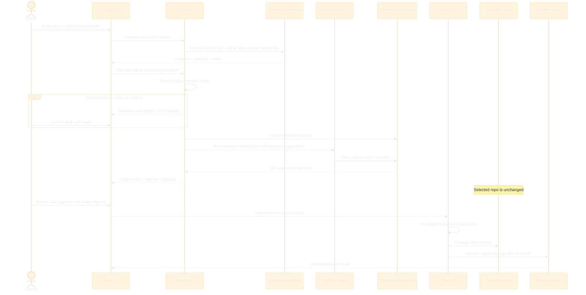
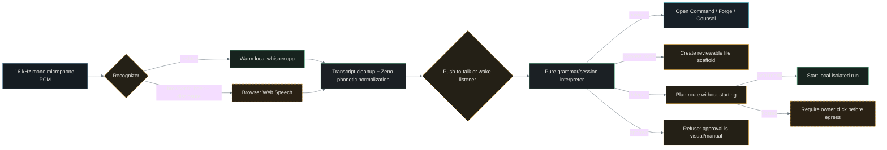

# Zeno study pack — current implementation

> **Implementation snapshot: 2026-09-10.** This guide explains the current Windows working tree. It
> does not award acceptance, turn a prototype into shipped behavior or convert a passing unit test
> into live-device evidence. The canonical ledger still controls acceptance status; see
> [Acceptance evidence](43-ACCEPTANCE-EVIDENCE.md).

Zeno is a local-first Windows desktop assistant with three surfaces over one governed effect path:
**Command** shows state and approvals, **Forge** runs coding agents in throwaway Git worktrees, and
**Counsel** captures consented microphone transcripts. The central invariant is simple: a model can
propose an effect, but it cannot approve its own effect.

## Reading order

This pack is the index. It explains how the pieces connect and links to the source or deeper design
when detail would otherwise be duplicated.

| Time | Read | Outcome |
|---:|---|---|
| 10 min | [README](../README.md) and [What is Zeno](37-WHAT-IS-ZENO.md) | Product purpose, status and boundaries |
| 25 min | This guide through **End-to-end flows** | Runtime architecture and how the three surfaces cooperate |
| 45–90 min | [Hands-on test guide](35-HOW-TO-TEST.md) | Exercise every current surface and retain evidence |
| 45 min | [Architecture and ADRs](12-architecture-and-adrs.md) plus [Threat model](13-threat-model-and-policy.md) | Target architecture, trust zones and why the gate exists |
| 60 min | [Kernel LLD](28-LLD-P1-01-policy-approval-kernel.md) then [executor LLD](30-LLD-P1-02-executor-worktree-adapter.md) | Classification, hash binding, one-attempt execution and receipts |
| Code deep dive | Follow the package/source map below | Trace implementation from UI event to receipt |
| Release review | [Acceptance evidence](43-ACCEPTANCE-EVIDENCE.md) | Separate tested clauses from unproved rows and known conflicts |

### Source-of-truth hierarchy

1. Current source, tests and retained live artifacts describe what exists.
2. [The test guide](35-HOW-TO-TEST.md) describes how to reproduce current behavior.
3. [Acceptance evidence](43-ACCEPTANCE-EVIDENCE.md) describes what remains unproved.
4. Requirements, prototypes and roadmaps describe intended behavior; they are not current-product
   evidence. In particular, `docs/10`–`27`, [the Phase 1 walkthrough](31-code-walkthrough.md),
   [the early roadmap](32-big-picture-and-roadmap.md), [the build plan](33-BUILD-PLAN.md), and status
   snapshots `34`, `38`–`42` contain historical or target-state material.

The interactive files in `docs/23`, `docs/28` and `docs/30` are design/LLD artifacts. The GIFs under
`docs/demos/` carry their own provenance; the Forge GIF shows an earlier approval policy and must not
be presented as the current workflow.

## Runtime architecture

```mermaid
%%{init: {'theme':'base','themeVariables':{'background':'#0d1114','primaryTextColor':'#ecebe6','lineColor':'#64717a'}}}%%
flowchart LR
  Owner([Owner]):::owner --> Desktop[Electron desktop shell]:::surface
  Desktop --> UI{Command · Forge · Counsel}:::surface
  UI --> Daemon[Loopback daemon<br/>nonce + owner token · SSE/API]:::core

  Voice[Microphone<br/>local Whisper or disclosed Web Speech]:::input --> VoiceCore[Wake + grammar interpreter]:::core
  VoiceCore --> Daemon
  Meeting[Supported meeting<br/>window title + microphone]:::input --> Counsel[Counsel transcript pipeline]:::surface
  Counsel --> Daemon

  Daemon --> Context[Run context<br/>ZENO.md + selected repo skills + cited Vault recall]:::memory
  Vault[(Vault Markdown notes<br/>keyword retrieval)]:::memory --> Context
  Context --> Route{Deterministic route}:::decision
  Route -->|loopback| Ollama[Ollama local model]:::local
  Route -->|explicit confirmation| Hosted[Claude Code or Codex CLI]:::egress

  Ollama --> Worktree[Throwaway Git worktree]:::isolation
  Hosted --> Worktree
  Worktree --> Capsule[Held proposal capsule<br/>diff + binding]:::decision
  Capsule --> Kernel[Policy/approval kernel]:::core
  Owner -->|clicks approve| Kernel
  Kernel --> Hand[One-attempt executor]:::core
  Hand --> Repo[(Selected repository)]:::store
  Hand --> Ledger[(Signed hash-chained receipt ledger)]:::store

  Daemon --> MCP[Bundled run-scoped Zeno MCP]:::core
  MCP --> Browser[Isolated browser / optional governed Chrome bridge]:::input

  classDef owner fill:#2aa5b8,stroke:#6ad8e8,color:#081014;
  classDef surface fill:#182027,stroke:#2aa5b8,color:#ecebe6;
  classDef core fill:#1b2024,stroke:#5bb98c,color:#ecebe6;
  classDef decision fill:#242016,stroke:#e0a128,color:#ecebe6;
  classDef memory fill:#1e1b2b,stroke:#9d83dc,color:#ecebe6;
  classDef isolation fill:#171d22,stroke:#88949d,color:#ecebe6;
  classDef input fill:#151c22,stroke:#5d8aa8,color:#ecebe6;
  classDef local fill:#17231e,stroke:#5bb98c,color:#ecebe6;
  classDef egress fill:#2a2114,stroke:#e0a128,color:#ecebe6,stroke-dasharray:6 4;
  classDef store fill:#161c18,stroke:#6d9f7e,color:#ecebe6;
```



The Electron shell owns lifecycle and trusted desktop bridges. The daemon is the process boundary:
it serves UI data, runs deterministic planning/routing, holds proposals and owns the gate. UI state is
never proof that an effect happened. The receipt is created after the executor returns, and the green
seal is rendered only from that receipt.

## Package and source map

| Package | Responsibility | Start here |
|---|---|---|
| `desktop` | Electron window, single instance, project choice, zoom, meeting presence, speech/Whisper lifecycle | [`main.cjs`](../packages/desktop/main.cjs), [`whisper.cjs`](../packages/desktop/whisper.cjs), [`meeting-presence.cjs`](../packages/desktop/meeting-presence.cjs) |
| `daemon` | Loopback API/SSE, surface orchestration, Forge routes, held work, memory routes | [`main.ts`](../packages/daemon/src/main.ts), [`server.ts`](../packages/daemon/src/server.ts), [`stream.ts`](../packages/daemon/src/stream.ts) |
| `kernel` | Risk policy, previews, approval binding, CAS revalidation, executor and signed ledger | [`kernel.ts`](../packages/kernel/src/kernel.ts), [`risk.ts`](../packages/kernel/src/risk.ts), [`ledger.ts`](../packages/kernel/src/ledger.ts) |
| `forge` | Provider registry, routing, headless runners, worktrees, tool permission bridge, browse/Chrome gates | [`routing.ts`](../packages/forge/src/routing.ts), [`runner.ts`](../packages/forge/src/runner.ts), [`worktree.ts`](../packages/forge/src/worktree.ts), [`permission-gate.ts`](../packages/forge/src/permission-gate.ts) |
| `assistant` | Ask Zeno snapshot, grounding and inert intent/delegation parsing | [`snapshot.ts`](../packages/assistant/src/snapshot.ts), [`ground.ts`](../packages/assistant/src/ground.ts), [`intent.ts`](../packages/assistant/src/intent.ts) |
| `voice` | Pure wake, retention, grammar and session state used by the UI | [`listen.ts`](../packages/voice/src/listen.ts), [`wake.ts`](../packages/voice/src/wake.ts), [`grammar.ts`](../packages/voice/src/grammar.ts) |
| `counsel` | Transcript model, deterministic extraction, cited rendering, library and grounded Q&A | [`transcript.ts`](../packages/counsel/src/transcript.ts), [`extract.ts`](../packages/counsel/src/extract.ts), [`ask.ts`](../packages/counsel/src/ask.ts) |
| `vault` | Markdown notes, durable memory kinds, keyword recall, governed writes and run context | [`vault.ts`](../packages/vault/src/vault.ts), [`memory.ts`](../packages/vault/src/memory.ts), [`context.ts`](../packages/vault/src/context.ts) |
| `sanitizer` | Secret-pattern detection and redaction before registered sinks | [`sanitize.ts`](../packages/sanitizer/src/sanitize.ts), [`patterns.ts`](../packages/sanitizer/src/patterns.ts) |
| `skills` | Parse, screen, catalog and select repository skills | [`parse.ts`](../packages/skills/src/parse.ts), [`screen.ts`](../packages/skills/src/screen.ts), [`select.ts`](../packages/skills/src/select.ts) |
| `mcp` | Model-facing RPC server with bounded Zeno tools | [`server.ts`](../packages/mcp/src/server.ts), [`rpc.ts`](../packages/mcp/src/rpc.ts) |
| `browse` | Fresh isolated Chromium session and bounded browser protocol | [`protocol.ts`](../packages/browse/src/protocol.ts), [`host-node.ts`](../packages/browse/src/host-node.ts) |
| `chrome-bridge` | Optional owner Chrome bridge, origin allowlist and native host contract | [`origins.ts`](../packages/chrome-bridge/src/origins.ts), [`protocol.ts`](../packages/chrome-bridge/src/protocol.ts), [`desk.ts`](../packages/chrome-bridge/src/desk.ts) |
| `intake` | Local/GitHub read-only work sources and backlog records | [`backlog.ts`](../packages/intake/src/backlog.ts), [`github.ts`](../packages/intake/src/github.ts) |
| `mesh` | Pairing, sealed envelopes and convergent protocol core; no mobile client | [`pairing.ts`](../packages/mesh/src/pairing.ts), [`envelope.ts`](../packages/mesh/src/envelope.ts), [`replica.ts`](../packages/mesh/src/replica.ts) |
| `cli` | Demo, proposal, backlog and ledger-verification commands | [`main.ts`](../packages/cli/src/main.ts), [`demo.ts`](../packages/cli/src/demo.ts), [`verify.ts`](../packages/cli/src/verify.ts) |

The browser surfaces are in [`packages/daemon/public`](../packages/daemon/public/): `app.js` coordinates
state, `field.js` renders the Standing Field, `forge.js` owns the IDE/agent UI, `voice.js` connects
speech to the pure voice package, and the Counsel modules render meeting flows.

## End-to-end flows

### 1. Launch and ownership

1. `npm run app` starts Electron.
2. Electron selects a project, creates/opens the Zeno data directory and starts one loopback daemon.
3. The desktop injects a nonce-bearing URL and owner token through a context-isolated preload.
4. A second desktop launch focuses the existing owner window. Two daemons must not append to the same
   workspace ledger.
5. Closing the last window closes speech and child processes.

The owner token marks the human UI role. It is not model authority. Model-facing paths receive a
smaller capability surface and cannot call the owner approval route.

### 2. Command, Ask Zeno and the Standing Field

Command reads daemon state, work sources, Forge status, meetings and Vault data. Stream signals tell
the page to re-read canonical endpoints; a signal itself is not state. A failed endpoint is shown as
unread/unknown, never converted into a healthy zero.

Ask Zeno builds a bounded snapshot, asks the configured local model when available and grounds claims
against returned source records. A useful answer cites those records. If the evidence does not support
the answer, the UI must show the result as ungrounded rather than invent a citation.

The Standing Field is a spatial index over the same real endpoints. It does not contain demo nodes.
See **What every Field node means** below.

### 3. Forge: task to reviewed repository change



The context order is deliberate: sanitized project `ZENO.md`, bounded cited Vault memory, selected
repository skills, then the owner's current task last. The task remains authoritative. Lens previews
the exact context and its hash; if task, memory choice or skill selection changes, the old preview is
stale and must not reach a provider.

Automatic routing is deterministic and displays its reason. A local model uses Ollama over loopback.
Claude Code and Codex are hosted egress paths and require confirmation bound to the exact task and
route. Manual routing exposes provider, model and effort. Provider effort labels are not assumed to
have identical numeric meaning.

Each agent run gets a throwaway Git worktree. Chat-only output can finish with no files. File output
must parse into the expected edit contract; malformed or truncated output is rejected. Changed files
become held capsules and the selected repository stays untouched until the owner approves. A failed
run can still return partial files for review, but must label them partial.

Forge can display up to eight separate Agent sessions, each with its own chat, route and history.
That UI separation is not proof of unlimited parallel execution; record the daemon/provider's current
concurrency result during testing. The Agent view is chat-focused. Editor view adds the repository,
code pane, resizable session panel and bottom drawer.

### 4. Voice to Command and Forge



In the desktop path, the renderer captures bounded WAV segments and the preload sends them to a local
whisper.cpp server on a random loopback port. The preferred model is
`ggml-large-v3-turbo-q5_0.bin`; capture is mono PCM16 at 16 kHz, the WAV cap is about 37.5 seconds,
and one inference has a 45-second deadline. Counsel may add a bounded meeting title/participant
vocabulary prompt. That prompt is vocabulary, not an instruction channel.

Push-to-talk opens the microphone while held. Wake mode is opt-in, keeps the microphone open, shows a
persistent bar and waits for a transcribed Zeno phrase. It is not an acoustic wake-word model. The
current listener retains up to 15 seconds of untriggered transcript in memory and drops it when wake
mode turns off; this conflicts with the two-second acceptance target.

Voice can navigate, propose a scaffold or plan/delegate a coding task. It cannot approve. A local
delegation may start after the route is shown; a hosted delegation waits for a click because it sends
context off-machine and may cost money. `add_task` is currently an acknowledged but unwired voice
intent. There is no speaker identity, owner voice learning, diarization or reliable separation of a
call from room noise.

### 5. Counsel: meeting presence to cited notes

Counsel asks the trusted Electron bridge for recognized Zoom, Teams, Google Meet, Slack, Discord and
Webex window titles. The bridge requests zero-sized thumbnails and returns titles, not screenshots.
The owner chooses a title, confirms microphone consent and can always choose manual microphone capture.

Immediately before starting, Counsel verifies that the exact selected title still exists. During a
capture it rechecks every 15 seconds. Losing the window changes the attachment state; it does not
silently stop a microphone session. Capture is microphone-only: no system audio, no remote-speaker
channel and no proof that the owner actually joined the call.

Saved calls are sanitized local Markdown. Audio is not retained. The extraction layer produces
decisions, actions and questions only with transcript-line citations. Speaker labels are owner-supplied
or unknown; automatic diarization is absent. Grounded Q&A cites saved calls or declares itself
ungrounded.

### 6. Vault and memory across chats

The Vault stores readable Markdown plus frontmatter. Durable memory is not a separate hidden database:
a note tagged `memory` and `kind:fact|decision|preference|convention|question` is a memory record.
The owner may write directly. An agent memory write is an effect and follows the proposal/gate path.

Recall is local field-weighted keyword scoring over titles, descriptions, tags and bodies. It returns
matched terms and citations and currently caps Forge recall to five task-relevant records. There is no
embedding provider, vector database or OpenAI embedding key. This keeps cost and egress at zero, with
the trade-off that semantic paraphrases can be missed.

Memory crosses Forge chats/runs only through these durable Vault notes. Raw chat history is not silently
promoted into memory. Each Forge session can disable recall. `ZENO.md` at the selected project root is
read separately as standing project context; Zeno does not search parent directories or substitute
`CLAUDE.md`/`AGENTS.md`. Both project context and memory are framed as untrusted records that cannot
authorize an effect.

### 7. MCP, isolated browsing and the owner Chrome bridge

The model-facing Zeno MCP server exposes bounded read/propose capabilities and no approval capability.
Forge reports the bundled, run-scoped capability set; ambient external MCP servers are not attached.

Isolated browsing uses a fresh Chromium profile with no owner cookies, extensions or signed-in state.
Operations cross the same permission boundary. The separate Chrome bridge can reach the owner's
existing browser only when its environment switch, MV3 extension, native host and origin allowlist are
configured, and each operation still requires approval. It is off by default.

## What every Standing Field node means

| Node | Appears when | Meaning and action |
|---|---|---|
| Zeno core | Always | Coordinating daemon and effect gate; it neither proposes nor approves. |
| Command / Forge / Counsel | Always | Real product surfaces; clicking opens that surface. |
| This PC | Always | Current Windows device. Mesh trust is per device; no second device is implied. |
| Repository | `/forge/status` reports one | Selected sandbox repository, branch/head and real dirty count. Active glow means reported changes. |
| Work source | `/work` returns it | Read-only intake source. Failed/partial sources are visibly degraded. A configured off-machine source has an egress edge. |
| Pending action | `/state.pending` contains it | Exact proposal waiting for owner review or refused by policy. Opening never approves. |
| Backlog item | `/work.items` contains it | Assigned/read-only work, not proof that an agent is executing it. |
| Receipt | Recent ledger entry exists | Verified or failed recorded outcome. A seal comes from the receipt, not the click. |
| Vault | `/memory` answers | Governed local note store. No node is drawn when the store cannot be read. |
| Memory note | Returned in the current bounded note page | Fact at rest with source/tags; it is not a task or authority. |
| Meeting | Saved Counsel record exists | Local transcript-derived record with counts and timestamp. |
| Local models | `/forge/agents` reports installed Ollama models | Loopback runtime. Its edge is local, never egress. |
| Model | One of the first reported installed local models | Locally installed and selectable in Forge. Hosted model selections are shown in Forge run details, not as Field model nodes. |

Attention colors are semantic: cyan is active, amber needs the owner, red is blocked/error, green is
verified and grey is waiting. Reduced-motion mode removes pulse without removing labels. The 2D/list
alternatives must expose the same nodes. When source reads fail, an empty Field means unknown, not
quiet.

## Forge capability boundary

| Area | Current implementation | Current boundary |
|---|---|---|
| Modes | Agent/chat view and Editor/IDE view | Separate views share governed runs; no claim of feature parity with VS Code/Cursor/Devin |
| Layout | Explorer, code pane, bottom drawer and Session panel; side panes toggle/resize | State is local to the window/device |
| Explorer | Nested chevrons, file open, search, source status, panels for extensions, skills, MCP, tests, debug, task board | Long files can be truncated by the bounded file route |
| Editor | Monaco, themes, rainbow brackets, save-to-proposal | TypeScript/JavaScript syntax diagnostics only; project checks run through scripts |
| Extensions | Monaco + Zeno themes/rainbow brackets; catalogs repository/global skills and `.code-snippets` manifests | No VSIX/Marketplace/external extension host; global skills are visible but only repository skills are selectable; snippets are not injected |
| Terminal | Up to six history tabs, real owner commands, exit/duration/stdout/stderr | One-shot non-PTY, 30-second limit, bounded output, no shell-state persistence |
| Tests | Discovers repository-declared safe npm-compatible scripts and executes selected script | No arbitrary browser-provided command/args |
| CI / Debug | Explicit unavailable panels | No CI integration or debugger/attach route |
| Agents | Local Ollama, Claude Code and Codex provider registry; model/effort picker; auto/manual routing | Provider availability depends on installed CLIs/runtime; local model output is best-effort |
| Sessions | Up to eight independent UI agent sessions | Visible sessions do not promise unconstrained parallel provider execution |
| Context | Lens preview, per-session memory toggle, selected repo skills, hash-bound context | Only root `ZENO.md`; bounded Vault recall; stale context is refused |
| MCP/connectors | Bundled, strict, run-scoped Zeno MCP facts | No ambient external MCP host or generic connector marketplace |

## Model, privacy and cost choices

| Path | Data path | Cost posture | When to choose | Failure to expect |
|---|---|---|---|---|
| Ollama `qwen3:8b` | Selected context stays on loopback | No API fee; local compute/electricity | Small chat/code work and private context; current default | Strict edit parse failure, timeout or weaker reasoning |
| Larger local model | Loopback | No API fee; more RAM/VRAM/time | Hardware can keep it responsive and task benefits | Bounded run deadline can expire |
| Claude Code | Context leaves through Anthropic CLI after confirmation | Provider/account dependent | Higher-capability hosted coding | Missing CLI/auth/network, provider error or cost |
| Codex | Context leaves through Codex CLI after confirmation | Provider/account dependent | Higher-capability hosted coding | Missing CLI/auth/network, provider error or cost |
| Local Whisper | Microphone audio stays on device | No API fee; local compute; runtime/model separately installed | Private speech on supported Windows hardware | Runtime/model missing, startup/inference timeout, recognition error |
| Browser Web Speech | Microphone audio may go to browser maker | Browser/provider policy | Explicit fallback when local runtime is absent | Network/provider retention and inconsistent accuracy |
| Vault keyword recall | Local Markdown and CPU scoring | Free; no embedding key | Transparent task-relevant memory | Missed paraphrases/no semantic vectors |

Automatic routing reduces manual choice; it does not remove consent. Sensitive work must not silently
fall back to hosted execution. Always inspect the displayed provider, model, effort, route reason and
hosted disclosure before treating a run as evidence.

## TypeScript and system-design concepts used

| Concept | Why Zeno uses it | Concrete implementation |
|---|---|---|
| Discriminated unions | Exhaustive intent, action and result handling without stringly typed branches | [`packages/voice/src/grammar.ts`](../packages/voice/src/grammar.ts), [`packages/kernel/src/types.ts`](../packages/kernel/src/types.ts) |
| Pure functions / functional core | Policy, wake matching, hashing and parsing remain deterministic and unit-testable | [`packages/kernel/src/risk.ts`](../packages/kernel/src/risk.ts), [`packages/voice/src/wake.ts`](../packages/voice/src/wake.ts) |
| Ports and adapters | Filesystem, clock, signing, Git and providers sit behind interfaces so policy has no hidden I/O | [`packages/kernel/src/executor.ts`](../packages/kernel/src/executor.ts), [`packages/forge/src/runner.ts`](../packages/forge/src/runner.ts) |
| Capability security | Give model code only the smallest run-scoped tool surface; absence of approve is a boundary | [`packages/mcp/src/server.ts`](../packages/mcp/src/server.ts), [`packages/forge/src/permission-gate.ts`](../packages/forge/src/permission-gate.ts) |
| State machine | Voice/wake and action lifecycle make illegal transitions explicit | [`packages/voice/src/listen.ts`](../packages/voice/src/listen.ts), [`packages/kernel/src/kernel.ts`](../packages/kernel/src/kernel.ts) |
| Compare-and-swap binding | Approval is bound to the previewed base so changed world state refuses stale execution | [`packages/kernel/src/kernel.ts`](../packages/kernel/src/kernel.ts), [`packages/kernel/src/hash.ts`](../packages/kernel/src/hash.ts) |
| Append-only hash chain | Every outcome links to the previous receipt and detects ledger alteration | [`packages/kernel/src/ledger.ts`](../packages/kernel/src/ledger.ts), [`packages/kernel/src/signer.ts`](../packages/kernel/src/signer.ts) |
| At-most-one attempt | Revalidation happens before execution and the executor is invoked once per committed action | [`packages/kernel/src/kernel.ts`](../packages/kernel/src/kernel.ts) |
| Process isolation | Agent runs edit a disposable worktree rather than the selected repository | [`packages/forge/src/worktree.ts`](../packages/forge/src/worktree.ts), [`packages/forge/src/runner-node.ts`](../packages/forge/src/runner-node.ts) |
| Fail-closed parsing | Unknown/malformed model edits, tools, paths and provider output are rejected | [`packages/forge/src/tools.ts`](../packages/forge/src/tools.ts), [`packages/forge/src/permission.ts`](../packages/forge/src/permission.ts) |
| Context hashing | Lens and execution use the same reviewed task/memory/skills input; changed input invalidates preview | [`packages/daemon/public/forge-context-model.js`](../packages/daemon/public/forge-context-model.js), [`packages/daemon/src/memory-context.ts`](../packages/daemon/src/memory-context.ts) |
| Event notification + canonical reread | SSE signals freshness while endpoints remain the source of truth | [`packages/daemon/src/stream.ts`](../packages/daemon/src/stream.ts), [`packages/daemon/public/app.js`](../packages/daemon/public/app.js) |
| Bounded resources | Length, output, timeout, file and page caps prevent unbounded agent/browser/process behavior | [`packages/daemon/src/server.ts`](../packages/daemon/src/server.ts), [`packages/desktop/whisper.cjs`](../packages/desktop/whisper.cjs) |
| Dependency inversion | Node-specific filesystem/process code wraps portable core logic | `*-node*.ts` adapters beside core modules in kernel, vault, forge and intake |
| Local-first readable storage | Markdown/frontmatter keeps memory inspectable and editable without Zeno | [`packages/vault/src/note.ts`](../packages/vault/src/note.ts), [`packages/vault/src/vault-node-fs.ts`](../packages/vault/src/vault-node-fs.ts) |
| Grounded generation | Assistant and Counsel answers carry source references or admit missing grounding | [`packages/assistant/src/ground.ts`](../packages/assistant/src/ground.ts), [`packages/counsel/src/ask.ts`](../packages/counsel/src/ask.ts) |
| Progressive disclosure | Product UI exposes common actions first and preserves explicit unavailable/degraded states | [`packages/daemon/public/forge.js`](../packages/daemon/public/forge.js), [`packages/daemon/public/field.js`](../packages/daemon/public/field.js) |

For the cryptographic and policy reasoning, continue with the two LLD documents rather than duplicating
their proof obligations here.

## Testing, packaging and evidence

The canonical automated gate is:

```powershell
npm install
npm run check
npm run build
```

Then follow [the hands-on test guide](35-HOW-TO-TEST.md). It covers lifecycle, every Command/Field
control, Forge local/hosted/chat/edit/context/cancel flows, terminal/tests, both speech paths, Counsel,
Vault, MCP/browser bridges, receipts and clean installation.

`npm run build:app` creates Windows portable and NSIS artifacts under `dist-app/`. A local build does
not prove a clean install, signing, updater, Whisper provisioning or public deployment. The current
product is local Windows software; there is no website/cloud deployment to mark live.

For every acceptance claim retain the commit plus dirty status, environment, exact command/journey,
expected and observed results, output, screenshots/recording, receipt/hash where relevant, skips and
artifact paths. Automated coverage proves only the clauses it exercises. The current conflicts and
evidence gaps remain in [Acceptance evidence](43-ACCEPTANCE-EVIDENCE.md).

## Current limitations to remember

- Voice has no speaker biometric, personal learning, acoustic wake model or call/noise separation.
- Wake mode currently retains up to 15 seconds of untriggered transcript; the acceptance target says
  at most two seconds.
- Counsel uses meeting-window-title presence and microphone capture only. It has no system audio,
  remote-speaker channel, proof of participation or automatic diarization.
- Voice `propose_write` creates a scaffold; voice `add_task` is not wired.
- Local model file edits are best-effort and must pass the strict output parser. A model can answer
  successfully with no file changes when the task is chat-only.
- Forge has no VSIX/Marketplace extension host, snippet injection, CI runner, debugger or persistent
  interactive PTY. Only repository skills are selectable.
- Forge uses bundled run-scoped MCP capabilities and ignores ambient external MCP servers.
- Multiple Agent sessions isolate UI history; verify provider concurrency rather than assuming all
  visible sessions execute at once.
- Vault recall uses keyword scoring, not embeddings. It is free and transparent but not semantic.
- Mesh has protocol code and simulated-device tests, but no phone application.
- No Sentry/PostHog/remote telemetry dashboard is wired. The signed audit ledger is accountability,
  not product analytics.
- There is no macOS product or public cloud deployment in the current scope.
- Canonical acceptance rows remain open until all row-specific evidence exists.

## Interview review questions

Use these to verify that you can explain the system rather than memorize file names:

1. Why is “the model cannot call approve” stronger than prompting the model to ask first?
2. What exactly is bound into an approval hash, and why does revalidation happen after the click?
3. Why does Forge need a throwaway worktree if file proposals still require owner approval?
4. How can a failed run return useful partial files without calling the run successful?
5. Why does Lens hash task, memory choice and selected skills before a provider runs?
6. How does Zeno keep Vault memory useful across runs without making it instruction authority?
7. What accuracy/cost/privacy trade-off comes from keyword memory instead of embeddings?
8. Why is Ollama a local Field edge while Claude Code/Codex are egress?
9. What does a Counsel window-title match prove, and what does it explicitly fail to prove?
10. Why does wake-word detection after transcription fail to identify the owner or isolate call audio?
11. What is the difference between an SSE state signal and canonical state?
12. Why are terminal tabs not PTYs, and which workflows therefore cannot work today?
13. Which Forge features are real IDE capabilities and which familiar VS Code/Cursor features are
    intentionally reported unavailable?
14. What evidence would be needed before changing one canonical acceptance row from `not-started`?
