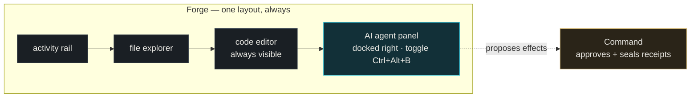

# Zeno study pack — the Forge agent panel & GPU-gated multi-model Compare

> **Living document. Snapshot: 2026-09-12.** This pack explains two in-progress UI changes to
> **Forge** — (1) making the AI agent a *docked side panel* instead of a full-screen mode, and
> (2) a **Compare** feature that runs several local models on one task *at the same time*, but only
> when the GPU can actually hold them. It is written for a reader who has never seen the codebase.
> Design fidelity is measured against the design artifact `b551a806`. The code walkthrough (exact
> file/line references) is filled in *after* each change lands and is verified live — this doc records
> the **decisions and the "why"** first, because those are what a newcomer needs to not get lost.

---

## 1. The one-paragraph mental model

Zeno has **three surfaces** that share one governed "nothing happens without your approval" path:

| Surface | Its one job | Newcomer analogy |
|---|---|---|
| **Command** | The *conversation* + approvals. You talk to Zeno, it proposes effects, you approve them, and every approval is sealed into a signed receipt chain. | A governed chat / control room. |
| **Forge** | The *code*. A real IDE — file tree, editor, terminal — with an AI coding agent docked beside the editor. | VS Code with a Cascade/Copilot panel. |
| **Counsel** | The *meeting notebook*. Consent-first local transcription. | A note-taker that never talks back mid-call. |

The invariant that makes Zeno *Zeno*: **a model can propose an effect, but it can never approve its
own effect.** Approvals live in Command; Forge only proposes.

---

## 2. Why the Forge agent is a *panel*, not a *mode*

### The problem a beginner would trip over

Earlier, Forge had an **"Agent | Editor" switcher** in its top bar. "Agent" swapped the whole window
over to a full-screen chat and *hid the editor*; "Editor" showed the code. That felt natural at first
(it copied [Devin](https://devin.ai)'s layout), but it created a subtle duplication:

- **Command already is a full-screen chat with approvals.**
- So a *second* full-screen chat inside Forge was the same shape in two places. A user reasonably
  asked: *"we already have chats in Command — what is this one for?"*

### Why Devin can do it but Zeno shouldn't

Devin's "Agent" tab is full-screen because Devin has **no separate governance console** — its agent
view *is* its command centre. Zeno *does* have one (Command). So a full-screen agent in Forge isn't a
feature; it's a clone of Command. The fix is to give each surface exactly one job.

### The decision (what we build)

**Forge shows the editor and the agent at the same time.** The agent is a **docked panel on the
right** — the "secondary side bar", exactly like VS Code / Windsurf's Cascade. You can toggle it
open/closed; you never *switch away from the editor to reach it*.



**What that means in code terms (high level):**

- There is **no `mode`** anymore. The old app mirrored a `S.view` state onto a root attribute
  `data-forge-view="agent"` and hid the editor with CSS. All of that is removed.
- The panel is toggled by the existing pane control **and** a new keyboard shortcut **Ctrl+Alt+B**
  (the same idea as VS Code's "toggle secondary side bar").
- Forge **boots straight into an active session** so the agent panel already shows a real
  conversation (plan → tool actions → the approval card), not an empty shell.

**Bonus: this removes code.** Deleting the full-screen mode takes out ~300 lines of layout
machinery plus ~22 lines of CSS classes that nothing used — a real simplification, not just a
re-skin.

> Design-fidelity note: the *content* of the agent panel still follows the best-in-class patterns
> (tool-cards like "Edited src/ingest.ts", a diff card, an approval capsule). We kept the good ideas
> from Devin/Cascade — we just stopped letting the agent hide the editor.

---

## 3. Compare: running several models at once — honestly

### What the user asked for

> "we should be able to run multi models and compare **if the GPU supports it** — show that."

So **Compare** is a real capability, not a mock: give one task to *several* local models, watch them
work **side by side**, and compare the diffs they produce. The catch is the phrase *"if the GPU
supports it."*

### Why the GPU is the whole story (the part beginners miss)

A local model has to be **loaded into the GPU's video memory (VRAM)** to run fast. Your machine has a
fixed VRAM budget. Running two models *at the same time* means *both* sets of weights sit in VRAM
*together*. If they don't both fit, they can't truly run in parallel — the runtime would have to
unload one and reload the other (which is just *sequential*, slowly).

So Compare must **measure before it promises.** It looks at:

1. **How much VRAM the GPU has**, and
2. **How much VRAM each chosen model needs**,

and only offers *true parallel* when the sum fits. Otherwise it says so plainly and runs the models
**one after another** — it never *pretends* to run them together.

### The real numbers on this machine (why the gate actually bites)

Measured on 2026-09-12 (`nvidia-smi` + Ollama `/api/tags`):

| Thing | Value |
|---|---|
| GPU | **NVIDIA RTX 3080 · 12 GB VRAM** |
| `qwen3:4b` (Q4_K_M) | ~2.5 GB |
| `qwen3:8b` (Q4_K_M) | ~5.2 GB |
| `qwen3:14b` (Q4_K_M) | ~9.3 GB |

Reserve ~1.5 GB for the OS, the KV cache and the context window, so ~10.5 GB is usable for weights:

| You pick… | Needs | On a 12 GB card |
|---|---|---|
| `4b` + `8b` | ~7.7 GB | ✅ **runs in parallel** |
| `8b` + `14b` | ~14.5 GB | ❌ too big → **sequential** |
| `4b` + `8b` + `14b` | ~17 GB | ❌ → **sequential** |
| `14b` alone | ~9.3 GB | ✅ fits (single) |

This is why the feature is worth building honestly: on *this* card the answer genuinely changes
depending on which models you choose.

### How Compare decides (plain-language algorithm)

```
budget      = GPU total VRAM  − reserve (~1.5 GB)
needed      = sum of (each selected model's VRAM footprint)
if needed <= budget:      offer "Run in parallel"   (green)
elif needed <= GPU total: offer parallel but warn    (amber — tight, no headroom)
else:                     only "Run sequentially"    (red — GPU can't hold them at once)
```

Where the numbers come from (the backend, being built):

- **GPU budget** → Ollama's own `/api/ps` (reports `size_vram` of loaded models) first; fall back to
  `nvidia-smi --query-gpu=memory.total,memory.free --format=csv,noheader,nounits`; and if *neither*
  is available (no NVIDIA GPU, CPU-only), Compare degrades gracefully to sequential and says why.
- **Per-model footprint** → Ollama's `/api/tags` `size` field (the on-disk weight size is a good
  VRAM baseline), refined by `/api/show` where useful.

### What the panel shows

A small **VRAM meter** inside the Compare picker: the GPU's budget as a bar, each selected model as a
filled segment, and a running total with a verdict — *"7.7 / 10.5 GB — fits, runs in parallel"* or
*"14.5 GB — exceeds 12 GB, will run sequentially."* The colour (green/amber/red) is **always paired
with text**, never colour alone (see accessibility below).

---

## 4. Accessibility & responsiveness (WCAG notes)

These are requirements, not afterthoughts:

- **Never colour alone.** The VRAM verdict pairs its green/amber/red with words ("fits" / "tight" /
  "won't fit") and a number, so a red-green colour-blind user reads the same answer. *(WCAG 1.4.1 Use
  of Color.)*
- **Keyboard-operable.** The agent panel toggles with **Ctrl+Alt+B**; every control in the panel and
  the Compare picker is reachable by Tab and has a visible focus ring. *(WCAG 2.1.1 Keyboard,
  2.4.7 Focus Visible.)*
- **Honest, specific labels.** Buttons say what will happen ("Run in parallel", "Run sequentially"),
  and the disabled state explains *why* it's disabled ("GPU can't hold both models at once") rather
  than just greying out. *(WCAG 3.3.2 Labels or Instructions.)*
- **Responsive.** The docked agent panel and the right-hand context rail collapse below narrow
  breakpoints so the editor never scrolls sideways; the Compare columns stack when the window is
  small. *(WCAG 1.4.10 Reflow.)*
- **Respect reduced motion.** Any live "working…" animation honours `prefers-reduced-motion`.

---

## 5. Where this sits in the codebase (map — line detail follows once the code lands)

| Concern | File(s) |
|---|---|
| Forge layout, panels, toggles, keybindings | `packages/daemon/public/forge.js` |
| All Forge CSS (inline) | `packages/daemon/public/index.html` |
| Local model list / Ollama calls / GPU capability (new) | `packages/daemon/src` (daemon) |
| The design source of truth | design artifact `b551a806` |

## 6. Open questions / not yet done

- Backend endpoint for GPU capability + concurrent runs is **in design** (spec being produced); the
  UI meter is built against real numbers but the *live* concurrent run wiring is the larger piece.
- Line-by-line code walkthrough for both changes: **to be appended** after each lands and is verified
  on a live daemon.

---

*This document is updated as the work proceeds; treat the "Snapshot" date as its currency.*
